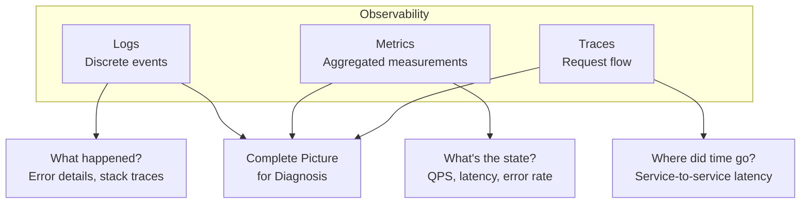

# 01 — Foundational Concepts

> The vocabulary, mental models, and invariants that underpin every distributed system design decision.

**Prerequisites:** None  
**Builds toward:** All other modules  
**Estimated study time:** 3–4 hours  
**Review frequency:** Weekly during active preparation

---

## Document Navigation

| Section | Focus | Interview Relevance |
|---------|-------|---------------------|
| [1. The Four Pillars](#1-the-four-pillars-of-distributed-systems) | Core properties we optimize for | Foundation for every design discussion |
| [2. Scalability](#2-scalability) | Growing system capacity | "How would you handle 10x traffic?" |
| [3. Availability](#3-availability) | Uptime and accessibility | "What's your SLA strategy?" |
| [4. Reliability](#4-reliability) | Correctness under failure | "How do you prevent data loss?" |
| [5. Efficiency](#5-efficiency-latency--throughput) | Performance optimization | "How do you reduce latency?" |
| [6. CAP Theorem](#6-cap-theorem) | Fundamental distributed trade-off | "Explain CAP and its implications" |
| [7. PACELC Theorem](#7-pacelc-theorem) | Extended consistency trade-offs | "What about when there's no partition?" |
| [8. Functional vs Non-Functional](#8-functional-vs-non-functional-requirements) | Requirements classification | "What are your constraints?" |
| [9. Back-of-Envelope Estimation](#9-back-of-envelope-estimation) | Quantitative reasoning | "Estimate the storage needs" |
| [10. Serviceability](#10-serviceability-and-manageability) | Operational concerns | "How do you debug in production?" |

---

## 1. The Four Pillars of Distributed Systems

Every distributed system design is fundamentally a negotiation among four core properties. Understanding their interdependencies is essential for articulating trade-offs in interviews.


### The Core Insight

**System Invariant:** You cannot maximize all properties simultaneously. Every design decision trades one property for another.

| If You Optimize For... | You Often Sacrifice... | Example |
|------------------------|------------------------|---------|
| Maximum availability | Consistency (during partitions) | Cassandra accepting writes during partition |
| Strong consistency | Availability and latency | Spanner waiting for global replication |
| Low latency | Durability (sync writes) | Redis with async persistence |
| High throughput | Per-request latency (batching) | Kafka batching messages |

### Mental Model: The System Design Compass

Before diving into any design, orient yourself:

```
                     CONSISTENCY
                          ↑
                          |
     AVAILABILITY ←———————+———————→ EFFICIENCY
                          |
                          ↓
                     SCALABILITY
```

**Interview Pattern:** When asked to design a system, first establish which direction on this compass the requirements pull you.

---

## 2. Scalability

### Definition

Scalability is the capability of a system to handle a growing amount of work by adding resources proportionally. A truly scalable system maintains performance characteristics as load increases.

**Key Distinction:**
- **Scalable:** 2x resources → 2x capacity (linear scaling)
- **Not scalable:** 2x resources → 1.5x capacity (diminishing returns)

### The Two Dimensions of Scaling


### Detailed Comparison

| Dimension | Vertical Scaling | Horizontal Scaling |
|-----------|------------------|-------------------|
| **Mechanism** | Add CPU, RAM, storage to existing machine | Add more machines to the pool |
| **Upper Bound** | Hardware ceiling (~256 cores, ~12TB RAM as of 2024) | Theoretically unlimited |
| **Failure Mode** | Single point of failure | Partial degradation |
| **State Management** | Trivial (single machine) | Complex (distributed state) |
| **Cost Curve** | Exponential (premium hardware) | Linear (commodity hardware) |
| **Downtime for Scaling** | Usually required | Zero with proper orchestration |
| **Application Changes** | None | May need redesign (stateless, sharding) |
| **Network Overhead** | None | Significant (serialization, latency) |

### Scaling Decision Framework


### Scalability Patterns by Component

| Component | Vertical Strategy | Horizontal Strategy |
|-----------|-------------------|---------------------|
| **Web servers** | Bigger instance | Add servers behind LB |
| **Application servers** | Bigger instance | Add instances (stateless) |
| **Database (reads)** | Better hardware, indexes | Read replicas |
| **Database (writes)** | Better hardware | Sharding/partitioning |
| **Cache** | More RAM | Distributed cache (Redis Cluster) |
| **File storage** | Bigger disk | Distributed storage (S3, HDFS) |

### Interview Prompt & Strong Answer

> **Q: "When would you choose vertical over horizontal scaling?"**

**Framework Answer:**

"I'd choose **vertical scaling** when:
1. **Speed matters** — it's faster to upgrade than redesign
2. **State is complex** — e.g., relational database with many JOINs
3. **Workload is predictable** — we know the ceiling we need
4. **Cost isn't exponential yet** — commodity sizes are sufficient

I'd choose **horizontal scaling** when:
1. **Fault tolerance is required** — no single point of failure
2. **Growth is unbounded** — we can't predict the ceiling
3. **Workload is parallelizable** — stateless, independent requests
4. **Cost efficiency at scale** — commodity hardware is cheaper

**The key insight:** Vertical scaling is simpler but has a ceiling. Most production systems eventually need horizontal scaling, which requires designing for distribution from the start—stateless services, externalized state, and partitioning strategies."

---

## 3. Availability

### Definition

Availability is the proportion of time a system is operational and accessible when needed. It's measured as a percentage of uptime over a given period.

```
                    Uptime
Availability = ─────────────────
               Uptime + Downtime
```

### The Nines of Availability

| Availability | Common Name | Downtime/Year | Downtime/Month | Downtime/Week | Typical Use Case |
|--------------|-------------|---------------|----------------|---------------|------------------|
| 99% | Two nines | 3.65 days | 7.31 hours | 1.68 hours | Internal tools, batch jobs |
| 99.9% | Three nines | 8.76 hours | 43.8 minutes | 10.1 minutes | Business applications |
| 99.95% | Three and a half | 4.38 hours | 21.9 minutes | 5.04 minutes | E-commerce, SaaS |
| 99.99% | Four nines | 52.6 minutes | 4.38 minutes | 1.01 minutes | Financial systems |
| 99.999% | Five nines | 5.26 minutes | 26.3 seconds | 6.05 seconds | Critical infrastructure |
| 99.9999% | Six nines | 31.5 seconds | 2.63 seconds | 0.6 seconds | Life-critical systems |

### Availability Math for Distributed Systems

**Serial Components (all must work):**
```
A_total = A₁ × A₂ × A₃ × ... × Aₙ

Example: Web → App → DB (each 99.9%)
A = 0.999 × 0.999 × 0.999 = 99.7%
```

**Parallel Components (any one works):**
```
A_total = 1 - (1 - A₁) × (1 - A₂) × ... × (1 - Aₙ)

Example: Two load balancers (each 99.9%)
A = 1 - (0.001 × 0.001) = 99.9999%
```


### Single Points of Failure (SPOF)

**System Invariant:** Any component whose failure causes system-wide failure is a SPOF and must be eliminated for high availability.

| Common SPOF | Mitigation Strategy | Trade-off |
|-------------|---------------------|-----------|
| Single database | Primary-replica replication | Consistency lag, cost |
| Single load balancer | Active-passive or active-active pair | Complexity, cost |
| Single data center | Multi-region deployment | Latency, complexity |
| Single DNS provider | Multiple DNS providers | Management overhead |
| Single network path | Multiple ISPs/paths | Cost |
| Single deployment | Blue-green or canary deployment | Operational complexity |

### High Availability Architecture Patterns


### Availability vs Reliability: Critical Distinction

| Aspect | Availability | Reliability |
|--------|--------------|-------------|
| **Question** | "Is it responding?" | "Is it correct?" |
| **Measures** | Uptime percentage | Error rate, MTBF |
| **Can have** | High availability + low reliability | High reliability + low availability |
| **Example** | System responds but returns wrong data | System is down for maintenance but never corrupts |

**System Invariant:** A system can be highly available (always responding) but unreliable (sometimes returning wrong data). Reliability implies some level of availability, but availability doesn't guarantee reliability.

---

## 4. Reliability

### Definition

Reliability is the probability that a system will perform its intended function correctly over a specified period under stated conditions.

### Key Reliability Metrics

| Metric | Full Name | Definition | Formula |
|--------|-----------|------------|---------|
| **MTBF** | Mean Time Between Failures | Average time between system failures | Total uptime / Number of failures |
| **MTTR** | Mean Time To Recovery | Average time to restore service | Total downtime / Number of failures |
| **MTTF** | Mean Time To Failure | For non-repairable components | Total time / Number of units |

```
Availability = MTBF / (MTBF + MTTR)
```

**Insight:** You can improve availability by either increasing MTBF (prevent failures) or decreasing MTTR (recover faster).

### Building Reliable Systems


### Reliability Techniques Deep Dive

| Technique | What It Does | When to Use | Trade-off |
|-----------|--------------|-------------|-----------|
| **Redundancy** | Multiple instances of critical components | Always for production | Cost, complexity |
| **Replication** | Multiple copies of data | When data loss is unacceptable | Storage cost, consistency lag |
| **Checksums** | Detect data corruption | For data integrity | CPU overhead |
| **Idempotency** | Safe retry of operations | For distributed operations | Design complexity |
| **Transactions** | Atomic operations | When consistency is critical | Performance overhead |
| **Circuit breakers** | Prevent cascade failures | For service dependencies | May reject valid requests |
| **Chaos engineering** | Proactive failure testing | Mature systems | Risk of actual outage |

### Failure Modes and Mitigations


---

## 5. Efficiency (Latency & Throughput)

### Definitions

| Metric | Definition | Unit | Optimized By |
|--------|------------|------|--------------|
| **Latency** | Time to complete a single operation | ms, μs | Caching, fewer hops, faster components |
| **Throughput** | Operations completed per time unit | req/s, MB/s | Parallelism, batching, scaling |

### The Latency-Throughput Trade-off

**System Invariant (Little's Law):**
```
L = λ × W

L = Average number of items in system
λ = Average arrival rate (throughput)
W = Average time in system (latency)
```

**Implication:** With fixed capacity, increasing throughput increases latency (more queuing).


### Latency Numbers Every Engineer Should Know

| Operation | Latency | Comparison |
|-----------|---------|------------|
| L1 cache reference | 0.5 ns | Baseline |
| Branch mispredict | 5 ns | 10× L1 |
| L2 cache reference | 7 ns | 14× L1 |
| Mutex lock/unlock | 25 ns | 50× L1 |
| Main memory reference | 100 ns | 200× L1 |
| Compress 1KB with Zippy | 3 μs | 6,000× L1 |
| Send 1KB over 1 Gbps network | 10 μs | 20,000× L1 |
| Read 4KB randomly from SSD | 150 μs | 300,000× L1 |
| Read 1MB sequentially from memory | 250 μs | 500,000× L1 |
| Round trip within same datacenter | 500 μs | 1,000,000× L1 |
| Read 1MB sequentially from SSD | 1 ms | 2,000,000× L1 |
| Disk seek (HDD) | 10 ms | 20,000,000× L1 |
| Read 1MB sequentially from HDD | 20 ms | 40,000,000× L1 |
| Send packet CA→Netherlands→CA | 150 ms | 300,000,000× L1 |

### Latency Hierarchy Visualization

```
┌─────────────────────────────────────────────────────────────────────────┐
│                        LATENCY PYRAMID                                   │
├─────────────────────────────────────────────────────────────────────────┤
│                                                                         │
│     ▲                                                                   │
│     │    Cross-Region Network    │ 50-150 ms │ Design for async         │
│     │    ─────────────────────────────────────                          │
│     │    Same Datacenter Network │ 0.5 ms    │ Minimize hops            │
│     │    ─────────────────────────────────────                          │
│     │    Disk I/O (SSD)          │ 150 μs    │ Use caching              │
│     │    ─────────────────────────────────────                          │
│     │    Memory Access           │ 100 ns    │ Optimize data structures │
│     │    ─────────────────────────────────────                          │
│     │    CPU Cache               │ 0.5-7 ns  │ Cache-friendly code      │
│     ▼                                                                   │
│                                                                         │
│   Each layer is ~10-1000× slower than the one below                    │
│                                                                         │
└─────────────────────────────────────────────────────────────────────────┘
```

### Percentile Latencies

**Why Percentiles Matter:**

| Metric | What It Tells You | Typical Use |
|--------|-------------------|-------------|
| **p50 (median)** | Typical user experience | General performance |
| **p95** | Experience of 1 in 20 users | SLA threshold |
| **p99** | Experience of 1 in 100 users | Tail latency issues |
| **p99.9** | Worst typical experience | Critical paths |

**System Invariant:** A small percentage of slow requests can dominate user experience. If 1 page load requires 10 service calls, p99.9 latency on each service becomes p99 for the user.


---

## 6. CAP Theorem

### The Theorem

In a distributed data system, when a **network partition** occurs, you must choose between:

| Property | Definition | Practical Meaning |
|----------|------------|-------------------|
| **Consistency (C)** | All nodes see the same data at the same time | Every read returns the most recent write |
| **Availability (A)** | Every request receives a response | System responds even if some nodes are down |
| **Partition Tolerance (P)** | System continues despite network failures | Handles network splits between nodes |

### The Real Trade-off

**System Invariant:** Network partitions are inevitable in distributed systems. The real question is: *during a partition, do you sacrifice consistency or availability?*

```mermaid
graph TD
    subgraph "CAP Triangle"
        C[Consistency<br/>Same data everywhere]
        A[Availability<br/>Always respond]
        P[Partition Tolerance<br/>Handle network splits]
    end
    
    C --- A
    A --- P
    P --- C
    
    CP[CP Systems<br/>Consistent but may<br/>be unavailable]
    AP[AP Systems<br/>Available but may<br/>return stale data]
    CA[CA Systems<br/>Single node only<br/>Not distributed]
    
    CP -.-> C
    CP -.-> P
    AP -.-> A
    AP -.-> P
    CA -.-> C
    CA -.-> A
    
    style CA fill:#ffcdd2,stroke:#c62828
```



### CAP in Practice: A Scenario


### CP vs AP Systems

| Aspect | CP Systems | AP Systems |
|--------|------------|------------|
| **During partition** | Reject requests | Accept requests |
| **Guarantee** | Data is always correct | System is always available |
| **Trade-off** | May be unavailable | May return stale data |
| **Recovery** | Resume when partition heals | Reconcile conflicts |
| **Examples** | HBase, MongoDB (default), Spanner, etcd | Cassandra, DynamoDB, CouchDB, Riak |
| **Use cases** | Banking, inventory, reservations | Social feeds, shopping carts, caches |

### CAP Decision Framework


### Common CAP Misconceptions

| Misconception | Reality |
|---------------|---------|
| "Pick two of three" | P is mandatory; you choose between C and A during partitions |
| "It's binary" | Spectrum of consistency levels exists |
| "Applies all the time" | Trade-off only matters during partitions |
| "CA is viable" | Not for distributed systems (single node = not distributed) |

---

## 7. PACELC Theorem

### Beyond CAP

CAP only addresses behavior during partitions. What about normal operation?

**PACELC states:**
```
if (Partition) {
    Choose: Availability OR Consistency
} else {
    Choose: Latency OR Consistency
}
```

### The Complete Picture


### System Classifications

| System | During Partition (P) | Else (E) | Classification | Use Case |
|--------|---------------------|----------|----------------|----------|
| **Cassandra** | Availability | Latency | PA/EL | High-throughput, global |
| **DynamoDB** | Availability | Latency | PA/EL | Serverless, scale-out |
| **Riak** | Availability | Latency | PA/EL | Distributed caching |
| **HBase** | Consistency | Consistency | PC/EC | Financial, analytics |
| **Spanner** | Consistency | Consistency | PC/EC | Global transactions |
| **etcd** | Consistency | Consistency | PC/EC | Configuration, coordination |
| **MongoDB** | Availability | Consistency | PA/EC | General purpose |
| **PNUTS** | Consistency | Latency | PC/EL | Yahoo's user data |

### PACELC Decision Matrix


---

## 8. Functional vs Non-Functional Requirements

### Definitions

| Type | Question | Examples | Where Discussed |
|------|----------|----------|-----------------|
| **Functional** | "What should the system do?" | Post messages, process payments, search products | Feature discussions |
| **Non-Functional** | "How should the system behave?" | 99.9% uptime, <100ms latency, 10K req/s | Architecture discussions |

### The Five Essential Non-Functional Questions

Before any system design, establish:


### Requirements Mapping to Architecture

| Requirement | Architectural Decision | Components Affected |
|-------------|------------------------|---------------------|
| High QPS (>10K/s) | Horizontal scaling, caching | Load balancer, cache, DB replicas |
| Low latency (<100ms) | CDN, in-memory cache | Edge servers, Redis |
| High availability (>99.9%) | Multi-region, redundancy | Everything |
| Strong consistency | Synchronous replication | Database, message queue |
| Large data (>1TB) | Sharding, partitioning | Database, storage |
| High write volume | Async processing, batching | Queue, database |

### Interview Framework: Requirements Gathering

```
1. FUNCTIONAL: "The system should..."
   ├── Core features (MVP)
   ├── User workflows
   └── Data entities and relationships

2. NON-FUNCTIONAL: "The system must..."
   ├── Scale: _____ users, _____ req/s, _____ data
   ├── Latency: _____ ms p99
   ├── Availability: _____ % uptime
   ├── Consistency: Strong / Eventual / Causal
   └── Durability: Zero loss / Best effort

3. CONSTRAINTS: "We cannot..."
   ├── Budget limitations
   ├── Technology restrictions
   ├── Timeline constraints
   └── Team expertise gaps
```

---

## 9. Back-of-Envelope Estimation

### Why It Matters

Estimation demonstrates you can:
1. **Reason about scale** — understanding orders of magnitude
2. **Identify bottlenecks** — finding the limiting factor
3. **Make informed decisions** — choosing appropriate technologies
4. **Communicate effectively** — grounding discussions in numbers

### Core Reference Numbers

#### Powers of 2

| Power | Exact Value | Approximation | Memory Context |
|-------|-------------|---------------|----------------|
| 2^10 | 1,024 | ~1 Thousand | 1 KB |
| 2^20 | 1,048,576 | ~1 Million | 1 MB |
| 2^30 | 1,073,741,824 | ~1 Billion | 1 GB |
| 2^40 | ~1.1 Trillion | ~1 Trillion | 1 TB |
| 2^50 | ~1.1 Quadrillion | ~1 Quadrillion | 1 PB |

#### Time Conversions

| Period | Seconds | Useful Approximation |
|--------|---------|---------------------|
| 1 minute | 60 | ~10^2 |
| 1 hour | 3,600 | ~4×10^3 |
| 1 day | 86,400 | ~10^5 (use 100,000) |
| 1 month | 2,592,000 | ~2.5×10^6 |
| 1 year | 31,536,000 | ~3×10^7 (use 30M) |

#### Data Size References

| Data Type | Typical Size |
|-----------|--------------|
| UUID | 16 bytes |
| Timestamp | 8 bytes |
| Integer (64-bit) | 8 bytes |
| Short string (name) | 50 bytes |
| Tweet-sized text | 280 bytes |
| URL | 100 bytes |
| Email address | 50 bytes |
| Typical JSON object | 1-10 KB |
| Small image (thumbnail) | 10-50 KB |
| Medium image | 100-500 KB |
| Large image | 1-5 MB |
| Short video (1 min) | 10-50 MB |

### Core Formulas

#### Requests Per Second (QPS)

```
QPS = (Daily Active Users × Actions per User per Day) / Seconds per Day

Example: Twitter-like service
- 100M DAU
- 10 tweet views per user per day
- QPS = (100M × 10) / 86,400 = 11,574 ≈ 12K QPS
```

#### Storage Requirements

```
Storage = Users × Data per User × Retention Period

Example: Tweet storage for 1 year
- 100M users
- 2 tweets/day × 1KB each = 2KB/day/user
- Storage/year = 100M × 2KB × 365 = 73 TB/year
```

#### Bandwidth

```
Bandwidth = QPS × Average Response Size

Example: Image service
- 10K QPS
- 500 KB average image
- Bandwidth = 10K × 500KB = 5 GB/s = 40 Gbps
```

#### Server Count

```
Servers = Total QPS / QPS per Server

Example: Web tier
- 100K QPS total
- Single server handles 1K QPS
- Servers = 100K / 1K = 100 servers
- With redundancy: 100 × 1.3 = 130 servers
```

### Estimation Walkthrough: Social Media Platform

**Given:**
- 500M MAU (Monthly Active Users)
- 100M DAU (Daily Active Users)
- Each user posts 2 items/day (avg)
- Each user views 100 items/day (avg)
- Average post size: 500 bytes text + 200KB media

**Calculate:**

```
WRITE QPS:
- Posts/day = 100M × 2 = 200M
- Posts/second = 200M / 86,400 ≈ 2,300 QPS
- Peak (3x average) ≈ 7,000 QPS

READ QPS:
- Views/day = 100M × 100 = 10B
- Views/second = 10B / 86,400 ≈ 115,000 QPS
- Peak (3x average) ≈ 350,000 QPS

STORAGE (1 year):
- Text: 200M posts/day × 500B × 365 = 36.5 TB/year
- Media: 200M posts/day × 200KB × 365 = 14.6 PB/year
- Total ≈ 15 PB/year (dominated by media)

BANDWIDTH:
- Reads: 115K QPS × 200KB = 23 GB/s = 184 Gbps
- Writes: 2.3K QPS × 200KB = 460 MB/s = 3.7 Gbps
```

### Estimation Quick Reference Card

```
┌─────────────────────────────────────────────────────────────────────────┐
│                    ESTIMATION CHEAT SHEET                                │
├─────────────────────────────────────────────────────────────────────────┤
│                                                                         │
│  SCALE ANCHORS:                                                         │
│  • 1 server ≈ 1K-10K QPS (web), 10K-50K QPS (DB)                       │
│  • 1 day ≈ 100K seconds                                                 │
│  • 1 year ≈ 30M seconds                                                 │
│                                                                         │
│  QUICK CONVERSIONS:                                                     │
│  • 1M users × 1KB/user = 1GB                                           │
│  • 1K QPS × 1KB/request = 1MB/s = 8Mbps                                │
│  • 100M DAU × 10 actions/day = ~12K QPS                                │
│                                                                         │
│  CAPACITY PLANNING:                                                     │
│  • Web servers: 1-10K QPS each                                         │
│  • Database: 10-50K QPS (depends on query complexity)                  │
│  • Redis: 100K+ ops/sec                                                │
│  • Kafka partition: 10K+ messages/sec                                  │
│                                                                         │
│  REPLICATION/SAFETY:                                                    │
│  • Add 30% headroom for peaks                                          │
│  • Add 3x for replication                                              │
│  • Add 20% yearly growth buffer                                        │
│                                                                         │
└─────────────────────────────────────────────────────────────────────────┘
```

---

## 10. Serviceability and Manageability

### Definition

How easy is it to operate, maintain, diagnose, and update the system? Often overlooked in design, but critical in production.

### Key Dimensions

| Aspect | Question | Techniques |
|--------|----------|------------|
| **Observability** | Can we see what's happening? | Logging, metrics, distributed tracing |
| **Debuggability** | Can we diagnose problems? | Stack traces, request IDs, replay |
| **Deployability** | Can we update safely? | Blue-green, canary, feature flags |
| **Configurability** | Can we change behavior? | Config management, runtime tuning |
| **Testability** | Can we verify correctness? | Unit tests, integration tests, chaos |

### The Three Pillars of Observability



### Operational Complexity Trade-offs

| Decision | Simpler to Build | Simpler to Operate | Recommendation |
|----------|------------------|-------------------|----------------|
| Monolith vs Microservices | Monolith | Monolith (small), Microservices (large) | Start monolith, extract services |
| Single DB vs Sharded | Single | Single (until scale forces sharding) | Delay sharding as long as possible |
| Custom vs Managed | Custom | Managed | Use managed unless custom is essential |
| Sync vs Async | Sync | Sync (simpler debugging) | Use async only when needed |

---

## Chapter Summary

### Concept Quick Reference

| Concept | One-Line Definition | Key Trade-off |
|---------|---------------------|---------------|
| **Scalability** | Handle growth by adding resources | Vertical (simple) vs Horizontal (unlimited) |
| **Availability** | Percentage of time system is accessible | Cost vs uptime guarantees |
| **Reliability** | Probability of correct operation | Validation overhead vs correctness |
| **Efficiency** | Resource utilization for performance | Latency vs throughput |
| **CAP Theorem** | During partition, choose C or A | Consistency vs availability |
| **PACELC** | Without partition, choose L or C | Latency vs consistency |

### Interview Checklist

Before your interview, ensure you can:

- [ ] Explain vertical vs horizontal scaling with concrete trade-offs
- [ ] Calculate availability from component reliabilities
- [ ] Distinguish reliability from availability with examples
- [ ] Recall latency numbers (cache, memory, disk, network)
- [ ] Explain CAP theorem and identify CP vs AP systems
- [ ] Apply PACELC to real database choices
- [ ] Perform back-of-envelope calculations (QPS, storage, bandwidth)
- [ ] Articulate non-functional requirements for any system

### Key Interview Phrases

```
"The trade-off here is..."
"This optimizes for X at the cost of Y..."
"Given the requirement for X, we should choose Y because..."
"If the constraint changes to X, we'd revisit this decision..."
"At this scale, the bottleneck becomes..."
```

---

## Connections to Other Modules

| Module | Connection to Foundational Concepts |
|--------|-------------------------------------|
| [02 — Consistency & Transactions](./02_CONSISTENCY_AND_TRANSACTIONS.md) | Isolation levels, distributed transactions |
| [03 — Data Storage](./03_DATA_STORAGE_AND_ACCESS.md) | Storage engines, indexing, data modeling |
| [04 — Caching](./04_CACHING_AND_CONTENT_DELIVERY.md) | Latency optimization, consistency trade-offs |
| [05 — Communication](./05_COMMUNICATION_PATTERNS.md) | APIs, messaging, real-time patterns |
| [06 — Distributed Patterns](./06_DISTRIBUTED_SYSTEM_PATTERNS.md) | CAP/PACELC application, availability patterns |
| [07 — Scaling](./07_SCALING_AND_INFRASTRUCTURE.md) | Horizontal scaling implementation |
| [08 — Workload Optimization](./08_WORKLOAD_OPTIMIZATION.md) | Read/write optimization, CQRS |
| [09 — Quick Reference](./09_QUICK_REFERENCE.md) | Estimation formulas, decision trees |

---

## Navigation

**Next:** [02 — Consistency & Transactions](./02_CONSISTENCY_AND_TRANSACTIONS.md)
**Quick Reference:** [09 — Quick Reference](./09_QUICK_REFERENCE.md)
**Index:** [README](./README.md)

---

## Revision History

| Date | Version | Changes |
|------|---------|---------|
| 2025-01 | 1.0 | Initial creation |
| 2025-01 | 2.0 | Comprehensive expansion with enhanced diagrams, interview patterns, and estimation deep-dive |
