# 02 - Communication Patterns: Synchronous, Asynchronous, and Real-Time

## Overview

Communication patterns determine how components interact within a distributed system. The choice between synchronous APIs, asynchronous messaging, and real-time protocols directly impacts latency, coupling, reliability, and scalability. This document provides a systematic framework for selecting and implementing communication patterns appropriate to your system's requirements.

---

## Document Navigation

| Section | Focus | Interview Relevance |
|---------|-------|---------------------|
| [Part I: Synchronous Communication](#part-i-synchronous-communication) | REST, gRPC, GraphQL paradigms | "When would you use gRPC over REST?" |
| [Part II: Asynchronous Communication](#part-ii-asynchronous-communication) | Message queues, Pub/Sub, Kafka | "How do you handle message ordering?" |
| [Part III: Real-Time Communication](#part-iii-real-time-communication) | Polling, SSE, WebSockets, Webhooks | "SSE vs WebSocket trade-offs?" |
| [Part IV: Service Exposure Patterns](#part-iv-service-exposure-patterns) | API Gateway, BFF, Service Mesh | "How do you manage 50+ microservices?" |
| [Part V: Integration Patterns](#part-v-integration-patterns) | Combining patterns for real systems | "Design the communication layer for X" |
| [Interview Scenarios](#interview-scenarios) | Applied design examples | Common interview problems |
| [Quick Reference Card](#quick-reference-card) | At-a-glance summary | Last-minute review |

---

## Core Mental Model

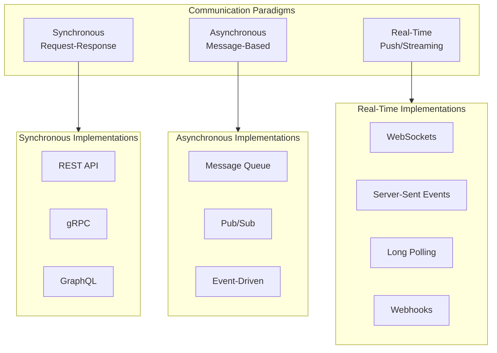
```mermaid
flowchart TB
    subgraph Communication["Communication Paradigms"]
        direction TB
        Sync["Synchronous<br/>Request-Response"]
        Async["Asynchronous<br/>Message-Based"]
        RealTime["Real-Time<br/>Push/Streaming"]
    end
    
    subgraph Sync_Impl["Synchronous Implementations"]
        REST[REST API]
        gRPC[gRPC]
        GraphQL[GraphQL]
    end
    
    subgraph Async_Impl["Asynchronous Implementations"]
        Queue[Message Queue]
        PubSub[Pub/Sub]
        EventDriven[Event-Driven]
    end
    
    subgraph RT_Impl["Real-Time Implementations"]
        WS[WebSockets]
        SSE[Server-Sent Events]
        Polling[Long Polling]
        Webhooks[Webhooks]
    end
    
    Sync --> Sync_Impl
    Async --> Async_Impl
    RealTime --> RT_Impl
```

**Key Trade-off**: Synchronous communication provides simplicity and immediate feedback but creates tight coupling. Asynchronous communication enables loose coupling and resilience but adds complexity. Real-time communication enables instant updates but requires persistent connections or polling overhead.

---

## Part I: Synchronous Communication

### The Request-Response Model

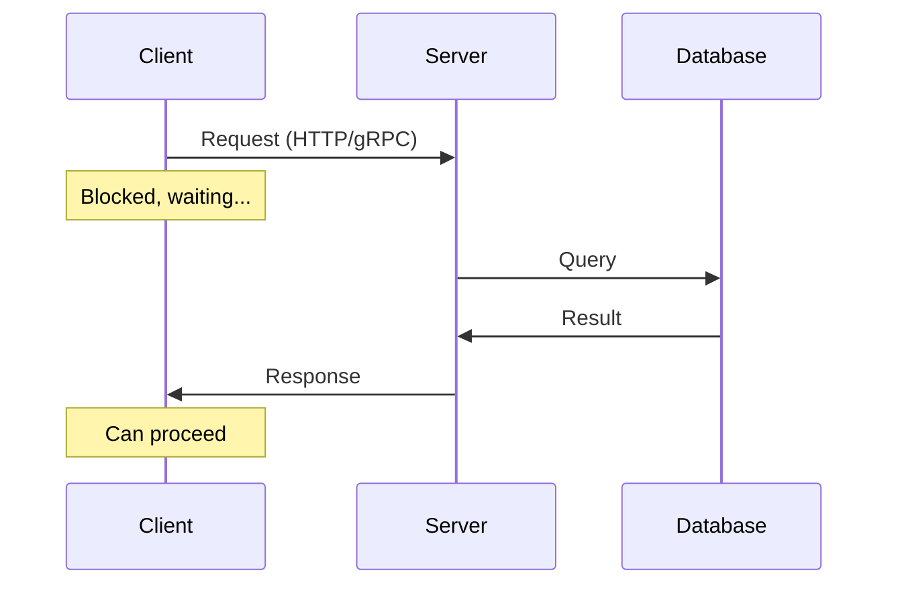
```mermaid
sequenceDiagram
    participant Client
    participant Server
    participant Database
    
    Client->>Server: Request (HTTP/gRPC)
    Note over Client: Blocked, waiting...
    Server->>Database: Query
    Database->>Server: Result
    Server->>Client: Response
    Note over Client: Can proceed
```

**Characteristics:**
- Caller blocks until response received
- Tight temporal coupling
- Simpler mental model
- Easier debugging and tracing
- Cascading failures possible

### API Paradigm Comparison

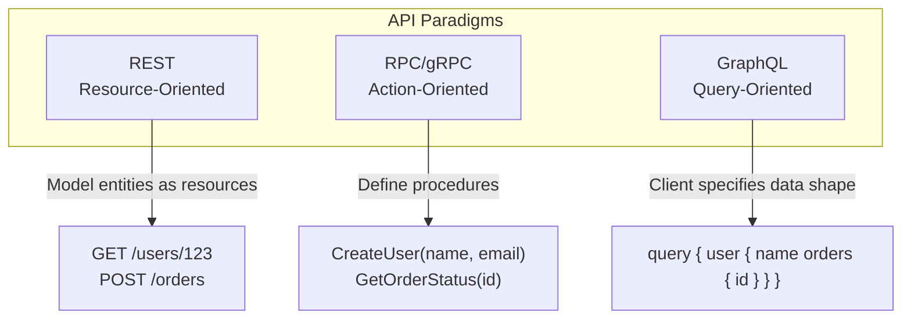
```mermaid
flowchart TB
    subgraph Paradigms["API Paradigms"]
        REST_P["REST<br/>Resource-Oriented"]
        RPC_P["RPC/gRPC<br/>Action-Oriented"]
        GQL_P["GraphQL<br/>Query-Oriented"]
    end
    
    REST_P -->|"Model entities as resources"| R_Ex["GET /users/123<br/>POST /orders"]
    RPC_P -->|"Define procedures"| RPC_Ex["CreateUser(name, email)<br/>GetOrderStatus(id)"]
    GQL_P -->|"Client specifies data shape"| GQL_Ex["query { user { name orders { id } } }"]
```

#### REST (Representational State Transfer)

> **Reference:** Fielding, R. T. (2000). "Architectural Styles and the Design of Network-based Software Architectures." Doctoral dissertation, UC Irvine.

**Philosophy:** Everything is a resource addressable by URL. HTTP verbs define operations.

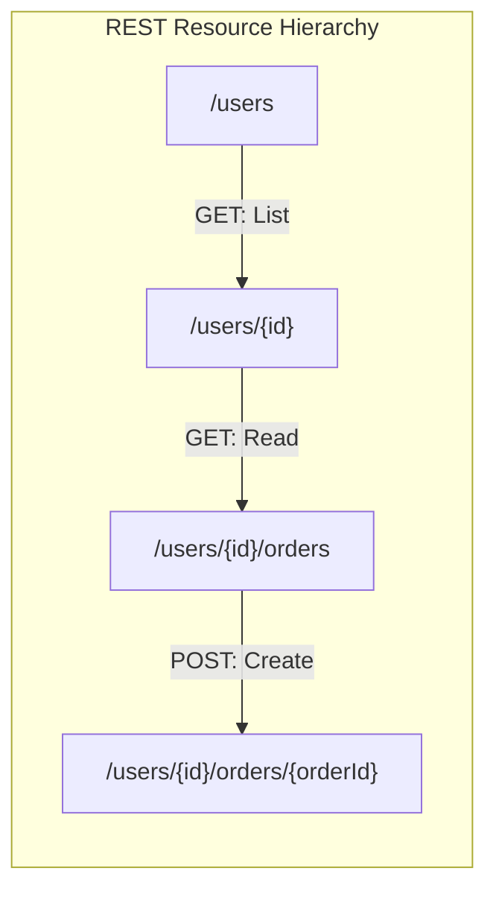
```mermaid
flowchart LR
    subgraph REST_Design["REST Resource Hierarchy"]
        Users["/users"]
        User["/users/{id}"]
        Orders["/users/{id}/orders"]
        Order["/users/{id}/orders/{orderId}"]
    end
    
    Users -->|"GET: List"| User
    User -->|"GET: Read"| Orders
    Orders -->|"POST: Create"| Order
```

| HTTP Method | CRUD Operation | Idempotent | Safe |
|-------------|----------------|------------|------|
| GET | Read | Yes | Yes |
| POST | Create | No | No |
| PUT | Replace | Yes | No |
| PATCH | Partial Update | No* | No |
| DELETE | Remove | Yes | No |

**Best Practices:**
```
✅ Good URL Design:
GET  /users                      # List users
GET  /users/123                  # Get user 123
GET  /users/123/orders           # Get user's orders
POST /users/123/orders           # Create order for user

❌ Poor URL Design:
GET  /getUsers                   # Verb in URL
POST /users/123/createOrder      # Action in URL
GET  /users/123/orders/active    # Filter as path segment
```

**Pagination Patterns:**

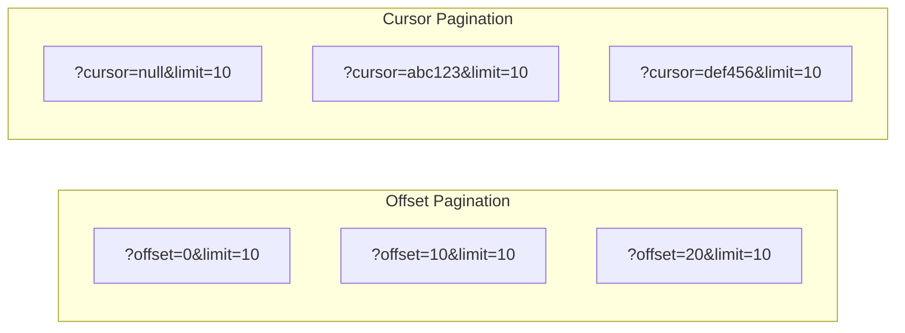
```mermaid
flowchart LR
    subgraph Offset["Offset Pagination"]
        O1["?offset=0&limit=10"]
        O2["?offset=10&limit=10"]
        O3["?offset=20&limit=10"]
    end
    
    subgraph Cursor["Cursor Pagination"]
        C1["?cursor=null&limit=10"]
        C2["?cursor=abc123&limit=10"]
        C3["?cursor=def456&limit=10"]
    end
```

| Pagination Type | Random Access | Performance | Consistency |
|-----------------|---------------|-------------|-------------|
| **Offset** | Yes | O(n) skip | Unstable during mutations |
| **Cursor** | No | O(1) seek | Stable iteration |

**When to Use REST:**
- Public APIs for third-party developers
- Resource-oriented domains (CRUD operations)
- HTTP caching is beneficial
- Wide language/platform support needed

---

#### gRPC (Remote Procedure Call)

**Philosophy:** Define services and message types in Protocol Buffers. Generate client/server code.

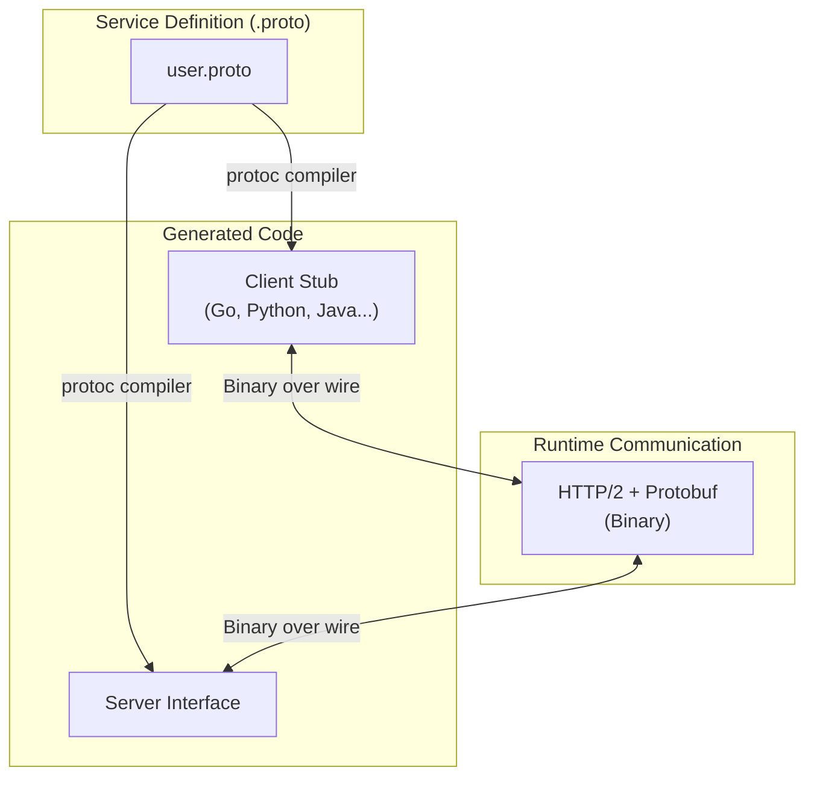
```mermaid
flowchart TB
    subgraph Definition["Service Definition (.proto)"]
        Proto["user.proto"]
    end
    
    subgraph Generated["Generated Code"]
        ClientStub["Client Stub<br/>(Go, Python, Java...)"]
        ServerStub["Server Interface"]
    end
    
    subgraph Runtime["Runtime Communication"]
        Binary["HTTP/2 + Protobuf<br/>(Binary)"]
    end
    
    Proto -->|"protoc compiler"| ClientStub
    Proto -->|"protoc compiler"| ServerStub
    ClientStub <-->|"Binary over wire"| Binary
    Binary <-->|"Binary over wire"| ServerStub
```

**Protocol Buffer Definition:**
```protobuf
syntax = "proto3";

service UserService {
  rpc CreateUser(CreateUserRequest) returns (User);
  rpc GetUser(GetUserRequest) returns (User);
  rpc ListUsers(ListUsersRequest) returns (stream User);  // Server streaming
  rpc UpdateUsers(stream User) returns (UpdateResponse);   // Client streaming
  rpc Chat(stream Message) returns (stream Message);       // Bidirectional
}

message User {
  int64 id = 1;
  string name = 2;
  string email = 3;
}
```

**Streaming Patterns:**

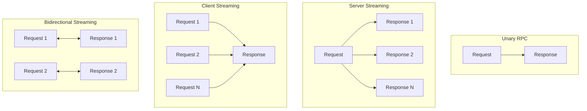
```mermaid
flowchart TB
    subgraph Unary["Unary RPC"]
        U1[Request] --> U2[Response]
    end
    
    subgraph ServerStream["Server Streaming"]
        SS1[Request] --> SS2[Response 1]
        SS1 --> SS3[Response 2]
        SS1 --> SS4[Response N]
    end
    
    subgraph ClientStream["Client Streaming"]
        CS1[Request 1] --> CS4[Response]
        CS2[Request 2] --> CS4
        CS3[Request N] --> CS4
    end
    
    subgraph BiDi["Bidirectional Streaming"]
        BD1[Request 1] <--> BD4[Response 1]
        BD2[Request 2] <--> BD5[Response 2]
    end
```

| Streaming Pattern | Use Case |
|-------------------|----------|
| Unary | Simple request-response |
| Server Streaming | Large result sets, real-time feeds |
| Client Streaming | File upload, data aggregation |
| Bidirectional | Chat, gaming, collaborative editing |

**When to Use gRPC:**
- Internal microservices communication
- High-performance requirements (10x faster than REST)
- Strict contracts needed (proto files)
- Streaming data required
- Polyglot environments (code generation)

---

#### GraphQL

**Philosophy:** Clients specify exactly what data they need. Single endpoint.

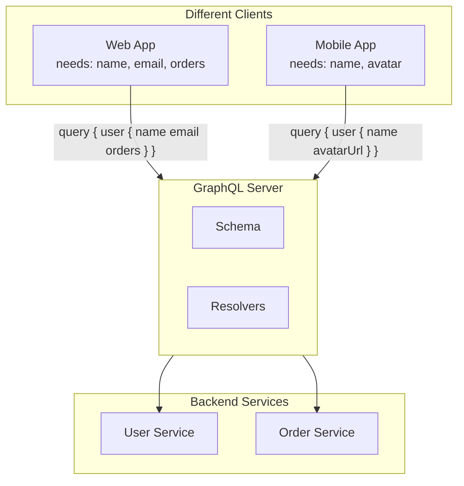
```mermaid
flowchart TB
    subgraph Clients["Different Clients"]
        Web["Web App<br/>needs: name, email, orders"]
        Mobile["Mobile App<br/>needs: name, avatar"]
    end
    
    subgraph GraphQL["GraphQL Server"]
        Schema[Schema]
        Resolvers[Resolvers]
    end
    
    subgraph Services["Backend Services"]
        UserSvc[User Service]
        OrderSvc[Order Service]
    end
    
    Web -->|"query { user { name email orders } }"| GraphQL
    Mobile -->|"query { user { name avatarUrl } }"| GraphQL
    GraphQL --> UserSvc
    GraphQL --> OrderSvc
```

**Query Example:**
```graphql
# Client specifies exact data shape
query GetUserDashboard($userId: ID!) {
  user(id: $userId) {
    name
    email
    orders(first: 5) {
      id
      total
      status
    }
    recommendations(limit: 3) {
      productName
      price
    }
  }
}

# Response matches query shape exactly
{
  "data": {
    "user": {
      "name": "Alice",
      "email": "alice@example.com",
      "orders": [...],
      "recommendations": [...]
    }
  }
}
```

**N+1 Problem and DataLoader:**

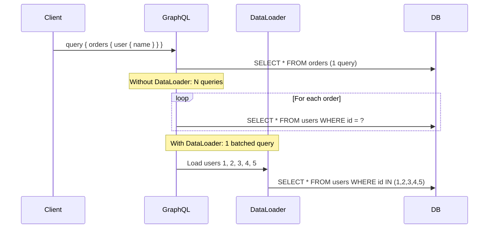
```mermaid
sequenceDiagram
    participant Client
    participant GraphQL
    participant DataLoader
    participant DB
    
    Client->>GraphQL: query { orders { user { name } } }
    GraphQL->>DB: SELECT * FROM orders (1 query)
    
    Note over GraphQL: Without DataLoader: N queries
    loop For each order
        GraphQL->>DB: SELECT * FROM users WHERE id = ?
    end
    
    Note over GraphQL,DataLoader: With DataLoader: 1 batched query
    GraphQL->>DataLoader: Load users 1, 2, 3, 4, 5
    DataLoader->>DB: SELECT * FROM users WHERE id IN (1,2,3,4,5)
```

**When to Use GraphQL:**
- Mobile apps with bandwidth constraints
- Complex UIs with varying data needs
- Rapid frontend iteration
- Multiple client types (web, mobile, IoT)

---

### Synchronous Paradigm Comparison Matrix

| Aspect | REST | gRPC | GraphQL |
|--------|------|------|---------|
| **Protocol** | HTTP/1.1 or HTTP/2 | HTTP/2 | HTTP |
| **Serialization** | JSON (text) | Protobuf (binary) | JSON (text) |
| **Contract** | OpenAPI/Swagger | Proto files | GraphQL Schema |
| **Caching** | HTTP caching built-in | Custom | Requires effort |
| **Browser Support** | Native | Requires gRPC-Web | Native |
| **Streaming** | Limited (SSE) | Native | Subscriptions |
| **Learning Curve** | Low | Medium | Medium-High |
| **Overfetching** | Common | Unlikely | Solved |
| **Performance** | Good | Excellent | Good |

### Protocol Performance Benchmarks

Typical latency and throughput measurements (single request, same datacenter):

| Protocol | Serialization | Latency (p50) | Latency (p99) | Throughput | Payload Overhead |
|----------|---------------|---------------|---------------|------------|------------------|
| **REST/JSON** | JSON (text) | 1-5 ms | 10-50 ms | 10-50K req/s | High (verbose) |
| **gRPC/Protobuf** | Protobuf (binary) | 0.1-1 ms | 2-10 ms | 100-500K req/s | Low (compact) |
| **GraphQL/JSON** | JSON (text) | 2-10 ms | 20-100 ms | 5-20K req/s | Variable |

**Serialization Comparison:**

| Format | Encode Time | Decode Time | Size (1KB object) | Human Readable |
|--------|-------------|-------------|-------------------|----------------|
| **JSON** | 1x (baseline) | 1x | 100% | Yes |
| **Protobuf** | 2-5x faster | 2-5x faster | 30-50% | No |
| **MessagePack** | 1.5-2x faster | 1.5-2x faster | 50-70% | No |
| **Avro** | 2-3x faster | 2-3x faster | 30-40% | No (schema) |

---

### HTTP Protocol Evolution

> **References:**
> - Belshe, M. et al. (2015). "Hypertext Transfer Protocol Version 2 (HTTP/2)." RFC 7540.
> - Iyengar, J. & Thomson, M. (2021). "QUIC: A UDP-Based Multiplexed and Secure Transport." RFC 9000.

Understanding the evolution of HTTP helps explain why modern systems make certain transport choices.

#### HTTP/1.1 → HTTP/2 → HTTP/3 (QUIC)

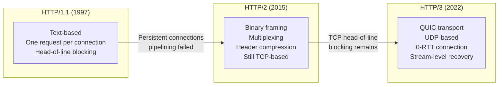
```mermaid
flowchart LR
    subgraph "HTTP/1.1 (1997)"
        H1[Text-based<br/>One request per connection<br/>Head-of-line blocking]
    end

    subgraph "HTTP/2 (2015)"
        H2[Binary framing<br/>Multiplexing<br/>Header compression<br/>Still TCP-based]
    end

    subgraph "HTTP/3 (2022)"
        H3[QUIC transport<br/>UDP-based<br/>0-RTT connection<br/>Stream-level recovery]
    end

    H1 -->|"Persistent connections<br/>pipelining failed"| H2
    H2 -->|"TCP head-of-line<br/>blocking remains"| H3
```

#### The TCP Head-of-Line Blocking Problem

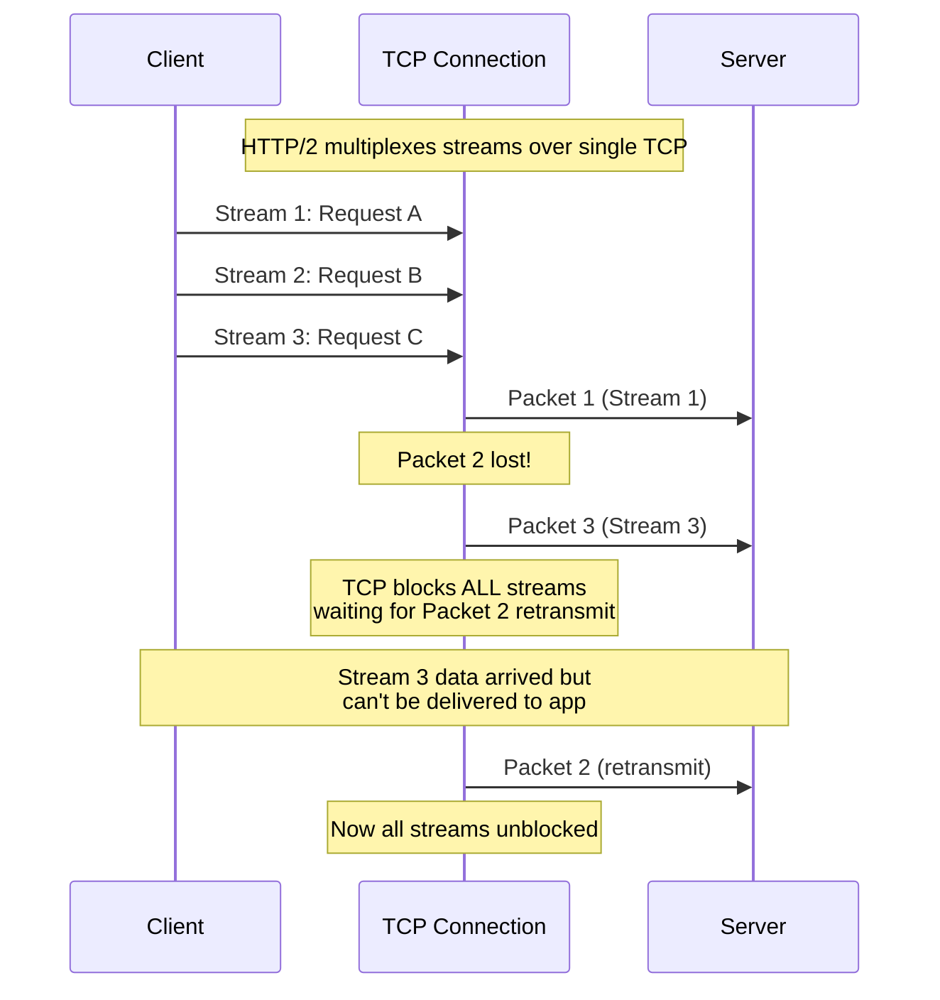
```mermaid
sequenceDiagram
    participant Client
    participant TCP as TCP Connection
    participant Server

    Note over TCP: HTTP/2 multiplexes streams over single TCP

    Client->>TCP: Stream 1: Request A
    Client->>TCP: Stream 2: Request B
    Client->>TCP: Stream 3: Request C

    TCP->>Server: Packet 1 (Stream 1)
    Note over TCP: Packet 2 lost!
    TCP->>Server: Packet 3 (Stream 3)

    Note over TCP: TCP blocks ALL streams<br/>waiting for Packet 2 retransmit
    Note over Client,Server: Stream 3 data arrived but<br/>can't be delivered to app

    TCP->>Server: Packet 2 (retransmit)
    Note over TCP: Now all streams unblocked
```

**HTTP/2 Problem:** Single TCP connection means single stream of bytes. One lost packet blocks all HTTP streams.

#### QUIC: HTTP/3's Transport

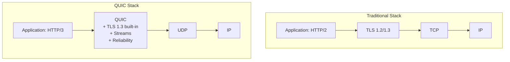
```mermaid
flowchart TB
    subgraph "Traditional Stack"
        T_APP[Application: HTTP/2]
        T_TLS[TLS 1.2/1.3]
        T_TCP[TCP]
        T_IP[IP]
    end

    subgraph "QUIC Stack"
        Q_APP[Application: HTTP/3]
        Q_QUIC[QUIC<br/>+ TLS 1.3 built-in<br/>+ Streams<br/>+ Reliability]
        Q_UDP[UDP]
        Q_IP[IP]
    end

    T_APP --> T_TLS --> T_TCP --> T_IP
    Q_APP --> Q_QUIC --> Q_UDP --> Q_IP
```

**QUIC Benefits:**

| Feature | TCP/TLS | QUIC | Impact |
|---------|---------|------|--------|
| **Connection setup** | 2-3 RTT (TCP + TLS) | 0-1 RTT | Faster first byte |
| **Head-of-line blocking** | All streams blocked | Per-stream recovery | Better multiplexing |
| **Connection migration** | Breaks on IP change | Connection ID survives | Mobile-friendly |
| **Encryption** | Optional (TLS layer) | Mandatory, built-in | Always secure |
| **Congestion control** | Kernel-space, slow to evolve | User-space, pluggable | Faster innovation |

#### 0-RTT Connection Establishment

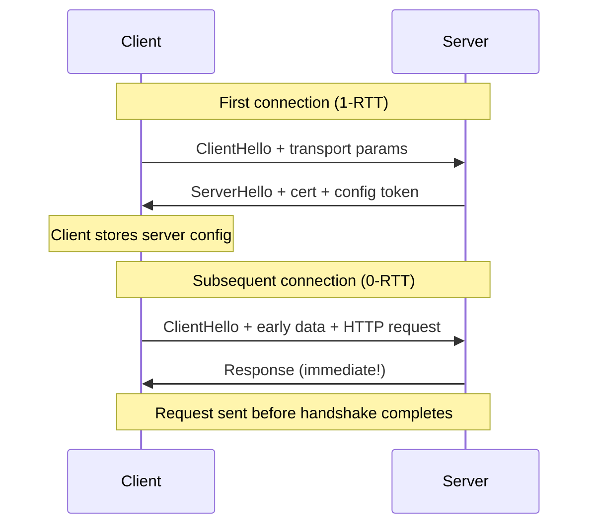
```mermaid
sequenceDiagram
    participant Client
    participant Server

    Note over Client,Server: First connection (1-RTT)
    Client->>Server: ClientHello + transport params
    Server->>Client: ServerHello + cert + config token
    Note over Client: Client stores server config

    Note over Client,Server: Subsequent connection (0-RTT)
    Client->>Server: ClientHello + early data + HTTP request
    Server->>Client: Response (immediate!)
    Note over Client,Server: Request sent before handshake completes
```

**0-RTT Caveat:** Early data can be replayed. Only safe for idempotent requests (GET, not POST with side effects).

#### When to Use HTTP/3

| Use HTTP/3 When | Stick with HTTP/2 When |
|-----------------|------------------------|
| High-latency networks (mobile, satellite) | Stable, low-latency connections |
| Users frequently change networks | UDP is blocked (some corporate networks) |
| Many small requests (multiplexing matters) | Need mature tooling/debugging |
| Global user base with varied connectivity | Legacy infrastructure constraints |

**Production Adoption:**

| Service | HTTP/3 Status | Notes |
|---------|---------------|-------|
| **Google** | Default | Chrome + Google services |
| **Cloudflare** | Available | Edge network support |
| **AWS CloudFront** | Available | CDN support |
| **Facebook** | Partial | Mobile apps |
| **Netflix** | Testing | Streaming optimization |

**Interview Phrase:** "HTTP/3 with QUIC solves TCP's head-of-line blocking by running over UDP with independent streams. This is particularly valuable for mobile users—QUIC connections survive network switches via connection IDs, and 0-RTT resumption reduces latency. The trade-off is less mature tooling and potential UDP blocking in some networks."

---

### Synchronous Decision Tree

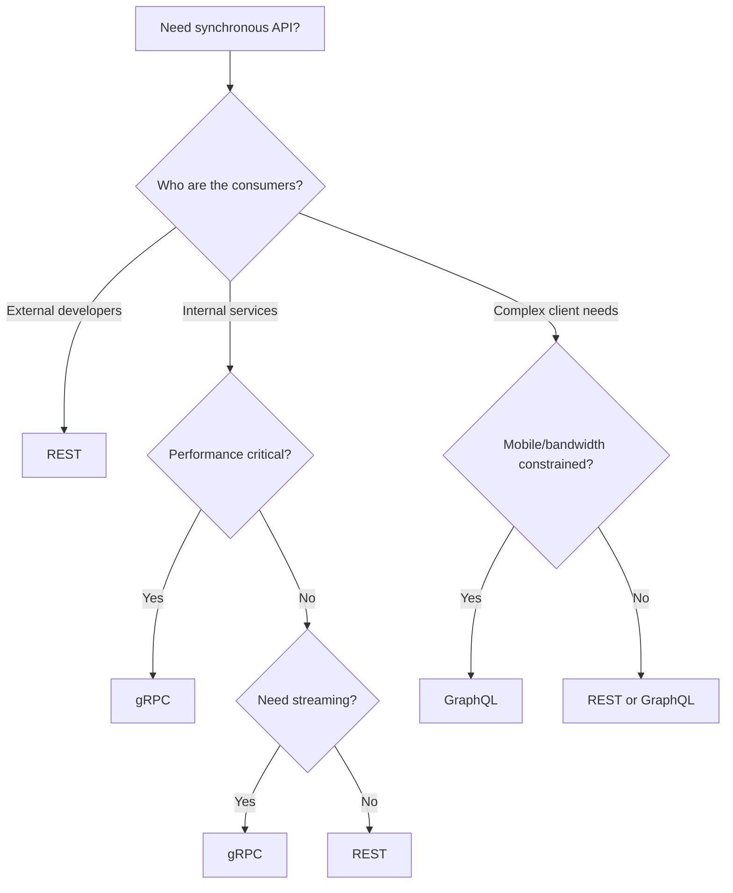
```mermaid
flowchart TD
    Start[Need synchronous API?] --> Q1{Who are the consumers?}
    
    Q1 -->|"External developers"| REST_Choice[REST]
    Q1 -->|"Internal services"| Q2{Performance critical?}
    Q1 -->|"Complex client needs"| Q3{Mobile/bandwidth constrained?}
    
    Q2 -->|"Yes"| gRPC_Choice[gRPC]
    Q2 -->|"No"| Q4{Need streaming?}
    
    Q3 -->|"Yes"| GraphQL_Choice[GraphQL]
    Q3 -->|"No"| REST_Choice2[REST or GraphQL]
    
    Q4 -->|"Yes"| gRPC_Choice2[gRPC]
    Q4 -->|"No"| REST_Choice3[REST]
```

---

## Part II: Asynchronous Communication

### Why Asynchronous?

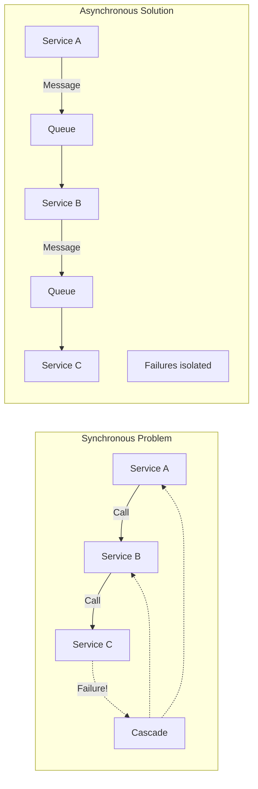
```mermaid
flowchart LR
    subgraph Sync["Synchronous Problem"]
        A1[Service A] -->|"Call"| B1[Service B]
        B1 -->|"Call"| C1[Service C]
        C1 -.->|"Failure!"| X[Cascade]
        X -.-> B1
        X -.-> A1
    end
    
    subgraph Async["Asynchronous Solution"]
        A2[Service A] -->|"Message"| Q[Queue]
        Q --> B2[Service B]
        B2 -->|"Message"| Q2[Queue]
        Q2 --> C2[Service C]
        Note["Failures isolated"]
    end
```

| Aspect | Synchronous | Asynchronous |
|--------|-------------|--------------|
| **Coupling** | Tight (caller waits) | Loose (fire and forget) |
| **Failure Handling** | Cascading failures | Isolated failures |
| **Scalability** | Limited by slowest component | Independent scaling |
| **Latency** | Sum of all calls | Only initial acknowledgment |
| **Debugging** | Easier (linear flow) | Harder (distributed trace) |

---

### Message Queue vs Pub/Sub

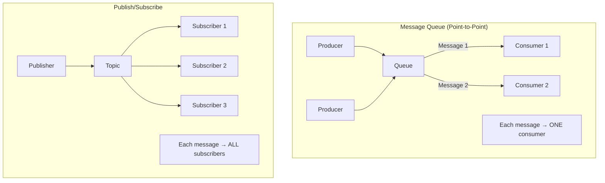
```mermaid
flowchart TB
    subgraph Queue["Message Queue (Point-to-Point)"]
        P1[Producer] --> Q1[Queue]
        P2[Producer] --> Q1
        Q1 -->|"Message 1"| C1[Consumer 1]
        Q1 -->|"Message 2"| C2[Consumer 2]
        Note1["Each message → ONE consumer"]
    end
    
    subgraph PubSub["Publish/Subscribe"]
        Pub[Publisher] --> Topic[Topic]
        Topic --> S1[Subscriber 1]
        Topic --> S2[Subscriber 2]
        Topic --> S3[Subscriber 3]
        Note2["Each message → ALL subscribers"]
    end
```

| Aspect | Message Queue | Pub/Sub |
|--------|---------------|---------|
| **Delivery** | One consumer | All subscribers |
| **Use Case** | Task distribution, work queues | Event broadcasting, notifications |
| **Scaling** | Add consumers (competing) | Add subscribers (independent) |
| **Example** | Order processing, job scheduling | Notifications, data replication |
| **Message Fate** | Removed after consumption | May persist for replay |

---

### Delivery Guarantees

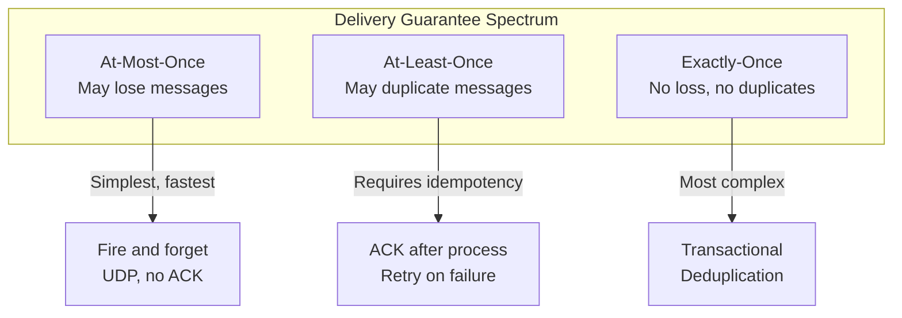
```mermaid
flowchart TB
    subgraph Guarantees["Delivery Guarantee Spectrum"]
        AtMost["At-Most-Once<br/>May lose messages"]
        AtLeast["At-Least-Once<br/>May duplicate messages"]
        Exactly["Exactly-Once<br/>No loss, no duplicates"]
    end
    
    AtMost -->|"Simplest, fastest"| Ex1["Fire and forget<br/>UDP, no ACK"]
    AtLeast -->|"Requires idempotency"| Ex2["ACK after process<br/>Retry on failure"]
    Exactly -->|"Most complex"| Ex3["Transactional<br/>Deduplication"]
```

| Guarantee | Meaning | Implementation | Trade-off |
|-----------|---------|----------------|-----------|
| **At-Most-Once** | Send once, don't retry | No ACK required | Fastest, may lose |
| **At-Least-Once** | Retry until ACK | ACK + retry logic | Safe, may duplicate |
| **Exactly-Once** | Guaranteed single delivery | Transactions + dedup | Slowest, complex |

**At-Least-Once Pattern:**

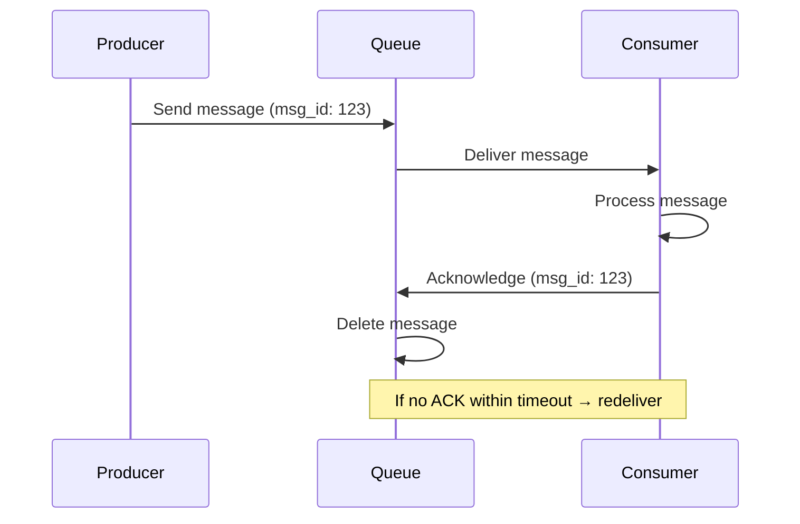
```mermaid
sequenceDiagram
    participant Producer
    participant Queue
    participant Consumer
    
    Producer->>Queue: Send message (msg_id: 123)
    Queue->>Consumer: Deliver message
    Consumer->>Consumer: Process message
    Consumer->>Queue: Acknowledge (msg_id: 123)
    Queue->>Queue: Delete message
    
    Note over Queue,Consumer: If no ACK within timeout → redeliver
```

**Idempotency Pattern (Critical for At-Least-Once):**

```python
def process_message(message):
    message_id = message.id
    
    # Check if already processed (idempotency key)
    if db.exists(f"processed:{message_id}"):
        return  # Skip duplicate
    
    # Process in transaction
    with db.transaction():
        do_business_logic(message)
        db.set(f"processed:{message_id}", True, ttl=7*24*3600)
```

---

### Messaging Technologies Comparison

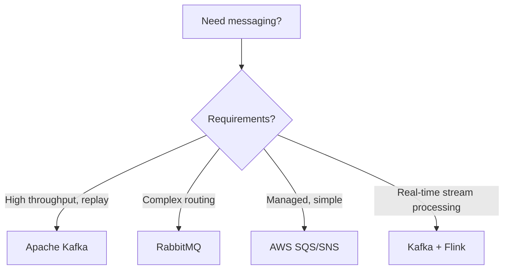
```mermaid
flowchart TD
    Need[Need messaging?] --> Req{Requirements?}
    
    Req -->|"High throughput, replay"| Kafka[Apache Kafka]
    Req -->|"Complex routing"| Rabbit[RabbitMQ]
    Req -->|"Managed, simple"| SQS[AWS SQS/SNS]
    Req -->|"Real-time stream processing"| Flink[Kafka + Flink]
```

| Feature | Kafka | RabbitMQ | AWS SQS |
|---------|-------|----------|---------|
| **Model** | Log-based | Queue-based | Queue-based |
| **Ordering** | Per-partition | Per-queue | Best-effort (FIFO available) |
| **Retention** | Configurable (days/weeks) | Until consumed | 14 days max |
| **Throughput** | Very high (millions/sec) | High (100k/sec) | High (managed) |
| **Replay** | Yes (offset reset) | No | No |
| **Routing** | Partition key | Exchange types | Basic |
| **Managed** | Confluent, MSK | CloudAMQP | Native AWS |

---

### Apache Kafka Deep Dive

> **Reference:** Kreps, J. et al. (2011). "Kafka: A Distributed Messaging System for Log Processing." NetDB Workshop.

> **Deep Dive:** See [DD_KAFKA_ARCHITECTURE](./DD_KAFKA_ARCHITECTURE.md) for partitions, consumer groups, exactly-once semantics, and production patterns.

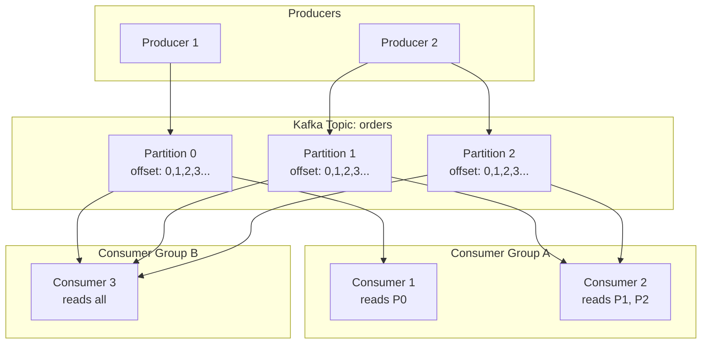
```mermaid
flowchart TB
    subgraph Producers
        P1[Producer 1]
        P2[Producer 2]
    end
    
    subgraph KafkaTopic["Kafka Topic: orders"]
        P0["Partition 0<br/>offset: 0,1,2,3..."]
        P1T["Partition 1<br/>offset: 0,1,2,3..."]
        P2T["Partition 2<br/>offset: 0,1,2,3..."]
    end
    
    subgraph ConsumerGroup["Consumer Group A"]
        C1[Consumer 1<br/>reads P0]
        C2[Consumer 2<br/>reads P1, P2]
    end
    
    subgraph ConsumerGroup2["Consumer Group B"]
        C3[Consumer 3<br/>reads all]
    end
    
    P1 --> P0
    P2 --> P1T
    P2 --> P2T
    
    P0 --> C1
    P1T --> C2
    P2T --> C2
    
    P0 --> C3
    P1T --> C3
    P2T --> C3
```

**Key Concepts:**
- **Topic:** Category of messages (like a database table)
- **Partition:** Ordered, immutable log (unit of parallelism)
- **Offset:** Position in partition (consumer's bookmark)
- **Consumer Group:** Consumers sharing partition load

**Partition Key Strategy:**

```mermaid
flowchart TD
    subgraph Messages
        M1["Order: user_1"]
        M2["Order: user_2"]
        M3["Order: user_1"]
        M4["Order: user_3"]
    end
    
    subgraph Partitioning["hash(partition_key) % num_partitions"]
        Hash[Partition Assignment]
    end
    
    subgraph Partitions
        P0["Partition 0<br/>user_1: Order 1, Order 3"]
        P1["Partition 1<br/>user_2: Order 2"]
        P2["Partition 2<br/>user_3: Order 4"]
    end
    
    M1 -->|"key: user_1"| Hash
    M2 -->|"key: user_2"| Hash
    M3 -->|"key: user_1"| Hash
    M4 -->|"key: user_3"| Hash
    
    Hash --> P0
    Hash --> P1
    Hash --> P2
```

**Key Insight:** Same key → same partition → guaranteed order for that key.

---

### Message Ordering Strategies

| Strategy | Guarantee | Trade-off |
|----------|-----------|-----------|
| **Single Partition** | Total order across all messages | Limited throughput |
| **Partition by Key** | Order within same key | Balanced (recommended) |
| **No Ordering** | None | Maximum throughput |

**When Order Matters:**
- Bank transactions for same account
- User events (signup must precede purchase)
- State machine transitions
- Audit logs

---

### Dead Letter Queue Pattern

```mermaid
flowchart TB
    Main[Main Queue] --> Consumer
    Consumer -->|"Success"| Done[Processed]
    Consumer -->|"Failure (retry 1)"| Main
    Consumer -->|"Failure (retry 2)"| Main
    Consumer -->|"Failure (retry 3)"| Main
    Consumer -->|"Max retries exceeded"| DLQ[Dead Letter Queue]
    
    DLQ --> Alert[Alert Ops Team]
    DLQ --> Manual[Manual Processing]
    DLQ --> Replay[Retry Later]
```

**DLQ Best Practices:**
- Set max retry count (typically 3-5)
- Include original message + error context
- Monitor DLQ depth as key metric
- Establish process for DLQ handling

---

### Event-Driven Architecture Patterns

```mermaid
flowchart TB
    subgraph EventSourcing["Event Sourcing"]
        Command[Command] --> ES[Event Store]
        ES --> Event1[UserCreated]
        ES --> Event2[EmailVerified]
        ES --> Event3[OrderPlaced]
        
        Events[Events] --> Projection[Read Model]
    end
    
    subgraph CQRS["CQRS Pattern"]
        Write[Write Model] --> Events2[Events]
        Events2 --> Read[Read Model]
        Query[Query] --> Read
    end
```

| Pattern | Description | Use Case |
|---------|-------------|----------|
| **Event Sourcing** | Store state as sequence of events | Audit trails, temporal queries |
| **CQRS** | Separate read/write models | Different read/write scaling |
| **Saga** | Distributed transactions via events | Cross-service workflows |
| **Event Notification** | Lightweight "something happened" | Loose coupling |

---

### Asynchronous Decision Tree

```mermaid
flowchart TD
    Start[Need async communication?] --> Q1{What's the pattern?}
    
    Q1 -->|"Work distribution"| Queue[Message Queue]
    Q1 -->|"Event broadcast"| PubSub[Pub/Sub]
    Q1 -->|"Complex workflow"| Saga[Saga/Orchestration]
    
    Queue --> Q2{Need replay?}
    Q2 -->|"Yes"| Kafka1[Kafka]
    Q2 -->|"No"| Q3{Complex routing?}
    
    Q3 -->|"Yes"| Rabbit[RabbitMQ]
    Q3 -->|"No"| SQS1[SQS]
    
    PubSub --> Q4{High throughput?}
    Q4 -->|"Yes"| Kafka2[Kafka]
    Q4 -->|"No"| SNS[SNS/Redis Pub/Sub]
```

---

## Part III: Real-Time Communication

### Real-Time Pattern Spectrum

```mermaid
flowchart LR
    subgraph Pull["Pull-Based"]
        Polling[Short Polling]
        LongPoll[Long Polling]
    end
    
    subgraph Push["Push-Based"]
        SSE[Server-Sent Events]
        WS[WebSockets]
        Webhooks[Webhooks]
    end
    
    Pull -->|"Simple, wasteful"| Push
    Push -->|"Efficient, complex"| Note["Choose based on requirements"]
```

---

### Short Polling

```mermaid
sequenceDiagram
    participant Client
    participant Server
    
    loop Every N seconds
        Client->>Server: GET /api/updates?since=timestamp
        Server->>Client: { updates: [] } or { updates: [...] }
    end
    
    Note over Client,Server: Client repeatedly asks "Any updates?"
```

| Aspect | Value |
|--------|-------|
| **Latency** | High (up to polling interval) |
| **Server Load** | High (constant requests even without updates) |
| **Complexity** | Very Low |
| **Use Case** | Low-priority dashboards, legacy systems |

---

### Long Polling

```mermaid
sequenceDiagram
    participant Client
    participant Server
    
    Client->>Server: GET /api/updates
    Note over Server: Hold connection open...
    Note over Server: Wait for data or timeout (30s)
    Server->>Client: { updates: [...] }
    
    Client->>Server: GET /api/updates (immediately)
    Note over Server: Hold again...
```

| Aspect | Value |
|--------|-------|
| **Latency** | Low (near real-time on event) |
| **Server Load** | Medium (connections held open) |
| **Complexity** | Medium |
| **Use Case** | Chat apps, notifications (when SSE/WS not available) |

---

### Server-Sent Events (SSE)

```mermaid
sequenceDiagram
    participant Client
    participant Server
    
    Client->>Server: GET /api/events (Accept: text/event-stream)
    Note over Client,Server: Connection stays open
    
    Server->>Client: event: message<br/>data: {"text": "Hello"}<br/><br/>
    Server->>Client: event: notification<br/>data: {"type": "alert"}<br/><br/>
    Server->>Client: event: message<br/>data: {"text": "World"}<br/><br/>
    
    Note over Client: Connection drops
    Client->>Server: GET /api/events (Last-Event-ID: 123)
    Note over Client,Server: Auto-reconnect with last ID
```

**SSE Protocol Format:**
```
event: message
id: 123
data: {"text": "Hello"}
retry: 5000

: this is a comment (heartbeat)
```

| Field | Purpose |
|-------|---------|
| `event` | Event type for client filtering |
| `data` | Payload (can span multiple lines) |
| `id` | Event ID for resume after disconnect |
| `retry` | Reconnection interval (ms) |
| `:` | Comment (used for keepalive heartbeats) |

| Aspect | Value |
|--------|-------|
| **Direction** | Server → Client only |
| **Protocol** | HTTP (works through proxies) |
| **Auto-reconnect** | Built-in |
| **Use Case** | News feeds, stock tickers, notifications |

---

### WebSockets

```mermaid
sequenceDiagram
    participant Client
    participant Server
    
    Client->>Server: HTTP GET /ws (Upgrade: websocket)
    Server->>Client: 101 Switching Protocols
    Note over Client,Server: Connection upgraded to WebSocket
    
    Client->>Server: {"type": "subscribe", "channel": "chat"}
    Server->>Client: {"type": "subscribed"}
    
    Server->>Client: {"type": "message", "text": "Hello"}
    Client->>Server: {"type": "message", "text": "Hi back!"}
    Server->>Client: {"type": "message", "text": "How are you?"}
    Client->>Server: {"type": "message", "text": "Great!"}
```

| Aspect | Value |
|--------|-------|
| **Direction** | Bidirectional |
| **Protocol** | WS/WSS (HTTP upgrade) |
| **Connection** | Persistent, stateful |
| **Use Case** | Chat, gaming, collaborative editing |

**Scaling WebSockets:**

```mermaid
flowchart TB
    subgraph Clients
        C1[Client 1]
        C2[Client 2]
        C3[Client 3]
        C4[Client 4]
    end
    
    subgraph LB["Load Balancer"]
        Sticky["Sticky Sessions"]
    end
    
    subgraph Servers["WebSocket Servers"]
        WS1[WS Server 1<br/>Clients 1,2]
        WS2[WS Server 2<br/>Clients 3,4]
    end
    
    subgraph MessageBus["Message Bus (Cross-Server)"]
        Redis[(Redis Pub/Sub)]
    end
    
    C1 --> LB
    C2 --> LB
    C3 --> LB
    C4 --> LB
    
    LB --> WS1
    LB --> WS2
    
    WS1 <--> Redis
    WS2 <--> Redis
```

**Challenge:** WebSocket connections are stateful. Message for User B must reach the server holding User B's connection.

**Solution:** Use Pub/Sub (Redis, Kafka) for cross-server message fan-out.

---

### Webhooks

```mermaid
sequenceDiagram
    participant Your as Your Server
    participant Source as Source System (Stripe)
    
    Note over Your,Source: One-time registration
    Your->>Source: Register webhook URL<br/>https://your-app.com/webhooks/stripe
    Source->>Your: Confirmed
    
    Note over Source: Payment event occurs
    Source->>Your: POST /webhooks/stripe<br/>{ event: "payment.succeeded", data: {...} }
    Your->>Source: 200 OK
    
    Note over Source: Delivery failed
    Source->>Your: POST /webhooks/stripe
    Your--xSource: 500 Error / Timeout
    Source->>Source: Queue for retry (exponential backoff)
    Source->>Your: POST /webhooks/stripe (retry)
    Your->>Source: 200 OK
```

**Webhook Best Practices:**

```python
@app.route('/webhooks/stripe', methods=['POST'])
def handle_stripe_webhook():
    # 1. Verify signature (CRITICAL for security)
    payload = request.data
    signature = request.headers.get('Stripe-Signature')
    if not verify_signature(payload, signature, WEBHOOK_SECRET):
        return 'Invalid signature', 401
    
    # 2. Parse event
    event = json.loads(payload)
    
    # 3. Respond quickly (< 5 seconds)
    # Queue for async processing
    queue.enqueue(process_webhook_event, event)
    
    # 4. Return 200 immediately
    return 'OK', 200

# 5. Process asynchronously with idempotency
def process_webhook_event(event):
    event_id = event['id']
    if already_processed(event_id):
        return  # Idempotent handling
    
    # Business logic here
    handle_payment_succeeded(event['data'])
    mark_as_processed(event_id)
```

| Aspect | Value |
|--------|-------|
| **Direction** | Server → Server |
| **Trigger** | Event-driven |
| **Coupling** | Loose (URL registration) |
| **Use Case** | Payment notifications, CI/CD, integrations |

---

### Real-Time Pattern Comparison Matrix

| Aspect | Short Polling | Long Polling | SSE | WebSockets | Webhooks |
|--------|---------------|--------------|-----|------------|----------|
| **Direction** | Pull | Pull (simulated push) | Push | Bidirectional | Push |
| **Latency** | High | Low | Very Low | Very Low | Event-driven |
| **Connection** | Short-lived | Held | Persistent | Persistent | Per-event |
| **Protocol** | HTTP | HTTP | HTTP | WS over HTTP | HTTP |
| **Server Resources** | Low per request | Medium | Medium | High | Low |
| **Proxy/Firewall** | Always works | Usually works | Usually works | May need config | Always works |
| **Auto-reconnect** | Manual | Manual | Built-in | Manual | N/A |

---

### Real-Time Decision Tree

```mermaid
flowchart TD
    Start[Need real-time updates?] --> Q1{Direction?}
    
    Q1 -->|"Server → Client only"| Q2{Latency needs?}
    Q1 -->|"Bidirectional"| WS[WebSockets]
    Q1 -->|"Server → Server"| Webhooks[Webhooks]
    
    Q2 -->|"Seconds OK"| Poll[Long Polling]
    Q2 -->|"Sub-second"| Q3{Browser support?}
    
    Q3 -->|"Modern browsers"| SSE[SSE]
    Q3 -->|"Legacy support needed"| Poll2[Long Polling]
```

---

## Part IV: Service Exposure Patterns

### Gateway Architecture

```mermaid
flowchart TB
    subgraph Clients["External Clients"]
        Web[Web App]
        Mobile[Mobile App]
        Partner[Partner API]
    end
    
    subgraph Edge["Edge Layer"]
        Gateway[API Gateway]
    end
    
    subgraph Internal["Internal Services"]
        Auth[Auth Service]
        Users[User Service]
        Orders[Order Service]
    end
    
    subgraph Mesh["Service Mesh"]
        Sidecar1[Envoy Sidecar]
        Sidecar2[Envoy Sidecar]
        Sidecar3[Envoy Sidecar]
    end
    
    Clients -->|"North-South"| Gateway
    Gateway --> Internal
    
    Auth <-->|"East-West (mTLS)"| Sidecar1
    Users <-->|"East-West (mTLS)"| Sidecar2
    Orders <-->|"East-West (mTLS)"| Sidecar3
    
    Sidecar1 <--> Sidecar2
    Sidecar2 <--> Sidecar3
```

---

### API Gateway Responsibilities

```mermaid
flowchart TB
    subgraph Gateway["API Gateway Functions"]
        subgraph Security
            Auth[Authentication]
            AuthZ[Authorization]
            RateLimit[Rate Limiting]
        end
        
        subgraph Traffic
            Route[Routing]
            LB[Load Balancing]
            CB[Circuit Breaking]
        end
        
        subgraph Transform
            Protocol[Protocol Translation]
            Aggregate[Aggregation]
            Cache[Caching]
        end
        
        subgraph Observe
            Log[Logging]
            Metrics[Metrics]
            Trace[Tracing]
        end
    end
```

---

### Backend for Frontend (BFF) Pattern

```mermaid
flowchart TB
    subgraph Clients
        Web[Web App]
        iOS[iOS App]
        Android[Android App]
    end
    
    subgraph BFFs["Backend for Frontend"]
        WebBFF[Web BFF<br/>Full data, desktop optimized]
        MobileBFF[Mobile BFF<br/>Minimal data, battery aware]
    end
    
    subgraph Services
        UserSvc[User Service]
        OrderSvc[Order Service]
        ProductSvc[Product Service]
    end
    
    Web --> WebBFF
    iOS --> MobileBFF
    Android --> MobileBFF
    
    WebBFF --> UserSvc
    WebBFF --> OrderSvc
    WebBFF --> ProductSvc
    
    MobileBFF --> UserSvc
    MobileBFF --> ProductSvc
```

| Single Gateway | BFF per Client |
|----------------|----------------|
| One size fits all | Tailored per client |
| Central team bottleneck | Frontend teams own BFF |
| May overfetch | Exactly what's needed |
| Simpler infrastructure | More services to manage |

---

### Circuit Breaker Pattern

```mermaid
stateDiagram-v2
    [*] --> Closed: Normal operation
    
    Closed --> Open: Failure threshold exceeded
    Open --> HalfOpen: After timeout
    HalfOpen --> Closed: Success
    HalfOpen --> Open: Failure
    
    note right of Closed
        Track failure count
        Reset on success
    end note
    
    note right of Open
        Fail fast
        Return fallback/cached
    end note
    
    note right of HalfOpen
        Allow limited traffic
        Test if service recovered
    end note
```

**Configuration Parameters:**
- **Failure threshold:** Failures before opening (e.g., 5 in 60s)
- **Timeout:** How long to stay open (e.g., 30s)
- **Half-open trials:** Requests to test recovery (e.g., 3)

---

### Service Mesh Architecture

```mermaid
flowchart TB
    subgraph Pod1["Pod: Service A"]
        SA[Service A]
        Proxy1[Envoy Sidecar]
        SA <--> Proxy1
    end
    
    subgraph Pod2["Pod: Service B"]
        SB[Service B]
        Proxy2[Envoy Sidecar]
        SB <--> Proxy2
    end
    
    subgraph ControlPlane["Control Plane (Istio)"]
        Pilot[Pilot - Config]
        Citadel[Citadel - Certs]
        Galley[Galley - Validation]
    end
    
    Proxy1 <-->|"mTLS"| Proxy2
    
    ControlPlane -->|"Push config"| Proxy1
    ControlPlane -->|"Push config"| Proxy2
```

| Aspect | API Gateway | Service Mesh |
|--------|-------------|--------------|
| **Position** | Edge (north-south) | Internal (east-west) |
| **Focus** | External API management | Service-to-service |
| **Auth** | External client auth | mTLS between services |
| **Features** | Rate limiting, versioning | Observability, traffic shifting |
| **Implementation** | Centralized | Distributed (sidecars) |

---

## Part V: Integration Patterns

### Choosing the Right Pattern

```mermaid
flowchart TD
    Start[Communication Need] --> Q1{Immediate response needed?}
    
    Q1 -->|"Yes"| Sync[Synchronous]
    Q1 -->|"No"| Q2{Fire and forget OK?}
    
    Q2 -->|"Yes"| Async[Asynchronous]
    Q2 -->|"Need confirmation"| Q3{Can wait for callback?}
    
    Q3 -->|"Yes"| Webhook[Webhook]
    Q3 -->|"No"| Sync2[Synchronous + Retry]
    
    Sync --> Q4{Who are consumers?}
    Q4 -->|"External"| REST[REST]
    Q4 -->|"Internal, performance"| gRPC[gRPC]
    Q4 -->|"Variable data needs"| GraphQL[GraphQL]
    
    Async --> Q5{Pattern?}
    Q5 -->|"Work distribution"| Queue[Message Queue]
    Q5 -->|"Event broadcast"| PubSub[Pub/Sub]
```

---

### Pattern Combination Examples

#### E-commerce Order Flow

```mermaid
flowchart TB
    subgraph Sync["Synchronous (User-Facing)"]
        UI[Web UI] -->|"REST"| API[API Gateway]
        API -->|"gRPC"| OrderSvc[Order Service]
    end
    
    subgraph Async["Asynchronous (Backend)"]
        OrderSvc -->|"Publish"| Queue[(Order Queue)]
        Queue --> Inventory[Inventory Service]
        Queue --> Payment[Payment Service]
        Queue --> Notification[Notification Service]
    end
    
    subgraph Realtime["Real-Time (Updates)"]
        Notification -->|"WebSocket"| UI
    end
    
    subgraph External["External (Webhooks)"]
        Payment -->|"Webhook"| Stripe[Stripe]
        Stripe -->|"Webhook"| Payment
    end
```

#### Chat Application

```mermaid
flowchart TB
    subgraph Clients
        Web[Web Client]
        Mobile[Mobile Client]
    end
    
    subgraph Edge
        Gateway[API Gateway]
    end
    
    subgraph Realtime["Real-Time Layer"]
        WS[WebSocket Servers]
        Redis[(Redis Pub/Sub)]
    end
    
    subgraph Services
        Chat[Chat Service]
        User[User Service]
    end
    
    subgraph Async["Async Processing"]
        Queue[(Message Queue)]
        Search[Search Indexer]
        Analytics[Analytics]
    end
    
    Web -->|"WS"| WS
    Mobile -->|"WS"| WS
    WS <--> Redis
    WS --> Chat
    
    Web -->|"REST"| Gateway
    Gateway -->|"gRPC"| User
    Gateway -->|"gRPC"| Chat
    
    Chat -->|"Publish"| Queue
    Queue --> Search
    Queue --> Analytics
```

---

## Interview Scenarios

### Scenario 1: Design a Notification System

**Requirements:** Push notifications to users across web, mobile, email

```mermaid
flowchart TB
    subgraph Pattern["Recommended Pattern"]
        Async["Async Message Queue<br/>+ Channel-specific delivery"]
    end
    
    subgraph Architecture
        Event[Event Source] -->|"Publish"| Queue[(Notification Queue)]
        Queue --> Router[Notification Router]
        Router -->|"Push"| WebPush[Web Push Service]
        Router -->|"Push"| FCM[Firebase/APNs]
        Router -->|"Async"| Email[Email Queue]
        
        WebPush -->|"SSE/WS"| Web[Web Client]
        FCM --> Mobile[Mobile Client]
    end
```

**Talking Points:**
- Async queuing handles traffic spikes
- Channel-specific delivery (push vs email latency)
- Preference management (user chooses channels)
- Deduplication to prevent spam

---

### Scenario 2: Design API for Mobile App

**Requirements:** Bandwidth-constrained, varied screens, real-time updates

```mermaid
flowchart TB
    subgraph Pattern["Recommended: GraphQL + WebSockets"]
        GraphQL["GraphQL for data fetching"]
        WS["WebSockets for real-time"]
    end
    
    subgraph Why
        W1["Exact data per screen"]
        W2["Single request, multiple resources"]
        W3["Real-time subscriptions"]
    end
```

**Talking Points:**
- GraphQL solves overfetching (mobile bandwidth)
- Subscriptions for real-time without polling
- Consider BFF if team prefers REST
- Offline support via cache + sync

---

### Scenario 3: Microservices Communication

**Requirements:** 50+ internal services, mixed languages, observability

```mermaid
flowchart TB
    subgraph Pattern["Recommended: gRPC + Service Mesh"]
        gRPC["gRPC for sync calls"]
        Kafka["Kafka for events"]
        Mesh["Service Mesh for ops"]
    end
```

**Talking Points:**
- gRPC for performance + contracts
- Kafka for decoupled event flows
- Service mesh (Istio) for mTLS, tracing
- API gateway at edge only

---

## Quick Reference Card

```
┌─────────────────────────────────────────────────────────────────┐
│           COMMUNICATION PATTERNS QUICK REFERENCE                 │
├─────────────────────────────────────────────────────────────────┤
│                                                                  │
│  SYNCHRONOUS (Request-Response)                                  │
│  ──────────────────────────────                                  │
│  REST:     Resource-oriented, HTTP verbs, JSON                   │
│            → External APIs, web apps                             │
│  gRPC:     Action-oriented, Protobuf, HTTP/2                     │
│            → Internal services, performance-critical             │
│  GraphQL:  Query-oriented, client specifies shape                │
│            → Mobile apps, complex UIs                            │
│                                                                  │
│  ASYNCHRONOUS (Message-Based)                                    │
│  ────────────────────────────                                    │
│  Message Queue: One consumer per message                         │
│            → Work distribution, job processing                   │
│  Pub/Sub:  All subscribers receive message                       │
│            → Event broadcast, notifications                      │
│  Kafka:    High throughput, replay, ordered partitions           │
│            → Event streaming, audit logs                         │
│                                                                  │
│  REAL-TIME (Push/Streaming)                                      │
│  ──────────────────────────                                      │
│  Polling:      Client asks repeatedly (wasteful)                 │
│  Long Polling: Server holds until data (legacy)                  │
│  SSE:          Server → Client push, auto-reconnect              │
│            → Feeds, tickers, notifications                       │
│  WebSocket:    Bidirectional, persistent connection              │
│            → Chat, gaming, collaboration                         │
│  Webhook:      Server → Server event push                        │
│            → Payment callbacks, CI/CD triggers                   │
│                                                                  │
│  DELIVERY GUARANTEES                                             │
│  ───────────────────                                             │
│  At-most-once:  May lose (fast, simple)                          │
│  At-least-once: May duplicate (safe, needs idempotency)          │
│  Exactly-once:  No loss/dupes (complex, slow)                    │
│                                                                  │
│  DECISION HEURISTICS                                             │
│  ───────────────────                                             │
│  • Need immediate response? → Synchronous                        │
│  • External developers? → REST                                   │
│  • Internal high-perf? → gRPC                                    │
│  • Decouple services? → Async (Queue/Pub-Sub)                    │
│  • Real-time to browser? → SSE or WebSocket                      │
│  • Server-to-server events? → Webhooks                           │
│  • Need replay/audit? → Kafka                                    │
│                                                                  │
└─────────────────────────────────────────────────────────────────┘
```

---

## Common Interview Questions

| Question | Key Points |
|----------|------------|
| "REST vs gRPC vs GraphQL?" | REST: external, cacheable; gRPC: internal, fast; GraphQL: flexible client needs |
| "When to use async messaging?" | Decoupling, traffic spikes, resilience, fire-and-forget |
| "How to handle message ordering?" | Partition by key, single partition for strict order |
| "SSE vs WebSocket?" | SSE: server-push only, simpler; WS: bidirectional |
| "How to scale WebSockets?" | Sticky sessions + Pub/Sub (Redis) for cross-server |
| "Delivery guarantee trade-offs?" | At-least-once with idempotency is usually best balance |
| "When to use webhooks?" | Server-to-server event notification, external integrations |

---

## Connections to Other Concepts

| Related Topic | Connection |
|---------------|------------|
| [Consistency & Transactions](./03_CONSISTENCY_AND_TRANSACTIONS.md) | Async messaging implies eventual consistency |
| [Foundational Concepts](./01_FOUNDATIONAL_CONCEPTS.md) | Sync optimizes latency, async optimizes throughput |
| [Caching & Content Delivery](./05_CACHING_AND_CONTENT_DELIVERY.md) | REST enables HTTP caching; invalidation via events |
| [Replication & Partitioning](./06_REPLICATION_AND_PARTITIONING.md) | Events can trigger replication |
| [Scaling & Infrastructure](./09_SCALING_AND_INFRASTRUCTURE.md) | API Gateway handles rate limiting, circuit breaking |

## Connections to Deep Dives

| Deep Dive | Topics Covered |
|-----------|----------------|
| [DD_KAFKA_ARCHITECTURE](./DD_KAFKA_ARCHITECTURE.md) | Partitions, consumer groups, ISR replication, exactly-once semantics |

---

## Practice Questions

1. **Design a live auction system.** What communication patterns would you use for real-time bidding, bid notifications, and auction results?

2. **You have 100 microservices.** How would you standardize communication? What tools would you use for observability?

3. **A webhook receiver is getting duplicate events.** How do you ensure idempotent processing?

4. **Design a collaborative document editor** (like Google Docs). What real-time technology would you use? How would you handle offline edits?

5. **Your API is used by mobile apps in areas with poor connectivity.** How would you design the communication layer for resilience?

---

## Revision History

| Date | Change |
|------|--------|
| 2025-01 | Initial document with sync/async/real-time patterns |
| 2025-01 | P2 enhancement: Added HTTP/3 and QUIC protocol section |
| 2025-01 | Quality review: Added paper references (Fielding 2000, RFC 9000, Kreps 2011), protocol performance benchmarks |

---

## Navigation

**Previous:** [01 - Foundational Concepts](./01_FOUNDATIONAL_CONCEPTS.md)
**Next:** [03 - Consistency & Transactions](./03_CONSISTENCY_AND_TRANSACTIONS.md)
**Index:** [README](./README.md)
