# 03 - Consistency and Transactions

## Deep Dive into Transactional Guarantees, Isolation Levels, and Distributed Coordination

---

## Concept Overview

**Why This Matters**

Transactions are the backbone of reliable data systems. Understanding how databases maintain consistency under concurrent access—and how this extends across distributed systems—is fundamental to system design. Interviewers probe this topic to assess whether you can design systems that are both correct and performant.

**The Core Challenge**

Multiple clients accessing shared data simultaneously can corrupt state unless carefully coordinated. Transactions provide a boundary of correctness, but the mechanisms that enforce them have significant performance implications.

```
┌────────────────────────────────────────────────────────────────────────┐
│                                                                        │
│     THE CONCURRENCY PROBLEM                                            │
│                                                                        │
│     Without Coordination:           With Transactions:                 │
│     ─────────────────────           ───────────────────                │
│     Client A: Read inventory=10     BEGIN TRANSACTION                  │
│     Client B: Read inventory=10     Read inventory=10                  │
│     Client A: Write inventory=9     Write inventory=9                  │
│     Client B: Write inventory=9     COMMIT                             │
│                                                                        │
│     Result: Lost update!            Result: Correct! Next transaction  │
│     (Should be 8)                   sees inventory=9                   │
│                                                                        │
└────────────────────────────────────────────────────────────────────────┘
```

---

## Mental Models

### The Hotel Room Analogy

Think of database transactions like hotel room reservations with different guarantee levels:

| Isolation Level | Hotel Analogy |
|-----------------|---------------|
| **Read Uncommitted** | You can see rooms being cleaned (unfinished work visible) |
| **Read Committed** | You only see available rooms (no partial states) |
| **Repeatable Read** | Once you view a room, it's held for you until you decide |
| **Serializable** | You're the only guest—full exclusive access to view and book |

### The Assembly Line Metaphor

Distributed transactions are like coordinating multiple assembly lines to produce a single product. If any line fails, you either need all lines to roll back (2PC) or have a way to compensate for partial completion (Saga).

---

## Transaction Isolation Levels

> **References:**
> - Gray, J. et al. (1976). "Granularity of Locks and Degrees of Consistency in a Shared Data Base." IBM Research.
> - Berenson, H. et al. (1995). "A Critique of ANSI SQL Isolation Levels." ACM SIGMOD.
> - Fekete, A. et al. (2005). "Making Snapshot Isolation Serializable." ACM TODS.

### The Anomaly Spectrum

Before understanding isolation levels, we must understand what can go wrong:

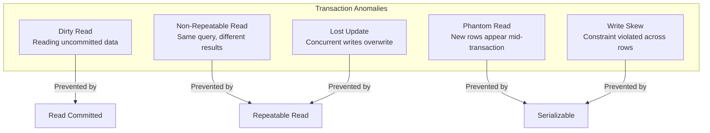
```mermaid
flowchart TD
    subgraph Anomalies["Transaction Anomalies"]
        DR[Dirty Read<br/>Reading uncommitted data]
        NRR[Non-Repeatable Read<br/>Same query, different results]
        PR[Phantom Read<br/>New rows appear mid-transaction]
        LU[Lost Update<br/>Concurrent writes overwrite]
        WS[Write Skew<br/>Constraint violated across rows]
    end
    
    DR --> |"Prevented by"| RC[Read Committed]
    NRR --> |"Prevented by"| RR[Repeatable Read]
    PR --> |"Prevented by"| SER[Serializable]
    LU --> |"Prevented by"| RR
    WS --> |"Prevented by"| SER
```

### Dirty Read: Seeing Uncommitted Changes

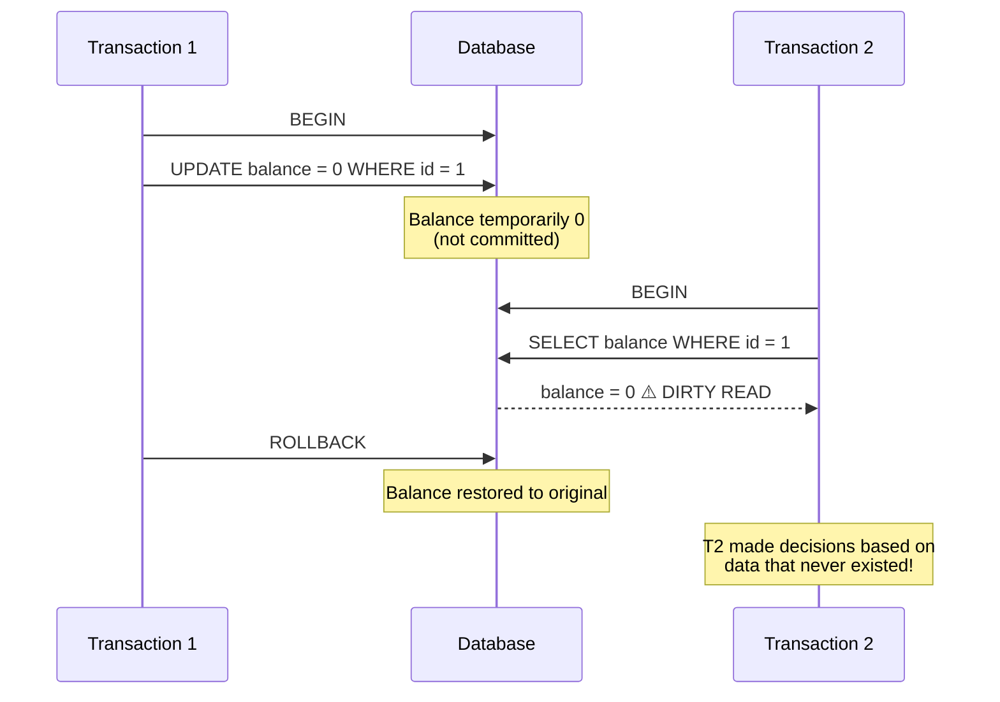
```mermaid
sequenceDiagram
    participant T1 as Transaction 1
    participant DB as Database
    participant T2 as Transaction 2
    
    T1->>DB: BEGIN
    T1->>DB: UPDATE balance = 0 WHERE id = 1
    Note over DB: Balance temporarily 0<br/>(not committed)
    
    T2->>DB: BEGIN
    T2->>DB: SELECT balance WHERE id = 1
    DB-->>T2: balance = 0 ⚠️ DIRTY READ
    
    T1->>DB: ROLLBACK
    Note over DB: Balance restored to original
    
    Note over T2: T2 made decisions based on<br/>data that never existed!
```

**Real-World Impact**: A report shows $0 balance during a failed transfer, triggering false fraud alerts.

### Non-Repeatable Read: Data Changes Mid-Transaction

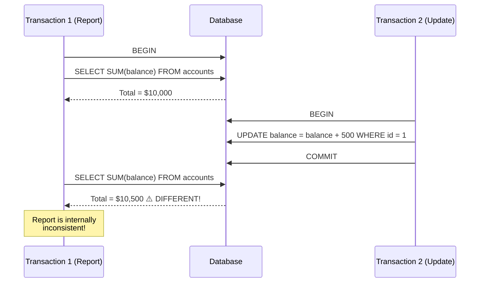
```mermaid
sequenceDiagram
    participant T1 as Transaction 1 (Report)
    participant DB as Database
    participant T2 as Transaction 2 (Update)
    
    T1->>DB: BEGIN
    T1->>DB: SELECT SUM(balance) FROM accounts
    DB-->>T1: Total = $10,000
    
    T2->>DB: BEGIN
    T2->>DB: UPDATE balance = balance + 500 WHERE id = 1
    T2->>DB: COMMIT
    
    T1->>DB: SELECT SUM(balance) FROM accounts
    DB-->>T1: Total = $10,500 ⚠️ DIFFERENT!
    
    Note over T1: Report is internally<br/>inconsistent!
```

**Real-World Impact**: A financial report shows different totals in different sections.

### Phantom Read: New Rows Appear

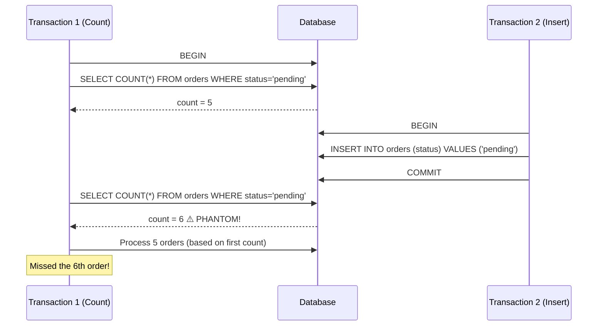
```mermaid
sequenceDiagram
    participant T1 as Transaction 1 (Count)
    participant DB as Database
    participant T2 as Transaction 2 (Insert)
    
    T1->>DB: BEGIN
    T1->>DB: SELECT COUNT(*) FROM orders WHERE status='pending'
    DB-->>T1: count = 5
    
    T2->>DB: BEGIN
    T2->>DB: INSERT INTO orders (status) VALUES ('pending')
    T2->>DB: COMMIT
    
    T1->>DB: SELECT COUNT(*) FROM orders WHERE status='pending'
    DB-->>T1: count = 6 ⚠️ PHANTOM!
    
    T1->>DB: Process 5 orders (based on first count)
    Note over T1: Missed the 6th order!
```

**Real-World Impact**: Batch processing misses items added during execution.

### Lost Update: Concurrent Writes Overwrite

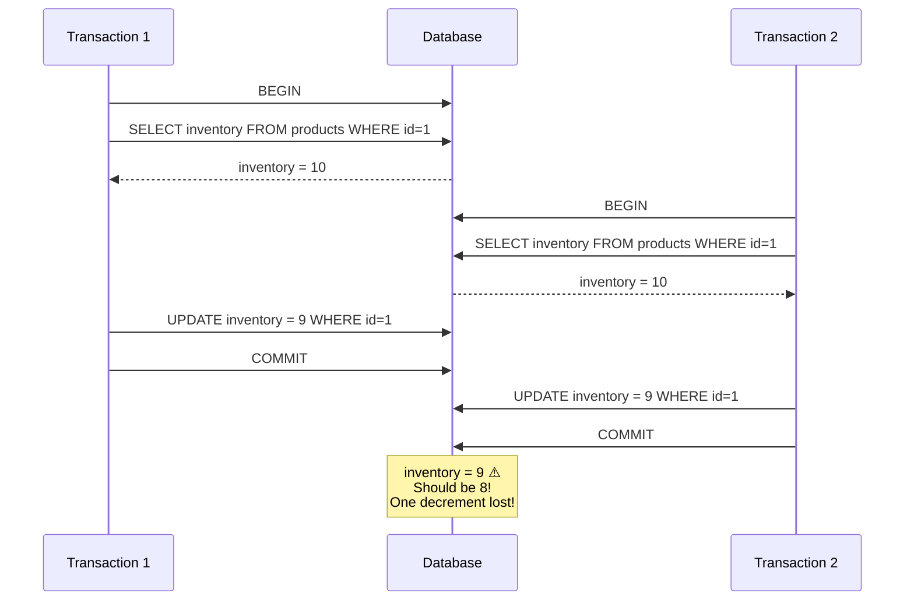
```mermaid
sequenceDiagram
    participant T1 as Transaction 1
    participant DB as Database
    participant T2 as Transaction 2
    
    T1->>DB: BEGIN
    T1->>DB: SELECT inventory FROM products WHERE id=1
    DB-->>T1: inventory = 10
    
    T2->>DB: BEGIN
    T2->>DB: SELECT inventory FROM products WHERE id=1
    DB-->>T2: inventory = 10
    
    T1->>DB: UPDATE inventory = 9 WHERE id=1
    T1->>DB: COMMIT
    
    T2->>DB: UPDATE inventory = 9 WHERE id=1
    T2->>DB: COMMIT
    
    Note over DB: inventory = 9 ⚠️<br/>Should be 8!<br/>One decrement lost!
```

**Real-World Impact**: Inventory oversold; two customers get the same last item.

### Write Skew: Constraint Violated Across Rows

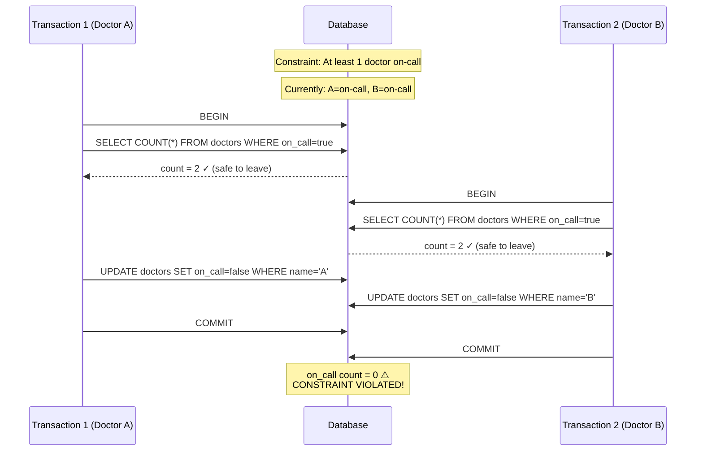
```mermaid
sequenceDiagram
    participant T1 as Transaction 1 (Doctor A)
    participant DB as Database
    participant T2 as Transaction 2 (Doctor B)
    
    Note over DB: Constraint: At least 1 doctor on-call
    Note over DB: Currently: A=on-call, B=on-call
    
    T1->>DB: BEGIN
    T1->>DB: SELECT COUNT(*) FROM doctors WHERE on_call=true
    DB-->>T1: count = 2 ✓ (safe to leave)
    
    T2->>DB: BEGIN
    T2->>DB: SELECT COUNT(*) FROM doctors WHERE on_call=true
    DB-->>T2: count = 2 ✓ (safe to leave)
    
    T1->>DB: UPDATE doctors SET on_call=false WHERE name='A'
    T2->>DB: UPDATE doctors SET on_call=false WHERE name='B'
    
    T1->>DB: COMMIT
    T2->>DB: COMMIT
    
    Note over DB: on_call count = 0 ⚠️<br/>CONSTRAINT VIOLATED!
```

**Real-World Impact**: Hospital has no on-call doctor; overbooking flights/hotels.

---

## Isolation Levels Deep Dive

### Comparison Matrix

| Level | Dirty Read | Non-Repeatable | Phantom | Lost Update | Write Skew | Performance |
|-------|------------|----------------|---------|-------------|------------|-------------|
| **Read Uncommitted** | ✓ Possible | ✓ Possible | ✓ Possible | ✓ Possible | ✓ Possible | Fastest |
| **Read Committed** | ✗ Prevented | ✓ Possible | ✓ Possible | ✓ Possible | ✓ Possible | Fast |
| **Repeatable Read** | ✗ Prevented | ✗ Prevented | ✓ Possible | ✗ Prevented | ✓ Possible | Moderate |
| **Serializable** | ✗ Prevented | ✗ Prevented | ✗ Prevented | ✗ Prevented | ✗ Prevented | Slowest |

### Implementation Mechanisms

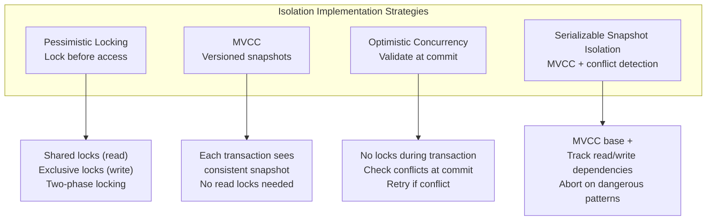
```mermaid
flowchart TD
    subgraph Mechanisms["Isolation Implementation Strategies"]
        LOCK[Pessimistic Locking<br/>Lock before access]
        MVCC[MVCC<br/>Versioned snapshots]
        OCC[Optimistic Concurrency<br/>Validate at commit]
        SSI[Serializable Snapshot Isolation<br/>MVCC + conflict detection]
    end
    
    LOCK --> L_IMPL["Shared locks (read)<br/>Exclusive locks (write)<br/>Two-phase locking"]
    MVCC --> M_IMPL["Each transaction sees<br/>consistent snapshot<br/>No read locks needed"]
    OCC --> O_IMPL["No locks during transaction<br/>Check conflicts at commit<br/>Retry if conflict"]
    SSI --> S_IMPL["MVCC base +<br/>Track read/write dependencies<br/>Abort on dangerous patterns"]
```

---

## Concurrency Control Mechanisms

### Pessimistic Locking (Two-Phase Locking)

**Philosophy**: "Assume conflicts will happen. Lock early, prevent problems."

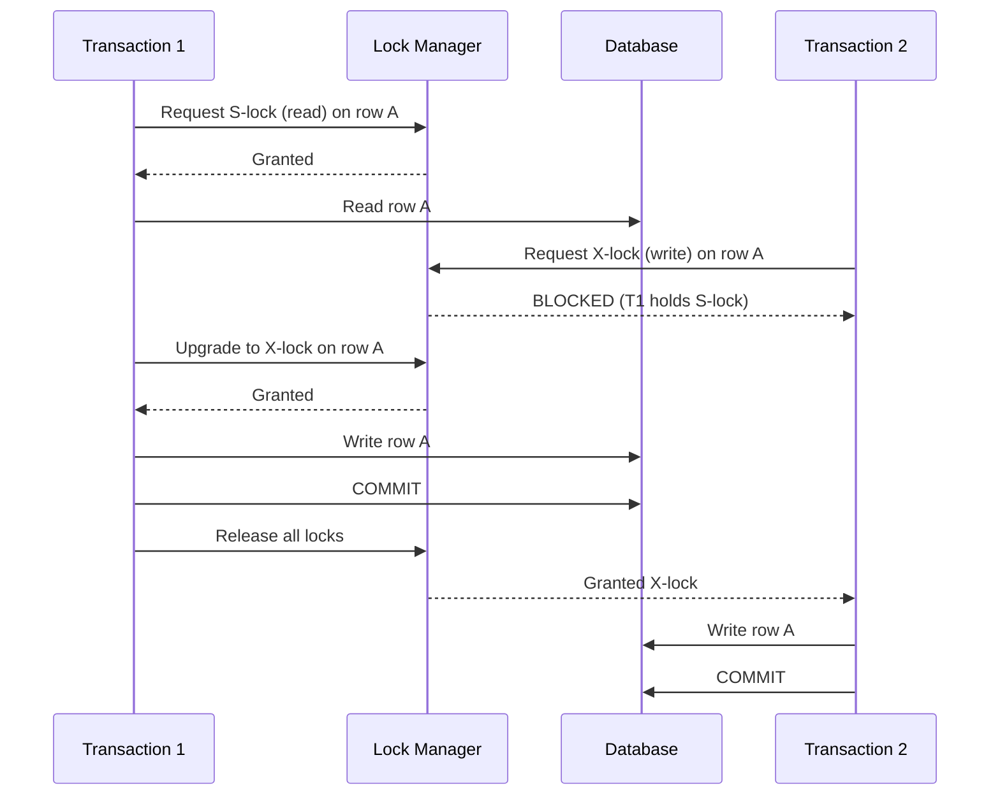
```mermaid
sequenceDiagram
    participant T1 as Transaction 1
    participant LM as Lock Manager
    participant DB as Database
    participant T2 as Transaction 2
    
    T1->>LM: Request S-lock (read) on row A
    LM-->>T1: Granted
    T1->>DB: Read row A
    
    T2->>LM: Request X-lock (write) on row A
    LM-->>T2: BLOCKED (T1 holds S-lock)
    
    T1->>LM: Upgrade to X-lock on row A
    LM-->>T1: Granted
    T1->>DB: Write row A
    T1->>DB: COMMIT
    T1->>LM: Release all locks
    
    LM-->>T2: Granted X-lock
    T2->>DB: Write row A
    T2->>DB: COMMIT
```

**Two-Phase Locking Protocol**:
1. **Growing Phase**: Acquire locks, never release
2. **Shrinking Phase**: Release locks, never acquire new ones

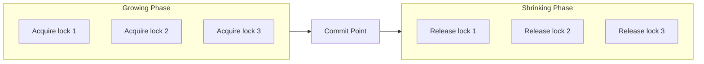
```mermaid
flowchart LR
    subgraph Growing["Growing Phase"]
        G1[Acquire lock 1]
        G2[Acquire lock 2]
        G3[Acquire lock 3]
    end
    
    subgraph Shrinking["Shrinking Phase"]
        S1[Release lock 1]
        S2[Release lock 2]
        S3[Release lock 3]
    end
    
    Growing --> COMMIT[Commit Point]
    COMMIT --> Shrinking
```

**Lock Types**:

| Lock Type | Compatible With | Use Case |
|-----------|----------------|----------|
| **S (Shared)** | S locks only | Reading data |
| **X (Exclusive)** | Nothing | Writing data |
| **IS (Intent Shared)** | IS, IX, S | Planning to read children |
| **IX (Intent Exclusive)** | IS, IX | Planning to write children |

### Deadlocks

**The Problem**:

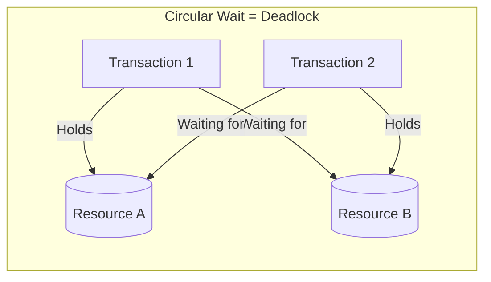
```mermaid
flowchart LR
    subgraph Deadlock["Circular Wait = Deadlock"]
        T1[Transaction 1]
        T2[Transaction 2]
        R1[(Resource A)]
        R2[(Resource B)]
    end
    
    T1 -->|Holds| R1
    T1 -->|Waiting for| R2
    T2 -->|Holds| R2
    T2 -->|Waiting for| R1
```

**Detection and Resolution**:

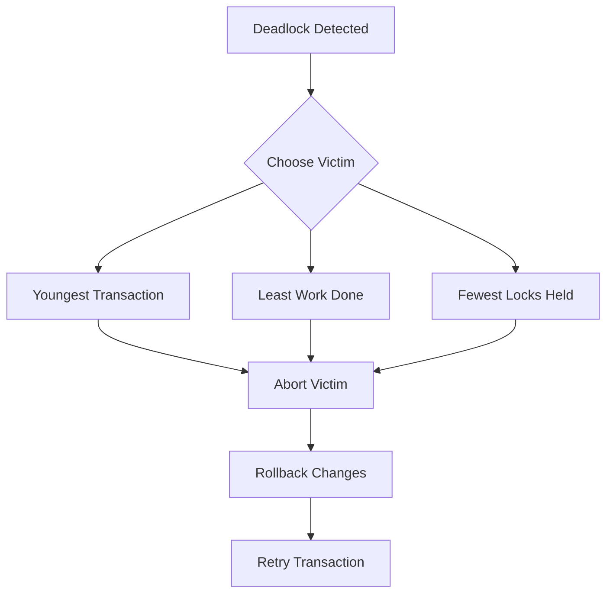
```mermaid
flowchart TD
    DEADLOCK[Deadlock Detected] --> CHOOSE{Choose Victim}
    
    CHOOSE --> AGE[Youngest Transaction]
    CHOOSE --> WORK[Least Work Done]
    CHOOSE --> LOCKS[Fewest Locks Held]
    
    AGE --> ABORT[Abort Victim]
    WORK --> ABORT
    LOCKS --> ABORT
    
    ABORT --> ROLLBACK[Rollback Changes]
    ROLLBACK --> RETRY[Retry Transaction]
```

**Prevention Strategies**:

| Strategy | How It Works | Trade-off |
|----------|--------------|-----------|
| **Lock ordering** | Always acquire locks in consistent order | Requires careful design |
| **Lock timeout** | Abort after waiting too long | May abort unnecessarily |
| **Wait-die** | Older waits, younger aborts | May abort new transactions |
| **Wound-wait** | Older aborts younger, younger waits | May abort partially done work |

---

### Multi-Version Concurrency Control (MVCC)

> **Reference:** Bernstein, P. & Goodman, N. (1983). "Multiversion Concurrency Control—Theory and Algorithms." ACM TODS.

**Complexity Comparison: MVCC vs Two-Phase Locking**

| Aspect | Two-Phase Locking (2PL) | MVCC |
|--------|-------------------------|------|
| **Read latency** | May block on write lock | Never blocks (reads snapshot) |
| **Write latency** | Acquires locks | Creates new version |
| **Space overhead** | Lock table O(active txns × locked rows) | Version chain O(versions × row size) |
| **Deadlock risk** | Yes (lock cycles) | No (but write-write conflicts abort) |
| **Long read txns** | Block writers | Don't block (but may cause version bloat) |
| **Garbage collection** | None needed | Vacuum/purge required |

**Philosophy**: "Readers never block writers. Writers never block readers."

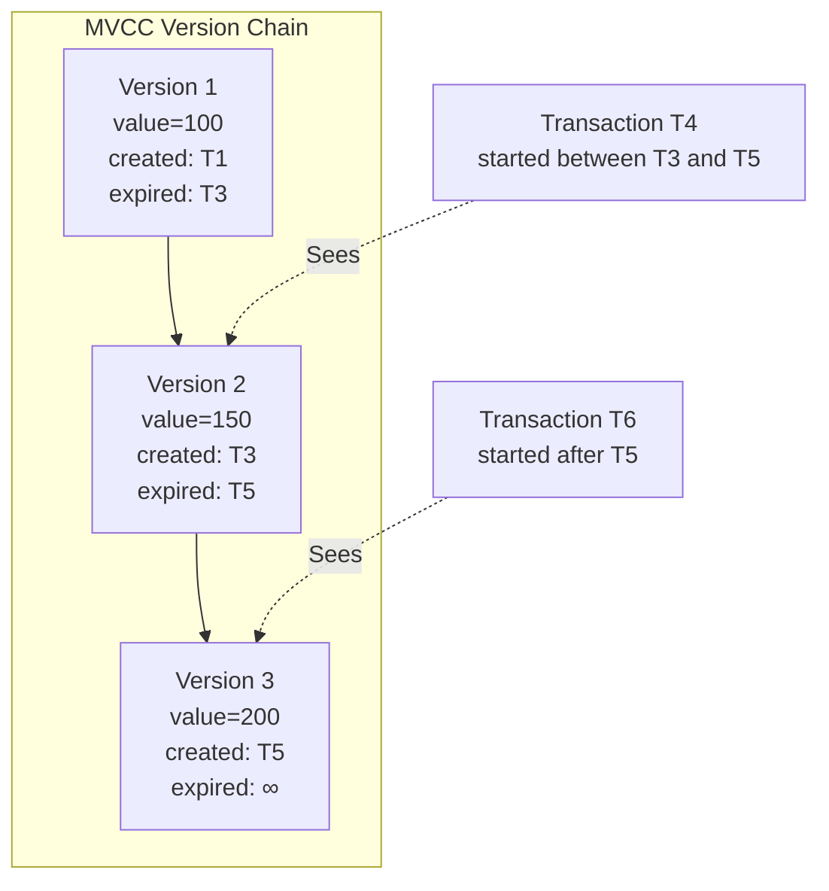
```mermaid
flowchart TD
    subgraph MVCC["MVCC Version Chain"]
        V1["Version 1<br/>value=100<br/>created: T1<br/>expired: T3"]
        V2["Version 2<br/>value=150<br/>created: T3<br/>expired: T5"]
        V3["Version 3<br/>value=200<br/>created: T5<br/>expired: ∞"]
    end
    
    V1 --> V2 --> V3
    
    T4[Transaction T4<br/>started between T3 and T5] -.->|"Sees"| V2
    T6[Transaction T6<br/>started after T5] -.->|"Sees"| V3
```

**How It Works**:

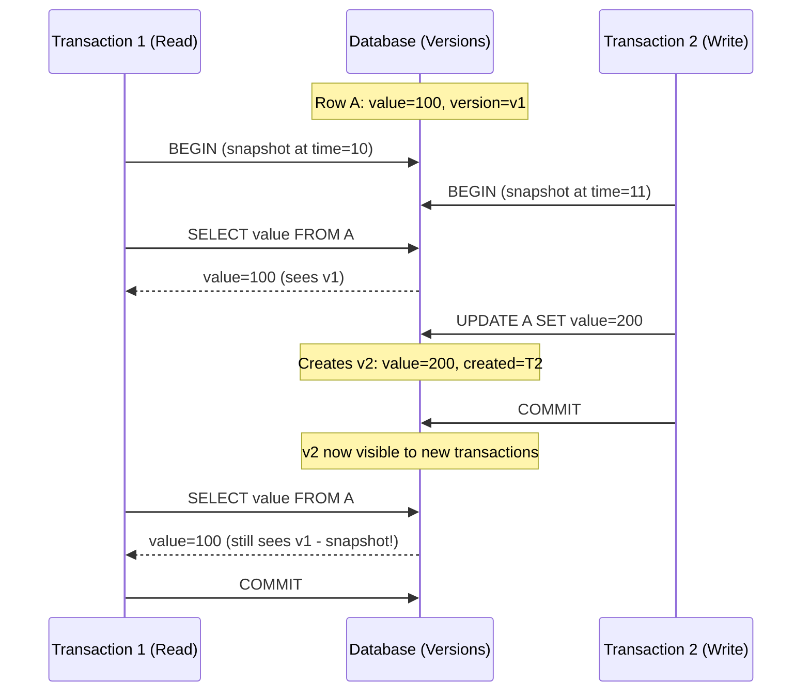
```mermaid
sequenceDiagram
    participant T1 as Transaction 1 (Read)
    participant DB as Database (Versions)
    participant T2 as Transaction 2 (Write)
    
    Note over DB: Row A: value=100, version=v1
    
    T1->>DB: BEGIN (snapshot at time=10)
    T2->>DB: BEGIN (snapshot at time=11)
    
    T1->>DB: SELECT value FROM A
    DB-->>T1: value=100 (sees v1)
    
    T2->>DB: UPDATE A SET value=200
    Note over DB: Creates v2: value=200, created=T2
    
    T2->>DB: COMMIT
    Note over DB: v2 now visible to new transactions
    
    T1->>DB: SELECT value FROM A
    DB-->>T1: value=100 (still sees v1 - snapshot!)
    
    T1->>DB: COMMIT
```

**PostgreSQL MVCC Implementation**:

| Field | Purpose |
|-------|---------|
| `xmin` | Transaction ID that created this version |
| `xmax` | Transaction ID that deleted/updated this version |
| `cmin/cmax` | Command ID within transaction |
| `ctid` | Physical location of row |

**Garbage Collection (Vacuum)**:
```
┌─────────────────────────────────────────────────────────────────┐
│  MVCC requires cleanup of old versions (dead tuples)            │
├─────────────────────────────────────────────────────────────────┤
│                                                                  │
│  Before Vacuum:          After Vacuum:                          │
│  ┌────────────────┐      ┌────────────────┐                     │
│  │ v1 (dead)      │      │ v3 (current)   │                     │
│  │ v2 (dead)      │  →   └────────────────┘                     │
│  │ v3 (current)   │                                             │
│  └────────────────┘      Dead tuples removed                    │
│                                                                  │
│  PostgreSQL: VACUUM, autovacuum                                 │
│  MySQL: Purge thread                                            │
│                                                                  │
└─────────────────────────────────────────────────────────────────┘
```

---

### Optimistic Concurrency Control (OCC)

**Philosophy**: "Assume conflicts are rare. Validate at commit time."

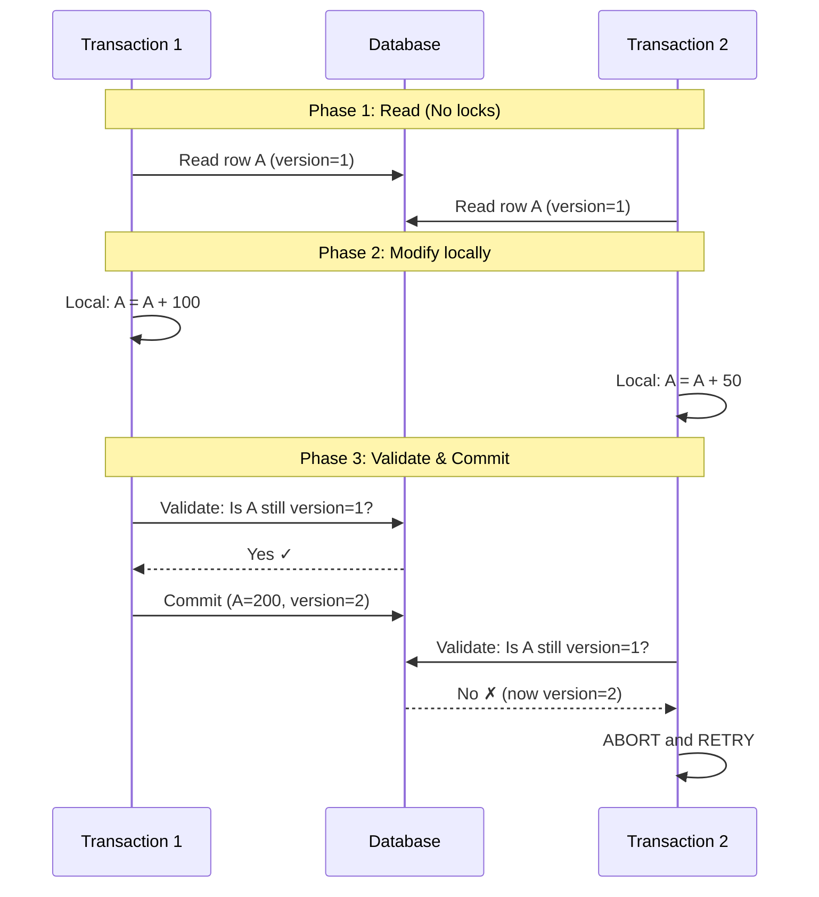
```mermaid
sequenceDiagram
    participant T1 as Transaction 1
    participant DB as Database
    participant T2 as Transaction 2
    
    Note over T1,T2: Phase 1: Read (No locks)
    T1->>DB: Read row A (version=1)
    T2->>DB: Read row A (version=1)
    
    Note over T1,T2: Phase 2: Modify locally
    T1->>T1: Local: A = A + 100
    T2->>T2: Local: A = A + 50
    
    Note over T1,T2: Phase 3: Validate & Commit
    T1->>DB: Validate: Is A still version=1?
    DB-->>T1: Yes ✓
    T1->>DB: Commit (A=200, version=2)
    
    T2->>DB: Validate: Is A still version=1?
    DB-->>T2: No ✗ (now version=2)
    T2->>T2: ABORT and RETRY
```

**Implementation: Version Numbers**

```sql
-- Read with version
SELECT id, name, balance, version 
FROM accounts WHERE id = 123;
-- Returns: id=123, name='Alice', balance=1000, version=5

-- Update with optimistic lock
UPDATE accounts 
SET balance = 900, version = version + 1
WHERE id = 123 AND version = 5;

-- Check affected rows
-- If 0 rows affected → conflict detected → retry
```

**When to Use OCC**:

| Use OCC When | Avoid OCC When |
|--------------|----------------|
| Low contention (few conflicts) | High contention (many conflicts) |
| Short transactions | Long transactions |
| Read-heavy workloads | Write-heavy workloads |
| Web applications | Batch processing |

---

## Distributed Transactions

### The Challenge

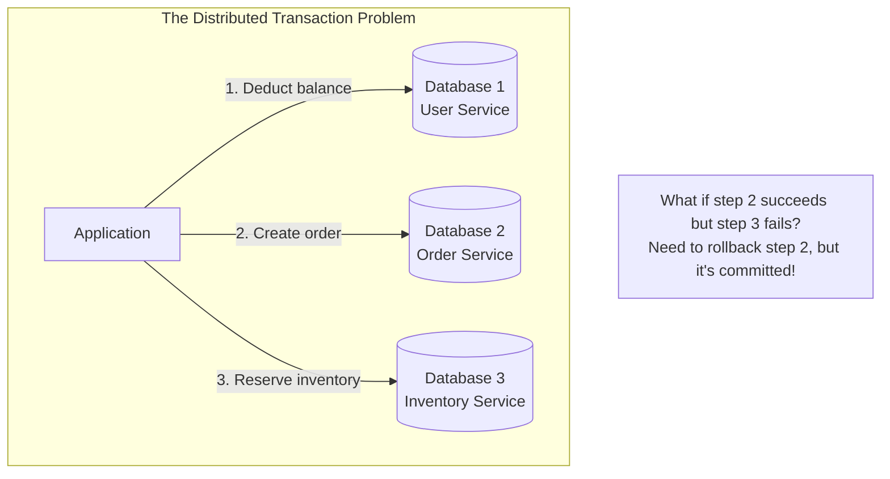
```mermaid
flowchart TD
    subgraph Problem["The Distributed Transaction Problem"]
        APP[Application]
        DB1[(Database 1<br/>User Service)]
        DB2[(Database 2<br/>Order Service)]
        DB3[(Database 3<br/>Inventory Service)]
    end
    
    APP --> |"1. Deduct balance"| DB1
    APP --> |"2. Create order"| DB2
    APP --> |"3. Reserve inventory"| DB3
    
    QUESTION["What if step 2 succeeds but step 3 fails?<br/>Need to rollback step 2, but it's committed!"]
```

### Two-Phase Commit (2PC)

> **Reference:** Gray, J. (1978). "Notes on Data Base Operating Systems." Operating Systems: An Advanced Course. Springer.

**Complexity Analysis:**

| Metric | Value | Notes |
|--------|-------|-------|
| **Message complexity** | O(3n) | Prepare + vote + commit for n participants |
| **Time complexity** | O(2 RTT) | Prepare-vote round + commit-ack round |
| **Space (coordinator)** | O(n) | Track participant state |
| **Space (participant)** | O(1) | Local transaction state only |
| **Blocking** | Yes | Participants hold locks during protocol |

**The Protocol**:

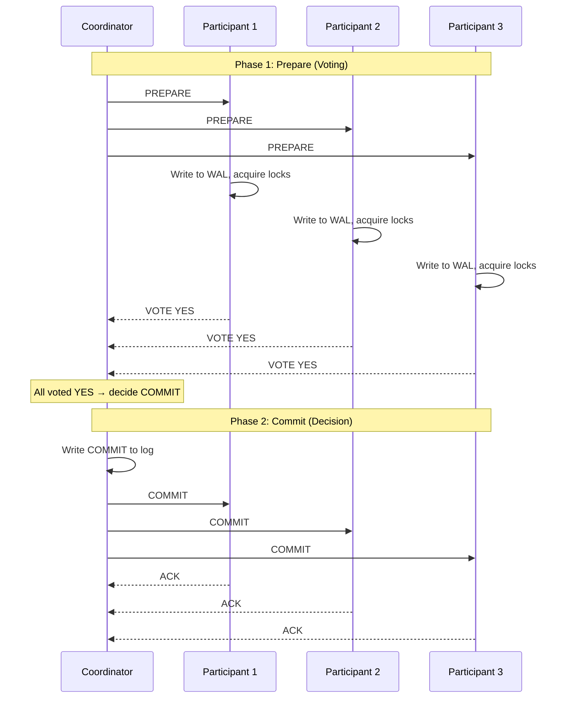
```mermaid
sequenceDiagram
    participant C as Coordinator
    participant P1 as Participant 1
    participant P2 as Participant 2
    participant P3 as Participant 3
    
    Note over C,P3: Phase 1: Prepare (Voting)
    C->>P1: PREPARE
    C->>P2: PREPARE
    C->>P3: PREPARE
    
    P1->>P1: Write to WAL, acquire locks
    P2->>P2: Write to WAL, acquire locks
    P3->>P3: Write to WAL, acquire locks
    
    P1-->>C: VOTE YES
    P2-->>C: VOTE YES
    P3-->>C: VOTE YES
    
    Note over C: All voted YES → decide COMMIT
    
    Note over C,P3: Phase 2: Commit (Decision)
    C->>C: Write COMMIT to log
    C->>P1: COMMIT
    C->>P2: COMMIT
    C->>P3: COMMIT
    
    P1-->>C: ACK
    P2-->>C: ACK
    P3-->>C: ACK
```

**Failure Scenarios**:

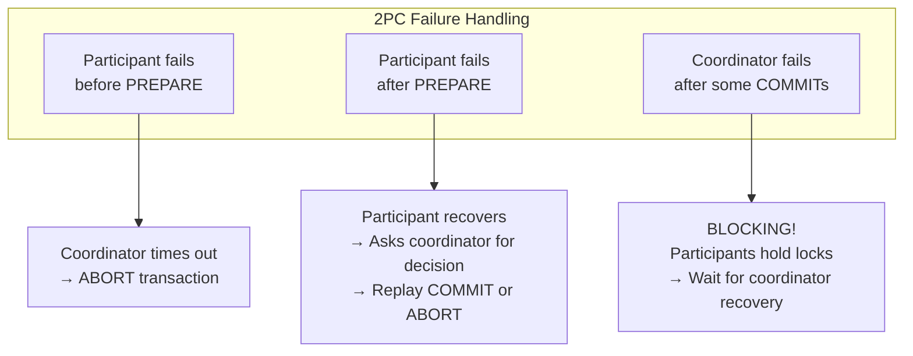
```mermaid
flowchart TD
    subgraph Scenarios["2PC Failure Handling"]
        S1[Participant fails<br/>before PREPARE]
        S2[Participant fails<br/>after PREPARE]
        S3[Coordinator fails<br/>after some COMMITs]
    end
    
    S1 --> A1[Coordinator times out<br/>→ ABORT transaction]
    S2 --> A2[Participant recovers<br/>→ Asks coordinator for decision<br/>→ Replay COMMIT or ABORT]
    S3 --> A3[BLOCKING!<br/>Participants hold locks<br/>→ Wait for coordinator recovery]
```

**The Blocking Problem**:

```
┌─────────────────────────────────────────────────────────────────┐
│  2PC BLOCKING SCENARIO                                           │
├─────────────────────────────────────────────────────────────────┤
│                                                                  │
│  1. Coordinator sends PREPARE to all                             │
│  2. All participants vote YES                                    │
│  3. Coordinator decides COMMIT                                   │
│  4. Coordinator sends COMMIT to P1, then CRASHES                 │
│                                                                  │
│  Result:                                                         │
│  • P1: Committed                                                 │
│  • P2, P3: Prepared but uncertain                                │
│  • P2, P3 CANNOT proceed (might need to abort if C chose abort)  │
│  • P2, P3 CANNOT abort (might need to commit if C chose commit)  │
│  • P2, P3 must WAIT with locks held → BLOCKING                   │
│                                                                  │
└─────────────────────────────────────────────────────────────────┘
```

### Three-Phase Commit (3PC)

**Adds Pre-Commit Phase**:

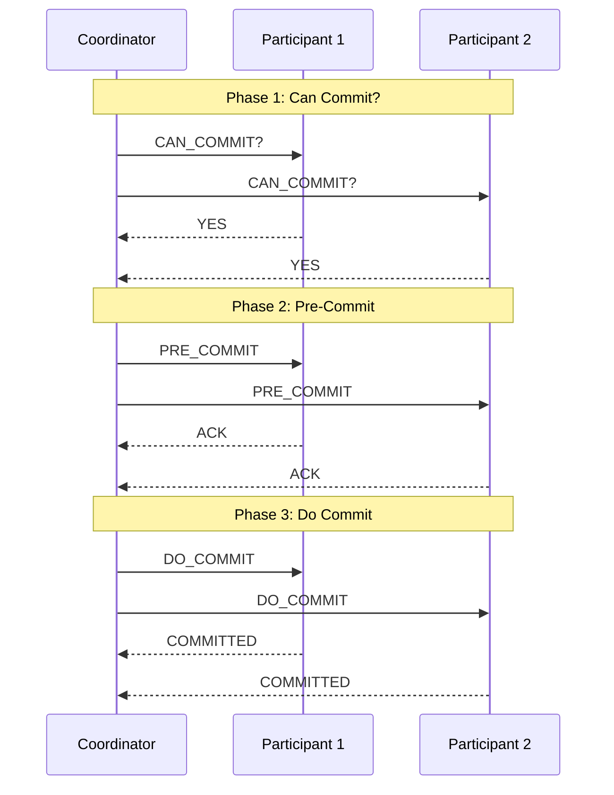
```mermaid
sequenceDiagram
    participant C as Coordinator
    participant P1 as Participant 1
    participant P2 as Participant 2
    
    Note over C,P2: Phase 1: Can Commit?
    C->>P1: CAN_COMMIT?
    C->>P2: CAN_COMMIT?
    P1-->>C: YES
    P2-->>C: YES
    
    Note over C,P2: Phase 2: Pre-Commit
    C->>P1: PRE_COMMIT
    C->>P2: PRE_COMMIT
    P1-->>C: ACK
    P2-->>C: ACK
    
    Note over C,P2: Phase 3: Do Commit
    C->>P1: DO_COMMIT
    C->>P2: DO_COMMIT
    P1-->>C: COMMITTED
    P2-->>C: COMMITTED
```

**Why 3PC Helps**:
- If coordinator fails after PRE_COMMIT, participants can timeout and commit (they know coordinator decided to commit)
- Non-blocking: participants can make progress without coordinator

**Why 3PC Isn't Widely Used**:
- Still fails under network partitions
- Higher latency (3 round trips vs 2)
- Complexity not worth it for most use cases

---

### Saga Pattern

> **Reference:** Garcia-Molina, H. & Salem, K. (1987). "Sagas." ACM SIGMOD Conference.

**Philosophy**: "If we can't have atomic distributed transactions, use a sequence of local transactions with compensating actions."

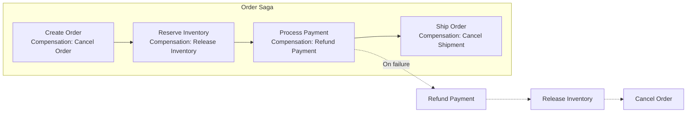
```mermaid
flowchart LR
    subgraph Saga["Order Saga"]
        T1[Create Order<br/>Compensation: Cancel Order]
        T2[Reserve Inventory<br/>Compensation: Release Inventory]
        T3[Process Payment<br/>Compensation: Refund Payment]
        T4[Ship Order<br/>Compensation: Cancel Shipment]
    end
    
    T1 --> T2 --> T3 --> T4
    
    T3 -.->|"On failure"| C3[Refund Payment]
    C3 -.-> C2[Release Inventory]
    C2 -.-> C1[Cancel Order]
```

**Choreography vs Orchestration**:

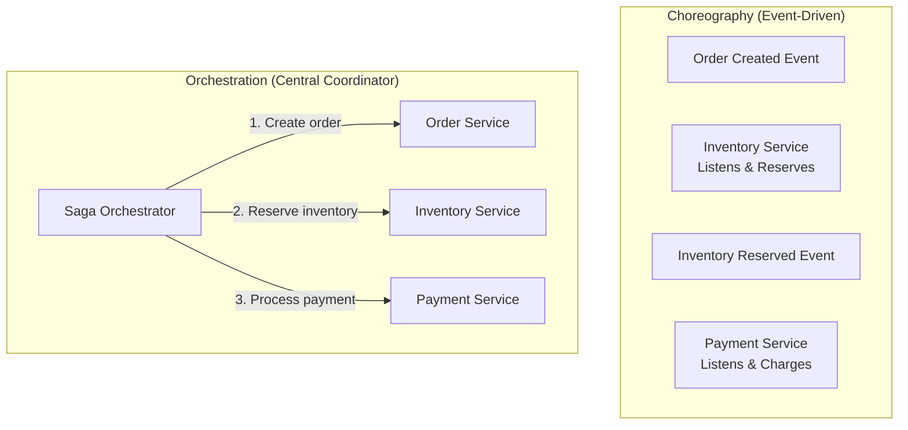
```mermaid
flowchart TD
    subgraph Choreography["Choreography (Event-Driven)"]
        E1[Order Created Event]
        S1[Inventory Service<br/>Listens & Reserves]
        E2[Inventory Reserved Event]
        S2[Payment Service<br/>Listens & Charges]
    end
    
    subgraph Orchestration["Orchestration (Central Coordinator)"]
        O[Saga Orchestrator]
        OS1[Order Service]
        OS2[Inventory Service]
        OS3[Payment Service]
        
        O -->|"1. Create order"| OS1
        O -->|"2. Reserve inventory"| OS2
        O -->|"3. Process payment"| OS3
    end
```

| Aspect | Choreography | Orchestration |
|--------|--------------|---------------|
| **Coupling** | Loose | Tighter (via orchestrator) |
| **Visibility** | Hard to track saga state | Centralized saga state |
| **Complexity** | Distributed logic | Centralized logic |
| **Single Point of Failure** | None | Orchestrator |
| **Testing** | Harder | Easier |

**Saga Implementation Example**:

```mermaid
sequenceDiagram
    participant O as Orchestrator
    participant Order as Order Service
    participant Inv as Inventory Service
    participant Pay as Payment Service
    
    O->>Order: createOrder()
    Order-->>O: orderId=123 ✓
    
    O->>Inv: reserveInventory(orderId=123)
    Inv-->>O: reserved ✓
    
    O->>Pay: processPayment(orderId=123)
    Pay-->>O: FAILED ✗
    
    Note over O: Payment failed → Compensate
    
    O->>Inv: releaseInventory(orderId=123)
    Inv-->>O: released ✓
    
    O->>Order: cancelOrder(orderId=123)
    Order-->>O: cancelled ✓
    
    Note over O: Saga completed with compensation
```

**Saga State Machine**:

```mermaid
stateDiagram-v2
    [*] --> OrderCreated: Create Order
    OrderCreated --> InventoryReserved: Reserve Inventory
    InventoryReserved --> PaymentProcessed: Process Payment
    PaymentProcessed --> OrderCompleted: Ship Order
    OrderCompleted --> [*]
    
    OrderCreated --> OrderCancelled: Inventory Failed
    InventoryReserved --> InventoryReleased: Payment Failed
    InventoryReleased --> OrderCancelled: Compensation
    PaymentProcessed --> PaymentRefunded: Shipping Failed
    PaymentRefunded --> InventoryReleased: Compensation
    OrderCancelled --> [*]
```

---

## Transaction Patterns for Microservices

### Transactional Outbox Pattern

**Problem**: How to reliably publish events when database changes?

```mermaid
flowchart TD
    subgraph Problem["The Problem"]
        P1["1. Update database"]
        P2["2. Publish event"]
        CRASH["System crash between 1 and 2?<br/>→ Database updated, event lost!"]
    end
    
    P1 --> CRASH
    CRASH --> P2
```

**Solution**:

```mermaid
flowchart TD
    subgraph Outbox["Transactional Outbox Pattern"]
        APP[Application]
        DB[(Database)]
        OT[Outbox Table]
        RELAY[Message Relay]
        QUEUE[Message Queue]
    end
    
    APP -->|"Single Transaction:<br/>1. Update data<br/>2. Insert to outbox"| DB
    DB --> OT
    RELAY -->|"Poll/CDC"| OT
    RELAY -->|"Publish"| QUEUE
```

```sql
-- Single atomic transaction
BEGIN;
  -- Business operation
  UPDATE accounts SET balance = balance - 100 WHERE id = 1;
  
  -- Record event in outbox
  INSERT INTO outbox (aggregate_id, event_type, payload)
  VALUES (1, 'BalanceDeducted', '{"amount": 100}');
COMMIT;

-- Separate process reads outbox and publishes to message queue
```

### Change Data Capture (CDC)

**Alternative to Outbox polling**:

```mermaid
flowchart LR
    DB[(Database<br/>Transaction Log)]
    CDC[CDC Connector<br/>Debezium]
    KAFKA[Kafka]
    CONSUMER[Consumers]
    
    DB -->|"Stream changes"| CDC
    CDC -->|"Publish"| KAFKA
    KAFKA --> CONSUMER
```

---

## Interview Patterns

### How to Discuss in 30 Seconds

> "Transaction isolation prevents anomalies like dirty reads and lost updates. Most systems use Read Committed or Repeatable Read as defaults—Serializable is safest but slowest. For distributed transactions, 2PC provides atomicity but can block. In microservices, the Saga pattern uses local transactions with compensating actions—it's eventually consistent but highly available."

### How to Discuss in 2 Minutes

Add:
- Explain one anomaly in detail (lost update is most intuitive)
- Contrast pessimistic locking vs MVCC
- Explain why 2PC blocks and how Sagas solve it
- Mention the transactional outbox pattern for event publishing

### Common Follow-Up Questions

| Question | Key Points to Cover |
|----------|---------------------|
| "What isolation level would you use for a banking system?" | Serializable for transfers (prevent lost updates), Read Committed for reads |
| "How do you prevent double-booking in a reservation system?" | Pessimistic locking (SELECT FOR UPDATE) or optimistic locking with version |
| "What's the difference between MVCC and locking?" | MVCC: readers don't block writers; Locking: explicit coordination |
| "How do you handle Saga failures?" | Compensating transactions, idempotent operations, saga state machine |
| "When would you choose 2PC over Saga?" | 2PC when atomicity is critical and latency acceptable; Saga for availability |

### Red Flags to Avoid

❌ Saying "just use Serializable isolation everywhere"  
✓ Acknowledge the performance trade-offs; match isolation to requirements

❌ Ignoring partial failures in distributed transactions  
✓ Always discuss compensation and idempotency

❌ Treating transactions as free  
✓ Discuss locking overhead, contention, and deadlock risk

❌ Conflating database transactions with distributed transactions  
✓ Local ACID is very different from distributed coordination

---

## Decision Framework

```mermaid
flowchart TD
    START[Transaction Design] --> Q1{Single database<br/>or distributed?}
    
    Q1 -->|Single DB| Q2{Contention level?}
    Q1 -->|Distributed| Q4{Need atomicity?}
    
    Q2 -->|Low contention| OCC[Optimistic Concurrency<br/>+ version numbers]
    Q2 -->|High contention| Q3{Need Serializable?}
    
    Q3 -->|Yes| SSI[Serializable Snapshot Isolation<br/>PostgreSQL SSI]
    Q3 -->|No| MVCC[MVCC with<br/>Repeatable Read/Read Committed]
    
    Q4 -->|Strict atomicity required| TWO_PC[2PC<br/>XA Transactions]
    Q4 -->|Eventual consistency OK| SAGA[Saga Pattern<br/>with compensation]
    
    SAGA --> Q5{Coordination style?}
    Q5 -->|Simple flow| CHOREO[Choreography<br/>Event-driven]
    Q5 -->|Complex flow| ORCH[Orchestration<br/>Central coordinator]
```

---

## Connections to Other Concepts

| Related Topic | Connection |
|---------------|------------|
| [Foundational Concepts](./01_FOUNDATIONAL_CONCEPTS.md) | Core distributed systems principles |
| [Communication Patterns](./02_COMMUNICATION_PATTERNS.md) | Sagas often use message queues for coordination |
| [Data Storage](./04_DATA_STORAGE_AND_ACCESS.md) | Storage engines and database selection |
| [Replication & Partitioning](./06_REPLICATION_AND_PARTITIONING.md) | Replication, distributed transactions |
| [Scaling & Infrastructure](./09_SCALING_AND_INFRASTRUCTURE.md) | Read/write patterns affect transaction design |

---

## Quick Reference Card

```
┌─────────────────────────────────────────────────────────────────┐
│          CONSISTENCY & TRANSACTIONS QUICK REFERENCE              │
├─────────────────────────────────────────────────────────────────┤
│                                                                  │
│  ISOLATION LEVELS (weakest → strongest)                         │
│  ─────────────────────────────────────                          │
│  Read Uncommitted → Read Committed → Repeatable Read            │
│  → Serializable                                                 │
│                                                                  │
│  ANOMALIES                                                       │
│  ─────────                                                       │
│  • Dirty Read: See uncommitted changes                          │
│  • Non-Repeatable: Same query, different results                │
│  • Phantom: New rows appear mid-transaction                     │
│  • Lost Update: Concurrent writes overwrite                     │
│  • Write Skew: Constraint violated across rows                  │
│                                                                  │
│  CONCURRENCY CONTROL                                             │
│  ───────────────────                                             │
│  • Pessimistic (2PL): Lock early, prevent conflicts             │
│  • MVCC: Versioned snapshots, readers don't block               │
│  • Optimistic: Validate at commit, retry on conflict            │
│                                                                  │
│  DISTRIBUTED TRANSACTIONS                                        │
│  ────────────────────────                                        │
│  • 2PC: Atomic but blocking (prepare → commit)                  │
│  • 3PC: Non-blocking but complex (rarely used)                  │
│  • Saga: Local transactions + compensation (eventual)           │
│                                                                  │
│  SAGA TYPES                                                      │
│  ──────────                                                      │
│  • Choreography: Events trigger next step (decentralized)       │
│  • Orchestration: Central coordinator manages flow              │
│                                                                  │
│  DECISION RULES                                                  │
│  ──────────────                                                  │
│  • Single DB + low contention → Optimistic locking              │
│  • Single DB + high contention → MVCC + appropriate isolation   │
│  • Distributed + must be atomic → 2PC (accept blocking)         │
│  • Distributed + can be eventual → Saga (prefer this)           │
│                                                                  │
└─────────────────────────────────────────────────────────────────┘
```

---

## Consistency Models Deep Dive

Understanding consistency models is critical for distributed systems. This section provides formal definitions and practical distinctions.

### Linearizability (Strong Consistency)

> **Reference:** Herlihy, M. & Wing, J. (1990). "Linearizability: A Correctness Condition for Concurrent Objects." ACM TOPLAS.

**Formal Definition:** A system is linearizable if every operation appears to take effect atomically at some point between its invocation and response, and operations appear in an order consistent with real-time ordering.

```mermaid
sequenceDiagram
    participant C1 as Client 1
    participant S as System
    participant C2 as Client 2

    Note over S: Initial: X = 0

    C1->>S: Write X = 1 (start)
    Note over S: Linearization point
    C1->>S: Write X = 1 (complete)

    C2->>S: Read X (start)
    Note over C2: Must see X = 1<br/>(happened after write completed)
    S->>C2: X = 1 (complete)
```

**Key Properties:**
1. **Recency:** Every read returns the most recent write
2. **Real-time ordering:** If op A completes before op B starts, A appears before B
3. **Single-copy illusion:** System behaves as if there's one copy of data

**Cost of Linearizability:**

| Requirement | Impact | Mitigation |
|-------------|--------|------------|
| **Global ordering** | Cross-datacenter latency | Single-region deployment |
| **Synchronous replication** | Write latency penalty | Quorum writes (N/2+1) |
| **Coordination** | Reduced throughput | Partition by key |

**Production Systems:**
- **Spanner:** Uses TrueTime for global linearizability
- **CockroachDB:** Hybrid logical clocks with serializable transactions
- **etcd/ZooKeeper:** Consensus-based linearizable key-value stores

### Sequential Consistency vs Serializability

A common source of confusion:

| Property | Scope | Guarantees | Example |
|----------|-------|------------|---------|
| **Sequential Consistency** | All operations | Total order consistent across all processes | Memory model |
| **Serializability** | Transactions | Transactions appear in *some* serial order | Database ACID |
| **Linearizability** | Operations | Real-time + sequential consistency | Distributed registers |
| **Strict Serializability** | Transactions | Serializability + real-time ordering | Spanner |

```mermaid
flowchart TD
    subgraph "Consistency Hierarchy"
        L[Linearizability<br/>Strongest for operations]
        SS[Strict Serializability<br/>Linearizable transactions]
        SER[Serializability<br/>Any equivalent serial order]
        SEQ[Sequential Consistency<br/>Program order preserved]
        EC[Eventual Consistency<br/>Convergence only]
    end

    L --> SS --> SER --> SEQ --> EC
```

**Interview Distinction:**
- *Serializability* ensures transactions execute as if in *some* serial order (but order can differ from real-time)
- *Linearizability* ensures operations respect *actual* real-time order
- *Strict serializability* combines both: transactions in real-time order

### Session Guarantees (PRAM Consistency)

For client-centric consistency, we define session guarantees:

| Guarantee | Definition | Example |
|-----------|------------|---------|
| **Read Your Writes** | A read following a write sees the write | See your own post after publishing |
| **Monotonic Reads** | Once you read a value, you never see older values | Timeline doesn't jump backward |
| **Monotonic Writes** | Writes by a session are seen in order | Bank transactions apply in order |
| **Writes Follow Reads** | Write after read incorporates the read's data | Reply includes parent comment |

```mermaid
sequenceDiagram
    participant C as Client
    participant S1 as Server 1
    participant S2 as Server 2

    Note over C,S2: Read Your Writes Violation

    C->>S1: Write X = 5
    S1-->>C: OK

    Note over S1,S2: Replication lag...

    C->>S2: Read X
    S2-->>C: X = 0 (Should see 5!)

    Note over C,S2: Solution: Sticky Sessions or Version Vectors
```

**Implementing Session Guarantees:**

| Approach | Mechanism | Trade-off |
|----------|-----------|-----------|
| **Sticky sessions** | Route client to same replica | Reduces availability |
| **Version vectors** | Track causality, route to up-to-date replica | Complexity |
| **Synchronous replication** | All replicas see write | Latency |
| **Client-side caching** | Merge local writes with reads | Stale other data |

### Jepsen Testing

[Jepsen](https://jepsen.io) is the industry standard for testing distributed systems consistency.

**What Jepsen Tests:**
- **Linearizability:** Operations appear atomic and ordered
- **Read uncommitted/committed:** Isolation level enforcement
- **Write skew:** Multi-row constraints
- **Clock skew tolerance:** Behavior under clock drift

**Notable Jepsen Findings:**

| System | Finding | Year |
|--------|---------|------|
| **MongoDB** | Stale reads, rollback data loss | 2015, 2020 |
| **Cassandra** | Lightweight transactions not serializable | 2020 |
| **PostgreSQL** | Serializable snapshot isolation verified | 2020 |
| **etcd** | Linearizable reads verified | 2020 |
| **CockroachDB** | Serializability holds under partitions | 2017 |

**Interview Reference:** "Before choosing a database for strong consistency requirements, I check its Jepsen report. Systems like etcd and CockroachDB have passed rigorous Jepsen testing for their claimed consistency guarantees."

---

## Practice Questions

1. **Design a seat reservation system** that prevents double-booking. What isolation level and locking strategy would you use?

2. **Your e-commerce checkout** spans order, inventory, and payment services. Design a Saga with compensating transactions for each failure point.

3. **Explain why MVCC allows higher concurrency** than two-phase locking. What's the trade-off?

4. **A long-running report keeps seeing inconsistent data** as other transactions modify the database. What isolation level would fix this? What's the cost?

5. **Design the transactional outbox pattern** for an order service that must reliably publish OrderCreated events.

---

---

## Revision History

| Date | Version | Changes |
|------|---------|---------|
| 2025-01 | 1.0 | Initial creation with isolation levels, 2PC, Sagas |
| 2025-01 | 2.0 | P1: Added linearizability formal definition, session guarantees (PRAM), Jepsen testing |
| 2025-01 | 2.1 | Added paper references (Gray, Berenson, Garcia-Molina, Herlihy & Wing, Bernstein) |
| 2025-01 | 2.2 | Added complexity analysis for 2PC and MVCC vs 2PL comparison |

---

*Previous: [02 - Communication Patterns](./02_COMMUNICATION_PATTERNS.md) | Next: [04 - Data Storage & Access](./04_DATA_STORAGE_AND_ACCESS.md)*
