# 03 — Data Storage and Access

> How you store and access data determines everything: latency, throughput, consistency, and cost. Master the storage layer, and you master the system.

**Prerequisites:** [01 — Foundational Concepts](./01_FOUNDATIONAL_CONCEPTS.md), [02 — Consistency & Transactions](./02_CONSISTENCY_AND_TRANSACTIONS.md)
**Builds toward:** [04 — Caching & Content Delivery](./04_CACHING_AND_CONTENT_DELIVERY.md), [06 — Distributed System Patterns](./06_DISTRIBUTED_SYSTEM_PATTERNS.md)  
**Estimated study time:** 4-5 hours

---

## Chapter Overview

This module covers the foundational decisions around data storage: how storage engines work internally, how to model data for specific access patterns, indexing strategies that determine read performance, and how to select the right storage tier for different data types.

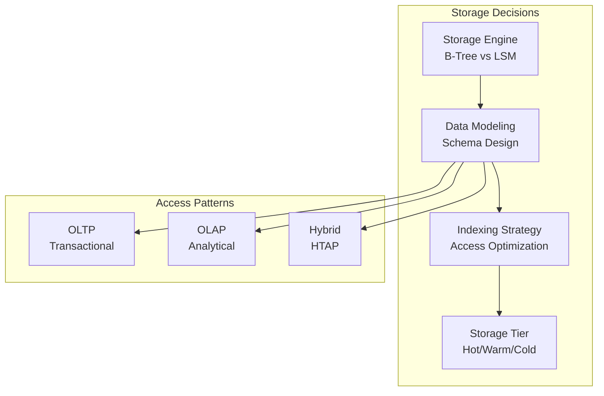
```mermaid
graph TB
    subgraph "Storage Decisions"
        ENGINE[Storage Engine<br/>B-Tree vs LSM]
        MODEL[Data Modeling<br/>Schema Design]
        INDEX[Indexing Strategy<br/>Access Optimization]
        TIER[Storage Tier<br/>Hot/Warm/Cold]
    end
    
    subgraph "Access Patterns"
        OLTP[OLTP<br/>Transactional]
        OLAP[OLAP<br/>Analytical]
        MIXED[Hybrid<br/>HTAP]
    end
    
    ENGINE --> MODEL
    MODEL --> INDEX
    INDEX --> TIER
    
    MODEL --> OLTP
    MODEL --> OLAP
    MODEL --> MIXED
```

---

## 1. Storage Engine Fundamentals

### Why Storage Engines Matter

The storage engine is the core of any database—it determines how data is physically written to and read from disk. Understanding storage engines helps you:
- Predict performance characteristics
- Choose the right database for your workload
- Optimize for read-heavy vs write-heavy patterns
- Understand durability and recovery guarantees

### The Two Dominant Paradigms

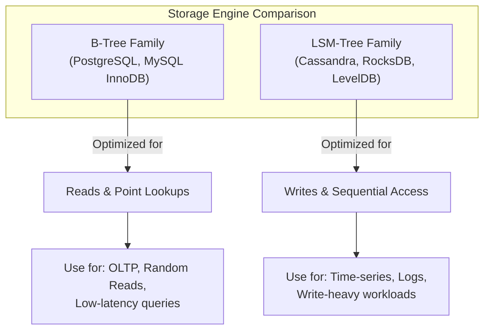
```mermaid
flowchart TB
    subgraph "Storage Engine Comparison"
        BTREE["B-Tree Family<br/>(PostgreSQL, MySQL InnoDB)"]
        LSM["LSM-Tree Family<br/>(Cassandra, RocksDB, LevelDB)"]
    end
    
    BTREE --> |"Optimized for"| READS["Reads & Point Lookups"]
    LSM --> |"Optimized for"| WRITES["Writes & Sequential Access"]
    
    READS --> USE_BTREE["Use for: OLTP, Random Reads,<br/>Low-latency queries"]
    WRITES --> USE_LSM["Use for: Time-series, Logs,<br/>Write-heavy workloads"]
```

---

### B-Tree Storage Engine (Read-Optimized)

B-Trees are the backbone of traditional relational databases. They maintain sorted data in a balanced tree structure optimized for both reads and writes.

#### How B-Trees Work

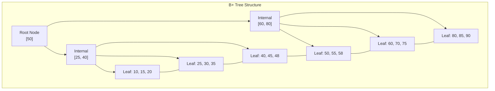
```mermaid
graph TD
    subgraph "B+ Tree Structure"
        ROOT["Root Node<br/>[50]"]
        
        INT1["Internal<br/>[25, 40]"]
        INT2["Internal<br/>[60, 80]"]
        
        LEAF1["Leaf: 10, 15, 20"]
        LEAF2["Leaf: 25, 30, 35"]
        LEAF3["Leaf: 40, 45, 48"]
        LEAF4["Leaf: 50, 55, 58"]
        LEAF5["Leaf: 60, 70, 75"]
        LEAF6["Leaf: 80, 85, 90"]
        
        ROOT --> INT1
        ROOT --> INT2
        INT1 --> LEAF1
        INT1 --> LEAF2
        INT1 --> LEAF3
        INT2 --> LEAF4
        INT2 --> LEAF5
        INT2 --> LEAF6
        
        LEAF1 --- LEAF2
        LEAF2 --- LEAF3
        LEAF3 --- LEAF4
        LEAF4 --- LEAF5
        LEAF5 --- LEAF6
    end
```

**Key Properties:**
- **Balanced:** All leaf nodes at the same depth → O(log n) operations
- **Sorted:** Data in leaf nodes is sorted → efficient range queries
- **Linked leaves:** Leaf nodes linked together → sequential scans
- **Page-based:** Data stored in fixed-size pages (typically 4-16KB)

#### B-Tree Write Path

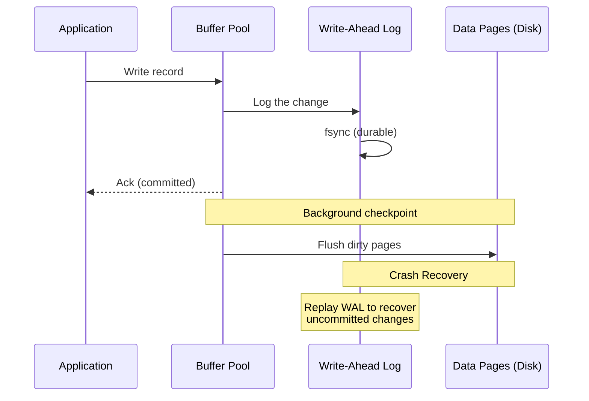
```mermaid
sequenceDiagram
    participant App as Application
    participant Buffer as Buffer Pool
    participant WAL as Write-Ahead Log
    participant Disk as Data Pages (Disk)
    
    App->>Buffer: Write record
    Buffer->>WAL: Log the change
    WAL->>WAL: fsync (durable)
    Buffer-->>App: Ack (committed)
    
    Note over Buffer,Disk: Background checkpoint
    Buffer->>Disk: Flush dirty pages
    
    Note over WAL,Disk: Crash Recovery
    Note over WAL: Replay WAL to recover<br/>uncommitted changes
```

**Write Amplification:** A single logical write may update multiple pages (splitting nodes, updating parent pointers). This is the cost of maintaining sorted order.

#### B-Tree Performance Characteristics

| Operation | Time Complexity | Notes |
|-----------|-----------------|-------|
| Point lookup | O(log n) | Traverse tree to leaf |
| Range scan | O(log n + k) | Find start + scan k records |
| Insert | O(log n) | May cause page splits |
| Update | O(log n) | In-place if fits, else relocate |
| Delete | O(log n) | May cause page merges |

---

### LSM-Tree Storage Engine (Write-Optimized)

Log-Structured Merge Trees convert random writes into sequential writes, dramatically improving write throughput at the cost of read performance.

#### How LSM-Trees Work

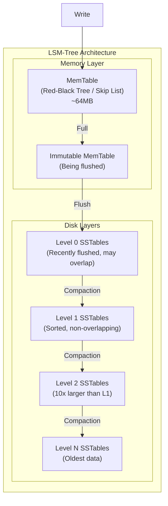
```mermaid
flowchart TB
    subgraph "LSM-Tree Architecture"
        subgraph Memory["Memory Layer"]
            MEMTABLE["MemTable<br/>(Red-Black Tree / Skip List)<br/>~64MB"]
            IMMUTABLE["Immutable MemTable<br/>(Being flushed)"]
        end
        
        subgraph Disk["Disk Layers"]
            L0["Level 0 SSTables<br/>(Recently flushed, may overlap)"]
            L1["Level 1 SSTables<br/>(Sorted, non-overlapping)"]
            L2["Level 2 SSTables<br/>(10x larger than L1)"]
            LN["Level N SSTables<br/>(Oldest data)"]
        end
    end
    
    WRITE[Write] --> MEMTABLE
    MEMTABLE --> |"Full"| IMMUTABLE
    IMMUTABLE --> |"Flush"| L0
    L0 --> |"Compaction"| L1
    L1 --> |"Compaction"| L2
    L2 --> |"Compaction"| LN
```

#### LSM-Tree Write Path

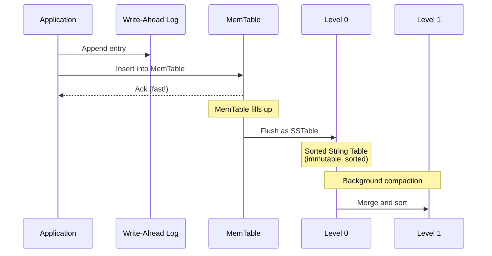
```mermaid
sequenceDiagram
    participant App as Application
    participant WAL as Write-Ahead Log
    participant Mem as MemTable
    participant L0 as Level 0
    participant L1 as Level 1
    
    App->>WAL: Append entry
    App->>Mem: Insert into MemTable
    Mem-->>App: Ack (fast!)
    
    Note over Mem: MemTable fills up
    
    Mem->>L0: Flush as SSTable
    Note over L0: Sorted String Table<br/>(immutable, sorted)
    
    Note over L0,L1: Background compaction
    L0->>L1: Merge and sort
```

**Key Insight:** Writes are always sequential appends to the WAL and sorted inserts to an in-memory structure. No random disk I/O during writes!

#### LSM-Tree Read Path

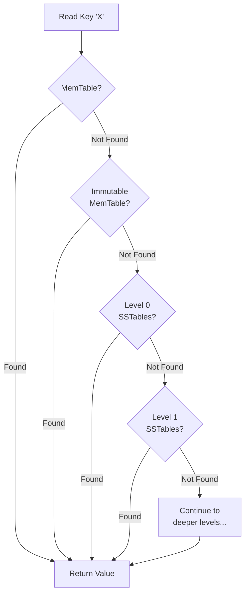
```mermaid
flowchart TD
    READ[Read Key 'X'] --> MEM{MemTable?}
    MEM -->|Found| RETURN[Return Value]
    MEM -->|Not Found| IMM{Immutable<br/>MemTable?}
    IMM -->|Found| RETURN
    IMM -->|Not Found| L0_CHECK{Level 0<br/>SSTables?}
    L0_CHECK -->|Found| RETURN
    L0_CHECK -->|Not Found| L1_CHECK{Level 1<br/>SSTables?}
    L1_CHECK -->|Found| RETURN
    L1_CHECK -->|Not Found| DEEPER[Continue to<br/>deeper levels...]
    DEEPER --> RETURN
```

**Read Amplification:** A single read may need to check multiple levels. Bloom filters help skip SSTables that definitely don't contain the key.

#### Compaction Strategies

| Strategy | Description | Trade-off |
|----------|-------------|-----------|
| **Size-Tiered** | Merge SSTables of similar size | Good write throughput, high space amplification |
| **Leveled** | Fixed-size levels, strict sorting | Better read performance, higher write amplification |
| **FIFO** | Delete oldest, never merge | Best for time-series with TTL |

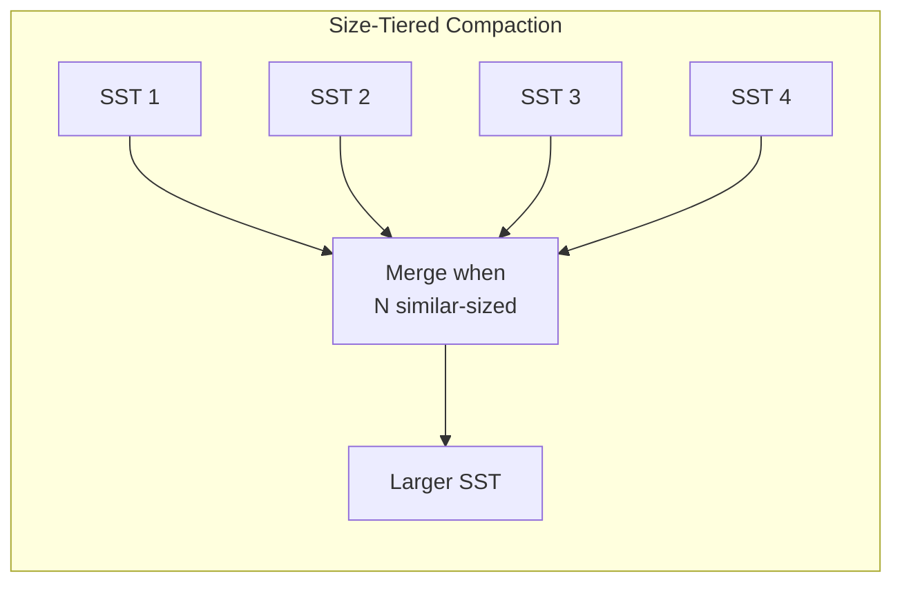
```mermaid
flowchart LR
    subgraph "Size-Tiered Compaction"
        ST1[SST 1] --> STM[Merge when<br/>N similar-sized]
        ST2[SST 2] --> STM
        ST3[SST 3] --> STM
        ST4[SST 4] --> STM
        STM --> STBig[Larger SST]
    end
```

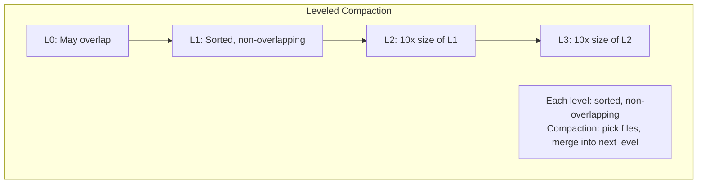
```mermaid
flowchart TD
    subgraph "Leveled Compaction"
        L0A[L0: May overlap] --> L1A[L1: Sorted, non-overlapping]
        L1A --> L2A[L2: 10x size of L1]
        L2A --> L3A[L3: 10x size of L2]
        
        Note1["Each level: sorted, non-overlapping<br/>Compaction: pick files, merge into next level"]
    end
```

---

### B-Tree vs LSM-Tree Comparison

| Aspect | B-Tree | LSM-Tree |
|--------|--------|----------|
| **Write performance** | Moderate (random I/O) | Excellent (sequential I/O) |
| **Read performance** | Excellent (single lookup) | Moderate (multi-level search) |
| **Write amplification** | Lower (~2-3x) | Higher (~10-30x) |
| **Read amplification** | 1x (typically) | Variable (depends on levels) |
| **Space amplification** | Low | Higher (during compaction) |
| **Range queries** | Excellent | Good (after compaction) |
| **Point lookups** | Excellent | Good (with bloom filters) |
| **Concurrent writes** | Limited by locking | Excellent (append-only) |
| **Predictable latency** | More predictable | Compaction can cause spikes |
| **Typical use cases** | OLTP, random access | Write-heavy, time-series, logs |

### Decision Framework: When to Use Which

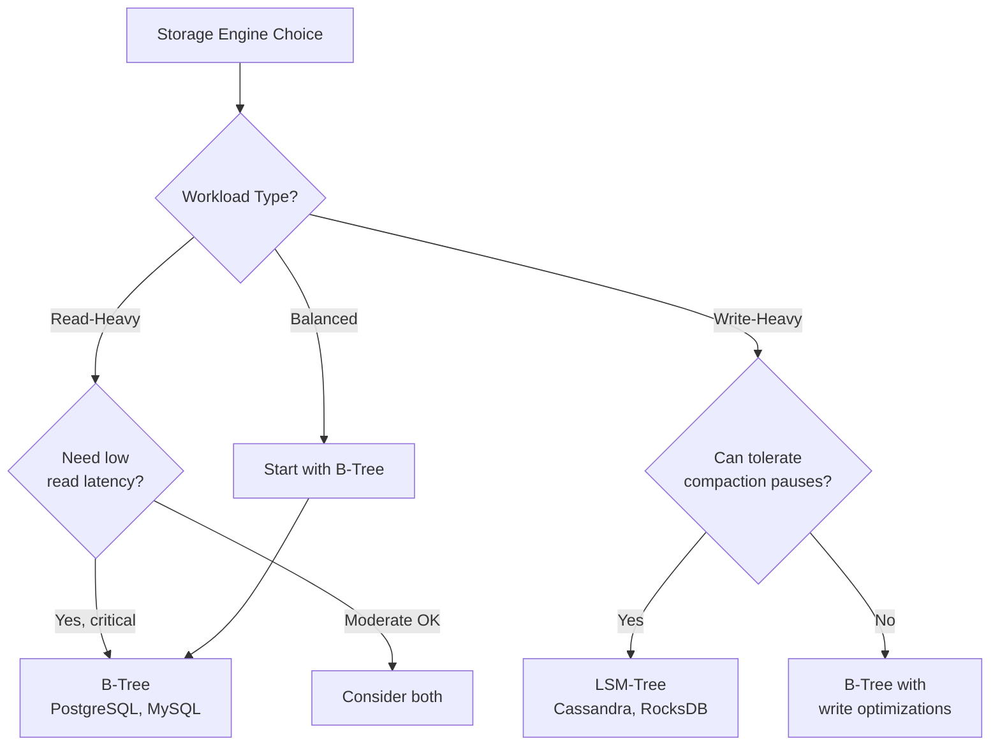
```mermaid
flowchart TD
    START[Storage Engine Choice] --> Q1{Workload Type?}
    
    Q1 -->|Read-Heavy| Q2{Need low<br/>read latency?}
    Q1 -->|Write-Heavy| Q3{Can tolerate<br/>compaction pauses?}
    Q1 -->|Balanced| BTREE_DEFAULT[Start with B-Tree]
    
    Q2 -->|Yes, critical| BTREE[B-Tree<br/>PostgreSQL, MySQL]
    Q2 -->|Moderate OK| CONSIDER[Consider both]
    
    Q3 -->|Yes| LSM[LSM-Tree<br/>Cassandra, RocksDB]
    Q3 -->|No| BTREE_HEAVY[B-Tree with<br/>write optimizations]
    
    BTREE_DEFAULT --> BTREE
```

---

## 2. Indexing Deep Dive

### Why Indexes Matter

Without indexes, every query is a full table scan—O(n) for every read. Indexes trade storage and write performance for dramatic read improvements.

```
Without Index:  SELECT * FROM users WHERE email = 'x'  → Scan 10M rows
With Index:     SELECT * FROM users WHERE email = 'x'  → O(log n) lookup
```

### Index Types and Their Use Cases

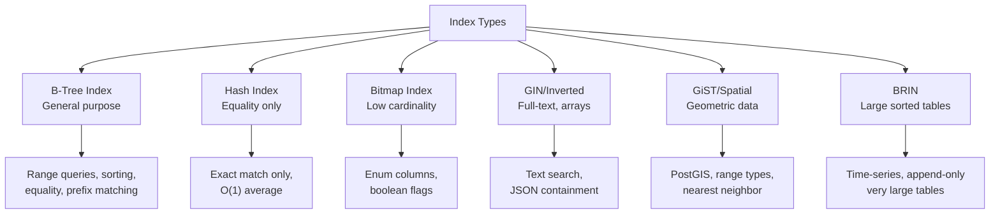
```mermaid
flowchart TB
    INDEX[Index Types]
    
    INDEX --> BTREE_IDX[B-Tree Index<br/>General purpose]
    INDEX --> HASH_IDX[Hash Index<br/>Equality only]
    INDEX --> BITMAP_IDX[Bitmap Index<br/>Low cardinality]
    INDEX --> GIN_IDX[GIN/Inverted<br/>Full-text, arrays]
    INDEX --> GIST_IDX[GiST/Spatial<br/>Geometric data]
    INDEX --> BRIN_IDX[BRIN<br/>Large sorted tables]
    
    BTREE_IDX --> BTREE_USE["Range queries, sorting,<br/>equality, prefix matching"]
    HASH_IDX --> HASH_USE["Exact match only,<br/>O(1) average"]
    BITMAP_IDX --> BITMAP_USE["Enum columns,<br/>boolean flags"]
    GIN_IDX --> GIN_USE["Text search,<br/>JSON containment"]
    GIST_IDX --> GIST_USE["PostGIS, range types,<br/>nearest neighbor"]
    BRIN_IDX --> BRIN_USE["Time-series, append-only<br/>very large tables"]
```

### B-Tree Index Deep Dive

The most common index type, supporting equality, range, sorting, and prefix queries.

#### Operations Supported

```sql
-- All these queries can use a B-Tree index on 'email'
SELECT * FROM users WHERE email = 'test@example.com';     -- Equality
SELECT * FROM users WHERE email > 'a' AND email < 'b';    -- Range
SELECT * FROM users WHERE email LIKE 'test%';             -- Prefix
SELECT * FROM users ORDER BY email LIMIT 10;              -- Sorting

-- This CANNOT use the index (suffix matching)
SELECT * FROM users WHERE email LIKE '%@example.com';     -- Full scan!
```

#### Composite (Multi-Column) Indexes

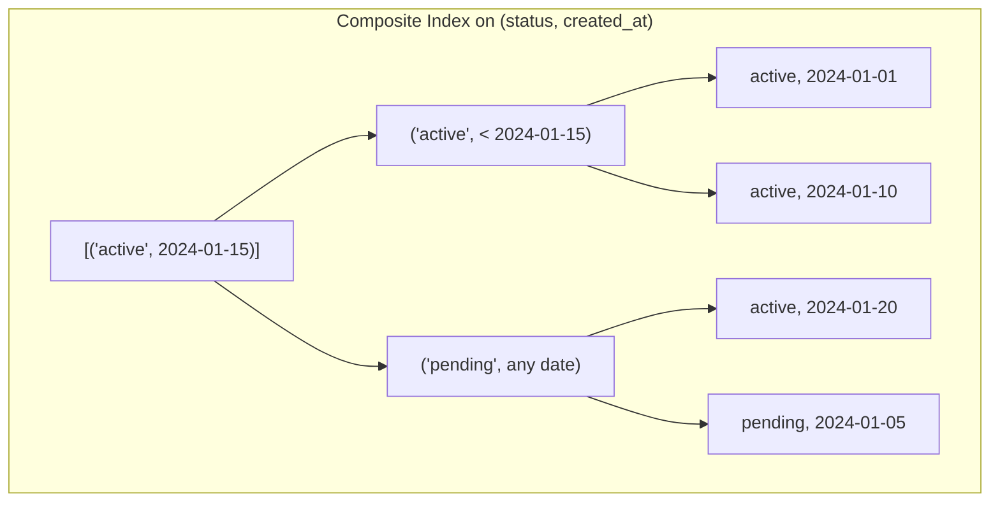
```mermaid
flowchart TD
    subgraph "Composite Index on (status, created_at)"
        ROOT2["[('active', 2024-01-15)]"]
        
        LEFT2["('active', < 2024-01-15)"]
        RIGHT2["('pending', any date)"]
        
        LEAF_A["active, 2024-01-01"]
        LEAF_B["active, 2024-01-10"]
        LEAF_C["active, 2024-01-20"]
        LEAF_D["pending, 2024-01-05"]
        
        ROOT2 --> LEFT2
        ROOT2 --> RIGHT2
        LEFT2 --> LEAF_A
        LEFT2 --> LEAF_B
        RIGHT2 --> LEAF_C
        RIGHT2 --> LEAF_D
    end
```

**The Leftmost Prefix Rule:**

```sql
-- Index: (status, created_at, user_id)

-- ✅ Uses index (uses leftmost prefix)
WHERE status = 'active'
WHERE status = 'active' AND created_at > '2024-01-01'
WHERE status = 'active' AND created_at > '2024-01-01' AND user_id = 123

-- ❌ Cannot use index efficiently (missing leading column)
WHERE created_at > '2024-01-01'
WHERE user_id = 123
WHERE created_at > '2024-01-01' AND user_id = 123
```

**Column Order Strategy:**

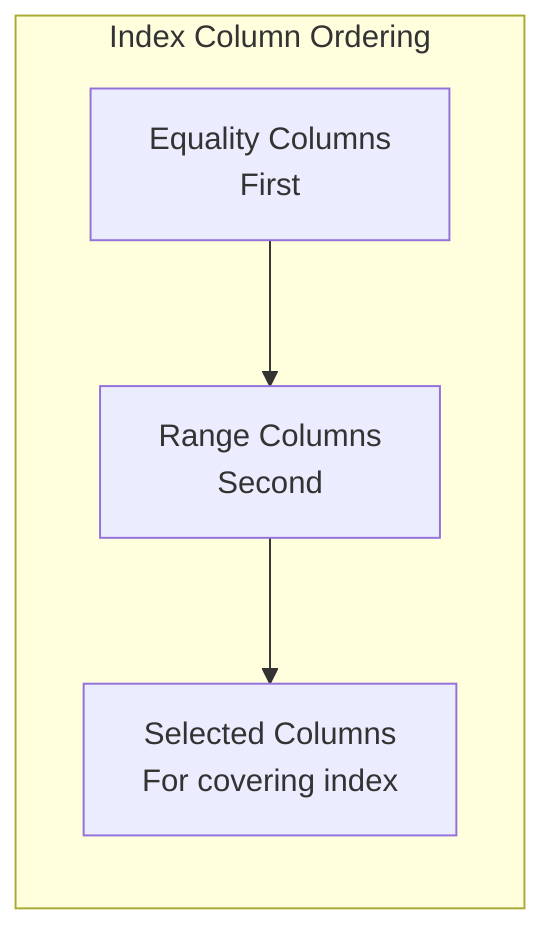
```mermaid
flowchart LR
    subgraph "Index Column Ordering"
        EQ[Equality Columns<br/>First] --> RANGE[Range Columns<br/>Second] --> SELECT[Selected Columns<br/>For covering index]
    end
```

### Covering Indexes

A covering index contains all columns needed for a query—no table access required.

```sql
-- Query
SELECT user_id, status FROM orders WHERE status = 'pending';

-- Covering index (includes all needed columns)
CREATE INDEX idx_covering ON orders(status, user_id);

-- Query plan: "Index Only Scan" - never touches table!
```

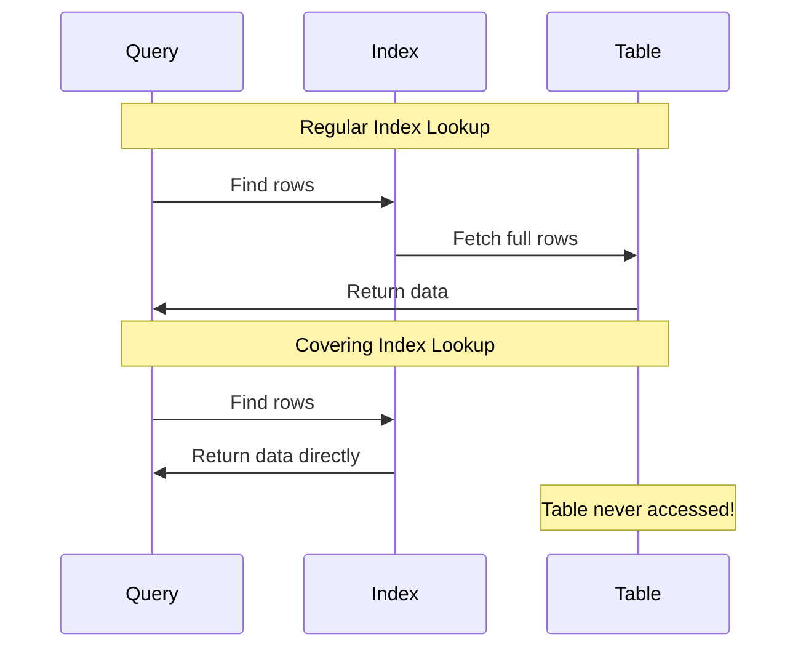
```mermaid
sequenceDiagram
    participant Query as Query
    participant Index as Index
    participant Table as Table
    
    Note over Query,Table: Regular Index Lookup
    Query->>Index: Find rows
    Index->>Table: Fetch full rows
    Table->>Query: Return data
    
    Note over Query,Table: Covering Index Lookup
    Query->>Index: Find rows
    Index->>Query: Return data directly
    Note over Table: Table never accessed!
```

### Partial Indexes

Index only a subset of rows—saves space and improves performance for specific queries.

```sql
-- Only index active orders (90% of queries are for active orders)
CREATE INDEX idx_active_orders ON orders(created_at) 
WHERE status = 'active';

-- This query uses the partial index
SELECT * FROM orders WHERE status = 'active' AND created_at > '2024-01-01';

-- This query cannot use the partial index
SELECT * FROM orders WHERE status = 'pending' AND created_at > '2024-01-01';
```

### Expression Indexes

Index computed values, not just columns.

```sql
-- Index on lowercase email for case-insensitive search
CREATE INDEX idx_email_lower ON users(LOWER(email));

-- Uses the index
SELECT * FROM users WHERE LOWER(email) = 'test@example.com';

-- Does NOT use the index
SELECT * FROM users WHERE email = 'test@example.com';
```

### Index Trade-offs

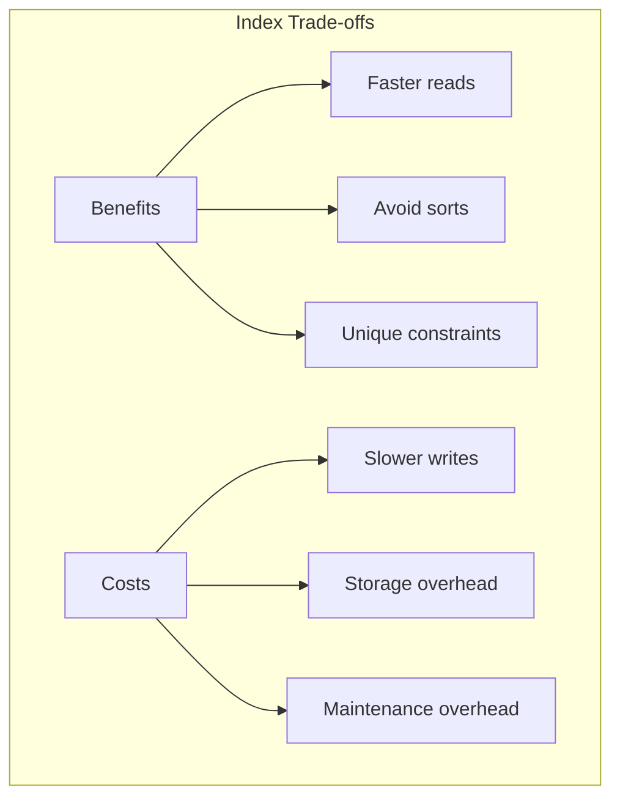
```mermaid
flowchart TD
    subgraph "Index Trade-offs"
        BENEFIT[Benefits]
        COST[Costs]
        
        BENEFIT --> B1[Faster reads]
        BENEFIT --> B2[Avoid sorts]
        BENEFIT --> B3[Unique constraints]
        
        COST --> C1[Slower writes]
        COST --> C2[Storage overhead]
        COST --> C3[Maintenance overhead]
    end
```

| Aspect | Impact |
|--------|--------|
| **Storage** | Each index adds ~10-30% of table size |
| **Write overhead** | Each INSERT/UPDATE/DELETE updates all indexes |
| **Memory** | Indexes compete for buffer pool space |
| **Vacuum/Maintenance** | More indexes = longer maintenance |

**Rule of Thumb:** Index columns that appear in WHERE, JOIN, and ORDER BY clauses. Don't index columns that are rarely queried or have low selectivity.

### Index Selection Interview Questions

> "Why not index every column?"

**Answer:** Each index adds write overhead (updating on every INSERT/UPDATE/DELETE), consumes storage, and competes for memory. The read benefit must outweigh these costs.

> "What's the difference between a clustered and non-clustered index?"

**Answer:** A clustered index determines the physical order of data on disk (table IS the index). Non-clustered indexes are separate structures pointing to the data. Most databases allow only one clustered index per table.

> "How do you identify missing indexes?"

**Answer:** Query plan analysis (look for sequential scans on large tables), slow query logs, and database-specific tools (pg_stat_user_indexes, MySQL's Performance Schema).

---

## 3. Data Modeling Patterns

### Normalization vs Denormalization

The classic trade-off: data integrity vs read performance.

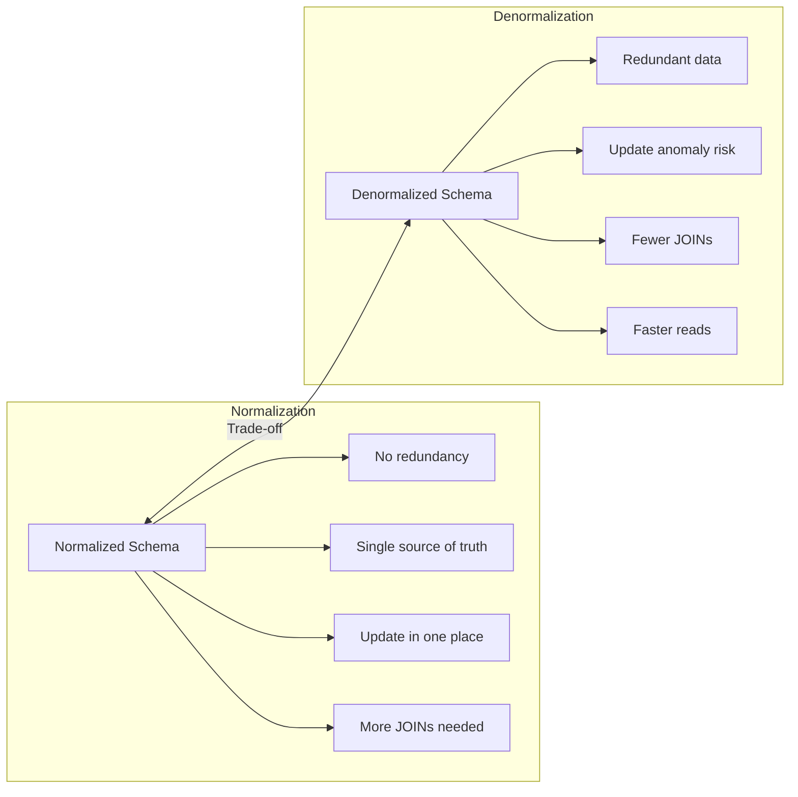
```mermaid
flowchart LR
    subgraph "Normalization"
        NORM[Normalized Schema]
        NORM --> N1[No redundancy]
        NORM --> N2[Single source of truth]
        NORM --> N3[Update in one place]
        NORM --> N4[More JOINs needed]
    end
    
    subgraph "Denormalization"
        DENORM[Denormalized Schema]
        DENORM --> D1[Redundant data]
        DENORM --> D2[Update anomaly risk]
        DENORM --> D3[Fewer JOINs]
        DENORM --> D4[Faster reads]
    end
    
    NORM <-->|"Trade-off"| DENORM
```

#### Normalized Schema Example

```sql
-- Users table
CREATE TABLE users (
    id SERIAL PRIMARY KEY,
    name VARCHAR(100),
    email VARCHAR(100)
);

-- Orders table (foreign key to users)
CREATE TABLE orders (
    id SERIAL PRIMARY KEY,
    user_id INT REFERENCES users(id),
    total DECIMAL(10,2),
    created_at TIMESTAMP
);

-- Query requires JOIN
SELECT u.name, o.total 
FROM orders o 
JOIN users u ON o.user_id = u.id
WHERE o.id = 12345;
```

#### Denormalized Schema Example

```sql
-- Orders table with embedded user data
CREATE TABLE orders (
    id SERIAL PRIMARY KEY,
    user_id INT,
    user_name VARCHAR(100),  -- Denormalized!
    user_email VARCHAR(100), -- Denormalized!
    total DECIMAL(10,2),
    created_at TIMESTAMP
);

-- Query without JOIN
SELECT user_name, total 
FROM orders 
WHERE id = 12345;
```

#### When to Denormalize

| Scenario | Denormalize? | Reason |
|----------|--------------|--------|
| Read-heavy, join-heavy queries | ✅ | Avoid repeated JOIN overhead |
| Frequently accessed together | ✅ | Reduce latency |
| Rarely updated reference data | ✅ | Low sync cost |
| Write-heavy workload | ❌ | Update anomalies, sync overhead |
| Frequently changing data | ❌ | Hard to keep in sync |
| Strong consistency required | ❌ | Denorm introduces inconsistency risk |

### Document Modeling (NoSQL)

For document databases (MongoDB, DynamoDB), the key decision is embedding vs referencing.

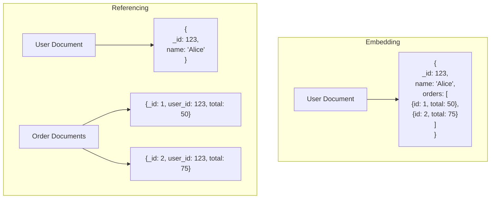
```mermaid
flowchart TD
    subgraph "Embedding"
        EMB_DOC["User Document"]
        EMB_DOC --> EMB1["{<br/>  _id: 123,<br/>  name: 'Alice',<br/>  orders: [<br/>    {id: 1, total: 50},<br/>    {id: 2, total: 75}<br/>  ]<br/>}"]
    end
    
    subgraph "Referencing"
        REF_USER["User Document"]
        REF_USER --> REF1["{<br/>  _id: 123,<br/>  name: 'Alice'<br/>}"]
        
        REF_ORDER["Order Documents"]
        REF_ORDER --> REF2["{_id: 1, user_id: 123, total: 50}"]
        REF_ORDER --> REF3["{_id: 2, user_id: 123, total: 75}"]
    end
```

**Embedding Decision Matrix:**

| Factor | Embed | Reference |
|--------|-------|-----------|
| **Access pattern** | Always accessed together | Accessed independently |
| **Update frequency** | Rarely updated | Frequently updated |
| **Data size** | Small, bounded | Large or unbounded |
| **Cardinality** | 1:few | 1:many or many:many |
| **Query pattern** | Need atomic reads | Need flexible queries |

### Wide-Column Modeling (Cassandra)

Wide-column stores require query-first modeling—design tables around your queries, not entities.

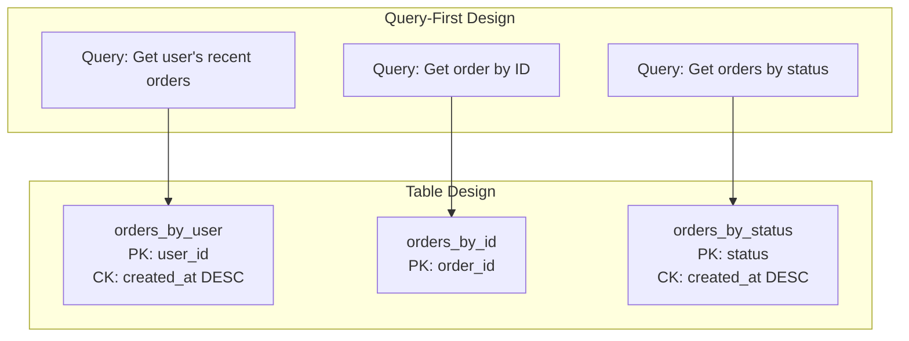
```mermaid
flowchart TD
    subgraph "Query-First Design"
        Q1["Query: Get user's recent orders"]
        Q2["Query: Get order by ID"]
        Q3["Query: Get orders by status"]
    end
    
    subgraph "Table Design"
        T1["orders_by_user<br/>PK: user_id<br/>CK: created_at DESC"]
        T2["orders_by_id<br/>PK: order_id"]
        T3["orders_by_status<br/>PK: status<br/>CK: created_at DESC"]
    end
    
    Q1 --> T1
    Q2 --> T2
    Q3 --> T3
```

```sql
-- Table designed for "get user's recent orders" query
CREATE TABLE orders_by_user (
    user_id UUID,
    created_at TIMESTAMP,
    order_id UUID,
    total DECIMAL,
    status TEXT,
    PRIMARY KEY (user_id, created_at)
) WITH CLUSTERING ORDER BY (created_at DESC);

-- ✅ Efficient: Query by partition key + clustering range
SELECT * FROM orders_by_user 
WHERE user_id = ? AND created_at > ?;

-- ❌ Anti-pattern: Query without partition key
SELECT * FROM orders_by_user WHERE status = 'pending';
```

---

## 4. Access Pattern Analysis

### Read vs Write Optimization

Every storage decision involves a read/write trade-off. Understand your access patterns first.

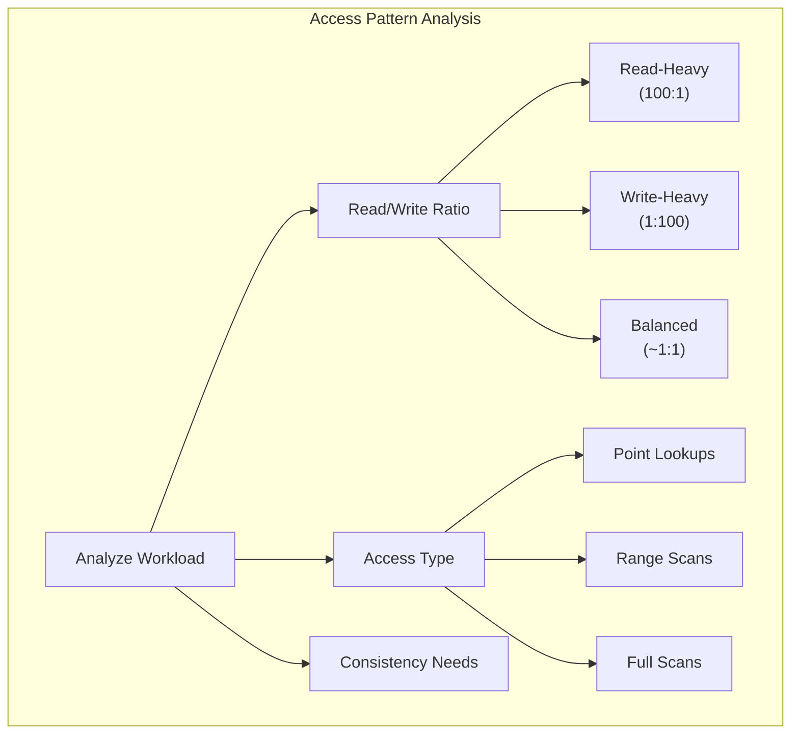
```mermaid
flowchart TD
    subgraph "Access Pattern Analysis"
        ANALYZE[Analyze Workload]
        
        ANALYZE --> RW_RATIO[Read/Write Ratio]
        ANALYZE --> ACCESS_TYPE[Access Type]
        ANALYZE --> CONSISTENCY[Consistency Needs]
        
        RW_RATIO --> HEAVY_READ["Read-Heavy<br/>(100:1)"]
        RW_RATIO --> HEAVY_WRITE["Write-Heavy<br/>(1:100)"]
        RW_RATIO --> BALANCED["Balanced<br/>(~1:1)"]
        
        ACCESS_TYPE --> POINT["Point Lookups"]
        ACCESS_TYPE --> RANGE["Range Scans"]
        ACCESS_TYPE --> FULL["Full Scans"]
    end
```

### Optimization Strategies by Pattern

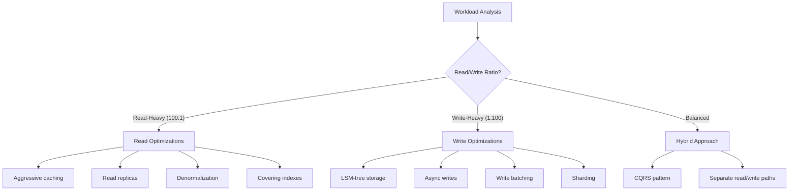
```mermaid
flowchart TD
    START[Workload Analysis] --> Q1{Read/Write Ratio?}
    
    Q1 -->|"Read-Heavy (100:1)"| READ_OPT["Read Optimizations"]
    Q1 -->|"Write-Heavy (1:100)"| WRITE_OPT["Write Optimizations"]
    Q1 -->|"Balanced"| HYBRID["Hybrid Approach"]
    
    READ_OPT --> R1[Aggressive caching]
    READ_OPT --> R2[Read replicas]
    READ_OPT --> R3[Denormalization]
    READ_OPT --> R4[Covering indexes]
    
    WRITE_OPT --> W1[LSM-tree storage]
    WRITE_OPT --> W2[Async writes]
    WRITE_OPT --> W3[Write batching]
    WRITE_OPT --> W4[Sharding]
    
    HYBRID --> H1[CQRS pattern]
    HYBRID --> H2[Separate read/write paths]
```

### CQRS: Separating Read and Write Models

Command Query Responsibility Segregation optimizes both reads and writes by using different models.

```mermaid
flowchart TB
    subgraph "CQRS Architecture"
        CLIENT[Client]
        
        subgraph "Write Side"
            CMD[Command Handler]
            WRITE_DB[(Write Model<br/>Normalized)]
            EVENT[Event Bus]
        end
        
        subgraph "Read Side"
            QUERY[Query Handler]
            READ_DB[(Read Model<br/>Denormalized)]
        end
        
        CLIENT -->|"Commands"| CMD
        CMD --> WRITE_DB
        WRITE_DB --> EVENT
        EVENT -->|"Sync"| READ_DB
        
        CLIENT -->|"Queries"| QUERY
        QUERY --> READ_DB
    end
```

**When to Use CQRS:**
- Very different read and write patterns
- Read and write loads need different scaling
- Complex domain with rich business logic
- Event sourcing is already in use

**When to Avoid CQRS:**
- Simple CRUD applications
- Team unfamiliar with pattern
- Eventual consistency unacceptable
- Added complexity not justified

---

## 5. Storage Tiering

### The Data Temperature Model

Not all data needs the same storage performance. Tiering data by access frequency dramatically reduces costs.

```mermaid
flowchart TD
    subgraph "Data Temperature Tiers"
        HOT["🔥 Hot Data<br/>Frequently accessed<br/>< 30 days old"]
        WARM["🌡️ Warm Data<br/>Occasional access<br/>30-90 days"]
        COLD["❄️ Cold Data<br/>Rare access<br/>90+ days"]
        ARCHIVE["🗄️ Archive<br/>Compliance/backup<br/>Years"]
    end
    
    subgraph "Storage Options"
        SSD["NVMe/SSD<br/>$0.10-0.25/GB"]
        HDD["HDD/Standard<br/>$0.02-0.05/GB"]
        OBJ["Object Storage<br/>$0.01-0.02/GB"]
        GLACIER["Glacier/Archive<br/>$0.001-0.004/GB"]
    end
    
    HOT --> SSD
    WARM --> HDD
    COLD --> OBJ
    ARCHIVE --> GLACIER
```

### Tiering Strategies

```mermaid
sequenceDiagram
    participant App as Application
    participant Hot as Hot Tier (SSD)
    participant Warm as Warm Tier (HDD)
    participant Cold as Cold Tier (S3)
    
    Note over App,Cold: New data always goes to Hot
    App->>Hot: Write new data
    
    Note over Hot,Warm: Age-based migration (30 days)
    Hot-->>Warm: Move aged data
    
    Note over Warm,Cold: Archive policy (90 days)
    Warm-->>Cold: Archive to object storage
    
    Note over App,Cold: Reads check tiers
    App->>Hot: Query (hot path)
    Hot-->>App: Fast response
    
    App->>Warm: Query (warm path)
    Warm-->>App: Moderate latency
    
    App->>Cold: Query (cold path)
    Cold-->>App: High latency
```

### Implementation Patterns

#### Time-Based Partitioning

```sql
-- PostgreSQL: Partition by time
CREATE TABLE events (
    id BIGSERIAL,
    event_time TIMESTAMP,
    data JSONB
) PARTITION BY RANGE (event_time);

-- Hot partition (current month, fast storage)
CREATE TABLE events_2024_01 PARTITION OF events
    FOR VALUES FROM ('2024-01-01') TO ('2024-02-01')
    TABLESPACE fast_ssd;

-- Warm partition (last quarter, standard storage)
CREATE TABLE events_2023_q4 PARTITION OF events
    FOR VALUES FROM ('2023-10-01') TO ('2024-01-01')
    TABLESPACE standard_hdd;

-- Cold data: Export to object storage and drop partition
```

#### Hybrid Hot/Cold Architecture

```mermaid
flowchart TB
    subgraph "Hybrid Storage Architecture"
        QUERY[Query Layer]
        
        subgraph "Hot Path"
            CACHE[(Redis Cache)]
            HOT_DB[(Hot Database<br/>Recent data)]
        end
        
        subgraph "Cold Path"
            COLD_STORE[(Object Storage<br/>S3/GCS)]
            COLD_QUERY[Query Engine<br/>Athena/Presto]
        end
        
        QUERY --> CACHE
        CACHE -->|Miss| HOT_DB
        HOT_DB -->|Not found| COLD_QUERY
        COLD_QUERY --> COLD_STORE
    end
```

### Cost Optimization Example

| Tier | Storage | Cost/TB/Month | Data Volume | Monthly Cost |
|------|---------|---------------|-------------|--------------|
| Hot | SSD | $200 | 1 TB | $200 |
| Warm | HDD | $40 | 5 TB | $200 |
| Cold | S3 | $23 | 50 TB | $1,150 |
| Archive | Glacier | $4 | 500 TB | $2,000 |
| **Total** | | | **556 TB** | **$3,550** |

**Without tiering (all SSD):** 556 TB × $200 = $111,200/month  
**With tiering:** $3,550/month  
**Savings:** 97%

---

## 6. File and Object Storage

### When to Use Object Storage

Object storage (S3, GCS, Azure Blob) is ideal for large, unstructured data accessed by key.

```mermaid
flowchart TD
    subgraph "Object Storage Use Cases"
        FILES[File Storage]
        BACKUP[Backups]
        DATA_LAKE[Data Lake]
        STATIC[Static Assets]
        LOGS[Log Archives]
    end
    
    subgraph "NOT Suitable For"
        TX[Transactional Data]
        RANDOM[Random Access]
        LOW_LAT[Low Latency Required]
    end
    
    FILES --> OBJ[(Object Storage)]
    BACKUP --> OBJ
    DATA_LAKE --> OBJ
    STATIC --> OBJ
    LOGS --> OBJ
```

### Object Storage Patterns

#### Direct Upload Pattern

```mermaid
sequenceDiagram
    participant Client as Client
    participant API as API Server
    participant S3 as Object Storage
    
    Client->>API: Request upload URL
    API->>S3: Generate presigned URL
    S3-->>API: Presigned URL (expires in 15min)
    API-->>Client: Return presigned URL
    
    Client->>S3: Direct upload (no server proxy)
    S3-->>Client: Upload complete
    
    Client->>API: Confirm upload
    API->>API: Store metadata in database
```

**Benefits:**
- Server doesn't handle file bytes
- Scales to massive files
- Reduces server bandwidth costs

#### CDN Integration

```mermaid
flowchart LR
    USER[User] --> CDN[CDN Edge]
    CDN -->|Cache Miss| ORIGIN[S3 Origin]
    ORIGIN --> CDN
    CDN --> USER
    
    NOTE["CDN caches objects<br/>at edge locations<br/>for low-latency delivery"]
```

### Object Storage vs Block Storage vs File Storage

| Type | Access Model | Use Case | Examples |
|------|--------------|----------|----------|
| **Object** | Key → blob | Unstructured data, backups | S3, GCS, Azure Blob |
| **Block** | Disk sectors | Databases, VMs | EBS, Azure Disk |
| **File** | POSIX paths | Shared file systems | EFS, NFS, GlusterFS |

---

## 7. Interview Patterns

### How to Discuss in 30 Seconds

> "For storage engine selection, I'd consider the read/write ratio. B-Trees in traditional SQL databases optimize for reads with O(log n) lookups. LSM-Trees in systems like Cassandra optimize for writes by converting random writes to sequential. For a write-heavy workload like logging, I'd choose LSM. For OLTP with complex queries, B-Tree-based PostgreSQL."

### How to Discuss in 2 Minutes

Add:
- Specific index types and when to use them
- Trade-offs of normalization vs denormalization
- Storage tiering for cost optimization
- Mention you'd analyze access patterns first

### Common Interview Questions

| Question | Key Points |
|----------|------------|
| "How does a B-Tree index work?" | Sorted balanced tree, O(log n) operations, page-based, supports range queries |
| "Why use an LSM-tree?" | Write optimization, sequential I/O, but read amplification trade-off |
| "When would you denormalize?" | Read-heavy, data accessed together, can tolerate some inconsistency |
| "How do you choose a partition key?" | High cardinality, even distribution, matches query patterns |
| "What's a covering index?" | Index contains all columns for query, avoids table lookup |
| "How do you handle large files?" | Object storage with presigned URLs, CDN for delivery |

### Red Flags to Avoid

❌ "Always use indexes for faster reads"  
✅ "Indexes trade write performance for read performance—need to analyze the workload"

❌ "NoSQL is faster than SQL"  
✅ "Different storage engines optimize for different access patterns"

❌ "Normalization is always better"  
✅ "Normalization optimizes for writes and consistency; denormalization optimizes for reads"

---

## Connections to Other Concepts

| Related Topic | Connection |
|---------------|------------|
| [Consistency & Transactions](./02_CONSISTENCY_AND_TRANSACTIONS.md) | Storage engine affects consistency guarantees |
| [Caching & Content Delivery](./04_CACHING_AND_CONTENT_DELIVERY.md) | Cache sits in front of storage layer |
| [Distributed System Patterns](./06_DISTRIBUTED_SYSTEM_PATTERNS.md) | Storage engine affects replication strategy |
| [Workload Optimization](./08_WORKLOAD_OPTIMIZATION.md) | Storage choice determines optimization options |

---

## Quick Reference Card

```
┌─────────────────────────────────────────────────────────────────┐
│           DATA STORAGE & ACCESS QUICK REFERENCE                  │
├─────────────────────────────────────────────────────────────────┤
│                                                                  │
│  STORAGE ENGINES                                                 │
│  ───────────────                                                 │
│  B-Tree: Read-optimized, O(log n), range queries                │
│  LSM-Tree: Write-optimized, sequential I/O, compaction          │
│                                                                  │
│  INDEXING RULES                                                  │
│  ─────────────                                                   │
│  • Composite: Leftmost prefix rule applies                       │
│  • Covering: Include all columns to avoid table lookup           │
│  • Partial: Index subset of rows to save space                   │
│  • Trade-off: Every index slows writes                           │
│                                                                  │
│  DATA MODELING                                                   │
│  ────────────                                                    │
│  Normalize: Write consistency, no redundancy                     │
│  Denormalize: Read performance, fewer JOINs                      │
│  Document embed: 1:few, accessed together                        │
│  Document reference: 1:many, independent access                  │
│                                                                  │
│  STORAGE TIERING                                                 │
│  ──────────────                                                  │
│  Hot (SSD): Frequent access, < 30 days                          │
│  Warm (HDD): Occasional access, 30-90 days                       │
│  Cold (S3): Rare access, 90+ days                               │
│  Archive (Glacier): Compliance, years                            │
│                                                                  │
│  DECISION QUICK CHECK                                            │
│  ───────────────────                                             │
│  Read-heavy? → B-Tree, caching, read replicas, denormalize      │
│  Write-heavy? → LSM, batching, sharding, async                   │
│  Large files? → Object storage + CDN                             │
│  Cost sensitive? → Storage tiering by access frequency           │
│                                                                  │
└─────────────────────────────────────────────────────────────────┘
```

---

## Practice Questions

1. **Design a storage layer for a social media feed** with 100M users, 10K posts/second writes, and 1M reads/second. What storage engine, indexing, and caching strategy would you use?

2. **A database query is slow despite having indexes.** Walk through your debugging process. What would you check in the query plan?

3. **Your time-series database is running out of storage.** Design a tiering strategy that keeps recent data fast while reducing costs by 80%.

4. **Compare B-Tree vs LSM-Tree** for a financial trading system that needs both high write throughput and low-latency reads for recent data.

5. **Design the data model for an e-commerce product catalog** with millions of products, each with varying attributes (electronics have different specs than clothing). Would you use SQL, document store, or hybrid?

---

## Navigation

**Previous:** [02 — Consistency & Transactions](./02_CONSISTENCY_AND_TRANSACTIONS.md)
**Next:** [04 — Caching & Content Delivery](./04_CACHING_AND_CONTENT_DELIVERY.md)
**Index:** [README](./README.md)
