# 05 — Caching and Content Delivery

> "The most effective way to improve performance is to avoid doing work—caching stores the results of expensive operations for reuse."

**Prerequisites:** [01 — Foundational Concepts](./01_FOUNDATIONAL_CONCEPTS.md), [04 — Data Storage & Access](./04_DATA_STORAGE_AND_ACCESS.md)
**Builds toward:** [06 — Replication & Partitioning](./06_REPLICATION_AND_PARTITIONING.md), [09 — Scaling & Infrastructure](./09_SCALING_AND_INFRASTRUCTURE.md)

---

## Chapter Overview

This module covers caching strategies at every layer of the stack, cache invalidation patterns, CDN architecture, HTTP caching semantics, distributed cache systems, and probabilistic data structures for membership testing. Caching is foundational to building performant systems—understanding where, when, and how to cache separates good designs from great ones.

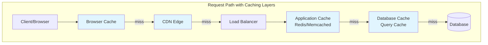

---

## 1. Why Caching Matters

### The Latency Hierarchy

Every layer of the memory/storage hierarchy is 10-1000x slower than the previous. Caching moves frequently accessed data closer to computation.

| Storage Layer | Typical Latency | Relative Speed |
|---------------|-----------------|----------------|
| L1 CPU Cache | 0.5 ns | 1x (baseline) |
| L2 CPU Cache | 7 ns | 14x slower |
| L3 CPU Cache | 20 ns | 40x slower |
| RAM | 100 ns | 200x slower |
| SSD (NVMe) | 25 μs | 50,000x slower |
| SSD (SATA) | 100 μs | 200,000x slower |
| HDD | 5-10 ms | 10-20 million x slower |
| Network (same datacenter) | 500 μs | 1 million x slower |
| Network (cross-region) | 50-150 ms | 100-300 million x slower |

**Key Insight:** A cache hit at 100μs vs a database query at 10ms is a 100x improvement. At scale, this difference is the difference between responsive and unusable.

### The Caching Value Proposition

```
┌─────────────────────────────────────────────────────────────────────────┐
│                     CACHING BENEFITS                                     │
├─────────────────────────────────────────────────────────────────────────┤
│                                                                          │
│  ✓ REDUCED LATENCY        Read from faster storage tier                 │
│                                                                          │
│  ✓ REDUCED ORIGIN LOAD    Fewer requests hit the database/backend       │
│                                                                          │
│  ✓ INCREASED THROUGHPUT   Origin can serve more unique requests         │
│                                                                          │
│  ✓ COST SAVINGS           Fewer database queries, less compute          │
│                                                                          │
│  ✓ IMPROVED AVAILABILITY  Serve cached data during origin failures      │
│                                                                          │
└─────────────────────────────────────────────────────────────────────────┘
```

### The Core Trade-Off

```
┌─────────────────────────────────────────────────────────────────────────┐
│                                                                          │
│         DATA FRESHNESS                    vs         PERFORMANCE         │
│                                                                          │
│    "How up-to-date is the data?"              "How fast is access?"     │
│                                                                          │
│    ✓ Always current                           ✓ Sub-millisecond reads   │
│    ✓ No stale data                            ✓ Lower backend load      │
│    ✗ Higher latency                           ✗ May serve stale data    │
│    ✗ More backend load                        ✗ Invalidation complexity │
│                                                                          │
└─────────────────────────────────────────────────────────────────────────┘
```

---

## 2. Caching Strategies

### Strategy Overview

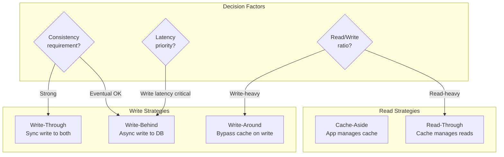

### 2.1 Cache-Aside (Lazy Loading)

The application explicitly manages the cache. Most common and flexible pattern.

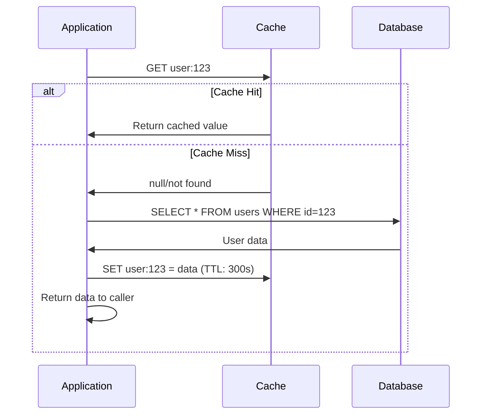

**Implementation Pattern:**

```python
def get_user(user_id: str) -> User:
    # Step 1: Try cache
    cached = cache.get(f"user:{user_id}")
    if cached:
        return deserialize(cached)
    
    # Step 2: Cache miss - query database
    user = db.query(f"SELECT * FROM users WHERE id = {user_id}")
    
    # Step 3: Populate cache for next time
    if user:
        cache.set(f"user:{user_id}", serialize(user), ttl=300)
    
    return user

def update_user(user_id: str, data: dict) -> None:
    # Write to DB
    db.execute(f"UPDATE users SET ... WHERE id = {user_id}")
    
    # Invalidate cache (delete, not update)
    cache.delete(f"user:{user_id}")
```

| Pros | Cons |
|------|------|
| Only caches data that's actually requested | Cache miss penalty (3 round trips) |
| Cache failure doesn't break the system | Initial request always slow |
| Most control over caching logic | Potential for stale data |
| Works with any cache backend | Application code complexity |

**When to Use:** General-purpose caching, when cache failures should be transparent, when you need fine-grained control.

### 2.2 Read-Through Cache

Cache sits between app and database; handles misses automatically.

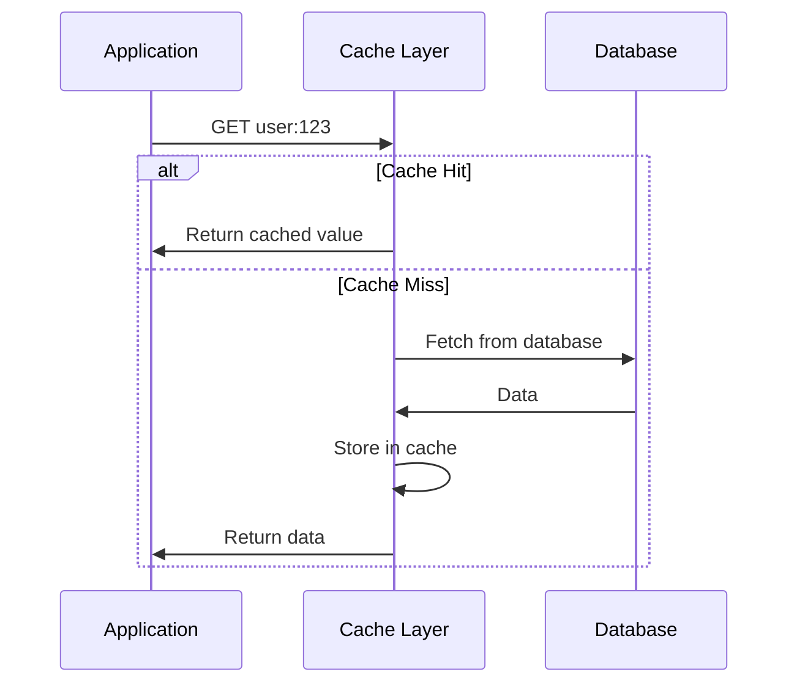

| Pros | Cons |
|------|------|
| Simpler application code | Cache becomes critical path |
| Consistent caching logic | Less control over cache behavior |
| Cache library handles misses | Requires cache library support |

**When to Use:** When you want consistent caching behavior, simpler application code, and the cache library supports read-through.

### 2.3 Write-Through Cache

Writes go to both cache and database synchronously. Ensures cache always has latest data.

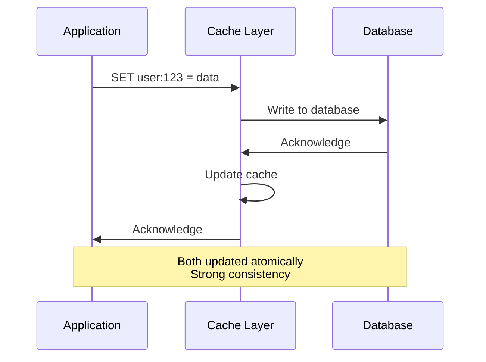

| Pros | Cons |
|------|------|
| Cache always consistent with DB | Write latency increased (both writes) |
| No stale data | Write amplification |
| Simplified invalidation | Cache must be highly available |

**When to Use:** When read-after-write consistency is critical, when data is read frequently after being written.

### 2.4 Write-Behind (Write-Back) Cache

Writes go to cache immediately, then asynchronously to database.

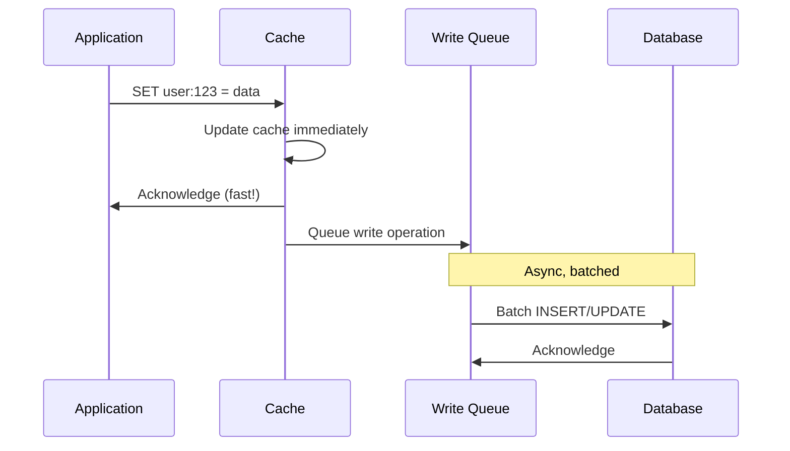

| Pros | Cons |
|------|------|
| Excellent write performance | Data loss risk (cache fails before DB write) |
| Batch writes to database | Complexity of write queue |
| Absorbs write spikes | Eventually consistent |
| Reduces database load | Recovery complexity |

**When to Use:** Write-heavy workloads where some data loss is acceptable, when you need to absorb write spikes, when write latency is critical.

### 2.5 Write-Around Cache

Writes bypass cache entirely, going directly to database.

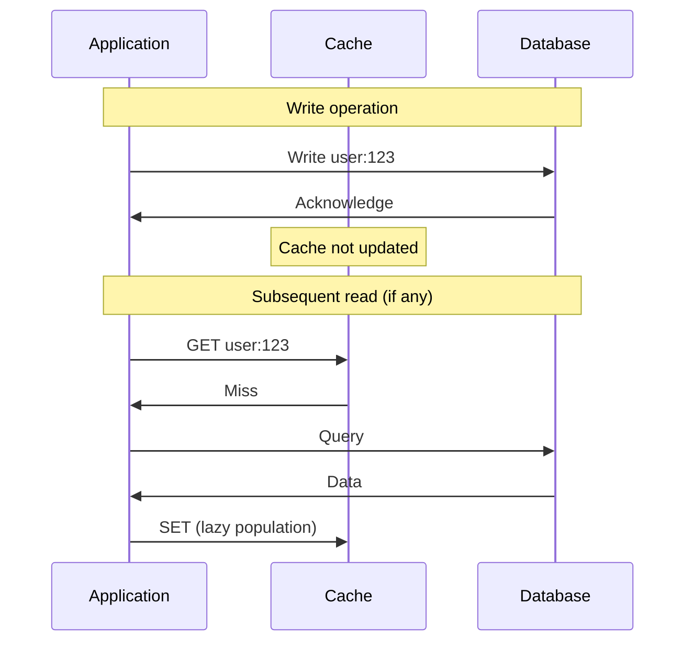

| Pros | Cons |
|------|------|
| No write overhead on cache | Read-after-write sees stale/missing data |
| Cache not polluted by rarely-read data | Higher read latency after writes |
| Good for write-once data | |

**When to Use:** Data that's written once and rarely read, bulk data imports, when cache space is limited.

### Strategy Comparison Matrix

| Strategy | Read Performance | Write Performance | Consistency | Complexity | Best For |
|----------|------------------|-------------------|-------------|------------|----------|
| **Cache-Aside** | Good (after warm) | N/A (writes to DB) | Eventual | Low | General purpose |
| **Read-Through** | Good (after warm) | N/A | Eventual | Medium | Consistent caching |
| **Write-Through** | Excellent | Slower | Strong | Medium | Read-after-write |
| **Write-Behind** | Excellent | Excellent | Eventual | High | Write-heavy |
| **Write-Around** | Cold after write | Fast | Eventual | Low | Write-once data |

### Decision Flowchart

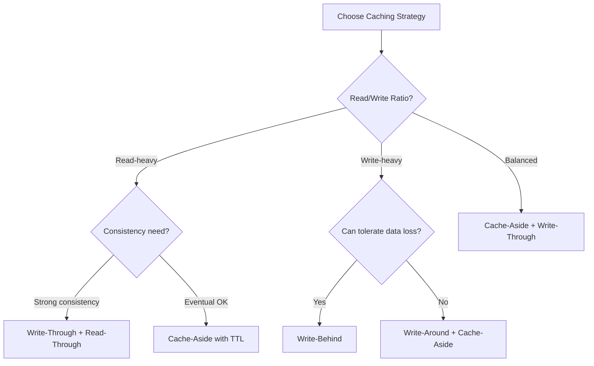

---

## 3. Cache Invalidation

> "There are only two hard things in Computer Science: cache invalidation and naming things." — Phil Karlton

### The Fundamental Challenge

Stale data in cache creates consistency problems. The question is: **how do we know when cached data is no longer valid?**

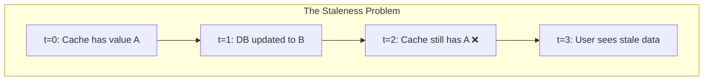

### 3.1 TTL-Based Expiration

Data automatically expires after a set duration.

```python
# Simple TTL
cache.set("user:123", user_data, ttl=3600)  # Expires in 1 hour

# Sliding TTL (reset on access)
cache.get("user:123", touch=True)  # Reset TTL on read
```

| TTL Duration | Freshness | Cache Hit Rate | Origin Load |
|--------------|-----------|----------------|-------------|
| Short (1-60s) | High | Lower | Higher |
| Medium (1-60min) | Medium | Medium | Medium |
| Long (hours-days) | Low | Higher | Lower |

**Guideline:** Set TTL based on:
- How often data changes
- How much staleness is acceptable
- How expensive origin queries are

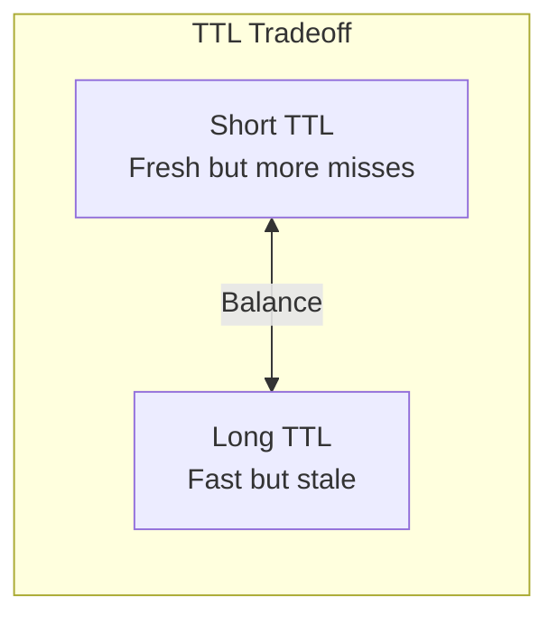

### 3.2 Event-Based Invalidation

Invalidate cache when data changes using events/messages.

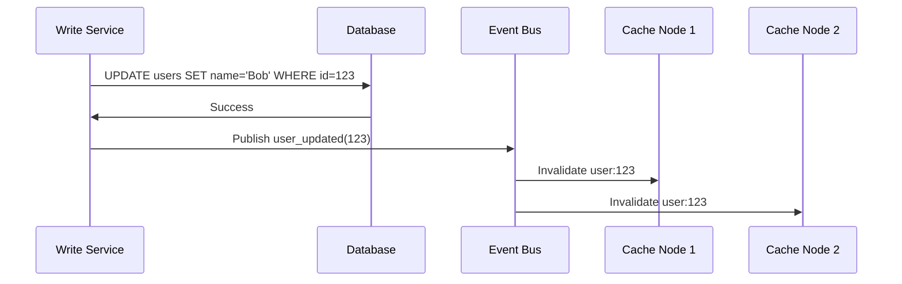

| Pros | Cons |
|------|------|
| Immediate consistency | Requires event infrastructure |
| Precise invalidation | Event ordering challenges |
| No arbitrary TTLs | Can miss events (at-least-once delivery) |
| Works across services | Increased complexity |

**Implementation Considerations:**
- Use message queue with at-least-once delivery
- Handle duplicate invalidations idempotently  
- Consider event ordering for related keys
- Monitor for event lag

### 3.3 Version-Based Keys

Include version or timestamp in cache key.

```python
# Instead of:
cache.get("user:123")

# Use version in key:
version = get_user_version(123)  # e.g., from DB or counter
cache.get(f"user:123:v{version}")

# Or use timestamp:
cache.get(f"user:123:{last_modified_timestamp}")
```

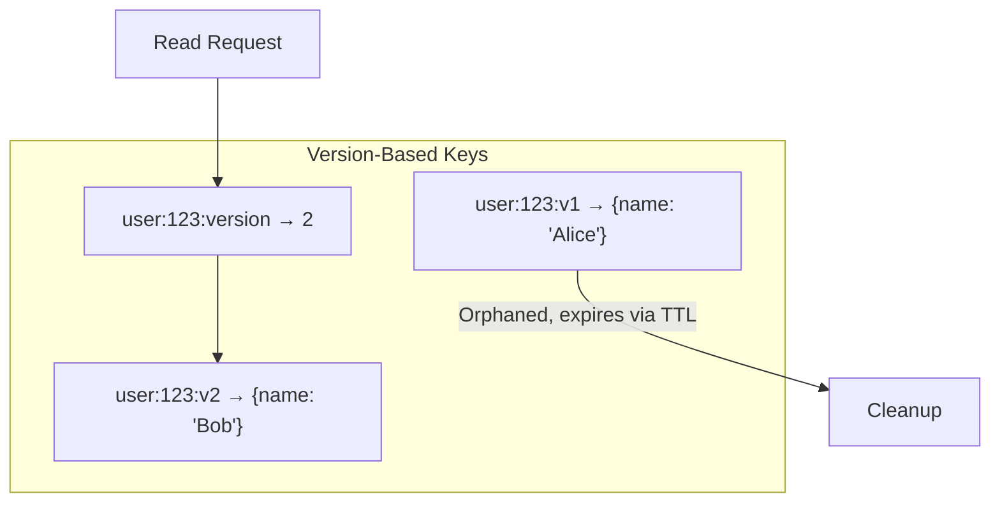

| Pros | Cons |
|------|------|
| No explicit invalidation needed | Key proliferation |
| Atomic version changes | Need version tracking mechanism |
| Supports rollback | Storage overhead for old versions |

### 3.4 Invalidation Patterns Summary

| Pattern | Best For | Implementation |
|---------|----------|----------------|
| **Delete on write** | Strong consistency | Writer deletes cache key after DB write |
| **Refresh on write** | Read-after-write common | Writer updates cache after DB write |
| **TTL only** | Simplicity, staleness OK | Set appropriate TTL, accept staleness |
| **TTL + lazy refresh** | Balance | Background refresh before expiry |
| **Event-based** | Distributed systems | Pub/sub invalidation messages |
| **Version keys** | High-read, low-write | Include version in cache key |

### 3.5 Cache-Aside Invalidation Best Practice

**Delete, don't update:**

```python
# ✅ GOOD: Delete and let next read populate
def update_user(user_id, data):
    db.update(user_id, data)
    cache.delete(f"user:{user_id}")

# ❌ RISKY: Race condition between DB write and cache update
def update_user(user_id, data):
    db.update(user_id, data)
    cache.set(f"user:{user_id}", data)  # Another thread might read stale from DB
```

**Why delete?** Avoids race condition where another process reads stale data from DB and writes to cache after your update.

---

## 4. Distributed Caching

### The Multi-Cache Consistency Problem

With multiple application servers, each potentially with local caches:

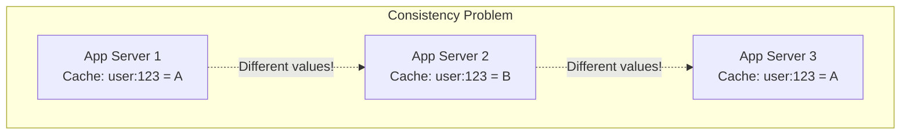

### Solution 1: Centralized Cache (Redis/Memcached)

All application servers use a shared, centralized cache.

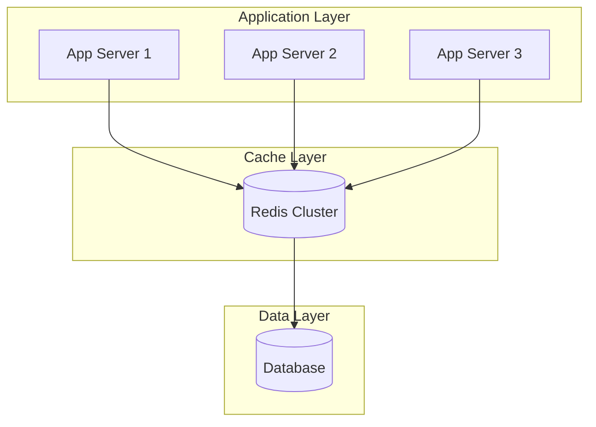

| Pros | Cons |
|------|------|
| Single source of truth | Network hop for every cache access |
| Simple consistency model | Cache becomes critical infrastructure |
| Easy invalidation | Potential bottleneck |

### Solution 2: Two-Tier Caching (L1 + L2)

Local in-memory cache (L1) + centralized cache (L2).

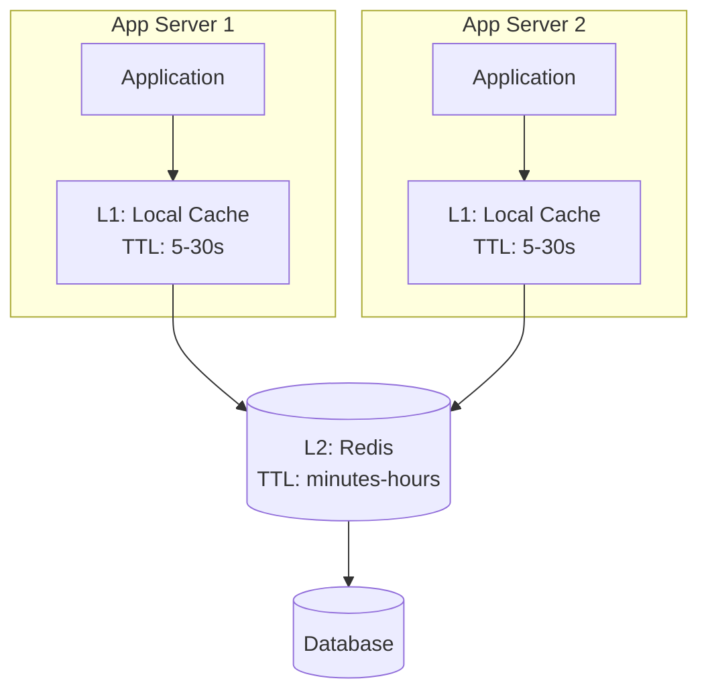

**Strategy:**
- L1 (local): Very short TTL (5-30 seconds), process memory
- L2 (centralized): Longer TTL, shared across instances
- Accept brief inconsistency between L1 caches

```python
def get_user(user_id: str) -> User:
    key = f"user:{user_id}"
    
    # Check L1 (local, fast)
    if key in local_cache:
        return local_cache[key]
    
    # Check L2 (Redis, still fast)
    value = redis.get(key)
    if value:
        local_cache.set(key, value, ttl=10)  # Short L1 TTL
        return value
    
    # Cache miss - hit database
    user = db.query(user_id)
    redis.set(key, user, ttl=300)  # Longer L2 TTL
    local_cache.set(key, user, ttl=10)
    return user
```

### Redis vs Memcached

| Feature | Redis | Memcached |
|---------|-------|-----------|
| **Data structures** | Strings, lists, sets, hashes, sorted sets | Strings only |
| **Persistence** | Optional (RDB, AOF) | None (pure cache) |
| **Replication** | Built-in master-replica | None (use client-side) |
| **Clustering** | Redis Cluster | Client-side sharding |
| **Memory efficiency** | Good, but overhead for features | Excellent, simple |
| **Threading** | Single-threaded (mostly) | Multi-threaded |
| **Atomic operations** | INCR, LPUSH, ZADD, etc. | INCR only |
| **Pub/Sub** | Yes | No |
| **Lua scripting** | Yes | No |

**When to choose:**
- **Redis:** Need data structures, persistence, pub/sub, atomic operations
- **Memcached:** Pure caching, maximum simplicity, multi-threaded performance

> **Deep Dive:** See [DD_REDIS_ARCHITECTURE](./DD_REDIS_ARCHITECTURE.md) for data structures, clustering, persistence mechanisms, and distributed locking.

### Cache Cluster Architectures

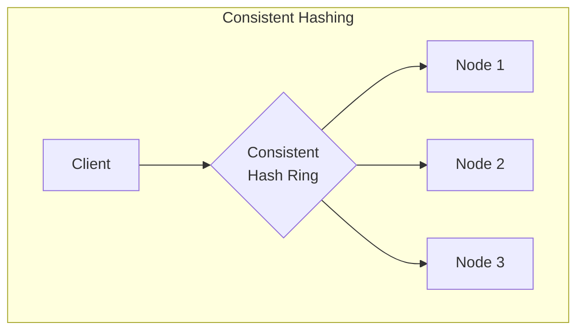

**Consistent Hashing Benefits:**
- Adding/removing nodes only affects ~1/N of keys
- No single point of failure
- Linear scalability

---

## 5. Content Delivery Networks (CDN)

### What is a CDN?

A geographically distributed network of edge servers that cache content close to users, reducing latency and origin load.

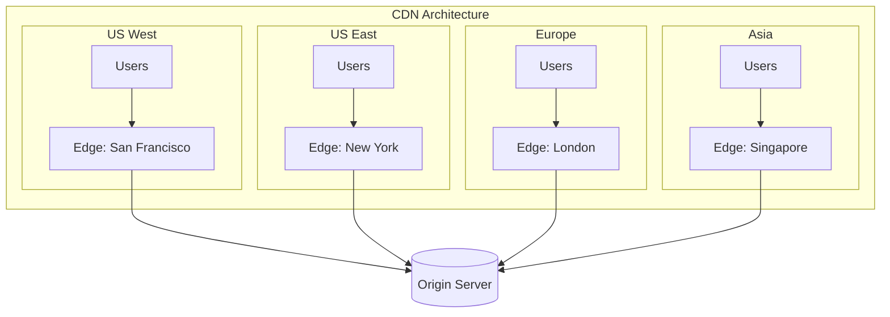

### CDN Benefits

| Benefit | Mechanism |
|---------|-----------|
| **Lower latency** | Content served from geographically closer edge |
| **Reduced origin load** | Edge servers absorb majority of traffic |
| **DDoS protection** | Distributed network absorbs attack traffic |
| **High availability** | Redundant edges, automatic failover |
| **SSL/TLS offloading** | Edge servers handle encryption/decryption |
| **Bandwidth savings** | Edge-to-edge communication, compression |

### CDN Request Flow

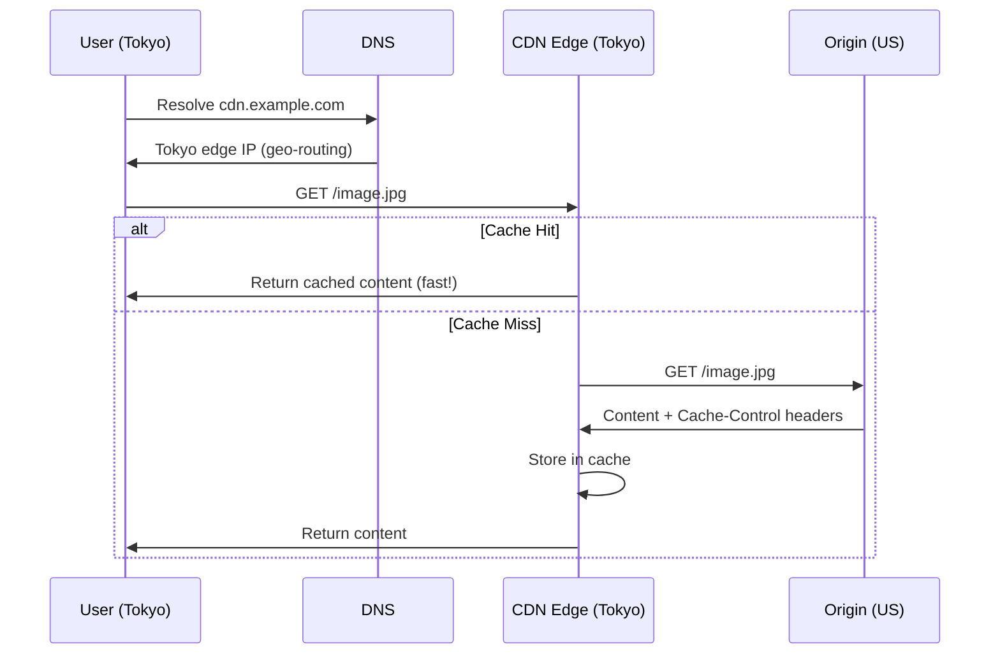

### Pull vs Push CDN

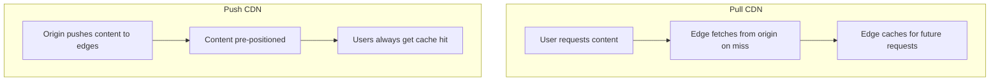

| Aspect | Pull CDN | Push CDN |
|--------|----------|----------|
| **Content upload** | Edge fetches on first request | Origin proactively pushes |
| **First request** | Slow (cache miss) | Fast (pre-warmed) |
| **Storage efficiency** | Only caches requested content | May cache unused content |
| **Control** | Less control | Full control over what's cached |
| **Best for** | Unpredictable access patterns | Known high-value content, live events |

### CDN Routing Strategies

| Strategy | Mechanism | Best For |
|----------|-----------|----------|
| **GeoDNS** | DNS returns nearest edge IP based on user's DNS resolver location | General use |
| **Anycast** | Same IP announced from all edges; network routes to nearest | Lowest latency, DNS caching immune |
| **Latency-based** | Measure actual latency, route to fastest | Performance-critical applications |
| **Load-based** | Route to least loaded edge | Even distribution |

### What to Cache on CDN

| Content Type | Cache Strategy | TTL | Notes |
|--------------|----------------|-----|-------|
| **Static assets** (JS, CSS, images) | Aggressive | Days-years | Use content hash in filename |
| **API responses** (public, stable) | Selective | Seconds-minutes | Vary by relevant headers |
| **HTML pages** (anonymous) | Careful | Varies | Consider ESI for dynamic parts |
| **Personalized content** | Don't cache | N/A | Serve from origin |
| **Video/media** | Aggressive | Long | Segment-based caching |

### Cache-Control for CDN

```http
# Aggressive caching with immutable (versioned assets)
Cache-Control: public, max-age=31536000, immutable

# Short cache with revalidation
Cache-Control: public, max-age=60, must-revalidate

# No CDN caching, browser can cache
Cache-Control: private, max-age=300

# No caching at all
Cache-Control: no-store
```

---

## 6. HTTP Caching

Understanding HTTP caching semantics is essential for web applications.

### Cache-Control Directives

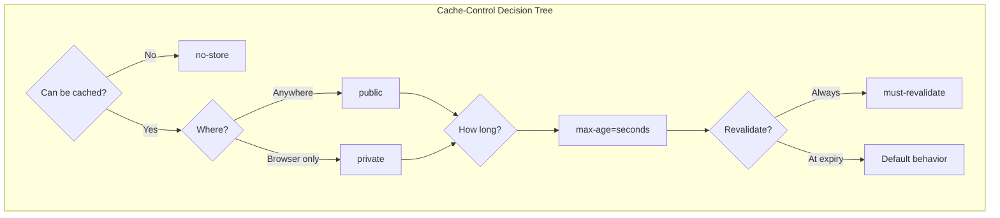

| Directive | Meaning | Example |
|-----------|---------|---------|
| `public` | Can be cached by CDN, proxies, browser | Static assets |
| `private` | Only browser can cache | User-specific data |
| `no-cache` | Must revalidate before using cached copy | Dynamic content |
| `no-store` | Never cache | Sensitive data |
| `max-age=N` | Cache for N seconds | `max-age=3600` |
| `s-maxage=N` | CDN/proxy cache duration (overrides max-age) | `s-maxage=86400` |
| `immutable` | Content will never change | Versioned assets |
| `must-revalidate` | Must check origin when stale | Critical freshness |
| `stale-while-revalidate=N` | Serve stale while fetching fresh | Background refresh |

### ETag and Conditional Requests

ETags enable efficient revalidation without re-transferring unchanged content.

```mermaid
sequenceDiagram
    participant Browser
    participant Server
    
    Note over Browser,Server: Initial Request
    Browser->>Server: GET /data.json
    Server->>Browser: 200 OK<br/>ETag: "abc123"<br/>Content: {...}
    
    Note over Browser,Server: Subsequent Request
    Browser->>Server: GET /data.json<br/>If-None-Match: "abc123"
    
    alt Content unchanged
        Server->>Browser: 304 Not Modified<br/>(No body, save bandwidth)
    else Content changed
        Server->>Browser: 200 OK<br/>ETag: "def456"<br/>Content: {...new...}
    end
```

### Last-Modified / If-Modified-Since

```mermaid
sequenceDiagram
    participant Browser
    participant Server
    
    Browser->>Server: GET /page.html
    Server->>Browser: 200 OK<br/>Last-Modified: Mon, 20 Jan 2025 12:00:00 GMT
    
    Browser->>Server: GET /page.html<br/>If-Modified-Since: Mon, 20 Jan 2025 12:00:00 GMT
    Server->>Browser: 304 Not Modified
```

### Vary Header

Tells caches that response varies based on certain request headers.

```http
# Response varies by Accept-Encoding (gzip vs plain)
Vary: Accept-Encoding

# Response varies by language
Vary: Accept-Language

# Response varies by multiple factors
Vary: Accept-Encoding, Accept-Language, User-Agent
```

**Warning:** `Vary: *` or `Vary: Cookie` effectively disables caching for that resource.

### Browser Caching Strategy Example

```python
# In your web framework
def get_response_headers(resource_type: str) -> dict:
    if resource_type == "versioned_asset":
        # Immutable versioned assets (app.a1b2c3.js)
        return {
            "Cache-Control": "public, max-age=31536000, immutable"
        }
    elif resource_type == "html_page":
        # HTML pages - short cache, revalidate
        return {
            "Cache-Control": "public, max-age=60, must-revalidate",
            "ETag": compute_etag(content)
        }
    elif resource_type == "api_public":
        # Public API - cache briefly, allow background refresh
        return {
            "Cache-Control": "public, max-age=10, stale-while-revalidate=30"
        }
    elif resource_type == "api_private":
        # Private API - browser cache only
        return {
            "Cache-Control": "private, max-age=60"
        }
    else:
        # Default: no caching
        return {
            "Cache-Control": "no-store"
        }
```

---

## 7. Cache Eviction Policies

When cache is full, which item should be removed?

> **References:**
> - Belady, L. A. (1966). "A Study of Replacement Algorithms for a Virtual-Storage Computer." IBM Systems Journal.
> - Megiddo, N. & Modha, D. S. (2003). "ARC: A Self-Tuning, Low Overhead Replacement Cache." USENIX FAST.

### Common Eviction Policies

| Policy | Rule | Pros | Cons |
|--------|------|------|------|
| **LRU** | Remove least recently used | Good for temporal locality | Tracking overhead |
| **LFU** | Remove least frequently used | Good for frequency patterns | Doesn't adapt quickly |
| **FIFO** | Remove oldest added | Simple, predictable | Ignores access patterns |
| **Random** | Remove random item | Simple, no overhead | May evict hot items |
| **TTL** | Remove expired items | Time-based freshness | Doesn't help when full |

### Eviction Policy Complexity Analysis

| Policy | Get | Put | Evict | Space Overhead | Implementation |
|--------|-----|-----|-------|----------------|----------------|
| **LRU** | O(1) | O(1) | O(1) | O(n) pointers | HashMap + Doubly Linked List |
| **LFU** | O(1)* | O(1)* | O(1)* | O(n) counters + buckets | HashMap + Frequency Buckets |
| **FIFO** | O(1) | O(1) | O(1) | O(n) queue | HashMap + Queue |
| **Random** | O(1) | O(1) | O(1) | None | HashMap only |
| **ARC** | O(1) | O(1) | O(1) | O(2n) lists | Two LRU lists + ghost entries |

*LFU O(1) requires careful implementation with frequency buckets; naive implementation is O(log n).

### LRU (Least Recently Used)

Most common. Based on recency of access.

```mermaid
flowchart LR
    subgraph "LRU Cache (capacity=4)"
        direction LR
        MRU[Most Recent] --> A[A] --> B[B] --> C[C] --> D[D] --> LRU_END[Least Recent]
    end
    
    ACCESS[Access B] -->|Move to front| NEW[A → B → C → D becomes B → A → C → D]
    ADD[Add E when full] -->|Evict D| EVICT[D evicted, E at front]
```

**Implementation:** HashMap + Doubly Linked List = O(1) for get/put

```python
from collections import OrderedDict

class LRUCache:
    def __init__(self, capacity: int):
        self.capacity = capacity
        self.cache = OrderedDict()
    
    def get(self, key: str):
        if key not in self.cache:
            return None
        # Move to end (most recent)
        self.cache.move_to_end(key)
        return self.cache[key]
    
    def put(self, key: str, value):
        if key in self.cache:
            self.cache.move_to_end(key)
        self.cache[key] = value
        if len(self.cache) > self.capacity:
            # Remove oldest (first item)
            self.cache.popitem(last=False)
```

### LFU (Least Frequently Used)

Based on access count.

```mermaid
flowchart TD
    subgraph "LFU Buckets"
        F1[Frequency 1: D, E]
        F2[Frequency 2: C]
        F5[Frequency 5: A, B]
    end
    
    EVICT[Evict?] --> F1
    F1 -->|Evict oldest in bucket| D[Remove D]
```

**Challenge:** New items have low frequency, may be evicted immediately before proving value.

**Solution:** LFU with aging—decay frequencies over time.

### Choosing Eviction Policy

```mermaid
flowchart TD
    A[Choose Eviction Policy] --> B{Access Pattern?}
    
    B -->|Recently accessed = likely accessed again| LRU[LRU ✓]
    B -->|Some items always popular| LFU[LFU]
    B -->|Time-sensitive data| TTL[TTL-based]
    B -->|Unknown/simple needs| DEFAULT[LRU or Random]
    
    LRU --> MEM{Memory constrained?}
    MEM -->|Yes| APPROX[Approximate LRU<br/>Random sampling]
    MEM -->|No| FULL[Full LRU]
```

### Cache Hit Rate Analysis

Understanding cache hit rates is essential for capacity planning and performance optimization.

#### Hit Rate Formulas

```
                     cache_hits
Hit Rate (h) = ──────────────────────
               cache_hits + cache_misses

Miss Rate = 1 - Hit Rate

Effective Latency = h × cache_latency + (1-h) × origin_latency
```

**Example Calculation:**

```
Scenario:
- Cache hit latency: 5ms
- Origin latency: 100ms
- Hit rate: 90%

Effective Latency = 0.90 × 5ms + 0.10 × 100ms
                  = 4.5ms + 10ms
                  = 14.5ms

Compare to no cache: 100ms → 85% latency reduction
```

#### Hit Rate vs Cache Size (Zipf Distribution)

> **Reference:** Breslau, L. et al. (1999). "Web Caching and Zipf-like Distributions: Evidence and Implications." IEEE INFOCOM.

Most real workloads follow a Zipf distribution (power law)—a small fraction of items receive most accesses.

```mermaid
flowchart LR
    subgraph "Zipf Distribution: 80/20 Rule"
        C10["10% cache<br/>~65% hit rate"]
        C20["20% cache<br/>~80% hit rate"]
        C50["50% cache<br/>~95% hit rate"]
        C100["100% cache<br/>100% hit rate"]
    end

    C10 --> C20 --> C50 --> C100
```

**Zipf Hit Rate Approximation:**

```
For Zipf parameter α ≈ 1 (typical web traffic):

Hit Rate ≈ cache_size^(1-1/α) / total_items^(1-1/α)

Simplified for α = 1:
Hit Rate ≈ log(cache_size) / log(total_items)

Example:
- Total items: 1,000,000
- Cache size: 10,000 (1%)
- Hit rate ≈ log(10000)/log(1000000) ≈ 4/6 ≈ 67%
```

| Cache Size (% of total) | Expected Hit Rate | Use Case |
|-------------------------|-------------------|----------|
| 1% | ~50-60% | Cost-constrained |
| 5% | ~70-80% | Typical production |
| 10% | ~80-85% | Performance-focused |
| 20% | ~90-95% | Low-latency critical |

### Cache Sizing Methodology

#### Working Set Analysis

```mermaid
flowchart TD
    subgraph "Cache Sizing Process"
        A[Identify working set] --> B[Measure access frequency]
        B --> C[Calculate memory per item]
        C --> D[Apply target hit rate]
        D --> E[Add overhead buffer]
    end
```

**Step-by-Step Sizing:**

```
1. IDENTIFY WORKING SET
   - Analyze access logs for unique keys per time window
   - Example: 500K unique users/hour, 10K unique products/minute

2. CALCULATE MEMORY REQUIREMENTS
   Per-item memory = serialized_size + key_overhead + metadata

   Example:
   - User session: 2KB data + 64B key + 100B metadata = ~2.2KB
   - 500K users × 2.2KB = 1.1GB base

3. APPLY HIT RATE TARGET
   For 95% hit rate with Zipf distribution:
   Cache size ≈ 20-30% of total working set

   1.1GB × 0.25 = 275MB minimum

4. ADD OVERHEAD
   - Eviction overhead: +10%
   - Fragmentation: +15%
   - Growth buffer: +20%

   275MB × 1.45 = ~400MB recommended
```

#### Redis Memory Calculation

```python
def estimate_redis_memory(
    num_items: int,
    avg_key_size: int,
    avg_value_size: int,
    overhead_factor: float = 1.5  # Redis overhead
) -> int:
    """Estimate Redis memory requirements."""
    # Redis string overhead: ~90 bytes for small values
    per_item = avg_key_size + avg_value_size + 90

    # Hash table overhead
    base_memory = num_items * per_item

    # Apply overhead factor (fragmentation, dict resizing)
    return int(base_memory * overhead_factor)

# Example
memory = estimate_redis_memory(
    num_items=1_000_000,
    avg_key_size=32,
    avg_value_size=256
)
# Result: ~567MB
```

#### Cache Sizing Decision Matrix

| Factor | Small Cache | Large Cache |
|--------|-------------|-------------|
| **Hit rate** | Lower (50-70%) | Higher (90-99%) |
| **Memory cost** | Lower | Higher |
| **Eviction rate** | High (more churn) | Low (stable) |
| **Cold start impact** | Quick warmup | Slow warmup |
| **Best for** | Cost-sensitive, simple data | Latency-critical, complex data |

**Interview Phrase:** "I'd size the cache based on working set analysis. For a Zipf-distributed workload, caching 10-20% of the working set typically yields 80-90% hit rates due to the power-law distribution. I'd measure the actual hit rate and adjust—oversizing wastes memory, undersizing wastes origin capacity."

---

## 8. Bloom Filters

> **Reference:** Bloom, B. H. (1970). "Space/Time Trade-offs in Hash Coding with Allowable Errors." Communications of the ACM.

### The Problem

How do you check if an item is in a very large set without storing the entire set?

**Use cases:**
- "Has this user seen this ad?" (billions of user-ad pairs)
- "Is this URL in our blocklist?" (millions of URLs)
- "Does this key exist before I do expensive disk lookup?" (database optimization)

### What is a Bloom Filter?

A **space-efficient probabilistic data structure** for set membership testing.

**Key Properties:**
- **No false negatives:** If it says "definitely not in set," it's guaranteed
- **Possible false positives:** If it says "possibly in set," it might not be
- **Cannot enumerate:** Can't list what's in the set
- **Cannot delete:** (standard version; Counting Bloom Filters can)
- **Fixed size:** Doesn't grow with number of items

### Bloom Filter Complexity Analysis

| Operation | Time Complexity | Space Complexity | Notes |
|-----------|-----------------|------------------|-------|
| **Insert** | O(k) | — | k hash computations |
| **Query** | O(k) | — | k hash lookups |
| **Space** | — | O(m) bits | m = -n×ln(p)/(ln2)² for FP rate p |
| **Union** | O(m) | O(m) | Bitwise OR of two filters |

Where: n = expected items, m = bit array size, k = hash functions, p = false positive rate.

**Optimal Parameters:**
- Optimal k = (m/n) × ln(2) ≈ 0.693 × (m/n)
- For 1% FP rate: m/n ≈ 9.6 bits per item, k ≈ 7

### How It Works

**Structure:** Bit array of size m, initialized to 0s, with k hash functions.

```
┌───────────────────────────────────────────────────────────────┐
│  Empty Bloom Filter (m=10 bits)                               │
│                                                               │
│  Index:   0   1   2   3   4   5   6   7   8   9              │
│  Bits:  [ 0 | 0 | 0 | 0 | 0 | 0 | 0 | 0 | 0 | 0 ]            │
└───────────────────────────────────────────────────────────────┘
```

**Adding "apple" (k=3 hash functions):**

```
h₁("apple") = 2
h₂("apple") = 5  
h₃("apple") = 8

Set bits 2, 5, 8 to 1:

Index:   0   1   2   3   4   5   6   7   8   9
Bits:  [ 0 | 0 | 1 | 0 | 0 | 1 | 0 | 0 | 1 | 0 ]
                 ↑           ↑           ↑
```

**Checking membership:**

1. Hash item with same k functions
2. Check all k bit positions
3. If ALL bits are 1 → "possibly in set"
4. If ANY bit is 0 → "definitely NOT in set"

### Why False Positives Occur

When many items are added, bits accumulate. A new item might hash to positions already set by other items.

```
After adding "apple", "banana", "cherry":

Index:   0   1   2   3   4   5   6   7   8   9
Bits:  [ 1 | 0 | 1 | 1 | 0 | 1 | 1 | 0 | 1 | 1 ]

Check "grape": h₁=2, h₂=3, h₃=6
All bits are 1, but "grape" was NEVER added!
→ False positive
```

### False Positive Rate

```
P(false positive) ≈ (1 - e^(-kn/m))^k

Where:
- m = number of bits
- n = number of items inserted  
- k = number of hash functions
```

**Practical guidelines:**

| Bits per item (m/n) | False Positive Rate |
|---------------------|---------------------|
| 8 | ~2% |
| 10 | ~1% |
| 15 | ~0.1% |
| 20 | ~0.01% |

**Optimal k:** For given m and n, optimal k ≈ (m/n) × ln(2) ≈ 0.7 × (m/n)

### Bloom Filter in System Design

```mermaid
sequenceDiagram
    participant App as Application
    participant BF as Bloom Filter
    participant Cache as Cache
    participant DB as Database
    
    App->>BF: Contains(key)?
    
    alt Definitely Not in Set
        BF->>App: No (guaranteed)
        Note over App: Skip DB lookup entirely!
    else Possibly in Set
        BF->>App: Maybe
        App->>Cache: Get(key)
        alt Cache Hit
            Cache->>App: Value
        else Cache Miss
            App->>DB: Query(key)
            DB->>App: Value or Not Found
        end
    end
```

### Bloom Filter Use Cases

| Application | How It Helps |
|-------------|--------------|
| **Database queries** | Skip disk read if key definitely doesn't exist |
| **Web crawlers** | Avoid re-crawling visited URLs |
| **Spell checkers** | Fast dictionary membership check |
| **CDN/Cache** | Check if content is cached before fetching |
| **Duplicate detection** | Detect seen items in data streams |
| **Malware detection** | Check against known bad hashes |

### Counting Bloom Filters

Variant that uses counters instead of bits, enabling deletion.

| Aspect | Standard Bloom | Counting Bloom |
|--------|----------------|----------------|
| Storage | 1 bit per position | 3-4 bits per position |
| Deletion | Not supported | Supported |
| Overflow risk | N/A | Counter can overflow |
| Use case | Static sets | Dynamic sets |

---

## 9. Caching Anti-Patterns and Solutions

### 9.1 Thundering Herd (Cache Stampede)

**Problem:** When a popular cache entry expires, many requests simultaneously hit the origin.

```mermaid
sequenceDiagram
    participant C1 as Client 1
    participant C2 as Client 2
    participant C3 as Client 3
    participant Cache as Cache
    participant DB as Database
    
    Note over Cache: Popular key expires
    
    par Stampede!
        C1->>Cache: Get (miss)
        C1->>DB: Query
    and
        C2->>Cache: Get (miss)
        C2->>DB: Query
    and
        C3->>Cache: Get (miss)
        C3->>DB: Query
    end
    
    Note over DB: Overwhelmed!
```

**Solutions:**

**1. Locking (Mutex)**
```python
def get_with_lock(key: str):
    value = cache.get(key)
    if value is not None:
        return value
    
    lock_key = f"lock:{key}"
    # Try to acquire lock (atomic set-if-not-exists)
    if cache.setnx(lock_key, "1", ttl=10):
        try:
            # Won the lock - fetch from DB
            value = db.query(key)
            cache.set(key, value, ttl=300)
            return value
        finally:
            cache.delete(lock_key)
    else:
        # Lost the lock - wait and retry
        time.sleep(0.1)
        return get_with_lock(key)  # Recursive retry
```

**2. Probabilistic Early Expiration**
```python
def get_with_early_refresh(key: str, ttl: int = 300, beta: float = 1.0):
    value, expiry = cache.get_with_expiry(key)
    
    if value is not None:
        # Probabilistically refresh before actual expiry
        time_until_expiry = expiry - time.time()
        random_early = beta * math.log(random.random()) * -1
        
        if time_until_expiry < random_early:
            # Refresh in background
            refresh_async(key)
        
        return value
    
    # True cache miss
    return fetch_and_cache(key, ttl)
```

**3. Background Refresh**
```python
def get_with_background_refresh(key: str):
    value, ttl_remaining = cache.get_with_ttl(key)
    
    if value is not None:
        # If TTL is getting low, trigger background refresh
        if ttl_remaining < REFRESH_THRESHOLD:
            schedule_background_refresh(key)
        return value
    
    return fetch_and_cache(key)
```

### 9.2 Hot Key Problem

**Problem:** A single cache key receives disproportionate traffic, overwhelming a single cache node.

**Solutions:**

**1. Replicate Hot Keys**
```python
# Write to multiple keys
def cache_hot_item(key: str, value, replicas: int = 3):
    for i in range(replicas):
        cache.set(f"{key}:replica:{i}", value)

# Read from random replica
def get_hot_item(key: str, replicas: int = 3):
    replica = random.randint(0, replicas - 1)
    return cache.get(f"{key}:replica:{replica}")
```

**2. Local Cache for Hot Keys**
```python
# L1 (local) + L2 (Redis) caching
hot_keys = {"trending_topic", "viral_post", "breaking_news"}

def get_with_local_cache(key: str):
    if key in hot_keys and key in local_cache:
        return local_cache[key]
    
    value = redis.get(key)
    if key in hot_keys:
        local_cache.set(key, value, ttl=5)  # Very short local TTL
    return value
```

### 9.3 Cache Penetration

**Problem:** Queries for non-existent keys always hit the database (they're never cached because they don't exist).

```mermaid
sequenceDiagram
    participant Client
    participant Cache
    participant DB
    
    loop Every request for non-existent key
        Client->>Cache: Get user:999999
        Cache->>Client: Miss
        Client->>DB: SELECT * FROM users WHERE id=999999
        DB->>Client: Empty result
        Note over Cache: Nothing to cache!
    end
```

**Solutions:**

**1. Cache Negative Results**
```python
def get_user(user_id: str):
    cached = cache.get(f"user:{user_id}")
    if cached == "NULL_MARKER":
        return None  # Cached negative result
    if cached:
        return cached
    
    user = db.query(user_id)
    if user:
        cache.set(f"user:{user_id}", user, ttl=300)
    else:
        # Cache the absence with shorter TTL
        cache.set(f"user:{user_id}", "NULL_MARKER", ttl=60)
    return user
```

**2. Bloom Filter Guard**
```python
# On startup or periodically
valid_user_ids = BloomFilter(expected_items=1_000_000, fp_rate=0.01)
for user_id in db.query("SELECT id FROM users"):
    valid_user_ids.add(user_id)

def get_user(user_id: str):
    if user_id not in valid_user_ids:
        return None  # Definitely doesn't exist
    # Proceed with normal cache/DB lookup
    return get_user_from_cache_or_db(user_id)
```

### 9.4 Cache Breakdown

**Problem:** A single, very hot key expires, causing massive thundering herd.

**Solution:** Never expire (use background refresh), or use mutex as described above.

```python
# Never-expire pattern with background refresh
def get_hot_key_never_expire(key: str):
    value = cache.get(key)
    
    if value is None:
        # First time - must block
        return fetch_and_cache_forever(key)
    
    # Check soft expiry (stored in value or separate key)
    if should_refresh(key):
        schedule_background_refresh(key)
    
    return value  # Always return immediately
```

---

## 10. Caching at Different Layers

### Layer-by-Layer Caching Strategy

```mermaid
flowchart TD
    subgraph "Browser Layer"
        B1[Service Worker Cache]
        B2[Browser HTTP Cache]
        B3[localStorage/IndexedDB]
    end
    
    subgraph "Edge Layer"
        E1[CDN Edge Cache]
        E2[Regional Cache]
    end
    
    subgraph "Infrastructure Layer"
        I1[Load Balancer Cache]
        I2[API Gateway Cache]
    end
    
    subgraph "Application Layer"
        A1[In-Process Cache]
        A2[Distributed Cache<br/>Redis/Memcached]
    end
    
    subgraph "Data Layer"
        D1[Database Query Cache]
        D2[Database Buffer Pool]
    end
    
    B1 & B2 & B3 --> E1 --> E2 --> I1 --> I2 --> A1 --> A2 --> D1 --> D2
```

### What to Cache Where

| Layer | What to Cache | TTL | Notes |
|-------|---------------|-----|-------|
| **Browser** | Static assets, user preferences | Long (versioned) | Use Service Workers for offline |
| **CDN** | Static assets, public API responses | Varies | Use Vary header carefully |
| **API Gateway** | Rate limit counters, auth tokens | Short | Fast path optimization |
| **Application (L1)** | Hot configuration, session data | Very short | Per-instance, accept inconsistency |
| **Application (L2)** | User profiles, computed results | Medium | Shared across instances |
| **Database** | Query results, prepared statements | Automatic | Let DB manage |

---

## 11. Interview Patterns

### How to Discuss Caching in 30 Seconds

> "Caching improves performance by storing frequently accessed data closer to the consumer. The main strategies are cache-aside (app manages cache explicitly), write-through (sync writes for consistency), and write-behind (async writes for performance). The key trade-off is always freshness versus speed—and cache invalidation is notoriously the hard part."

### How to Discuss in 2 Minutes

Add:
- Explain the caching layers (browser → CDN → app → DB)
- Mention invalidation approaches (TTL, event-based, version keys)
- Discuss anti-patterns (thundering herd, hot keys) and solutions
- Note Redis vs Memcached considerations

### Common Follow-Up Questions

| Question | Key Points to Cover |
|----------|---------------------|
| "How do you invalidate cache?" | TTL for simplicity; event-based for immediacy; version keys for atomicity |
| "What about cache consistency?" | Write-through for strong; cache-aside + TTL for eventual |
| "How do you handle cache failures?" | Graceful degradation, circuit breaker, fallback to DB |
| "Redis vs Memcached?" | Redis: data structures, persistence, pub/sub; Memcached: simpler, multi-threaded |
| "How do you size your cache?" | Working set size, hit ratio target, cost analysis |
| "How would you prevent stampede?" | Locking, probabilistic early refresh, background refresh |
| "When would you use a Bloom filter?" | Large set membership testing with acceptable false positives |

### Caching Decision Checklist

```
1. WHAT to cache?
   → Expensive to compute, frequently accessed, tolerates staleness

2. WHERE to cache?
   → As close to consumer as possible (browser > CDN > app > DB)

3. HOW LONG to cache?
   → Balance freshness requirement vs cache hit rate

4. HOW to invalidate?
   → TTL for simplicity, events for consistency, versions for atomicity

5. WHAT happens on cache failure?
   → Graceful degradation, circuit breaker, direct DB fallback

6. HOW to prevent anti-patterns?
   → Locking for stampede, replication for hot keys, negative caching for penetration
```

### Red Flags to Avoid

❌ "Just cache everything"
✓ Be selective based on access patterns and staleness tolerance

❌ Ignoring cache invalidation
✓ Always discuss how stale data is handled

❌ Forgetting cache failures
✓ Discuss graceful degradation strategy

❌ Single-layer thinking
✓ Consider multi-layer caching (L1 + L2, browser + CDN + app)

---

## 12. Chapter Summary

### Key Concepts

| Concept | One-Line Definition |
|---------|---------------------|
| **Cache-Aside** | App manages cache; load on miss, store after fetch |
| **Read-Through** | Cache auto-loads from DB on miss |
| **Write-Through** | Sync write to cache and DB together |
| **Write-Behind** | Async write to DB after caching |
| **Write-Around** | Bypass cache on writes |
| **TTL** | Time-based automatic expiration |
| **CDN** | Geographically distributed edge cache |
| **Bloom Filter** | Probabilistic "definitely not" or "possibly yes" |
| **LRU** | Evict least recently accessed item |
| **Thundering Herd** | Mass origin hits when popular cache expires |

### Quick Reference Matrix

```
┌─────────────────────────────────────────────────────────────────────────┐
│                    CACHING QUICK REFERENCE                               │
├─────────────────────────────────────────────────────────────────────────┤
│                                                                          │
│  STRATEGY SELECTION                                                      │
│  ──────────────────                                                      │
│  • Read-heavy, eventual OK     → Cache-Aside + TTL                      │
│  • Read-after-write critical   → Write-Through                          │
│  • Write-heavy, speed matters  → Write-Behind                           │
│  • Write-once, rarely read     → Write-Around                           │
│                                                                          │
│  INVALIDATION                                                            │
│  ────────────                                                            │
│  • Simplicity                  → TTL-based                              │
│  • Immediate consistency       → Event-based                            │
│  • Atomic updates              → Version-based keys                     │
│                                                                          │
│  ANTI-PATTERN SOLUTIONS                                                  │
│  ──────────────────────                                                  │
│  • Thundering herd             → Locking, probabilistic refresh         │
│  • Hot keys                    → Replication, local L1 cache            │
│  • Cache penetration           → Negative caching, Bloom filter         │
│                                                                          │
│  CDN DECISION                                                            │
│  ────────────                                                            │
│  • Static assets               → Aggressive caching, versioned URLs     │
│  • Dynamic public content      → Short TTL, stale-while-revalidate      │
│  • Personalized content        → Don't cache on CDN                     │
│                                                                          │
└─────────────────────────────────────────────────────────────────────────┘
```

---

## Connections to Other Concepts

| Related Topic | Connection |
|---------------|------------|
| [Consistency & Transactions](./02_CONSISTENCY_AND_TRANSACTIONS.md) | Caching inherently introduces eventual consistency |
| [Foundational Concepts](./01_FOUNDATIONAL_CONCEPTS.md) | Latency/throughput fundamentals |
| [Replication & Partitioning](./06_REPLICATION_AND_PARTITIONING.md) | Cache replication for high availability |
| [Distributed Coordination](./07_DISTRIBUTED_COORDINATION.md) | Coordination patterns for distributed caches |
| [Scaling & Infrastructure](./09_SCALING_AND_INFRASTRUCTURE.md) | CDN and caching are key traffic management tools |
| [Quick Reference](./10_QUICK_REFERENCE.md) | Caching quick reference and cheat sheets |

## Connections to Deep Dives

| Deep Dive | Topics Covered |
|-----------|----------------|
| [DD_REDIS_ARCHITECTURE](./DD_REDIS_ARCHITECTURE.md) | Data structures with complexity, Sentinel, Cluster, persistence, Redlock |

---

## Revision History

| Date | Change |
|------|--------|
| 2025-01 | Initial document with caching strategies, CDN, HTTP caching |
| 2025-01 | P2 enhancement: Added Zipf distribution, cache sizing formulas |
| 2025-01 | Quality review: Added paper references (Bloom 1970, Belady 1966, Breslau 1999), complexity analysis tables for eviction policies and Bloom filters |

---

## Navigation

**Previous:** [04 — Data Storage & Access](./04_DATA_STORAGE_AND_ACCESS.md)
**Next:** [06 — Replication & Partitioning](./06_REPLICATION_AND_PARTITIONING.md)
**Index:** [README](./README.md)
