# 06 — Distributed System Patterns

> Battle-tested solutions for coordination, resilience, and data management in distributed systems.

**Prerequisites:** [01 — Foundational Concepts](./01_FOUNDATIONAL_CONCEPTS.md), [02 — Consistency & Transactions](./02_CONSISTENCY_AND_TRANSACTIONS.md)
**Builds toward:** [07 — Scaling & Infrastructure](./07_SCALING_AND_INFRASTRUCTURE.md), [08 — Workload Optimization](./08_WORKLOAD_OPTIMIZATION.md)  
**Estimated study time:** 4-5 hours

---

## Chapter Overview

This module presents production-grade patterns for building reliable distributed systems. These patterns address the fundamental challenges of coordination, failure handling, and data consistency that emerge when systems span multiple nodes.

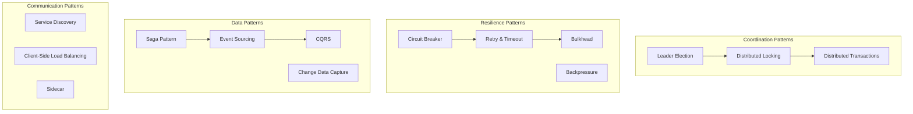
```mermaid
graph TB
    subgraph "Coordination Patterns"
        LE[Leader Election]
        DL[Distributed Locking]
        TXN[Distributed Transactions]
    end
    
    subgraph "Resilience Patterns"
        CB[Circuit Breaker]
        RT[Retry & Timeout]
        BH[Bulkhead]
        BP[Backpressure]
    end
    
    subgraph "Data Patterns"
        SAGA[Saga Pattern]
        ES[Event Sourcing]
        CQRS[CQRS]
        CDC[Change Data Capture]
    end
    
    subgraph "Communication Patterns"
        SVC[Service Discovery]
        LB[Client-Side Load Balancing]
        SD[Sidecar]
    end
    
    LE --> DL
    DL --> TXN
    CB --> RT
    RT --> BH
    SAGA --> ES
    ES --> CQRS
```

---

## Part I: Coordination Patterns

### 1. Distributed Locking

#### The Problem

Multiple processes across different nodes need mutually exclusive access to a shared resource.

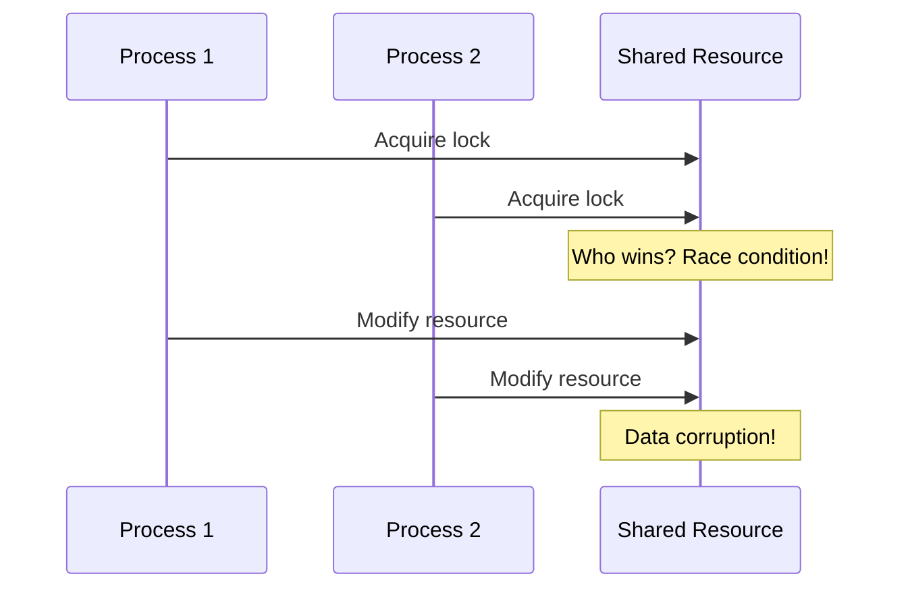
```mermaid
sequenceDiagram
    participant P1 as Process 1
    participant P2 as Process 2
    participant R as Shared Resource
    
    P1->>R: Acquire lock
    P2->>R: Acquire lock
    Note over R: Who wins? Race condition!
    P1->>R: Modify resource
    P2->>R: Modify resource
    Note over R: Data corruption!
```

#### Solution: Distributed Lock Manager

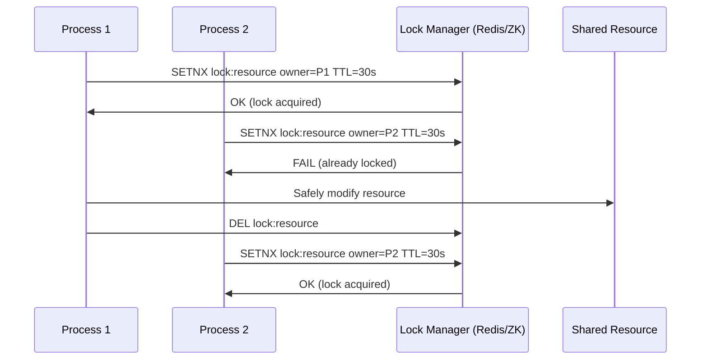
```mermaid
sequenceDiagram
    participant P1 as Process 1
    participant P2 as Process 2
    participant LM as Lock Manager (Redis/ZK)
    participant R as Shared Resource
    
    P1->>LM: SETNX lock:resource owner=P1 TTL=30s
    LM->>P1: OK (lock acquired)
    P2->>LM: SETNX lock:resource owner=P2 TTL=30s
    LM->>P2: FAIL (already locked)
    
    P1->>R: Safely modify resource
    P1->>LM: DEL lock:resource
    
    P2->>LM: SETNX lock:resource owner=P2 TTL=30s
    LM->>P2: OK (lock acquired)
```

#### Implementation Patterns

##### Redis-Based Lock (Redlock)

```python
import redis
import uuid
import time

class DistributedLock:
    def __init__(self, redis_client, lock_name, ttl_ms=30000):
        self.redis = redis_client
        self.lock_name = f"lock:{lock_name}"
        self.ttl_ms = ttl_ms
        self.token = str(uuid.uuid4())
    
    def acquire(self, retry_count=3, retry_delay_ms=100):
        """Attempt to acquire the lock with retries."""
        for attempt in range(retry_count):
            # SET NX with TTL (atomic operation)
            if self.redis.set(
                self.lock_name,
                self.token,
                nx=True,  # Only set if not exists
                px=self.ttl_ms  # TTL in milliseconds
            ):
                return True
            time.sleep(retry_delay_ms / 1000)
        return False
    
    def release(self):
        """Release lock only if we own it (compare-and-delete)."""
        # Lua script ensures atomic check-and-delete
        lua_script = """
        if redis.call("get", KEYS[1]) == ARGV[1] then
            return redis.call("del", KEYS[1])
        else
            return 0
        end
        """
        return self.redis.eval(lua_script, 1, self.lock_name, self.token)
    
    def extend(self, additional_ms):
        """Extend TTL if we still own the lock."""
        lua_script = """
        if redis.call("get", KEYS[1]) == ARGV[1] then
            return redis.call("pexpire", KEYS[1], ARGV[2])
        else
            return 0
        end
        """
        return self.redis.eval(
            lua_script, 1, self.lock_name, 
            self.token, self.ttl_ms + additional_ms
        )
```

##### ZooKeeper-Based Lock (Sequential Ephemeral Nodes)

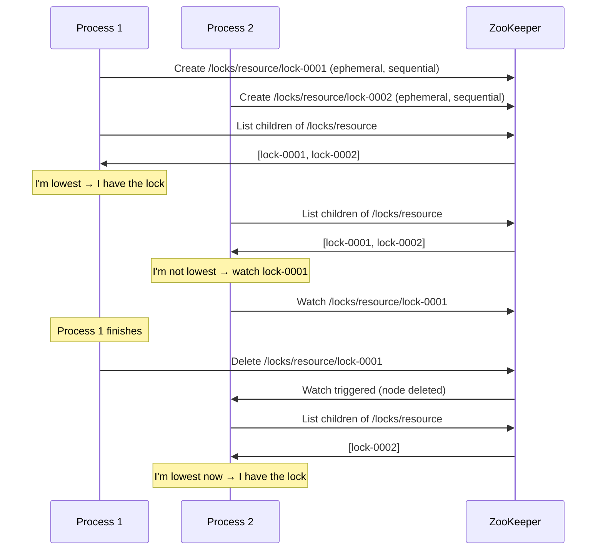
```mermaid
sequenceDiagram
    participant P1 as Process 1
    participant P2 as Process 2
    participant ZK as ZooKeeper
    
    P1->>ZK: Create /locks/resource/lock-0001 (ephemeral, sequential)
    P2->>ZK: Create /locks/resource/lock-0002 (ephemeral, sequential)
    
    P1->>ZK: List children of /locks/resource
    ZK->>P1: [lock-0001, lock-0002]
    Note over P1: I'm lowest → I have the lock
    
    P2->>ZK: List children of /locks/resource
    ZK->>P2: [lock-0001, lock-0002]
    Note over P2: I'm not lowest → watch lock-0001
    
    P2->>ZK: Watch /locks/resource/lock-0001
    
    Note over P1: Process 1 finishes
    P1->>ZK: Delete /locks/resource/lock-0001
    ZK->>P2: Watch triggered (node deleted)
    
    P2->>ZK: List children of /locks/resource
    ZK->>P2: [lock-0002]
    Note over P2: I'm lowest now → I have the lock
```

#### Lock Safety Considerations

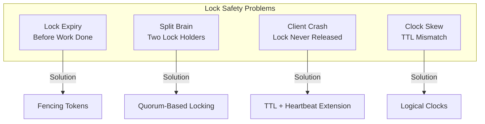
```mermaid
flowchart TD
    subgraph Problems["Lock Safety Problems"]
        P1[Lock Expiry<br/>Before Work Done]
        P2[Split Brain<br/>Two Lock Holders]
        P3[Client Crash<br/>Lock Never Released]
        P4[Clock Skew<br/>TTL Mismatch]
    end
    
    P1 -->|Solution| S1[Fencing Tokens]
    P2 -->|Solution| S2[Quorum-Based Locking]
    P3 -->|Solution| S3[TTL + Heartbeat Extension]
    P4 -->|Solution| S4[Logical Clocks]
```

##### Fencing Tokens Pattern

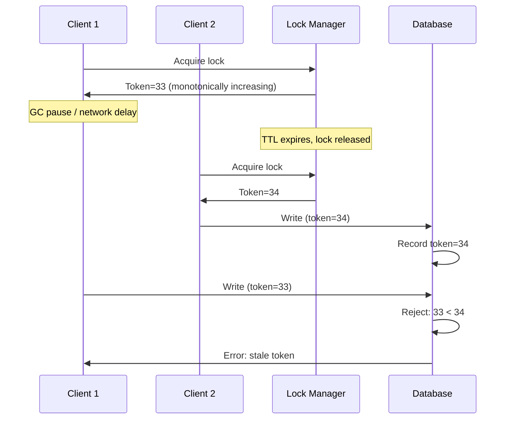
```mermaid
sequenceDiagram
    participant C1 as Client 1
    participant C2 as Client 2
    participant LM as Lock Manager
    participant DB as Database
    
    C1->>LM: Acquire lock
    LM->>C1: Token=33 (monotonically increasing)
    
    Note over C1: GC pause / network delay
    Note over LM: TTL expires, lock released
    
    C2->>LM: Acquire lock
    LM->>C2: Token=34
    
    C2->>DB: Write (token=34)
    DB->>DB: Record token=34
    
    C1->>DB: Write (token=33)
    DB->>DB: Reject: 33 < 34
    DB->>C1: Error: stale token
```

#### Trade-Off Analysis

| Approach | Consistency | Availability | Complexity | Use Case |
|----------|-------------|--------------|------------|----------|
| **Redis Single** | Weak | High | Low | Non-critical mutual exclusion |
| **Redlock (Multi)** | Moderate | Moderate | Medium | Important but not life-critical |
| **ZooKeeper** | Strong | Moderate | High | Critical coordination |
| **etcd** | Strong | Moderate | Medium | Kubernetes-native apps |
| **Database** | Strong | Lower | Low | Already have RDBMS |

---

### 2. Distributed Transactions

#### The Two Generals Problem

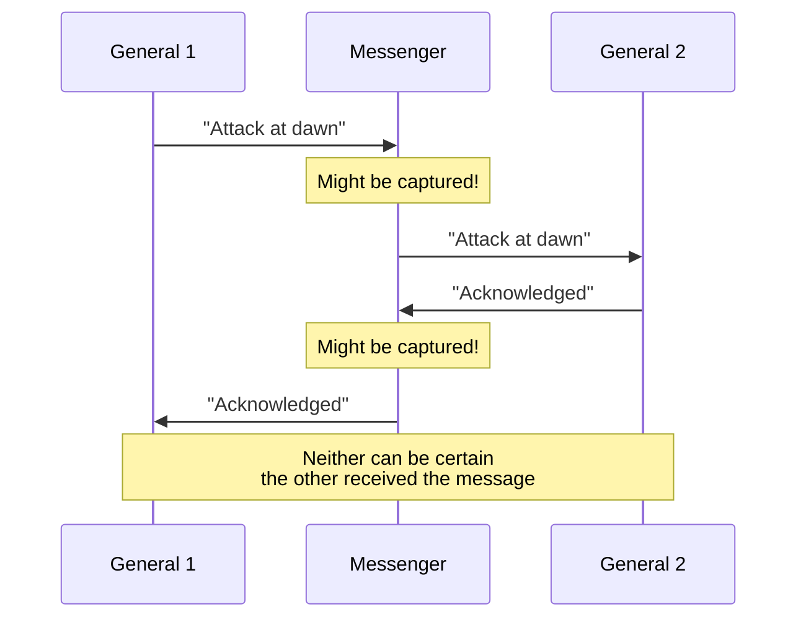
```mermaid
sequenceDiagram
    participant G1 as General 1
    participant M as Messenger
    participant G2 as General 2
    
    G1->>M: "Attack at dawn"
    Note over M: Might be captured!
    M->>G2: "Attack at dawn"
    G2->>M: "Acknowledged"
    Note over M: Might be captured!
    M->>G1: "Acknowledged"
    
    Note over G1,G2: Neither can be certain<br/>the other received the message
```

**Implication:** Perfect consensus in unreliable networks is impossible. We accept trade-offs.

#### Two-Phase Commit (2PC)

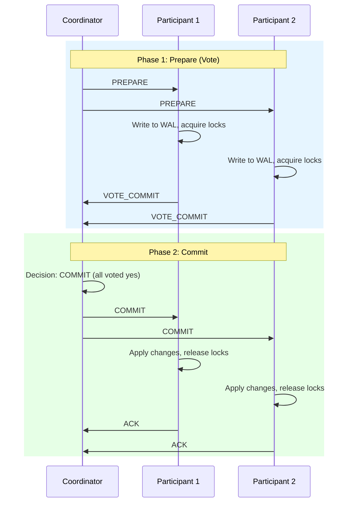
```mermaid
sequenceDiagram
    participant C as Coordinator
    participant P1 as Participant 1
    participant P2 as Participant 2
    
    rect rgb(230, 245, 255)
        Note over C,P2: Phase 1: Prepare (Vote)
        C->>P1: PREPARE
        C->>P2: PREPARE
        P1->>P1: Write to WAL, acquire locks
        P2->>P2: Write to WAL, acquire locks
        P1->>C: VOTE_COMMIT
        P2->>C: VOTE_COMMIT
    end
    
    rect rgb(230, 255, 230)
        Note over C,P2: Phase 2: Commit
        C->>C: Decision: COMMIT (all voted yes)
        C->>P1: COMMIT
        C->>P2: COMMIT
        P1->>P1: Apply changes, release locks
        P2->>P2: Apply changes, release locks
        P1->>C: ACK
        P2->>C: ACK
    end
```

##### 2PC Failure Scenarios

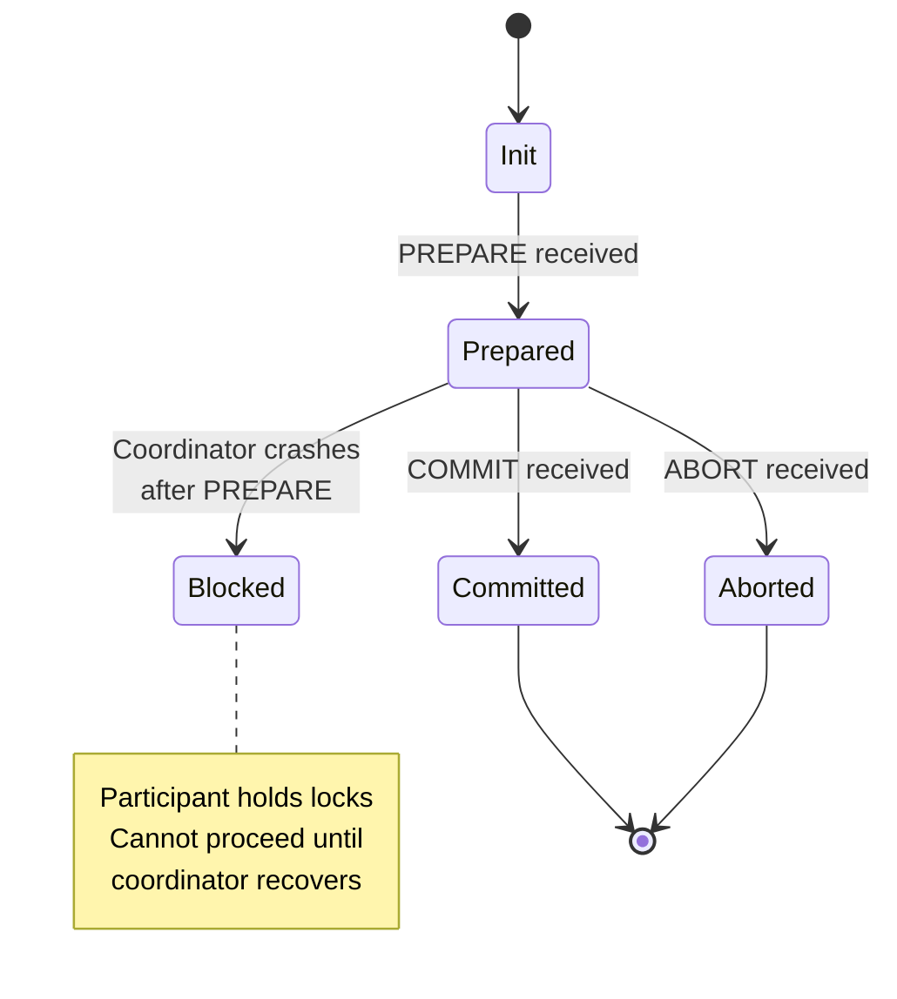
```mermaid
stateDiagram-v2
    [*] --> Init
    Init --> Prepared: PREPARE received
    Prepared --> Committed: COMMIT received
    Prepared --> Aborted: ABORT received
    
    Prepared --> Blocked: Coordinator crashes<br/>after PREPARE
    
    note right of Blocked
        Participant holds locks
        Cannot proceed until
        coordinator recovers
    end note
    
    Committed --> [*]
    Aborted --> [*]
```

| Failure | State | Resolution |
|---------|-------|------------|
| Participant fails before PREPARE | Init | Coordinator aborts |
| Participant fails after VOTE | Prepared | Recovery from WAL |
| Coordinator fails before decision | Prepared | **BLOCKED** until recovery |
| Coordinator fails after decision | Committed/Aborted | Participants query coordinator |

#### Three-Phase Commit (3PC)

Adds a `PRE_COMMIT` phase to reduce blocking, but still not partition-tolerant.

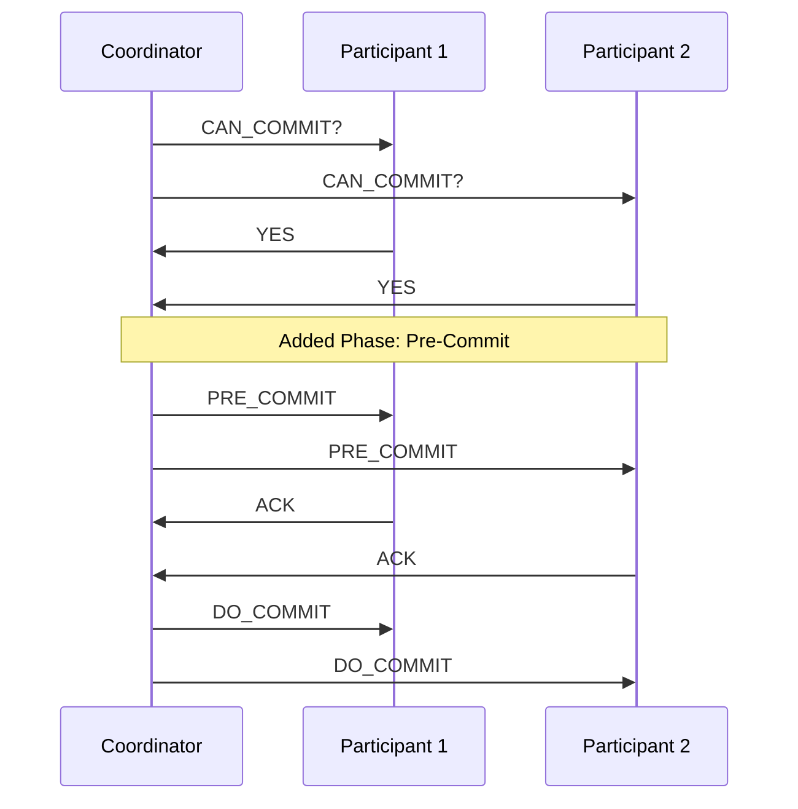
```mermaid
sequenceDiagram
    participant C as Coordinator
    participant P1 as Participant 1
    participant P2 as Participant 2
    
    C->>P1: CAN_COMMIT?
    C->>P2: CAN_COMMIT?
    P1->>C: YES
    P2->>C: YES
    
    Note over C,P2: Added Phase: Pre-Commit
    C->>P1: PRE_COMMIT
    C->>P2: PRE_COMMIT
    P1->>C: ACK
    P2->>C: ACK
    
    C->>P1: DO_COMMIT
    C->>P2: DO_COMMIT
```

**Key Insight:** If participant times out after PRE_COMMIT, it can safely commit (knows others were ready).

#### Saga Pattern (Preferred for Microservices)

Long-lived transactions as a sequence of local transactions with compensating actions.

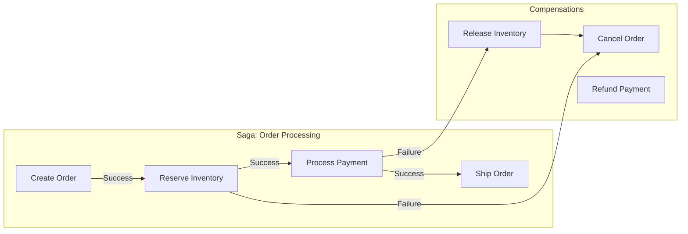
```mermaid
flowchart LR
    subgraph "Saga: Order Processing"
        T1[Create Order]
        T2[Reserve Inventory]
        T3[Process Payment]
        T4[Ship Order]
    end
    
    subgraph "Compensations"
        C1[Cancel Order]
        C2[Release Inventory]
        C3[Refund Payment]
    end
    
    T1 -->|Success| T2
    T2 -->|Success| T3
    T3 -->|Success| T4
    
    T3 -->|Failure| C2
    C2 --> C1
    
    T2 -->|Failure| C1
```

##### Choreography vs Orchestration

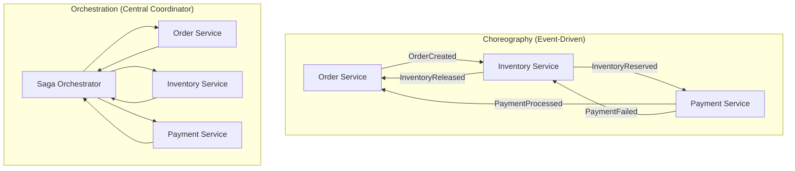
```mermaid
flowchart TB
    subgraph Choreography["Choreography (Event-Driven)"]
        O1[Order Service]
        I1[Inventory Service]
        P1[Payment Service]
        
        O1 -->|OrderCreated| I1
        I1 -->|InventoryReserved| P1
        P1 -->|PaymentProcessed| O1
        
        P1 -->|PaymentFailed| I1
        I1 -->|InventoryReleased| O1
    end
    
    subgraph Orchestration["Orchestration (Central Coordinator)"]
        ORC[Saga Orchestrator]
        O2[Order Service]
        I2[Inventory Service]
        P2[Payment Service]
        
        ORC --> O2
        ORC --> I2
        ORC --> P2
        
        O2 --> ORC
        I2 --> ORC
        P2 --> ORC
    end
```

| Aspect | Choreography | Orchestration |
|--------|--------------|---------------|
| **Coupling** | Loose (event-based) | Central coordinator |
| **Visibility** | Hard to track flow | Clear execution path |
| **Complexity** | Distributed logic | Centralized logic |
| **Failure handling** | Each service handles | Orchestrator handles |
| **Best for** | Simple sagas | Complex business logic |

##### Saga Implementation Example

```python
from enum import Enum
from dataclasses import dataclass
from typing import List, Callable, Optional

class SagaStatus(Enum):
    PENDING = "pending"
    RUNNING = "running"
    COMPLETED = "completed"
    COMPENSATING = "compensating"
    FAILED = "failed"

@dataclass
class SagaStep:
    name: str
    action: Callable
    compensation: Callable
    status: str = "pending"

class SagaOrchestrator:
    def __init__(self, saga_id: str, steps: List[SagaStep]):
        self.saga_id = saga_id
        self.steps = steps
        self.current_step = 0
        self.status = SagaStatus.PENDING
        self.completed_steps: List[SagaStep] = []
    
    async def execute(self, context: dict) -> bool:
        """Execute saga steps forward."""
        self.status = SagaStatus.RUNNING
        
        for i, step in enumerate(self.steps):
            self.current_step = i
            try:
                # Execute the step
                await step.action(context)
                step.status = "completed"
                self.completed_steps.append(step)
                
                # Persist saga state (for recovery)
                await self._persist_state()
                
            except Exception as e:
                step.status = "failed"
                await self._compensate(context, str(e))
                return False
        
        self.status = SagaStatus.COMPLETED
        return True
    
    async def _compensate(self, context: dict, error: str):
        """Execute compensation in reverse order."""
        self.status = SagaStatus.COMPENSATING
        
        # Compensate in reverse order
        for step in reversed(self.completed_steps):
            try:
                await step.compensation(context)
                step.status = "compensated"
            except Exception as comp_error:
                # Log and continue - compensation must be best-effort
                step.status = "compensation_failed"
        
        self.status = SagaStatus.FAILED
    
    async def _persist_state(self):
        """Persist saga state for crash recovery."""
        # Store to database: saga_id, current_step, completed_steps, status
        pass
```

---

## Part II: Resilience Patterns

### 3. Circuit Breaker

#### Mental Model: Electrical Circuit Breaker

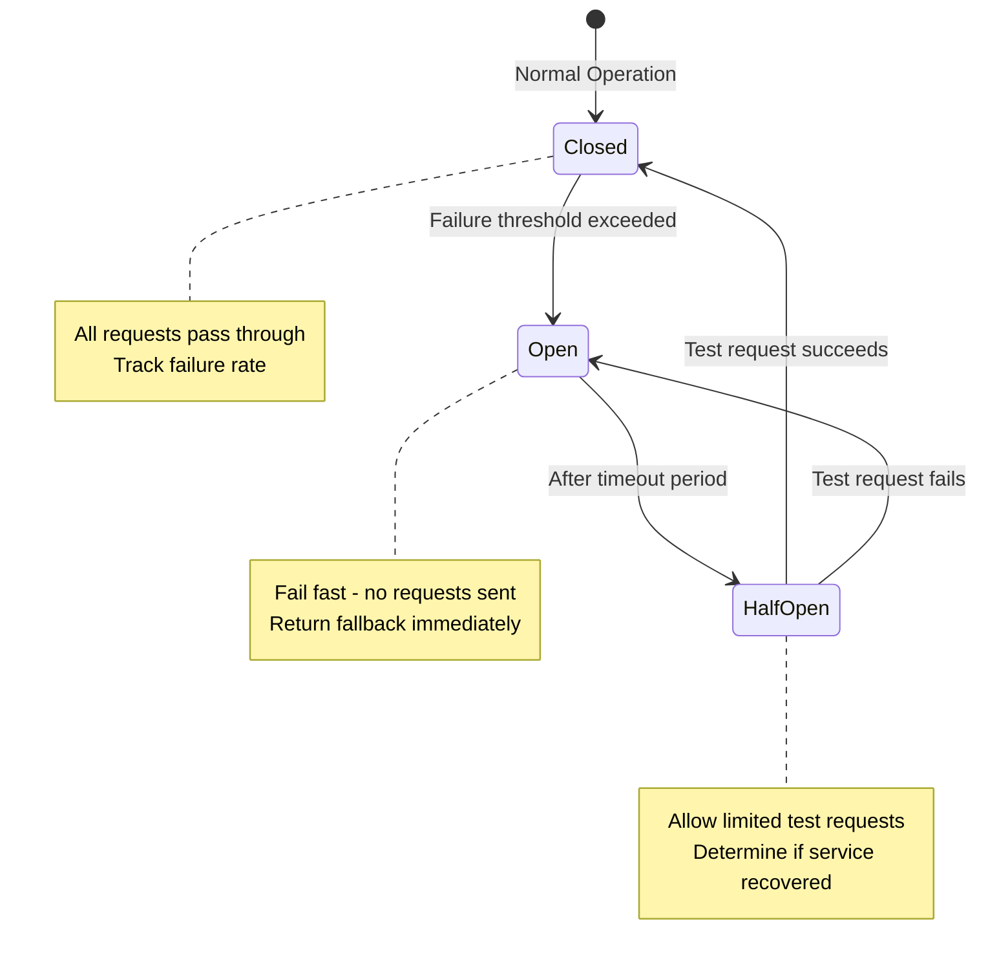
```mermaid
stateDiagram-v2
    [*] --> Closed: Normal Operation
    
    Closed --> Open: Failure threshold exceeded
    Open --> HalfOpen: After timeout period
    HalfOpen --> Closed: Test request succeeds
    HalfOpen --> Open: Test request fails
    
    note right of Closed
        All requests pass through
        Track failure rate
    end note
    
    note right of Open
        Fail fast - no requests sent
        Return fallback immediately
    end note
    
    note right of HalfOpen
        Allow limited test requests
        Determine if service recovered
    end note
```

#### Implementation

```python
import time
from enum import Enum
from threading import Lock
from typing import Callable, Optional, Any

class CircuitState(Enum):
    CLOSED = "closed"
    OPEN = "open"
    HALF_OPEN = "half_open"

class CircuitBreaker:
    def __init__(
        self,
        failure_threshold: int = 5,
        success_threshold: int = 2,
        timeout_seconds: float = 30.0,
        fallback: Optional[Callable] = None
    ):
        self.failure_threshold = failure_threshold
        self.success_threshold = success_threshold
        self.timeout_seconds = timeout_seconds
        self.fallback = fallback
        
        self.state = CircuitState.CLOSED
        self.failure_count = 0
        self.success_count = 0
        self.last_failure_time: Optional[float] = None
        self._lock = Lock()
    
    def call(self, func: Callable, *args, **kwargs) -> Any:
        """Execute function through circuit breaker."""
        with self._lock:
            if self.state == CircuitState.OPEN:
                if self._should_attempt_reset():
                    self.state = CircuitState.HALF_OPEN
                    self.success_count = 0
                else:
                    return self._handle_open_circuit()
        
        try:
            result = func(*args, **kwargs)
            self._on_success()
            return result
        except Exception as e:
            self._on_failure()
            raise
    
    def _should_attempt_reset(self) -> bool:
        """Check if timeout has passed since circuit opened."""
        if self.last_failure_time is None:
            return True
        return time.time() - self.last_failure_time >= self.timeout_seconds
    
    def _on_success(self):
        with self._lock:
            if self.state == CircuitState.HALF_OPEN:
                self.success_count += 1
                if self.success_count >= self.success_threshold:
                    self.state = CircuitState.CLOSED
                    self.failure_count = 0
            elif self.state == CircuitState.CLOSED:
                self.failure_count = 0
    
    def _on_failure(self):
        with self._lock:
            self.failure_count += 1
            self.last_failure_time = time.time()
            
            if self.state == CircuitState.HALF_OPEN:
                self.state = CircuitState.OPEN
            elif self.failure_count >= self.failure_threshold:
                self.state = CircuitState.OPEN
    
    def _handle_open_circuit(self) -> Any:
        if self.fallback:
            return self.fallback()
        raise CircuitOpenError("Circuit breaker is open")

class CircuitOpenError(Exception):
    pass
```

#### Circuit Breaker with Metrics

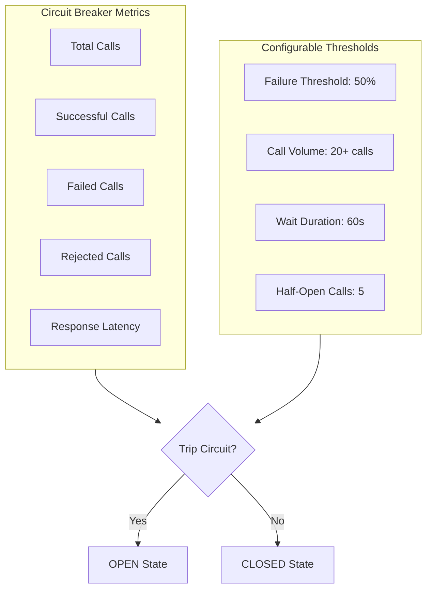
```mermaid
flowchart TB
    subgraph Metrics["Circuit Breaker Metrics"]
        Calls[Total Calls]
        Success[Successful Calls]
        Failure[Failed Calls]
        Rejected[Rejected Calls]
        Latency[Response Latency]
    end
    
    subgraph Thresholds["Configurable Thresholds"]
        FT[Failure Threshold: 50%]
        CT[Call Volume: 20+ calls]
        WT[Wait Duration: 60s]
        HO[Half-Open Calls: 5]
    end
    
    Metrics --> Decision{Trip Circuit?}
    Thresholds --> Decision
    
    Decision -->|Yes| Open[OPEN State]
    Decision -->|No| Closed[CLOSED State]
```

#### Trade-Off Analysis

| Parameter | Higher Value Effect | Lower Value Effect |
|-----------|--------------------|--------------------|
| **Failure threshold** | More tolerant, slower to open | Less tolerant, faster protection |
| **Timeout** | Longer recovery time, more stable | Faster recovery attempts |
| **Success threshold** | More conservative recovery | Faster return to normal |
| **Sliding window** | More accurate failure rate | More responsive to changes |

---

### 4. Retry Pattern with Exponential Backoff

#### The Problem

Transient failures are common in distributed systems. Retrying immediately often makes things worse.

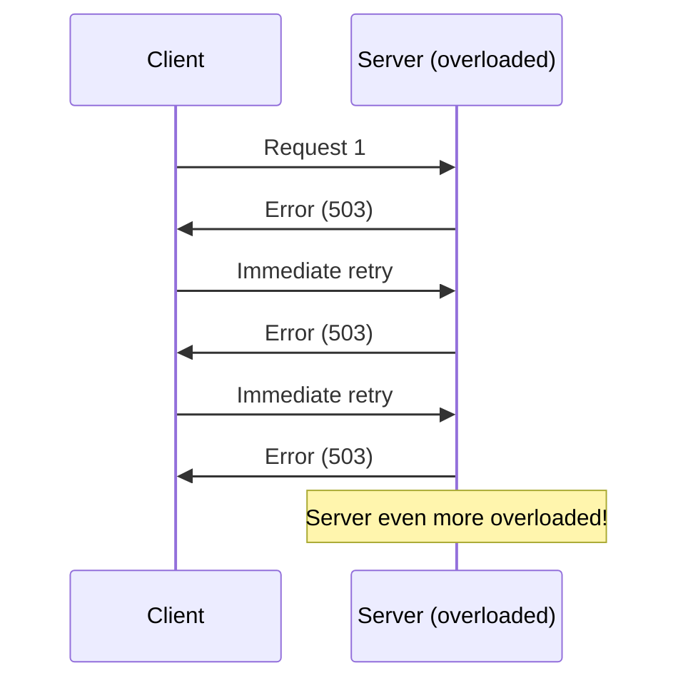
```mermaid
sequenceDiagram
    participant C as Client
    participant S as Server (overloaded)
    
    C->>S: Request 1
    S->>C: Error (503)
    C->>S: Immediate retry
    S->>C: Error (503)
    C->>S: Immediate retry
    S->>C: Error (503)
    
    Note over S: Server even more overloaded!
```

#### Solution: Exponential Backoff with Jitter

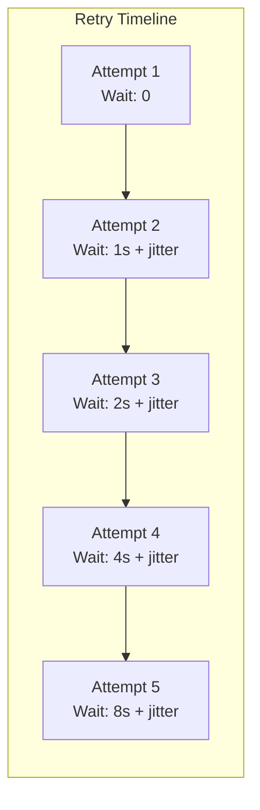
```mermaid
flowchart LR
    subgraph "Retry Timeline"
        R1["Attempt 1<br/>Wait: 0"]
        R2["Attempt 2<br/>Wait: 1s + jitter"]
        R3["Attempt 3<br/>Wait: 2s + jitter"]
        R4["Attempt 4<br/>Wait: 4s + jitter"]
        R5["Attempt 5<br/>Wait: 8s + jitter"]
    end
    
    R1 --> R2 --> R3 --> R4 --> R5
```

```python
import random
import time
import asyncio
from typing import Callable, TypeVar, Optional
from functools import wraps

T = TypeVar('T')

class RetryConfig:
    def __init__(
        self,
        max_attempts: int = 3,
        base_delay: float = 1.0,
        max_delay: float = 60.0,
        exponential_base: float = 2.0,
        jitter: bool = True,
        retryable_exceptions: tuple = (Exception,)
    ):
        self.max_attempts = max_attempts
        self.base_delay = base_delay
        self.max_delay = max_delay
        self.exponential_base = exponential_base
        self.jitter = jitter
        self.retryable_exceptions = retryable_exceptions

def calculate_delay(attempt: int, config: RetryConfig) -> float:
    """Calculate delay with exponential backoff and optional jitter."""
    # Exponential backoff: base_delay * (exponential_base ^ attempt)
    delay = config.base_delay * (config.exponential_base ** attempt)
    
    # Cap at max delay
    delay = min(delay, config.max_delay)
    
    # Add jitter (±50% randomization)
    if config.jitter:
        jitter_range = delay * 0.5
        delay = delay + random.uniform(-jitter_range, jitter_range)
    
    return max(0, delay)

def retry_with_backoff(config: RetryConfig = None):
    """Decorator for retry with exponential backoff."""
    if config is None:
        config = RetryConfig()
    
    def decorator(func: Callable[..., T]) -> Callable[..., T]:
        @wraps(func)
        def wrapper(*args, **kwargs) -> T:
            last_exception = None
            
            for attempt in range(config.max_attempts):
                try:
                    return func(*args, **kwargs)
                except config.retryable_exceptions as e:
                    last_exception = e
                    
                    if attempt < config.max_attempts - 1:
                        delay = calculate_delay(attempt, config)
                        time.sleep(delay)
            
            raise last_exception
        
        return wrapper
    return decorator

# Async version
async def retry_async(
    func: Callable,
    config: RetryConfig = None,
    *args, **kwargs
) -> T:
    if config is None:
        config = RetryConfig()
    
    last_exception = None
    
    for attempt in range(config.max_attempts):
        try:
            return await func(*args, **kwargs)
        except config.retryable_exceptions as e:
            last_exception = e
            
            if attempt < config.max_attempts - 1:
                delay = calculate_delay(attempt, config)
                await asyncio.sleep(delay)
    
    raise last_exception
```

#### Jitter Strategies

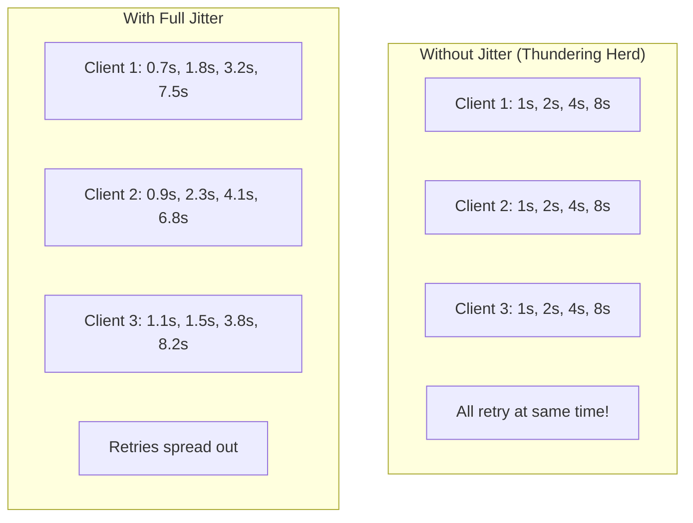
```mermaid
flowchart TB
    subgraph "Without Jitter (Thundering Herd)"
        T1[Client 1: 1s, 2s, 4s, 8s]
        T2[Client 2: 1s, 2s, 4s, 8s]
        T3[Client 3: 1s, 2s, 4s, 8s]
        Note1[All retry at same time!]
    end
    
    subgraph "With Full Jitter"
        J1[Client 1: 0.7s, 1.8s, 3.2s, 7.5s]
        J2[Client 2: 0.9s, 2.3s, 4.1s, 6.8s]
        J3[Client 3: 1.1s, 1.5s, 3.8s, 8.2s]
        Note2[Retries spread out]
    end
```

| Jitter Type | Formula | Use Case |
|-------------|---------|----------|
| **No Jitter** | `base * 2^attempt` | Testing only |
| **Full Jitter** | `random(0, base * 2^attempt)` | Most scenarios |
| **Equal Jitter** | `base * 2^attempt / 2 + random(0, base * 2^attempt / 2)` | Minimum delay guarantee |
| **Decorrelated** | `min(max_delay, random(base, previous_delay * 3))` | Long-running operations |

---

### 5. Bulkhead Pattern

#### Mental Model: Ship Compartments

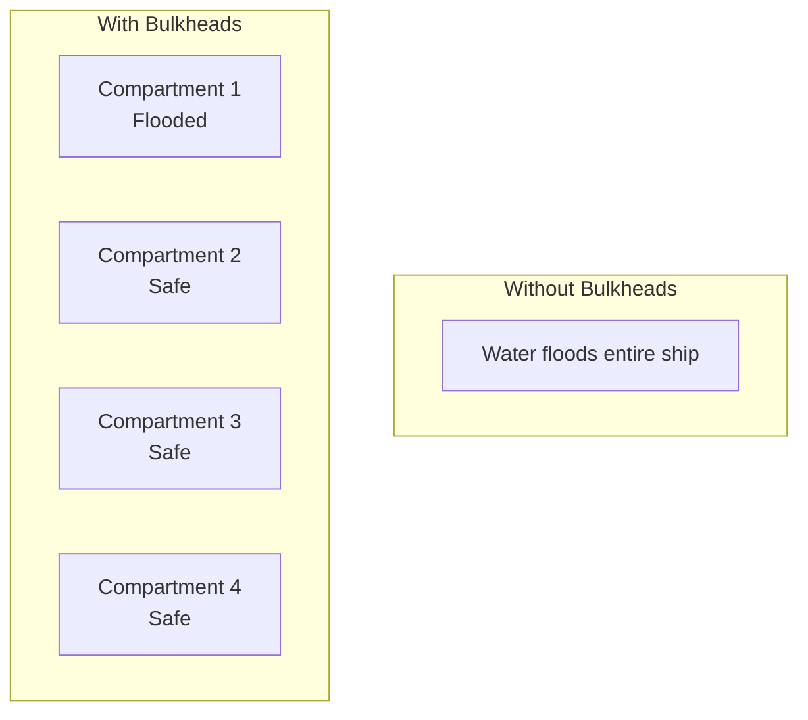
```mermaid
flowchart TB
    subgraph Ship["Without Bulkheads"]
        W1[Water floods entire ship]
    end
    
    subgraph Ship2["With Bulkheads"]
        C1[Compartment 1<br/>Flooded]
        C2[Compartment 2<br/>Safe]
        C3[Compartment 3<br/>Safe]
        C4[Compartment 4<br/>Safe]
    end
```

#### Application: Thread Pool Isolation

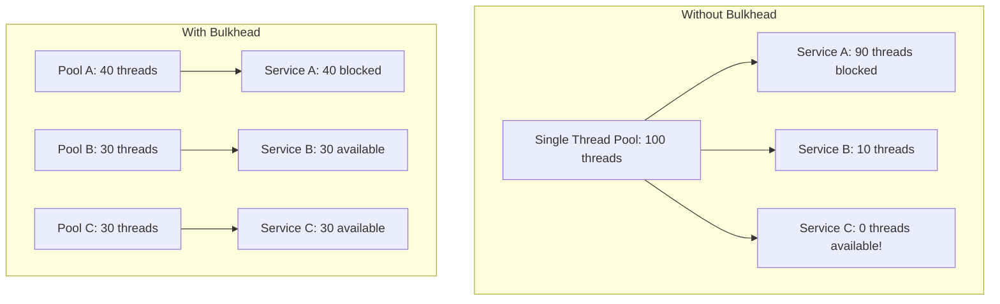
```mermaid
flowchart TB
    subgraph "Without Bulkhead"
        TP[Single Thread Pool: 100 threads]
        S1[Service A: 90 threads blocked]
        S2[Service B: 10 threads]
        S3[Service C: 0 threads available!]
        
        TP --> S1
        TP --> S2
        TP --> S3
    end
    
    subgraph "With Bulkhead"
        TP1[Pool A: 40 threads]
        TP2[Pool B: 30 threads]
        TP3[Pool C: 30 threads]
        
        SA[Service A: 40 blocked]
        SB[Service B: 30 available]
        SC[Service C: 30 available]
        
        TP1 --> SA
        TP2 --> SB
        TP3 --> SC
    end
```

```python
import asyncio
from typing import Callable, Any
from concurrent.futures import ThreadPoolExecutor

class Bulkhead:
    """Isolate operations using semaphores and thread pools."""
    
    def __init__(
        self, 
        name: str,
        max_concurrent: int,
        max_wait_seconds: float = 30.0
    ):
        self.name = name
        self.max_concurrent = max_concurrent
        self.max_wait = max_wait_seconds
        self._semaphore = asyncio.Semaphore(max_concurrent)
        self._thread_pool = ThreadPoolExecutor(
            max_workers=max_concurrent,
            thread_name_prefix=f"bulkhead-{name}"
        )
        
        # Metrics
        self.active_count = 0
        self.rejected_count = 0
    
    async def execute(self, func: Callable, *args, **kwargs) -> Any:
        """Execute function within bulkhead constraints."""
        try:
            # Try to acquire semaphore with timeout
            acquired = await asyncio.wait_for(
                self._semaphore.acquire(),
                timeout=self.max_wait
            )
        except asyncio.TimeoutError:
            self.rejected_count += 1
            raise BulkheadFullError(
                f"Bulkhead '{self.name}' is full "
                f"({self.max_concurrent} concurrent operations)"
            )
        
        self.active_count += 1
        try:
            return await asyncio.get_event_loop().run_in_executor(
                self._thread_pool,
                lambda: func(*args, **kwargs)
            )
        finally:
            self.active_count -= 1
            self._semaphore.release()

class BulkheadFullError(Exception):
    pass

# Usage example
class ServiceClient:
    def __init__(self):
        # Separate bulkheads for different downstream services
        self.payment_bulkhead = Bulkhead("payment", max_concurrent=20)
        self.inventory_bulkhead = Bulkhead("inventory", max_concurrent=30)
        self.notification_bulkhead = Bulkhead("notification", max_concurrent=50)
    
    async def process_payment(self, payment_data):
        return await self.payment_bulkhead.execute(
            self._call_payment_service, payment_data
        )
    
    async def check_inventory(self, product_id):
        return await self.inventory_bulkhead.execute(
            self._call_inventory_service, product_id
        )
```

---

### 6. Backpressure

#### The Problem

Producer overwhelms consumer, causing memory exhaustion or cascading failures.

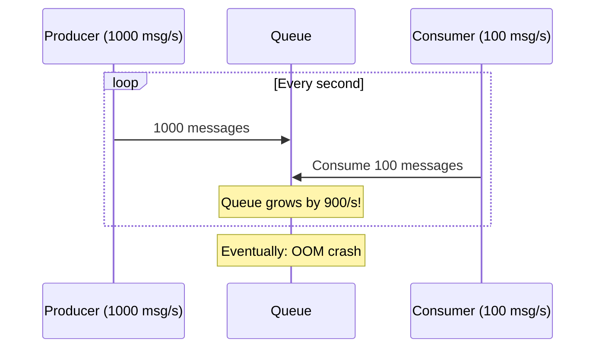
```mermaid
sequenceDiagram
    participant P as Producer (1000 msg/s)
    participant Q as Queue
    participant C as Consumer (100 msg/s)
    
    loop Every second
        P->>Q: 1000 messages
        C->>Q: Consume 100 messages
        Note over Q: Queue grows by 900/s!
    end
    
    Note over Q: Eventually: OOM crash
```

#### Backpressure Strategies

```mermaid
flowchart TB
    subgraph Strategies["Backpressure Strategies"]
        Drop[Drop Messages]
        Buffer[Bounded Buffer]
        Block[Block Producer]
        Sample[Sample/Aggregate]
        ThrottleP[Throttle Producer]
    end
    
    Drop --> DropEx["Drop oldest or newest<br/>Use: Metrics, monitoring"]
    Buffer --> BufferEx["Queue with max size<br/>Use: Spiky traffic"]
    Block --> BlockEx["Producer waits for capacity<br/>Use: Critical data"]
    Sample --> SampleEx["Process every Nth message<br/>Use: High-volume telemetry"]
    ThrottleP --> ThrottleEx["Rate limit at source<br/>Use: API gateways"]
```

#### Implementation: Bounded Queue with Backpressure

```python
import asyncio
from enum import Enum
from typing import TypeVar, Generic, Optional
from dataclasses import dataclass

T = TypeVar('T')

class BackpressureStrategy(Enum):
    BLOCK = "block"          # Block producer until space available
    DROP_OLDEST = "drop_oldest"  # Drop oldest item when full
    DROP_NEWEST = "drop_newest"  # Reject new item when full
    ERROR = "error"          # Raise exception when full

@dataclass
class BackpressureMetrics:
    items_received: int = 0
    items_processed: int = 0
    items_dropped: int = 0
    producer_blocked_count: int = 0

class BackpressureQueue(Generic[T]):
    def __init__(
        self,
        max_size: int,
        strategy: BackpressureStrategy = BackpressureStrategy.BLOCK,
        block_timeout: float = 30.0
    ):
        self.max_size = max_size
        self.strategy = strategy
        self.block_timeout = block_timeout
        self._queue: asyncio.Queue = asyncio.Queue(maxsize=max_size)
        self.metrics = BackpressureMetrics()
    
    async def put(self, item: T) -> bool:
        """Add item with backpressure handling."""
        self.metrics.items_received += 1
        
        if self._queue.full():
            if self.strategy == BackpressureStrategy.BLOCK:
                self.metrics.producer_blocked_count += 1
                try:
                    await asyncio.wait_for(
                        self._queue.put(item),
                        timeout=self.block_timeout
                    )
                    return True
                except asyncio.TimeoutError:
                    self.metrics.items_dropped += 1
                    return False
            
            elif self.strategy == BackpressureStrategy.DROP_OLDEST:
                # Remove oldest, add newest
                try:
                    self._queue.get_nowait()
                    self.metrics.items_dropped += 1
                except asyncio.QueueEmpty:
                    pass
                await self._queue.put(item)
                return True
            
            elif self.strategy == BackpressureStrategy.DROP_NEWEST:
                self.metrics.items_dropped += 1
                return False
            
            elif self.strategy == BackpressureStrategy.ERROR:
                self.metrics.items_dropped += 1
                raise QueueFullError("Queue is full")
        else:
            await self._queue.put(item)
            return True
    
    async def get(self) -> T:
        """Get item from queue."""
        item = await self._queue.get()
        self.metrics.items_processed += 1
        return item
    
    @property
    def fill_ratio(self) -> float:
        """Current fill ratio (0.0 to 1.0)."""
        return self._queue.qsize() / self.max_size

class QueueFullError(Exception):
    pass
```

---

## Part III: Data Patterns

### 7. Event Sourcing

#### Traditional State vs Event Sourcing

```mermaid
flowchart TB
    subgraph Traditional["Traditional: Store Current State"]
        DB1[(Account Table)]
        S1["balance: $500"]
        S2["After deposit $100"]
        S3["balance: $600"]
        
        S1 --> S2 --> S3
    end
    
    subgraph EventSourcing["Event Sourcing: Store Events"]
        ES[(Event Store)]
        E1["AccountCreated: $0"]
        E2["Deposited: $500"]
        E3["Deposited: $100"]
        E4["Current State: $600"]
        
        E1 --> E2 --> E3
        E3 -->|Replay| E4
    end
```

#### Event Store Structure

```mermaid
erDiagram
    EVENT_STREAM {
        uuid stream_id PK
        string stream_type
        int current_version
        timestamp created_at
    }
    
    EVENT {
        uuid event_id PK
        uuid stream_id FK
        int version
        string event_type
        jsonb event_data
        jsonb metadata
        timestamp created_at
    }
    
    SNAPSHOT {
        uuid stream_id PK
        int version
        jsonb state
        timestamp created_at
    }
    
    EVENT_STREAM ||--o{ EVENT : contains
    EVENT_STREAM ||--o| SNAPSHOT : has
```

#### Implementation

```python
from dataclasses import dataclass, field
from datetime import datetime
from typing import List, Optional, Type, Dict, Any
from abc import ABC, abstractmethod
import json
import uuid

# Base Event
@dataclass
class DomainEvent(ABC):
    event_id: str = field(default_factory=lambda: str(uuid.uuid4()))
    timestamp: datetime = field(default_factory=datetime.utcnow)
    version: int = 0
    
    @property
    @abstractmethod
    def event_type(self) -> str:
        pass

# Concrete Events
@dataclass
class AccountCreated(DomainEvent):
    account_id: str = ""
    owner_name: str = ""
    
    @property
    def event_type(self) -> str:
        return "AccountCreated"

@dataclass
class MoneyDeposited(DomainEvent):
    account_id: str = ""
    amount: float = 0.0
    
    @property
    def event_type(self) -> str:
        return "MoneyDeposited"

@dataclass
class MoneyWithdrawn(DomainEvent):
    account_id: str = ""
    amount: float = 0.0
    
    @property
    def event_type(self) -> str:
        return "MoneyWithdrawn"

# Aggregate
class BankAccount:
    def __init__(self, account_id: str):
        self.account_id = account_id
        self.owner_name = ""
        self.balance = 0.0
        self.version = 0
        self._pending_events: List[DomainEvent] = []
    
    # Command handlers (generate events)
    def create(self, owner_name: str):
        event = AccountCreated(
            account_id=self.account_id,
            owner_name=owner_name
        )
        self._apply_event(event)
        self._pending_events.append(event)
    
    def deposit(self, amount: float):
        if amount <= 0:
            raise ValueError("Amount must be positive")
        
        event = MoneyDeposited(
            account_id=self.account_id,
            amount=amount
        )
        self._apply_event(event)
        self._pending_events.append(event)
    
    def withdraw(self, amount: float):
        if amount <= 0:
            raise ValueError("Amount must be positive")
        if amount > self.balance:
            raise ValueError("Insufficient funds")
        
        event = MoneyWithdrawn(
            account_id=self.account_id,
            amount=amount
        )
        self._apply_event(event)
        self._pending_events.append(event)
    
    # Event handlers (apply state changes)
    def _apply_event(self, event: DomainEvent):
        if isinstance(event, AccountCreated):
            self.owner_name = event.owner_name
            self.balance = 0.0
        elif isinstance(event, MoneyDeposited):
            self.balance += event.amount
        elif isinstance(event, MoneyWithdrawn):
            self.balance -= event.amount
        
        self.version += 1
        event.version = self.version
    
    # Reconstitute from events
    @classmethod
    def load_from_events(cls, account_id: str, events: List[DomainEvent]) -> 'BankAccount':
        account = cls(account_id)
        for event in events:
            account._apply_event(event)
        return account
    
    def get_pending_events(self) -> List[DomainEvent]:
        return self._pending_events.copy()
    
    def clear_pending_events(self):
        self._pending_events.clear()

# Event Store
class EventStore:
    def __init__(self):
        self._streams: Dict[str, List[DomainEvent]] = {}
    
    def append_events(
        self, 
        stream_id: str, 
        events: List[DomainEvent],
        expected_version: int
    ):
        """Append events with optimistic concurrency."""
        stream = self._streams.get(stream_id, [])
        
        current_version = len(stream)
        if current_version != expected_version:
            raise ConcurrencyError(
                f"Expected version {expected_version}, "
                f"but stream is at {current_version}"
            )
        
        self._streams[stream_id] = stream + events
    
    def get_events(
        self, 
        stream_id: str,
        from_version: int = 0
    ) -> List[DomainEvent]:
        """Get events from a stream."""
        stream = self._streams.get(stream_id, [])
        return stream[from_version:]

class ConcurrencyError(Exception):
    pass
```

#### Event Sourcing Trade-offs

| Benefit | Challenge |
|---------|-----------|
| Complete audit trail | Storage grows indefinitely |
| Temporal queries ("state at time X") | Query complexity |
| Event replay for debugging | Schema evolution |
| Natural fit for event-driven systems | Learning curve |
| Easy to add new projections | Eventually consistent reads |

---

### 8. CQRS (Command Query Responsibility Segregation)

#### Concept

Separate read and write models for different optimization strategies.

```mermaid
flowchart TB
    subgraph "Traditional CRUD"
        Client1[Client]
        Model1[(Single Model)]
        Client1 -->|Read + Write| Model1
    end
    
    subgraph "CQRS"
        Client2[Client]
        
        subgraph Commands
            CMD[Command Handler]
            WM[(Write Model<br/>Normalized)]
        end
        
        subgraph Queries
            QH[Query Handler]
            RM[(Read Model<br/>Denormalized)]
        end
        
        Client2 -->|Commands| CMD
        CMD --> WM
        WM -->|Events/Sync| RM
        Client2 -->|Queries| QH
        QH --> RM
    end
```

#### CQRS with Event Sourcing

```mermaid
flowchart LR
    subgraph Write["Write Side"]
        Command[Command]
        Aggregate[Aggregate]
        ES[(Event Store)]
        
        Command --> Aggregate
        Aggregate -->|Events| ES
    end
    
    subgraph Projection["Projection"]
        EP[Event Processor]
    end
    
    subgraph Read["Read Side"]
        RM1[(Read Model 1<br/>SQL for queries)]
        RM2[(Read Model 2<br/>Elasticsearch)]
        RM3[(Read Model 3<br/>Redis cache)]
        
        QH[Query Handler]
    end
    
    ES --> EP
    EP --> RM1
    EP --> RM2
    EP --> RM3
    
    RM1 --> QH
    RM2 --> QH
    RM3 --> QH
```

#### Implementation

```python
from abc import ABC, abstractmethod
from dataclasses import dataclass
from typing import List, Dict, Any, Optional

# Commands (Write Side)
@dataclass
class Command(ABC):
    pass

@dataclass
class CreateOrder(Command):
    order_id: str
    customer_id: str
    items: List[Dict[str, Any]]

@dataclass
class AddItemToOrder(Command):
    order_id: str
    product_id: str
    quantity: int
    price: float

# Command Handler
class OrderCommandHandler:
    def __init__(self, event_store: 'EventStore', event_publisher: 'EventPublisher'):
        self.event_store = event_store
        self.event_publisher = event_publisher
    
    def handle(self, command: Command):
        if isinstance(command, CreateOrder):
            return self._handle_create_order(command)
        elif isinstance(command, AddItemToOrder):
            return self._handle_add_item(command)
    
    def _handle_create_order(self, cmd: CreateOrder):
        # Load aggregate
        order = Order(cmd.order_id)
        order.create(cmd.customer_id, cmd.items)
        
        # Persist events
        events = order.get_pending_events()
        self.event_store.append_events(
            stream_id=f"order-{cmd.order_id}",
            events=events,
            expected_version=0
        )
        
        # Publish events for projections
        for event in events:
            self.event_publisher.publish(event)

# Read Models (Query Side)
@dataclass
class OrderSummaryView:
    """Denormalized read model for order listing."""
    order_id: str
    customer_id: str
    customer_name: str  # Denormalized from customer service
    item_count: int
    total_amount: float
    status: str
    created_at: datetime

class OrderReadModelProjection:
    """Projects events into read model."""
    
    def __init__(self, read_db: 'ReadDatabase'):
        self.read_db = read_db
    
    def handle_event(self, event: DomainEvent):
        if isinstance(event, OrderCreated):
            self._on_order_created(event)
        elif isinstance(event, ItemAdded):
            self._on_item_added(event)
        elif isinstance(event, OrderShipped):
            self._on_order_shipped(event)
    
    def _on_order_created(self, event: 'OrderCreated'):
        # Create denormalized view
        self.read_db.upsert('order_summaries', {
            'order_id': event.order_id,
            'customer_id': event.customer_id,
            'item_count': 0,
            'total_amount': 0.0,
            'status': 'created',
            'created_at': event.timestamp
        })
    
    def _on_item_added(self, event: 'ItemAdded'):
        # Update aggregated values
        self.read_db.increment(
            'order_summaries',
            {'order_id': event.order_id},
            {'item_count': 1, 'total_amount': event.price * event.quantity}
        )

# Query Handler
class OrderQueryHandler:
    def __init__(self, read_db: 'ReadDatabase'):
        self.read_db = read_db
    
    def get_order_summary(self, order_id: str) -> Optional[OrderSummaryView]:
        return self.read_db.find_one('order_summaries', {'order_id': order_id})
    
    def get_customer_orders(
        self, 
        customer_id: str,
        limit: int = 10,
        offset: int = 0
    ) -> List[OrderSummaryView]:
        return self.read_db.find(
            'order_summaries',
            {'customer_id': customer_id},
            sort=[('created_at', -1)],
            limit=limit,
            offset=offset
        )
    
    def search_orders(self, query: str) -> List[OrderSummaryView]:
        # Could use Elasticsearch for full-text search
        pass
```

---

### 9. Change Data Capture (CDC)

#### Pattern Overview

Capture changes from database transaction log and propagate to other systems.

```mermaid
flowchart LR
    subgraph Source["Source Database"]
        App[Application]
        DB[(PostgreSQL)]
        WAL[Write-Ahead Log]
        
        App -->|Writes| DB
        DB --> WAL
    end
    
    subgraph CDC["CDC Pipeline"]
        Debezium[Debezium Connector]
        Kafka[(Kafka)]
        
        WAL --> Debezium
        Debezium --> Kafka
    end
    
    subgraph Consumers["Downstream Systems"]
        ES[(Elasticsearch)]
        Cache[(Redis Cache)]
        DW[(Data Warehouse)]
        Audit[(Audit Log)]
        
        Kafka --> ES
        Kafka --> Cache
        Kafka --> DW
        Kafka --> Audit
    end
```

#### CDC Event Format

```json
{
  "before": {
    "id": 1001,
    "name": "John Doe",
    "email": "john@old.com",
    "balance": 500.00
  },
  "after": {
    "id": 1001,
    "name": "John Doe",
    "email": "john@new.com",
    "balance": 500.00
  },
  "source": {
    "version": "1.9.0",
    "connector": "postgresql",
    "name": "dbserver1",
    "ts_ms": 1640000000000,
    "db": "inventory",
    "schema": "public",
    "table": "customers"
  },
  "op": "u",
  "ts_ms": 1640000000100
}
```

| Operation (`op`) | Meaning |
|------------------|---------|
| `c` | Create (INSERT) |
| `u` | Update |
| `d` | Delete |
| `r` | Read (initial snapshot) |

#### Use Cases

| Use Case | Description |
|----------|-------------|
| **Cache Invalidation** | Automatically update/invalidate cache on DB change |
| **Search Index Sync** | Keep Elasticsearch in sync with database |
| **Data Warehousing** | Stream changes to analytics systems |
| **Audit Logging** | Capture all changes for compliance |
| **Event Generation** | Convert DB changes to domain events |
| **Cross-Service Sync** | Replicate data to other microservices |

---

## Part IV: Communication Patterns

### 10. Service Discovery

#### The Problem

Services need to find each other in dynamic, containerized environments.

```mermaid
flowchart TB
    subgraph "Without Service Discovery"
        C1[Client]
        Config[Hardcoded Config<br/>service-a: 10.0.1.5:8080]
        SA1[Service A @ 10.0.1.5]
        
        C1 --> Config --> SA1
        
        Note1["What if Service A moves<br/>or scales to multiple instances?"]
    end
    
    subgraph "With Service Discovery"
        C2[Client]
        SD[(Service Registry)]
        SA2[Service A Instance 1]
        SA3[Service A Instance 2]
        SA4[Service A Instance 3]
        
        C2 -->|"Where is service-a?"| SD
        SD -->|"10.0.1.5, 10.0.1.6, 10.0.1.7"| C2
        C2 --> SA2
    end
```

#### Patterns

##### Client-Side Discovery

```mermaid
sequenceDiagram
    participant C as Client
    participant SR as Service Registry
    participant S1 as Service Instance 1
    participant S2 as Service Instance 2
    
    C->>SR: Get instances of "payment-service"
    SR->>C: [10.0.1.5:8080, 10.0.1.6:8080]
    
    C->>C: Load balance (round robin)
    C->>S1: Request
    S1->>C: Response
    
    Note over S1: Instance 1 goes down
    
    C->>SR: Refresh instances
    SR->>C: [10.0.1.6:8080]
    
    C->>S2: Request
    S2->>C: Response
```

##### Server-Side Discovery

```mermaid
sequenceDiagram
    participant C as Client
    participant LB as Load Balancer / API Gateway
    participant SR as Service Registry
    participant S1 as Service Instance 1
    participant S2 as Service Instance 2
    
    S1->>SR: Register (heartbeat)
    S2->>SR: Register (heartbeat)
    
    LB->>SR: Subscribe to "payment-service"
    
    C->>LB: Request to payment-service
    LB->>LB: Select healthy instance
    LB->>S1: Forward request
    S1->>LB: Response
    LB->>C: Response
```

#### Service Registration

```mermaid
flowchart TB
    subgraph Self["Self-Registration"]
        S1[Service]
        SR1[(Registry)]
        S1 -->|"Register on startup<br/>Heartbeat every 30s<br/>Deregister on shutdown"| SR1
    end
    
    subgraph Third["Third-Party Registration"]
        S2[Service]
        Registrar[Registrar / Sidecar]
        SR2[(Registry)]
        
        Registrar -->|"Monitor"| S2
        Registrar -->|"Register/Deregister"| SR2
    end
```

#### Technologies Comparison

| Technology | Type | Health Check | DNS Support | Key Features |
|------------|------|--------------|-------------|--------------|
| **Consul** | CP/AP tunable | TCP, HTTP, gRPC | Yes | Multi-datacenter, KV store |
| **etcd** | CP | Lease-based | No | Kubernetes native, Raft |
| **ZooKeeper** | CP | Ephemeral nodes | No | Battle-tested, complex |
| **Eureka** | AP | Heartbeat | No | Netflix OSS, eventual consistency |
| **Kubernetes DNS** | — | Readiness probe | Yes | Built into K8s |

---

### 11. Sidecar Pattern

#### Concept

Deploy auxiliary functionality alongside the main application container.

```mermaid
flowchart TB
    subgraph Pod["Kubernetes Pod"]
        subgraph Main["Main Container"]
            App[Application]
        end
        
        subgraph Sidecars["Sidecar Containers"]
            Proxy[Envoy Proxy]
            Log[Log Shipper]
            Config[Config Agent]
        end
        
        App <-->|localhost| Proxy
        App -->|logs| Log
        Config -->|config| App
    end
    
    Proxy <-->|mTLS| Network[Service Mesh]
    Log --> Elastic[Elasticsearch]
    Config <--> Vault[HashiCorp Vault]
```

#### Service Mesh Architecture

```mermaid
flowchart TB
    subgraph CP["Control Plane"]
        Istiod[Istiod / Pilot]
        CA[Certificate Authority]
        Config[Configuration Store]
    end
    
    subgraph DP["Data Plane"]
        subgraph Pod1["Service A Pod"]
            A[Service A]
            PA[Envoy Proxy]
            A <--> PA
        end
        
        subgraph Pod2["Service B Pod"]
            B[Service B]
            PB[Envoy Proxy]
            B <--> PB
        end
    end
    
    Istiod -->|Config Push| PA
    Istiod -->|Config Push| PB
    CA -->|Certificates| PA
    CA -->|Certificates| PB
    
    PA <-->|mTLS| PB
```

#### Sidecar Responsibilities

| Responsibility | Without Sidecar | With Sidecar |
|----------------|-----------------|--------------|
| **mTLS** | App manages certificates | Transparent encryption |
| **Load balancing** | Client library | Proxy handles |
| **Circuit breaking** | Code in every service | Configured centrally |
| **Observability** | Each service instruments | Automatic metrics/traces |
| **Rate limiting** | Implemented per service | Policy-based |
| **Retries** | Business logic | Infrastructure concern |

---

## Part V: Pattern Combinations

### 12. Complete Microservice Pattern Stack

```mermaid
flowchart TB
    subgraph External["External"]
        Client[Client]
    end
    
    subgraph Edge["Edge Layer"]
        Gateway[API Gateway<br/>Authentication<br/>Rate Limiting]
    end
    
    subgraph Services["Service Layer"]
        subgraph SvcA["Service A"]
            A[Application]
            CB_A[Circuit Breaker]
            Retry_A[Retry]
            A --> CB_A --> Retry_A
        end
        
        subgraph SvcB["Service B"]
            B[Application]
            CB_B[Circuit Breaker]
            Retry_B[Retry]
            B --> CB_B --> Retry_B
        end
        
        subgraph Saga["Saga Orchestrator"]
            SO[Orchestrator]
        end
    end
    
    subgraph Data["Data Layer"]
        ES[(Event Store)]
        RM[(Read Models)]
        Cache[(Cache)]
    end
    
    subgraph Messaging["Messaging"]
        Kafka[(Kafka)]
        CDC[CDC Connector]
    end
    
    Client --> Gateway
    Gateway --> SvcA
    Gateway --> SvcB
    SvcA --> Saga
    SvcB --> Saga
    
    Saga --> ES
    ES --> CDC --> Kafka
    Kafka --> RM
    SvcA --> Cache
    SvcB --> Cache
```

---

## Chapter Summary

### Pattern Decision Matrix

```mermaid
flowchart TD
    Start[Problem Type?]
    
    Start -->|Mutual Exclusion| Lock{Scale?}
    Lock -->|Single Node| LocalLock[Mutex/Semaphore]
    Lock -->|Distributed| DistLock[Redis/ZK Lock]
    
    Start -->|Multi-Step Transaction| TXN{Coupling?}
    TXN -->|Tight| TwoPC[2PC]
    TXN -->|Loose| Saga[Saga Pattern]
    
    Start -->|Fault Tolerance| Resilience{Pattern?}
    Resilience -->|Prevent Cascade| CB[Circuit Breaker]
    Resilience -->|Handle Transient| Retry[Retry + Backoff]
    Resilience -->|Resource Isolation| Bulk[Bulkhead]
    Resilience -->|Flow Control| BP[Backpressure]
    
    Start -->|Data Architecture| Data{Requirements?}
    Data -->|Audit + Temporal| ES[Event Sourcing]
    Data -->|Read/Write Split| CQRS[CQRS]
    Data -->|DB Sync| CDC[CDC]
```

### Quick Reference Card

```
┌─────────────────────────────────────────────────────────────────┐
│           DISTRIBUTED SYSTEM PATTERNS CHEAT SHEET               │
├─────────────────────────────────────────────────────────────────┤
│ COORDINATION:                                                   │
│   • Distributed Lock: Redis SETNX + TTL, ZK ephemeral nodes    │
│   • Fencing Token: Monotonic counter prevents stale operations │
│   • 2PC: Prepare→Commit (blocking, strong consistency)         │
│   • Saga: Local TXNs + compensations (non-blocking, eventual)  │
├─────────────────────────────────────────────────────────────────┤
│ RESILIENCE:                                                     │
│   • Circuit Breaker: CLOSED→OPEN→HALF_OPEN state machine       │
│   • Retry: Exponential backoff + jitter (prevents thundering)  │
│   • Bulkhead: Isolate thread pools per dependency              │
│   • Backpressure: Bounded queues, drop/block strategies        │
├─────────────────────────────────────────────────────────────────┤
│ DATA:                                                           │
│   • Event Sourcing: Store events, derive state via replay      │
│   • CQRS: Separate read/write models for optimization          │
│   • CDC: Capture DB changes from transaction log               │
├─────────────────────────────────────────────────────────────────┤
│ COMMUNICATION:                                                  │
│   • Service Discovery: Registry (Consul/etcd) + health checks  │
│   • Sidecar: Proxy handles cross-cutting concerns (mTLS, etc.) │
│   • Service Mesh: Data plane (Envoy) + control plane (Istiod)  │
├─────────────────────────────────────────────────────────────────┤
│ INTERVIEW TIPS:                                                 │
│   1. Always mention trade-offs (consistency vs availability)   │
│   2. Discuss failure scenarios and recovery                    │
│   3. Connect patterns to real systems (Kafka, DynamoDB, etc.)  │
│   4. Consider operational complexity                           │
└─────────────────────────────────────────────────────────────────┘
```

### Interview Articulation Patterns

> "When would you use 2PC vs Saga?"

"2PC provides strong consistency but blocks during failures—it's suitable when you need atomic commits across a small number of participants, like in a single datacenter. Saga trades consistency for availability by using compensating transactions; it's better for microservices where blocking is unacceptable and you can tolerate brief inconsistency."

> "How do you prevent cascading failures?"

"I'd use multiple patterns together: Circuit breakers to fail fast when a dependency is down, bulkheads to isolate resources so one failing dependency doesn't consume all threads, retries with exponential backoff to handle transient failures without overwhelming the system, and timeouts to prevent indefinite waiting."

> "When would you choose event sourcing?"

"Event sourcing is valuable when you need: complete audit trails (financial systems), temporal queries (what was the state at time X?), easy debugging through event replay, or when the event history is itself the business value. The trade-offs are increased storage, eventual consistency for reads, and schema evolution complexity."

---

## Practice Questions

1. Design a distributed lock service that handles network partitions gracefully. What guarantees can you provide?

2. Your microservices architecture experiences cascading failures during peak load. What patterns would you implement and in what order?

3. A saga orchestrator crashes mid-transaction. How do you ensure the system recovers to a consistent state?

4. Compare event sourcing with traditional CRUD for an e-commerce order system. What are the migration considerations?

5. Design a CDC pipeline that keeps Elasticsearch in sync with PostgreSQL. How do you handle the initial backfill and ongoing changes?

---

## Navigation

**Previous:** [05 — Communication Patterns](./05_COMMUNICATION_PATTERNS.md)
**Next:** [07 — Scaling & Infrastructure](./07_SCALING_AND_INFRASTRUCTURE.md)
**Index:** [README](./README.md)
