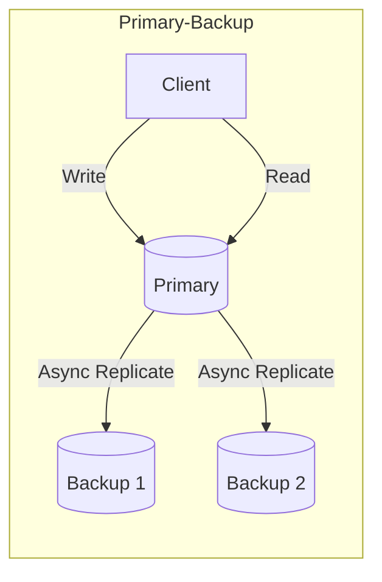
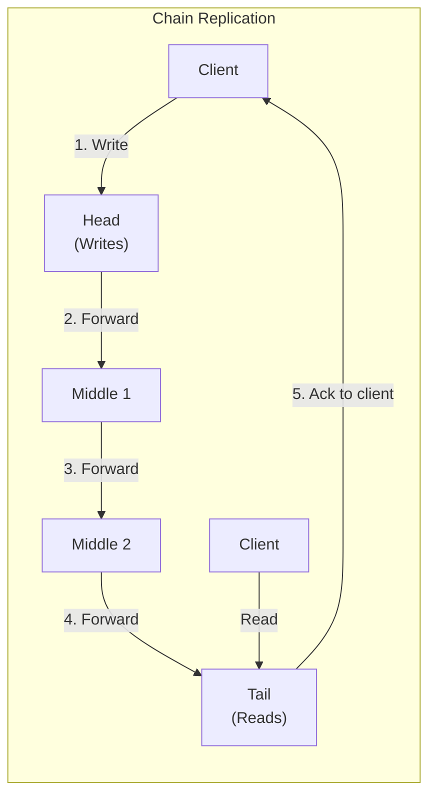
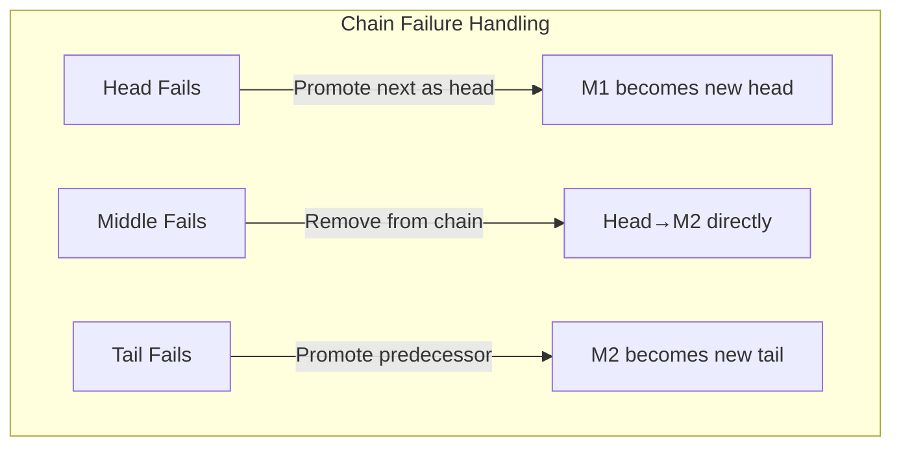
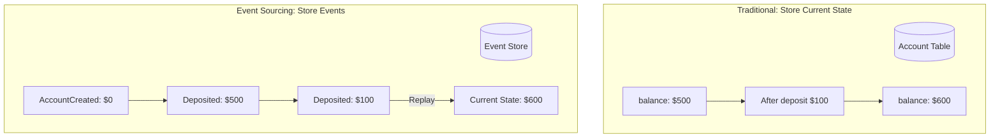
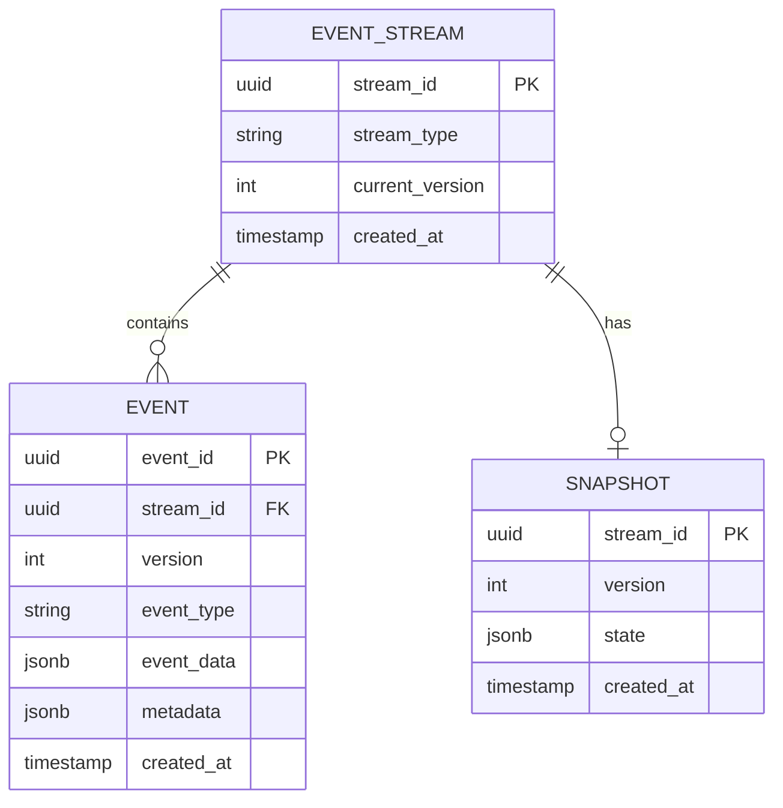
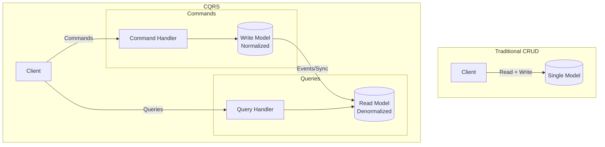
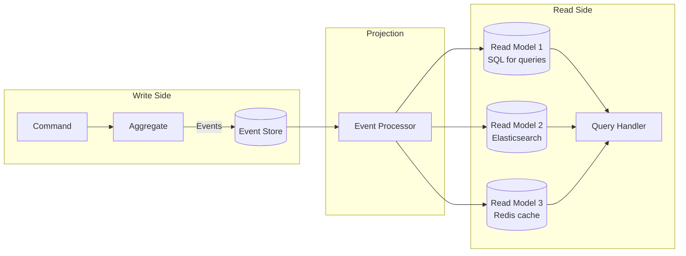
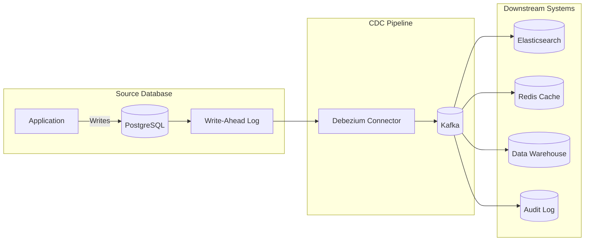

# 06 — Replication and Data Patterns

> "How data is replicated, partitioned, and synchronized across distributed systems."

**Prerequisites:** [01 — Foundational Concepts](./01_FOUNDATIONAL_CONCEPTS.md), [02 — Communication Patterns](./02_COMMUNICATION_PATTERNS.md), [03 — Consistency & Transactions](./03_CONSISTENCY_AND_TRANSACTIONS.md), [04 — Data Storage & Access](./04_DATA_STORAGE_AND_ACCESS.md), [05 — Caching & Content Delivery](./05_CACHING_AND_CONTENT_DELIVERY.md)
**Deep Dives:** [DD_SHARDING_PARTITIONING](./DD_SHARDING_PARTITIONING.md), [DD_DYNAMO_ARCHITECTURE](./DD_DYNAMO_ARCHITECTURE.md)
**Estimated study time:** 3-4 hours

---

## Chapter Overview

This module covers the core patterns for managing data across distributed systems: replication for durability and availability, event sourcing for audit and temporal queries, CQRS for read/write optimization, and Change Data Capture for cross-system synchronization. These patterns form the foundation for building reliable, scalable data systems.

---

## 1. Replication Patterns

### Pattern Overview

Replication ensures data durability and availability by maintaining copies across multiple nodes.

> **Deep Dive:** For comprehensive coverage of Dynamo-style replication (sloppy quorums, hinted handoff, Merkle trees), see [DD_DYNAMO_ARCHITECTURE.md](./DD_DYNAMO_ARCHITECTURE.md).

### Primary-Backup Replication



**Properties:**
- All writes go to primary
- Reads can go to primary or backups (with staleness trade-off)
- On primary failure, promote backup

**Trade-offs:**

| Aspect | Synchronous | Asynchronous |
|--------|-------------|--------------|
| **Durability** | No data loss on failover | May lose recent writes |
| **Latency** | Higher (wait for backup ack) | Lower (fire and forget) |
| **Availability** | Lower (backup failure blocks writes) | Higher |

### Chain Replication

**Concept:** Replicate writes sequentially through a chain of nodes. Reads served from the tail.



**How It Works:**
1. **Writes:** Client sends to head; head forwards down the chain
2. **Reads:** Client reads from tail (guaranteed to see all committed writes)
3. **Acks:** Tail sends acknowledgment once write reaches it
4. **Failure:** Chain master reconfigures chain (removes failed node)

**Chain Replication Properties:**

| Property | Value | Comparison to Primary-Backup |
|----------|-------|------------------------------|
| **Strong consistency** | Yes | Same |
| **Read throughput** | High (tail only) | Higher (reads don't hit primary) |
| **Write latency** | Chain length x per-hop latency | Higher |
| **Failure recovery** | Remove and rejoin | Similar complexity |
| **Read load distribution** | All on tail | Better (can use replicas) |

**Failure Scenarios:**



**When to Use Chain Replication:**

| Use Chain Replication | Use Primary-Backup |
|----------------------|-------------------|
| Strong consistency required | Eventual consistency OK |
| Read-heavy workload | Balanced read/write |
| Want to offload primary reads | Simple architecture preferred |
| Can tolerate higher write latency | Low write latency critical |

**Production Implementations:**
- **FAWN-KV:** Facebook's flash storage system
- **CORFU:** Log-structured shared storage
- **Hibari:** Key-value store
- **Microsoft Azure Storage:** Uses chain replication internally

**CRDT Alternative:**
For conflict-free eventual consistency without coordination, see Conflict-free Replicated Data Types (CRDTs), which converge automatically without a chain.

---

## 2. Event Sourcing

> **Reference:** Fowler, M. (2005). "Event Sourcing." martinfowler.com. Also: Young, G. (2010). "CQRS Documents."

### Traditional State vs Event Sourcing



### Event Store Structure



### Implementation

```python
from dataclasses import dataclass, field
from datetime import datetime
from typing import List, Optional, Type, Dict, Any
from abc import ABC, abstractmethod
import json
import uuid

# Base Event
@dataclass
class DomainEvent(ABC):
    event_id: str = field(default_factory=lambda: str(uuid.uuid4()))
    timestamp: datetime = field(default_factory=datetime.utcnow)
    version: int = 0

    @property
    @abstractmethod
    def event_type(self) -> str:
        pass

# Concrete Events
@dataclass
class AccountCreated(DomainEvent):
    account_id: str = ""
    owner_name: str = ""

    @property
    def event_type(self) -> str:
        return "AccountCreated"

@dataclass
class MoneyDeposited(DomainEvent):
    account_id: str = ""
    amount: float = 0.0

    @property
    def event_type(self) -> str:
        return "MoneyDeposited"

@dataclass
class MoneyWithdrawn(DomainEvent):
    account_id: str = ""
    amount: float = 0.0

    @property
    def event_type(self) -> str:
        return "MoneyWithdrawn"

# Aggregate
class BankAccount:
    def __init__(self, account_id: str):
        self.account_id = account_id
        self.owner_name = ""
        self.balance = 0.0
        self.version = 0
        self._pending_events: List[DomainEvent] = []

    # Command handlers (generate events)
    def create(self, owner_name: str):
        event = AccountCreated(
            account_id=self.account_id,
            owner_name=owner_name
        )
        self._apply_event(event)
        self._pending_events.append(event)

    def deposit(self, amount: float):
        if amount <= 0:
            raise ValueError("Amount must be positive")

        event = MoneyDeposited(
            account_id=self.account_id,
            amount=amount
        )
        self._apply_event(event)
        self._pending_events.append(event)

    def withdraw(self, amount: float):
        if amount <= 0:
            raise ValueError("Amount must be positive")
        if amount > self.balance:
            raise ValueError("Insufficient funds")

        event = MoneyWithdrawn(
            account_id=self.account_id,
            amount=amount
        )
        self._apply_event(event)
        self._pending_events.append(event)

    # Event handlers (apply state changes)
    def _apply_event(self, event: DomainEvent):
        if isinstance(event, AccountCreated):
            self.owner_name = event.owner_name
            self.balance = 0.0
        elif isinstance(event, MoneyDeposited):
            self.balance += event.amount
        elif isinstance(event, MoneyWithdrawn):
            self.balance -= event.amount

        self.version += 1
        event.version = self.version

    # Reconstitute from events
    @classmethod
    def load_from_events(cls, account_id: str, events: List[DomainEvent]) -> 'BankAccount':
        account = cls(account_id)
        for event in events:
            account._apply_event(event)
        return account

    def get_pending_events(self) -> List[DomainEvent]:
        return self._pending_events.copy()

    def clear_pending_events(self):
        self._pending_events.clear()

# Event Store
class EventStore:
    def __init__(self):
        self._streams: Dict[str, List[DomainEvent]] = {}

    def append_events(
        self,
        stream_id: str,
        events: List[DomainEvent],
        expected_version: int
    ):
        """Append events with optimistic concurrency."""
        stream = self._streams.get(stream_id, [])

        current_version = len(stream)
        if current_version != expected_version:
            raise ConcurrencyError(
                f"Expected version {expected_version}, "
                f"but stream is at {current_version}"
            )

        self._streams[stream_id] = stream + events

    def get_events(
        self,
        stream_id: str,
        from_version: int = 0
    ) -> List[DomainEvent]:
        """Get events from a stream."""
        stream = self._streams.get(stream_id, [])
        return stream[from_version:]

class ConcurrencyError(Exception):
    pass
```

### Event Sourcing Trade-offs

| Benefit | Challenge |
|---------|-----------|
| Complete audit trail | Storage grows indefinitely |
| Temporal queries ("state at time X") | Query complexity |
| Event replay for debugging | Schema evolution |
| Natural fit for event-driven systems | Learning curve |
| Easy to add new projections | Eventually consistent reads |

---

## 3. CQRS (Command Query Responsibility Segregation)

### Concept

Separate read and write models for different optimization strategies.



### CQRS with Event Sourcing



### Implementation

```python
from abc import ABC, abstractmethod
from dataclasses import dataclass
from typing import List, Dict, Any, Optional

# Commands (Write Side)
@dataclass
class Command(ABC):
    pass

@dataclass
class CreateOrder(Command):
    order_id: str
    customer_id: str
    items: List[Dict[str, Any]]

@dataclass
class AddItemToOrder(Command):
    order_id: str
    product_id: str
    quantity: int
    price: float

# Command Handler
class OrderCommandHandler:
    def __init__(self, event_store: 'EventStore', event_publisher: 'EventPublisher'):
        self.event_store = event_store
        self.event_publisher = event_publisher

    def handle(self, command: Command):
        if isinstance(command, CreateOrder):
            return self._handle_create_order(command)
        elif isinstance(command, AddItemToOrder):
            return self._handle_add_item(command)

    def _handle_create_order(self, cmd: CreateOrder):
        # Load aggregate
        order = Order(cmd.order_id)
        order.create(cmd.customer_id, cmd.items)

        # Persist events
        events = order.get_pending_events()
        self.event_store.append_events(
            stream_id=f"order-{cmd.order_id}",
            events=events,
            expected_version=0
        )

        # Publish events for projections
        for event in events:
            self.event_publisher.publish(event)

# Read Models (Query Side)
@dataclass
class OrderSummaryView:
    """Denormalized read model for order listing."""
    order_id: str
    customer_id: str
    customer_name: str  # Denormalized from customer service
    item_count: int
    total_amount: float
    status: str
    created_at: datetime

class OrderReadModelProjection:
    """Projects events into read model."""

    def __init__(self, read_db: 'ReadDatabase'):
        self.read_db = read_db

    def handle_event(self, event: DomainEvent):
        if isinstance(event, OrderCreated):
            self._on_order_created(event)
        elif isinstance(event, ItemAdded):
            self._on_item_added(event)
        elif isinstance(event, OrderShipped):
            self._on_order_shipped(event)

    def _on_order_created(self, event: 'OrderCreated'):
        # Create denormalized view
        self.read_db.upsert('order_summaries', {
            'order_id': event.order_id,
            'customer_id': event.customer_id,
            'item_count': 0,
            'total_amount': 0.0,
            'status': 'created',
            'created_at': event.timestamp
        })

    def _on_item_added(self, event: 'ItemAdded'):
        # Update aggregated values
        self.read_db.increment(
            'order_summaries',
            {'order_id': event.order_id},
            {'item_count': 1, 'total_amount': event.price * event.quantity}
        )

# Query Handler
class OrderQueryHandler:
    def __init__(self, read_db: 'ReadDatabase'):
        self.read_db = read_db

    def get_order_summary(self, order_id: str) -> Optional[OrderSummaryView]:
        return self.read_db.find_one('order_summaries', {'order_id': order_id})

    def get_customer_orders(
        self,
        customer_id: str,
        limit: int = 10,
        offset: int = 0
    ) -> List[OrderSummaryView]:
        return self.read_db.find(
            'order_summaries',
            {'customer_id': customer_id},
            sort=[('created_at', -1)],
            limit=limit,
            offset=offset
        )

    def search_orders(self, query: str) -> List[OrderSummaryView]:
        # Could use Elasticsearch for full-text search
        pass
```

---

## 4. Change Data Capture (CDC)

### Pattern Overview

Capture changes from database transaction log and propagate to other systems.



### CDC Event Format

```json
{
  "before": {
    "id": 1001,
    "name": "John Doe",
    "email": "john@old.com",
    "balance": 500.00
  },
  "after": {
    "id": 1001,
    "name": "John Doe",
    "email": "john@new.com",
    "balance": 500.00
  },
  "source": {
    "version": "1.9.0",
    "connector": "postgresql",
    "name": "dbserver1",
    "ts_ms": 1640000000000,
    "db": "inventory",
    "schema": "public",
    "table": "customers"
  },
  "op": "u",
  "ts_ms": 1640000000100
}
```

| Operation (`op`) | Meaning |
|------------------|---------|
| `c` | Create (INSERT) |
| `u` | Update |
| `d` | Delete |
| `r` | Read (initial snapshot) |

### Use Cases

| Use Case | Description |
|----------|-------------|
| **Cache Invalidation** | Automatically update/invalidate cache on DB change |
| **Search Index Sync** | Keep Elasticsearch in sync with database |
| **Data Warehousing** | Stream changes to analytics systems |
| **Audit Logging** | Capture all changes for compliance |
| **Event Generation** | Convert DB changes to domain events |
| **Cross-Service Sync** | Replicate data to other microservices |

---

## Connections to Other Concepts

| Related Topic | Connection |
|---------------|------------|
| [DD_SHARDING_PARTITIONING](./DD_SHARDING_PARTITIONING.md) | Data partitioning strategies for horizontal scaling |
| [DD_DYNAMO_ARCHITECTURE](./DD_DYNAMO_ARCHITECTURE.md) | Sloppy quorums, hinted handoff, and Merkle trees for replication |
| [Consistency & Transactions](./03_CONSISTENCY_AND_TRANSACTIONS.md) | Consistency trade-offs in replication |
| [Data Storage & Access](./04_DATA_STORAGE_AND_ACCESS.md) | Storage engines and data models |
| [Communication Patterns](./02_COMMUNICATION_PATTERNS.md) | Event-driven messaging for CDC and event sourcing |

---

## Revision History

| Date | Change |
|------|--------|
| 2025-01 | Initial extraction as standalone replication and data patterns module |

---

## Navigation

**Previous:** [05 — Caching & Content Delivery](./05_CACHING_AND_CONTENT_DELIVERY.md)
**Next:** [07 — Distributed Coordination](./07_DISTRIBUTED_COORDINATION.md)
**Index:** [README](./README.md)
