# 07 — Distributed Coordination

> How distributed systems achieve agreement and mutual exclusion.

**Prerequisites:** [01 — Foundational Concepts](./01_FOUNDATIONAL_CONCEPTS.md), [02 — Communication Patterns](./02_COMMUNICATION_PATTERNS.md), [03 — Consistency & Transactions](./03_CONSISTENCY_AND_TRANSACTIONS.md)
**Builds toward:** [08 — Resilience Patterns](./08_RESILIENCE_PATTERNS.md), [09 — Scaling & Infrastructure](./09_SCALING_AND_INFRASTRUCTURE.md)
**Estimated study time:** 2-3 hours

---

## Chapter Overview

This module presents production-grade patterns for coordination in distributed systems. These patterns address the fundamental challenges of mutual exclusion and distributed transactions that emerge when systems span multiple nodes.

---

## 1. Distributed Locking

> **References:**
> - Lamport, L. (1978). "Time, Clocks, and the Ordering of Events in a Distributed System." Communications of the ACM.
> - Martin Kleppmann's analysis (2016). "How to do distributed locking." (critique of Redlock algorithm)

### The Problem

Multiple processes across different nodes need mutually exclusive access to a shared resource.

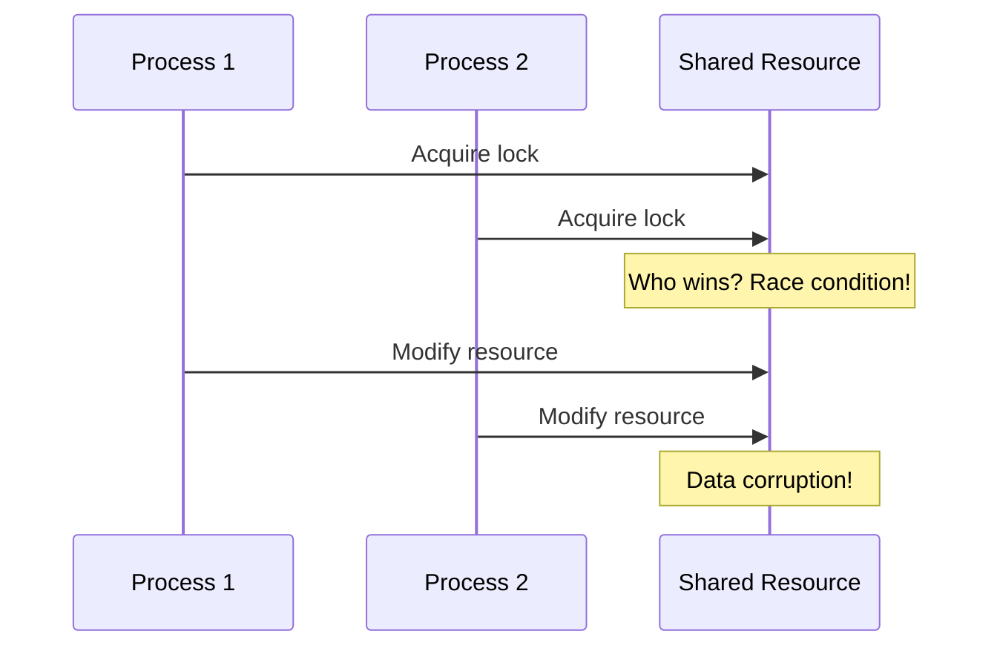

### Solution: Distributed Lock Manager

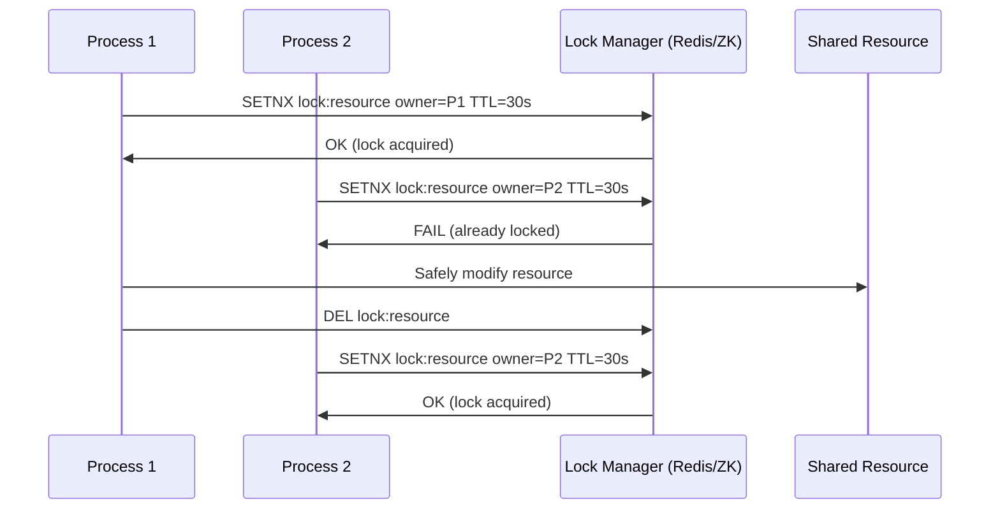

### Implementation Patterns

#### Redis-Based Lock (Redlock)

```python
import redis
import uuid
import time

class DistributedLock:
    def __init__(self, redis_client, lock_name, ttl_ms=30000):
        self.redis = redis_client
        self.lock_name = f"lock:{lock_name}"
        self.ttl_ms = ttl_ms
        self.token = str(uuid.uuid4())

    def acquire(self, retry_count=3, retry_delay_ms=100):
        """Attempt to acquire the lock with retries."""
        for attempt in range(retry_count):
            # SET NX with TTL (atomic operation)
            if self.redis.set(
                self.lock_name,
                self.token,
                nx=True,  # Only set if not exists
                px=self.ttl_ms  # TTL in milliseconds
            ):
                return True
            time.sleep(retry_delay_ms / 1000)
        return False

    def release(self):
        """Release lock only if we own it (compare-and-delete)."""
        # Lua script ensures atomic check-and-delete
        lua_script = """
        if redis.call("get", KEYS[1]) == ARGV[1] then
            return redis.call("del", KEYS[1])
        else
            return 0
        end
        """
        return self.redis.eval(lua_script, 1, self.lock_name, self.token)

    def extend(self, additional_ms):
        """Extend TTL if we still own the lock."""
        lua_script = """
        if redis.call("get", KEYS[1]) == ARGV[1] then
            return redis.call("pexpire", KEYS[1], ARGV[2])
        else
            return 0
        end
        """
        return self.redis.eval(
            lua_script, 1, self.lock_name,
            self.token, self.ttl_ms + additional_ms
        )
```

#### ZooKeeper-Based Lock (Sequential Ephemeral Nodes)

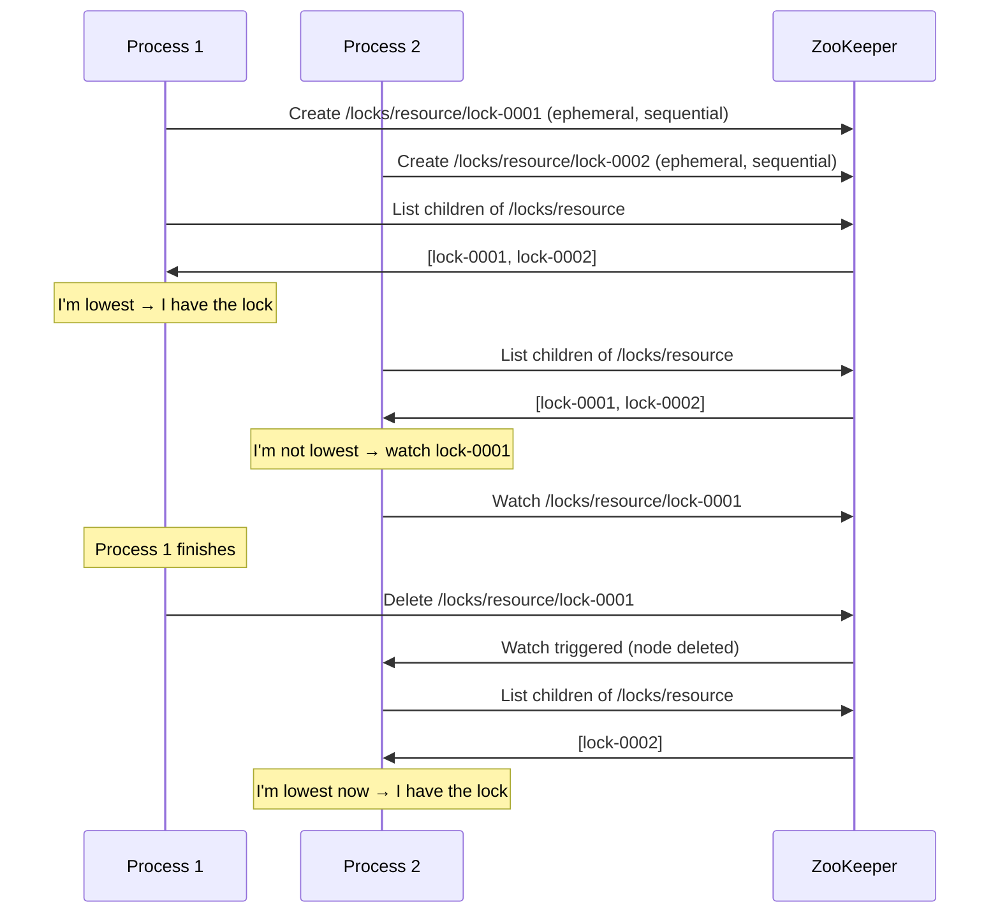

### Lock Safety Considerations

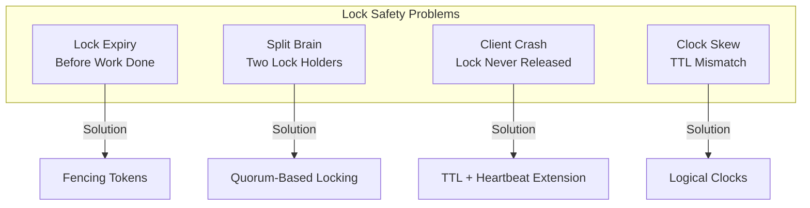

#### Fencing Tokens Pattern

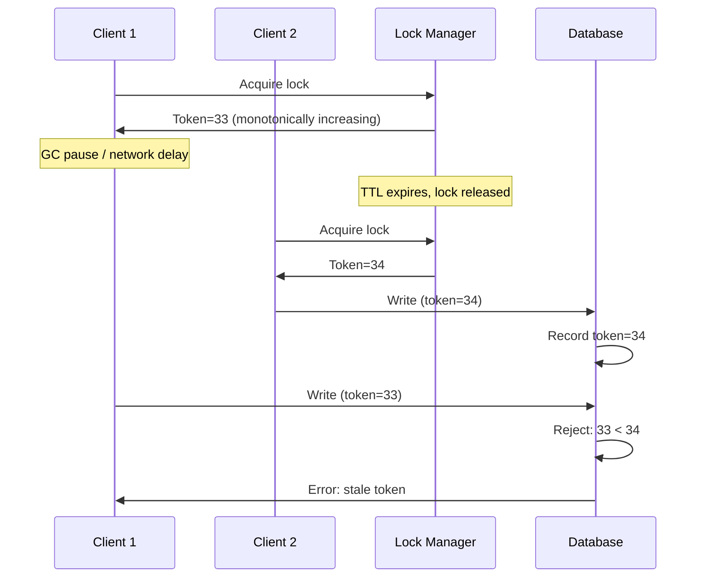

### Complexity Analysis: Distributed Locks

| Operation | Redis Single | Redlock (N nodes) | ZooKeeper |
|-----------|--------------|-------------------|-----------|
| **Acquire** | O(1), 1 RTT | O(N), N RTTs | O(1), 2 RTTs |
| **Release** | O(1), 1 RTT | O(N), N RTTs | O(1), 1 RTT |
| **Failure Detection** | TTL expiry | TTL expiry | Session timeout |
| **Network Calls** | 1 | N (quorum) | 2-3 (leader) |

### Trade-Off Analysis

| Approach | Consistency | Availability | Complexity | Use Case |
|----------|-------------|--------------|------------|----------|
| **Redis Single** | Weak | High | Low | Non-critical mutual exclusion |
| **Redlock (Multi)** | Moderate | Moderate | Medium | Important but not life-critical |
| **ZooKeeper** | Strong | Moderate | High | Critical coordination |
| **etcd** | Strong | Moderate | Medium | Kubernetes-native apps |
| **Database** | Strong | Lower | Low | Already have RDBMS |

---

## 2. Distributed Transactions

> **References:**
> - Gray, J. (1978). "Notes on Database Operating Systems." Operating Systems: An Advanced Course.
> - Garcia-Molina, H. & Salem, K. (1987). "Sagas." ACM SIGMOD.
> - Mohan, C. et al. (1986). "Transaction Management in the R* Distributed Database System." ACM TODS.

### The Two Generals Problem

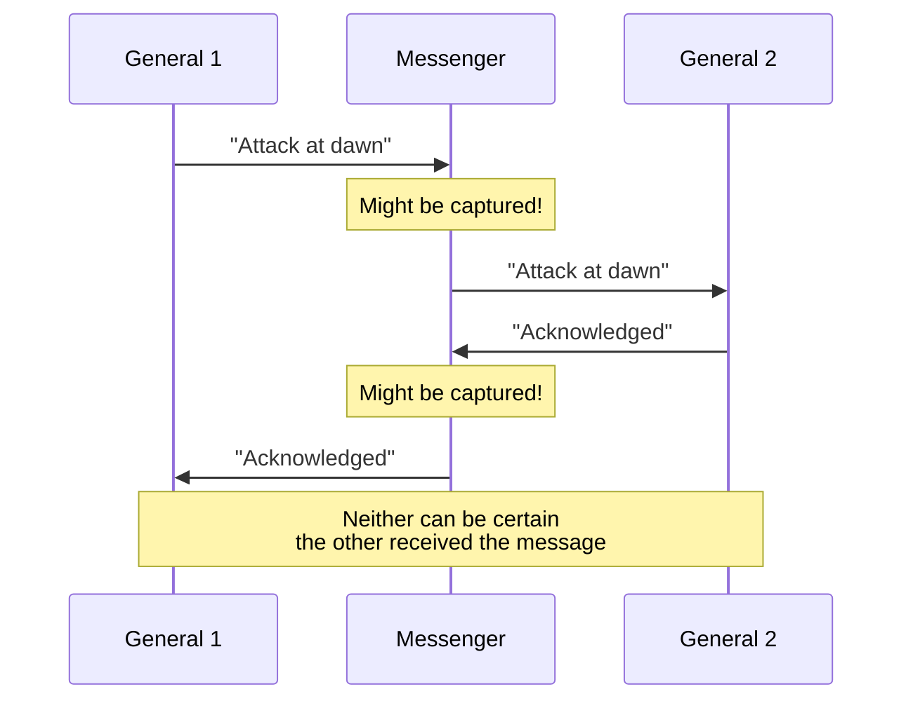

**Implication:** Perfect consensus in unreliable networks is impossible. We accept trade-offs.

### Two-Phase Commit (2PC)

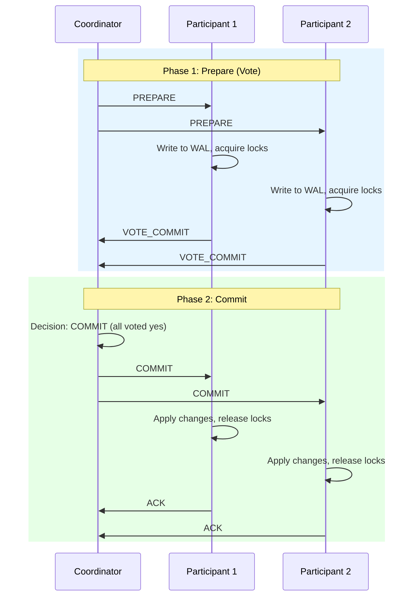

#### 2PC Failure Scenarios

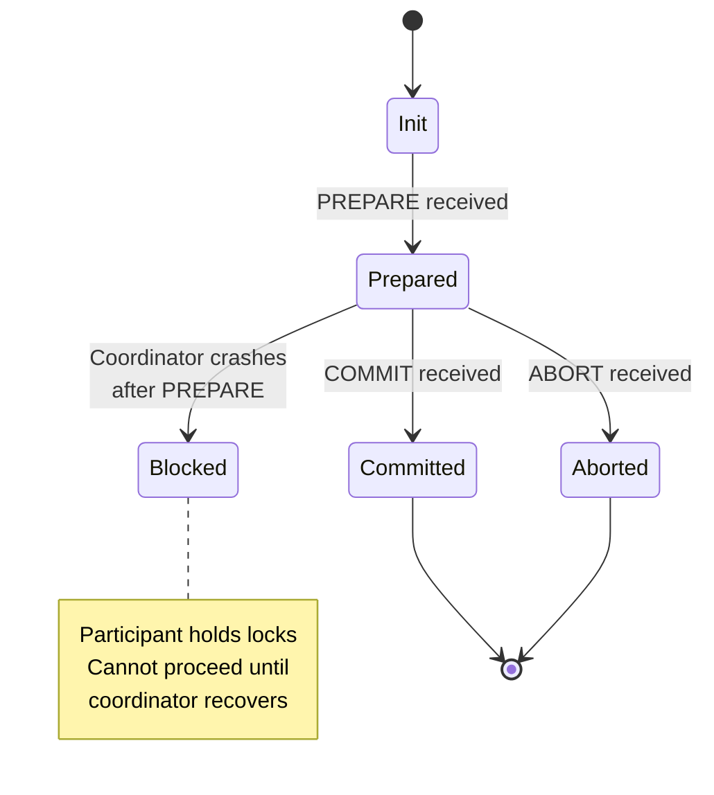

| Failure | State | Resolution |
|---------|-------|------------|
| Participant fails before PREPARE | Init | Coordinator aborts |
| Participant fails after VOTE | Prepared | Recovery from WAL |
| Coordinator fails before decision | Prepared | **BLOCKED** until recovery |
| Coordinator fails after decision | Committed/Aborted | Participants query coordinator |

### Transaction Protocol Complexity

| Protocol | Message Complexity | Time Complexity | Blocking | Partition Tolerance |
|----------|-------------------|-----------------|----------|---------------------|
| **2PC** | O(3n) | O(2 RTT) | Yes (coordinator crash) | No |
| **3PC** | O(4n) | O(3 RTT) | Reduced | No |
| **Saga** | O(2n) | O(n steps) | No | Yes |
| **Paxos Commit** | O(n²) | O(2 RTT) | No | Yes |

Where n = number of participants.

### Three-Phase Commit (3PC)

Adds a `PRE_COMMIT` phase to reduce blocking, but still not partition-tolerant.

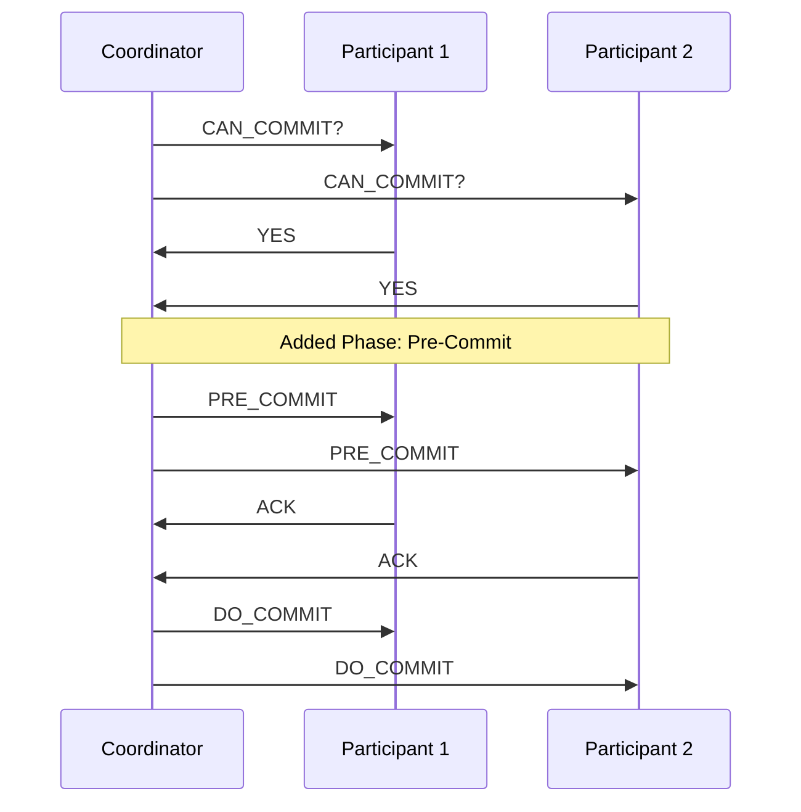

**Key Insight:** If participant times out after PRE_COMMIT, it can safely commit (knows others were ready).

### Saga Pattern (Preferred for Microservices)

Long-lived transactions as a sequence of local transactions with compensating actions.

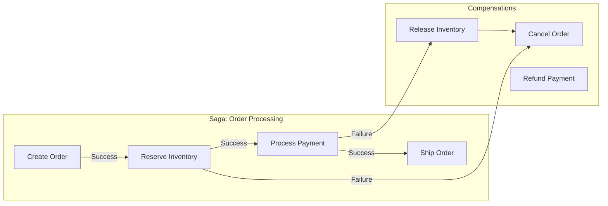

#### Choreography vs Orchestration

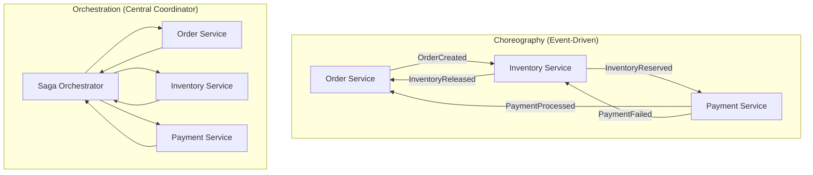

| Aspect | Choreography | Orchestration |
|--------|--------------|---------------|
| **Coupling** | Loose (event-based) | Central coordinator |
| **Visibility** | Hard to track flow | Clear execution path |
| **Complexity** | Distributed logic | Centralized logic |
| **Failure handling** | Each service handles | Orchestrator handles |
| **Best for** | Simple sagas | Complex business logic |

#### Saga Implementation Example

```python
from enum import Enum
from dataclasses import dataclass
from typing import List, Callable, Optional

class SagaStatus(Enum):
    PENDING = "pending"
    RUNNING = "running"
    COMPLETED = "completed"
    COMPENSATING = "compensating"
    FAILED = "failed"

@dataclass
class SagaStep:
    name: str
    action: Callable
    compensation: Callable
    status: str = "pending"

class SagaOrchestrator:
    def __init__(self, saga_id: str, steps: List[SagaStep]):
        self.saga_id = saga_id
        self.steps = steps
        self.current_step = 0
        self.status = SagaStatus.PENDING
        self.completed_steps: List[SagaStep] = []

    async def execute(self, context: dict) -> bool:
        """Execute saga steps forward."""
        self.status = SagaStatus.RUNNING

        for i, step in enumerate(self.steps):
            self.current_step = i
            try:
                # Execute the step
                await step.action(context)
                step.status = "completed"
                self.completed_steps.append(step)

                # Persist saga state (for recovery)
                await self._persist_state()

            except Exception as e:
                step.status = "failed"
                await self._compensate(context, str(e))
                return False

        self.status = SagaStatus.COMPLETED
        return True

    async def _compensate(self, context: dict, error: str):
        """Execute compensation in reverse order."""
        self.status = SagaStatus.COMPENSATING

        # Compensate in reverse order
        for step in reversed(self.completed_steps):
            try:
                await step.compensation(context)
                step.status = "compensated"
            except Exception as comp_error:
                # Log and continue - compensation must be best-effort
                step.status = "compensation_failed"

        self.status = SagaStatus.FAILED

    async def _persist_state(self):
        """Persist saga state for crash recovery."""
        # Store to database: saga_id, current_step, completed_steps, status
        pass
```

---

## Chapter Summary

### Quick Reference Card

```
┌─────────────────────────────────────────────────────────────────┐
│           DISTRIBUTED COORDINATION CHEAT SHEET                  │
├─────────────────────────────────────────────────────────────────┤
│ DISTRIBUTED LOCKING:                                            │
│   • Redis SETNX + TTL: Simple, fast, weak consistency          │
│   • ZK ephemeral nodes: Strong consistency, higher latency      │
│   • Fencing Token: Monotonic counter prevents stale operations │
│   • Redlock: Multi-node Redis for improved safety              │
├─────────────────────────────────────────────────────────────────┤
│ DISTRIBUTED TRANSACTIONS:                                       │
│   • 2PC: Prepare→Commit (blocking, strong consistency)         │
│   • 3PC: Adds PRE_COMMIT phase to reduce blocking              │
│   • Saga: Local TXNs + compensations (non-blocking, eventual)  │
│   • Choreography: Event-driven, loosely coupled                │
│   • Orchestration: Central coordinator, clear visibility       │
├─────────────────────────────────────────────────────────────────┤
│ DECISION GUIDE:                                                 │
│   • Non-critical mutex        → Redis Single                   │
│   • Important coordination    → Redlock or ZooKeeper           │
│   • Microservice transactions → Saga Pattern                   │
│   • Strong consistency needed → 2PC (if acceptable blocking)   │
├─────────────────────────────────────────────────────────────────┤
│ INTERVIEW TIPS:                                                 │
│   1. Always mention trade-offs (consistency vs availability)   │
│   2. Discuss failure scenarios and recovery                    │
│   3. Explain why Saga is preferred for microservices           │
│   4. Know the Two Generals Problem implication                 │
└─────────────────────────────────────────────────────────────────┘
```

### Interview Articulation Patterns

> "When would you use 2PC vs Saga?"

"2PC provides strong consistency but blocks during failures—it's suitable when you need atomic commits across a small number of participants, like in a single datacenter. Saga trades consistency for availability by using compensating transactions; it's better for microservices where blocking is unacceptable and you can tolerate brief inconsistency."

> "How do you handle distributed locking safely?"

"I'd use Redis with SETNX + TTL for simplicity, but always include a unique token for safe release. For critical operations, I'd add fencing tokens so the resource can reject stale lock holders. If strong consistency is required, ZooKeeper's sequential ephemeral nodes provide better guarantees at the cost of higher latency."

---

## Practice Questions

1. Design a distributed lock service that handles network partitions gracefully. What guarantees can you provide?

2. A saga orchestrator crashes mid-transaction. How do you ensure the system recovers to a consistent state?

3. Compare the trade-offs between choreography and orchestration for a 5-step saga involving payment, inventory, and shipping services.

4. Why can't the Two Generals Problem be solved? How does this affect distributed transaction design?

---

## Revision History

| Date | Change |
|------|--------|
| 2025-01 | Extracted from 06_REPLICATION_AND_PARTITIONING.md (Part I: Coordination Patterns) |

---

## Navigation

**Previous:** [06 — Replication & Partitioning](./06_REPLICATION_AND_PARTITIONING.md)
**Next:** [08 — Resilience Patterns](./08_RESILIENCE_PATTERNS.md)
**Index:** [README](./README.md)
