# 07 — Scaling and Infrastructure

> From single server to global scale: the architectural decisions, trade-offs, and operational patterns that enable systems to grow.

**Prerequisites:** [01 — Foundational Concepts](./01_FOUNDATIONAL_CONCEPTS.md), [04 — Caching & Content Delivery](./04_CACHING_AND_CONTENT_DELIVERY.md), [06 — Distributed System Patterns](./06_DISTRIBUTED_SYSTEM_PATTERNS.md)
**Builds toward:** [08 — Workload Optimization](./08_WORKLOAD_OPTIMIZATION.md), [09 — Quick Reference](./09_QUICK_REFERENCE.md)  
**Estimated study time:** 4-5 hours

---

## Chapter Overview

This module covers the full spectrum of scaling and infrastructure decisions: how to grow capacity, distribute load, manage traffic, and operate systems reliably at scale. Every section encodes concrete design decisions and system invariants relevant to senior-level interviews.

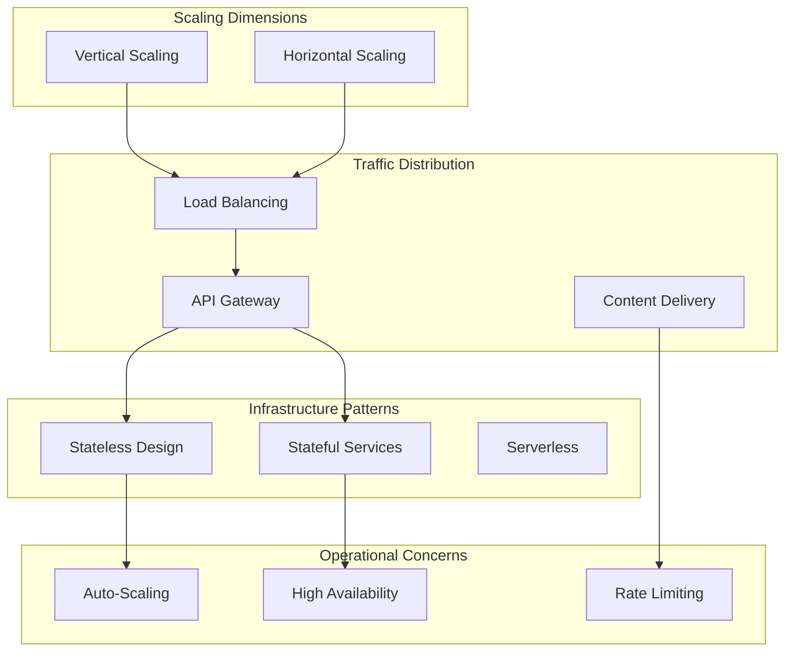
```mermaid
graph TD
    subgraph "Scaling Dimensions"
        V[Vertical Scaling]
        H[Horizontal Scaling]
    end
    
    subgraph "Traffic Distribution"
        LB[Load Balancing]
        AG[API Gateway]
        CDN[Content Delivery]
    end
    
    subgraph "Infrastructure Patterns"
        SL[Stateless Design]
        SF[Stateful Services]
        SV[Serverless]
    end
    
    subgraph "Operational Concerns"
        AS[Auto-Scaling]
        RL[Rate Limiting]
        HA[High Availability]
    end
    
    V --> LB
    H --> LB
    LB --> AG
    AG --> SL
    AG --> SF
    SL --> AS
    SF --> HA
    CDN --> RL
```

---

## 1. Scaling Fundamentals

### The Two Dimensions of Scaling

Every scaling decision begins with a fundamental choice: make existing resources bigger, or add more resources.

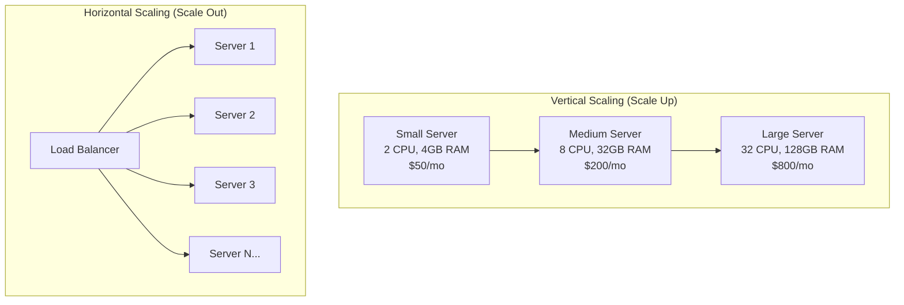
```mermaid
graph TD
    subgraph "Vertical Scaling (Scale Up)"
        V1["Small Server<br/>2 CPU, 4GB RAM<br/>$50/mo"]
        V2["Medium Server<br/>8 CPU, 32GB RAM<br/>$200/mo"]
        V3["Large Server<br/>32 CPU, 128GB RAM<br/>$800/mo"]
        V1 --> V2 --> V3
    end
    
    subgraph "Horizontal Scaling (Scale Out)"
        LB[Load Balancer]
        S1[Server 1]
        S2[Server 2]
        S3[Server 3]
        S4[Server N...]
        LB --> S1
        LB --> S2
        LB --> S3
        LB --> S4
    end
```

### Vertical vs. Horizontal: Decision Matrix

| Factor | Vertical Scaling | Horizontal Scaling |
|--------|------------------|-------------------|
| **Implementation** | Simple (upgrade hardware) | Complex (distributed systems) |
| **Ceiling** | Hardware limits exist | Near-infinite |
| **Failure mode** | Single point of failure | Fault tolerant |
| **Cost curve** | Exponential at high end | Linear |
| **State handling** | Trivial (single machine) | Requires externalization |
| **Downtime** | Usually required for upgrade | Zero-downtime possible |

### Scaling Decision Framework

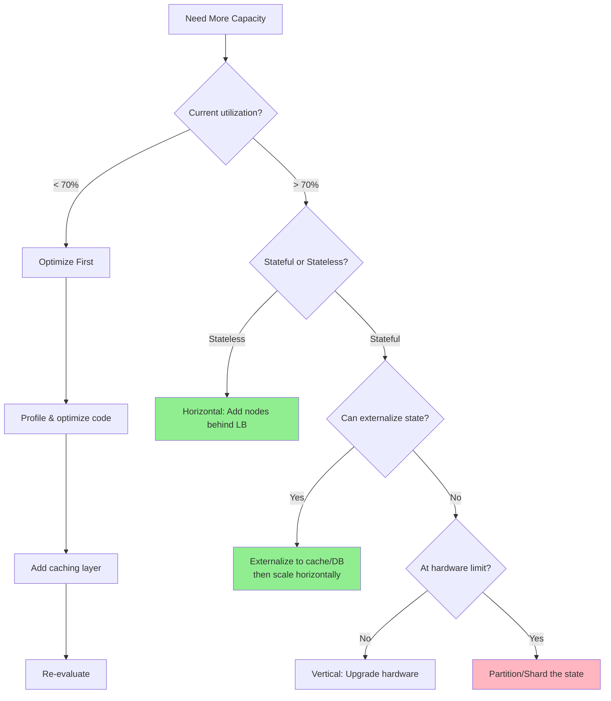
```mermaid
flowchart TD
    A[Need More Capacity] --> B{Current utilization?}
    B -->|"< 70%"| C[Optimize First]
    B -->|"> 70%"| D{Stateful or Stateless?}
    
    D -->|Stateless| E[Horizontal: Add nodes behind LB]
    D -->|Stateful| F{Can externalize state?}
    
    F -->|Yes| G[Externalize to cache/DB<br/>then scale horizontally]
    F -->|No| H{At hardware limit?}
    
    H -->|No| I[Vertical: Upgrade hardware]
    H -->|Yes| J[Partition/Shard the state]
    
    C --> K[Profile & optimize code]
    K --> L[Add caching layer]
    L --> M[Re-evaluate]
    
    style E fill:#90EE90
    style G fill:#90EE90
    style J fill:#FFB6C1
```

### When to Scale Vertically

**Choose vertical scaling when:**
- Development speed matters more than fault tolerance
- State is difficult to distribute (complex in-memory data structures)
- Workload is predictable and bounded
- Team lacks distributed systems expertise
- Single-threaded workloads (can't parallelize anyway)

**Example:** A single PostgreSQL instance can handle 50,000+ queries per second with proper indexing. Don't distribute prematurely.

### When to Scale Horizontally

**Choose horizontal scaling when:**
- Fault tolerance is critical (financial systems, healthcare)
- Growth is unbounded or unpredictable
- Workload is parallelizable (stateless request handling)
- Geographic distribution is needed
- Cost efficiency at scale matters

**Invariant:** Horizontal scaling requires stateless design or explicit state coordination. There is no middle ground.

---

## 2. Load Balancing

> **Reference:** Maglev (2016). "Maglev: A Fast and Reliable Software Network Load Balancer." NSDI.

### What Load Balancers Do

A load balancer distributes incoming traffic across multiple backend servers to:
- **Improve throughput:** Parallelize request handling across machines
- **Increase availability:** No single point of failure in the application tier
- **Enable scaling:** Add/remove servers without client changes
- **Reduce latency:** Route to fastest/nearest server

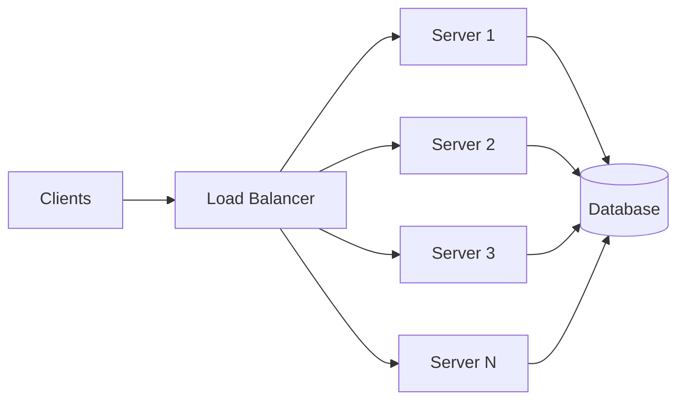
```mermaid
graph LR
    C[Clients] --> LB[Load Balancer]
    LB --> S1[Server 1]
    LB --> S2[Server 2]
    LB --> S3[Server 3]
    LB --> S4[Server N]
    
    S1 --> DB[(Database)]
    S2 --> DB
    S3 --> DB
    S4 --> DB
```

### Load Balancer Placement

Load balancers can be placed at multiple tiers:

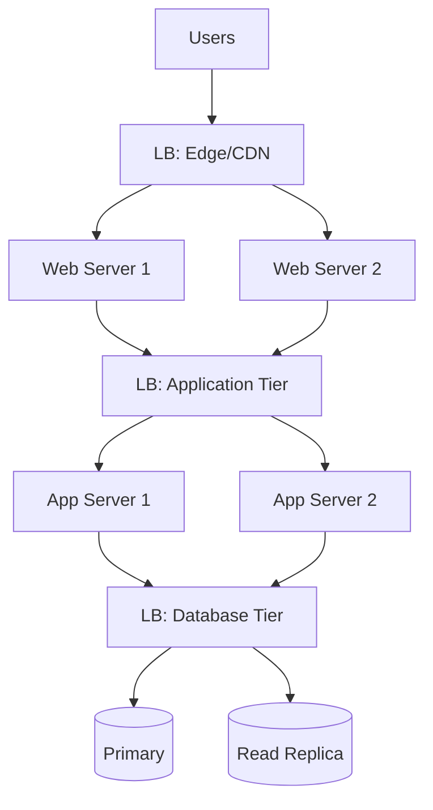
```mermaid
graph TD
    Users[Users] --> LB1[LB: Edge/CDN]
    LB1 --> Web1[Web Server 1]
    LB1 --> Web2[Web Server 2]
    
    Web1 --> LB2[LB: Application Tier]
    Web2 --> LB2
    
    LB2 --> App1[App Server 1]
    LB2 --> App2[App Server 2]
    
    App1 --> LB3[LB: Database Tier]
    App2 --> LB3
    
    LB3 --> DB1[(Primary)]
    LB3 --> DB2[(Read Replica)]
```

**Placement decisions:**
1. **Edge:** Between internet and web tier (SSL termination, DDoS protection)
2. **Application:** Between web and app tiers (service routing)
3. **Database:** Between app and data tiers (read/write splitting)

### Load Balancing Algorithms

| Algorithm | Mechanism | Best For | Limitations |
|-----------|-----------|----------|-------------|
| **Round Robin** | Sequential rotation (1→2→3→1) | Homogeneous servers, similar requests | Ignores server load |
| **Weighted Round Robin** | Proportional to server capacity | Heterogeneous servers | Manual weight tuning |
| **Least Connections** | Route to server with fewest active connections | Variable request duration | Doesn't consider capacity |
| **Weighted Least Connections** | `connections / weight` ratio | Variable duration + heterogeneous servers | More state to track |
| **IP Hash** | `hash(client_ip) % servers` | Session affinity needed | Uneven if IP distribution skewed |
| **Least Response Time** | Route to fastest responding server | Latency-critical applications | Requires response time tracking |
| **Random** | Random selection | Simple systems | Surprisingly effective at scale |

### Load Balancing Algorithm Complexity

| Algorithm | Time (per request) | Space | State Required |
|-----------|-------------------|-------|----------------|
| **Round Robin** | O(1) | O(1) | Counter |
| **Weighted Round Robin** | O(1) | O(n) | Counter + weights |
| **Least Connections** | O(n) or O(log n) with heap | O(n) | Connection counts |
| **IP Hash** | O(1) | O(1) | None |
| **Least Response Time** | O(n) | O(n) | Response times |
| **Consistent Hashing** | O(k log n) | O(n × k) | Hash ring with k virtual nodes |

### Algorithm Selection Flowchart

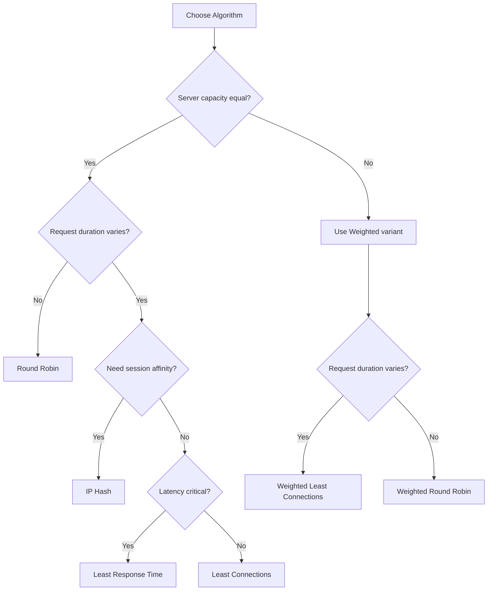
```mermaid
flowchart TD
    A[Choose Algorithm] --> B{Server capacity equal?}
    
    B -->|Yes| C{Request duration varies?}
    B -->|No| D[Use Weighted variant]
    
    C -->|No| E[Round Robin]
    C -->|Yes| F{Need session affinity?}
    
    F -->|Yes| G[IP Hash]
    F -->|No| H{Latency critical?}
    
    H -->|Yes| I[Least Response Time]
    H -->|No| J[Least Connections]
    
    D --> K{Request duration varies?}
    K -->|Yes| L[Weighted Least Connections]
    K -->|No| M[Weighted Round Robin]
```

### Layer 4 vs. Layer 7 Load Balancing

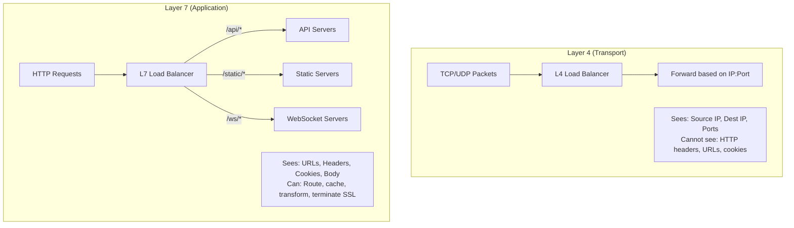
```mermaid
graph TD
    subgraph "Layer 4 (Transport)"
        L4_In[TCP/UDP Packets] --> L4_LB[L4 Load Balancer]
        L4_LB --> L4_Out[Forward based on IP:Port]
        L4_Note["Sees: Source IP, Dest IP, Ports<br/>Cannot see: HTTP headers, URLs, cookies"]
    end
    
    subgraph "Layer 7 (Application)"
        L7_In[HTTP Requests] --> L7_LB[L7 Load Balancer]
        L7_LB -->|"/api/*"| API[API Servers]
        L7_LB -->|"/static/*"| Static[Static Servers]
        L7_LB -->|"/ws/*"| WS[WebSocket Servers]
        L7_Note["Sees: URLs, Headers, Cookies, Body<br/>Can: Route, cache, transform, terminate SSL"]
    end
```

| Feature | Layer 4 | Layer 7 |
|---------|---------|---------|
| **Speed** | Faster (no parsing) | Slower (HTTP parsing) |
| **Routing decisions** | IP address, port | URL, headers, cookies, content |
| **SSL termination** | Pass-through only | Full termination support |
| **Caching** | No | Yes |
| **Health checks** | TCP connect | HTTP status codes |
| **Use case** | High throughput, non-HTTP | Content-aware routing |

### Load Balancer Types

| Type | Examples | Pros | Cons |
|------|----------|------|------|
| **Hardware** | F5, Citrix, A10 | Very high performance, enterprise support | Expensive, proprietary |
| **Software** | Nginx, HAProxy, Envoy | Flexible, cost-effective | Requires server management |
| **Cloud** | AWS ALB/NLB, GCP LB | Managed, auto-scaling, integrated | Vendor lock-in, cost |
| **DNS** | Route53, CloudFlare | Simple, geographic routing | Slow propagation, no health awareness |

### High Availability for Load Balancers

Load balancers themselves can become single points of failure.

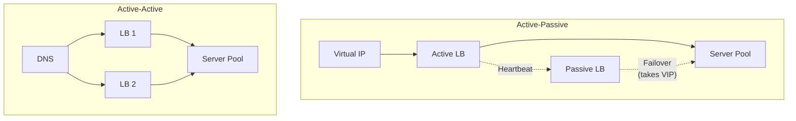
```mermaid
graph TD
    subgraph "Active-Passive"
        VIP1[Virtual IP] --> Active[Active LB]
        Active -.->|Heartbeat| Passive[Passive LB]
        Active --> Servers1[Server Pool]
        Passive -.->|"Failover<br/>(takes VIP)"| Servers1
    end
    
    subgraph "Active-Active"
        DNS[DNS] --> LB1[LB 1]
        DNS --> LB2[LB 2]
        LB1 --> Servers2[Server Pool]
        LB2 --> Servers2
    end
```

**Active-Passive:** Simpler, one LB handles all traffic until failure  
**Active-Active:** Better resource utilization, handles more traffic

---

## 3. Stateless vs. Stateful Services

### The Fundamental Distinction

**Stateless services** store no session data between requests. Any instance can handle any request.

**Stateful services** maintain session or connection state. Requests must route to the correct instance.

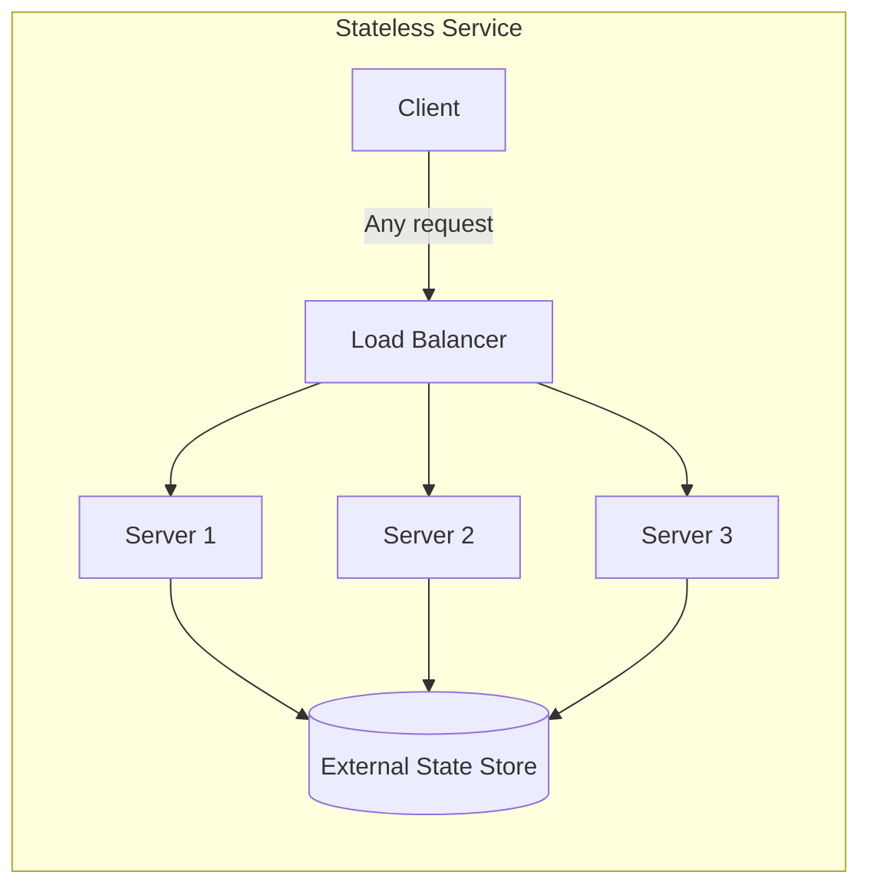
```mermaid
flowchart LR
    subgraph Stateless["Stateless Service"]
        Client1[Client] -->|"Any request"| LB1[Load Balancer]
        LB1 --> S1[Server 1]
        LB1 --> S2[Server 2]
        LB1 --> S3[Server 3]
        S1 --> Store[(External State Store)]
        S2 --> Store
        S3 --> Store
    end
```

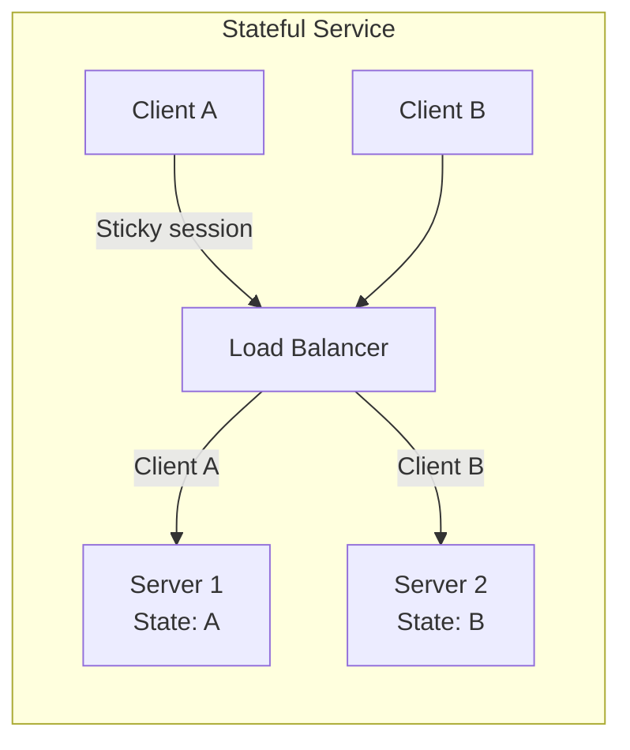
```mermaid
flowchart LR
    subgraph Stateful["Stateful Service"]
        Client2[Client A] -->|"Sticky session"| LB2[Load Balancer]
        Client3[Client B] --> LB2
        LB2 -->|"Client A"| SS1[Server 1<br/>State: A]
        LB2 -->|"Client B"| SS2[Server 2<br/>State: B]
    end
```

### Comparison

| Aspect | Stateless | Stateful |
|--------|-----------|----------|
| **Scaling** | Add instances freely | Requires session affinity or migration |
| **Failure handling** | Retry on any instance | State lost, reconnection required |
| **Load balancing** | Any algorithm works | Sticky sessions or consistent hashing |
| **Deployment** | Rolling update trivial | Must drain sessions first |
| **Memory usage** | Lower per instance | Higher (holds state) |
| **Latency** | Network hop to state store | Local state access (faster) |

### Making Services Stateless

**Invariant:** To scale horizontally without complexity, externalize all state.

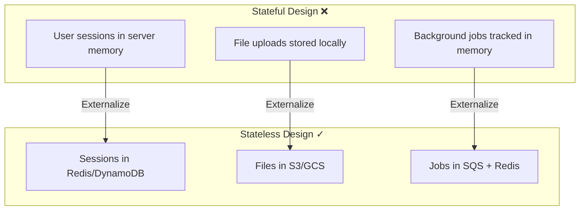
```mermaid
flowchart TB
    subgraph Before["Stateful Design ❌"]
        B1["User sessions in server memory"]
        B2["File uploads stored locally"]
        B3["Background jobs tracked in memory"]
    end
    
    subgraph After["Stateless Design ✓"]
        A1["Sessions in Redis/DynamoDB"]
        A2["Files in S3/GCS"]
        A3["Jobs in SQS + Redis"]
    end
    
    B1 -->|"Externalize"| A1
    B2 -->|"Externalize"| A2
    B3 -->|"Externalize"| A3
```

### State Externalization Patterns

| State Type | Externalization Target | Considerations |
|------------|----------------------|----------------|
| **User sessions** | Redis, Memcached, DynamoDB | TTL, encryption, size limits |
| **Shopping carts** | Redis with persistence, database | Durability vs. performance |
| **File uploads** | S3, GCS, Azure Blob | Presigned URLs, lifecycle policies |
| **Background job state** | Message queue + database | Idempotency, retry logic |
| **In-memory cache** | Distributed cache (Redis cluster) | Cache coherence, eviction |
| **Locks/coordination** | Redis, ZooKeeper, etcd | Lease TTL, fencing tokens |

### When Stateful is Necessary

Some use cases require stateful design:

| Use Case | Why Stateful | Mitigation |
|----------|--------------|------------|
| **WebSocket connections** | Persistent TCP connection | Consistent hashing, connection draining |
| **Real-time gaming** | Sub-millisecond state access | In-memory with replication |
| **Streaming media** | Buffer state, position tracking | Session affinity, checkpointing |
| **Collaborative editing** | Operational transforms | CRDTs, per-document routing |

---

## 4. Auto-Scaling

### Why Auto-Scaling?

Manual capacity planning fails because:
- Traffic is unpredictable (viral content, news events, sales)
- Over-provisioning wastes money
- Under-provisioning causes outages
- Humans are slow to react

### Auto-Scaling Mechanics

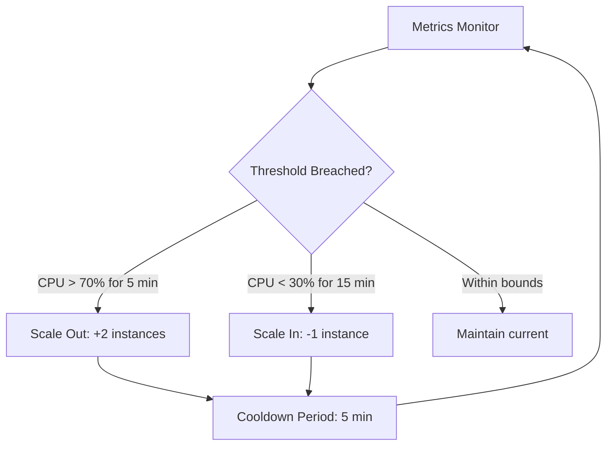
```mermaid
graph TD
    Monitor[Metrics Monitor] --> Decision{Threshold Breached?}
    Decision -->|"CPU > 70% for 5 min"| ScaleOut[Scale Out: +2 instances]
    Decision -->|"CPU < 30% for 15 min"| ScaleIn[Scale In: -1 instance]
    Decision -->|"Within bounds"| NoChange[Maintain current]
    
    ScaleOut --> Cooldown[Cooldown Period: 5 min]
    ScaleIn --> Cooldown
    Cooldown --> Monitor
```

### Scaling Triggers

| Metric | Scale Out When | Scale In When | Considerations |
|--------|---------------|---------------|----------------|
| **CPU utilization** | > 70% | < 30% | Most common, lagging indicator |
| **Memory utilization** | > 80% | < 40% | Good for memory-bound workloads |
| **Request count** | > threshold/instance | < threshold/instance | Anticipates load |
| **Queue depth** | Growing queue | Empty queue | Good for async workers |
| **Response latency** | > SLA target | Well below SLA | User-experience focused |
| **Custom metrics** | Business-specific | Business-specific | Most accurate, most complex |

### Scaling Policies

```yaml
# Kubernetes HPA example
apiVersion: autoscaling/v2
kind: HorizontalPodAutoscaler
metadata:
  name: api-server
spec:
  scaleTargetRef:
    apiVersion: apps/v1
    kind: Deployment
    name: api-server
  minReplicas: 3
  maxReplicas: 100
  metrics:
  - type: Resource
    resource:
      name: cpu
      target:
        type: Utilization
        averageUtilization: 70
  - type: Pods
    pods:
      metric:
        name: requests_per_second
      target:
        type: AverageValue
        averageValue: 1000
  behavior:
    scaleDown:
      stabilizationWindowSeconds: 300  # Wait 5 min before scaling down
      policies:
      - type: Percent
        value: 10
        periodSeconds: 60  # Remove max 10% per minute
    scaleUp:
      stabilizationWindowSeconds: 0  # Scale up immediately
      policies:
      - type: Percent
        value: 100
        periodSeconds: 15  # Can double every 15 seconds
```

### Scaling Patterns


```mermaid
flowchart TD
    subgraph Reactive["Reactive Scaling"]
        R1[Traffic increases] --> R2[Metrics rise]
        R2 --> R3[Threshold breached]
        R3 --> R4[Scale out]
        R4 --> R5["Lag: 2-5 minutes"]
    end
    
    subgraph Predictive["Predictive Scaling"]
        P1[Historical patterns] --> P2[ML model]
        P2 --> P3[Predict future load]
        P3 --> P4[Pre-scale]
        P4 --> P5["Ready before traffic"]
    end
    
    subgraph Scheduled["Scheduled Scaling"]
        S1[Known events] --> S2[Scale schedule]
        S2 --> S3[Pre-provision]
        S3 --> S4["Ready for event"]
    end
```

### Auto-Scaling Anti-Patterns

| Anti-Pattern | Problem | Solution |
|--------------|---------|----------|
| **Thrashing** | Rapid scale up/down cycles | Longer cooldown periods |
| **Too aggressive** | Scaling on transient spikes | Longer evaluation windows |
| **Too conservative** | Can't keep up with load | Faster scale-up, predictive scaling |
| **Single metric** | Doesn't capture full picture | Multiple metrics, composite policies |
| **No minimum** | Scale to zero during quiet | Maintain minimum instances |

---

## 5. Rate Limiting

> **References:**
> - Turner, J. (1986). "New Directions in Communications (or Which Way to the Information Age?)." IEEE Communications Magazine. (Token bucket origin)
> - Beyer, B. et al. (2016). "Site Reliability Engineering." O'Reilly. (Production rate limiting patterns)

### Why Rate Limit?

- **Prevent abuse:** Stop malicious actors from overwhelming the system
- **Ensure fairness:** Prevent one user from consuming all resources
- **Control costs:** Limit expensive operations
- **Maintain SLAs:** Protect service quality for all users
- **Compliance:** Meet contractual or legal limits

### Rate Limiting Dimensions

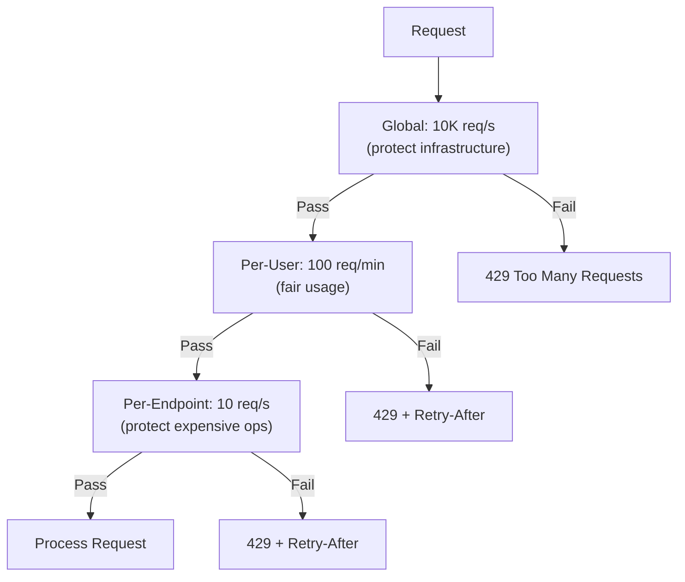
```mermaid
flowchart TB
    Request --> L1["Global: 10K req/s<br/>(protect infrastructure)"]
    L1 -->|Pass| L2["Per-User: 100 req/min<br/>(fair usage)"]
    L2 -->|Pass| L3["Per-Endpoint: 10 req/s<br/>(protect expensive ops)"]
    L3 -->|Pass| Allow[Process Request]
    
    L1 -->|Fail| R1[429 Too Many Requests]
    L2 -->|Fail| R2[429 + Retry-After]
    L3 -->|Fail| R3[429 + Retry-After]
```

### Rate Limiting Algorithms

| Algorithm | Mechanism | Burst Handling | Memory | Best For |
|-----------|-----------|---------------|--------|----------|
| **Fixed Window** | Count in time windows | Poor (2x at boundary) | O(1) | Simple use cases |
| **Sliding Window Log** | Track each request timestamp | Good | O(n) | High accuracy needs |
| **Sliding Window Counter** | Weighted window overlap | Good | O(1) | Most production use |
| **Token Bucket** | Tokens refill at fixed rate | Excellent | O(1) | APIs with burst tolerance |
| **Leaky Bucket** | Constant output rate queue | Smooths bursts | O(1) | Constant throughput needed |

### Rate Limiting Algorithm Complexity

| Algorithm | Time (per request) | Space (per key) | Accuracy | Distributed Support |
|-----------|-------------------|-----------------|----------|---------------------|
| **Fixed Window** | O(1) | O(1) | Low (boundary issues) | Easy (atomic INCR) |
| **Sliding Window Log** | O(n) for cleanup | O(n) requests | High | Medium (set operations) |
| **Sliding Window Counter** | O(1) | O(2) counters | Good | Easy (two counters) |
| **Token Bucket** | O(1) | O(2) values | Good | Medium (CAS operation) |
| **Leaky Bucket** | O(1) | O(2) values | Good | Medium (CAS operation) |

Where n = requests in window.

### Token Bucket Deep Dive

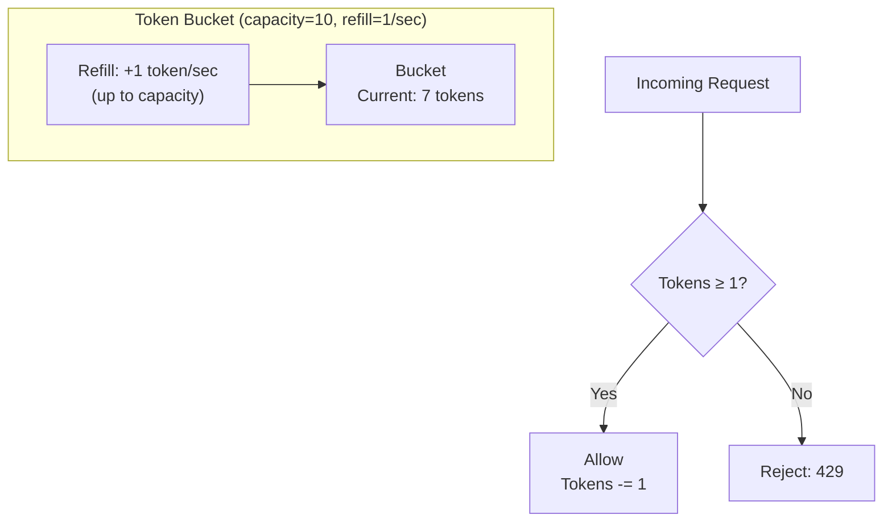
```mermaid
flowchart TB
    subgraph TokenBucket["Token Bucket (capacity=10, refill=1/sec)"]
        Bucket["Bucket<br/>Current: 7 tokens"]
        Refill["Refill: +1 token/sec<br/>(up to capacity)"]
    end
    
    Request["Incoming Request"] --> Check{Tokens ≥ 1?}
    Check -->|Yes| Allow["Allow<br/>Tokens -= 1"]
    Check -->|No| Reject["Reject: 429"]
    
    Refill --> Bucket
```

**Parameters:**
- **Bucket size (capacity):** Maximum burst size
- **Refill rate:** Sustained request rate

**Implementation:**

```python
class TokenBucket:
    def __init__(self, capacity: int, refill_rate: float):
        self.capacity = capacity
        self.refill_rate = refill_rate  # tokens per second
        self.tokens = capacity
        self.last_refill = time.time()
    
    def allow(self, tokens_needed: int = 1) -> bool:
        now = time.time()
        
        # Refill tokens based on time elapsed
        elapsed = now - self.last_refill
        self.tokens = min(
            self.capacity,
            self.tokens + elapsed * self.refill_rate
        )
        self.last_refill = now
        
        # Check if we have enough tokens
        if self.tokens >= tokens_needed:
            self.tokens -= tokens_needed
            return True
        return False
```

### Distributed Rate Limiting

With multiple servers, each tracking its own counts will undercount.

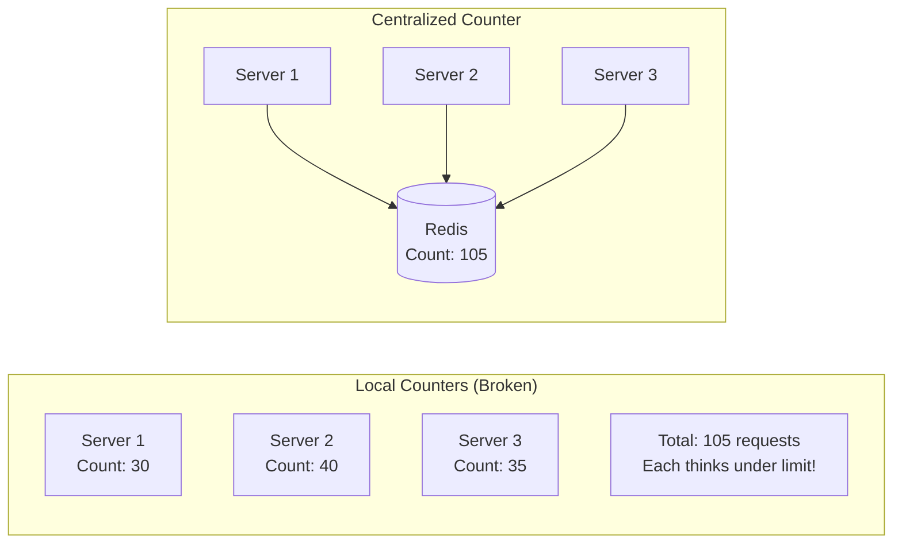
```mermaid
flowchart LR
    subgraph Problem["Local Counters (Broken)"]
        S1[Server 1<br/>Count: 30]
        S2[Server 2<br/>Count: 40]
        S3[Server 3<br/>Count: 35]
        Note1["Total: 105 requests<br/>Each thinks under limit!"]
    end
    
    subgraph Solution["Centralized Counter"]
        SS1[Server 1] --> Redis[(Redis<br/>Count: 105)]
        SS2[Server 2] --> Redis
        SS3[Server 3] --> Redis
    end
```

**Atomic Redis implementation:**

```lua
-- Lua script for atomic rate limiting
local key = KEYS[1]
local limit = tonumber(ARGV[1])
local window = tonumber(ARGV[2])

local current = redis.call('INCR', key)
if current == 1 then
    redis.call('EXPIRE', key, window)
end

if current > limit then
    return 0  -- Rejected
else
    return 1  -- Allowed
end
```

### Rate Limiting Response Headers

```http
HTTP/1.1 200 OK
X-RateLimit-Limit: 100
X-RateLimit-Remaining: 45
X-RateLimit-Reset: 1640000000

HTTP/1.1 429 Too Many Requests
Retry-After: 30
X-RateLimit-Limit: 100
X-RateLimit-Remaining: 0
X-RateLimit-Reset: 1640000030
```

---

## 6. API Gateway

### What an API Gateway Does

An API Gateway is a single entry point that handles cross-cutting concerns:

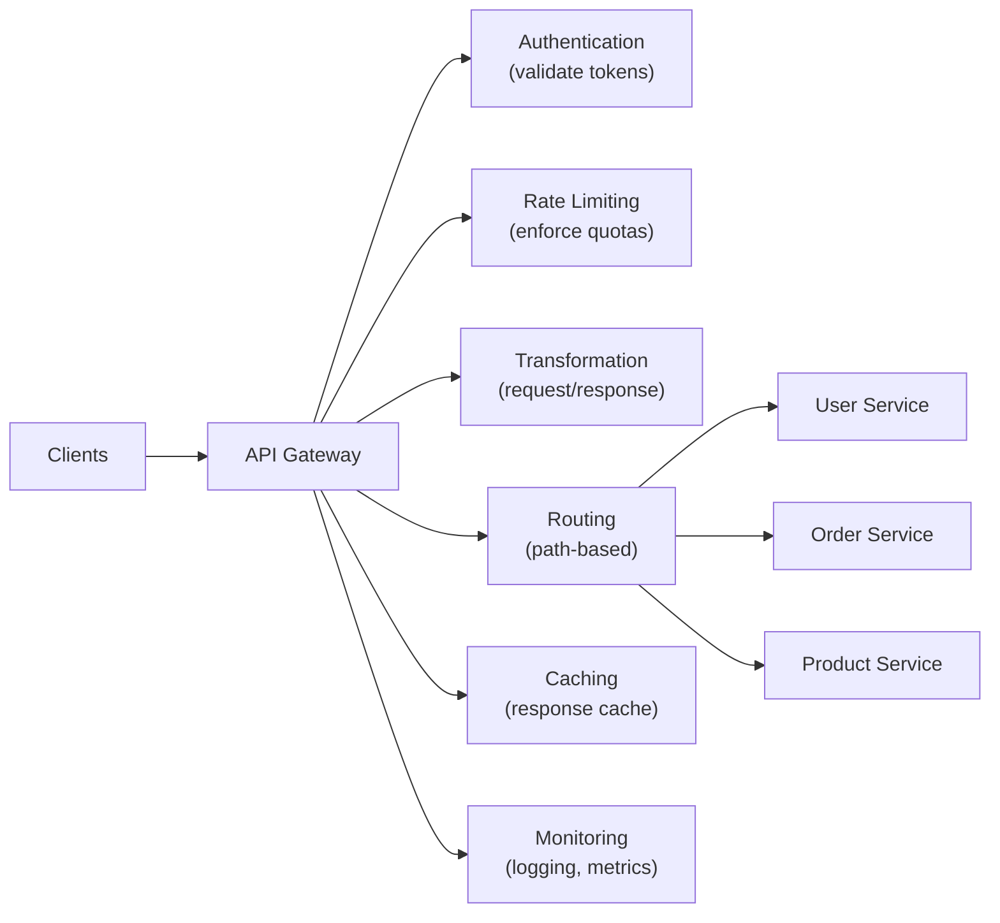
```mermaid
flowchart LR
    Clients[Clients] --> AG[API Gateway]
    
    AG --> Auth["Authentication<br/>(validate tokens)"]
    AG --> RL["Rate Limiting<br/>(enforce quotas)"]
    AG --> Transform["Transformation<br/>(request/response)"]
    AG --> Route["Routing<br/>(path-based)"]
    AG --> Cache["Caching<br/>(response cache)"]
    AG --> Monitor["Monitoring<br/>(logging, metrics)"]
    
    Route --> S1[User Service]
    Route --> S2[Order Service]
    Route --> S3[Product Service]
```

### API Gateway Responsibilities

| Responsibility | Description | Example |
|----------------|-------------|---------|
| **Authentication** | Validate identity | JWT verification, API key validation |
| **Authorization** | Check permissions | Role-based access control |
| **Rate limiting** | Enforce quotas | 100 req/min per user |
| **Request transformation** | Modify requests | Add headers, change format |
| **Response transformation** | Modify responses | Filter fields, format conversion |
| **Routing** | Direct to services | Path-based, header-based |
| **Caching** | Cache responses | GET requests, public data |
| **Circuit breaker** | Handle failures | Stop calling failing services |
| **SSL termination** | Handle TLS | Decrypt at edge |
| **Protocol translation** | Convert protocols | REST to gRPC |

### API Gateway Patterns

#### Backend for Frontend (BFF)

Different gateways optimized for different clients:

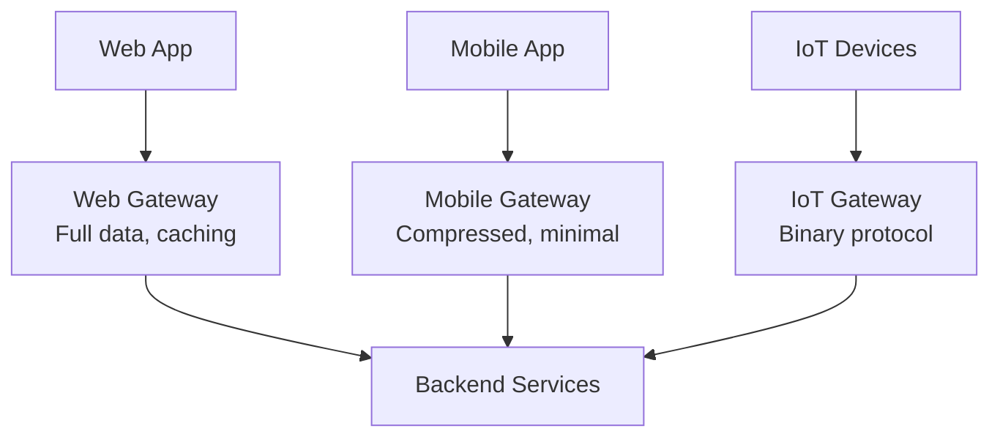
```mermaid
graph TD
    Web[Web App] --> GW1[Web Gateway<br/>Full data, caching]
    Mobile[Mobile App] --> GW2[Mobile Gateway<br/>Compressed, minimal]
    IoT[IoT Devices] --> GW3[IoT Gateway<br/>Binary protocol]
    
    GW1 --> Services[Backend Services]
    GW2 --> Services
    GW3 --> Services
```

**Why:** Different clients have different needs:
- Web: Rich data, can handle larger payloads
- Mobile: Bandwidth-sensitive, battery-conscious
- IoT: Constrained resources, binary protocols

#### Gateway Aggregation

Combine multiple service calls into one client request:

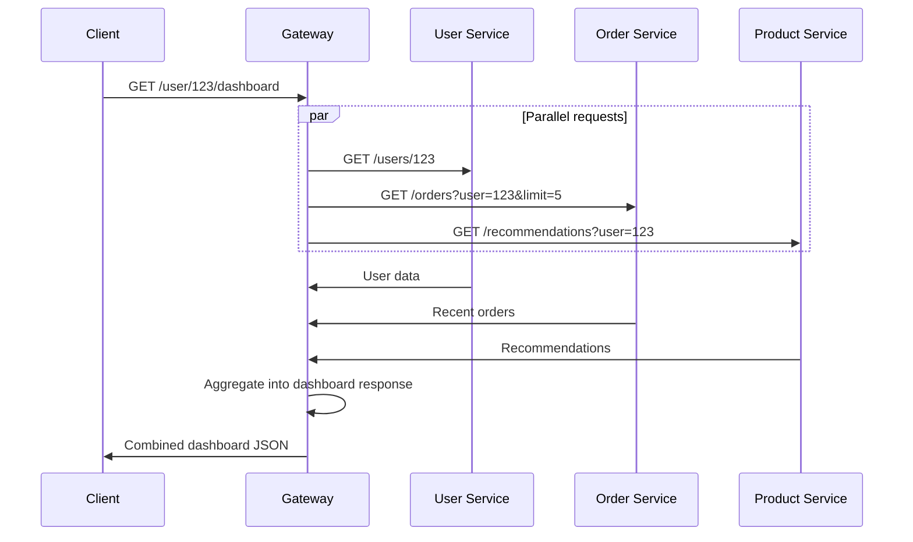
```mermaid
sequenceDiagram
    participant C as Client
    participant G as Gateway
    participant U as User Service
    participant O as Order Service
    participant P as Product Service
    
    C->>G: GET /user/123/dashboard
    
    par Parallel requests
        G->>U: GET /users/123
        G->>O: GET /orders?user=123&limit=5
        G->>P: GET /recommendations?user=123
    end
    
    U->>G: User data
    O->>G: Recent orders
    P->>G: Recommendations
    
    G->>G: Aggregate into dashboard response
    G->>C: Combined dashboard JSON
```

**Benefits:**
- Reduces client round trips
- Simplifies client logic
- Enables backend optimization

### API Gateway vs. Load Balancer

| Aspect | API Gateway | Load Balancer |
|--------|-------------|---------------|
| **Layer** | Application (L7) | Transport (L4) or Application (L7) |
| **Primary purpose** | API management | Traffic distribution |
| **Features** | Auth, rate limit, transform | Health checks, routing |
| **Awareness** | HTTP semantics, business logic | Connection/packet level |
| **Typical position** | Edge, client-facing | Internal, between tiers |

**Rule of thumb:** Use API Gateway for external APIs, load balancers for internal service communication.

---

## 7. Content Delivery Networks (CDN)

### What a CDN Does

A CDN is a geographically distributed network of edge servers that cache content close to users:

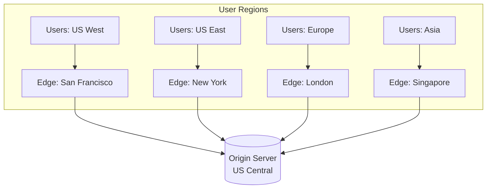
```mermaid
graph TD
    subgraph "User Regions"
        U1[Users: US West] --> E1[Edge: San Francisco]
        U2[Users: US East] --> E2[Edge: New York]
        U3[Users: Europe] --> E3[Edge: London]
        U4[Users: Asia] --> E4[Edge: Singapore]
    end
    
    E1 --> Origin[(Origin Server<br/>US Central)]
    E2 --> Origin
    E3 --> Origin
    E4 --> Origin
```

### CDN Benefits

| Benefit | Mechanism |
|---------|-----------|
| **Lower latency** | Content served from nearby edge (10ms vs 200ms) |
| **Reduced origin load** | Edges absorb 80-95% of traffic |
| **DDoS protection** | Distributed network absorbs attacks |
| **High availability** | Redundant edges, automatic failover |
| **SSL offloading** | Edges handle TLS termination |

### CDN Request Flow

```mermaid
sequenceDiagram
    participant U as User (Europe)
    participant DNS as DNS
    participant Edge as CDN Edge (London)
    participant Origin as Origin (US)
    
    U->>DNS: Resolve cdn.example.com
    DNS->>U: 185.x.x.x (London edge)
    
    U->>Edge: GET /images/logo.png
    
    alt Cache Hit
        Edge->>U: Return cached content (5ms)
    else Cache Miss
        Edge->>Origin: GET /images/logo.png
        Origin->>Edge: Content + Cache-Control headers
        Edge->>Edge: Store in cache
        Edge->>U: Return content (200ms first time)
    end
```

### Push vs. Pull CDN

| Aspect | Pull CDN | Push CDN |
|--------|----------|----------|
| **Content upload** | Edge fetches on first request | Origin pushes proactively |
| **First request** | Cache miss (slow) | Already cached (fast) |
| **Storage** | Only caches requested content | May cache unused content |
| **Control** | Less control over what's cached | Full control |
| **Best for** | Unpredictable access, long-tail | Known high-value content, launches |

### What to Cache on CDN

| Content Type | Cache Strategy | TTL | Notes |
|--------------|----------------|-----|-------|
| **Static assets** (JS, CSS, images) | Aggressive | Days to years | Use versioned URLs |
| **API responses** (public) | Selective | Seconds to minutes | Vary by Accept-Language |
| **HTML pages** | Careful | Varies | Consider Edge Side Includes |
| **Personalized content** | Don't cache on CDN | N/A | Return to origin |
| **Video/media** | Aggressive | Long | Segment-based caching |

### CDN Cache Headers

```http
# Origin response
Cache-Control: public, max-age=31536000
ETag: "abc123"
Vary: Accept-Encoding

# CDN respects these:
# - public: CDN can cache
# - max-age: cache duration
# - Vary: cache different versions for different Accept-Encoding
```

---

## 8. Serverless vs. Traditional Architecture

### Architecture Comparison

```mermaid
flowchart TB
    subgraph Traditional["Traditional Architecture"]
        TLB[Load Balancer] --> T1[Server 1<br/>Always Running]
        TLB --> T2[Server 2<br/>Always Running]
        TLB --> T3[Server 3<br/>Always Running]
        T1 --> TDB[(Database)]
        T2 --> TDB
        T3 --> TDB
    end
    
    subgraph Serverless["Serverless Architecture"]
        Trigger[Events] --> F1["Function<br/>(created on demand)"]
        Trigger --> F2["Function<br/>(created on demand)"]
        Trigger --> F3["Function<br/>(created on demand)"]
        F1 --> SDB[(Managed DB)]
        F2 --> SDB
        F3 --> SDB
    end
```

### Comparison Matrix

| Aspect | Traditional | Serverless |
|--------|-------------|------------|
| **Scaling** | Manual/auto-scaling config | Automatic, instant |
| **Cold start** | None (always running) | 100ms - 10s depending on runtime |
| **Max execution** | Unlimited | Limited (e.g., 15 min AWS Lambda) |
| **State** | Can be stateful | Must be stateless |
| **Cost model** | Pay for running time | Pay per invocation |
| **Cost when idle** | Full cost | Zero cost |
| **Debugging** | SSH, logs, APM | CloudWatch, harder to debug |
| **Vendor lock-in** | Lower (portable containers) | Higher (proprietary triggers) |
| **Ops overhead** | Higher (patching, scaling) | Lower (managed) |

### Cost Crossover Analysis

```
Traditional (3x t3.medium EC2):
- 3 × $0.0416/hr × 720 hrs/month = $90/month
- Fixed cost regardless of traffic

Serverless (AWS Lambda):
- 1M requests × 200ms × 256MB = 50,000 GB-seconds
- Cost: ~$1/month + $0.20 per million requests

Crossover point:
- Low traffic → Serverless wins
- High, steady traffic → Traditional wins
- Spiky traffic → Serverless often wins
```

### Decision Framework

```mermaid
flowchart TD
    Start[New Service] --> Q1{Execution > 15 min?}
    
    Q1 -->|Yes| Traditional1[Traditional]
    Q1 -->|No| Q2{Traffic pattern?}
    
    Q2 -->|"Spiky, unpredictable"| Serverless1[Serverless]
    Q2 -->|"Steady, high volume"| Q3{Cold start OK?}
    
    Q3 -->|"Yes (>1s acceptable)"| Serverless2[Serverless]
    Q3 -->|"No (<100ms required)"| Q4{Team preference?}
    
    Q4 -->|"Prefer managed"| Serverless3["Serverless +<br/>Provisioned Concurrency"]
    Q4 -->|"Full control"| Traditional2[Traditional]
```

### Cold Start Mitigation

```mermaid
flowchart TB
    subgraph Strategies["Cold Start Mitigation"]
        S1[Provisioned Concurrency] -->|"Pre-warm containers"| Result1["Eliminates cold starts<br/>but increases cost"]
        S2[Smaller Packages] -->|"Reduce code size"| Result2["Faster deployment<br/>faster start"]
        S3[Language Choice] -->|"Go, Rust > Python > Java"| Result3["Compiled languages<br/>start faster"]
        S4[Lazy Initialization] -->|"DB connections on first use"| Result4["Reduce init time"]
    end
```

---

## 9. High Availability Patterns

### Availability Targets

| Level | Uptime/Year | Downtime/Year | Typical Use |
|-------|-------------|---------------|-------------|
| 99% (two 9s) | 3.65 days | 87.6 hours | Internal tools |
| 99.9% (three 9s) | 8.76 hours | 43.8 minutes | Business apps |
| 99.99% (four 9s) | 52.6 minutes | 4.38 minutes | E-commerce, SaaS |
| 99.999% (five 9s) | 5.26 minutes | 26.3 seconds | Financial, healthcare |

### Eliminating Single Points of Failure

```mermaid
graph TD
    subgraph "Before: SPOFs Everywhere"
        B_LB[Single LB] --> B_App[Single App Server]
        B_App --> B_DB[(Single Database)]
    end
    
    subgraph "After: Redundant"
        A_DNS[DNS with Failover] --> A_LB1[LB 1]
        A_DNS --> A_LB2[LB 2]
        
        A_LB1 --> A_App1[App Server 1]
        A_LB1 --> A_App2[App Server 2]
        A_LB2 --> A_App1
        A_LB2 --> A_App2
        
        A_App1 --> A_DB1[(Primary DB)]
        A_App2 --> A_DB1
        A_DB1 --> A_DB2[(Standby DB)]
    end
```

### Redundancy Patterns

| Pattern | Implementation | Trade-off |
|---------|---------------|-----------|
| **Active-Passive** | Standby waits for failover | Simple, wastes standby resources |
| **Active-Active** | Both handle traffic | Complex, better utilization |
| **N+1** | N active + 1 spare | Efficient for known load |
| **2N** | Fully duplicate everything | Expensive, highest availability |

### Failover Strategies

```mermaid
stateDiagram-v2
    [*] --> Normal: System Operating
    Normal --> Detection: Failure Detected
    Detection --> Failover: Confirmed Failed
    Failover --> Recovery: Traffic Redirected
    Recovery --> Normal: Original Restored
    
    note right of Detection
        Methods:
        - Heartbeat timeout
        - Health check failures
        - Manual trigger
    end note
    
    note right of Failover
        Actions:
        - DNS update
        - VIP transfer
        - Connection draining
    end note
```

### Database High Availability

```mermaid
flowchart TD
    subgraph "Single-Leader with Sync Standby"
        App[Application] --> Primary[(Primary)]
        Primary -->|"Sync replication"| Standby[(Standby)]
        Primary -.->|"Async replication"| Replica[(Read Replica)]
    end
    
    subgraph "Failover Process"
        F1[Primary fails] --> F2[Detect via heartbeat]
        F2 --> F3[Promote standby]
        F3 --> F4[Update connection string]
        F4 --> F5[Resume writes]
    end
```

---

## 10. Capacity Planning

### Estimation Framework

```
Step 1: Understand requirements
- Peak QPS expected?
- Data volume per request?
- Storage growth rate?
- Read:Write ratio?

Step 2: Calculate per-component
- Web servers: QPS / (requests per server)
- Cache: Working set size / (memory per node)
- Database: QPS / (queries per second capacity)
- Storage: Data volume × retention × replication factor
```

### Back-of-Envelope Numbers

| Resource | Typical Capacity |
|----------|------------------|
| Web server (single) | 1,000-10,000 req/s |
| Database (PostgreSQL) | 10,000-50,000 QPS (simple queries) |
| Redis (single node) | 100,000+ ops/s |
| Kafka partition | 10,000+ msg/s |
| Network (1 Gbps) | ~100 MB/s |

### Example Calculation

**Scenario:** Design Twitter-like service for 100M daily active users

```
Assumptions:
- DAU: 100M users
- Tweets per user/day: 0.5 (write) 
- Timeline views per user/day: 10 (read)
- Average tweet size: 500 bytes

Calculations:
- Write QPS: 100M × 0.5 / 86,400 = ~580 writes/s
- Peak write QPS: 580 × 10 = ~6,000 writes/s
- Read QPS: 100M × 10 / 86,400 = ~11,500 reads/s
- Peak read QPS: 11,500 × 10 = ~115,000 reads/s

Sizing:
- Web servers (10K QPS each): 12 servers for peak reads
- Cache (100K ops/s each): 2 Redis nodes for reads
- Database: Sharded for writes, read replicas for reads
- Storage/year: 100M × 0.5 × 500B × 365 = ~9 TB/year
```

---

## 11. Chapter Summary

### Key Concepts

| Concept | Definition |
|---------|------------|
| **Vertical scaling** | Add resources to existing machine |
| **Horizontal scaling** | Add more machines |
| **Stateless design** | Externalize all state, any instance handles any request |
| **Load balancing** | Distribute traffic across servers |
| **Auto-scaling** | Automatically adjust capacity based on demand |
| **Rate limiting** | Control request rate to protect system |
| **API Gateway** | Centralized API management (auth, routing, transform) |
| **CDN** | Edge caching for latency and origin offload |

### Decision Quick Reference

```
┌─────────────────────────────────────────────────────────────────┐
│            SCALING & INFRASTRUCTURE CHEAT SHEET                  │
├─────────────────────────────────────────────────────────────────┤
│ SCALING:                                                        │
│   • Start vertical until you can't (simpler)                    │
│   • Go horizontal when: fault tolerance needed, unbounded       │
│     growth expected, workload is parallelizable                 │
│   • Always externalize state before horizontal scaling          │
├─────────────────────────────────────────────────────────────────┤
│ LOAD BALANCING:                                                 │
│   • Equal servers, equal requests → Round Robin                 │
│   • Unequal servers → Weighted Round Robin                      │
│   • Variable duration → Least Connections                       │
│   • Need affinity → IP Hash                                     │
│   • L4 for speed, L7 for content-aware routing                  │
├─────────────────────────────────────────────────────────────────┤
│ RATE LIMITING:                                                  │
│   • Token bucket: allows bursts, configurable                   │
│   • Sliding window: good accuracy, common choice                │
│   • Distribute via Redis for multi-server                       │
├─────────────────────────────────────────────────────────────────┤
│ SERVERLESS VS TRADITIONAL:                                      │
│   • Serverless: spiky traffic, event-driven, low maintenance    │
│   • Traditional: steady traffic, long-running, low latency      │
│   • Consider cold starts, execution limits, vendor lock-in      │
├─────────────────────────────────────────────────────────────────┤
│ HIGH AVAILABILITY:                                              │
│   • Eliminate SPOFs at every layer                              │
│   • Redundancy: Active-active > Active-passive                  │
│   • Plan for failure: automated failover, health checks         │
└─────────────────────────────────────────────────────────────────┘
```

### Interview Articulation Patterns

> **"How would you scale this system?"**

"First, I'd make the service stateless by externalizing session state to Redis. Then I'd add a load balancer and horizontally scale by adding instances behind it. Auto-scaling based on CPU utilization would handle traffic spikes. For the database, I'd add read replicas for read scaling and consider sharding if write throughput becomes a bottleneck."

> **"Why use an API Gateway instead of just a load balancer?"**

"An API Gateway provides application-level features that a basic load balancer doesn't: authentication, rate limiting per user, request/response transformation, and API versioning. If I just need to distribute traffic, a load balancer is simpler. But for managing APIs with different access patterns, authentication needs, and client-specific requirements, an API Gateway is more appropriate."

> **"How would you achieve 99.99% availability?"**

"99.99% means less than 53 minutes of downtime per year. I'd need: redundant load balancers with health checks, at least 3 application instances across availability zones, database with synchronous replication to a standby, automated failover with sub-minute detection, CDN for static content, and comprehensive monitoring with alerting. The key is eliminating all single points of failure and ensuring automatic recovery."

> **"When would you use serverless vs. containers?"**

"Serverless excels for event-driven workloads with variable traffic—like webhook handlers, scheduled jobs, or APIs with unpredictable load. The zero-cost-when-idle model is compelling. I'd use containers for steady-state workloads, long-running processes, or when I need sub-100ms cold start times. The hybrid approach often works best: serverless for edges, containers for core services."

---

## Revision History

| Date | Change |
|------|--------|
| 2025-01 | Initial document with scaling, load balancing, rate limiting, HA patterns |
| 2025-01 | Quality review: Added paper references (Maglev 2016, SRE book), complexity tables for load balancing and rate limiting algorithms |

---

## Navigation

**Previous:** [06 — Distributed System Patterns](./06_DISTRIBUTED_SYSTEM_PATTERNS.md)
**Next:** [08 — Workload Optimization](./08_WORKLOAD_OPTIMIZATION.md)
**Index:** [README](./README.md)
