# 08 — Resilience Patterns

> Protecting distributed systems from cascading failures.

**Prerequisites:** [01 — Foundational Concepts](./01_FOUNDATIONAL_CONCEPTS.md), [02 — Consistency & Transactions](./02_CONSISTENCY_AND_TRANSACTIONS.md)
**Builds toward:** [09 — Scaling & Infrastructure](./09_SCALING_AND_INFRASTRUCTURE.md), [10 — Quick Reference](./10_QUICK_REFERENCE.md)
**Estimated study time:** 2-3 hours

---

## Chapter Overview

This module presents production-grade resilience patterns for building fault-tolerant distributed systems. These patterns address how to handle failures gracefully, prevent cascading outages, and maintain system stability under adverse conditions.

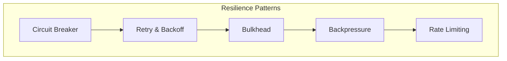

---

## 1. Circuit Breaker

### Mental Model: Electrical Circuit Breaker

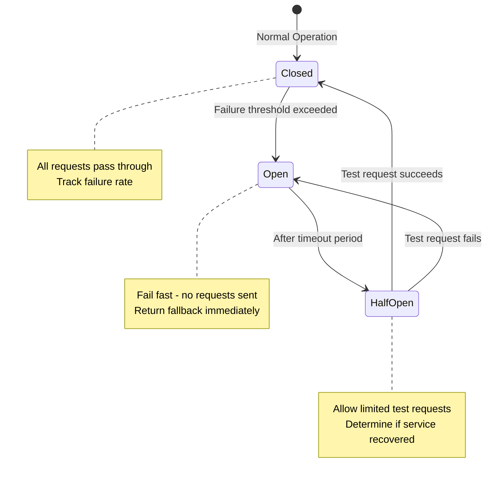

### Implementation

```python
import time
from enum import Enum
from threading import Lock
from typing import Callable, Optional, Any

class CircuitState(Enum):
    CLOSED = "closed"
    OPEN = "open"
    HALF_OPEN = "half_open"

class CircuitBreaker:
    def __init__(
        self,
        failure_threshold: int = 5,
        success_threshold: int = 2,
        timeout_seconds: float = 30.0,
        fallback: Optional[Callable] = None
    ):
        self.failure_threshold = failure_threshold
        self.success_threshold = success_threshold
        self.timeout_seconds = timeout_seconds
        self.fallback = fallback

        self.state = CircuitState.CLOSED
        self.failure_count = 0
        self.success_count = 0
        self.last_failure_time: Optional[float] = None
        self._lock = Lock()

    def call(self, func: Callable, *args, **kwargs) -> Any:
        """Execute function through circuit breaker."""
        with self._lock:
            if self.state == CircuitState.OPEN:
                if self._should_attempt_reset():
                    self.state = CircuitState.HALF_OPEN
                    self.success_count = 0
                else:
                    return self._handle_open_circuit()

        try:
            result = func(*args, **kwargs)
            self._on_success()
            return result
        except Exception as e:
            self._on_failure()
            raise

    def _should_attempt_reset(self) -> bool:
        """Check if timeout has passed since circuit opened."""
        if self.last_failure_time is None:
            return True
        return time.time() - self.last_failure_time >= self.timeout_seconds

    def _on_success(self):
        with self._lock:
            if self.state == CircuitState.HALF_OPEN:
                self.success_count += 1
                if self.success_count >= self.success_threshold:
                    self.state = CircuitState.CLOSED
                    self.failure_count = 0
            elif self.state == CircuitState.CLOSED:
                self.failure_count = 0

    def _on_failure(self):
        with self._lock:
            self.failure_count += 1
            self.last_failure_time = time.time()

            if self.state == CircuitState.HALF_OPEN:
                self.state = CircuitState.OPEN
            elif self.failure_count >= self.failure_threshold:
                self.state = CircuitState.OPEN

    def _handle_open_circuit(self) -> Any:
        if self.fallback:
            return self.fallback()
        raise CircuitOpenError("Circuit breaker is open")

class CircuitOpenError(Exception):
    pass
```

### Circuit Breaker with Metrics

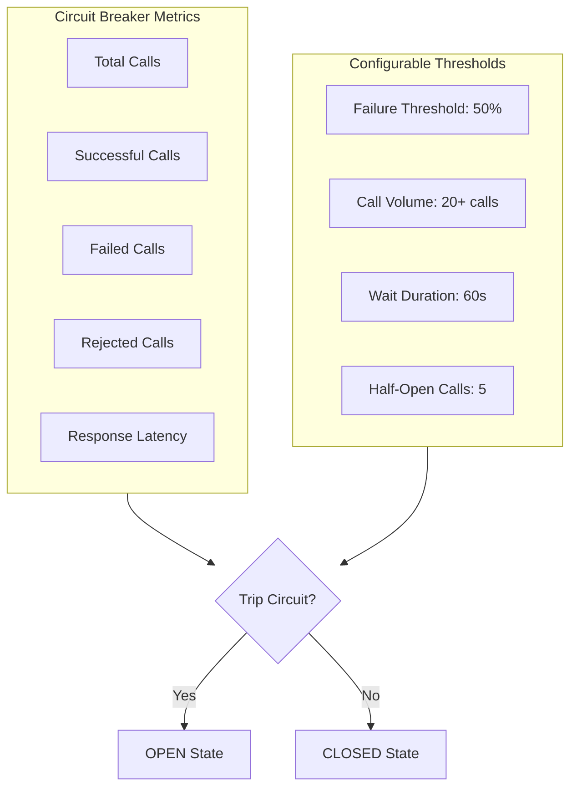

### Trade-Off Analysis

| Parameter | Higher Value Effect | Lower Value Effect |
|-----------|--------------------|--------------------|
| **Failure threshold** | More tolerant, slower to open | Less tolerant, faster protection |
| **Timeout** | Longer recovery time, more stable | Faster recovery attempts |
| **Success threshold** | More conservative recovery | Faster return to normal |
| **Sliding window** | More accurate failure rate | More responsive to changes |

---

## 2. Retry Pattern with Exponential Backoff

### The Problem

Transient failures are common in distributed systems. Retrying immediately often makes things worse.

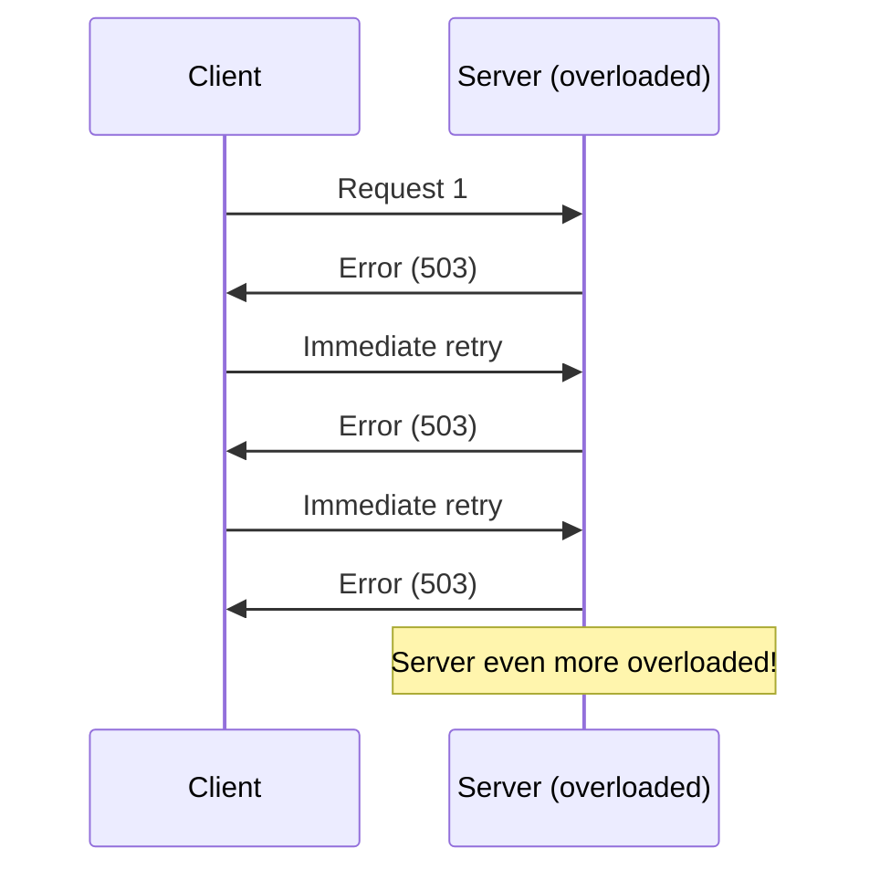

### Solution: Exponential Backoff with Jitter

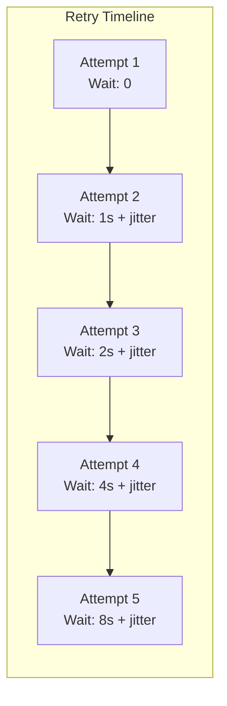

```python
import random
import time
import asyncio
from typing import Callable, TypeVar, Optional
from functools import wraps

T = TypeVar('T')

class RetryConfig:
    def __init__(
        self,
        max_attempts: int = 3,
        base_delay: float = 1.0,
        max_delay: float = 60.0,
        exponential_base: float = 2.0,
        jitter: bool = True,
        retryable_exceptions: tuple = (Exception,)
    ):
        self.max_attempts = max_attempts
        self.base_delay = base_delay
        self.max_delay = max_delay
        self.exponential_base = exponential_base
        self.jitter = jitter
        self.retryable_exceptions = retryable_exceptions

def calculate_delay(attempt: int, config: RetryConfig) -> float:
    """Calculate delay with exponential backoff and optional jitter."""
    # Exponential backoff: base_delay * (exponential_base ^ attempt)
    delay = config.base_delay * (config.exponential_base ** attempt)

    # Cap at max delay
    delay = min(delay, config.max_delay)

    # Add jitter (±50% randomization)
    if config.jitter:
        jitter_range = delay * 0.5
        delay = delay + random.uniform(-jitter_range, jitter_range)

    return max(0, delay)

def retry_with_backoff(config: RetryConfig = None):
    """Decorator for retry with exponential backoff."""
    if config is None:
        config = RetryConfig()

    def decorator(func: Callable[..., T]) -> Callable[..., T]:
        @wraps(func)
        def wrapper(*args, **kwargs) -> T:
            last_exception = None

            for attempt in range(config.max_attempts):
                try:
                    return func(*args, **kwargs)
                except config.retryable_exceptions as e:
                    last_exception = e

                    if attempt < config.max_attempts - 1:
                        delay = calculate_delay(attempt, config)
                        time.sleep(delay)

            raise last_exception

        return wrapper
    return decorator

# Async version
async def retry_async(
    func: Callable,
    config: RetryConfig = None,
    *args, **kwargs
) -> T:
    if config is None:
        config = RetryConfig()

    last_exception = None

    for attempt in range(config.max_attempts):
        try:
            return await func(*args, **kwargs)
        except config.retryable_exceptions as e:
            last_exception = e

            if attempt < config.max_attempts - 1:
                delay = calculate_delay(attempt, config)
                await asyncio.sleep(delay)

    raise last_exception
```

### Jitter Strategies

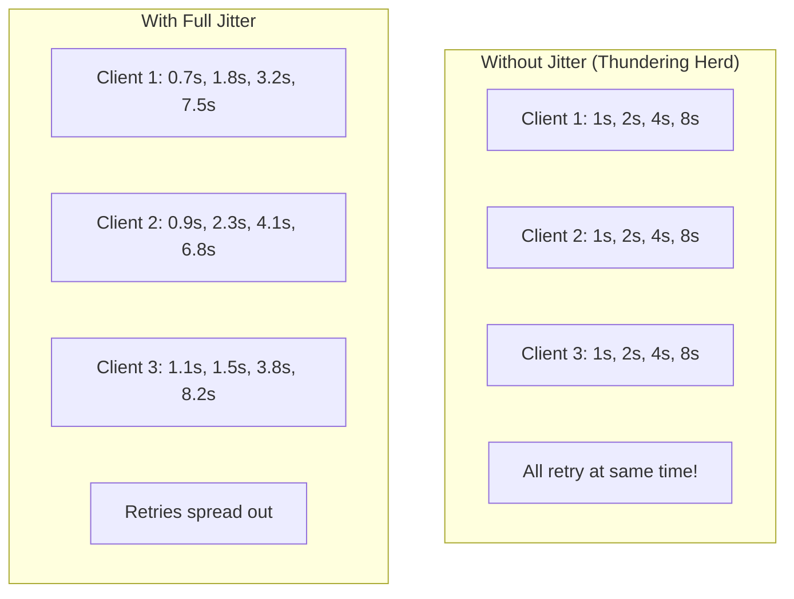

| Jitter Type | Formula | Use Case |
|-------------|---------|----------|
| **No Jitter** | `base * 2^attempt` | Testing only |
| **Full Jitter** | `random(0, base * 2^attempt)` | Most scenarios |
| **Equal Jitter** | `base * 2^attempt / 2 + random(0, base * 2^attempt / 2)` | Minimum delay guarantee |
| **Decorrelated** | `min(max_delay, random(base, previous_delay * 3))` | Long-running operations |

---

## 3. Bulkhead Pattern

### Mental Model: Ship Compartments

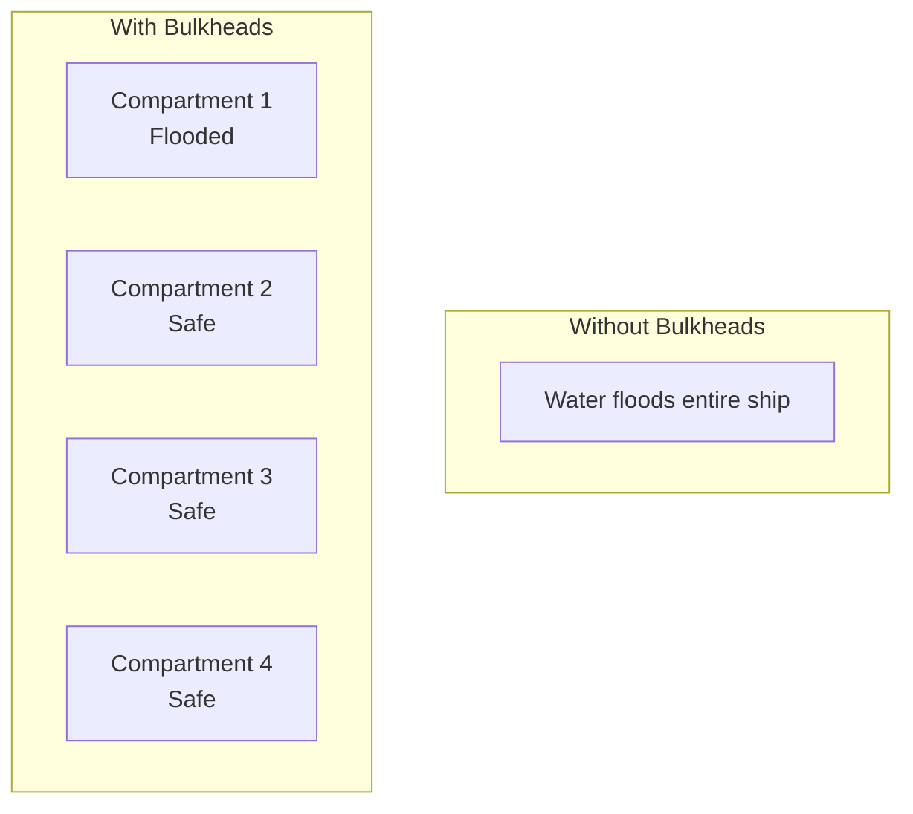

### Application: Thread Pool Isolation

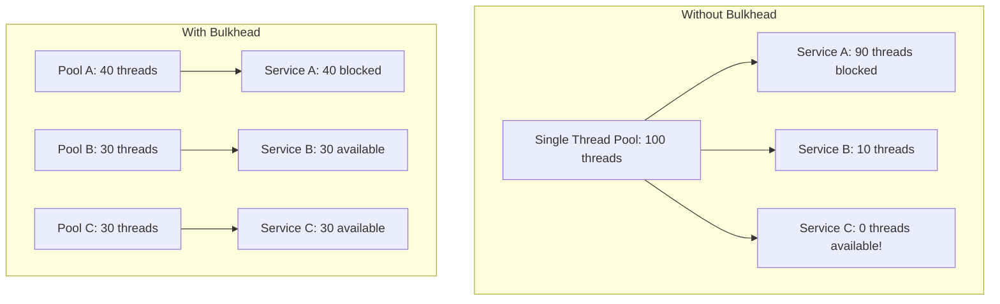

```python
import asyncio
from typing import Callable, Any
from concurrent.futures import ThreadPoolExecutor

class Bulkhead:
    """Isolate operations using semaphores and thread pools."""

    def __init__(
        self,
        name: str,
        max_concurrent: int,
        max_wait_seconds: float = 30.0
    ):
        self.name = name
        self.max_concurrent = max_concurrent
        self.max_wait = max_wait_seconds
        self._semaphore = asyncio.Semaphore(max_concurrent)
        self._thread_pool = ThreadPoolExecutor(
            max_workers=max_concurrent,
            thread_name_prefix=f"bulkhead-{name}"
        )

        # Metrics
        self.active_count = 0
        self.rejected_count = 0

    async def execute(self, func: Callable, *args, **kwargs) -> Any:
        """Execute function within bulkhead constraints."""
        try:
            # Try to acquire semaphore with timeout
            acquired = await asyncio.wait_for(
                self._semaphore.acquire(),
                timeout=self.max_wait
            )
        except asyncio.TimeoutError:
            self.rejected_count += 1
            raise BulkheadFullError(
                f"Bulkhead '{self.name}' is full "
                f"({self.max_concurrent} concurrent operations)"
            )

        self.active_count += 1
        try:
            return await asyncio.get_event_loop().run_in_executor(
                self._thread_pool,
                lambda: func(*args, **kwargs)
            )
        finally:
            self.active_count -= 1
            self._semaphore.release()

class BulkheadFullError(Exception):
    pass

# Usage example
class ServiceClient:
    def __init__(self):
        # Separate bulkheads for different downstream services
        self.payment_bulkhead = Bulkhead("payment", max_concurrent=20)
        self.inventory_bulkhead = Bulkhead("inventory", max_concurrent=30)
        self.notification_bulkhead = Bulkhead("notification", max_concurrent=50)

    async def process_payment(self, payment_data):
        return await self.payment_bulkhead.execute(
            self._call_payment_service, payment_data
        )

    async def check_inventory(self, product_id):
        return await self.inventory_bulkhead.execute(
            self._call_inventory_service, product_id
        )
```

---

## 4. Backpressure

### The Problem

Producer overwhelms consumer, causing memory exhaustion or cascading failures.

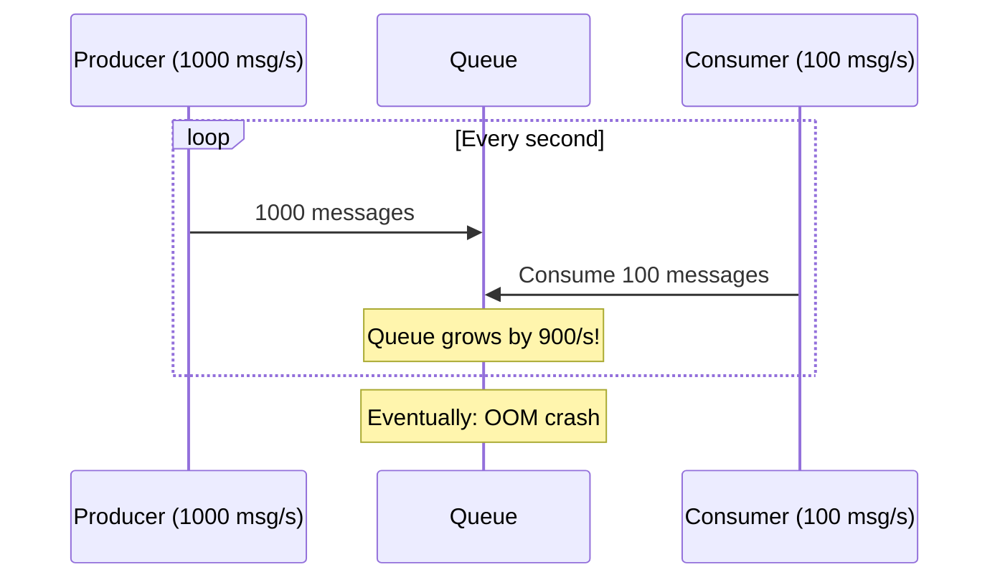

### Backpressure Strategies

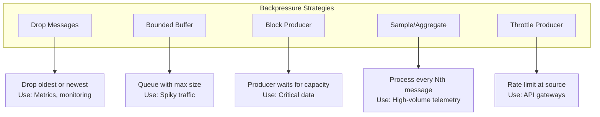

### Implementation: Bounded Queue with Backpressure

```python
import asyncio
from enum import Enum
from typing import TypeVar, Generic, Optional
from dataclasses import dataclass

T = TypeVar('T')

class BackpressureStrategy(Enum):
    BLOCK = "block"          # Block producer until space available
    DROP_OLDEST = "drop_oldest"  # Drop oldest item when full
    DROP_NEWEST = "drop_newest"  # Reject new item when full
    ERROR = "error"          # Raise exception when full

@dataclass
class BackpressureMetrics:
    items_received: int = 0
    items_processed: int = 0
    items_dropped: int = 0
    producer_blocked_count: int = 0

class BackpressureQueue(Generic[T]):
    def __init__(
        self,
        max_size: int,
        strategy: BackpressureStrategy = BackpressureStrategy.BLOCK,
        block_timeout: float = 30.0
    ):
        self.max_size = max_size
        self.strategy = strategy
        self.block_timeout = block_timeout
        self._queue: asyncio.Queue = asyncio.Queue(maxsize=max_size)
        self.metrics = BackpressureMetrics()

    async def put(self, item: T) -> bool:
        """Add item with backpressure handling."""
        self.metrics.items_received += 1

        if self._queue.full():
            if self.strategy == BackpressureStrategy.BLOCK:
                self.metrics.producer_blocked_count += 1
                try:
                    await asyncio.wait_for(
                        self._queue.put(item),
                        timeout=self.block_timeout
                    )
                    return True
                except asyncio.TimeoutError:
                    self.metrics.items_dropped += 1
                    return False

            elif self.strategy == BackpressureStrategy.DROP_OLDEST:
                # Remove oldest, add newest
                try:
                    self._queue.get_nowait()
                    self.metrics.items_dropped += 1
                except asyncio.QueueEmpty:
                    pass
                await self._queue.put(item)
                return True

            elif self.strategy == BackpressureStrategy.DROP_NEWEST:
                self.metrics.items_dropped += 1
                return False

            elif self.strategy == BackpressureStrategy.ERROR:
                self.metrics.items_dropped += 1
                raise QueueFullError("Queue is full")
        else:
            await self._queue.put(item)
            return True

    async def get(self) -> T:
        """Get item from queue."""
        item = await self._queue.get()
        self.metrics.items_processed += 1
        return item

    @property
    def fill_ratio(self) -> float:
        """Current fill ratio (0.0 to 1.0)."""
        return self._queue.qsize() / self.max_size

class QueueFullError(Exception):
    pass
```

---

## 5. Rate Limiting

> **References:**
> - Turner, J. (1986). "New Directions in Communications (or Which Way to the Information Age?)." IEEE Communications Magazine. (Token bucket origin)
> - Beyer, B. et al. (2016). "Site Reliability Engineering." O'Reilly. (Production rate limiting patterns)

### Why Rate Limit?

- **Prevent abuse:** Stop malicious actors from overwhelming the system
- **Ensure fairness:** Prevent one user from consuming all resources
- **Control costs:** Limit expensive operations
- **Maintain SLAs:** Protect service quality for all users
- **Compliance:** Meet contractual or legal limits

### Rate Limiting Dimensions

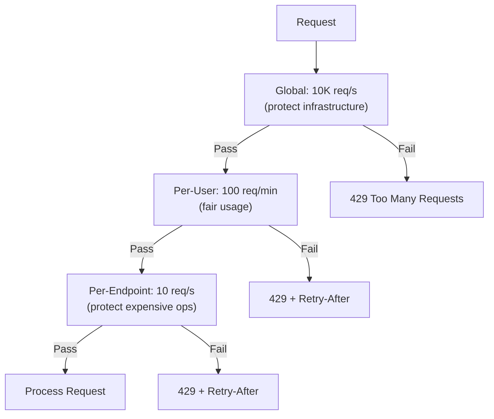

### Rate Limiting Algorithms

| Algorithm | Mechanism | Burst Handling | Memory | Best For |
|-----------|-----------|---------------|--------|----------|
| **Fixed Window** | Count in time windows | Poor (2x at boundary) | O(1) | Simple use cases |
| **Sliding Window Log** | Track each request timestamp | Good | O(n) | High accuracy needs |
| **Sliding Window Counter** | Weighted window overlap | Good | O(1) | Most production use |
| **Token Bucket** | Tokens refill at fixed rate | Excellent | O(1) | APIs with burst tolerance |
| **Leaky Bucket** | Constant output rate queue | Smooths bursts | O(1) | Constant throughput needed |

### Rate Limiting Algorithm Complexity

| Algorithm | Time (per request) | Space (per key) | Accuracy | Distributed Support |
|-----------|-------------------|-----------------|----------|---------------------|
| **Fixed Window** | O(1) | O(1) | Low (boundary issues) | Easy (atomic INCR) |
| **Sliding Window Log** | O(n) for cleanup | O(n) requests | High | Medium (set operations) |
| **Sliding Window Counter** | O(1) | O(2) counters | Good | Easy (two counters) |
| **Token Bucket** | O(1) | O(2) values | Good | Medium (CAS operation) |
| **Leaky Bucket** | O(1) | O(2) values | Good | Medium (CAS operation) |

Where n = requests in window.

### Token Bucket Deep Dive

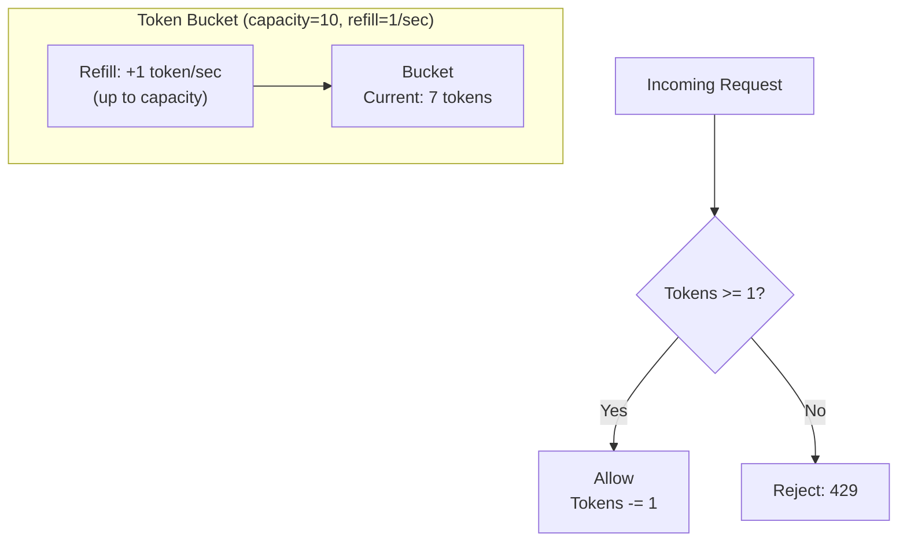

**Parameters:**
- **Bucket size (capacity):** Maximum burst size
- **Refill rate:** Sustained request rate

**Implementation:**

```python
class TokenBucket:
    def __init__(self, capacity: int, refill_rate: float):
        self.capacity = capacity
        self.refill_rate = refill_rate  # tokens per second
        self.tokens = capacity
        self.last_refill = time.time()

    def allow(self, tokens_needed: int = 1) -> bool:
        now = time.time()

        # Refill tokens based on time elapsed
        elapsed = now - self.last_refill
        self.tokens = min(
            self.capacity,
            self.tokens + elapsed * self.refill_rate
        )
        self.last_refill = now

        # Check if we have enough tokens
        if self.tokens >= tokens_needed:
            self.tokens -= tokens_needed
            return True
        return False
```

### Distributed Rate Limiting

With multiple servers, each tracking its own counts will undercount.

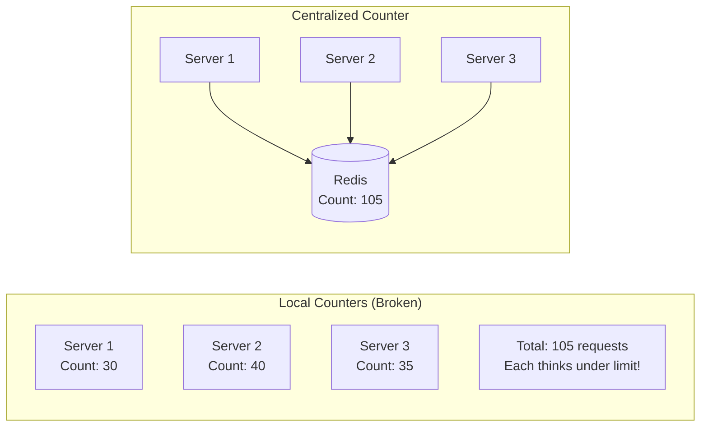

**Atomic Redis implementation:**

```lua
-- Lua script for atomic rate limiting
local key = KEYS[1]
local limit = tonumber(ARGV[1])
local window = tonumber(ARGV[2])

local current = redis.call('INCR', key)
if current == 1 then
    redis.call('EXPIRE', key, window)
end

if current > limit then
    return 0  -- Rejected
else
    return 1  -- Allowed
end
```

### Rate Limiting Response Headers

```http
HTTP/1.1 200 OK
X-RateLimit-Limit: 100
X-RateLimit-Remaining: 45
X-RateLimit-Reset: 1640000000

HTTP/1.1 429 Too Many Requests
Retry-After: 30
X-RateLimit-Limit: 100
X-RateLimit-Remaining: 0
X-RateLimit-Reset: 1640000030
```

---

## Chapter Summary

### Pattern Decision Matrix

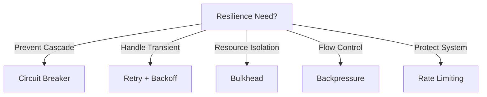

### Quick Reference Card

```
+-----------------------------------------------------------------+
|              RESILIENCE PATTERNS CHEAT SHEET                      |
+-----------------------------------------------------------------+
| CIRCUIT BREAKER:                                                  |
|   * CLOSED -> OPEN -> HALF_OPEN state machine                     |
|   * Fail fast when dependency is down                             |
|   * Use fallbacks for degraded operation                          |
+-----------------------------------------------------------------+
| RETRY:                                                            |
|   * Exponential backoff + jitter (prevents thundering herd)       |
|   * Only retry idempotent operations                              |
|   * Set max attempts to prevent infinite loops                    |
+-----------------------------------------------------------------+
| BULKHEAD:                                                         |
|   * Isolate thread pools per dependency                           |
|   * Prevent one slow service from consuming all resources         |
|   * Use semaphores or separate executors                          |
+-----------------------------------------------------------------+
| BACKPRESSURE:                                                     |
|   * Bounded queues with drop/block strategies                     |
|   * Signal upstream to slow down                                  |
|   * Essential for producer-consumer balance                       |
+-----------------------------------------------------------------+
| RATE LIMITING:                                                    |
|   * Token bucket: allows bursts, configurable                     |
|   * Sliding window: good accuracy, common choice                  |
|   * Distribute via Redis for multi-server                         |
+-----------------------------------------------------------------+
| COMBINATION:                                                      |
|   * Use all patterns together for defense in depth                |
|   * Circuit breaker + retry + bulkhead = robust client            |
|   * Rate limiting + backpressure = protected server               |
+-----------------------------------------------------------------+
```

### Interview Articulation Patterns

> "How do you prevent cascading failures?"

"I'd use multiple patterns together: Circuit breakers to fail fast when a dependency is down, bulkheads to isolate resources so one failing dependency doesn't consume all threads, retries with exponential backoff to handle transient failures without overwhelming the system, and timeouts to prevent indefinite waiting."

> "When would you use rate limiting vs. backpressure?"

"Rate limiting is typically applied at the API boundary to protect against external abuse and ensure fair usage among clients. Backpressure is used internally between components when a producer can generate data faster than a consumer can process it. Rate limiting says 'you can't come in,' while backpressure says 'slow down, I'm full.' Often you use both: rate limiting at the edge, backpressure internally."

> "How do you implement rate limiting across multiple servers?"

"Local counters won't work because requests are distributed across servers. I'd use a centralized store like Redis with atomic operations—either INCR with TTL for simple counting, or a Lua script for token bucket. The trade-off is the network round-trip to Redis adds latency. For very high-throughput systems, you can use local rate limiting with a fraction of the global limit, accepting some accuracy loss for lower latency."

---

## Practice Questions

1. Design a circuit breaker that automatically adjusts its failure threshold based on time of day and historical patterns.

2. Your retry logic is causing a thundering herd effect during database failover. How would you modify the retry strategy?

3. A microservice has 10 downstream dependencies. Design a bulkhead strategy that balances isolation with resource efficiency.

4. Compare token bucket and leaky bucket algorithms. When would you choose one over the other?

5. Design a rate limiting system that handles both per-user limits and global system limits, supporting burst traffic for premium users.

---

## Revision History

| Date | Change |
|------|--------|
| 2025-01 | Initial document extracted from Distributed System Patterns |
| 2025-01 | Added Rate Limiting section from Scaling & Infrastructure |

---

## Navigation

**Previous:** [07 — Distributed Coordination](./07_DISTRIBUTED_COORDINATION.md)
**Next:** [09 — Scaling & Infrastructure](./09_SCALING_AND_INFRASTRUCTURE.md)
**Index:** [README](./README.md)
