# 08 - Workload Optimization

## Overview

Workload optimization is the discipline of analyzing system access patterns and applying targeted strategies to maximize performance, efficiency, and cost-effectiveness. Unlike generic scaling approaches, workload optimization begins with understanding *what* your system actually does—then tailoring architecture decisions to those specific patterns. This document provides frameworks for characterizing workloads, selecting optimization strategies, and articulating trade-offs in interview settings.

---

## Core Mental Model

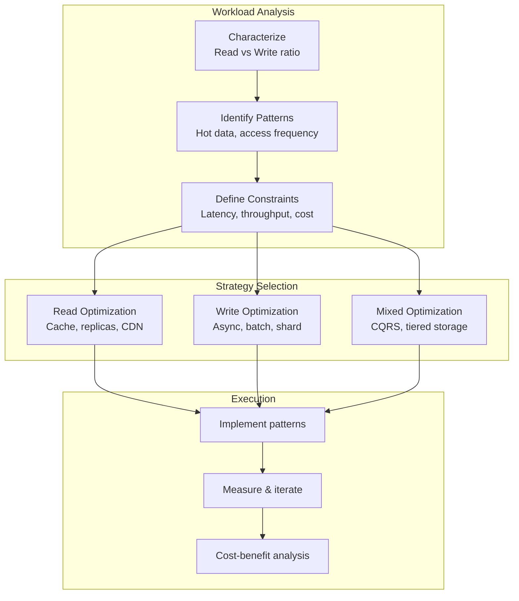
```mermaid
flowchart TD
    subgraph Analysis["Workload Analysis"]
        A1["Characterize<br/>Read vs Write ratio"]
        A2["Identify Patterns<br/>Hot data, access frequency"]
        A3["Define Constraints<br/>Latency, throughput, cost"]
    end
    
    subgraph Strategy["Strategy Selection"]
        S1["Read Optimization<br/>Cache, replicas, CDN"]
        S2["Write Optimization<br/>Async, batch, shard"]
        S3["Mixed Optimization<br/>CQRS, tiered storage"]
    end
    
    subgraph Execution["Execution"]
        E1["Implement patterns"]
        E2["Measure & iterate"]
        E3["Cost-benefit analysis"]
    end
    
    A1 --> A2 --> A3
    A3 --> S1
    A3 --> S2
    A3 --> S3
    S1 & S2 & S3 --> E1 --> E2 --> E3
```

**Key Insight**: The most common interview mistake is applying optimization techniques without first characterizing the workload. Always start with: "What's the read/write ratio?" and "What are the access patterns?"

---

## Workload Characterization Framework

### The Five Dimensions

Every workload can be characterized across five dimensions. Understanding these drives all subsequent optimization decisions.

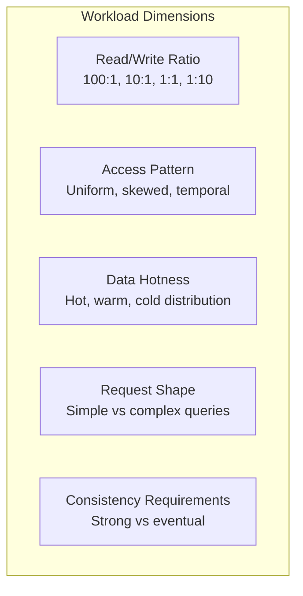
```mermaid
flowchart TB
    subgraph Dimensions["Workload Dimensions"]
        D1["Read/Write Ratio<br/>100:1, 10:1, 1:1, 1:10"]
        D2["Access Pattern<br/>Uniform, skewed, temporal"]
        D3["Data Hotness<br/>Hot, warm, cold distribution"]
        D4["Request Shape<br/>Simple vs complex queries"]
        D5["Consistency Requirements<br/>Strong vs eventual"]
    end
```

### Read/Write Ratio Analysis

| Ratio | System Type | Primary Strategy |
|-------|-------------|------------------|
| **100:1+** | Content platforms, CDNs | Aggressive caching, read replicas |
| **10:1** | E-commerce catalogs, social feeds | Cache-aside + denormalization |
| **1:1** | Collaborative tools, messaging | CQRS, optimized for both |
| **1:10** | Logging, IoT telemetry | Async writes, LSM trees, batching |
| **1:100+** | Time-series, analytics ingestion | Append-only, stream processing |

### Access Pattern Classification

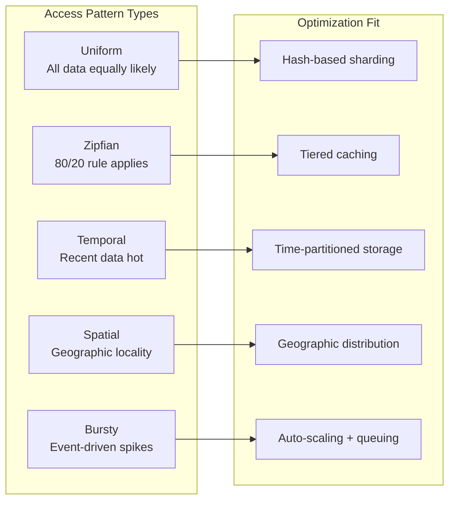
```mermaid
flowchart LR
    subgraph Patterns["Access Pattern Types"]
        P1["Uniform<br/>All data equally likely"]
        P2["Zipfian<br/>80/20 rule applies"]
        P3["Temporal<br/>Recent data hot"]
        P4["Spatial<br/>Geographic locality"]
        P5["Bursty<br/>Event-driven spikes"]
    end
    
    subgraph Strategy["Optimization Fit"]
        S1["Hash-based sharding"]
        S2["Tiered caching"]
        S3["Time-partitioned storage"]
        S4["Geographic distribution"]
        S5["Auto-scaling + queuing"]
    end
    
    P1 --> S1
    P2 --> S2
    P3 --> S3
    P4 --> S4
    P5 --> S5
```

### Data Temperature Model

Data "temperature" describes how frequently data is accessed over time.

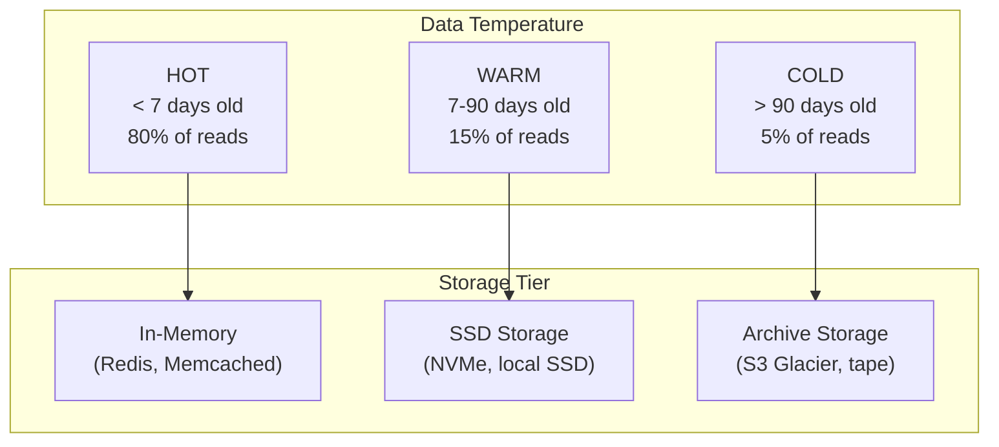
```mermaid
flowchart TD
    subgraph Temperature["Data Temperature"]
        HOT["HOT<br/>< 7 days old<br/>80% of reads"]
        WARM["WARM<br/>7-90 days old<br/>15% of reads"]
        COLD["COLD<br/>> 90 days old<br/>5% of reads"]
    end
    
    subgraph Storage["Storage Tier"]
        MEM["In-Memory<br/>(Redis, Memcached)"]
        SSD["SSD Storage<br/>(NVMe, local SSD)"]
        HDD["Archive Storage<br/>(S3 Glacier, tape)"]
    end
    
    HOT --> MEM
    WARM --> SSD
    COLD --> HDD
```

| Temperature | Access Latency Target | Storage Cost | Examples |
|-------------|----------------------|--------------|----------|
| **Hot** | < 10ms | $$$$$ | Active sessions, trending content |
| **Warm** | < 100ms | $$$ | Recent orders, user profiles |
| **Cold** | < 10s acceptable | $ | Archived logs, compliance data |

---

## Read-Heavy Optimization Strategies

### Strategy Stack for Read-Heavy Systems

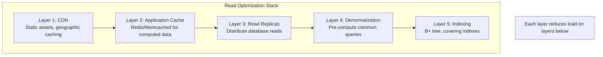
```mermaid
flowchart TB
    subgraph ReadStack["Read Optimization Stack"]
        L1["Layer 1: CDN<br/>Static assets, geographic caching"]
        L2["Layer 2: Application Cache<br/>Redis/Memcached for computed data"]
        L3["Layer 3: Read Replicas<br/>Distribute database reads"]
        L4["Layer 4: Denormalization<br/>Pre-compute common queries"]
        L5["Layer 5: Indexing<br/>B+ tree, covering indexes"]
    end
    
    L1 --> L2 --> L3 --> L4 --> L5
    
    Note["Each layer reduces load on layers below"]
```

### Caching Pattern Selection

| Pattern | Best For | Trade-off |
|---------|----------|-----------|
| **Cache-Aside** | General purpose, unpredictable access | App complexity, potential staleness |
| **Read-Through** | Predictable access, simpler code | Cache becomes critical path |
| **Write-Through** | Strong consistency requirements | Write latency increases |
| **Write-Behind** | Write-heavy with read caching | Complexity, potential data loss |

### Read Replica Topology

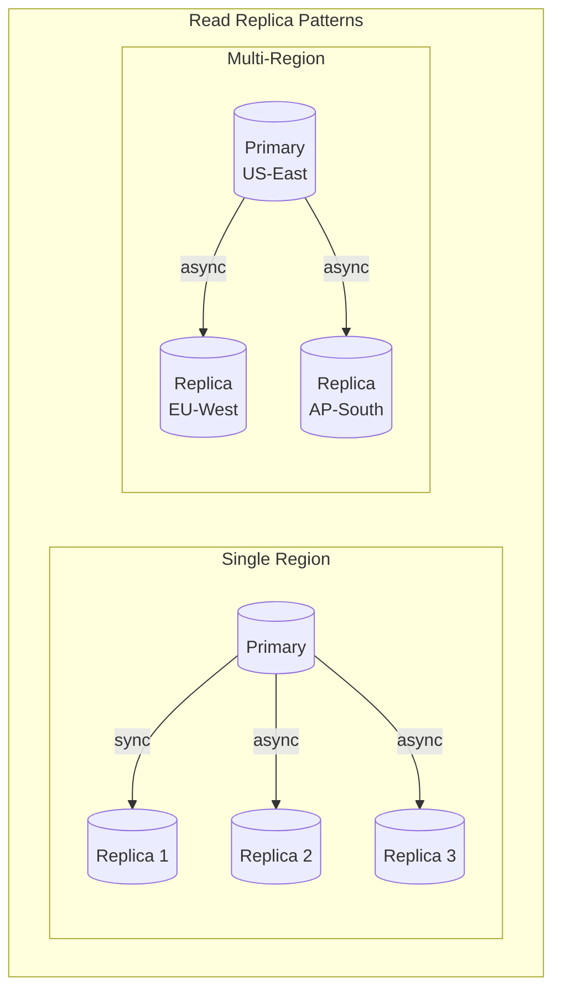
```mermaid
flowchart TB
    subgraph Topology["Read Replica Patterns"]
        subgraph SingleRegion["Single Region"]
            P1[(Primary)] -->|sync| R1[(Replica 1)]
            P1 -->|async| R2[(Replica 2)]
            P1 -->|async| R3[(Replica 3)]
        end
        
        subgraph MultiRegion["Multi-Region"]
            Primary[(Primary<br/>US-East)] -->|async| EU[(Replica<br/>EU-West)]
            Primary -->|async| APAC[(Replica<br/>AP-South)]
        end
    end
```

### Denormalization Patterns

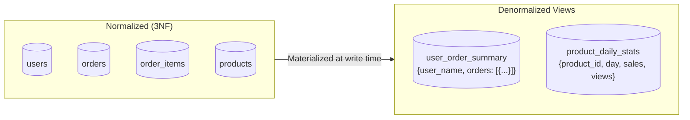
```mermaid
flowchart LR
    subgraph Normalized["Normalized (3NF)"]
        Users[(users)]
        Orders[(orders)]
        Items[(order_items)]
        Products[(products)]
    end
    
    subgraph Denormalized["Denormalized Views"]
        UserOrders[("user_order_summary<br/>{user_name, orders: [{...}]}")]
        ProductStats[("product_daily_stats<br/>{product_id, day, sales, views}")]
    end
    
    Normalized -->|"Materialized at write time"| Denormalized
```

**Implementation Example:**

```python
# Denormalization via event handler
class OrderCreatedHandler:
    def __init__(self, read_db, cache):
        self.read_db = read_db
        self.cache = cache
    
    def handle(self, event):
        # Update denormalized user orders summary
        self.read_db.user_orders.update_one(
            {'user_id': event['user_id']},
            {'$push': {
                'recent_orders': {
                    '$each': [{
                        'order_id': event['order_id'],
                        'total': event['total'],
                        'item_count': event['item_count'],
                        'created_at': event['timestamp']
                    }],
                    '$slice': -50  # Keep last 50 orders
                }
            }},
            upsert=True
        )
        
        # Invalidate cache
        self.cache.delete(f"user_orders:{event['user_id']}")
```

---

## Write-Heavy Optimization Strategies

### Strategy Stack for Write-Heavy Systems

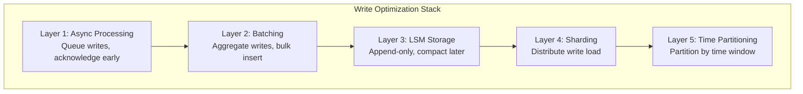
```mermaid
flowchart TB
    subgraph WriteStack["Write Optimization Stack"]
        W1["Layer 1: Async Processing<br/>Queue writes, acknowledge early"]
        W2["Layer 2: Batching<br/>Aggregate writes, bulk insert"]
        W3["Layer 3: LSM Storage<br/>Append-only, compact later"]
        W4["Layer 4: Sharding<br/>Distribute write load"]
        W5["Layer 5: Time Partitioning<br/>Partition by time window"]
    end
    
    W1 --> W2 --> W3 --> W4 --> W5
```

### Async Write Pattern

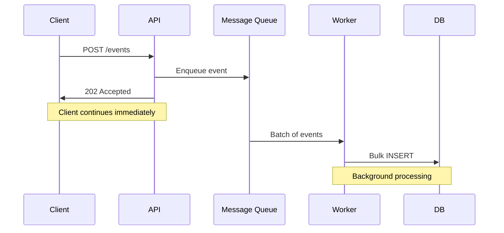
```mermaid
sequenceDiagram
    participant Client
    participant API
    participant Queue as Message Queue
    participant Worker
    participant DB
    
    Client->>API: POST /events
    API->>Queue: Enqueue event
    API->>Client: 202 Accepted
    
    Note over Client,API: Client continues immediately
    
    Queue->>Worker: Batch of events
    Worker->>DB: Bulk INSERT
    
    Note over Worker,DB: Background processing
```

**Implementation Example:**

```python
class EventIngestionService:
    def __init__(self, queue, batch_size=1000, flush_interval=5.0):
        self.queue = queue
        self.buffer = []
        self.batch_size = batch_size
        self.flush_interval = flush_interval
        self.last_flush = time.time()
    
    async def ingest(self, event):
        # Add to local buffer
        self.buffer.append(event)
        
        # Check flush conditions
        should_flush = (
            len(self.buffer) >= self.batch_size or
            time.time() - self.last_flush >= self.flush_interval
        )
        
        if should_flush:
            await self._flush()
        
        return {"status": "accepted", "event_id": event['id']}
    
    async def _flush(self):
        if not self.buffer:
            return
        
        batch = self.buffer
        self.buffer = []
        self.last_flush = time.time()
        
        # Send batch to queue for persistent processing
        await self.queue.send_batch(batch)
```

### LSM Tree vs B+ Tree

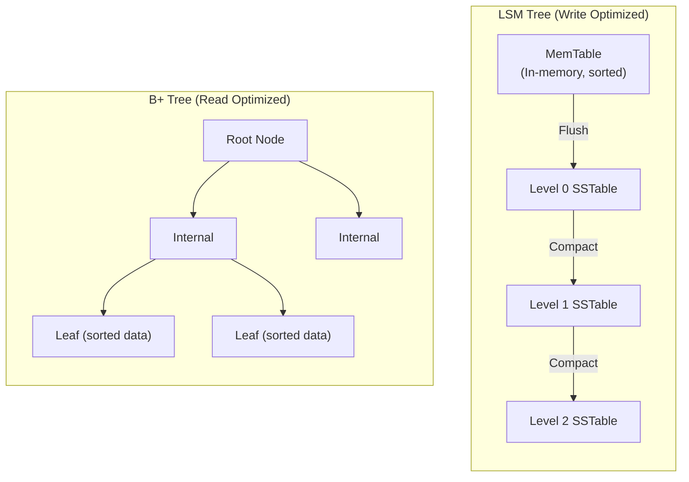
```mermaid
flowchart TB
    subgraph LSM["LSM Tree (Write Optimized)"]
        direction TB
        MEM1["MemTable<br/>(In-memory, sorted)"]
        MEM1 -->|"Flush"| L0["Level 0 SSTable"]
        L0 -->|"Compact"| L1["Level 1 SSTable"]
        L1 -->|"Compact"| L2["Level 2 SSTable"]
    end
    
    subgraph BTree["B+ Tree (Read Optimized)"]
        direction TB
        ROOT["Root Node"]
        ROOT --> INT1["Internal"]
        ROOT --> INT2["Internal"]
        INT1 --> LEAF1["Leaf (sorted data)"]
        INT1 --> LEAF2["Leaf (sorted data)"]
    end
```

| Characteristic | LSM Tree | B+ Tree |
|----------------|----------|---------|
| **Write performance** | Excellent (sequential) | Moderate (random I/O) |
| **Read performance** | Moderate (multiple levels) | Excellent (single path) |
| **Space amplification** | Higher (duplicates during compaction) | Lower |
| **Write amplification** | Higher (compaction rewrites) | Lower |
| **Use cases** | Time-series, logging, Cassandra | OLTP, PostgreSQL, MySQL |

### Sharding for Write Scalability

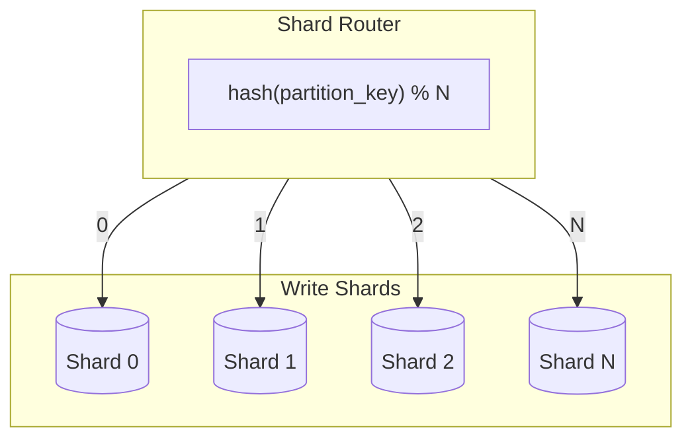
```mermaid
flowchart TB
    subgraph Router["Shard Router"]
        direction TB
        HASH["hash(partition_key) % N"]
    end
    
    subgraph Shards["Write Shards"]
        S0[(Shard 0)]
        S1[(Shard 1)]
        S2[(Shard 2)]
        S3[(Shard N)]
    end
    
    Router -->|"0"| S0
    Router -->|"1"| S1
    Router -->|"2"| S2
    Router -->|"N"| S3
```

**Partition Key Selection Criteria:**

| Criterion | Good Key | Bad Key |
|-----------|----------|---------|
| **Cardinality** | user_id (millions) | status (3 values) |
| **Distribution** | UUID (uniform) | created_date (temporal hotspot) |
| **Query alignment** | Keys in WHERE clause | Keys never queried |

---

## CQRS: Optimizing for Both

### Pattern Architecture

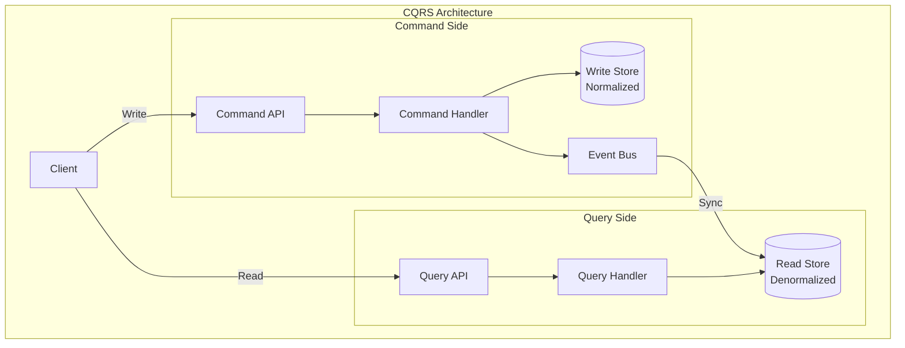
```mermaid
flowchart TB
    subgraph CQRS["CQRS Architecture"]
        Client["Client"]
        
        subgraph Commands["Command Side"]
            CmdAPI["Command API"]
            CmdHandler["Command Handler"]
            WriteDB[(Write Store<br/>Normalized)]
            Events["Event Bus"]
        end
        
        subgraph Queries["Query Side"]
            QueryAPI["Query API"]
            QueryHandler["Query Handler"]
            ReadDB[(Read Store<br/>Denormalized)]
        end
        
        Client -->|"Write"| CmdAPI
        CmdAPI --> CmdHandler
        CmdHandler --> WriteDB
        CmdHandler --> Events
        Events -->|"Sync"| ReadDB
        
        Client -->|"Read"| QueryAPI
        QueryAPI --> QueryHandler
        QueryHandler --> ReadDB
    end
```

### When to Use CQRS

| Consider CQRS When | Avoid CQRS When |
|-------------------|-----------------|
| Read/write models diverge significantly | Simple CRUD operations |
| Different scaling needs for reads vs writes | Small team, simple domain |
| Complex domain with event sourcing | Strong consistency required everywhere |
| Read optimization would pollute write model | Acceptable eventual consistency adds risk |

### Implementation Patterns

```python
# Command side - normalized writes
class PlaceOrderCommand:
    def __init__(self, write_db, event_bus):
        self.write_db = write_db
        self.event_bus = event_bus
    
    def execute(self, order_data):
        # Write to normalized schema
        with self.write_db.transaction():
            order = self.write_db.orders.insert({
                'id': generate_id(),
                'user_id': order_data['user_id'],
                'status': 'pending',
                'created_at': datetime.utcnow()
            })
            
            for item in order_data['items']:
                self.write_db.order_items.insert({
                    'order_id': order['id'],
                    'product_id': item['product_id'],
                    'quantity': item['quantity'],
                    'unit_price': item['price']
                })
        
        # Publish event for read model sync
        self.event_bus.publish('OrderPlaced', {
            'order_id': order['id'],
            'user_id': order_data['user_id'],
            'items': order_data['items'],
            'total': sum(i['price'] * i['quantity'] for i in order_data['items'])
        })
        
        return order['id']


# Query side - denormalized reads
class OrderQueryService:
    def __init__(self, read_db):
        self.read_db = read_db  # MongoDB, Elasticsearch, etc.
    
    def get_user_orders(self, user_id, limit=20):
        # Single read from denormalized collection
        return self.read_db.user_order_summaries.find_one(
            {'user_id': user_id},
            projection={'recent_orders': {'$slice': limit}}
        )
    
    def search_orders(self, query, filters):
        # Full-text search on read-optimized store
        return self.read_db.orders_search.search({
            'query': query,
            'filters': filters
        })


# Event handler syncs read model
class OrderEventHandler:
    def __init__(self, read_db):
        self.read_db = read_db
    
    def handle_order_placed(self, event):
        # Denormalize into user-centric view
        self.read_db.user_order_summaries.update_one(
            {'user_id': event['user_id']},
            {
                '$push': {
                    'recent_orders': {
                        '$each': [{
                            'order_id': event['order_id'],
                            'total': event['total'],
                            'item_count': len(event['items']),
                            'placed_at': datetime.utcnow()
                        }],
                        '$sort': {'placed_at': -1},
                        '$slice': 100
                    }
                },
                '$inc': {'total_orders': 1, 'lifetime_value': event['total']}
            },
            upsert=True
        )
```

---

## Hot Partition Mitigation

### The Problem

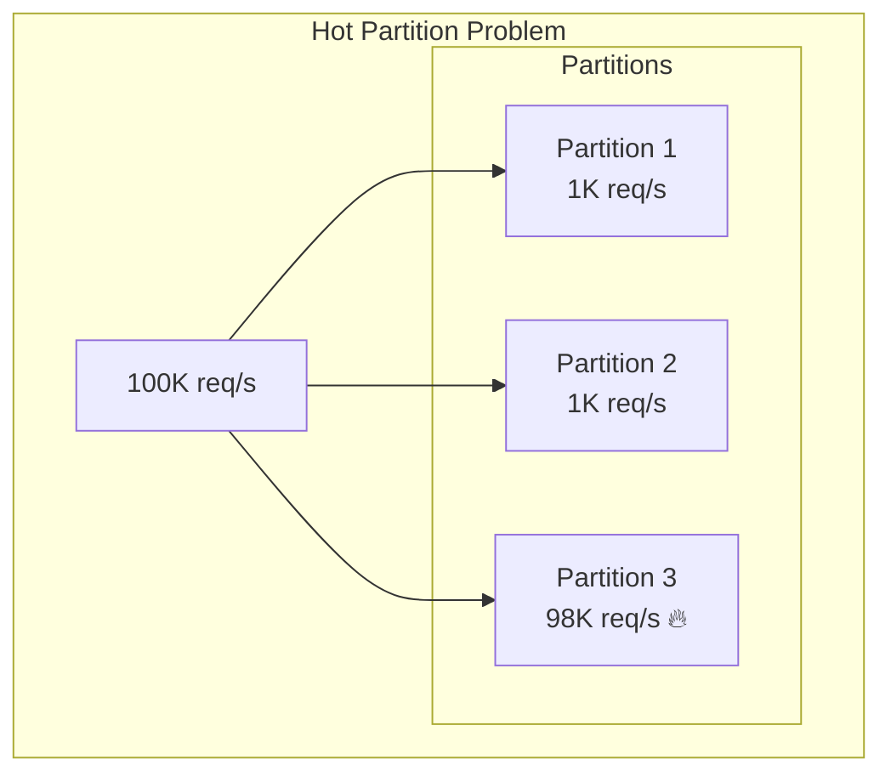
```mermaid
flowchart TB
    subgraph Problem["Hot Partition Problem"]
        Traffic["100K req/s"]
        
        subgraph Shards["Partitions"]
            S1["Partition 1<br/>1K req/s"]
            S2["Partition 2<br/>1K req/s"]
            HOT["Partition 3<br/>98K req/s 🔥"]
        end
    end
    
    Traffic --> S1
    Traffic --> S2
    Traffic --> HOT
```

### Common Causes

| Cause | Example | Solution |
|-------|---------|----------|
| **Celebrity users** | Viral post, popular account | Fan-out on write, separate queues |
| **Temporal clustering** | Events by timestamp | Add random suffix, composite keys |
| **Low-cardinality keys** | Status field as partition key | Choose different key |
| **Skewed distribution** | Geographic concentration | Sub-partition hot regions |

### Mitigation Strategies

**Strategy 1: Salting (Key Spreading)**

```python
# Instead of: partition_key = user_id
# Use: partition_key = f"{user_id}_{random.randint(0, N-1)}"

class SaltedPartitioner:
    def __init__(self, salt_factor=10):
        self.salt_factor = salt_factor
    
    def write_key(self, base_key):
        # Spread writes across N sub-partitions
        salt = hash(f"{base_key}_{time.time()}") % self.salt_factor
        return f"{base_key}#{salt}"
    
    def read_keys(self, base_key):
        # Read must query all sub-partitions
        return [f"{base_key}#{i}" for i in range(self.salt_factor)]
```

**Strategy 2: Fan-Out on Write**

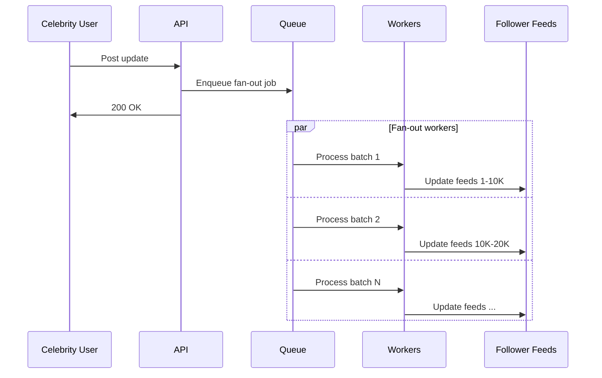
```mermaid
sequenceDiagram
    participant User as Celebrity User
    participant API
    participant Queue
    participant Workers
    participant Followers as Follower Feeds
    
    User->>API: Post update
    API->>Queue: Enqueue fan-out job
    API->>User: 200 OK
    
    par Fan-out workers
        Queue->>Workers: Process batch 1
        Workers->>Followers: Update feeds 1-10K
    and
        Queue->>Workers: Process batch 2
        Workers->>Followers: Update feeds 10K-20K
    and
        Queue->>Workers: Process batch N
        Workers->>Followers: Update feeds ...
    end
```

**Strategy 3: Separate Hot Path**

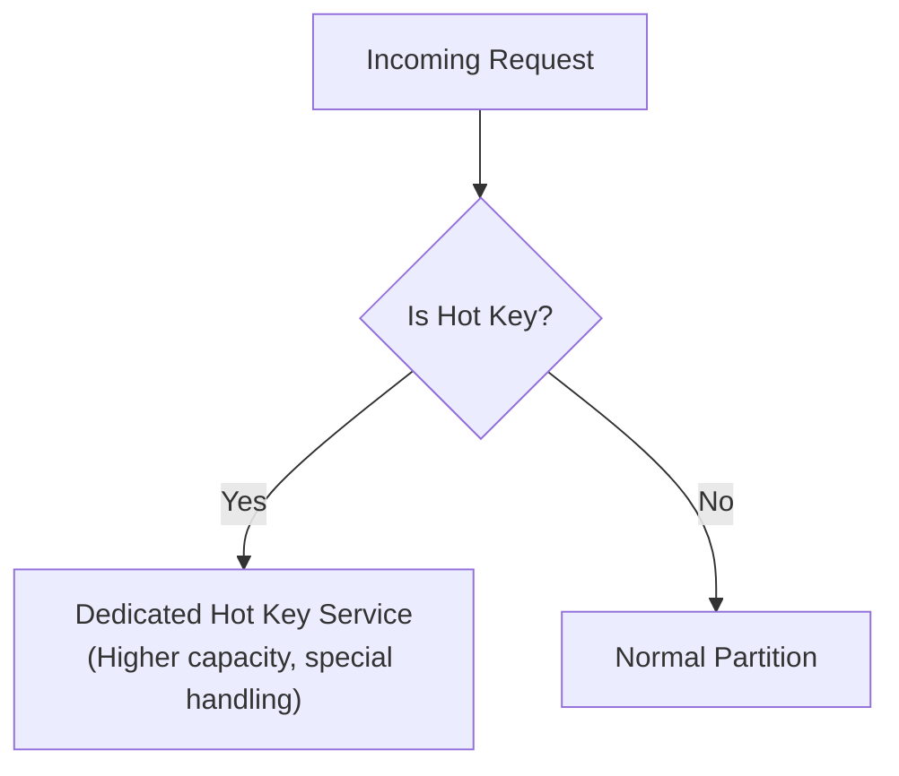
```mermaid
flowchart TD
    Request["Incoming Request"]
    Check{Is Hot Key?}
    
    Request --> Check
    Check -->|Yes| HotPath["Dedicated Hot Key Service<br/>(Higher capacity, special handling)"]
    Check -->|No| NormalPath["Normal Partition"]
```

---

## Tiered Storage Architecture

### Implementation Pattern

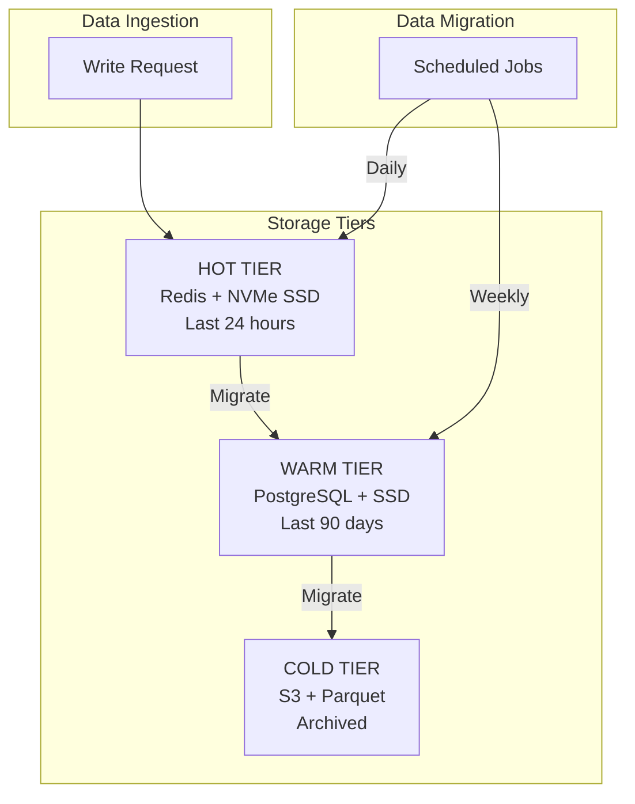
```mermaid
flowchart TB
    subgraph Ingestion["Data Ingestion"]
        Write["Write Request"]
    end
    
    subgraph Tiers["Storage Tiers"]
        HOT["HOT TIER<br/>Redis + NVMe SSD<br/>Last 24 hours"]
        WARM["WARM TIER<br/>PostgreSQL + SSD<br/>Last 90 days"]
        COLD["COLD TIER<br/>S3 + Parquet<br/>Archived"]
    end
    
    subgraph Migration["Data Migration"]
        Timer["Scheduled Jobs"]
    end
    
    Write --> HOT
    Timer -->|"Daily"| HOT
    HOT -->|"Migrate"| WARM
    Timer -->|"Weekly"| WARM
    WARM -->|"Migrate"| COLD
```

### Query Routing

```python
class TieredQueryRouter:
    def __init__(self, hot_store, warm_store, cold_store):
        self.hot_store = hot_store    # Redis
        self.warm_store = warm_store  # PostgreSQL
        self.cold_store = cold_store  # S3 + Athena
    
    def query(self, time_range):
        now = datetime.utcnow()
        results = []
        
        # Determine which tiers to query
        if time_range.end > now - timedelta(hours=24):
            results.extend(self.hot_store.query(time_range))
        
        if time_range.start < now - timedelta(hours=24) and \
           time_range.end > now - timedelta(days=90):
            results.extend(self.warm_store.query(time_range))
        
        if time_range.start < now - timedelta(days=90):
            results.extend(self.cold_store.query(time_range))
        
        return self._merge_and_dedupe(results)
```

### Cost Optimization

| Tier | Storage Cost | Query Cost | Latency | SLA |
|------|-------------|------------|---------|-----|
| **Hot** | $0.10/GB/month | Included | < 10ms | 99.99% |
| **Warm** | $0.02/GB/month | $0.001/query | < 100ms | 99.9% |
| **Cold** | $0.004/GB/month | $0.005/GB scanned | < 30s | 99% |

---

## Capacity Planning Framework

### Estimation Template

```
┌─────────────────────────────────────────────────────────────────┐
│                    CAPACITY ESTIMATION                          │
├─────────────────────────────────────────────────────────────────┤
│ INPUTS                                                          │
│   • Users: _______ DAU                                          │
│   • Actions per user per day: _______                           │
│   • Data per action: _______ bytes                              │
│   • Read:Write ratio: _______                                   │
│   • Peak:Average ratio: _______                                 │
├─────────────────────────────────────────────────────────────────┤
│ CALCULATIONS                                                    │
│                                                                 │
│   Average RPS = (DAU × Actions) / 86,400                        │
│   Peak RPS = Average RPS × Peak ratio                           │
│                                                                 │
│   Write RPS = Total RPS / (1 + Read:Write ratio)                │
│   Read RPS = Total RPS - Write RPS                              │
│                                                                 │
│   Storage/day = DAU × Actions × Data size                       │
│   Storage/year = Storage/day × 365                              │
│                                                                 │
│   Bandwidth = Peak RPS × Response size                          │
├─────────────────────────────────────────────────────────────────┤
│ EXAMPLE: Social Media Feed                                      │
│                                                                 │
│   100M DAU, 50 actions/day, 5KB response, 100:1 R:W, 3x peak   │
│                                                                 │
│   Avg RPS = (100M × 50) / 86,400 = 58K RPS                     │
│   Peak RPS = 58K × 3 = 174K RPS                                │
│   Write RPS = 174K / 101 = 1.7K RPS                            │
│   Read RPS = 172K RPS                                          │
│                                                                 │
│   Bandwidth = 174K × 5KB = 870 MB/s = ~7 Gbps                  │
└─────────────────────────────────────────────────────────────────┘
```

### Resource Sizing Guidelines

| Component | Sizing Heuristic |
|-----------|-----------------|
| **Web servers** | 1 server per 1-5K RPS (depends on complexity) |
| **Redis** | 1 node per 100K ops/s, 1GB RAM per 1M keys |
| **PostgreSQL** | 1 primary per 10-50K QPS, add replicas for reads |
| **Kafka** | 1 partition per 10K msg/s, 3-5 brokers per cluster |
| **Elasticsearch** | 1 node per 20-50GB active data |

---

## Interview Scenarios

### Scenario 1: News Feed System

**Requirements**: 500M users, each follows 200 users on average, 10M posts/day

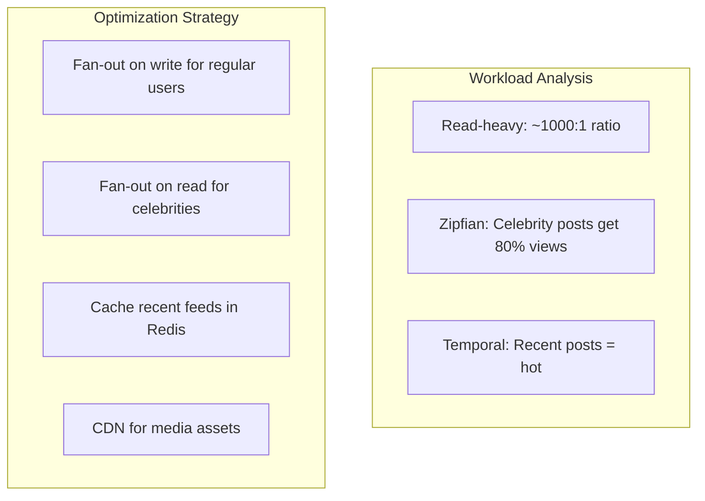
```mermaid
flowchart TB
    subgraph Analysis["Workload Analysis"]
        A1["Read-heavy: ~1000:1 ratio"]
        A2["Zipfian: Celebrity posts get 80% views"]
        A3["Temporal: Recent posts = hot"]
    end
    
    subgraph Solution["Optimization Strategy"]
        S1["Fan-out on write for regular users"]
        S2["Fan-out on read for celebrities"]
        S3["Cache recent feeds in Redis"]
        S4["CDN for media assets"]
    end
```

**Talking Points**:
- Hybrid fan-out: Pre-compute for users with < 10K followers, lazy load for celebrities
- Feed cache: Last 200 posts per user in Redis, older in persistent store
- Edge caching: Profile images, media via CDN
- Write optimization: Async fan-out via Kafka, batch updates to feed stores

### Scenario 2: Real-Time Analytics

**Requirements**: 1M events/second, dashboards update every second

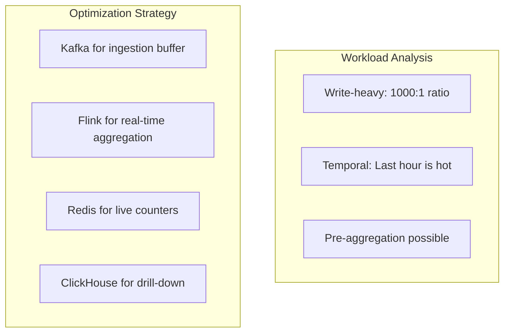
```mermaid
flowchart TB
    subgraph Analysis["Workload Analysis"]
        A1["Write-heavy: 1000:1 ratio"]
        A2["Temporal: Last hour is hot"]
        A3["Pre-aggregation possible"]
    end
    
    subgraph Solution["Optimization Strategy"]
        S1["Kafka for ingestion buffer"]
        S2["Flink for real-time aggregation"]
        S3["Redis for live counters"]
        S4["ClickHouse for drill-down"]
    end
```

**Talking Points**:
- Stream processing: Aggregate in real-time, don't query raw events
- Pre-aggregation: Store 1-min, 5-min, 1-hour rollups
- Tiered storage: Live in Redis, recent in ClickHouse, archived in S3
- Read path: Dashboard reads pre-computed aggregates, not raw events

### Scenario 3: E-Commerce Inventory

**Requirements**: 10M products, 100K orders/day, real-time stock levels

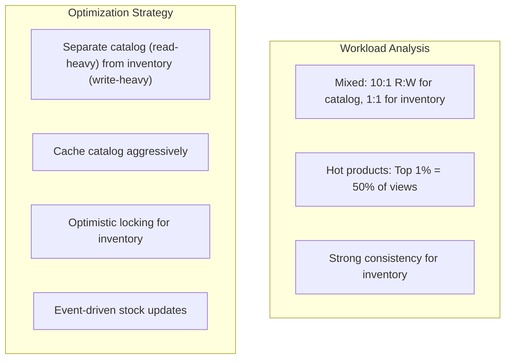
```mermaid
flowchart TB
    subgraph Analysis["Workload Analysis"]
        A1["Mixed: 10:1 R:W for catalog, 1:1 for inventory"]
        A2["Hot products: Top 1% = 50% of views"]
        A3["Strong consistency for inventory"]
    end
    
    subgraph Solution["Optimization Strategy"]
        S1["Separate catalog (read-heavy) from inventory (write-heavy)"]
        S2["Cache catalog aggressively"]
        S3["Optimistic locking for inventory"]
        S4["Event-driven stock updates"]
    end
```

**Talking Points**:
- CQRS: Separate read model (catalog) from write model (inventory)
- Catalog: Heavy caching, CDN for images, eventual consistency OK
- Inventory: Optimistic concurrency, no caching (or short TTL), strong consistency
- Hot products: Dedicated inventory partitions for high-velocity items

---

## Decision Framework

### Workload Optimization Decision Tree

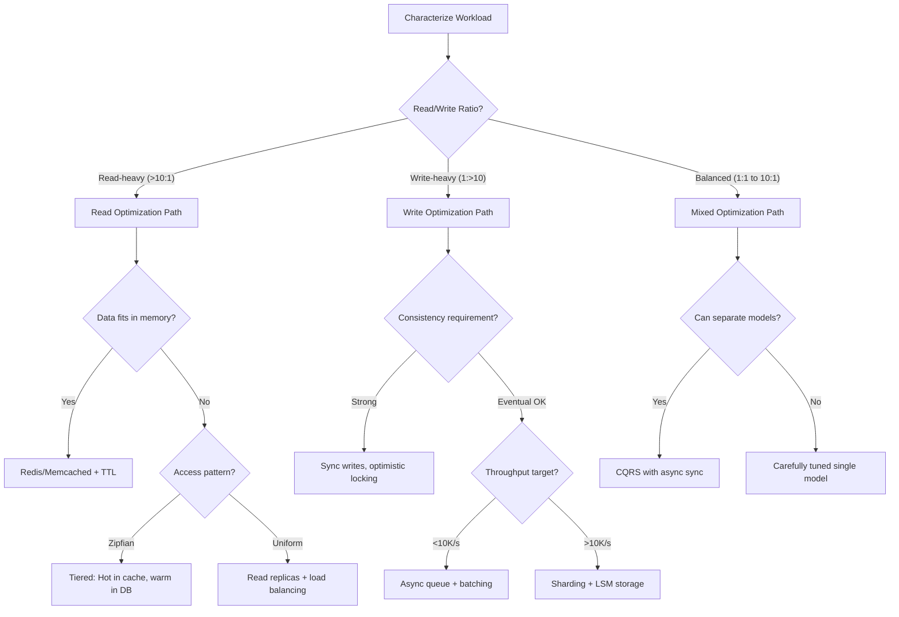
```mermaid
flowchart TD
    Start["Characterize Workload"] --> RW{Read/Write Ratio?}
    
    RW -->|"Read-heavy (>10:1)"| ReadPath["Read Optimization Path"]
    RW -->|"Write-heavy (1:>10)"| WritePath["Write Optimization Path"]
    RW -->|"Balanced (1:1 to 10:1)"| MixedPath["Mixed Optimization Path"]
    
    ReadPath --> R1{Data fits in memory?}
    R1 -->|Yes| R2["Redis/Memcached + TTL"]
    R1 -->|No| R3{Access pattern?}
    R3 -->|Zipfian| R4["Tiered: Hot in cache, warm in DB"]
    R3 -->|Uniform| R5["Read replicas + load balancing"]
    
    WritePath --> W1{Consistency requirement?}
    W1 -->|Strong| W2["Sync writes, optimistic locking"]
    W1 -->|Eventual OK| W3{Throughput target?}
    W3 -->|"<10K/s"| W4["Async queue + batching"]
    W3 -->|">10K/s"| W5["Sharding + LSM storage"]
    
    MixedPath --> M1{Can separate models?}
    M1 -->|Yes| M2["CQRS with async sync"]
    M1 -->|No| M3["Carefully tuned single model"]
```

---

## Common Interview Questions

| Question | Key Points to Cover |
|----------|-------------------|
| "How would you optimize a read-heavy system?" | Caching layers, read replicas, CDN, denormalization, indexing |
| "Your database can't handle write load. What do you do?" | Async writes, batching, sharding, LSM storage, CQRS |
| "Explain fan-out on write vs fan-out on read" | Write: pre-compute at write time (better UX, more storage); Read: compute at read time (less storage, higher latency) |
| "How do you handle hot partitions?" | Salting, separate hot path, fan-out, sub-partitioning |
| "When would you use CQRS?" | Different scaling needs, complex domains, when read/write models diverge significantly |

### Red Flags to Avoid

❌ Optimizing before understanding the workload  
✓ Always characterize read/write ratio and access patterns first

❌ Applying one-size-fits-all solutions  
✓ Different workloads need different strategies

❌ Ignoring consistency requirements  
✓ State consistency constraints before choosing eventual consistency patterns

❌ Over-engineering from the start  
✓ Start simple, optimize specific bottlenecks as they emerge

---

## Connections to Other Concepts

| Related Topic | Connection |
|---------------|------------|
| [Caching & Content Delivery](./04_CACHING_AND_CONTENT_DELIVERY.md) | Caching is the primary read optimization technique |
| [Data Storage & Access](./03_DATA_STORAGE_AND_ACCESS.md) | Database choice should match workload characteristics |
| [Distributed System Patterns](./06_DISTRIBUTED_SYSTEM_PATTERNS.md) | Read replicas are key for read scaling |
| [Foundational Concepts](./01_FOUNDATIONAL_CONCEPTS.md) | Workload optimization balances latency/throughput trade-offs |

---

## Quick Reference Card

```
┌─────────────────────────────────────────────────────────────────┐
│              WORKLOAD OPTIMIZATION QUICK REFERENCE               │
├─────────────────────────────────────────────────────────────────┤
│                                                                  │
│  STEP 1: CHARACTERIZE                                            │
│  ─────────────────────                                           │
│  • Read:Write ratio (100:1? 1:1? 1:100?)                         │
│  • Access pattern (uniform, zipfian, temporal)                   │
│  • Data temperature (hot/warm/cold distribution)                 │
│  • Consistency requirements (strong vs eventual)                 │
│                                                                  │
├─────────────────────────────────────────────────────────────────┤
│                                                                  │
│  READ-HEAVY TOOLKIT                                              │
│  ──────────────────                                              │
│  • CDN for static/geographic                                     │
│  • Redis/Memcached for computed data                             │
│  • Read replicas for DB scaling                                  │
│  • Denormalization for complex queries                           │
│  • Covering indexes to avoid table lookups                       │
│                                                                  │
├─────────────────────────────────────────────────────────────────┤
│                                                                  │
│  WRITE-HEAVY TOOLKIT                                             │
│  ───────────────────                                             │
│  • Async writes via message queue                                │
│  • Batching to amortize overhead                                 │
│  • LSM trees for sequential writes                               │
│  • Sharding for horizontal scale                                 │
│  • Time partitioning for temporal data                           │
│                                                                  │
├─────────────────────────────────────────────────────────────────┤
│                                                                  │
│  MIXED WORKLOAD                                                  │
│  ──────────────                                                  │
│  • CQRS: Separate read/write models                              │
│  • Event-driven sync between models                              │
│  • Different storage per model                                   │
│                                                                  │
├─────────────────────────────────────────────────────────────────┤
│                                                                  │
│  HOT PARTITION FIXES                                             │
│  ───────────────────                                             │
│  • Salting (spread keys with suffix)                             │
│  • Fan-out on write (pre-distribute)                             │
│  • Separate hot path (dedicated resources)                       │
│                                                                  │
├─────────────────────────────────────────────────────────────────┤
│                                                                  │
│  INTERVIEW FRAMEWORK                                             │
│  ───────────────────                                             │
│  1. "First, I'd characterize the workload..."                    │
│  2. "Given this is [read/write]-heavy, I'd focus on..."          │
│  3. "The trade-off here is [X] vs [Y]..."                        │
│  4. "We can mitigate by..."                                      │
│                                                                  │
└─────────────────────────────────────────────────────────────────┘
```

---

## Practice Questions

1. Design a system to handle viral content with unpredictable traffic spikes.
2. How would you optimize a logging system ingesting 10 million events per second?
3. Compare tiered storage approaches for a time-series database with 5 years of data.
4. Design the write path for a collaborative document editor with real-time sync.
5. Explain how you'd migrate from a monolithic database to a CQRS architecture.

---

*Previous: [07 - Scaling & Infrastructure](./07_SCALING_AND_INFRASTRUCTURE.md) | Next: [09 - Quick Reference](./09_QUICK_REFERENCE.md)*
