# 08 - Workload Optimization

## Overview

Workload optimization is the discipline of analyzing system access patterns and applying targeted strategies to maximize performance, efficiency, and cost-effectiveness. Unlike generic scaling approaches, workload optimization begins with understanding *what* your system actually does—then tailoring architecture decisions to those specific patterns. This document provides frameworks for characterizing workloads, selecting optimization strategies, and articulating trade-offs in interview settings.

---

## Core Mental Model


**Key Insight**: The most common interview mistake is applying optimization techniques without first characterizing the workload. Always start with: "What's the read/write ratio?" and "What are the access patterns?"

---

## Workload Characterization Framework

### The Five Dimensions

Every workload can be characterized across five dimensions. Understanding these drives all subsequent optimization decisions.


### Read/Write Ratio Analysis

| Ratio | System Type | Primary Strategy |
|-------|-------------|------------------|
| **100:1+** | Content platforms, CDNs | Aggressive caching, read replicas |
| **10:1** | E-commerce catalogs, social feeds | Cache-aside + denormalization |
| **1:1** | Collaborative tools, messaging | CQRS, optimized for both |
| **1:10** | Logging, IoT telemetry | Async writes, LSM trees, batching |
| **1:100+** | Time-series, analytics ingestion | Append-only, stream processing |

### Access Pattern Classification


### Data Temperature Model

Data "temperature" describes how frequently data is accessed over time.


| Temperature | Access Latency Target | Storage Cost | Examples |
|-------------|----------------------|--------------|----------|
| **Hot** | < 10ms | $$$$$ | Active sessions, trending content |
| **Warm** | < 100ms | $$$ | Recent orders, user profiles |
| **Cold** | < 10s acceptable | $ | Archived logs, compliance data |

---

## Read-Heavy Optimization Strategies

### Strategy Stack for Read-Heavy Systems


### Caching Pattern Selection

| Pattern | Best For | Trade-off |
|---------|----------|-----------|
| **Cache-Aside** | General purpose, unpredictable access | App complexity, potential staleness |
| **Read-Through** | Predictable access, simpler code | Cache becomes critical path |
| **Write-Through** | Strong consistency requirements | Write latency increases |
| **Write-Behind** | Write-heavy with read caching | Complexity, potential data loss |

### Read Replica Topology


### Denormalization Patterns


**Implementation Example:**

```python
# Denormalization via event handler
class OrderCreatedHandler:
    def __init__(self, read_db, cache):
        self.read_db = read_db
        self.cache = cache
    
    def handle(self, event):
        # Update denormalized user orders summary
        self.read_db.user_orders.update_one(
            {'user_id': event['user_id']},
            {'$push': {
                'recent_orders': {
                    '$each': [{
                        'order_id': event['order_id'],
                        'total': event['total'],
                        'item_count': event['item_count'],
                        'created_at': event['timestamp']
                    }],
                    '$slice': -50  # Keep last 50 orders
                }
            }},
            upsert=True
        )
        
        # Invalidate cache
        self.cache.delete(f"user_orders:{event['user_id']}")
```

---

## Write-Heavy Optimization Strategies

### Strategy Stack for Write-Heavy Systems


### Async Write Pattern


**Implementation Example:**

```python
class EventIngestionService:
    def __init__(self, queue, batch_size=1000, flush_interval=5.0):
        self.queue = queue
        self.buffer = []
        self.batch_size = batch_size
        self.flush_interval = flush_interval
        self.last_flush = time.time()
    
    async def ingest(self, event):
        # Add to local buffer
        self.buffer.append(event)
        
        # Check flush conditions
        should_flush = (
            len(self.buffer) >= self.batch_size or
            time.time() - self.last_flush >= self.flush_interval
        )
        
        if should_flush:
            await self._flush()
        
        return {"status": "accepted", "event_id": event['id']}
    
    async def _flush(self):
        if not self.buffer:
            return
        
        batch = self.buffer
        self.buffer = []
        self.last_flush = time.time()
        
        # Send batch to queue for persistent processing
        await self.queue.send_batch(batch)
```

### LSM Tree vs B+ Tree


| Characteristic | LSM Tree | B+ Tree |
|----------------|----------|---------|
| **Write performance** | Excellent (sequential) | Moderate (random I/O) |
| **Read performance** | Moderate (multiple levels) | Excellent (single path) |
| **Space amplification** | Higher (duplicates during compaction) | Lower |
| **Write amplification** | Higher (compaction rewrites) | Lower |
| **Use cases** | Time-series, logging, Cassandra | OLTP, PostgreSQL, MySQL |

### Sharding for Write Scalability


**Partition Key Selection Criteria:**

| Criterion | Good Key | Bad Key |
|-----------|----------|---------|
| **Cardinality** | user_id (millions) | status (3 values) |
| **Distribution** | UUID (uniform) | created_date (temporal hotspot) |
| **Query alignment** | Keys in WHERE clause | Keys never queried |

---

## CQRS: Optimizing for Both

### Pattern Architecture


### When to Use CQRS

| Consider CQRS When | Avoid CQRS When |
|-------------------|-----------------|
| Read/write models diverge significantly | Simple CRUD operations |
| Different scaling needs for reads vs writes | Small team, simple domain |
| Complex domain with event sourcing | Strong consistency required everywhere |
| Read optimization would pollute write model | Acceptable eventual consistency adds risk |

### Implementation Patterns

```python
# Command side - normalized writes
class PlaceOrderCommand:
    def __init__(self, write_db, event_bus):
        self.write_db = write_db
        self.event_bus = event_bus
    
    def execute(self, order_data):
        # Write to normalized schema
        with self.write_db.transaction():
            order = self.write_db.orders.insert({
                'id': generate_id(),
                'user_id': order_data['user_id'],
                'status': 'pending',
                'created_at': datetime.utcnow()
            })
            
            for item in order_data['items']:
                self.write_db.order_items.insert({
                    'order_id': order['id'],
                    'product_id': item['product_id'],
                    'quantity': item['quantity'],
                    'unit_price': item['price']
                })
        
        # Publish event for read model sync
        self.event_bus.publish('OrderPlaced', {
            'order_id': order['id'],
            'user_id': order_data['user_id'],
            'items': order_data['items'],
            'total': sum(i['price'] * i['quantity'] for i in order_data['items'])
        })
        
        return order['id']


# Query side - denormalized reads
class OrderQueryService:
    def __init__(self, read_db):
        self.read_db = read_db  # MongoDB, Elasticsearch, etc.
    
    def get_user_orders(self, user_id, limit=20):
        # Single read from denormalized collection
        return self.read_db.user_order_summaries.find_one(
            {'user_id': user_id},
            projection={'recent_orders': {'$slice': limit}}
        )
    
    def search_orders(self, query, filters):
        # Full-text search on read-optimized store
        return self.read_db.orders_search.search({
            'query': query,
            'filters': filters
        })


# Event handler syncs read model
class OrderEventHandler:
    def __init__(self, read_db):
        self.read_db = read_db
    
    def handle_order_placed(self, event):
        # Denormalize into user-centric view
        self.read_db.user_order_summaries.update_one(
            {'user_id': event['user_id']},
            {
                '$push': {
                    'recent_orders': {
                        '$each': [{
                            'order_id': event['order_id'],
                            'total': event['total'],
                            'item_count': len(event['items']),
                            'placed_at': datetime.utcnow()
                        }],
                        '$sort': {'placed_at': -1},
                        '$slice': 100
                    }
                },
                '$inc': {'total_orders': 1, 'lifetime_value': event['total']}
            },
            upsert=True
        )
```

---

## Hot Partition Mitigation

### The Problem

```mermaid
flowchart TB
    subgraph Problem["Hot Partition Problem"]
        Traffic["100K req/s"]
        
        subgraph Shards["Partitions"]
            S1["Partition 1<br/>1K req/s"]
            S2["Partition 2<br/>1K req/s"]
            HOT["Partition 3<br/>98K req/s 🔥"]
        end
    end
    
    Traffic --> S1
    Traffic --> S2
    Traffic --> HOT
```



### Common Causes

| Cause | Example | Solution |
|-------|---------|----------|
| **Celebrity users** | Viral post, popular account | Fan-out on write, separate queues |
| **Temporal clustering** | Events by timestamp | Add random suffix, composite keys |
| **Low-cardinality keys** | Status field as partition key | Choose different key |
| **Skewed distribution** | Geographic concentration | Sub-partition hot regions |

### Mitigation Strategies

**Strategy 1: Salting (Key Spreading)**

```python
# Instead of: partition_key = user_id
# Use: partition_key = f"{user_id}_{random.randint(0, N-1)}"

class SaltedPartitioner:
    def __init__(self, salt_factor=10):
        self.salt_factor = salt_factor
    
    def write_key(self, base_key):
        # Spread writes across N sub-partitions
        salt = hash(f"{base_key}_{time.time()}") % self.salt_factor
        return f"{base_key}#{salt}"
    
    def read_keys(self, base_key):
        # Read must query all sub-partitions
        return [f"{base_key}#{i}" for i in range(self.salt_factor)]
```

**Strategy 2: Fan-Out on Write**


**Strategy 3: Separate Hot Path**


---

## Tiered Storage Architecture

### Implementation Pattern


### Query Routing

```python
class TieredQueryRouter:
    def __init__(self, hot_store, warm_store, cold_store):
        self.hot_store = hot_store    # Redis
        self.warm_store = warm_store  # PostgreSQL
        self.cold_store = cold_store  # S3 + Athena
    
    def query(self, time_range):
        now = datetime.utcnow()
        results = []
        
        # Determine which tiers to query
        if time_range.end > now - timedelta(hours=24):
            results.extend(self.hot_store.query(time_range))
        
        if time_range.start < now - timedelta(hours=24) and \
           time_range.end > now - timedelta(days=90):
            results.extend(self.warm_store.query(time_range))
        
        if time_range.start < now - timedelta(days=90):
            results.extend(self.cold_store.query(time_range))
        
        return self._merge_and_dedupe(results)
```

### Cost Optimization

| Tier | Storage Cost | Query Cost | Latency | SLA |
|------|-------------|------------|---------|-----|
| **Hot** | $0.10/GB/month | Included | < 10ms | 99.99% |
| **Warm** | $0.02/GB/month | $0.001/query | < 100ms | 99.9% |
| **Cold** | $0.004/GB/month | $0.005/GB scanned | < 30s | 99% |

---

## Capacity Planning Framework

### Estimation Template

```
┌─────────────────────────────────────────────────────────────────┐
│                    CAPACITY ESTIMATION                          │
├─────────────────────────────────────────────────────────────────┤
│ INPUTS                                                          │
│   • Users: _______ DAU                                          │
│   • Actions per user per day: _______                           │
│   • Data per action: _______ bytes                              │
│   • Read:Write ratio: _______                                   │
│   • Peak:Average ratio: _______                                 │
├─────────────────────────────────────────────────────────────────┤
│ CALCULATIONS                                                    │
│                                                                 │
│   Average RPS = (DAU × Actions) / 86,400                        │
│   Peak RPS = Average RPS × Peak ratio                           │
│                                                                 │
│   Write RPS = Total RPS / (1 + Read:Write ratio)                │
│   Read RPS = Total RPS - Write RPS                              │
│                                                                 │
│   Storage/day = DAU × Actions × Data size                       │
│   Storage/year = Storage/day × 365                              │
│                                                                 │
│   Bandwidth = Peak RPS × Response size                          │
├─────────────────────────────────────────────────────────────────┤
│ EXAMPLE: Social Media Feed                                      │
│                                                                 │
│   100M DAU, 50 actions/day, 5KB response, 100:1 R:W, 3x peak   │
│                                                                 │
│   Avg RPS = (100M × 50) / 86,400 = 58K RPS                     │
│   Peak RPS = 58K × 3 = 174K RPS                                │
│   Write RPS = 174K / 101 = 1.7K RPS                            │
│   Read RPS = 172K RPS                                          │
│                                                                 │
│   Bandwidth = 174K × 5KB = 870 MB/s = ~7 Gbps                  │
└─────────────────────────────────────────────────────────────────┘
```

### Resource Sizing Guidelines

| Component | Sizing Heuristic |
|-----------|-----------------|
| **Web servers** | 1 server per 1-5K RPS (depends on complexity) |
| **Redis** | 1 node per 100K ops/s, 1GB RAM per 1M keys |
| **PostgreSQL** | 1 primary per 10-50K QPS, add replicas for reads |
| **Kafka** | 1 partition per 10K msg/s, 3-5 brokers per cluster |
| **Elasticsearch** | 1 node per 20-50GB active data |

---

## Interview Scenarios

### Scenario 1: News Feed System

**Requirements**: 500M users, each follows 200 users on average, 10M posts/day


**Talking Points**:
- Hybrid fan-out: Pre-compute for users with < 10K followers, lazy load for celebrities
- Feed cache: Last 200 posts per user in Redis, older in persistent store
- Edge caching: Profile images, media via CDN
- Write optimization: Async fan-out via Kafka, batch updates to feed stores

### Scenario 2: Real-Time Analytics

**Requirements**: 1M events/second, dashboards update every second


**Talking Points**:
- Stream processing: Aggregate in real-time, don't query raw events
- Pre-aggregation: Store 1-min, 5-min, 1-hour rollups
- Tiered storage: Live in Redis, recent in ClickHouse, archived in S3
- Read path: Dashboard reads pre-computed aggregates, not raw events

### Scenario 3: E-Commerce Inventory

**Requirements**: 10M products, 100K orders/day, real-time stock levels


**Talking Points**:
- CQRS: Separate read model (catalog) from write model (inventory)
- Catalog: Heavy caching, CDN for images, eventual consistency OK
- Inventory: Optimistic concurrency, no caching (or short TTL), strong consistency
- Hot products: Dedicated inventory partitions for high-velocity items

---

## Decision Framework

### Workload Optimization Decision Tree


---

## Common Interview Questions

| Question | Key Points to Cover |
|----------|-------------------|
| "How would you optimize a read-heavy system?" | Caching layers, read replicas, CDN, denormalization, indexing |
| "Your database can't handle write load. What do you do?" | Async writes, batching, sharding, LSM storage, CQRS |
| "Explain fan-out on write vs fan-out on read" | Write: pre-compute at write time (better UX, more storage); Read: compute at read time (less storage, higher latency) |
| "How do you handle hot partitions?" | Salting, separate hot path, fan-out, sub-partitioning |
| "When would you use CQRS?" | Different scaling needs, complex domains, when read/write models diverge significantly |

### Red Flags to Avoid

❌ Optimizing before understanding the workload  
✓ Always characterize read/write ratio and access patterns first

❌ Applying one-size-fits-all solutions  
✓ Different workloads need different strategies

❌ Ignoring consistency requirements  
✓ State consistency constraints before choosing eventual consistency patterns

❌ Over-engineering from the start  
✓ Start simple, optimize specific bottlenecks as they emerge

---

## Connections to Other Concepts

| Related Topic | Connection |
|---------------|------------|
| [Caching & Content Delivery](./04_CACHING_AND_CONTENT_DELIVERY.md) | Caching is the primary read optimization technique |
| [Data Storage & Access](./03_DATA_STORAGE_AND_ACCESS.md) | Database choice should match workload characteristics |
| [Distributed System Patterns](./06_DISTRIBUTED_SYSTEM_PATTERNS.md) | Read replicas are key for read scaling |
| [Foundational Concepts](./01_FOUNDATIONAL_CONCEPTS.md) | Workload optimization balances latency/throughput trade-offs |

---

## Quick Reference Card

```
┌─────────────────────────────────────────────────────────────────┐
│              WORKLOAD OPTIMIZATION QUICK REFERENCE               │
├─────────────────────────────────────────────────────────────────┤
│                                                                  │
│  STEP 1: CHARACTERIZE                                            │
│  ─────────────────────                                           │
│  • Read:Write ratio (100:1? 1:1? 1:100?)                         │
│  • Access pattern (uniform, zipfian, temporal)                   │
│  • Data temperature (hot/warm/cold distribution)                 │
│  • Consistency requirements (strong vs eventual)                 │
│                                                                  │
├─────────────────────────────────────────────────────────────────┤
│                                                                  │
│  READ-HEAVY TOOLKIT                                              │
│  ──────────────────                                              │
│  • CDN for static/geographic                                     │
│  • Redis/Memcached for computed data                             │
│  • Read replicas for DB scaling                                  │
│  • Denormalization for complex queries                           │
│  • Covering indexes to avoid table lookups                       │
│                                                                  │
├─────────────────────────────────────────────────────────────────┤
│                                                                  │
│  WRITE-HEAVY TOOLKIT                                             │
│  ───────────────────                                             │
│  • Async writes via message queue                                │
│  • Batching to amortize overhead                                 │
│  • LSM trees for sequential writes                               │
│  • Sharding for horizontal scale                                 │
│  • Time partitioning for temporal data                           │
│                                                                  │
├─────────────────────────────────────────────────────────────────┤
│                                                                  │
│  MIXED WORKLOAD                                                  │
│  ──────────────                                                  │
│  • CQRS: Separate read/write models                              │
│  • Event-driven sync between models                              │
│  • Different storage per model                                   │
│                                                                  │
├─────────────────────────────────────────────────────────────────┤
│                                                                  │
│  HOT PARTITION FIXES                                             │
│  ───────────────────                                             │
│  • Salting (spread keys with suffix)                             │
│  • Fan-out on write (pre-distribute)                             │
│  • Separate hot path (dedicated resources)                       │
│                                                                  │
├─────────────────────────────────────────────────────────────────┤
│                                                                  │
│  INTERVIEW FRAMEWORK                                             │
│  ───────────────────                                             │
│  1. "First, I'd characterize the workload..."                    │
│  2. "Given this is [read/write]-heavy, I'd focus on..."          │
│  3. "The trade-off here is [X] vs [Y]..."                        │
│  4. "We can mitigate by..."                                      │
│                                                                  │
└─────────────────────────────────────────────────────────────────┘
```

---

## Practice Questions

1. Design a system to handle viral content with unpredictable traffic spikes.
2. How would you optimize a logging system ingesting 10 million events per second?
3. Compare tiered storage approaches for a time-series database with 5 years of data.
4. Design the write path for a collaborative document editor with real-time sync.
5. Explain how you'd migrate from a monolithic database to a CQRS architecture.

---

*Previous: [07 - Scaling & Infrastructure](./07_SCALING_AND_INFRASTRUCTURE.md) | Next: [09 - Quick Reference](./09_QUICK_REFERENCE.md)*
