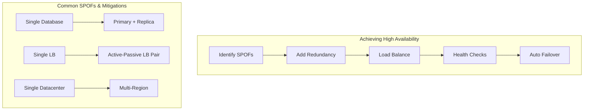
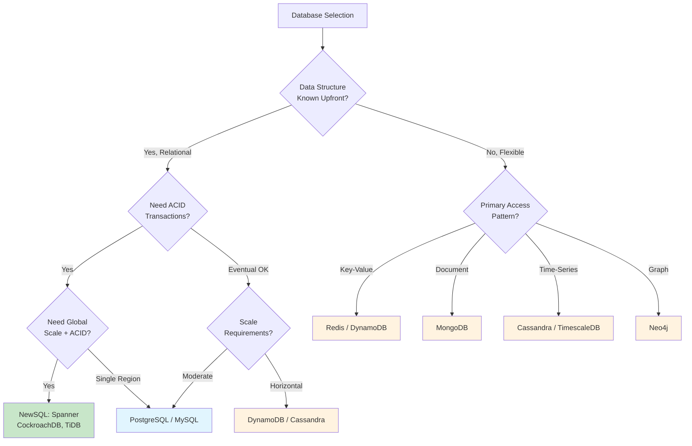
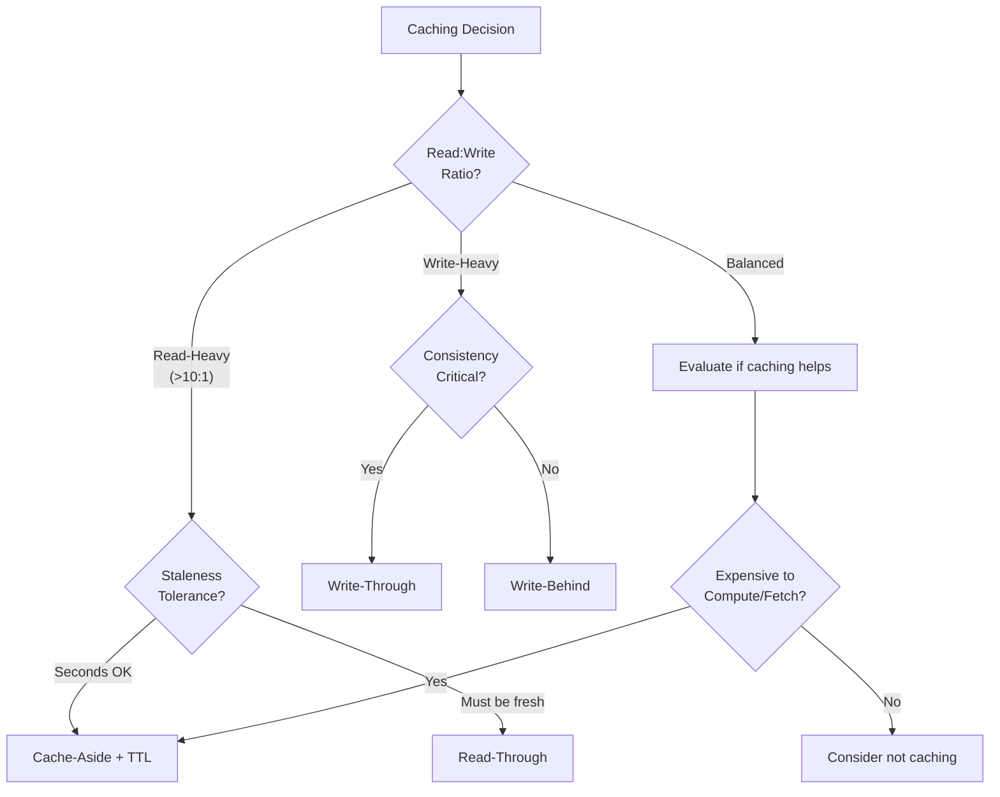
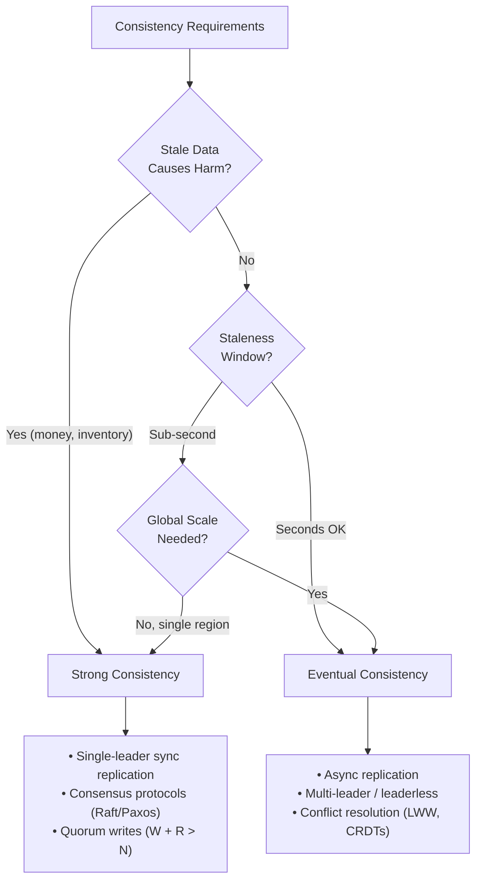
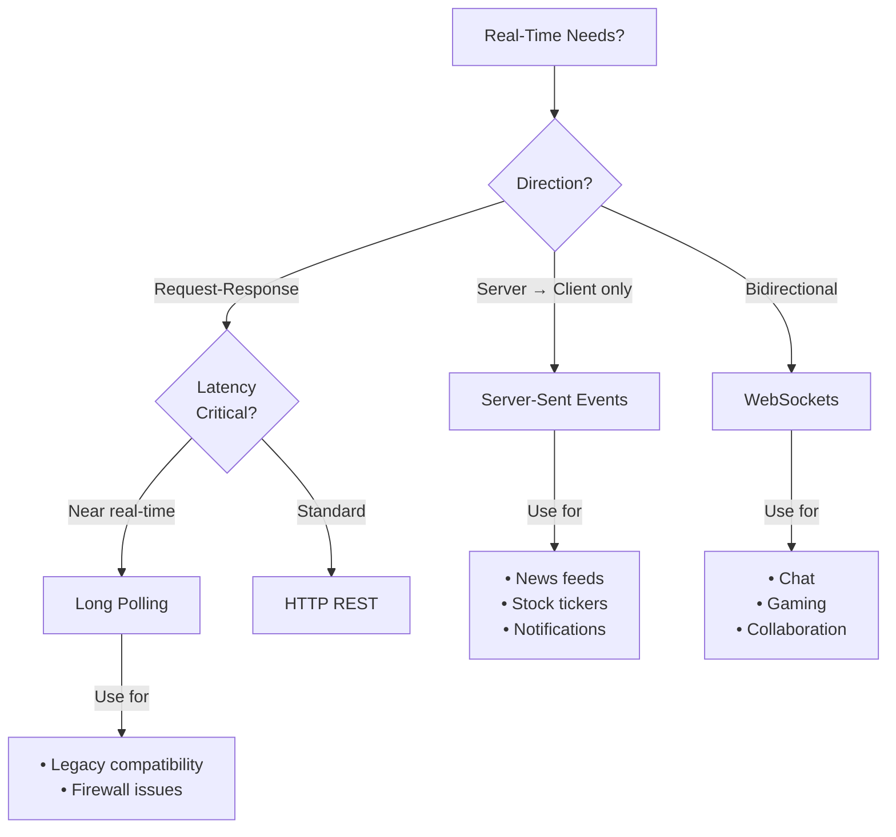
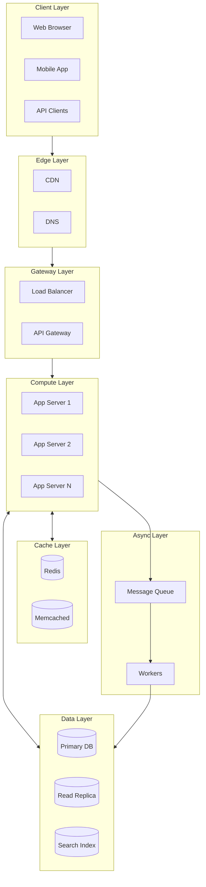
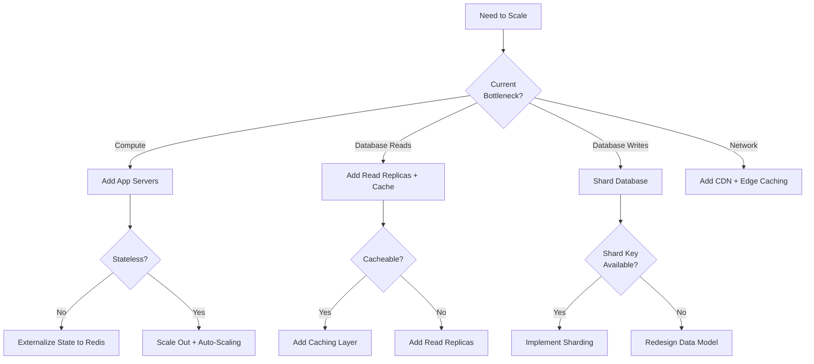
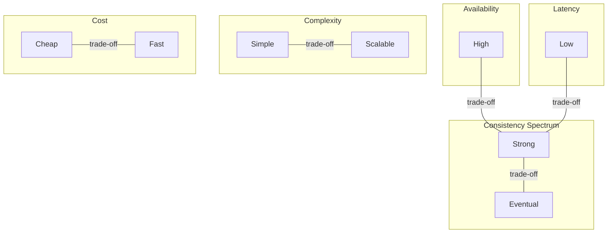

# 10 — Quick Reference Card

> Essential numbers, formulas, decision frameworks, and articulation patterns for rapid recall during interviews.

**Purpose:** This is your final review document before an interview. It consolidates the most critical information from all modules into scannable, actionable reference material.

---

## Table of Contents

1. [Latency Numbers Every Engineer Should Know](#1-latency-numbers-every-engineer-should-know)
2. [Back-of-Envelope Estimation](#2-back-of-envelope-estimation)
3. [Availability & SLAs](#3-availability--slas)
4. [Decision Trees](#4-decision-trees)
5. [Component Selection Cheat Sheets](#5-component-selection-cheat-sheets)
6. [Trade-Off Quick Reference](#6-trade-off-quick-reference)
7. [Common Capacity Numbers](#7-common-capacity-numbers)
8. [Interview Framework](#8-interview-framework)
9. [Articulation Patterns](#9-articulation-patterns)
10. [One-Page Summary Diagrams](#10-one-page-summary-diagrams)

---

## 1. Latency Numbers Every Engineer Should Know

### Memory & Storage Hierarchy

```
┌─────────────────────────────────────────────────────────────────┐
│              LATENCY HIERARCHY (Orders of Magnitude)             │
├─────────────────────────────────────────────────────────────────┤
│                                                                  │
│  L1 cache reference .................... 0.5 ns    (baseline)   │
│  L2 cache reference ....................   7 ns    (14× L1)     │
│  Main memory reference .................  100 ns   (200× L1)    │
│  ─────────────────────────────────────────────────────────────  │
│  SSD random read ...................... 150 μs    (1,000× mem)  │
│  HDD seek ............................. 10 ms     (100× SSD)    │
│  ─────────────────────────────────────────────────────────────  │
│  Same datacenter RTT .................. 0.5 ms                  │
│  Cross-region RTT ..................... 50-150 ms               │
│  Intercontinental RTT ................. 100-300 ms              │
│                                                                  │
│  RULE OF THUMB: Each layer adds ~10-100× latency                │
│                                                                  │
└─────────────────────────────────────────────────────────────────┘
```

### Detailed Reference Table

| Operation | Latency | Comparison | Design Implication |
|-----------|---------|------------|-------------------|
| L1 cache reference | 0.5 ns | — | CPU-bound operations are fast |
| L2 cache reference | 7 ns | 14× L1 | Still negligible |
| Main memory reference | 100 ns | 200× L1 | In-memory data structures are fast |
| Mutex lock/unlock | 25 ns | — | Locks are cheap if uncontended |
| SSD random read | 150 μs | 1,000× memory | SSDs enable random access patterns |
| HDD seek | 10 ms | 100× SSD | HDDs require sequential access |
| Same datacenter RTT | 0.5 ms | — | Microservices have overhead |
| Cross-region RTT | 50-150 ms | 100-300× datacenter | Geographic distribution has cost |
| Intercontinental RTT | 100-300 ms | — | CDNs are essential for global users |

### Throughput Numbers

| System | Throughput | Notes |
|--------|------------|-------|
| SSD sequential read | 500 MB/s | Good for log writes |
| 1 Gbps network | 125 MB/s | Network often bottleneck |
| HDD sequential read | 100 MB/s | 5× slower than SSD |
| SSD random read | 10,000 IOPS | Great for random workloads |
| HDD random read | 100 IOPS | 100× worse than SSD |

### Queuing Theory Quick Reference

```
┌─────────────────────────────────────────────────────────────────┐
│                 UTILIZATION VS LATENCY                           │
├─────────────────────────────────────────────────────────────────┤
│                                                                  │
│  Utilization (ρ)    Wait Time Multiplier    Recommendation      │
│  ──────────────────────────────────────────────────────────────  │
│       50%                 1×                 Comfortable         │
│       70%                 2.3×               Target zone         │
│       80%                 4×                 Warning             │
│       90%                 9×                 Critical            │
│       95%                 19×                Near collapse       │
│                                                                  │
│  KEY INSIGHT: At 90% utilization, latency is 9× service time    │
│  Target 70% utilization for production systems                  │
│                                                                  │
│  Thread Pool Sizing:                                             │
│  Threads = (target_throughput × avg_latency) / target_util      │
│                                                                  │
│  Example: 1000 req/s, 100ms latency, 70% target                 │
│  Threads = (1000 × 0.1) / 0.7 = 143 threads                     │
│                                                                  │
└─────────────────────────────────────────────────────────────────┘
```

### Scalability Laws

```
┌─────────────────────────────────────────────────────────────────┐
│                    SCALABILITY LAWS                              │
├─────────────────────────────────────────────────────────────────┤
│                                                                  │
│  AMDAHL'S LAW (Parallelization Limit)                           │
│  ─────────────────────────────────────                          │
│  Speedup = 1 / (S + (1-S)/N)                                    │
│                                                                  │
│  S = serial fraction, N = number of processors                   │
│                                                                  │
│  If 10% is serial: max speedup = 10× (no matter how many nodes) │
│                                                                  │
│  UNIVERSAL SCALABILITY LAW (Coordination Overhead)              │
│  ─────────────────────────────────────────────────              │
│  At some point, adding nodes DECREASES throughput               │
│  due to coordination overhead (cache invalidation, locks)       │
│                                                                  │
│  Optimal cluster size = √(1-σ)/κ                                │
│  where σ = contention, κ = coherency coefficient                │
│                                                                  │
└─────────────────────────────────────────────────────────────────┘
```

---

## 2. Back-of-Envelope Estimation

### Core Formulas

```
┌─────────────────────────────────────────────────────────────────┐
│                    ESTIMATION FORMULAS                           │
├─────────────────────────────────────────────────────────────────┤
│                                                                  │
│  REQUESTS PER SECOND (RPS)                                       │
│  ─────────────────────────                                       │
│  RPS = (DAU × Actions per User) / 86,400                        │
│                                                                  │
│  Example: 10M DAU, 10 actions/user                              │
│  RPS = (10,000,000 × 10) / 86,400 ≈ 1,150 req/s                │
│                                                                  │
│  STORAGE                                                         │
│  ───────                                                         │
│  Storage = Users × Data per User × Retention                    │
│                                                                  │
│  Example: 100M users, 1KB/day, 1 year                           │
│  Storage = 100M × 1KB × 365 = 36.5 TB/year                      │
│                                                                  │
│  BANDWIDTH                                                       │
│  ─────────                                                       │
│  Bandwidth = RPS × Average Request/Response Size                │
│                                                                  │
│  Example: 1,000 RPS, 100KB response                             │
│  Bandwidth = 1,000 × 100KB = 100 MB/s                           │
│                                                                  │
│  SERVERS NEEDED                                                  │
│  ──────────────                                                  │
│  Servers = Total RPS / RPS per Server                           │
│                                                                  │
│  Example: 10,000 RPS, server handles 1,000 RPS                  │
│  Servers = 10,000 / 1,000 = 10 servers (+ redundancy)           │
│                                                                  │
└─────────────────────────────────────────────────────────────────┘
```

### Powers of 2 Reference

| Power | Exact Value | Approximation | Common Use |
|-------|-------------|---------------|------------|
| 2^10 | 1,024 | ~1 Thousand | 1 KB |
| 2^20 | 1,048,576 | ~1 Million | 1 MB |
| 2^30 | 1,073,741,824 | ~1 Billion | 1 GB |
| 2^40 | ~1.1 Trillion | ~1 Trillion | 1 TB |
| 2^50 | ~1.1 Quadrillion | ~1 Quadrillion | 1 PB |

### Time Conversions

| Period | Seconds | Rounded | Useful For |
|--------|---------|---------|------------|
| 1 minute | 60 | 60 | Rate limiting windows |
| 1 hour | 3,600 | ~3.6K | Hourly metrics |
| 1 day | 86,400 | ~10^5 | Daily active users |
| 1 week | 604,800 | ~600K | Weekly retention |
| 1 month | 2,592,000 | ~2.6M | Monthly billing |
| 1 year | 31,536,000 | ~3×10^7 | Annual storage |

### Example: Social Media Platform

```
Given:
- 100M DAU
- 10 posts per user per day
- 1 KB per post (text + metadata)
- 1 MB average image

Calculate:
┌─────────────────────────────────────────────────────────────────┐
│ Posts per day:      100M × 10 = 1 Billion posts/day             │
│ Posts per second:   1B / 86,400 ≈ 11,500 posts/sec             │
│                                                                  │
│ Text storage/day:   1B × 1KB = 1 TB/day                         │
│ Text storage/year:  1 TB × 365 ≈ 365 TB/year                    │
│                                                                  │
│ If 10% have images:                                              │
│ Image storage/day:  100M × 1MB = 100 TB/day                     │
│ Image storage/year: 100 TB × 365 ≈ 36.5 PB/year                 │
│                                                                  │
│ Read amplification (assuming 100 reads per post):               │
│ Read RPS:           11,500 × 100 = 1.15M reads/sec              │
└─────────────────────────────────────────────────────────────────┘
```

---

## 3. Availability & SLAs

### The "Nines" Table

| Availability | Downtime/Year | Downtime/Month | Downtime/Week | Common SLA |
|--------------|---------------|----------------|---------------|------------|
| 99% (two 9s) | 3.65 days | 7.3 hours | 1.7 hours | Development |
| 99.9% (three 9s) | 8.76 hours | 43.8 minutes | 10 minutes | Standard SaaS |
| 99.99% (four 9s) | 52.6 minutes | 4.38 minutes | 1 minute | Enterprise |
| 99.999% (five 9s) | 5.26 minutes | 26.3 seconds | 6 seconds | Critical infrastructure |

### Calculating Combined Availability

```
Serial (both must work):    A_total = A₁ × A₂
Parallel (either works):    A_total = 1 - (1-A₁) × (1-A₂)

Example: Web → App → DB (all serial, each 99.9%)
A_total = 0.999³ = 99.7%

Example: Two redundant DBs (parallel, each 99.9%)
A_total = 1 - (0.001)² = 99.9999%
```

### Availability Patterns



---

## 4. Decision Trees

### Database Selection



### NewSQL Quick Reference

| System | Key Feature | Use When |
|--------|-------------|----------|
| **Spanner** | TrueTime (GPS clocks) | Global ACID, Google Cloud |
| **CockroachDB** | Raft + HLC | Multi-region, PostgreSQL compatible |
| **TiDB** | MySQL compatible | MySQL migration, horizontal scale |
| **YugabyteDB** | PostgreSQL compatible | PostgreSQL migration, cloud-native |

### Caching Strategy Selection



### Cache Sizing Formulas

```
┌─────────────────────────────────────────────────────────────────┐
│                    CACHE SIZING                                  │
├─────────────────────────────────────────────────────────────────┤
│                                                                  │
│  HIT RATE (Zipf Distribution - typical web traffic)             │
│  ─────────────────────────────────────────────────              │
│  Cache Size (% of total)    Expected Hit Rate                   │
│       1%                         ~50-60%                        │
│       5%                         ~70-80%                        │
│       10%                        ~80-85%                        │
│       20%                        ~90-95%                        │
│                                                                  │
│  EFFECTIVE LATENCY                                               │
│  ────────────────                                                │
│  Latency = (hit_rate × cache_latency) + (miss_rate × db_latency)│
│                                                                  │
│  Example: 90% hit rate, 5ms cache, 100ms DB                     │
│  Latency = 0.9 × 5 + 0.1 × 100 = 14.5ms (vs 100ms uncached)    │
│                                                                  │
│  REDIS MEMORY ESTIMATE                                           │
│  ─────────────────────                                           │
│  Memory = items × (key_size + value_size + 90 bytes) × 1.5      │
│                                                                  │
│  Example: 1M items, 32B keys, 256B values                       │
│  Memory = 1M × (32 + 256 + 90) × 1.5 ≈ 567 MB                  │
│                                                                  │
└─────────────────────────────────────────────────────────────────┘
```

### Consistency Model Selection



### Communication Pattern Selection



---

## 5. Component Selection Cheat Sheets

### Load Balancer Algorithms

| Scenario | Algorithm | Why |
|----------|-----------|-----|
| Equal servers, similar requests | **Round Robin** | Simple, fair distribution |
| Unequal server capacity | **Weighted Round Robin** | Respects server power |
| Variable request duration | **Least Connections** | Avoids overloading slow handlers |
| Need session stickiness | **IP Hash** | Same client → same server |
| Latency-critical | **Least Response Time** | Routes to fastest server |

### Message Queue vs Pub/Sub

| Need | Pattern | Example Systems |
|------|---------|-----------------|
| Work distribution (one consumer) | **Message Queue** | SQS, RabbitMQ |
| Event broadcast (many consumers) | **Pub/Sub** | SNS, Kafka topics |
| Task processing with retry | **Message Queue** | SQS + DLQ |
| Real-time notifications | **Pub/Sub** | Redis Pub/Sub |
| Event sourcing | **Log (Kafka)** | Kafka, Kinesis |

### Replication Strategies

| Need | Strategy | Trade-off |
|------|----------|-----------|
| Strong consistency | Single-leader + sync replication | Higher latency |
| High availability | Multi-leader or leaderless | Conflict resolution needed |
| Read scaling | Single-leader + async read replicas | Stale reads possible |
| Geographic distribution | Multi-leader | Conflict resolution needed |
| Maximum availability | Leaderless (quorum) | Tunable consistency |

### Partitioning (Sharding) Methods

| Method | Pros | Cons | Use When |
|--------|------|------|----------|
| **Hash** | Even distribution | No range queries | Random access patterns |
| **Range** | Range queries work | Hotspots possible | Time-series, sorted data |
| **Directory** | Flexible | Lookup overhead | Complex routing needs |
| **Geographic** | Low latency | Uneven distribution | Regional data sovereignty |

---

## 6. Trade-Off Quick Reference

### The Universal Trade-Off Table

| If You Need... | Choose... | But Accept... |
|----------------|-----------|---------------|
| Strong consistency | Synchronous replication | Higher latency, potential unavailability |
| High availability | Eventual consistency | Temporary staleness, conflict resolution |
| Low latency | Caching, CDN, edge computing | Complexity, potential staleness |
| High throughput | Async processing, batching | Higher per-request latency |
| Simplicity | Monolith, SQL, polling | Scaling limitations |
| Flexibility | Microservices, NoSQL, events | Operational complexity |
| Data integrity | ACID transactions | Performance overhead |
| Horizontal scale | BASE semantics | Application-level conflict handling |

### CAP Theorem Quick Reference

```
┌─────────────────────────────────────────────────────────────────┐
│                      CAP THEOREM                                 │
├─────────────────────────────────────────────────────────────────┤
│                                                                  │
│  During a network partition, you must choose:                    │
│                                                                  │
│  CP (Consistency + Partition Tolerance)                          │
│  ─────────────────────────────────────                           │
│  • Reject requests to maintain consistency                       │
│  • Use for: Banking, inventory, bookings                         │
│  • Systems: HBase, MongoDB (default), Spanner                    │
│                                                                  │
│  AP (Availability + Partition Tolerance)                         │
│  ─────────────────────────────────────────                       │
│  • Serve requests, accept inconsistency                          │
│  • Use for: Social feeds, CDN, analytics                         │
│  • Systems: Cassandra, DynamoDB, CouchDB                         │
│                                                                  │
│  DECISION RULE: "Would stale data cause real-world harm?"        │
│  Yes → CP | No → AP                                              │
│                                                                  │
└─────────────────────────────────────────────────────────────────┘
```

### ACID vs BASE

| Property | ACID | BASE |
|----------|------|------|
| **Philosophy** | Correctness first | Availability first |
| **Transactions** | All-or-nothing | Optimistic, resolve later |
| **Scaling** | Primarily vertical | Horizontal by design |
| **Use for** | Financial, inventory, healthcare | Social, analytics, IoT |
| **Systems** | PostgreSQL, MySQL | Cassandra, DynamoDB |

---

## 7. Common Capacity Numbers

### System Capacities

| System | Typical Capacity | Notes |
|--------|------------------|-------|
| Single web server | 1,000-10,000 req/s | Depends on complexity |
| Single database (OLTP) | 10,000-50,000 QPS | With good indexing |
| Redis (single instance) | 100,000+ ops/s | In-memory, simple ops |
| Kafka (single partition) | 10,000+ msg/s | Higher with batching |
| Nginx (load balancer) | 100,000+ conn/s | L7 processing |
| HAProxy (load balancer) | 1,000,000+ conn/s | L4 processing |

### Data Size Rules of Thumb

| Data Type | Typical Size |
|-----------|--------------|
| User profile (basic) | 1 KB |
| Tweet/post (text) | 140-500 bytes |
| Image (compressed) | 200 KB - 2 MB |
| Thumbnail | 10-50 KB |
| Video (1 min, 720p) | 50-100 MB |
| Database row (avg) | 100 bytes - 1 KB |

### Network Rules of Thumb

| Connection Type | Bandwidth |
|-----------------|-----------|
| Mobile 3G | 1-5 Mbps |
| Mobile 4G/LTE | 10-50 Mbps |
| Mobile 5G | 100-1000 Mbps |
| Home broadband | 50-500 Mbps |
| Datacenter (10GbE) | 10 Gbps |

---

## 8. Interview Framework

### The 5-Step Framework

```mermaid
flowchart LR
    subgraph Step1["1. Clarify (5 min)"]
        C1[Functional Requirements]
        C2[Non-Functional Requirements]
        C3[Constraints & Assumptions]
    end
    
    subgraph Step2["2. Estimate (3 min)"]
        E1[Users/Scale]
        E2[Storage]
        E3[Bandwidth]
    end
    
    subgraph Step3["3. Design (20 min)"]
        D1[High-Level Architecture]
        D2[Data Model]
        D3[API Design]
    end
    
    subgraph Step4["4. Deep Dive (10 min)"]
        DD1[Scaling Strategy]
        DD2[Failure Handling]
        DD3[Trade-offs]
    end
    
    subgraph Step5["5. Wrap Up (2 min)"]
        W1[Summarize Decisions]
        W2[Acknowledge Limitations]
        W3[Mention Extensions]
    end
    
    Step1 --> Step2 --> Step3 --> Step4 --> Step5
```



### The Five Clarifying Questions

Before diving into design, always clarify:

| # | Question | Why It Matters |
|---|----------|----------------|
| 1 | **Scale**: Users? Requests/second? Data volume? | Determines architecture complexity |
| 2 | **Consistency**: Can users see stale data? How stale? | Drives database/caching choices |
| 3 | **Latency**: What's acceptable response time? | Affects caching, architecture |
| 4 | **Availability**: What's the uptime requirement? | Determines redundancy needs |
| 5 | **Access Pattern**: Read-heavy? Write-heavy? | Guides optimization focus |

### Common Follow-Up Questions & Responses

| Question | Strong Response Pattern |
|----------|------------------------|
| "How would you scale this?" | "First, identify bottleneck (compute/storage/network). If compute, add servers behind LB. If storage, consider sharding by [key]. If network, add caching/CDN." |
| "What if [component] fails?" | "For [component], we'd have [redundancy approach]. Detection via [health checks]. Recovery through [failover mechanism]. Impact limited to [blast radius]." |
| "How do you ensure consistency?" | "Given our tolerance for [staleness], I'd use [consistency model]. Specifically, [replication strategy] with [conflict resolution if needed]." |
| "What are the trade-offs?" | "This design optimizes for [primary goal] at the cost of [sacrifice]. If requirements change to prioritize [other goal], we'd revisit [specific decision]." |

---

## 9. Articulation Patterns

### Opening a Design Discussion

```
"Before diving in, let me clarify the requirements:

Functional:
- [Core feature 1]
- [Core feature 2]

Non-Functional:
- Scale: [users, QPS, data volume]
- Latency: [target p99]
- Availability: [target SLA]
- Consistency: [requirement]

Let me verify these assumptions: [ask clarifying questions]"
```

### Defending a Decision

```
"I chose [COMPONENT] because:

1. Our requirement for [PROPERTY] rules out [ALTERNATIVE]
2. The trade-off of [COST] is acceptable given [CONSTRAINT]
3. This aligns with how [REAL SYSTEM] solves similar problems

If [CONDITION] changes, we'd revisit this decision."
```

### Acknowledging Limitations

```
"The weakness of this approach is [LIMITATION].

To mitigate this, we could:
- [MITIGATION 1]
- [MITIGATION 2]

Alternatively, if [CONDITION] becomes more important, 
we'd switch to [ALTERNATIVE APPROACH]."
```

### Key Phrases to Use

| Situation | Phrase |
|-----------|--------|
| Explaining trade-offs | "This optimizes for X at the cost of Y..." |
| Making decisions | "Given our requirement for X, I'd choose Y because..." |
| Acknowledging uncertainty | "This depends on the actual traffic pattern. We'd monitor and adjust..." |
| Connecting concepts | "This decision affects our caching strategy because..." |
| Showing depth | "In production, we'd also consider..." |
| Handling unknowns | "I'm not certain about X, but my approach would be..." |

---

## 10. One-Page Summary Diagrams

### System Design Building Blocks



### Scaling Decision Flowchart



### Complete Trade-Off Map



---

## Quick Lookup Tables

### API Style Selection

| Style | Best For | Avoid When |
|-------|----------|------------|
| **REST** | Public APIs, CRUD, caching | Complex queries, real-time |
| **GraphQL** | Mobile apps, varied data needs | Simple CRUD, caching critical |
| **gRPC** | Internal services, streaming | Browser clients, debugging ease |

### Rate Limiting Algorithms

| Algorithm | Best For | Trade-off |
|-----------|----------|-----------|
| **Fixed Window** | Simple implementation | Boundary burst issue |
| **Sliding Window** | Accuracy | More memory |
| **Token Bucket** | Allowing bursts | Complexity |
| **Leaky Bucket** | Smooth output | No burst tolerance |

### Cache Invalidation Strategies

| Strategy | Use When | Trade-off |
|----------|----------|-----------|
| **TTL** | Staleness OK | May serve stale data |
| **Write-Through** | Consistency critical | Higher write latency |
| **Event-Based** | Real-time updates needed | Complexity |
| **Manual** | Rare updates | Operational burden |

---

## Final Pre-Interview Checklist

```
┌─────────────────────────────────────────────────────────────────┐
│                 PRE-INTERVIEW CHECKLIST                          │
├─────────────────────────────────────────────────────────────────┤
│                                                                  │
│  FUNDAMENTALS:                                                   │
│  □ Can explain CAP theorem in 30 seconds                        │
│  □ Know latency numbers (memory → disk → network)               │
│  □ Can do back-of-envelope calculations                         │
│  □ Know when to use SQL vs NoSQL vs NewSQL                      │
│  □ Can explain caching strategies and trade-offs                │
│  □ Know load balancing algorithms                               │
│  □ Understand eventual vs strong consistency                    │
│  □ Know message queue vs pub/sub patterns                       │
│                                                                  │
│  ADVANCED CONCEPTS:                                              │
│  □ Can explain linearizability vs serializability               │
│  □ Know queuing theory (utilization → latency relationship)     │
│  □ Understand tail latency compounding in fan-out               │
│  □ Can size a cache using Zipf distribution rules               │
│  □ Know Amdahl's Law limits on parallelization                  │
│  □ Understand exactly-once semantics (idempotency + dedup)      │
│  □ Know consensus basics (Raft leader election)                 │
│                                                                  │
│  DURING THE INTERVIEW:                                           │
│  □ Ask clarifying questions first                               │
│  □ State assumptions explicitly                                 │
│  □ Start with high-level design                                 │
│  □ Deep dive on 1-2 components                                  │
│  □ Acknowledge trade-offs proactively                           │
│  □ Mention what you'd monitor in production                     │
│                                                                  │
└─────────────────────────────────────────────────────────────────┘
```

---

## Revision History

| Date | Change |
|------|--------|
| 2025-01 | Initial quick reference with latency numbers, estimation formulas, decision trees |
| 2025-01 | P3 enhancement: Added queuing theory, scalability laws (Amdahl's, USL), NewSQL decision tree, cache sizing formulas |
| 2025-01 | Quality review: Updated pre-interview checklist with advanced concepts |

---

## Navigation

| Previous | Index |
|----------|-------|
| [09 — Scaling and Infrastructure](./09_SCALING_AND_INFRASTRUCTURE.md) | [README](./README.md) |

---

*This Quick Reference Card consolidates the most critical information from all modules. Use it for final review before interviews, but ensure you've studied the detailed modules for deep understanding.*
