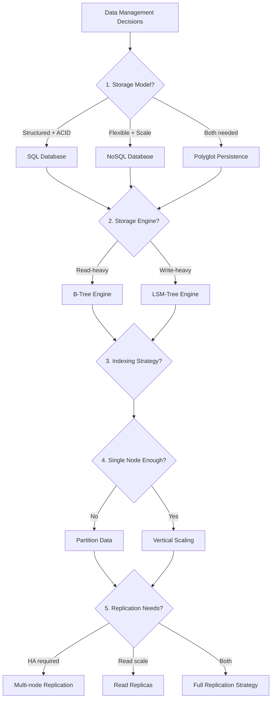
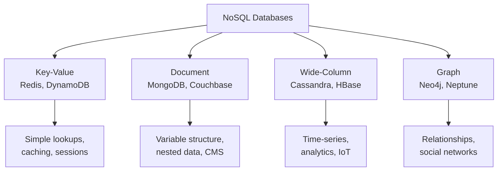
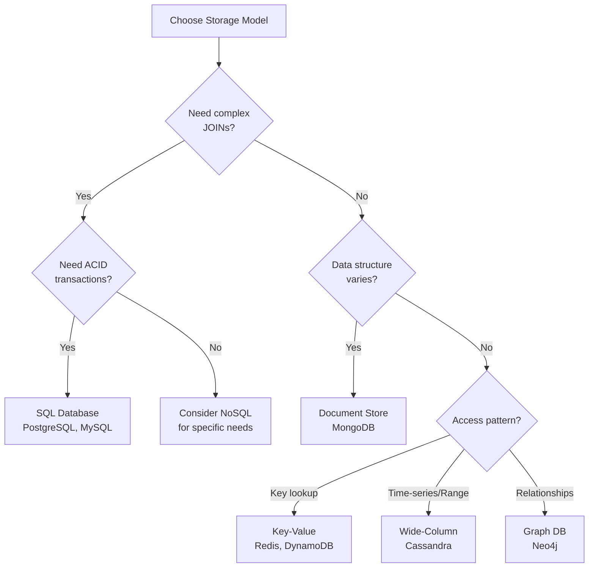
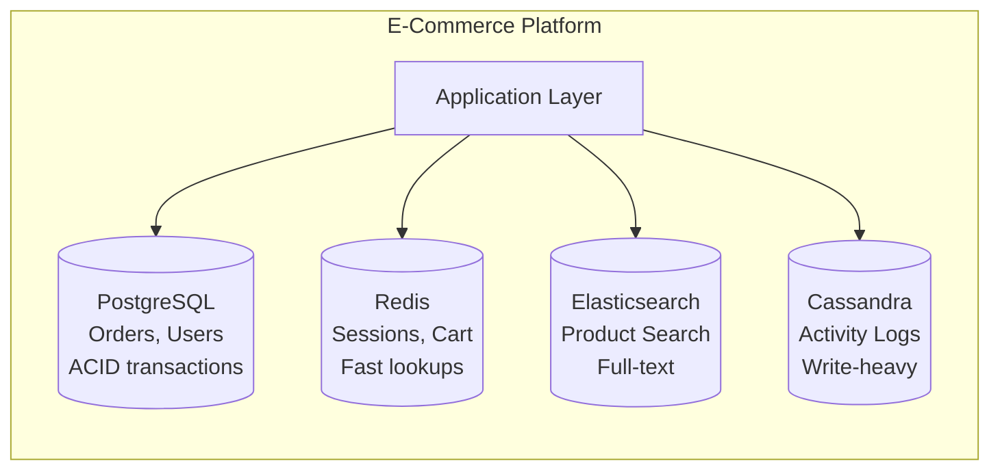
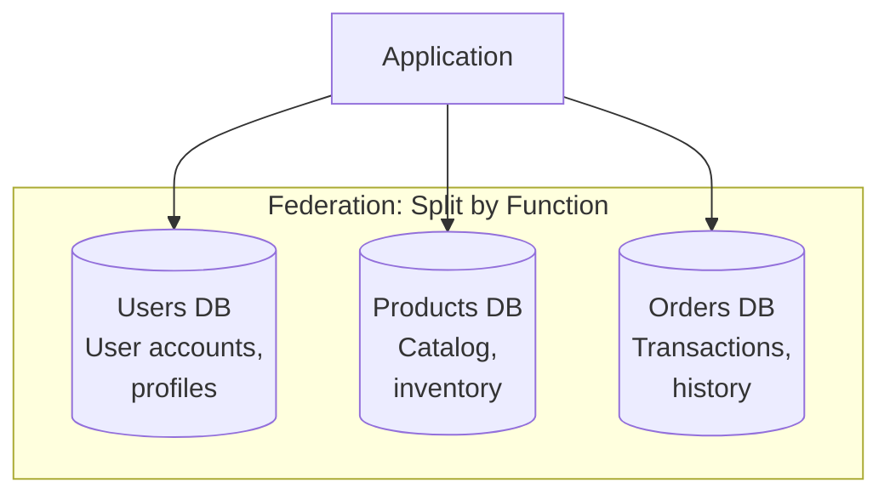

# Data Management — Overview

> Strategic decisions for storing, organizing, and scaling data.

**Prerequisites:** [01 — Foundational Concepts](./01_FOUNDATIONAL_CONCEPTS.md)
**Deep-Dives:**
- [Sharding & Partitioning](./DD_SHARDING_PARTITIONING.md)
- [Storage Engines](./DD_STORAGE_ENGINES.md)
- [Consistent Hashing](./DD_CONSISTENT_HASHING.md)
- [Indexing Strategies](./03_DATA_STORAGE_AND_ACCESS.md#2-indexing-deep-dive)
- [Replication Patterns](./REPLICATION_PATTERNS.md) *(planned)*

**Estimated study time:** 1.5 hours (overview) + deep-dives

---

## 1. The Data Management Decision Tree

Every system design involves five fundamental data decisions. Getting these right determines whether your system scales gracefully or collapses under load.

### The Five Key Decisions



### 30-Second Interview Framing

> "Data management boils down to five decisions: storage model (SQL vs NoSQL based on consistency needs), storage engine (B-Tree for reads, LSM for writes), indexing (what's in your WHERE clause), partitioning (when single-node isn't enough), and replication (for availability and read scaling). Each decision cascades into the next."

---

## 2. SQL vs NoSQL Databases

The most fundamental choice in data management is the storage model. This isn't about "old vs new"—it's about matching data characteristics to access patterns.

### Core Difference: Data Model Flexibility vs Query Power

| Aspect | SQL (Relational) | NoSQL |
|--------|------------------|-------|
| **Data model** | Fixed schema, tables with rows | Flexible: documents, key-value, wide-column, graph |
| **Query language** | SQL (declarative, powerful) | Varies by type; often limited |
| **Consistency** | ACID transactions by default | BASE semantics typical; ACID possible |
| **Scaling** | Vertical primarily; sharding complex | Horizontal by design |
| **JOINs** | Native, optimized | Often unavailable or expensive |
| **Schema evolution** | Migrations required | Schema-on-read; flexible |

### NoSQL Categories



| Type | Data Model | Query Pattern | Best For |
|------|------------|---------------|----------|
| **Key-Value** | Key → Blob | GET/PUT by key | Caching, sessions, simple lookups |
| **Document** | Key → JSON/BSON | Rich queries on documents | CMS, catalogs, user profiles |
| **Wide-Column** | Row key → column families | Range scans on row keys | Time-series, IoT, logging |
| **Graph** | Nodes + edges | Traversals, path finding | Social networks, recommendations |

### Decision Framework



### Polyglot Persistence

Real systems often use multiple databases, each optimized for specific access patterns.



**Key Trade-off:** Polyglot persistence optimizes each workload but increases operational complexity and makes cross-store consistency harder.

---

## 3. Storage Engine Fundamentals

The storage engine determines how data is physically stored and retrieved. This affects read/write performance, space usage, and durability.

### B-Tree vs LSM-Tree Comparison

| Aspect | B-Tree | LSM-Tree |
|--------|--------|----------|
| **Write pattern** | Random I/O (update in place) | Sequential I/O (append-only) |
| **Read pattern** | Single tree traversal | Multiple level searches |
| **Write amplification** | ~2-3x | ~10-30x |
| **Read amplification** | 1x | Variable (depends on levels) |
| **Space amplification** | Low | Higher during compaction |
| **Best for** | Read-heavy OLTP | Write-heavy, time-series |
| **Examples** | PostgreSQL, MySQL InnoDB | Cassandra, RocksDB, LevelDB |

### When Storage Engine Matters

- **Write-heavy workload** (>1000 writes/sec): Consider LSM-tree databases
- **Low-latency reads critical**: B-tree engines more predictable
- **Time-series data**: LSM-tree with compaction matches access patterns
- **Mixed workload**: B-tree is safer default; tune buffer pool

**Deep-Dive:** [Storage Engines](./DD_STORAGE_ENGINES.md) covers B-tree mechanics, LSM compaction strategies, WAL durability, Bloom filters, and write amplification analysis.

---

## 4. Indexing Essentials

Indexes are the primary tool for optimizing read performance. Without them, every query scans the entire table.

### The Index Analogy

An index is like a book's index—instead of reading every page to find "distributed systems," you look up the term and get page numbers. Database indexes work similarly: instead of scanning every row, the database looks up the value and gets row locations.

### Index Types Summary

| Index Type | Best For | Supports |
|------------|----------|----------|
| **B-Tree** (default) | General purpose | Equality, range, sorting, prefix |
| **Hash** | Equality only | O(1) exact match lookups |
| **GIN/Inverted** | Full-text, arrays, JSON | Contains, text search |
| **BRIN** | Large sorted tables | Range queries on ordered data |

### The Critical Rule

> **Index columns that appear in WHERE, JOIN, and ORDER BY clauses.**

But index judiciously—each index:
- Slows down writes (must update index on INSERT/UPDATE/DELETE)
- Consumes storage (~10-30% of table size per index)
- Competes for memory (buffer pool/cache)

### Index Trade-off Summary

```
More indexes = Faster reads + Slower writes + More storage
```

**Deep-Dive:** [Indexing Strategies](./03_DATA_STORAGE_AND_ACCESS.md#2-indexing-deep-dive) covers composite indexes, covering indexes, partial indexes, and query plan analysis.

---

## 5. Partitioning & Sharding Overview

When a single database node can't handle your data volume or throughput, you partition (shard) data across multiple nodes.

### Why Partition?

- **Scale beyond single node**: Distribute data when one machine can't hold it all
- **Increase throughput**: Parallelize reads/writes across nodes
- **Improve availability**: Failure affects only one partition, not all data

### Strategy Comparison

| Strategy | Mechanism | Pros | Cons | Use When |
|----------|-----------|------|------|----------|
| **Range** | Partition by key ranges | Good for range queries | Hot spots if keys skewed | Sequential access patterns |
| **Hash** | Hash key to partition | Even distribution | Range queries require scatter-gather | Uniform access, no range needs |
| **Consistent Hash** | Ring-based assignment | Minimal rebalancing | Complex implementation | Dynamic node addition/removal |
| **Directory** | Lookup table for routing | Flexible placement | Central point of failure | Custom routing rules needed |

### Partition Key Selection

The partition key determines which shard holds each record. Choose wisely:

1. **High cardinality**: Many distinct values → better distribution
2. **Even distribution**: Avoid keys that create hot spots
3. **Query affinity**: Most queries should target single partition

**Key Trade-off:** Partitioning enables scale but complicates cross-partition operations (JOINs, transactions, aggregations).

> **Deep-Dive:** [Sharding & Partitioning](./SHARDING_PARTITIONING.md) covers all strategies with complexity analysis, rebalancing algorithms, and production examples.

---

## 6. Replication Overview

Replication maintains copies of data on multiple nodes for availability and read scaling.

### Why Replicate?

- **High availability**: Continue serving if nodes fail
- **Read scaling**: Distribute read load across replicas
- **Geographic distribution**: Place data closer to users

### Topology Comparison

| Topology | How It Works | Pros | Cons |
|----------|--------------|------|------|
| **Single Leader** | One node accepts writes, replicates to followers | Simple, consistent | Leader is bottleneck/SPOF |
| **Multi-Leader** | Multiple nodes accept writes | Write availability | Conflict resolution needed |
| **Leaderless** | Any node accepts reads/writes | High availability | Requires quorum, versioning |

### Sync vs Async Replication

| Type | Durability | Latency | Availability |
|------|------------|---------|--------------|
| **Synchronous** | Strong (wait for ack) | Higher | Lower (blocks on replica) |
| **Asynchronous** | Eventual (may lose data) | Lower | Higher (no replica wait) |
| **Semi-synchronous** | At least one sync replica | Balanced | Balanced |

**Key Trade-off:** Synchronous replication ensures durability but adds latency and reduces availability. Asynchronous is faster but risks data loss on failure.

> **Deep-Dive:** [Replication Patterns](./REPLICATION_PATTERNS.md) covers replication lag handling, failover strategies, and consistency implications.

---

## 7. Normalization vs Denormalization

The classic trade-off between data integrity and read performance.

### Normalized Schema

Data is organized to eliminate redundancy. Each fact stored once.

```sql
-- Users table (single source of truth for user data)
CREATE TABLE users (
    id SERIAL PRIMARY KEY,
    name VARCHAR(100),
    email VARCHAR(100)
);

-- Orders table (references users, doesn't duplicate)
CREATE TABLE orders (
    id SERIAL PRIMARY KEY,
    user_id INT REFERENCES users(id),
    total DECIMAL(10,2)
);

-- Query requires JOIN
SELECT u.name, o.total
FROM orders o
JOIN users u ON o.user_id = u.id;
```

**Pros:** No update anomalies, single source of truth, smaller storage
**Cons:** JOINs required, slower reads for common access patterns

### Denormalized Schema

Data is duplicated to optimize for specific read patterns.

```sql
-- Orders with embedded user data
CREATE TABLE orders (
    id SERIAL PRIMARY KEY,
    user_id INT,
    user_name VARCHAR(100),    -- Duplicated!
    user_email VARCHAR(100),   -- Duplicated!
    total DECIMAL(10,2)
);

-- Query without JOIN
SELECT user_name, total FROM orders WHERE id = 12345;
```

**Pros:** Faster reads, no JOINs needed
**Cons:** Update anomalies, data sync required, larger storage

### When to Denormalize

| Scenario | Denormalize? | Reason |
|----------|--------------|--------|
| Read-heavy, join-heavy queries | Yes | Avoid repeated JOIN overhead |
| Data frequently accessed together | Yes | Single read instead of multiple |
| Rarely updated reference data | Yes | Low sync cost |
| Write-heavy workload | No | Update anomalies, sync overhead |
| Frequently changing source data | No | Hard to keep copies in sync |
| Strong consistency required | No | Denorm introduces inconsistency risk |

---

## 8. Database Federation

Federation splits databases by function rather than by data range.

### How Federation Works



### Federation vs Sharding

| Aspect | Federation | Sharding |
|--------|------------|----------|
| **Split by** | Function/domain | Data range/hash |
| **Cross-domain queries** | Require app-level joins | Single domain, partitioned |
| **Complexity** | Moderate | Higher (routing, rebalancing) |
| **Use case** | Clear domain boundaries | Single domain at scale |

### When to Federate

- Clear functional boundaries exist (users, orders, products)
- Different domains have different scaling needs
- Teams can own separate databases
- Cross-domain queries are infrequent

**Trade-off:** Federation reduces single database load but requires application-level coordination for cross-domain operations.

---

## 9. Quick Reference Table

| Decision | Key Question | Quick Answer | Deep-Dive |
|----------|--------------|--------------|-----------|
| SQL vs NoSQL | Structured + transactions? | Yes → SQL. Flexible + scale? → NoSQL | This doc §2 |
| Storage Engine | Read or write heavy? | Read → B-Tree. Write → LSM | [Storage Engines](./03_DATA_STORAGE_AND_ACCESS.md#1-storage-engine-fundamentals) |
| Indexing | What's in WHERE clause? | Index it, but judiciously | [Indexing](./03_DATA_STORAGE_AND_ACCESS.md#2-indexing-deep-dive) |
| Partitioning | Single node enough? | No → Shard by high-cardinality key | [Sharding](./DD_SHARDING_PARTITIONING.md) |
| Replication | Need HA or read scale? | HA → Multi-node. Reads → Replicas | [Replication](./REPLICATION_PATTERNS.md) |
| Normalization | Read-heavy or write-heavy? | Read → Denormalize. Write → Normalize | This doc §7 |
| Federation | Clear domain boundaries? | Yes → Federate. No → Shard | This doc §8 |

---

## 10. Chapter Summary

### Key Decisions Checklist

- [ ] **Storage model**: SQL for ACID/JOINs, NoSQL for flexibility/scale
- [ ] **Storage engine**: B-Tree for reads, LSM for writes
- [ ] **Indexing**: Index WHERE/JOIN/ORDER BY columns judiciously
- [ ] **Partitioning**: Use when single node insufficient; choose key carefully
- [ ] **Replication**: Sync for durability, async for availability
- [ ] **Normalization**: Normalize for writes, denormalize for reads
- [ ] **Federation**: Split by function when domains are clear

### Common Mistakes

| Mistake | Why It's Wrong | Better Approach |
|---------|----------------|-----------------|
| "NoSQL is faster" | Depends entirely on access pattern | Match storage model to workload |
| "Index everything" | Indexes slow writes and consume resources | Index selectively based on queries |
| "Shard from day one" | Premature complexity | Start simple, shard when needed |
| "Normalize everything" | Ignores read performance | Denormalize hot read paths |

---

## Connections to Other Concepts

| Related Topic | Connection |
|---------------|------------|
| [Foundational Concepts](./01_FOUNDATIONAL_CONCEPTS.md) | CAP/PACELC theorems inform storage choices |
| [Consistency & Transactions](./02_CONSISTENCY_AND_TRANSACTIONS.md) | ACID/BASE trade-offs in database selection |
| [Data Storage & Access](./03_DATA_STORAGE_AND_ACCESS.md) | Storage engine and indexing deep-dives |
| [Caching](./04_CACHING_AND_CONTENT_DELIVERY.md) | Cache sits in front of storage layer |
| [Distributed Coordination](./07_DISTRIBUTED_COORDINATION.md) | Patterns for distributed data systems |

---

## Revision History

| Date | Change |
|------|--------|
| 2025-01 | Initial hub document with decision frameworks, SQL vs NoSQL, storage engine overview, normalization patterns |

---

## Navigation

**Previous:** [02 — Consistency & Transactions](./02_CONSISTENCY_AND_TRANSACTIONS.md)
**Next:** [04 — Caching & Content Delivery](./04_CACHING_AND_CONTENT_DELIVERY.md)
**Index:** [README](./README.md)
