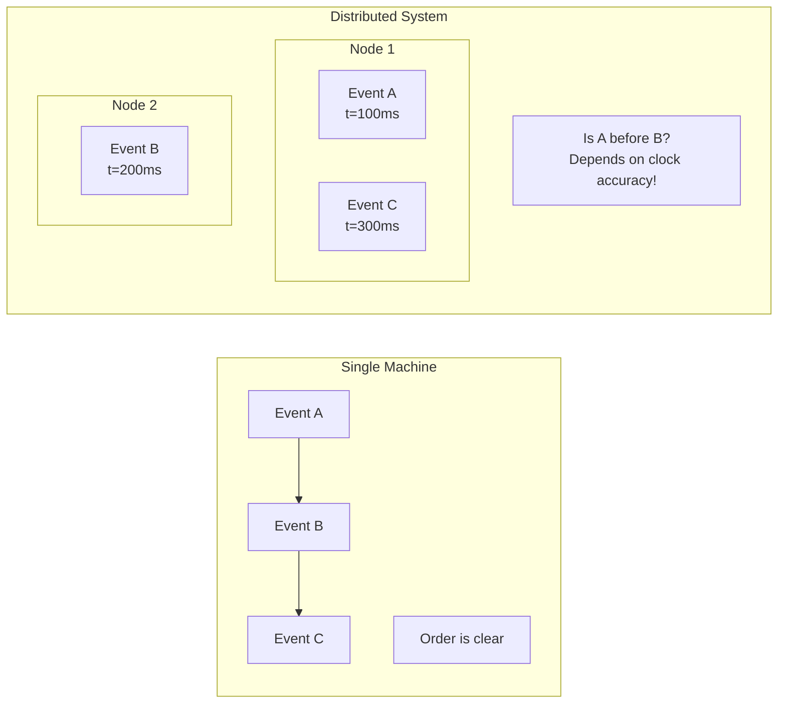
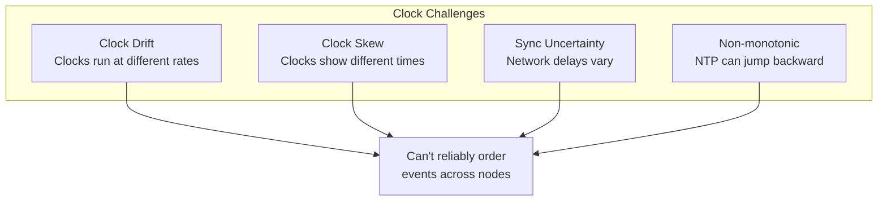
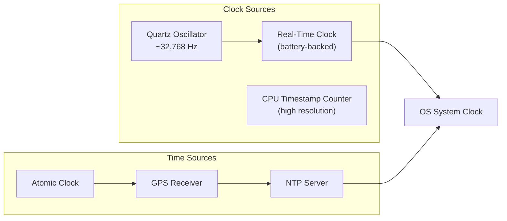
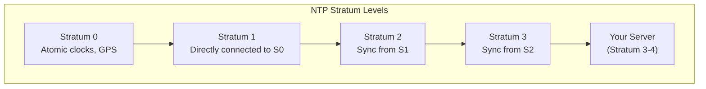
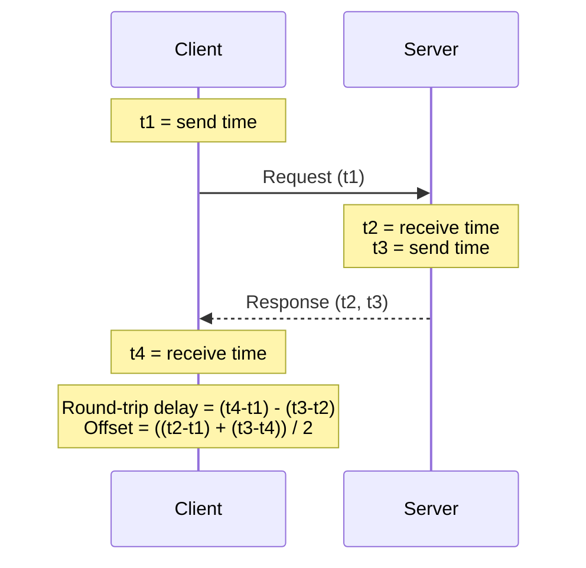
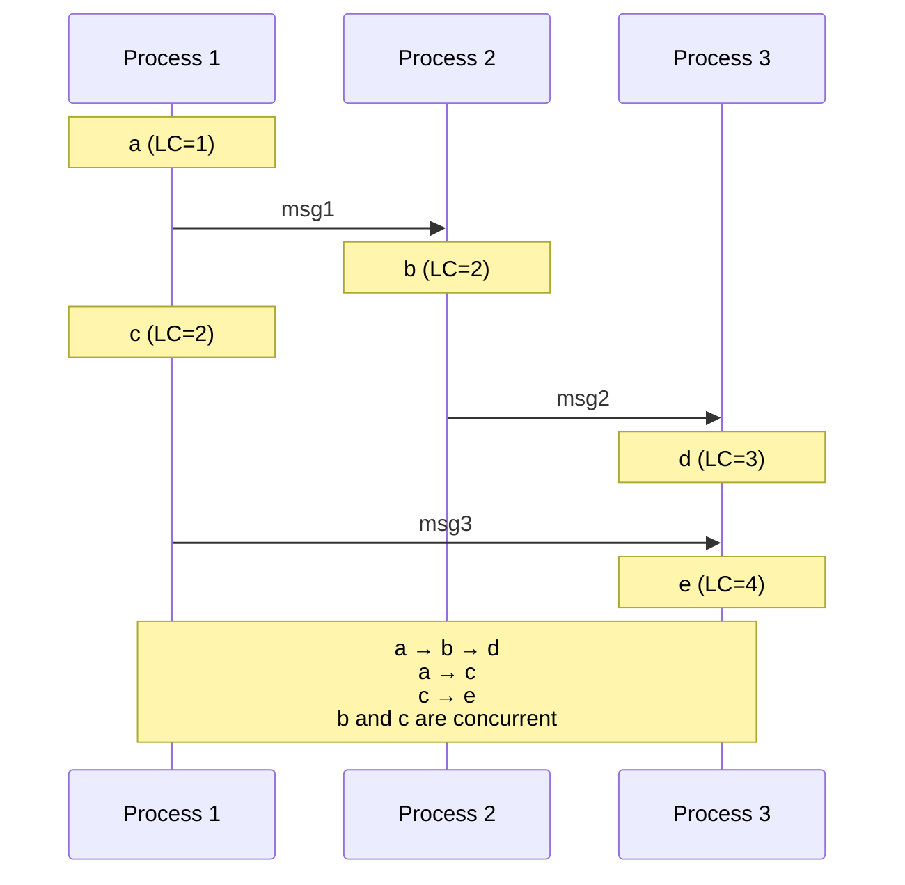
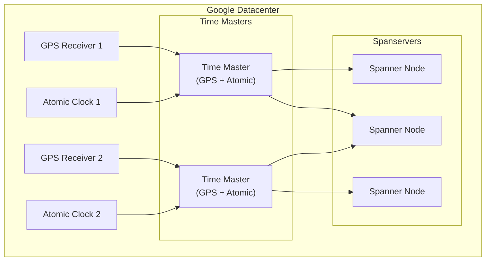
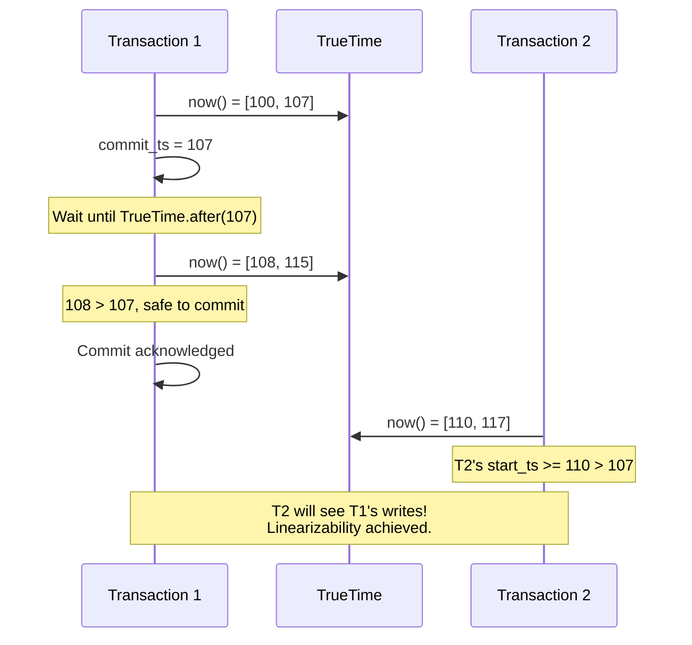
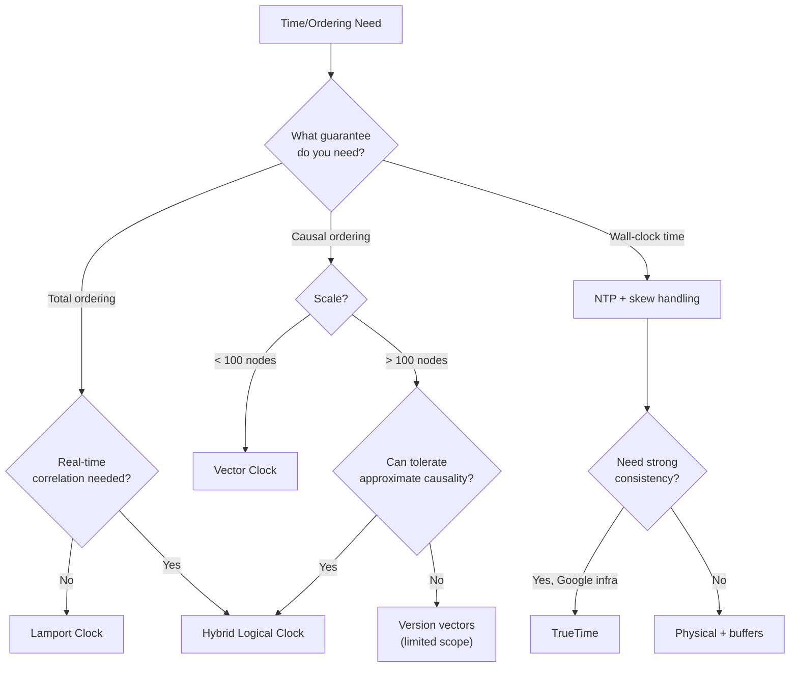

# Clock Synchronization — Deep Dive

> How distributed systems reason about time, order events, and coordinate across machines.

**Prerequisites:** [Foundational Concepts](./01_FOUNDATIONAL_CONCEPTS.md), [Consensus Protocols](./DD_CONSENSUS_PROTOCOLS.md)
**Related:** [DynamoDB Modeling](./DD_DYNAMODB_MODELING.md), [Consistency & Transactions](./03_CONSISTENCY_AND_TRANSACTIONS.md)

---

## Table of Contents

1. [Why Clocks Matter](#1-why-clocks-matter)
2. [Physical Clocks](#2-physical-clocks)
3. [Clock Synchronization Protocols](#3-clock-synchronization-protocols)
4. [Logical Clocks](#4-logical-clocks)
5. [Vector Clocks](#5-vector-clocks)
6. [TrueTime (Google Spanner)](#6-truetime-google-spanner)
7. [Hybrid Logical Clocks](#7-hybrid-logical-clocks)
8. [Practical Considerations](#8-practical-considerations)
9. [Production Systems](#9-production-systems)
10. [Interview Articulation](#10-interview-articulation)
11. [Decision Framework](#11-decision-framework)
12. [Quick Reference Card](#12-quick-reference-card)
13. [References](#references)

---

## 1. Why Clocks Matter

### The Fundamental Problem

In a single computer, ordering events is trivial—they happen sequentially. In distributed systems, there's no global clock:



### Why This Matters

| Use Case | Why Time Ordering Matters |
|----------|---------------------------|
| **Distributed transactions** | Determine if read sees a write |
| **Conflict resolution** | Last-write-wins needs accurate "last" |
| **Cache invalidation** | Know if cached value is stale |
| **Debugging/logging** | Reconstruct event sequence |
| **Lease expiration** | When does a lock expire? |
| **Causality tracking** | Did event A cause event B? |

### The Core Challenges



---

## 2. Physical Clocks

### How Computers Keep Time



### Clock Drift

Quartz oscillators drift due to temperature, aging, and manufacturing variance:

| Clock Type | Drift Rate | Error per Day |
|------------|------------|---------------|
| Cheap quartz | 100 ppm | 8.6 seconds |
| Quality quartz | 1-10 ppm | 0.09-0.9 seconds |
| Temperature-compensated | 0.1 ppm | 8.6 ms |
| Atomic clock | 10⁻¹² | Nanoseconds |

**ppm** = parts per million. 1 ppm = 1 microsecond drift per second.

### Clock Skew

Even with synchronization, clocks differ:

```
Node A time: 14:30:00.000
Node B time: 14:30:00.150  (150ms ahead)
Node C time: 14:29:59.950  (50ms behind)

Skew between A and B: 150ms
Skew between A and C: 50ms
```

### Monotonic vs Wall Clocks

| Clock Type | Behavior | Use Case |
|------------|----------|----------|
| **Wall clock** | Can jump (NTP adjustments) | Display to users, timestamps |
| **Monotonic clock** | Never goes backward | Measuring elapsed time, timeouts |

```python
import time

# Wall clock - can jump backward after NTP sync
wall_time = time.time()

# Monotonic clock - guaranteed to increase
mono_time = time.monotonic()

# For measuring duration, ALWAYS use monotonic
start = time.monotonic()
do_operation()
elapsed = time.monotonic() - start  # Safe!

# NEVER do this for timing:
start = time.time()
do_operation()
elapsed = time.time() - start  # May be negative if NTP adjusts!
```

---

## 3. Clock Synchronization Protocols

### Network Time Protocol (NTP)

NTP synchronizes clocks over the network using a hierarchy of time sources:



### NTP Algorithm



```python
def calculate_ntp_offset(t1, t2, t3, t4):
    """
    Calculate clock offset using NTP algorithm.

    t1: Client send time (client clock)
    t2: Server receive time (server clock)
    t3: Server send time (server clock)
    t4: Client receive time (client clock)

    Assumes symmetric network delay.
    """
    round_trip_delay = (t4 - t1) - (t3 - t2)
    offset = ((t2 - t1) + (t3 - t4)) / 2

    return offset, round_trip_delay
```

### NTP Accuracy

| Environment | Typical Accuracy |
|-------------|------------------|
| Internet (public NTP) | 10-100 ms |
| LAN (local NTP server) | 1-10 ms |
| Datacenter (PTP/dedicated) | 0.1-1 ms |
| Google Spanner (TrueTime) | < 7 ms (bounded) |

### Precision Time Protocol (PTP)

PTP achieves sub-microsecond accuracy using hardware timestamping:

| Feature | NTP | PTP |
|---------|-----|-----|
| Accuracy | ~1 ms | ~1 μs |
| Hardware support | Not required | Required |
| Complexity | Simple | Complex |
| Cost | Free | Hardware cost |
| Use case | General | Trading, telecom |

---

## 4. Logical Clocks

### Lamport Clocks

Leslie Lamport (1978) introduced logical clocks to capture **happened-before** relationships without physical time:

**Happened-Before Relation (→)**:
1. If A and B are events in the same process and A comes before B, then A → B
2. If A is sending a message and B is receiving it, then A → B
3. If A → B and B → C, then A → C (transitivity)



### Lamport Clock Algorithm

```python
class LamportClock:
    """
    Lamport logical clock implementation.

    Properties:
    - If a → b, then LC(a) < LC(b)
    - If LC(a) < LC(b), we CANNOT conclude a → b
      (events may be concurrent)
    """

    def __init__(self):
        self.time = 0

    def tick(self) -> int:
        """Increment clock for local event."""
        self.time += 1
        return self.time

    def send(self) -> int:
        """Get timestamp for sending message."""
        self.time += 1
        return self.time

    def receive(self, msg_timestamp: int) -> int:
        """
        Update clock on message receive.

        Take max of local time and message time, then increment.
        """
        self.time = max(self.time, msg_timestamp) + 1
        return self.time
```

### Lamport Clock Example

```
Process P1:          Process P2:          Process P3:
LC=0                 LC=0                 LC=0

Event a: LC=1
Send to P2 (LC=1)
                     Recv (max(0,1)+1=2)
                     Event b: LC=2
Event c: LC=2
                     Send to P3 (LC=2)
                                          Recv (max(0,2)+1=3)
                                          Event d: LC=3
Send to P3 (LC=3)
                                          Recv (max(3,3)+1=4)
                                          Event e: LC=4
```

### Limitations of Lamport Clocks

| What It Tells You | What It Doesn't Tell You |
|-------------------|--------------------------|
| If LC(a) < LC(b), possibly a → b | Whether a actually caused b |
| Partial ordering | If events are concurrent |
| Causal consistency possible | Distinguishing concurrent updates |

**Key limitation**: If LC(a) < LC(b), we can't tell if a → b or if they're concurrent.

---

## 5. Vector Clocks

### Improving on Lamport Clocks

Vector clocks capture the **full causal history**, allowing detection of concurrent events:

```python
class VectorClock:
    """
    Vector clock for full causality tracking.

    Each process maintains a vector of counters,
    one entry per process in the system.
    """

    def __init__(self, process_id: str, processes: List[str]):
        self.process_id = process_id
        self.clock = {p: 0 for p in processes}

    def tick(self):
        """Increment own entry for local event."""
        self.clock[self.process_id] += 1

    def send(self) -> Dict[str, int]:
        """Return clock to attach to message."""
        self.tick()
        return self.clock.copy()

    def receive(self, msg_clock: Dict[str, int]):
        """
        Merge received clock with local clock.

        Take component-wise maximum, then increment own entry.
        """
        for process, time in msg_clock.items():
            self.clock[process] = max(self.clock.get(process, 0), time)
        self.tick()

    def compare(self, other: Dict[str, int]) -> str:
        """
        Compare two vector clocks.

        Returns:
        - 'BEFORE': self happened before other
        - 'AFTER': self happened after other
        - 'CONCURRENT': neither happened before the other
        - 'EQUAL': same clock
        """
        dominated = True   # self <= other (component-wise)
        dominates = True   # self >= other (component-wise)

        all_procs = set(self.clock.keys()) | set(other.keys())

        for proc in all_procs:
            self_val = self.clock.get(proc, 0)
            other_val = other.get(proc, 0)

            if self_val > other_val:
                dominated = False
            if self_val < other_val:
                dominates = False

        if dominated and dominates:
            return 'EQUAL'
        elif dominated:
            return 'BEFORE'
        elif dominates:
            return 'AFTER'
        else:
            return 'CONCURRENT'
```

### Vector Clock Example

```
Process P1:              Process P2:              Process P3:
VC=[0,0,0]               VC=[0,0,0]               VC=[0,0,0]

Event a: VC=[1,0,0]
Send to P2
                         Recv: VC=[1,1,0]
                         Event b: VC=[1,2,0]
Event c: VC=[2,0,0]
                         Send to P3
                                                  Recv: VC=[1,2,1]
                                                  Event d: VC=[1,2,2]
Send to P3
                                                  Recv: VC=[2,2,3]
                                                  Event e: VC=[2,2,4]
```

**Comparison**:
- b=[1,2,0] vs c=[2,0,0]: CONCURRENT (1<2, but 2>0)
- a=[1,0,0] vs b=[1,2,0]: BEFORE (1≤1, 0≤2, 0≤0, and at least one <)
- c=[2,0,0] vs e=[2,2,4]: BEFORE

### Vector Clocks vs Lamport Clocks

| Aspect | Lamport Clock | Vector Clock |
|--------|---------------|--------------|
| Size | O(1) | O(N) |
| Detects happened-before | Partially | Fully |
| Detects concurrent | No | Yes |
| Scalability | Excellent | Limited by N |
| Use case | Total ordering | Conflict detection |

---

## 6. TrueTime (Google Spanner)

### The Innovation

TrueTime doesn't give you a single timestamp—it gives you an **interval** that's guaranteed to contain the true time:

```python
class TrueTime:
    """
    TrueTime API (conceptual).

    Returns time interval [earliest, latest] that
    definitely contains the actual time.
    """

    def now(self) -> TimeInterval:
        """
        Returns interval guaranteed to contain true time.

        Example: TrueTime.now() = [14:30:00.000, 14:30:00.007]
        Actual time is somewhere in that 7ms window.
        """
        return TimeInterval(earliest, latest)

    def after(self, t: Timestamp) -> bool:
        """True if current time is definitely after t."""
        return self.now().earliest > t

    def before(self, t: Timestamp) -> bool:
        """True if current time is definitely before t."""
        return self.now().latest < t
```

### TrueTime Infrastructure



**Error bound**: Typically ε < 7ms (ranging from 1-7ms).

### How Spanner Uses TrueTime

**Commit Wait**: After assigning a commit timestamp, wait until we're sure that time has passed:

```python
def commit_transaction(txn):
    """
    Spanner commit with TrueTime.

    Key insight: Wait out the uncertainty interval
    so that later transactions see consistent ordering.
    """
    # Get commit timestamp
    commit_ts = TrueTime.now().latest

    # Assign timestamp to transaction
    txn.commit_timestamp = commit_ts

    # COMMIT WAIT: Wait until we're sure commit_ts is in the past
    while not TrueTime.after(commit_ts):
        sleep(epsilon)  # Typically < 7ms

    # Now safe to acknowledge - any future transaction
    # will have a timestamp > commit_ts
    return commit_ts
```

### Why Commit Wait Works



### TrueTime Trade-offs

| Advantage | Disadvantage |
|-----------|--------------|
| External consistency (linearizability) | Requires special hardware |
| No coordination for timestamps | Commit wait adds latency (~7ms) |
| Global ordering without consensus | Google infrastructure only |
| Simple programming model | High cost |

---

## 7. Hybrid Logical Clocks

### Motivation

HLC combines the benefits of physical and logical clocks:
- Uses physical time when possible (for real-world correlation)
- Falls back to logical counting when physical time is insufficient
- No unbounded wait (unlike TrueTime)

### HLC Structure

```
HLC timestamp = (physical_time, logical_counter)

Comparison: First by physical_time, then by logical_counter
```

```python
class HybridLogicalClock:
    """
    Hybrid Logical Clock (HLC).

    Combines physical time with logical counter:
    - Physical component: wall clock time
    - Logical component: counter for events at same physical time

    Properties:
    - HLC >= physical time (always)
    - Captures happened-before (like Lamport)
    - Bounded drift from physical time
    """

    def __init__(self, get_physical_time=time.time):
        self.physical = 0
        self.logical = 0
        self.get_pt = get_physical_time

    def now(self) -> Tuple[int, int]:
        """Get current HLC timestamp for local event."""
        pt = self.get_pt()

        if pt > self.physical:
            self.physical = pt
            self.logical = 0
        else:
            self.logical += 1

        return (self.physical, self.logical)

    def send(self) -> Tuple[int, int]:
        """Get timestamp for sending message."""
        return self.now()

    def receive(self, msg_pt: int, msg_lc: int) -> Tuple[int, int]:
        """
        Update HLC on message receive.

        Ensures HLC advances and captures causality.
        """
        pt = self.get_pt()

        if pt > self.physical and pt > msg_pt:
            # Physical time ahead of both
            self.physical = pt
            self.logical = 0
        elif self.physical > msg_pt:
            # Our clock ahead, increment logical
            self.logical += 1
        elif msg_pt > self.physical:
            # Message clock ahead, adopt it
            self.physical = msg_pt
            self.logical = msg_lc + 1
        else:
            # Same physical time
            self.logical = max(self.logical, msg_lc) + 1

        return (self.physical, self.logical)

    def compare(self, ts1: Tuple[int, int], ts2: Tuple[int, int]) -> int:
        """
        Compare two HLC timestamps.

        Returns: -1 if ts1 < ts2, 0 if equal, 1 if ts1 > ts2
        """
        if ts1[0] != ts2[0]:
            return -1 if ts1[0] < ts2[0] else 1
        if ts1[1] != ts2[1]:
            return -1 if ts1[1] < ts2[1] else 1
        return 0
```

### HLC Example

```
Node A (PT=100):        Node B (PT=100):        Node C (PT=102):
HLC=(100, 0)            HLC=(100, 0)            HLC=(102, 0)

Event: HLC=(100, 1)
Send to B (100, 1)
                        Recv: PT=100
                        msg=(100,1), local=(100,0)
                        HLC=(100, 2)  [max logical + 1]
                        Send to C (100, 2)
                                                Recv: PT=102
                                                msg=(100,2), PT=102
                                                HLC=(102, 0)  [PT ahead]
```

### HLC Properties

| Property | Guarantee |
|----------|-----------|
| **Monotonicity** | HLC never goes backward |
| **Causality** | If a → b, then HLC(a) < HLC(b) |
| **Bounded drift** | HLC - PT ≤ maximum network delay |
| **Size** | O(1) per timestamp (unlike vector clocks) |

### HLC vs Other Clocks

| Aspect | Physical | Lamport | Vector | TrueTime | HLC |
|--------|----------|---------|--------|----------|-----|
| Size | O(1) | O(1) | O(N) | O(1) | O(1) |
| Causality | No | Partial | Full | Yes | Partial |
| Real-time correlation | Yes | No | No | Yes | Yes |
| Requires special hardware | No | No | No | Yes | No |
| Bounded uncertainty | No | No | No | Yes | Bounded drift |

---

## 8. Practical Considerations

### Choosing a Clock Mechanism

```mermaid
flowchart TD
    START[Clock Choice] --> Q1{Need causality<br/>tracking?}

    Q1 -->|No| Q2{Need real-time<br/>correlation?}
    Q1 -->|Yes| Q3{How many nodes?}

    Q2 -->|No| LAMPORT[Lamport Clock]
    Q2 -->|Yes| PHYSICAL[Physical + NTP]

    Q3 -->|Small| VECTOR[Vector Clock]
    Q3 -->|Large| Q4{Need wall-clock time?}

    Q4 -->|No| LAMPORT
    Q4 -->|Yes| HLC[Hybrid Logical Clock]

    PHYSICAL --> Q5{Need linearizability?}
    Q5 -->|Yes| TRUETIME[TrueTime<br/>(if available)]
    Q5 -->|No| PHYSICAL_OK[Physical sufficient]
```

### NTP Best Practices

```bash
# /etc/ntp.conf - Server configuration

# Use multiple time sources for resilience
server time1.google.com iburst
server time2.google.com iburst
server time3.google.com iburst
server time4.google.com iburst

# Or use local stratum 1 servers in datacenter
server ntp1.internal.company.com iburst prefer
server ntp2.internal.company.com iburst

# Drift file for tracking clock drift
driftfile /var/lib/ntp/ntp.drift

# Restrict access
restrict default nomodify notrap nopeer noquery
restrict 127.0.0.1
```

### Handling Clock Skew in Applications

```python
class SkewTolerantCache:
    """
    Cache that handles clock skew between nodes.
    """

    def __init__(self, max_skew_ms: int = 100):
        self.max_skew = max_skew_ms / 1000
        self.data = {}

    def set(self, key: str, value: Any, ttl_seconds: float):
        """Store with TTL, accounting for skew."""
        # Add buffer for clock skew
        expiry = time.time() + ttl_seconds + self.max_skew
        self.data[key] = (value, expiry)

    def get(self, key: str) -> Optional[Any]:
        """Get value, considering skew in expiry check."""
        if key not in self.data:
            return None

        value, expiry = self.data[key]

        # Use conservative check (subtract skew buffer)
        if time.time() > expiry - self.max_skew:
            del self.data[key]
            return None

        return value
```

### Lease-Based Coordination

```python
class DistributedLease:
    """
    Lease with clock skew handling.

    Key insight: Holder and checker use different perspectives.
    """

    def __init__(self, max_skew_ms: int = 100):
        self.max_skew = max_skew_ms / 1000

    def acquire_lease(self, duration: float) -> LeaseGrant:
        """
        Acquire lease from coordinator.

        Holder's usable time is reduced by max_skew
        to ensure safety even if clocks differ.
        """
        grant_time = time.time()
        expiry = grant_time + duration

        # Holder should stop using lease early
        holder_deadline = expiry - self.max_skew

        return LeaseGrant(
            granted_at=grant_time,
            expires_at=expiry,
            holder_deadline=holder_deadline
        )

    def is_valid_for_holder(self, lease: LeaseGrant) -> bool:
        """Check if holder can still use lease (conservative)."""
        return time.time() < lease.holder_deadline

    def is_expired_for_coordinator(self, lease: LeaseGrant) -> bool:
        """Check if coordinator can revoke lease (also conservative)."""
        return time.time() > lease.expires_at + self.max_skew
```

---

## 9. Production Systems

### CockroachDB (HLC)

CockroachDB uses Hybrid Logical Clocks for transaction ordering:

```sql
-- CockroachDB timestamp handling
-- Timestamps visible in queries

SELECT cluster_logical_timestamp();
-- Returns HLC as decimal: physical.logical

-- Transaction timestamps
BEGIN;
SELECT crdb_internal.approximate_timestamp(cluster_logical_timestamp());
COMMIT;
```

**Configuration**:
```yaml
# cockroach.yaml (conceptual)
server:
  clock:
    # Maximum allowed clock offset
    max_offset: 500ms  # Default

    # Tolerate forward jumps up to
    tolerate_offset_jump: 100ms
```

### Google Spanner (TrueTime)

```sql
-- Spanner timestamp handling
-- Commit timestamps are TrueTime-based

INSERT INTO Users (UserId, Name)
VALUES (1, 'Alice');

-- Read at specific timestamp
SELECT * FROM Users
AS OF TIMESTAMP '2024-01-15T12:00:00Z';

-- Stale reads (bounded staleness)
SELECT * FROM Users
AS OF TIMESTAMP CURRENT_TIMESTAMP() - INTERVAL 10 SECOND;
```

### Amazon DynamoDB (Last-Write-Wins)

DynamoDB uses physical timestamps with last-write-wins:

```python
# DynamoDB conflict resolution
# Uses server-side timestamps for LWW

import boto3

dynamodb = boto3.resource('dynamodb')
table = dynamodb.Table('Users')

# Conditional write to avoid lost updates
table.put_item(
    Item={'user_id': '123', 'name': 'Alice'},
    ConditionExpression='attribute_not_exists(user_id) OR #ts < :new_ts',
    ExpressionAttributeNames={'#ts': 'timestamp'},
    ExpressionAttributeValues={':new_ts': int(time.time() * 1000)}
)
```

### Apache Cassandra (Timestamps)

```sql
-- Cassandra uses client-provided timestamps for LWW

-- Write with explicit timestamp (microseconds)
INSERT INTO users (user_id, name)
VALUES ('123', 'Alice')
USING TIMESTAMP 1705312800000000;

-- Query with WRITETIME to see which value "won"
SELECT name, WRITETIME(name) FROM users WHERE user_id = '123';
```

**Best practice**: Use synchronized clocks or logical timestamps for causally-related writes.

---

## 10. Interview Articulation

### 30-Second Version

> "Distributed systems can't rely on physical clocks because they drift and skew—two nodes might disagree on which event happened first. There are several solutions: Lamport clocks provide partial ordering using logical counters, vector clocks capture full causality but don't scale, and Hybrid Logical Clocks combine physical time with logical counters for the best of both. Google Spanner uses TrueTime, which provides bounded uncertainty intervals and waits out the uncertainty to achieve external consistency, but requires atomic clocks and GPS. For most systems, HLC or well-synchronized NTP with careful handling of clock skew is sufficient."

### 2-Minute Version

> "Time is fundamentally challenging in distributed systems. Physical clocks drift—cheap quartz can be off by seconds per day—and synchronization over networks has inherent uncertainty. This matters because many operations depend on ordering: who got the lock first, which write wins in a conflict, is this cache entry still valid.
>
> There are several approaches. **Physical clocks with NTP** give real-world time but have unbounded error—typically milliseconds on a LAN, tens of milliseconds over the internet. You must design for clock skew, like reducing lease durations by the maximum expected skew.
>
> **Lamport clocks** provide logical ordering without physical time. Each process maintains a counter, incrementing on events and taking the max when receiving messages. If event A happened before B, LC(A) < LC(B). But the converse isn't true—you can't detect concurrent events.
>
> **Vector clocks** solve this by having each process maintain a vector of counters, one per process. Now you can detect concurrent events, which is essential for conflict resolution in systems like Dynamo. The downside is O(N) space per timestamp.
>
> **Hybrid Logical Clocks** combine physical and logical time—use physical time when it advances, fall back to logical counting otherwise. This gives real-time correlation without vector clock overhead. CockroachDB uses HLC.
>
> **TrueTime**, used by Google Spanner, takes a different approach. Instead of a point in time, it returns an interval guaranteed to contain true time. After assigning a commit timestamp, Spanner waits out the uncertainty interval before acknowledging—called commit wait. This achieves external consistency but requires atomic clocks and GPS, which most of us don't have."

### Common Follow-Up Questions

| Question | Key Points |
|----------|------------|
| "Why not just use NTP?" | Unbounded error, can jump backward, millisecond accuracy insufficient for some uses |
| "Vector clocks vs Lamport?" | Vector detects concurrency, Lamport only provides partial order; vector is O(N) |
| "How does Spanner achieve linearizability?" | TrueTime + commit wait; waits until uncertainty interval passes |
| "What's HLC used for?" | CockroachDB transactions; combines real time with causality tracking |
| "How do you handle clock skew in practice?" | Buffer lease times, use monotonic clocks for durations, design for bounded skew |

---

## 11. Decision Framework



---

## 12. Quick Reference Card

### Clock Types

| Clock | What It Provides | Limitations |
|-------|------------------|-------------|
| Physical (wall) | Real-world time | Drift, skew, can jump |
| Monotonic | Elapsed time | No relation to wall time |
| Lamport | Partial order | Can't detect concurrency |
| Vector | Full causality | O(N) per timestamp |
| HLC | Causality + real time | Partial causality only |
| TrueTime | Bounded uncertainty | Requires special hardware |

### Comparison Summary

| Aspect | Lamport | Vector | HLC | TrueTime |
|--------|---------|--------|-----|----------|
| Size | O(1) | O(N) | O(1) | O(1) |
| Detects concurrent | No | Yes | No | N/A |
| Real-time | No | No | Yes | Yes |
| Hardware needed | No | No | No | Yes |

### NTP Accuracy Guidelines

| Environment | Expected Accuracy |
|-------------|-------------------|
| Public internet | 10-100 ms |
| Datacenter LAN | 1-10 ms |
| PTP-enabled | < 1 ms |
| TrueTime | < 7 ms (bounded) |

### Clock Skew Handling

| Scenario | Strategy |
|----------|----------|
| Leases | Reduce holder's duration by max_skew |
| Cache TTL | Add max_skew buffer to expiry |
| Event ordering | Use logical clocks, not wall time |
| Conflict resolution | Vector clocks or explicit versioning |

### Common Pitfalls

| Pitfall | Consequence | Solution |
|---------|-------------|----------|
| Using wall clock for durations | Negative elapsed time after NTP adjustment | Use monotonic clock |
| Ignoring clock skew | Leases/locks held past expiry | Design for bounded skew |
| Assuming NTP is accurate | Ordering violations | Use logical clocks for ordering |
| Vector clocks at scale | O(N) overhead | Switch to HLC or version vectors |

---

## References

### Academic Papers

- **Lamport, 1978** — "Time, Clocks, and the Ordering of Events in a Distributed System" — Logical clocks
- **Mattern, 1989** — "Virtual Time and Global States of Distributed Systems" — Vector clocks
- **Corbett et al., 2012** — "Spanner: Google's Globally Distributed Database" (OSDI) — TrueTime
- **Kulkarni et al., 2014** — "Logical Physical Clocks and Consistent Snapshots in Globally Distributed Databases" — HLC

### Production Documentation

- **CockroachDB** — [Clocks and Transactions](https://www.cockroachlabs.com/docs/stable/architecture/transaction-layer.html)
- **Google Spanner** — [TrueTime and External Consistency](https://cloud.google.com/spanner/docs/true-time-external-consistency)
- **NTP** — [NTP Documentation](http://www.ntp.org/documentation.html)

### Further Reading

- Martin Kleppmann — "Designing Data-Intensive Applications" Chapter 8
- Distributed Systems lecture notes (MIT, CMU)

---

## Revision History

| Date | Change |
|------|--------|
| 2025-01 | Initial deep-dive document with NTP, Lamport clocks, vector clocks, HLC, TrueTime, production implementations |

---

## Navigation

**Parent:** [Consistency & Transactions](./02_CONSISTENCY_AND_TRANSACTIONS.md)
**Related:** [Consensus Protocols](./DD_CONSENSUS_PROTOCOLS.md), [DynamoDB Modeling](./DD_DYNAMODB_MODELING.md)
**Previous:** [Consensus Protocols](./DD_CONSENSUS_PROTOCOLS.md)
**Index:** [README](./README.md)
