# Consensus Protocols — Deep Dive

> How distributed systems agree on a single value despite failures.

**Prerequisites:** [Foundational Concepts](./01_FOUNDATIONAL_CONCEPTS.md), [Consistency & Transactions](./02_CONSISTENCY_AND_TRANSACTIONS.md)
**Related:** [Dynamo Architecture](./DD_DYNAMO_ARCHITECTURE.md), [Distributed Coordination](./07_DISTRIBUTED_COORDINATION.md)
**Estimated study time:** 4-5 hours

---

## Table of Contents

1. [The Consensus Problem](#1-the-consensus-problem)
2. [Theoretical Foundations](#2-theoretical-foundations)
3. [Paxos](#3-paxos)
4. [Multi-Paxos](#4-multi-paxos)
5. [Raft](#5-raft)
6. [Zab (ZooKeeper Atomic Broadcast)](#6-zab-zookeeper-atomic-broadcast)
7. [Viewstamped Replication](#7-viewstamped-replication)
8. [Algorithm Comparison](#8-algorithm-comparison)
9. [Production Systems](#9-production-systems)
10. [Interview Articulation](#10-interview-articulation)
11. [Decision Framework](#11-decision-framework)
12. [Quick Reference Card](#12-quick-reference-card)
13. [References](#references)

---

## 1. The Consensus Problem

### What Is Consensus?

Consensus is the problem of getting multiple nodes to agree on a single value, even when some nodes fail or messages are lost.

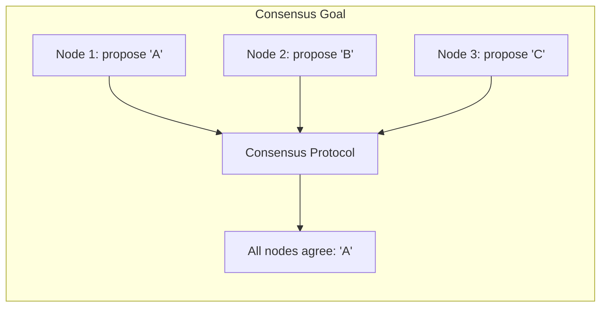

### Why Consensus Matters

| Use Case | Why Consensus Needed |
|----------|---------------------|
| **Leader election** | Exactly one leader at a time |
| **Distributed locks** | Exactly one holder at a time |
| **Replicated state machines** | All replicas execute same commands in same order |
| **Atomic broadcast** | All nodes deliver same messages in same order |
| **Distributed transactions** | All participants agree on commit/abort |

### Consensus Properties

A correct consensus protocol must satisfy:

| Property | Definition | Type |
|----------|------------|------|
| **Agreement** | All correct nodes decide the same value | Safety |
| **Validity** | The decided value was proposed by some node | Safety |
| **Termination** | All correct nodes eventually decide | Liveness |
| **Integrity** | Each node decides at most once | Safety |

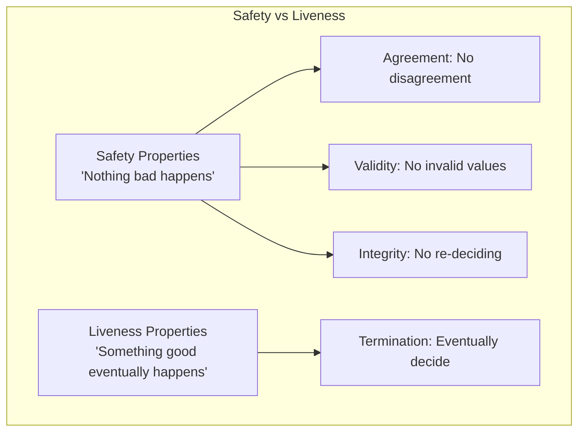

---

## 2. Theoretical Foundations

### The FLP Impossibility Result

**Fischer, Lynch, and Paterson (1985)** proved a fundamental limitation:

> In an asynchronous system with even one faulty process, no deterministic consensus protocol can guarantee termination.

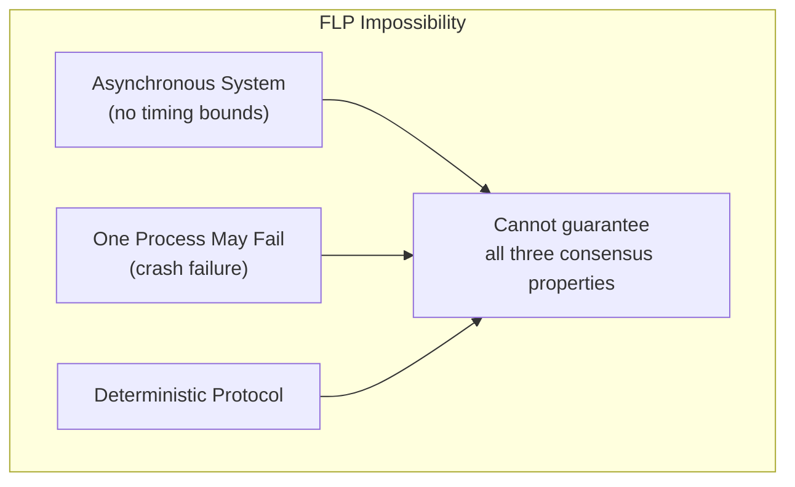

**Implications**:
- Cannot distinguish slow process from crashed process
- Must choose between safety and liveness during partitions
- Practical protocols use timeouts (partial synchrony)

### Circumventing FLP

| Approach | How It Works | Used By |
|----------|--------------|---------|
| **Partial synchrony** | Assume timing bounds eventually hold | Paxos, Raft |
| **Randomization** | Probabilistic termination | Ben-Or, blockchain |
| **Failure detectors** | Oracle hints about failures | Chandra-Toueg |

### The CAP Connection

Consensus relates to CAP theorem:

- **CP systems** use consensus (Paxos, Raft) → strong consistency, may be unavailable during partitions
- **AP systems** avoid consensus (Dynamo) → available during partitions, eventual consistency

### Byzantine vs Crash Failures

| Failure Model | Behavior | Tolerance | Examples |
|---------------|----------|-----------|----------|
| **Crash-fail** | Node stops, never recovers | f failures with 2f+1 nodes | Paxos, Raft |
| **Crash-recovery** | Node stops, may recover | f failures with 2f+1 nodes | Most practical systems |
| **Byzantine** | Node may behave arbitrarily | f failures with 3f+1 nodes | PBFT, blockchain |

Most practical systems assume crash failures, not Byzantine.

---

## 3. Paxos

### Overview

Paxos, invented by Leslie Lamport (1989, published 1998), is the foundational consensus algorithm. It's proven correct but notoriously difficult to understand and implement.

### Roles

| Role | Responsibility |
|------|----------------|
| **Proposer** | Proposes values, drives the protocol |
| **Acceptor** | Votes on proposals, stores accepted values |
| **Learner** | Learns the decided value |

In practice, a node often plays all three roles.

### Single-Decree Paxos (Basic Paxos)

Decides a single value through two phases:

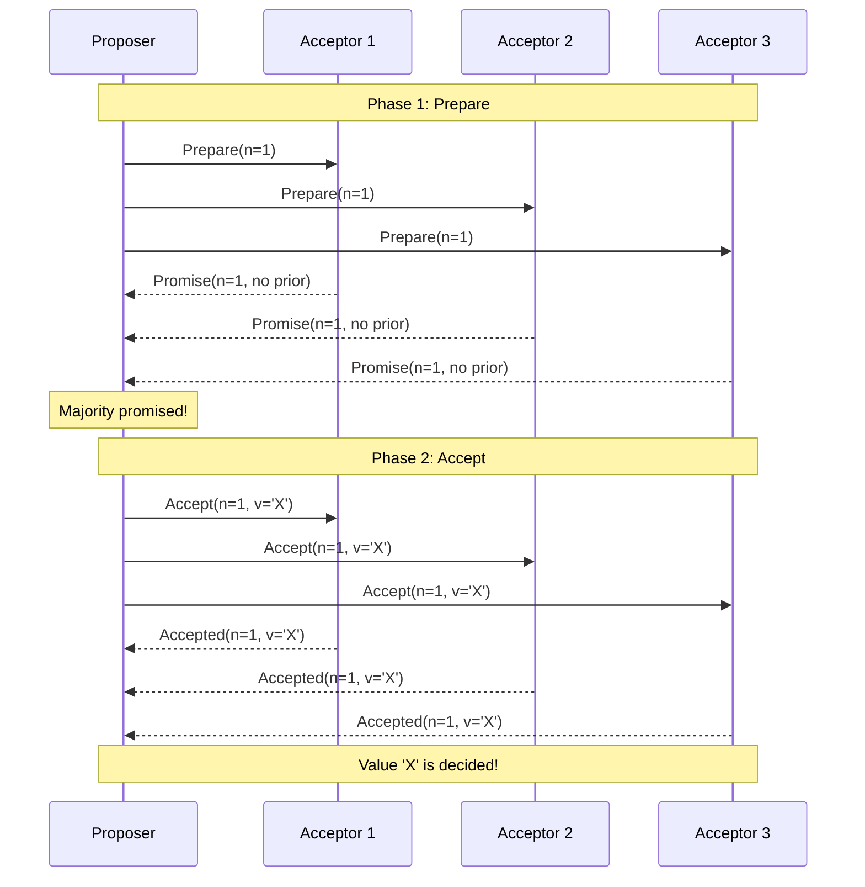

### Phase 1: Prepare

```python
# Proposer
def prepare(self, proposal_number: int):
    """
    Phase 1a: Send Prepare request with proposal number.

    Proposal number must be:
    - Unique (encode proposer ID)
    - Higher than any previously used by this proposer
    """
    responses = []
    for acceptor in self.acceptors:
        response = acceptor.receive_prepare(proposal_number)
        responses.append(response)

    # Need majority of promises
    promises = [r for r in responses if r.promised]
    if len(promises) > len(self.acceptors) // 2:
        return promises
    return None  # Failed to get majority

# Acceptor
def receive_prepare(self, n: int) -> PrepareResponse:
    """
    Phase 1b: Respond to Prepare.

    Promise to not accept proposals with number < n.
    Return any previously accepted value.
    """
    if n > self.highest_promised:
        self.highest_promised = n
        return PrepareResponse(
            promised=True,
            accepted_number=self.accepted_number,
            accepted_value=self.accepted_value
        )
    else:
        return PrepareResponse(promised=False)
```

### Phase 2: Accept

```python
# Proposer
def accept(self, proposal_number: int, promises: List[PrepareResponse]):
    """
    Phase 2a: Send Accept request.

    CRITICAL: If any promise contains an accepted value,
    must propose that value (not our own).
    This ensures previously accepted values are preserved.
    """
    # Find highest-numbered accepted value from promises
    value = self.proposed_value
    highest_accepted = -1

    for promise in promises:
        if promise.accepted_number is not None:
            if promise.accepted_number > highest_accepted:
                highest_accepted = promise.accepted_number
                value = promise.accepted_value  # Must use this value!

    responses = []
    for acceptor in self.acceptors:
        response = acceptor.receive_accept(proposal_number, value)
        responses.append(response)

    accepted = [r for r in responses if r.accepted]
    if len(accepted) > len(self.acceptors) // 2:
        return value  # Decided!
    return None

# Acceptor
def receive_accept(self, n: int, value: Any) -> AcceptResponse:
    """
    Phase 2b: Respond to Accept.

    Accept if proposal number >= highest promised.
    """
    if n >= self.highest_promised:
        self.highest_promised = n
        self.accepted_number = n
        self.accepted_value = value
        return AcceptResponse(accepted=True)
    else:
        return AcceptResponse(accepted=False)
```

### Why Paxos Is Correct

**Key insight**: The "adopt accepted value" rule in Phase 2 ensures safety.


### Paxos Failure Scenarios

**Scenario 1: Proposer fails after Phase 1**
- Another proposer can complete with higher proposal number
- May adopt value or propose new one (depending on what was accepted)

**Scenario 2: Dueling proposers (livelock)**
```
Proposer A: Prepare(1) succeeds
Proposer B: Prepare(2) succeeds, invalidates A
Proposer A: Accept(1) rejected, tries Prepare(3)
Proposer B: Accept(2) rejected, tries Prepare(4)
... (can continue forever)
```
Solution: Random backoff, leader election

### Paxos Complexity Analysis

| Operation | Messages | Rounds |
|-----------|----------|--------|
| Normal case | 4 (2 per phase) | 2 |
| With f failures | 4 | 2 |
| Competing proposers | Unbounded (livelock) | Unbounded |

---

## 4. Multi-Paxos

### The Problem with Basic Paxos

Basic Paxos decides one value. Real systems need to decide a sequence of values (log entries). Running separate Paxos instances is expensive.

### Multi-Paxos Optimization

Elect a stable leader who skips Phase 1 for subsequent proposals:

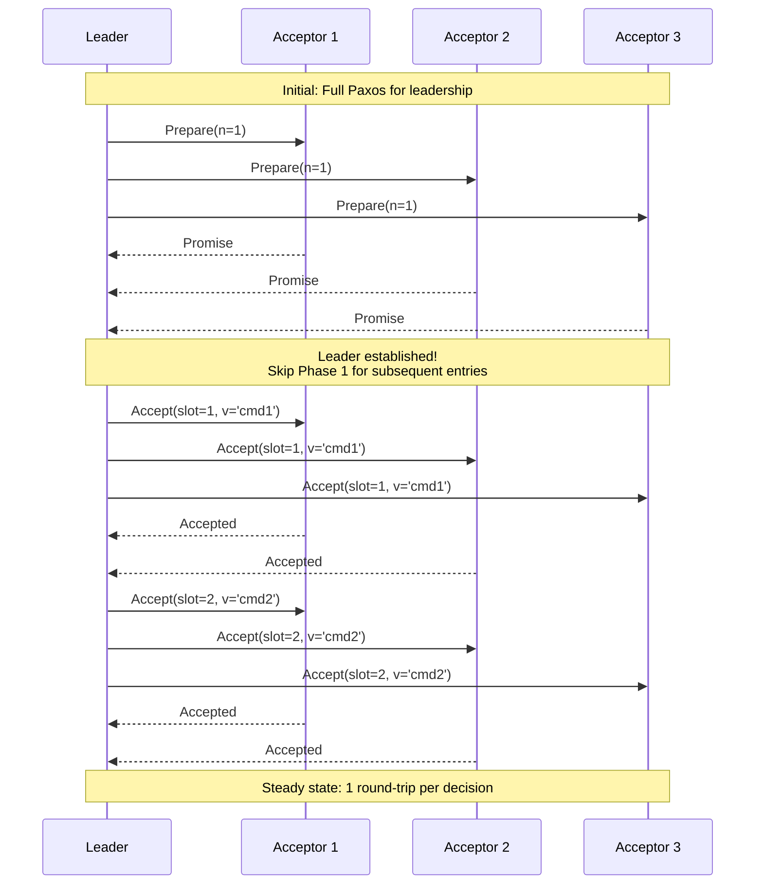

### Multi-Paxos Structure

```python
class MultiPaxos:
    """
    Multi-Paxos with stable leader optimization.
    """

    def __init__(self, node_id: str, nodes: List[str]):
        self.node_id = node_id
        self.nodes = nodes
        self.is_leader = False
        self.current_proposal_number = 0
        self.log: Dict[int, LogEntry] = {}  # slot -> entry

    def become_leader(self):
        """
        Run Phase 1 for all future slots.

        After this succeeds, can skip Phase 1.
        """
        self.current_proposal_number = self.generate_proposal_number()

        promises = []
        for node in self.nodes:
            response = node.prepare(self.current_proposal_number)
            if response.promised:
                promises.append(response)

        if len(promises) > len(self.nodes) // 2:
            self.is_leader = True
            # Recover any previously accepted values
            self.recover_log(promises)
            return True
        return False

    def propose(self, command: Any) -> int:
        """
        Propose a command (leader only, skips Phase 1).

        Returns the log slot where command was placed.
        """
        if not self.is_leader:
            raise NotLeaderError()

        slot = self.next_slot()

        # Phase 2 only (Phase 1 done during leader election)
        accepted = 0
        for node in self.nodes:
            response = node.accept(
                self.current_proposal_number,
                slot,
                command
            )
            if response.accepted:
                accepted += 1

        if accepted > len(self.nodes) // 2:
            self.log[slot] = LogEntry(command, decided=True)
            return slot

        raise ConsensusFailedError()
```

### Multi-Paxos Benefits

| Aspect | Basic Paxos | Multi-Paxos |
|--------|-------------|-------------|
| Messages per decision | 4 | 2 (steady state) |
| Round trips | 2 | 1 (steady state) |
| Leader changes | N/A | Requires full Paxos |

---

## 5. Raft

### Overview

Raft (2014) was designed for understandability. It's equivalent to Multi-Paxos in power but easier to implement correctly.

### Key Design Decisions

| Decision | Rationale |
|----------|-----------|
| Strong leader | Simplifies log replication |
| Leader election via randomized timeout | Avoids livelock |
| Log entries only flow leader → follower | Simplifies reasoning |
| Committed = replicated to majority | Clear commit point |

### Raft Roles

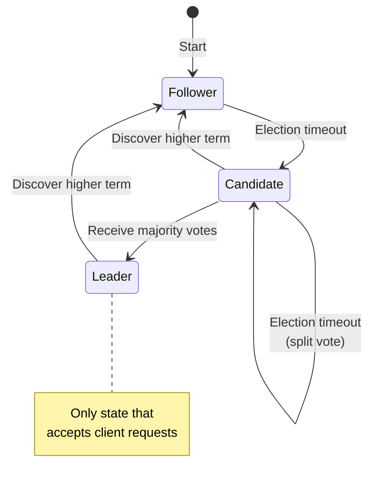

### Terms

Raft divides time into **terms**:

```
Term 1        Term 2        Term 3        Term 4
[Leader A]    [Election]    [Leader B]    [Leader B continues]
              [no leader]
```

- Each term has at most one leader
- Terms act as logical clocks
- Nodes reject messages from older terms

### Leader Election

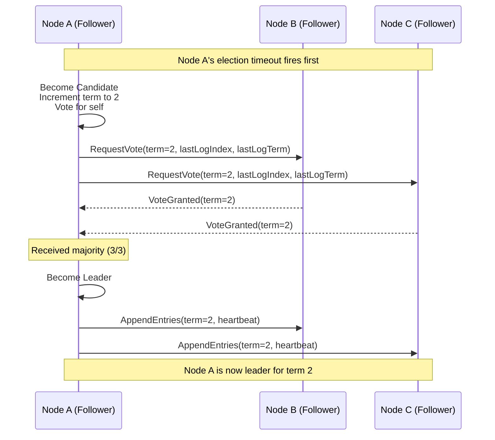

```python
class RaftNode:
    def __init__(self, node_id: str, peers: List[str]):
        self.node_id = node_id
        self.peers = peers

        # Persistent state
        self.current_term = 0
        self.voted_for = None
        self.log: List[LogEntry] = []

        # Volatile state
        self.state = 'follower'
        self.commit_index = 0
        self.last_applied = 0

        # Leader state
        self.next_index: Dict[str, int] = {}
        self.match_index: Dict[str, int] = {}

    def start_election(self):
        """
        Start leader election.

        Called when election timeout fires.
        """
        self.state = 'candidate'
        self.current_term += 1
        self.voted_for = self.node_id
        votes_received = 1  # Vote for self

        last_log_index = len(self.log) - 1
        last_log_term = self.log[last_log_index].term if self.log else 0

        for peer in self.peers:
            response = peer.request_vote(
                term=self.current_term,
                candidate_id=self.node_id,
                last_log_index=last_log_index,
                last_log_term=last_log_term
            )

            if response.term > self.current_term:
                # Discovered higher term, revert to follower
                self.current_term = response.term
                self.state = 'follower'
                self.voted_for = None
                return

            if response.vote_granted:
                votes_received += 1

        if votes_received > (len(self.peers) + 1) // 2:
            self.become_leader()

    def handle_request_vote(self, term: int, candidate_id: str,
                           last_log_index: int, last_log_term: int):
        """
        Handle RequestVote RPC.

        Grant vote if:
        1. Candidate's term >= our term
        2. We haven't voted for someone else this term
        3. Candidate's log is at least as up-to-date as ours
        """
        if term < self.current_term:
            return VoteResponse(term=self.current_term, vote_granted=False)

        if term > self.current_term:
            self.current_term = term
            self.state = 'follower'
            self.voted_for = None

        # Check if candidate's log is up-to-date
        our_last_term = self.log[-1].term if self.log else 0
        our_last_index = len(self.log) - 1

        log_ok = (last_log_term > our_last_term or
                  (last_log_term == our_last_term and
                   last_log_index >= our_last_index))

        if (self.voted_for is None or self.voted_for == candidate_id) and log_ok:
            self.voted_for = candidate_id
            return VoteResponse(term=self.current_term, vote_granted=True)

        return VoteResponse(term=self.current_term, vote_granted=False)
```

### Log Replication

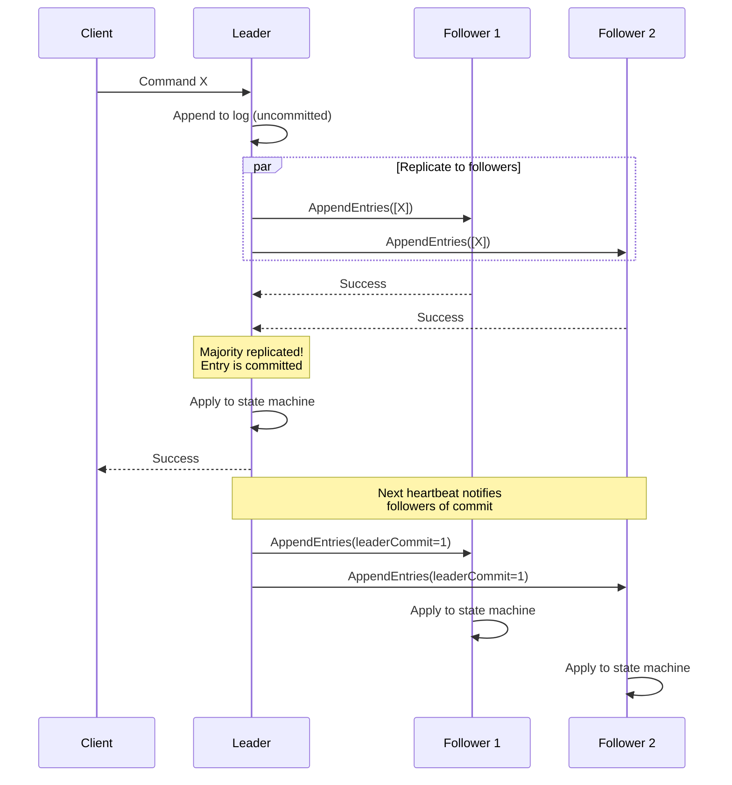

```python
def append_entries(self, term: int, leader_id: str, prev_log_index: int,
                   prev_log_term: int, entries: List[LogEntry],
                   leader_commit: int):
    """
    Handle AppendEntries RPC (log replication + heartbeat).
    """
    if term < self.current_term:
        return AppendResponse(term=self.current_term, success=False)

    self.reset_election_timer()
    self.state = 'follower'

    if term > self.current_term:
        self.current_term = term
        self.voted_for = None

    # Check log consistency
    if prev_log_index >= 0:
        if prev_log_index >= len(self.log):
            return AppendResponse(term=self.current_term, success=False)
        if self.log[prev_log_index].term != prev_log_term:
            # Delete conflicting entries
            self.log = self.log[:prev_log_index]
            return AppendResponse(term=self.current_term, success=False)

    # Append new entries
    for i, entry in enumerate(entries):
        index = prev_log_index + 1 + i
        if index < len(self.log):
            if self.log[index].term != entry.term:
                self.log = self.log[:index]
                self.log.append(entry)
        else:
            self.log.append(entry)

    # Update commit index
    if leader_commit > self.commit_index:
        self.commit_index = min(leader_commit, len(self.log) - 1)
        self.apply_committed_entries()

    return AppendResponse(term=self.current_term, success=True)
```

### Raft Safety

**Election Safety**: At most one leader per term.
- Each node votes once per term
- Candidate needs majority to win
- Two majorities must overlap → can't have two leaders

**Leader Completeness**: If entry committed in term T, present in all leaders for terms > T.
- Voters only vote for candidates with up-to-date logs
- "Up-to-date" = higher last term, or same term with longer log
- Committed entries are on majority → any majority includes one

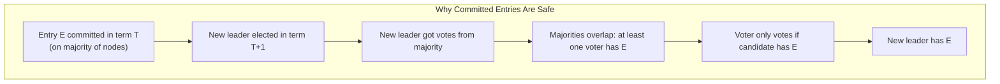

### Log Compaction (Snapshotting)

Logs grow unboundedly. Snapshotting compacts old entries:

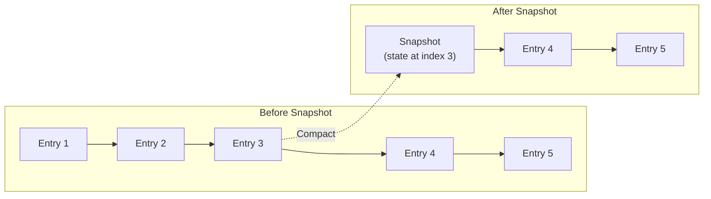

```python
def create_snapshot(self, last_included_index: int):
    """
    Create snapshot up to given index.
    """
    snapshot = Snapshot(
        last_included_index=last_included_index,
        last_included_term=self.log[last_included_index].term,
        state=self.state_machine.serialize()
    )

    # Discard compacted log entries
    self.log = self.log[last_included_index + 1:]
    self.snapshot = snapshot

    return snapshot
```

### Cluster Membership Changes

Adding/removing nodes safely requires joint consensus:

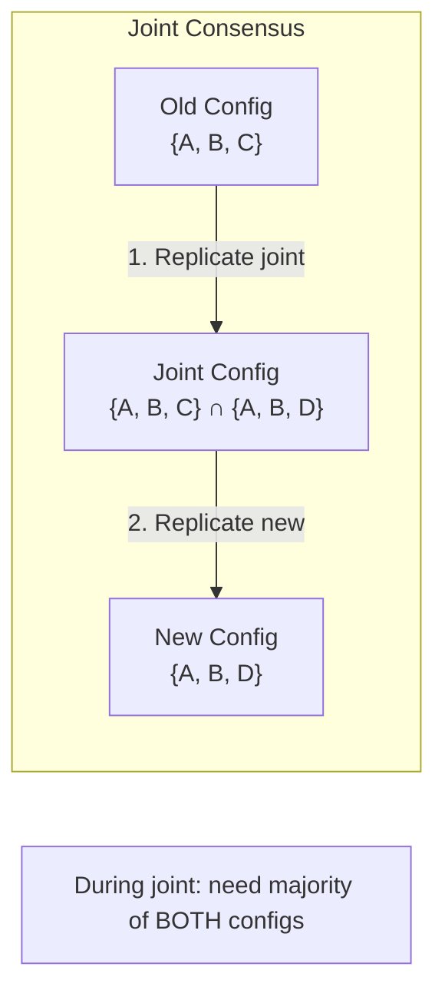

---

## 6. Zab (ZooKeeper Atomic Broadcast)

### Overview

Zab is ZooKeeper's consensus protocol. Similar to Raft but designed before Raft was published (2008).

### Key Differences from Raft

| Aspect | Raft | Zab |
|--------|------|-----|
| Primary focus | Replicated state machine | Atomic broadcast |
| Log recovery | Leader sends missing entries | Leader syncs full state |
| Proposal ordering | By log index | By zxid (epoch + counter) |
| Commit notification | Via leaderCommit field | Explicit COMMIT message |

### Zab Phases

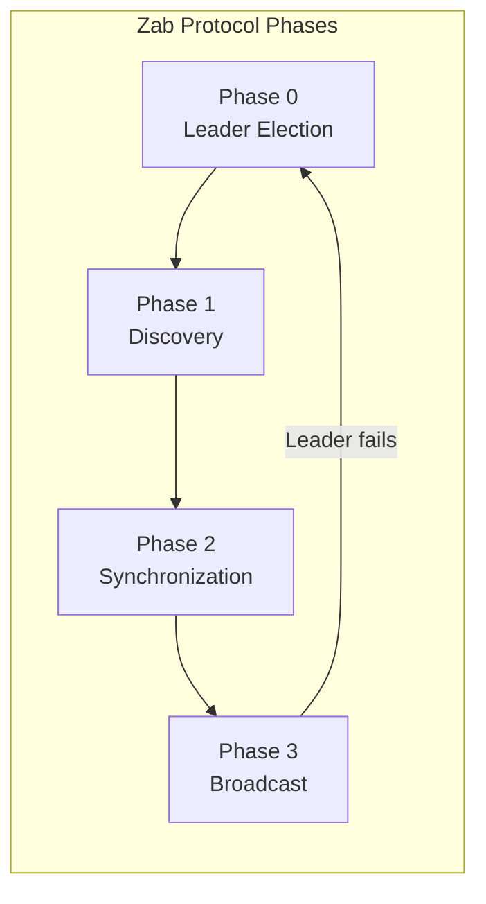

### Zxid Structure

```
Zxid (64-bit):
┌─────────────────────┬─────────────────────┐
│  Epoch (32 bits)    │  Counter (32 bits)  │
└─────────────────────┴─────────────────────┘

Example: 0x0000000300000005
  - Epoch 3, Counter 5
  - Higher epoch always wins
```

### Zab Broadcast Phase

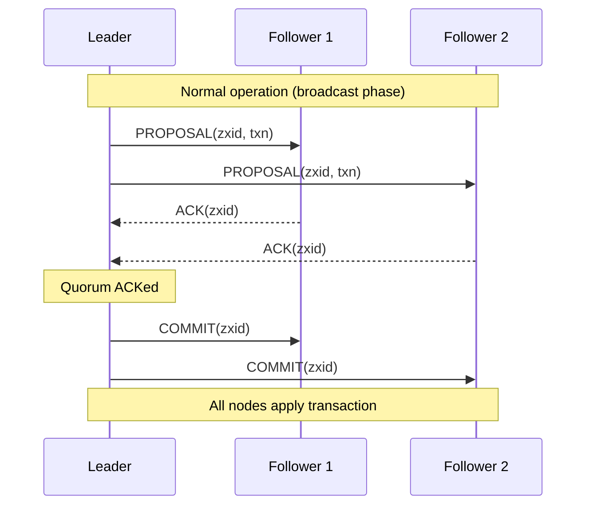

### When to Use Zab vs Raft

| Use Case | Better Choice | Reason |
|----------|---------------|--------|
| General replicated state machine | Raft | Simpler, well-documented |
| Coordination service (locks, config) | Zab | Battle-tested in ZooKeeper |
| New implementation | Raft | Easier to understand and implement |
| Need ZooKeeper semantics | Zab | Native support |

---

## 7. Viewstamped Replication

### Overview

Viewstamped Replication (VR) predates Paxos publication (1988). It's similar to Raft but uses different terminology.

### Terminology Mapping

| Viewstamped Replication | Raft |
|-------------------------|------|
| View | Term |
| Primary | Leader |
| Backup | Follower |
| View change | Leader election |
| Op-number | Log index |

### Key Insight

VR showed that consensus can be decomposed into:
1. **Normal operation**: Leader replicates to followers
2. **View change**: Elect new leader, recover state

This decomposition influenced both Paxos implementations and Raft.

---

## 8. Algorithm Comparison

### Feature Comparison

| Feature | Paxos | Multi-Paxos | Raft | Zab |
|---------|-------|-------------|------|-----|
| Understandability | Low | Low | High | Medium |
| Leader required | No | Yes (optimized) | Yes | Yes |
| Log ordering | Per-slot | Per-slot | Sequential | Sequential |
| Reconfiguration | Complex | Complex | Joint consensus | Dynamic |
| Production use | Wide | Wide | Growing | ZooKeeper |

### Performance Comparison

| Metric | Paxos | Raft | Zab |
|--------|-------|------|-----|
| Messages (steady state) | 2 | 2 | 3 (proposal + ack + commit) |
| Round trips (steady state) | 1 | 1 | 1.5 |
| Leader election | Unbounded | O(election timeout) | O(election timeout) |
| Log catch-up | Entry-by-entry | Entry-by-entry | Full sync |

### Complexity Comparison

| Operation | Paxos | Raft |
|-----------|-------|------|
| Normal operation | O(N) messages | O(N) messages |
| Leader election | O(N) messages | O(N) messages |
| Log replication | O(N) per entry | O(N) per entry |
| Snapshot transfer | N/A (log only) | O(snapshot size) |

### Decision Matrix

| Scenario | Recommended | Rationale |
|----------|-------------|-----------|
| New system, general purpose | Raft | Understandable, well-documented |
| Need ZooKeeper-like service | Zab | Battle-tested for coordination |
| Academic/research | Paxos | Foundational understanding |
| Existing Paxos codebase | Multi-Paxos | Build on existing work |
| High performance critical | Either | Both have similar performance |

---

## 9. Production Systems

### etcd (Raft)

**Use case**: Kubernetes configuration store, distributed locking

```yaml
# etcd cluster configuration
name: 'node1'
initial-cluster: 'node1=http://10.0.0.1:2380,node2=http://10.0.0.2:2380,node3=http://10.0.0.3:2380'
initial-cluster-state: 'new'
initial-cluster-token: 'etcd-cluster-1'

# Raft tuning
heartbeat-interval: 100      # ms
election-timeout: 1000       # ms
snapshot-count: 10000        # entries before snapshot
```

**Operational notes**:
- 3 or 5 nodes typical (odd number for majority)
- Leader handles all writes
- Any node can serve linearizable reads (with `--consistency=l`)
- Watch for leader election storms under high load

### ZooKeeper (Zab)

**Use case**: Distributed coordination, leader election, configuration management

```properties
# zoo.cfg
tickTime=2000
initLimit=5
syncLimit=2
dataDir=/var/lib/zookeeper
clientPort=2181
server.1=zoo1:2888:3888
server.2=zoo2:2888:3888
server.3=zoo3:2888:3888
```

**Operational notes**:
- 3 or 5 nodes typical
- Higher `syncLimit` for high-latency networks
- Monitor session timeouts (indicates leader issues)
- Snapshot and transaction logs on separate disks

### CockroachDB (Raft)

**Use case**: Distributed SQL database

```sql
-- CockroachDB uses Raft per range (shard)
-- Each range is ~64MB of data
-- Raft groups are automatically managed

-- View Raft status
SHOW RANGES FROM TABLE users;
```

**Architecture**:
- One Raft group per range
- Thousands of Raft groups per cluster
- Raft log separate from SQL data
- Leader leases for read optimization

### TiKV (Raft)

**Use case**: Distributed key-value store (TiDB storage layer)

```toml
# TiKV configuration
[raftstore]
raft-heartbeat-ticks = 2
raft-election-timeout-ticks = 10
raft-log-gc-tick-interval = "10s"
raft-log-gc-count-limit = 72000
```

**Architecture**:
- Multi-Raft: one Raft group per Region
- Regions split/merge automatically
- Raft logs stored in RocksDB
- Learner replicas for async replication

---

## 10. Interview Articulation

### 30-Second Version

> "Consensus is how distributed systems agree on a value despite failures. The key algorithms are Paxos—the foundational but complex algorithm—and Raft, designed for understandability. Both work by electing a leader who coordinates replication to a majority of nodes. An entry is committed once a majority acknowledges it, which guarantees it survives any minority failure. The main tradeoff is availability: during leader election or network partitions, the system can't make progress. That's why systems like Dynamo avoid consensus entirely, accepting weaker consistency for higher availability."

### 2-Minute Version

> "Consensus solves the problem of getting multiple nodes to agree on a single value, which is essential for leader election, distributed locks, and replicated state machines.
>
> The FLP impossibility result proves you can't guarantee consensus in an asynchronous system with failures. Practical protocols like Paxos and Raft circumvent this by assuming partial synchrony—timing bounds that eventually hold.
>
> Paxos, invented by Lamport, uses two phases. Phase 1 (Prepare) gets promises from a majority not to accept older proposals, and learns any previously accepted values. Phase 2 (Accept) proposes a value—critically, if Phase 1 revealed an accepted value, we must propose that value to preserve safety. Multi-Paxos optimizes by having a stable leader skip Phase 1.
>
> Raft was designed for understandability. It uses a strong leader model: clients only talk to the leader, who replicates log entries to followers. Entries are committed when replicated to a majority. Leader election uses randomized timeouts to avoid livelock. Safety comes from two properties: only one leader per term, and voters only vote for candidates with up-to-date logs.
>
> Zab, used by ZooKeeper, is similar to Raft but predates it. The main difference is explicit COMMIT messages rather than piggybacking on heartbeats.
>
> In production, etcd and CockroachDB use Raft; ZooKeeper uses Zab. Typical deployments use 3 or 5 nodes. The key operational concern is leader election storms under high load or network instability."

### Common Follow-Up Questions

| Question | Key Points |
|----------|------------|
| "Paxos vs Raft?" | Equivalent power; Raft designed for understandability; both need majority |
| "Why majority?" | Any two majorities overlap → preserves committed values |
| "What about Byzantine failures?" | Need 3f+1 nodes; PBFT or blockchain; most systems assume crash failures |
| "How fast is consensus?" | 1 round-trip steady state; bottleneck is disk fsync |
| "Why odd number of nodes?" | 3 nodes tolerates 1 failure; 4 nodes also tolerates 1 (no benefit) |
| "What's the CAP relationship?" | Consensus gives CP; sacrifices availability during partitions |

---

## 11. Decision Framework

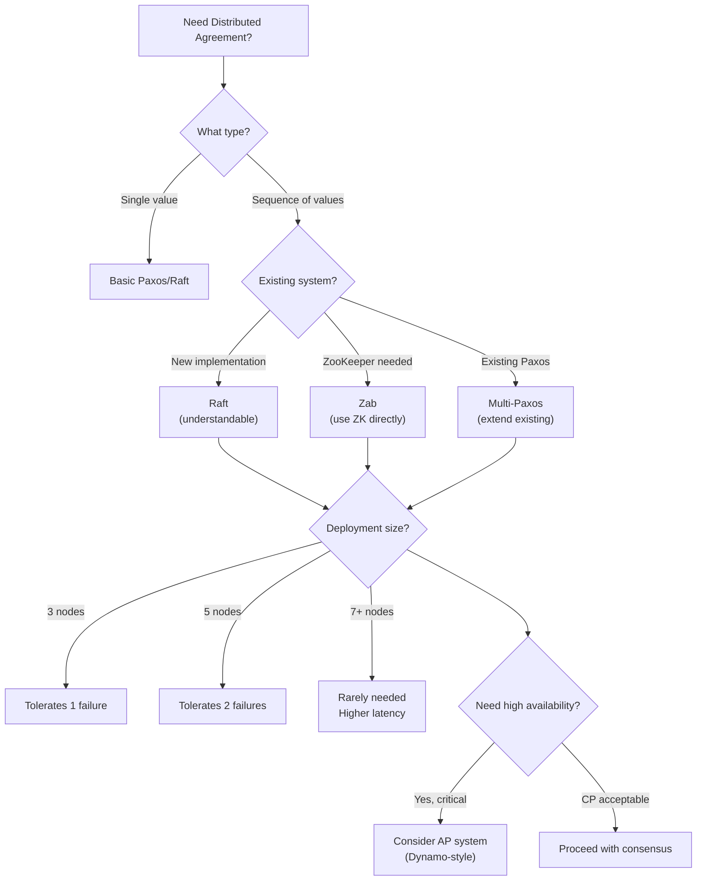

---

## 12. Quick Reference Card

### Core Concepts

| Concept | Definition |
|---------|------------|
| **Consensus** | Multiple nodes agree on single value |
| **Quorum** | Majority of nodes (N/2 + 1) |
| **Term/Epoch** | Logical time period with at most one leader |
| **Committed** | Replicated to quorum, survives failures |

### Algorithm Comparison

| Aspect | Paxos | Raft | Zab |
|--------|-------|------|-----|
| Complexity | High | Low | Medium |
| Leader | Optional | Required | Required |
| Steady-state msgs | 2 | 2 | 3 |
| Used by | Chubby, Spanner | etcd, CockroachDB | ZooKeeper |

### Failure Tolerance

| Nodes | Tolerated Failures | Quorum |
|-------|-------------------|--------|
| 3 | 1 | 2 |
| 5 | 2 | 3 |
| 7 | 3 | 4 |

**Formula**: With N nodes, tolerates (N-1)/2 failures.

### Message Patterns

| Phase | Paxos | Raft |
|-------|-------|------|
| Leader election | Prepare/Promise | RequestVote |
| Replication | Accept/Accepted | AppendEntries |
| Commit | Learn | (via leaderCommit) |

### Common Pitfalls

| Pitfall | Symptom | Solution |
|---------|---------|----------|
| Even number of nodes | No benefit over N-1 | Use odd numbers |
| Election timeout too low | Frequent elections | Increase timeout |
| No disk fsync | Data loss on crash | Enable fsync |
| Split brain | Two leaders | Check network, increase timeout |

---

## References

### Academic Papers

- **Lamport, 1998** — "The Part-Time Parliament" — Original Paxos paper
- **Lamport, 2001** — "Paxos Made Simple" — Simplified explanation
- **Ongaro & Ousterhout, 2014** — "In Search of an Understandable Consensus Algorithm" (USENIX ATC) — Raft paper
- **Junqueira et al., 2011** — "Zab: High-performance broadcast for primary-backup systems" — Zab paper
- **Fischer, Lynch, Paterson, 1985** — "Impossibility of Distributed Consensus with One Faulty Process" — FLP result
- **Oki & Liskov, 1988** — "Viewstamped Replication" — VR paper

### Production Documentation

- **etcd** — [Raft Implementation](https://etcd.io/docs/v3.5/learning/raft/)
- **ZooKeeper** — [Internals](https://zookeeper.apache.org/doc/r3.7.0/zookeeperInternals.html)
- **CockroachDB** — [Raft in CockroachDB](https://www.cockroachlabs.com/docs/stable/architecture/replication-layer.html)
- **TiKV** — [Raft in TiKV](https://tikv.org/deep-dive/consensus-algorithm/raft/)

### Visualizations

- [Raft Visualization](https://raft.github.io/) — Interactive Raft demo
- [The Raft Paper](https://raft.github.io/raft.pdf) — With excellent figures

---

## Revision History

| Date | Change |
|------|--------|
| 2025-01 | Initial deep-dive document with Paxos, Multi-Paxos, Raft, Zab, safety proofs, production examples |

---

## Navigation

**Parent:** [Consistency & Transactions](./02_CONSISTENCY_AND_TRANSACTIONS.md)
**Related:** [Dynamo Architecture](./DD_DYNAMO_ARCHITECTURE.md), [Distributed Coordination](./07_DISTRIBUTED_COORDINATION.md)
**Previous:** [Dynamo Architecture](./DD_DYNAMO_ARCHITECTURE.md)
**Index:** [README](./README.md)
