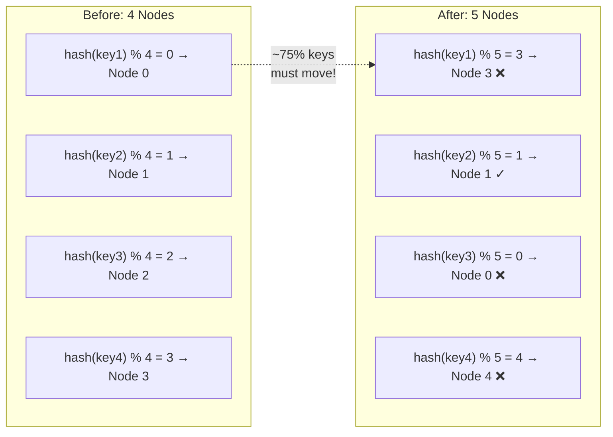
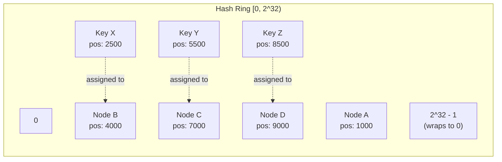
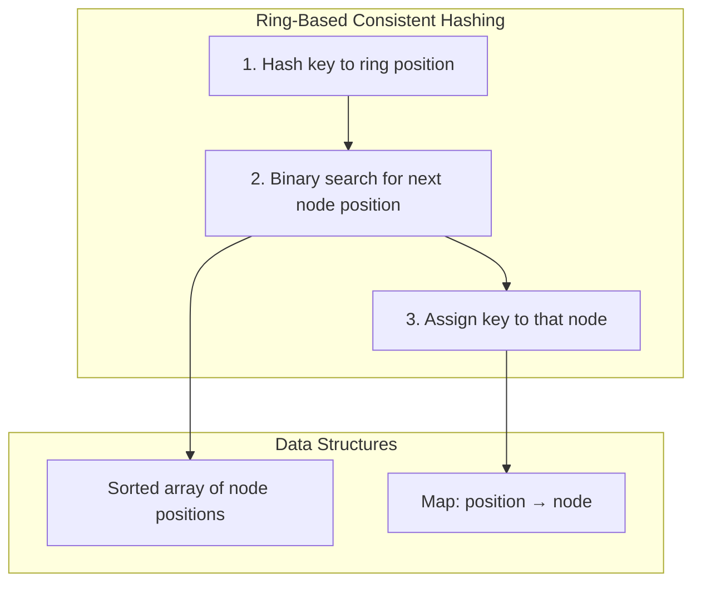
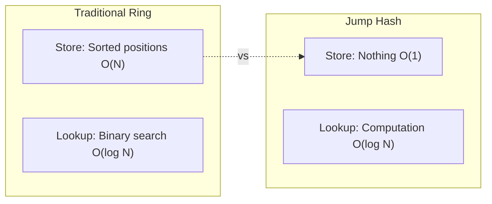
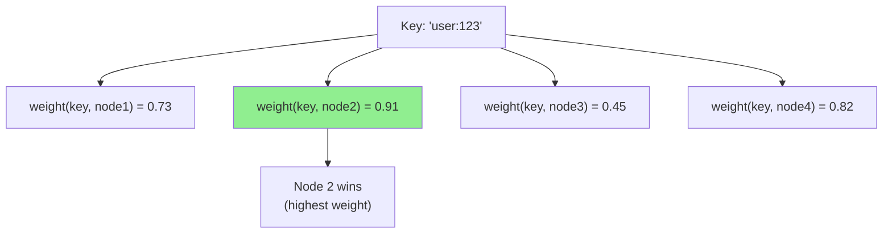
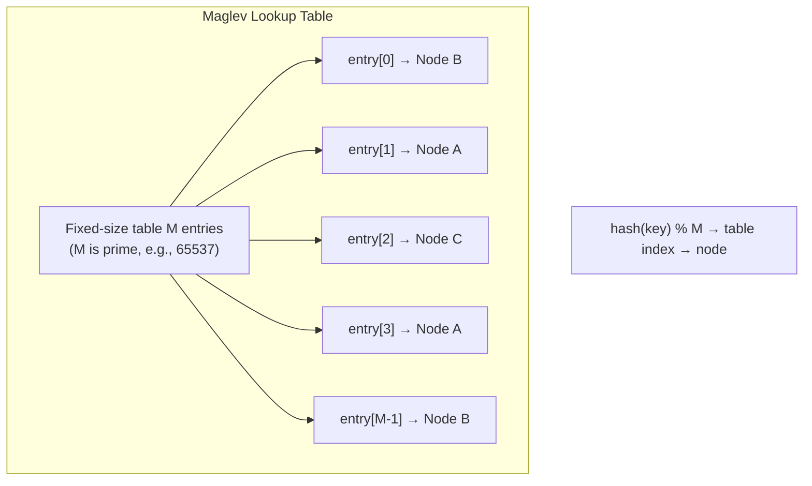
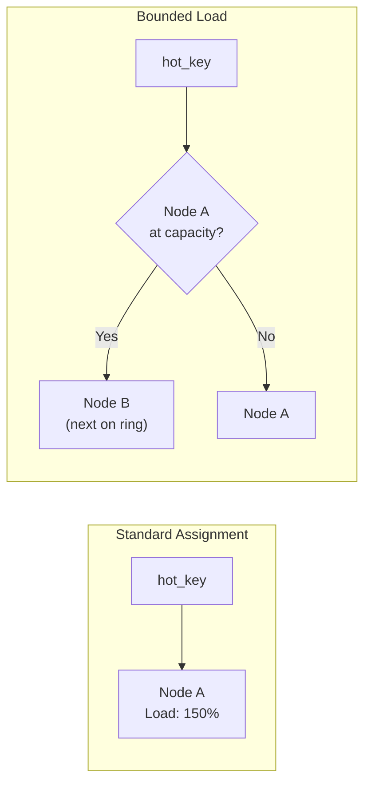
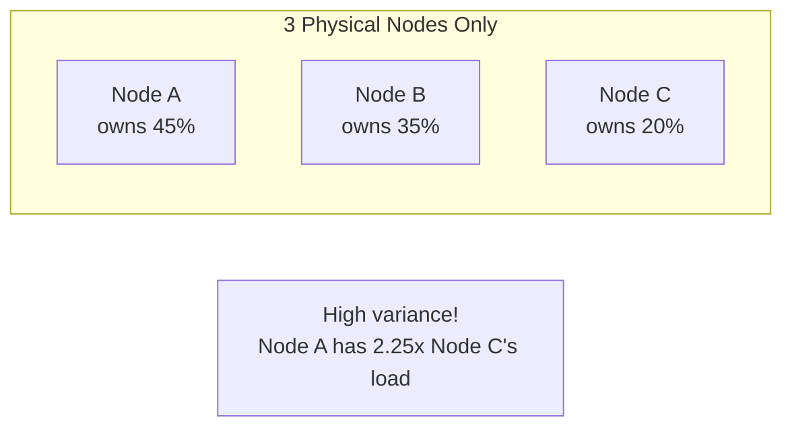
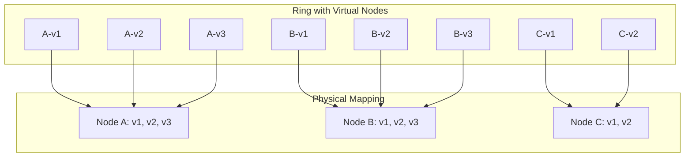

# Consistent Hashing — Deep Dive

> Mathematical foundations, algorithm variants, and production implementations for minimal-disruption data distribution.

**Prerequisites:** [Data Management Overview](./DATA_MANAGEMENT.md), [Sharding & Partitioning](./DD_SHARDING_PARTITIONING.md)
**Related:** [Dynamo Architecture](./DD_DYNAMO_ARCHITECTURE.md), [Distributed Coordination](./07_DISTRIBUTED_COORDINATION.md)
**Estimated study time:** 2-3 hours

---

## Table of Contents

1. [Context & Problem Statement](#1-context--problem-statement)
2. [Mathematical Foundation](#2-mathematical-foundation)
3. [Ring-Based Consistent Hashing](#3-ring-based-consistent-hashing)
4. [Jump Consistent Hash](#4-jump-consistent-hash)
5. [Rendezvous (HRW) Hashing](#5-rendezvous-hrw-hashing)
6. [Maglev Hashing](#6-maglev-hashing)
7. [Bounded Load Consistent Hashing](#7-bounded-load-consistent-hashing)
8. [Virtual Nodes](#8-virtual-nodes)
9. [Production Implementations](#9-production-implementations)
10. [Interview Articulation](#10-interview-articulation)
11. [Decision Framework](#11-decision-framework)
12. [Quick Reference Card](#12-quick-reference-card)
13. [References](#references)

---

## 1. Context & Problem Statement

### The Fundamental Problem

When distributing data across N nodes, the naive approach uses modulo hashing:

```
node = hash(key) % N
```

This works until the cluster topology changes:



**Impact of Topology Change with Modulo Hashing:**

| Nodes | Added/Removed | Keys Moved | Percentage |
|-------|---------------|------------|------------|
| 4 → 5 | +1 | ~80% | K × (1 - 4/5) |
| 10 → 11 | +1 | ~91% | K × (1 - 10/11) |
| 100 → 101 | +1 | ~99% | K × (1 - 100/101) |
| N → N+1 | +1 | K × (N-1)/N | Approaches 100% |

This causes:
- **Cache stampedes**: All caches invalidated simultaneously
- **Massive data migration**: Most keys need to move between nodes
- **Service disruption**: Temporary unavailability during rebalancing

### What Consistent Hashing Solves

Consistent hashing guarantees that when a node is added or removed, only **K/N keys** move on average (where K = total keys, N = nodes).

| Scenario | Modulo Hash | Consistent Hash |
|----------|-------------|-----------------|
| Add 1 node to 10 | ~90% keys move | ~10% keys move |
| Remove 1 node from 10 | ~90% keys move | ~10% keys move |
| Add 1 node to 100 | ~99% keys move | ~1% keys move |

### Historical Context

- **1997**: Karger et al. introduce consistent hashing at MIT for distributed caching (Akamai)
- **2007**: Amazon Dynamo paper popularizes consistent hashing for distributed databases
- **2014**: Google publishes Jump Consistent Hash (O(1) space)
- **2016**: Google Maglev paper introduces minimal disruption hashing for load balancers

---

## 2. Mathematical Foundation

### Hash Ring Concept

Consistent hashing maps both **keys** and **nodes** to positions on a circular hash space (ring).

**Formal Definition:**

Let H be a hash function with range [0, 2^m) for some m (typically m=32 or m=64).

- **Ring**: The set of integers [0, 2^m) arranged in a circle where 2^m - 1 wraps to 0
- **Node position**: For node n, position(n) = H(n)
- **Key position**: For key k, position(k) = H(k)
- **Assignment rule**: Key k is assigned to the first node n encountered when walking clockwise from position(k)



### Key Movement Proof (K/N Property)

**Theorem**: When adding a node to an N-node ring, the expected number of keys that move is K/N.

**Proof Intuition**:

1. With N nodes, the ring is divided into N arcs
2. Each node owns approximately 1/N of the ring (by symmetry of random hash placement)
3. A new node N+1 is placed at a random position, creating a new arc
4. The new node takes ownership of keys in its arc from the previously responsible node
5. The expected size of this arc is 1/(N+1) of the ring
6. Therefore, ~K/(N+1) ≈ K/N keys move (for large N)

**Formal Proof**:

Let the ring have total size S = 2^m. With N uniformly distributed nodes:
- Expected arc length per node: S/N
- When node N+1 is added at random position p:
  - It takes over the arc from p to the next node clockwise
  - Expected arc length: S/(N+1)
  - Keys in this arc: K × (S/(N+1))/S = K/(N+1)

**For node removal**: The departing node's arc (expected size S/N) is absorbed by its successor. Keys moved: K/N.

### Load Distribution Analysis

With uniform hashing, node loads follow a distribution:

| Metric | Formula | With 10 Nodes |
|--------|---------|---------------|
| Expected load per node | K/N | K/10 |
| Standard deviation | √(K/N) | √(K/10) |
| Maximum load (high probability) | O(K/N × log N) | ~3.3 × K/10 |
| Load imbalance ratio | O(log N / log log N) | ~2.6x |

**Problem**: With few nodes, variance is high. One node might have 2-3x the average load.

**Solution**: Virtual nodes (covered in Section 8).

---

## 3. Ring-Based Consistent Hashing

The original consistent hashing algorithm from Karger et al. (1997).

### Mechanism



### Algorithm

```python
import bisect
import hashlib
from typing import Dict, List, Optional, Any

class ConsistentHashRing:
    """
    Ring-based consistent hashing implementation.

    Time Complexity:
        - Lookup: O(log N) where N = number of node positions
        - Add node: O(N) for array insertion (O(log N) amortized with tree)
        - Remove node: O(N) for array removal

    Space Complexity: O(N) for N node positions
    """

    def __init__(self, hash_function=None):
        self.ring: Dict[int, str] = {}  # position -> node_id
        self.sorted_positions: List[int] = []
        self.hash_fn = hash_function or self._default_hash

    def _default_hash(self, key: str) -> int:
        """Hash key to 32-bit integer position on ring."""
        digest = hashlib.md5(key.encode()).digest()
        return int.from_bytes(digest[:4], 'big')

    def add_node(self, node_id: str) -> None:
        """Add a node to the ring."""
        position = self.hash_fn(node_id)

        if position not in self.ring:
            self.ring[position] = node_id
            bisect.insort(self.sorted_positions, position)

    def remove_node(self, node_id: str) -> None:
        """Remove a node from the ring."""
        position = self.hash_fn(node_id)

        if position in self.ring:
            del self.ring[position]
            self.sorted_positions.remove(position)

    def get_node(self, key: str) -> Optional[str]:
        """
        Find the node responsible for a given key.

        Algorithm:
        1. Hash key to position on ring
        2. Binary search for first node position >= key position
        3. If none found (key position > all nodes), wrap to first node
        """
        if not self.ring:
            return None

        key_position = self.hash_fn(key)

        # Binary search for first position >= key_position
        idx = bisect.bisect_left(self.sorted_positions, key_position)

        # Wrap around if needed
        if idx == len(self.sorted_positions):
            idx = 0

        node_position = self.sorted_positions[idx]
        return self.ring[node_position]

    def get_nodes_for_replication(self, key: str, replicas: int) -> List[str]:
        """Get N distinct nodes for replication (walking clockwise)."""
        if not self.ring or replicas <= 0:
            return []

        key_position = self.hash_fn(key)
        idx = bisect.bisect_left(self.sorted_positions, key_position)

        nodes = []
        seen = set()

        for i in range(len(self.sorted_positions)):
            pos_idx = (idx + i) % len(self.sorted_positions)
            node = self.ring[self.sorted_positions[pos_idx]]

            if node not in seen:
                nodes.append(node)
                seen.add(node)

                if len(nodes) == replicas:
                    break

        return nodes
```

### Complexity Analysis

| Operation | Time | Space | Notes |
|-----------|------|-------|-------|
| Hash key | O(1) | O(1) | Hash function computation |
| Lookup node | O(log N) | O(1) | Binary search on sorted positions |
| Add node | O(N) | O(1) | Array insertion; O(log N) with balanced tree |
| Remove node | O(N) | O(1) | Array removal; O(log N) with balanced tree |
| Get K replicas | O(K log N) | O(K) | K binary searches or linear walk |

*N = number of node positions on ring*

### Trade-offs

| Advantage | Disadvantage |
|-----------|--------------|
| Minimal key movement (K/N) | O(log N) lookup vs O(1) for modulo |
| Simple concept | Load imbalance with few nodes |
| Works with any hash function | Memory for position storage |
| Easy replication (walk ring) | Ring must be synchronized across clients |

### When to Choose

- Dynamic cluster topology (nodes frequently added/removed)
- Can tolerate O(log N) lookup
- Need replication with preference lists
- Standard distributed storage scenario

---

## 4. Jump Consistent Hash

Google's 2014 algorithm achieving O(1) space complexity.

### Key Innovation

Jump hash uses no explicit data structure—it computes the bucket directly through a deterministic pseudo-random sequence.



### Algorithm

```cpp
// Original C++ implementation from Google paper
int32_t JumpConsistentHash(uint64_t key, int32_t num_buckets) {
    int64_t b = -1, j = 0;
    while (j < num_buckets) {
        b = j;
        key = key * 2862933555777941757ULL + 1;  // LCG step
        j = (b + 1) * (double(1LL << 31) / double((key >> 33) + 1));
    }
    return b;
}
```

```python
def jump_consistent_hash(key: int, num_buckets: int) -> int:
    """
    Jump Consistent Hash algorithm.

    Properties:
    - O(log N) time (expected ~ln(N) iterations)
    - O(1) space (no data structures)
    - Monotonic: keys only move to new buckets, never between old ones

    Args:
        key: 64-bit key to hash
        num_buckets: number of buckets (must be > 0)

    Returns:
        Bucket index in [0, num_buckets)
    """
    b, j = -1, 0

    while j < num_buckets:
        b = j
        key = ((key * 2862933555777941757) + 1) & ((1 << 64) - 1)  # LCG
        j = int((b + 1) * (float(1 << 31) / float((key >> 33) + 1)))

    return b
```

### How It Works

The algorithm simulates "jumping" through bucket assignments:

1. Start at bucket 0
2. For each potential bucket b, compute probability of staying vs jumping
3. Jump to a new bucket j > b with probability (b+1)/j
4. Stop when j >= num_buckets

**Monotonicity Property**: When increasing from N to N+1 buckets:
- Keys in buckets 0 to N-2: stay in place
- Keys in bucket N-1: either stay or move to bucket N
- Only ~1/N keys move (optimal!)

```
N=3 buckets:  key → bucket 2
N=4 buckets:  key → bucket 2 (stayed) OR bucket 3 (moved)
              Never moves to bucket 0 or 1!
```

### Complexity Analysis

| Operation | Time | Space | Notes |
|-----------|------|-------|-------|
| Hash key | O(log N) expected | O(1) | ~ln(N) loop iterations |
| Add bucket | O(1) | O(1) | Just increment count |
| Remove bucket | O(1) | O(1) | Decrement count; only last bucket removable |
| Memory per client | O(1) | O(1) | No ring storage needed |

### Trade-offs

| Advantage | Disadvantage |
|-----------|--------------|
| O(1) space | Can only add/remove at end |
| Perfect load balance | No support for weighted nodes |
| Very fast computation | No replication support built-in |
| Minimal key movement | Buckets must be numbered 0..N-1 |

### When to Choose

- Memory-constrained environments
- Buckets are numbered sequentially
- Rarely need to remove middle buckets
- Don't need weighted distribution
- Simple sharding without replication

---

## 5. Rendezvous (HRW) Hashing

Highest Random Weight hashing—an alternative to ring-based consistent hashing.

### Mechanism

For each key, compute a weight for every node. Assign key to node with highest weight.



### Algorithm

```python
import hashlib
from typing import List, Optional

def hrw_hash(key: str, nodes: List[str]) -> Optional[str]:
    """
    Highest Random Weight (Rendezvous) hashing.

    Time: O(N) - must compute weight for all nodes
    Space: O(1) - no data structures

    Properties:
    - Minimal disruption: removing node only affects its keys
    - Simple to implement and understand
    - No virtual nodes needed for balance
    """
    if not nodes:
        return None

    def weight(key: str, node: str) -> int:
        """Compute weight for (key, node) pair."""
        combined = f"{key}:{node}"
        return int(hashlib.md5(combined.encode()).hexdigest(), 16)

    # Find node with highest weight
    best_node = None
    best_weight = -1

    for node in nodes:
        w = weight(key, node)
        if w > best_weight:
            best_weight = w
            best_node = node

    return best_node


def hrw_hash_top_k(key: str, nodes: List[str], k: int) -> List[str]:
    """Get top K nodes for replication."""
    if not nodes:
        return []

    def weight(key: str, node: str) -> int:
        combined = f"{key}:{node}"
        return int(hashlib.md5(combined.encode()).hexdigest(), 16)

    # Sort nodes by weight descending
    weighted = [(weight(key, node), node) for node in nodes]
    weighted.sort(reverse=True)

    return [node for _, node in weighted[:k]]
```

### Complexity Analysis

| Operation | Time | Space | Notes |
|-----------|------|-------|-------|
| Hash key | O(N) | O(1) | Must evaluate all nodes |
| Add node | O(1) | O(1) | Just add to node list |
| Remove node | O(1) | O(1) | Just remove from list |
| Get K replicas | O(N log N) | O(N) | Sort all weights |

### Trade-offs

| Advantage | Disadvantage |
|-----------|--------------|
| Simple implementation | O(N) lookup time |
| No data structures | Slow for large N |
| Natural replication (top-K) | Must know all nodes |
| Perfect balance | |

### When to Choose

- Small number of nodes (N < 100)
- Need natural K-replica selection
- Simplicity over performance
- Nodes change frequently (no ring to update)

---

## 6. Maglev Hashing

Google's algorithm for consistent load balancer hashing with minimal disruption.

### Problem Addressed

Standard consistent hashing has two issues for load balancers:
1. Lookup tables are expensive to rebuild
2. Load imbalance from hash collisions

Maglev builds a **fixed-size lookup table** with near-perfect load distribution.

### Mechanism



### Algorithm Overview

```python
def build_maglev_table(nodes: List[str], table_size: int) -> List[str]:
    """
    Build Maglev lookup table.

    Args:
        nodes: List of node identifiers
        table_size: Size M (should be prime, >> num_nodes)

    Returns:
        Lookup table where table[hash(key) % M] gives the node

    Properties:
    - Each node gets ~M/N entries
    - Minimal disruption on node changes
    - O(1) lookup after table built
    """
    N = len(nodes)
    M = table_size

    # Generate permutation for each node
    # Each node has a unique sequence for filling the table
    permutations = []
    for node in nodes:
        offset = hash1(node) % M
        skip = hash2(node) % (M - 1) + 1
        perm = [(offset + j * skip) % M for j in range(M)]
        permutations.append(perm)

    # Fill table using round-robin with permutations
    table = [None] * M
    next_idx = [0] * N  # Next permutation index for each node
    filled = 0

    while filled < M:
        for i in range(N):
            # Find next empty slot for node i
            while True:
                slot = permutations[i][next_idx[i]]
                next_idx[i] += 1
                if table[slot] is None:
                    table[slot] = nodes[i]
                    filled += 1
                    break

    return table


def maglev_lookup(key: str, table: List[str]) -> str:
    """O(1) lookup using precomputed table."""
    return table[hash(key) % len(table)]
```

### Complexity Analysis

| Operation | Time | Space | Notes |
|-----------|------|-------|-------|
| Build table | O(M log M) | O(M) | One-time cost |
| Lookup | O(1) | O(1) | Direct array access |
| Add node | O(M log M) | O(M) | Rebuild table |
| Remove node | O(M log M) | O(M) | Rebuild table |

*M = table size (typically 65537 or larger prime)*

### Disruption Analysis

When a node is removed:
- Entries belonging to that node are redistributed
- Other entries stay the same
- Disruption rate: ~1/N (same as ring-based)

### Trade-offs

| Advantage | Disadvantage |
|-----------|--------------|
| O(1) lookup | O(M) memory |
| Perfect load balance | Table rebuild on changes |
| Minimal disruption | Complex implementation |
| Great for load balancers | Fixed table size |

### When to Choose

- Load balancer / proxy layer
- Need O(1) lookups
- Stable node set (infrequent changes)
- Can afford O(M) memory per client

---

## 7. Bounded Load Consistent Hashing

Extension to prevent hot spots by capping node load.

### The Problem

Even with consistent hashing, some keys are "hotter" (more frequently accessed). This creates imbalanced load despite balanced key distribution.

### Mechanism

Set a load capacity per node. When a node reaches capacity, overflow keys go to the next node on the ring.



### Algorithm

```python
class BoundedLoadConsistentHash:
    """
    Consistent hashing with bounded loads.

    Ensures no node exceeds (1 + epsilon) * average_load.
    Paper: "Consistent Hashing with Bounded Loads" (Mirrokni et al., 2018)
    """

    def __init__(self, nodes: List[str], epsilon: float = 0.25):
        self.ring = ConsistentHashRing()
        for node in nodes:
            self.ring.add_node(node)

        self.epsilon = epsilon
        self.load: Dict[str, int] = {node: 0 for node in nodes}
        self.total_keys = 0

    def _capacity(self, node: str) -> int:
        """Maximum keys this node can hold."""
        if self.total_keys == 0:
            return 1
        avg_load = self.total_keys / len(self.load)
        return int((1 + self.epsilon) * avg_load) + 1

    def get_node(self, key: str) -> str:
        """
        Get node for key, respecting load bounds.

        Walk clockwise from natural position until finding
        a node under capacity.
        """
        # Get ordered list of nodes starting from key's position
        candidates = self.ring.get_nodes_for_replication(key, len(self.load))

        for node in candidates:
            if self.load[node] < self._capacity(node):
                return node

        # Fallback: all nodes at capacity, use natural assignment
        return candidates[0]

    def add_key(self, key: str) -> str:
        """Add key and return assigned node."""
        node = self.get_node(key)
        self.load[node] += 1
        self.total_keys += 1
        return node

    def remove_key(self, key: str, node: str) -> None:
        """Remove key from node."""
        self.load[node] -= 1
        self.total_keys -= 1
```

### Complexity Analysis

| Operation | Time | Space | Notes |
|-----------|------|-------|-------|
| Lookup (normal) | O(log N) | O(1) | Same as ring |
| Lookup (overflow) | O(N) worst | O(1) | Walk ring for capacity |
| Space overhead | - | O(N) | Load counters per node |

### Trade-offs

| Advantage | Disadvantage |
|-----------|--------------|
| Prevents hot spots | Extra state (load counters) |
| Tunable bound (epsilon) | Lookup can degrade to O(N) |
| Works with virtual nodes | Must track key movements |
| Production proven (Vimeo) | More complex implementation |

### When to Choose

- Hot keys are a real problem
- Can track load per node
- Willing to accept slight lookup overhead
- SLA requires bounded node load

---

## 8. Virtual Nodes

Technique to improve load distribution by assigning multiple positions per physical node.

### The Load Imbalance Problem

With N physical nodes placed randomly on a ring:
- Expected arc per node: 1/N of ring
- Variance: High for small N
- Worst case: O(log N / log log N) imbalance



### Virtual Nodes Solution

Each physical node claims multiple positions on the ring:



### Mathematical Justification

With V virtual nodes per physical node:

| Virtual Nodes | Load Std Dev | Max/Avg Ratio | 99th %ile Ratio |
|---------------|--------------|---------------|-----------------|
| 1 | ~100% | ~3x | ~5x |
| 10 | ~30% | ~1.6x | ~2x |
| 50 | ~14% | ~1.3x | ~1.5x |
| 100 | ~10% | ~1.2x | ~1.3x |
| 150 | ~8% | ~1.15x | ~1.2x |
| 500 | ~4% | ~1.1x | ~1.1x |

**Rule of Thumb**: Use 100-200 virtual nodes per physical node for < 10% load variance.

### Implementation

```python
class VirtualNodeConsistentHash:
    """Consistent hash ring with virtual nodes."""

    def __init__(self, virtual_nodes: int = 150):
        self.vnodes = virtual_nodes
        self.ring: Dict[int, str] = {}  # position -> physical_node
        self.sorted_positions: List[int] = []

    def add_node(self, node: str, weight: int = 1) -> None:
        """
        Add node with virtual nodes.

        weight: multiplier for vnode count (for heterogeneous capacity)
        """
        vnode_count = self.vnodes * weight

        for i in range(vnode_count):
            vnode_key = f"{node}:vn{i}"
            position = self._hash(vnode_key)
            self.ring[position] = node  # Maps to physical node
            bisect.insort(self.sorted_positions, position)

    def remove_node(self, node: str, weight: int = 1) -> None:
        """Remove node and all its virtual nodes."""
        vnode_count = self.vnodes * weight

        for i in range(vnode_count):
            vnode_key = f"{node}:vn{i}"
            position = self._hash(vnode_key)
            if position in self.ring:
                del self.ring[position]
                self.sorted_positions.remove(position)
```

### Optimal Virtual Node Count

| Factor | Fewer VNodes | More VNodes |
|--------|--------------|-------------|
| Load balance | Worse | Better |
| Memory | Less | More |
| Add/remove overhead | Faster | Slower |
| Rebalancing granularity | Coarse | Fine |

**Recommendations**:
- Small clusters (< 10 nodes): 200-500 vnodes
- Medium clusters (10-100 nodes): 100-200 vnodes
- Large clusters (100+ nodes): 50-100 vnodes

### Heterogeneous Node Handling

Assign more virtual nodes to larger/faster nodes:

```python
# Node capacities
capacities = {
    "large-server": 3,   # 3x capacity → 3x vnodes
    "medium-server": 2,  # 2x capacity → 2x vnodes
    "small-server": 1,   # baseline
}

ring = VirtualNodeConsistentHash(virtual_nodes=100)
for node, weight in capacities.items():
    ring.add_node(node, weight=weight)

# large-server: 300 vnodes
# medium-server: 200 vnodes
# small-server: 100 vnodes
```

---

## 9. Production Implementations

### Apache Cassandra

**Configuration:**
```yaml
# cassandra.yaml
partitioner: org.apache.cassandra.dht.Murmur3Partitioner
num_tokens: 256  # Virtual nodes per node (default since 3.0)
```

**How It Works:**
- Uses Murmur3 hash for 64-bit token range [-2^63, 2^63)
- Each node owns `num_tokens` token ranges
- Replication: N nodes clockwise from partition position
- Data centers: NetworkTopologyStrategy ensures replicas cross racks/DCs

**Token Assignment:**
```
Node 1: tokens [-5000, 2000, 8000, ...]  # 256 tokens
Node 2: tokens [-3000, 4000, 9500, ...]  # 256 tokens
...
```

**Operational Notes:**
- Default 256 vnodes balances load vs streaming time
- Reduce vnodes (16-32) for clusters with many nodes
- `nodetool ring` shows token ownership

### Amazon DynamoDB

**Configuration:**
- Partition key hashed to determine partition
- Partitions auto-split at ~10GB or high throughput
- Consistent hashing manages partition placement

**How It Works:**
```
1. User specifies partition key (e.g., user_id)
2. DynamoDB hashes to internal partition
3. Partition placed using consistent hashing
4. Automatic splitting/merging as needed
```

**Best Practices:**
- High-cardinality partition keys
- Avoid hot partitions (monitor ConsumedCapacity)
- Use sort key for efficient range queries within partition

### Memcached (libketama)

**Client-Side Implementation:**
```python
# Typical libketama-style configuration
servers = [
    ("cache1.example.com", 11211, 100),  # host, port, weight
    ("cache2.example.com", 11211, 100),
    ("cache3.example.com", 11211, 200),  # 2x weight
]

ring = KetamaRing(servers)
server = ring.get_server("my_cache_key")
```

**How It Works:**
- Client maintains consistent hash ring
- 160 points per server × weight
- MD5 hash of "host:port-index" for positions
- Automatic failover to next server on ring

**Operational Notes:**
- All clients must have identical server lists
- Adding/removing servers invalidates ~1/N of cache
- Use connection pooling per server

---

## 10. Interview Articulation

### 30-Second Version

> "Consistent hashing solves the problem of data redistribution when cluster size changes. Unlike modulo hashing where changing from N to N+1 nodes moves almost all keys, consistent hashing moves only K/N keys on average. It works by mapping both keys and nodes to a ring—each key goes to the next node clockwise. The main variants are ring-based for general use, jump hash when you need O(1) space, and rendezvous hashing for simplicity with small clusters. Virtual nodes improve load balance by giving each physical node multiple positions on the ring."

### 2-Minute Version

> "Consistent hashing addresses a fundamental problem in distributed systems: how do you distribute data across nodes in a way that minimizes disruption when the cluster topology changes?
>
> With naive modulo hashing—hash(key) mod N—adding a single node causes most keys to remap. If you go from 10 to 11 nodes, about 90% of your keys need to move. That means cache invalidation storms and massive data migration.
>
> Consistent hashing fixes this by mapping both keys and nodes onto a ring. Each key is assigned to the first node clockwise from its position. When you add a node, it only takes keys from its immediate predecessor—roughly 1/N of total keys. Same for removal.
>
> The original ring-based approach has O(log N) lookup with a sorted array of positions. Google's jump hash improves this to O(1) space by computing the bucket deterministically, but you can only add/remove at the end. Rendezvous hashing computes a weight for each (key, node) pair—O(N) lookup but simpler and naturally supports replication.
>
> In practice, you use virtual nodes—multiple positions per physical node—to smooth out load distribution. Without them, variance is high. Cassandra uses 256 vnodes by default. You can also weight nodes differently by assigning more vnodes to larger machines.
>
> For hot keys, bounded load consistent hashing adds a capacity limit per node, spilling overflow to the next node on the ring. This prevents any single node from becoming a bottleneck even with skewed access patterns."

### Common Follow-Up Questions

| Question | Key Points |
|----------|------------|
| "Why not just use modulo?" | Adding/removing nodes causes ~(N-1)/N keys to move; consistent hashing moves only ~1/N |
| "How many virtual nodes?" | Typically 100-200; more = better balance but more memory and slower add/remove |
| "What hash function to use?" | Murmur3 or xxHash for speed; MD5/SHA if cryptographic properties needed |
| "How does replication work?" | Walk clockwise and pick next N distinct physical nodes; preference list |
| "What about hot keys?" | Bounded load hashing caps node capacity; overflow goes to next node |
| "Ring vs jump hash?" | Ring is general purpose; jump hash saves memory but can only remove last bucket |
| "How do clients stay in sync?" | Gossip protocol, configuration service (ZooKeeper), or embedded in DB client |

---

## 11. Decision Framework

```mermaid
flowchart TD
    START[Choose Consistent Hash Algorithm] --> Q1{Memory<br/>constrained?}

    Q1 -->|Yes| Q2{Can only remove<br/>last bucket?}
    Q1 -->|No| Q3{Cluster size?}

    Q2 -->|Yes| JUMP[Jump Hash<br/>O(1) space]
    Q2 -->|No| RING1[Ring-based<br/>Accept O(N) space]

    Q3 -->|"Small (< 50)"| Q4{Need K replicas<br/>naturally?}
    Q3 -->|"Large (50+)"| RING2[Ring-based<br/>With virtual nodes]

    Q4 -->|Yes| HRW[Rendezvous/HRW<br/>O(N) lookup OK]
    Q4 -->|No| RING3[Ring-based<br/>Standard choice]

    RING1 --> VNODES{Need load<br/>balancing?}
    RING2 --> VNODES
    RING3 --> VNODES

    VNODES -->|Yes| ADD_VN[Add virtual nodes<br/>100-200 per node]
    VNODES -->|No| DONE[Done]

    ADD_VN --> HOT{Hot keys<br/>problem?}
    HOT -->|Yes| BOUNDED[Add bounded<br/>load extension]
    HOT -->|No| DONE
```

---

## 12. Quick Reference Card

### Algorithm Comparison

| Algorithm | Lookup | Space | Add Node | Remove Node | Best For |
|-----------|--------|-------|----------|-------------|----------|
| Ring-based | O(log N) | O(N×V) | O(N×V) | O(N×V) | General purpose |
| Jump Hash | O(log N) | O(1) | O(1) | Last only | Memory constrained |
| Rendezvous | O(N) | O(N) | O(1) | O(1) | Small clusters |
| Maglev | O(1) | O(M) | Rebuild | Rebuild | Load balancers |

*N = nodes, V = vnodes, M = table size*

### Key Movement on Topology Change

| Operation | Keys Moved |
|-----------|------------|
| Add 1 node to N | ~K/N |
| Remove 1 node from N | ~K/N |
| Add 1 vnode | ~K/(N×V) |

### Virtual Node Guidelines

| Cluster Size | Recommended VNodes | Load Variance |
|--------------|-------------------|---------------|
| 1-10 nodes | 200-500 | < 5% |
| 10-50 nodes | 100-200 | < 5% |
| 50+ nodes | 50-100 | < 5% |

### Hash Function Recommendations

| Use Case | Hash Function | Notes |
|----------|---------------|-------|
| General | Murmur3, xxHash | Fast, good distribution |
| Cryptographic needs | SHA-256 | Slower but secure |
| Compatibility | MD5 | Legacy systems |

### Common Pitfalls

| Pitfall | Symptom | Solution |
|---------|---------|----------|
| Too few vnodes | Uneven load | Increase to 100+ |
| No vnodes at all | Extreme imbalance | Add vnodes |
| Same hash for key/node | Clustering | Use different salts |
| Clients out of sync | Inconsistent routing | Use config service |
| Hot keys | One node overloaded | Bounded load or key sharding |

---

## References

### Academic Papers

- **Karger et al., 1997** — "Consistent Hashing and Random Trees: Distributed Caching Protocols for Relieving Hot Spots on the World Wide Web" (STOC) — Original consistent hashing paper
- **Lamping & Veach, 2014** — "A Fast, Minimal Memory, Consistent Hash Algorithm" — Jump consistent hash
- **Thaler & Ravishankar, 1998** — "Using Name-Based Mappings to Increase Hit Rates" — Rendezvous/HRW hashing
- **Eisenbud et al., 2016** — "Maglev: A Fast and Reliable Software Network Load Balancer" (NSDI) — Maglev hashing
- **Mirrokni et al., 2018** — "Consistent Hashing with Bounded Loads" — Bounded load extension
- **DeCandia et al., 2007** — "Dynamo: Amazon's Highly Available Key-value Store" (SOSP) — Consistent hashing in production

### Production Documentation

- **Cassandra** — [Partitioners](https://cassandra.apache.org/doc/latest/cassandra/architecture/dynamo.html#partitioners)
- **DynamoDB** — [Partition Key Design](https://docs.aws.amazon.com/amazondynamodb/latest/developerguide/bp-partition-key-design.html)
- **Memcached libketama** — [Consistent Hashing Algorithm](https://github.com/RJ/ketama)
- **Envoy Proxy** — [Ring Hash Load Balancer](https://www.envoyproxy.io/docs/envoy/latest/intro/arch_overview/upstream/load_balancing/load_balancers#ring-hash)

---

## Revision History

| Date | Change |
|------|--------|
| 2025-01 | Initial deep-dive document with 5 algorithms (Ring, Jump, HRW, Maglev, Bounded Load), mathematical proofs, production implementations |

---

## Navigation

**Parent:** [Data Management Overview](./DATA_MANAGEMENT.md)
**Related:** [Sharding & Partitioning](./DD_SHARDING_PARTITIONING.md), [Dynamo Architecture](./DD_DYNAMO_ARCHITECTURE.md)
**Previous:** [Sharding & Partitioning](./DD_SHARDING_PARTITIONING.md)
**Index:** [README](./README.md)
