# DynamoDB Data Modeling — Deep Dive

> Practical patterns for partition keys, sort keys, secondary indexes, and access pattern design.

**Prerequisites:** [Data Storage & Access](./04_DATA_STORAGE_AND_ACCESS.md), [Sharding & Partitioning](./DD_SHARDING_PARTITIONING.md)
**Related:** [Consistent Hashing](./DD_CONSISTENT_HASHING.md), [Consistency & Transactions](./03_CONSISTENCY_AND_TRANSACTIONS.md)
**Estimated study time:** 3-4 hours

---

## Document Navigation

| Section | Focus | Interview Relevance |
|---------|-------|---------------------|
| [Core Concepts](#1-core-concepts) | Partitions, consistency, capacity | "How does DynamoDB scale?" |
| [Partition Key Design](#2-partition-key-design) | High cardinality, avoiding hot partitions | "Design keys for this access pattern" |
| [Sort Key Patterns](#3-sort-key-patterns) | Hierarchical data, range queries, time-series | "Model one-to-many relationships" |
| [Secondary Indexes](#4-secondary-indexes) | GSI vs LSI, sparse indexes, projections | "When would you use a GSI?" |
| [Single-Table Design](#5-single-table-design) | Adjacency lists, overloaded indexes | "Model this schema in DynamoDB" |
| [Access Patterns](#6-access-patterns) | Query vs Scan, pagination, filtering | "Optimize this query" |
| [Capacity & Performance](#7-capacity--performance) | On-demand vs provisioned, throttling | "Handle traffic spikes" |
| [Transactions](#8-transactions) | ACID operations, idempotency | "Ensure consistency across items" |
| [Common Pitfalls](#9-common-pitfalls) | Anti-patterns and solutions | Avoid interview red flags |

---

## 1. Core Concepts

### How DynamoDB Stores Data

Understanding the physical model is essential for effective key design.


**Key Insight**: Items with the same partition key are stored together, sorted by sort key. This is the foundation of all DynamoDB modeling.

### Partition Mechanics

| Concept | Description | Impact |
|---------|-------------|--------|
| **Partition** | Physical storage unit (~10GB, ~3000 RCU, ~1000 WCU) | Throughput is per-partition |
| **Partition Key** | Determines which partition stores the item | Must distribute evenly |
| **Sort Key** | Orders items within a partition | Enables range queries |
| **Item Collection** | All items with same partition key | Max 10GB (with LSI) |

```
┌─────────────────────────────────────────────────────────────────┐
│  PARTITION CAPACITY LIMITS                                       │
├─────────────────────────────────────────────────────────────────┤
│                                                                  │
│  Each partition supports:                                        │
│  • Up to 10 GB of data                                          │
│  • Up to 3,000 Read Capacity Units (RCU)                        │
│  • Up to 1,000 Write Capacity Units (WCU)                       │
│                                                                  │
│  If you need more → DynamoDB automatically splits partitions    │
│  But: throughput is STILL distributed per partition key!        │
│                                                                  │
│  A single partition key can NEVER exceed partition limits       │
│                                                                  │
└─────────────────────────────────────────────────────────────────┘
```

### Consistency Model

DynamoDB offers two consistency options:


| Consistency | Cost | Latency | Use Case |
|-------------|------|---------|----------|
| **Eventually Consistent** | 0.5 RCU per 4KB | Lower | Most reads, caching acceptable |
| **Strongly Consistent** | 1 RCU per 4KB | Higher | Reads after writes, critical data |

**Why This Matters**: DynamoDB replicates data across 3 Availability Zones. Eventually consistent reads can return slightly stale data (typically milliseconds) but cost half as much.

---

## 2. Partition Key Design

### The Cardinal Rule

> **High cardinality + even distribution = scalable table**

```mermaid
flowchart TD
    subgraph "Bad: Hot Partition"
        BAD_PK["PK = 'orders'"]
        BAD_P1["Partition 1<br/>ALL traffic here!<br/>🔥 THROTTLED"]
    end

    subgraph "Good: Distributed"
        GOOD_PK["PK = 'order#12345'"]
        GOOD_P1["Partition 1<br/>~33% traffic"]
        GOOD_P2["Partition 2<br/>~33% traffic"]
        GOOD_P3["Partition 3<br/>~33% traffic"]
    end
```



### Partition Key Selection Criteria

| Criterion | Good Example | Bad Example | Why |
|-----------|--------------|-------------|-----|
| **High cardinality** | `user_id`, `order_id` | `status`, `country` | Few unique values = hot partitions |
| **Even access** | `customer_id` | `celebrity_user_id` | Some users are much more active |
| **Natural to queries** | `tenant_id` for multi-tenant | `created_date` | Must know PK to query |

### Common Partition Key Patterns

#### Pattern 1: Entity ID (Simple)
```
Table: Users
PK: user_id

user_id = "user#a]1b2c3d4"
```
**Use when**: Each entity is accessed independently.

#### Pattern 2: Composite Key (Namespaced)
```
Table: MultiTenant
PK: tenant_id

tenant_id = "tenant#acme_corp"
```
**Use when**: Multi-tenant SaaS, natural isolation boundary.

#### Pattern 3: Sharded Key (Write-Heavy)

**Problem**: A single partition key gets too much write traffic.

```python
# Bad: All orders for a day hit one partition
pk = f"orders#{date}"  # Hot partition on busy days!

# Good: Shard across multiple partitions
import random
SHARD_COUNT = 10

def get_sharded_pk(date: str) -> str:
    shard = random.randint(0, SHARD_COUNT - 1)
    return f"orders#{date}#shard#{shard}"

# Reading requires scatter-gather across all shards
def get_all_orders_for_date(date: str) -> List[Order]:
    orders = []
    for shard in range(SHARD_COUNT):
        pk = f"orders#{date}#shard#{shard}"
        orders.extend(query(pk))
    return orders
```


**Trade-off**: Write scalability vs. read complexity. Use when write throughput > 1000 WCU per partition key.

#### Pattern 4: Calculated Shard (Deterministic)

```python
# Deterministic sharding based on item attribute
def get_sharded_pk(date: str, order_id: str) -> str:
    shard = hash(order_id) % SHARD_COUNT
    return f"orders#{date}#shard#{shard}"

# Can find specific order without scatter-gather
def get_order(date: str, order_id: str) -> Order:
    pk = get_sharded_pk(date, order_id)
    return query(pk, sk=order_id)
```

**Use when**: Need both write distribution AND point lookups.

---

## 3. Sort Key Patterns

### Why Sort Keys Matter

Sort keys enable:
1. **Range queries** within a partition
2. **Hierarchical data** modeling
3. **Multiple entity types** per partition
4. **Time-series** data patterns


### Sort Key Design Patterns

#### Pattern 1: Hierarchical (Parent-Child)

```
PK: ORG#acme
SK: DEPT#engineering
SK: DEPT#engineering#EMP#alice
SK: DEPT#engineering#EMP#bob
SK: DEPT#sales
SK: DEPT#sales#EMP#carol
```

```python
# Get all employees in engineering
response = table.query(
    KeyConditionExpression="PK = :pk AND begins_with(SK, :sk)",
    ExpressionAttributeValues={
        ":pk": "ORG#acme",
        ":sk": "DEPT#engineering#EMP#"
    }
)

# Get department only (without employees)
response = table.query(
    KeyConditionExpression="PK = :pk AND SK = :sk",
    ExpressionAttributeValues={
        ":pk": "ORG#acme",
        ":sk": "DEPT#engineering"
    }
)
```

#### Pattern 2: Time-Series (Newest/Oldest First)

```
# For "get latest N" queries - use reverse sort
PK: sensor#temp-001
SK: 2024-01-15T14:30:00Z    # ISO 8601 sorts correctly
SK: 2024-01-15T14:31:00Z
SK: 2024-01-15T14:32:00Z

# Query with ScanIndexForward=False for newest first
response = table.query(
    KeyConditionExpression="PK = :pk AND SK > :start",
    ExpressionAttributeValues={
        ":pk": "sensor#temp-001",
        ":start": "2024-01-15T14:00:00Z"
    },
    ScanIndexForward=False,  # Descending order
    Limit=10  # Latest 10 readings
)
```

#### Pattern 3: Version History

```
PK: document#doc-123
SK: v#0000000001    # Zero-padded for correct sorting
SK: v#0000000002
SK: v#0000000003    # Current version

# Get current version
response = table.query(
    KeyConditionExpression="PK = :pk",
    ExpressionAttributeValues={":pk": "document#doc-123"},
    ScanIndexForward=False,
    Limit=1
)

# Get all versions
response = table.query(
    KeyConditionExpression="PK = :pk AND begins_with(SK, :sk)",
    ExpressionAttributeValues={
        ":pk": "document#doc-123",
        ":sk": "v#"
    }
)
```

#### Pattern 4: Composite Sort Key

```
# Multiple attributes in sort key for complex queries
PK: user#123
SK: ORDER#2024-01-15#STATUS#pending#ID#ord-456

# Query: All pending orders for user in January 2024
response = table.query(
    KeyConditionExpression="PK = :pk AND begins_with(SK, :sk)",
    ExpressionAttributeValues={
        ":pk": "user#123",
        ":sk": "ORDER#2024-01#STATUS#pending"
    }
)
```

### Sort Key Operator Reference

| Operator | Example | Use Case |
|----------|---------|----------|
| `=` | `SK = "profile"` | Exact match |
| `<`, `<=`, `>`, `>=` | `SK > "2024-01-01"` | Range queries |
| `BETWEEN` | `SK BETWEEN "2024-01" AND "2024-02"` | Date ranges |
| `begins_with` | `begins_with(SK, "order#")` | Prefix matching |

**Note**: Sort key conditions work on the **string value**, so design keys that sort correctly as strings (ISO dates, zero-padded numbers).

---

## 4. Secondary Indexes

### GSI vs LSI Comparison


| Aspect | Local Secondary Index (LSI) | Global Secondary Index (GSI) |
|--------|----------------------------|------------------------------|
| **Partition Key** | Same as base table | Any attribute |
| **Sort Key** | Different from base table | Any attribute |
| **Creation** | Table creation only | Anytime |
| **Consistency** | Strong or eventual | Eventual only |
| **Capacity** | Shares with base table | Separate provisioned capacity |
| **Size Limit** | 10GB per partition key | No limit |
| **Max per table** | 5 | 20 |

### When to Use Each


### GSI Design Patterns

#### Pattern 1: Inverted Index

```
# Base Table: Orders by User
PK: USER#123
SK: ORDER#2024-01-15#ord-456
Attributes: status, total, ...

# GSI: Orders by Status (for admin dashboard)
GSI-PK: STATUS#pending
GSI-SK: 2024-01-15#USER#123#ord-456
```

```python
# Query all pending orders (admin view)
response = table.query(
    IndexName="StatusIndex",
    KeyConditionExpression="GSI_PK = :status",
    ExpressionAttributeValues={":status": "STATUS#pending"}
)
```

#### Pattern 2: Sparse Index

Only items with the indexed attribute appear in the GSI.

```python
# Base table has all users
# GSI only indexes users with "premium_until" attribute

# Item 1: Regular user (NOT in GSI)
{
    "PK": "USER#123",
    "SK": "PROFILE",
    "name": "Alice"
    # No premium_until → not in GSI
}

# Item 2: Premium user (IN GSI)
{
    "PK": "USER#456",
    "SK": "PROFILE",
    "name": "Bob",
    "premium_until": "2024-12-31",  # ← GSI indexes this
    "GSI_PK": "PREMIUM",
    "GSI_SK": "2024-12-31#USER#456"
}
```

**Use Case**: Query only premium users without scanning all users.

#### Pattern 3: GSI Overloading

Use generic attribute names to support multiple entity types.

```python
# Single GSI supports multiple access patterns
{
    "PK": "USER#123",
    "SK": "ORDER#ord-456",
    "GSI1_PK": "ORDER#ord-456",      # Find order by ID
    "GSI1_SK": "USER#123"
}

{
    "PK": "USER#123",
    "SK": "PROFILE",
    "GSI1_PK": "EMAIL#alice@example.com",  # Find user by email
    "GSI1_SK": "USER#123"
}
```

### Projection Strategies

| Projection | What's Stored | Cost | Use Case |
|------------|---------------|------|----------|
| `KEYS_ONLY` | PK + SK + Index keys | Lowest storage | Existence checks, then fetch |
| `INCLUDE` | Keys + specified attributes | Medium | Known query attributes |
| `ALL` | All attributes | Highest storage | Avoid fetches |

```python
# KEYS_ONLY: Must fetch from base table for full item
response = table.query(
    IndexName="EmailIndex",
    KeyConditionExpression="email = :email",
    ExpressionAttributeValues={":email": "alice@example.com"}
)
# Returns only keys, need another call for full item

# ALL: Complete item returned
response = table.query(
    IndexName="EmailIndexFull",
    KeyConditionExpression="email = :email",
    ExpressionAttributeValues={":email": "alice@example.com"}
)
# Returns complete item, no additional fetch needed
```

**Decision**: `ALL` if you always need full item, `KEYS_ONLY` if you often just check existence or need only keys.

---

## 5. Single-Table Design

### Philosophy

> **Model for access patterns, not entities.**

Traditional relational design normalizes data. DynamoDB single-table design denormalizes to optimize for specific queries.


### When to Use Single-Table Design

| Use Single Table | Use Multiple Tables |
|------------------|---------------------|
| Related entities queried together | Independent entities |
| Transactional requirements across entities | Different access patterns per entity |
| Minimize round trips | Team prefers simplicity |
| Known, stable access patterns | Evolving requirements |

### Adjacency List Pattern

Model many-to-many relationships with bidirectional items.

```
# User belongs to Organizations
# Organizations have Users

# User -> Org relationship
PK: USER#alice    SK: ORG#acme      role: "admin"
PK: USER#alice    SK: ORG#globex    role: "member"

# Org -> User relationship (same data, inverted)
PK: ORG#acme      SK: USER#alice    role: "admin"
PK: ORG#acme      SK: USER#bob      role: "member"
PK: ORG#globex    SK: USER#alice    role: "member"
```

```python
# Get all orgs for a user
table.query(
    KeyConditionExpression="PK = :pk AND begins_with(SK, :sk)",
    ExpressionAttributeValues={
        ":pk": "USER#alice",
        ":sk": "ORG#"
    }
)

# Get all users in an org
table.query(
    KeyConditionExpression="PK = :pk AND begins_with(SK, :sk)",
    ExpressionAttributeValues={
        ":pk": "ORG#acme",
        ":sk": "USER#"
    }
)
```

### Complete Single-Table Example

**Access Patterns:**
1. Get user profile
2. Get user's orders
3. Get order details with items
4. Get orders by status (admin)
5. Find user by email

```
┌─────────────────┬─────────────────────────┬──────────────────┬─────────────────┐
│ PK              │ SK                      │ GSI1_PK          │ GSI1_SK         │
├─────────────────┼─────────────────────────┼──────────────────┼─────────────────┤
│ USER#u1         │ PROFILE                 │ EMAIL#a@test.com │ USER#u1         │
│ USER#u1         │ ORDER#o1                │ STATUS#shipped   │ 2024-01-15#o1   │
│ USER#u1         │ ORDER#o2                │ STATUS#pending   │ 2024-01-16#o2   │
│ ORDER#o1        │ ITEM#p1                 │                  │                 │
│ ORDER#o1        │ ITEM#p2                 │                  │                 │
│ ORDER#o1        │ META                    │                  │                 │
└─────────────────┴─────────────────────────┴──────────────────┴─────────────────┘
```

```python
# Access Pattern 1: Get user profile
table.get_item(Key={"PK": "USER#u1", "SK": "PROFILE"})

# Access Pattern 2: Get user's orders
table.query(
    KeyConditionExpression="PK = :pk AND begins_with(SK, :sk)",
    ExpressionAttributeValues={":pk": "USER#u1", ":sk": "ORDER#"}
)

# Access Pattern 3: Get order with items
table.query(
    KeyConditionExpression="PK = :pk",
    ExpressionAttributeValues={":pk": "ORDER#o1"}
)

# Access Pattern 4: Get orders by status (GSI)
table.query(
    IndexName="GSI1",
    KeyConditionExpression="GSI1_PK = :status",
    ExpressionAttributeValues={":status": "STATUS#pending"}
)

# Access Pattern 5: Find user by email (GSI)
table.query(
    IndexName="GSI1",
    KeyConditionExpression="GSI1_PK = :email",
    ExpressionAttributeValues={":email": "EMAIL#a@test.com"}
)
```

---

## 6. Access Patterns

### Query vs Scan

| Operation | How It Works | Cost | Use Case |
|-----------|--------------|------|----------|
| **GetItem** | Direct key lookup | 1 read | Fetch single item by PK+SK |
| **Query** | Partition + optional SK condition | Reads matching items | Fetch related items |
| **Scan** | Read entire table | Reads ALL items | Avoid in production |


**Rule**: If you're using Scan in production, your data model is probably wrong.

### Pagination

DynamoDB returns max 1MB per query. Use `LastEvaluatedKey` for pagination.

```python
def paginated_query(pk: str, page_size: int = 100):
    """Query with pagination."""
    items = []
    last_key = None

    while True:
        params = {
            "KeyConditionExpression": "PK = :pk",
            "ExpressionAttributeValues": {":pk": pk},
            "Limit": page_size
        }

        if last_key:
            params["ExclusiveStartKey"] = last_key

        response = table.query(**params)
        items.extend(response["Items"])

        last_key = response.get("LastEvaluatedKey")
        if not last_key:
            break

    return items
```

### Filter Expressions

**Important**: Filters apply AFTER reading from the table. You're still charged for items read.

```python
# Bad: Filter on non-key attribute (reads everything, then filters)
response = table.query(
    KeyConditionExpression="PK = :pk",
    FilterExpression="status = :status",  # Applied AFTER reading
    ExpressionAttributeValues={
        ":pk": "USER#123",
        ":status": "active"
    }
)
# Charged for ALL items with PK=USER#123, not just active ones

# Good: Model status into sort key or use GSI
response = table.query(
    KeyConditionExpression="PK = :pk AND begins_with(SK, :sk)",
    ExpressionAttributeValues={
        ":pk": "USER#123",
        ":sk": "STATUS#active#ORDER#"
    }
)
# Only reads (and charges for) active orders
```

### Conditional Writes

Prevent race conditions with condition expressions.

```python
# Optimistic locking with version number
response = table.update_item(
    Key={"PK": "USER#123", "SK": "PROFILE"},
    UpdateExpression="SET balance = balance - :amount, version = :new_version",
    ConditionExpression="version = :current_version",
    ExpressionAttributeValues={
        ":amount": 100,
        ":current_version": 5,
        ":new_version": 6
    }
)
# Fails if version changed (ConditionalCheckFailedException)

# Ensure item doesn't exist (idempotent create)
response = table.put_item(
    Item={"PK": "USER#123", "SK": "PROFILE", "name": "Alice"},
    ConditionExpression="attribute_not_exists(PK)"
)
# Fails if item already exists
```

---

## 7. Capacity & Performance

### Capacity Modes

| Mode | Pricing | Use Case |
|------|---------|----------|
| **On-Demand** | Pay per request | Unpredictable traffic, new apps |
| **Provisioned** | Pay for capacity | Predictable traffic, cost optimization |
| **Provisioned + Auto-scaling** | Adjust to traffic | Variable but somewhat predictable |

### Understanding Throttling


**Throttling causes:**
1. **Hot partition**: Single PK exceeds 3000 RCU / 1000 WCU
2. **Burst exhausted**: Exceeded 5-minute burst capacity
3. **Provisioned exceeded**: Table-level capacity exhausted

### Burst Capacity

DynamoDB reserves unused capacity for bursts.

```
┌─────────────────────────────────────────────────────────────────┐
│  BURST CAPACITY                                                   │
├─────────────────────────────────────────────────────────────────┤
│                                                                  │
│  • Unused capacity accumulates for up to 5 minutes               │
│  • Can burst up to 300 seconds × provisioned capacity            │
│                                                                  │
│  Example: 100 WCU provisioned                                    │
│  • Steady state: 100 writes/sec                                  │
│  • After 5 min idle: Can burst to 30,000 writes                 │
│  • Then returns to 100/sec                                       │
│                                                                  │
│  ⚠️  Don't rely on burst for sustained traffic                   │
│                                                                  │
└─────────────────────────────────────────────────────────────────┘
```

### Capacity Planning

```python
# Calculate required RCU
def calculate_rcu(
    reads_per_second: int,
    item_size_kb: float,
    strong_consistency: bool = False
) -> int:
    """
    1 RCU = 1 strongly consistent read up to 4KB
    1 RCU = 2 eventually consistent reads up to 4KB
    """
    read_units_per_item = math.ceil(item_size_kb / 4)

    if strong_consistency:
        return reads_per_second * read_units_per_item
    else:
        return math.ceil(reads_per_second * read_units_per_item / 2)

# Calculate required WCU
def calculate_wcu(
    writes_per_second: int,
    item_size_kb: float
) -> int:
    """
    1 WCU = 1 write up to 1KB
    """
    return writes_per_second * math.ceil(item_size_kb)
```

---

## 8. Transactions

### DynamoDB Transactions (Since 2018)

ACID transactions across multiple items and tables.

```python
# Transactional write: All or nothing
response = client.transact_write_items(
    TransactItems=[
        {
            "Put": {
                "TableName": "Orders",
                "Item": {"PK": "ORDER#123", "SK": "META", "status": "placed"},
                "ConditionExpression": "attribute_not_exists(PK)"
            }
        },
        {
            "Update": {
                "TableName": "Inventory",
                "Key": {"PK": "PRODUCT#abc", "SK": "STOCK"},
                "UpdateExpression": "SET quantity = quantity - :qty",
                "ConditionExpression": "quantity >= :qty",
                "ExpressionAttributeValues": {":qty": 1}
            }
        },
        {
            "Update": {
                "TableName": "Users",
                "Key": {"PK": "USER#456", "SK": "PROFILE"},
                "UpdateExpression": "SET order_count = order_count + :one",
                "ExpressionAttributeValues": {":one": 1}
            }
        }
    ]
)
# All three operations succeed or all fail
```

### Transaction Limits

| Limit | Value |
|-------|-------|
| Items per transaction | 100 |
| Total size | 4 MB |
| Cost | 2x normal (reads item twice) |

### Idempotency with Client Tokens

```python
import uuid

# Idempotent transaction
client_token = str(uuid.uuid4())

response = client.transact_write_items(
    TransactItems=[...],
    ClientRequestToken=client_token  # Same token = same result
)

# If network fails and you retry with same token,
# DynamoDB returns success without re-executing
```

---

## 9. Common Pitfalls

### Anti-Pattern 1: Hot Partition

```python
# Bad: All items share partition key
pk = "all_orders"  # Every order in same partition!

# Good: Distribute by natural key
pk = f"USER#{user_id}"  # or ORDER#{order_id}
```

### Anti-Pattern 2: Scan for Queries

```python
# Bad: Scan with filter
response = table.scan(
    FilterExpression="user_id = :uid",
    ExpressionAttributeValues={":uid": "123"}
)

# Good: Query with proper key design
response = table.query(
    KeyConditionExpression="PK = :pk",
    ExpressionAttributeValues={":pk": "USER#123"}
)
```

### Anti-Pattern 3: Large Items

```python
# Bad: Store large blobs in DynamoDB
item = {
    "PK": "DOC#123",
    "content": large_html_content  # 400KB limit, expensive RCU
}

# Good: Store reference, put blob in S3
item = {
    "PK": "DOC#123",
    "content_s3_key": "docs/123.html",
    "content_size": 400000
}
```

### Anti-Pattern 4: Relying on Filters

```python
# Bad: Assume filter reduces cost
# (Still reads all items, then filters)

# Good: Design keys for access patterns
# Use GSI if needed for alternative access
```

### Anti-Pattern 5: Unbounded Item Collections

```python
# Bad: All user activity in one partition
pk = "USER#123"
sk = "ACTIVITY#timestamp"  # Grows unboundedly

# Good: Time-bounded partitions
pk = f"USER#123#MONTH#{year_month}"
sk = f"ACTIVITY#{timestamp}"

# Or: Archive old data to S3
```

---

## 10. Interview Articulation

### 30-Second Summary

> "DynamoDB is a fully managed NoSQL database optimized for single-digit millisecond latency at any scale. The key to effective modeling is understanding that data is partitioned by partition key and sorted by sort key within partitions. Design keys for your access patterns—high cardinality partition keys prevent hot spots, sort keys enable range queries. Use GSIs for alternative access patterns, single-table design for related entities queried together, and transactions when you need ACID across items."

### Common Interview Questions

| Question | Key Points |
|----------|------------|
| "How would you model X in DynamoDB?" | Start with access patterns, design keys to support them, consider GSIs |
| "How does DynamoDB scale?" | Automatic partitioning, throughput per partition, shard hot keys |
| "GSI vs LSI?" | GSI: different PK, eventual only, add anytime; LSI: same PK, strong consistency |
| "How to handle hot partitions?" | Write sharding, better key design, DAX for reads |
| "When NOT to use DynamoDB?" | Complex queries, ad-hoc analytics, joins, small datasets |

---

## 11. Quick Reference Card

```
┌─────────────────────────────────────────────────────────────────┐
│              DYNAMODB MODELING QUICK REFERENCE                   │
├─────────────────────────────────────────────────────────────────┤
│                                                                  │
│  KEY DESIGN RULES                                                │
│  ────────────────                                                │
│  • PK: High cardinality, even distribution                      │
│  • SK: Enables range queries, hierarchical data                 │
│  • Design for access patterns, not entities                     │
│                                                                  │
│  PARTITION LIMITS                                                │
│  ────────────────                                                │
│  • 10 GB per partition                                          │
│  • 3,000 RCU / 1,000 WCU per partition                         │
│  • Single PK cannot exceed these limits                         │
│                                                                  │
│  CAPACITY UNITS                                                  │
│  ──────────────                                                  │
│  • 1 RCU = 4KB strongly consistent read                         │
│  • 1 RCU = 2× 4KB eventually consistent reads                   │
│  • 1 WCU = 1KB write                                            │
│                                                                  │
│  INDEX COMPARISON                                                │
│  ────────────────                                                │
│  GSI: Any PK/SK, eventual only, separate capacity, add anytime  │
│  LSI: Same PK, strong consistency, shared capacity, create only │
│                                                                  │
│  OPERATIONS                                                      │
│  ──────────                                                      │
│  • GetItem: Single item by PK+SK                                │
│  • Query: Items by PK, optional SK condition                    │
│  • Scan: Full table (avoid in production)                       │
│  • Transactions: Up to 100 items, 2x cost                       │
│                                                                  │
│  COMMON PATTERNS                                                 │
│  ───────────────                                                 │
│  • Single-table: Related entities in one table                  │
│  • Adjacency list: Many-to-many with inverted items            │
│  • Write sharding: Distribute hot keys                          │
│  • Sparse index: GSI only for items with attribute             │
│                                                                  │
└─────────────────────────────────────────────────────────────────┘
```

---

## References

### AWS Documentation

- [DynamoDB Best Practices](https://docs.aws.amazon.com/amazondynamodb/latest/developerguide/best-practices.html)
- [Partition Key Design](https://docs.aws.amazon.com/amazondynamodb/latest/developerguide/bp-partition-key-design.html)
- [Secondary Indexes](https://docs.aws.amazon.com/amazondynamodb/latest/developerguide/SecondaryIndexes.html)

### Recommended Resources

- Alex DeBrie — "The DynamoDB Book" — Comprehensive modeling guide
- Rick Houlihan — AWS re:Invent talks on DynamoDB modeling
- AWS DynamoDB Office Hours — YouTube series

### Background Papers

- **DeCandia et al., 2007** — "Dynamo: Amazon's Highly Available Key-value Store" (SOSP) — Original Dynamo paper (architecture concepts)

---

## Revision History

| Date | Change |
|------|--------|
| 2025-01 | Complete rewrite: Practical focus on key design, indexes, access patterns |

---

## Navigation

**Related:** [Consistent Hashing](./DD_CONSISTENT_HASHING.md), [Sharding & Partitioning](./DD_SHARDING_PARTITIONING.md)
**Index:** [README](./README.md)
