# Dynamo Architecture — Deep Dive

> Comprehensive analysis of Amazon's highly available key-value store and its influence on modern distributed databases.

**Prerequisites:** [Foundational Concepts](./01_FOUNDATIONAL_CONCEPTS.md), [Consistent Hashing](./DD_CONSISTENT_HASHING.md), [Data Management](./DATA_MANAGEMENT.md)
**Related:** [Sharding & Partitioning](./DD_SHARDING_PARTITIONING.md), [Consistency & Transactions](./02_CONSISTENCY_AND_TRANSACTIONS.md)
**Estimated study time:** 3-4 hours

---

## Table of Contents

1. [Context & Problem Statement](#1-context--problem-statement)
2. [Design Philosophy](#2-design-philosophy)
3. [System Architecture Overview](#3-system-architecture-overview)
4. [Partitioning](#4-partitioning)
5. [Replication](#5-replication)
6. [Data Versioning](#6-data-versioning)
7. [Handling Failures](#7-handling-failures)
8. [Membership & Failure Detection](#8-membership--failure-detection)
9. [Putting It All Together](#9-putting-it-all-together)
10. [Dynamo's Descendants](#10-dynamos-descendants)
11. [Interview Articulation](#11-interview-articulation)
12. [Quick Reference Card](#12-quick-reference-card)
13. [References](#references)

---

## 1. Context & Problem Statement

### The Problem Amazon Faced

In the mid-2000s, Amazon needed a storage system for their e-commerce platform with specific requirements:

| Requirement | Why |
|-------------|-----|
| **Always writable** | Shopping cart must never reject writes |
| **High availability** | Site downtime = lost revenue |
| **Low latency** | p99.9 < 300ms for customer experience |
| **Massive scale** | Millions of requests per second |
| **No single point of failure** | Any component can fail |

### Why Existing Solutions Failed

| Solution | Problem |
|----------|---------|
| Traditional RDBMS | Single leader = SPOF, scaling limits |
| Master-slave replication | Master failure = downtime |
| 2PC/Paxos | Too slow for p99.9 requirements |
| Eventual consistency stores | Lacked production maturity |

### The Key Insight

> "Customers should be able to view and add items to their shopping cart even if disks are failing, network routes are flapping, or data centers are being destroyed by tornados."
> — Dynamo Paper (2007)

**Solution**: Sacrifice strong consistency for availability. Handle conflicts at read time rather than write time.

---

## 2. Design Philosophy

### SLA-Driven Design

Dynamo was designed around specific SLAs:

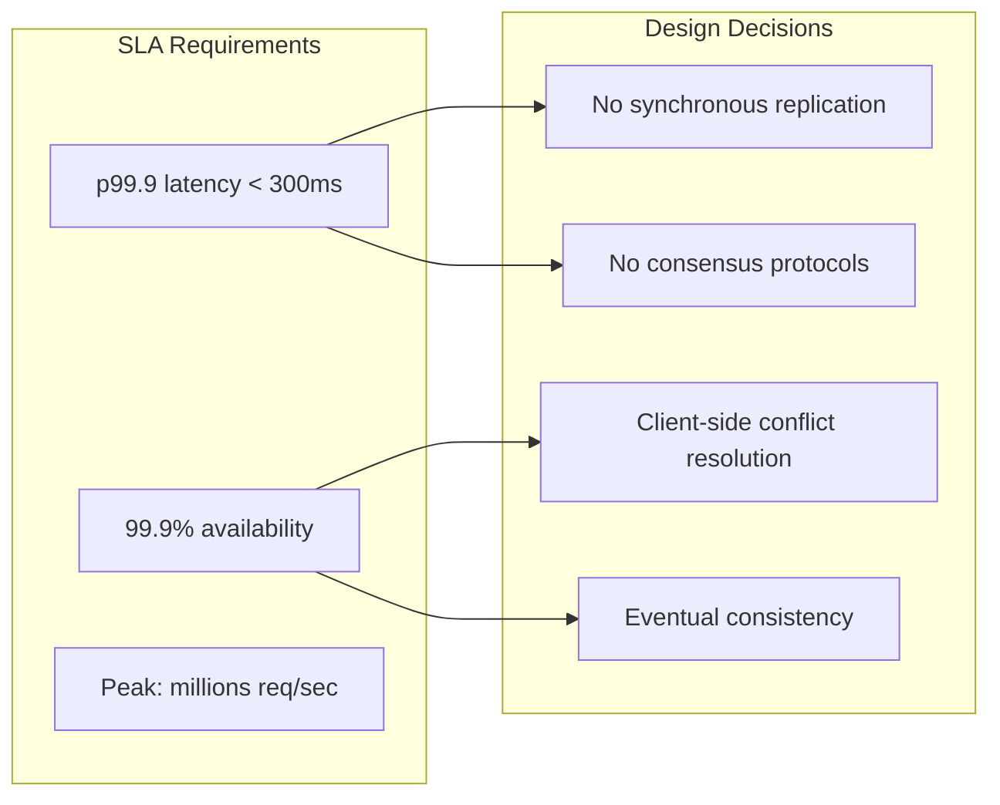

### CAP Position

Dynamo explicitly chooses **AP** (Availability + Partition tolerance):

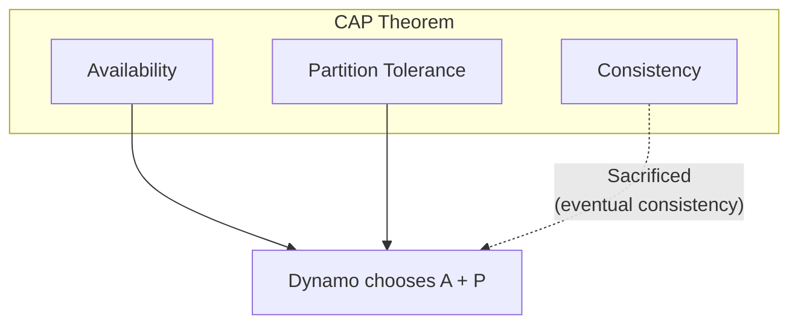

### Design Principles

| Principle | Implementation |
|-----------|----------------|
| **Incremental scalability** | Consistent hashing, add nodes without downtime |
| **Symmetry** | Every node has same responsibilities |
| **Decentralization** | No leader, no coordinator |
| **Heterogeneity** | Virtual nodes handle different capacities |

---

## 3. System Architecture Overview

### Component Summary

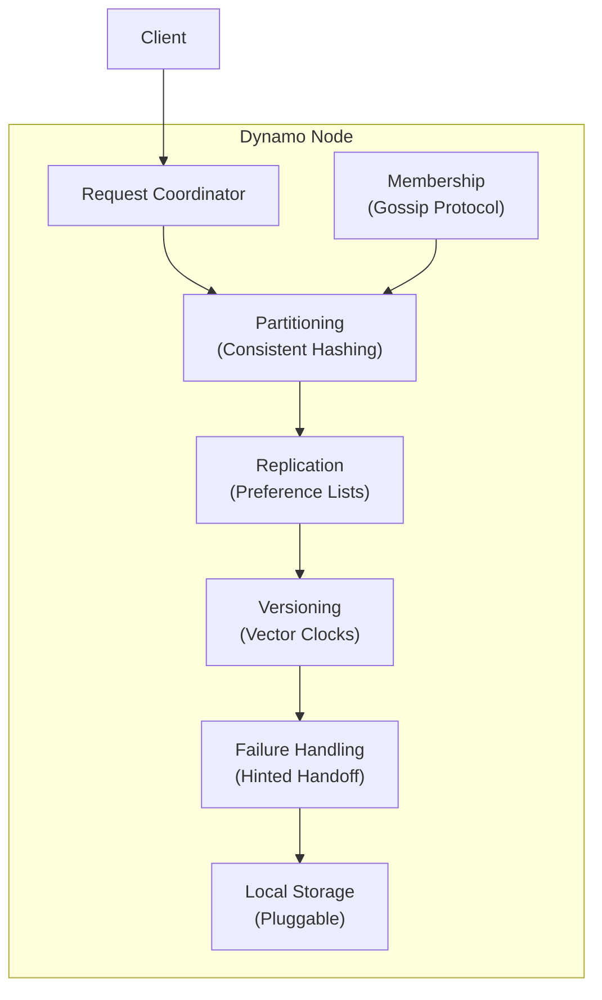

### Technique Summary

| Problem | Technique | Advantage |
|---------|-----------|-----------|
| Partitioning | Consistent hashing | Incremental scalability |
| High availability for writes | Vector clocks + reconciliation | No rejection of writes |
| Handling temporary failures | Sloppy quorum + hinted handoff | High availability |
| Recovering from permanent failures | Anti-entropy with Merkle trees | Sync divergent replicas |
| Membership and failure detection | Gossip-based protocol | Decentralized |

---

## 4. Partitioning

### Consistent Hashing in Dynamo

Dynamo uses consistent hashing to distribute data:

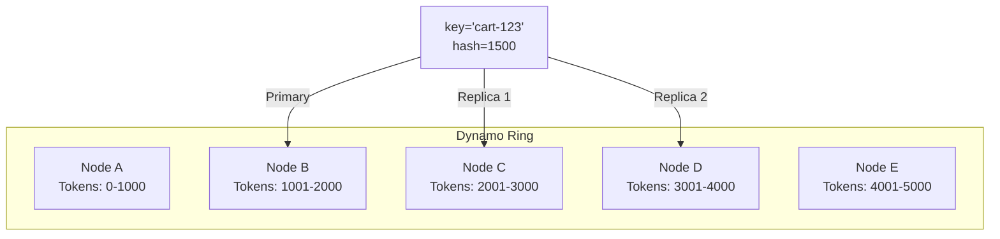

### Virtual Nodes (Tokens)

Each physical node owns multiple token ranges:

```python
class DynamoPartitioner:
    """
    Dynamo-style partitioning with virtual nodes.

    Each physical node owns multiple token ranges for:
    1. Better load distribution
    2. Heterogeneous hardware support
    3. Smoother rebalancing
    """

    def __init__(self):
        self.ring = {}  # token -> physical_node
        self.sorted_tokens = []

    def add_node(self, node_id: str, num_tokens: int = 256):
        """
        Add node with multiple virtual nodes (tokens).

        num_tokens can vary by node capacity:
        - Small instance: 64 tokens
        - Medium instance: 256 tokens
        - Large instance: 512 tokens
        """
        for i in range(num_tokens):
            token = self._generate_token(f"{node_id}:{i}")
            self.ring[token] = node_id
            bisect.insort(self.sorted_tokens, token)

    def get_preference_list(self, key: str, n: int = 3) -> List[str]:
        """
        Get N distinct physical nodes for replication.

        Returns coordinator + N-1 replicas, walking clockwise
        and skipping duplicate physical nodes.
        """
        token = self._hash(key)
        idx = bisect.bisect_left(self.sorted_tokens, token)

        nodes = []
        seen_physical = set()

        for i in range(len(self.sorted_tokens)):
            pos = (idx + i) % len(self.sorted_tokens)
            physical_node = self.ring[self.sorted_tokens[pos]]

            if physical_node not in seen_physical:
                nodes.append(physical_node)
                seen_physical.add(physical_node)

                if len(nodes) == n:
                    break

        return nodes
```

### Preference List

The **preference list** determines which nodes store replicas:

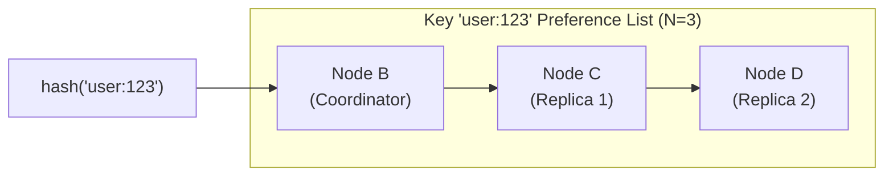

**Important**: The preference list contains physical nodes, not virtual nodes. When walking the ring, skip virtual nodes belonging to the same physical node.

---

## 5. Replication

### Replication Parameters (N, R, W)

Dynamo uses configurable quorum parameters:

| Parameter | Meaning | Typical Value |
|-----------|---------|---------------|
| **N** | Total replicas | 3 |
| **R** | Read quorum (nodes to read from) | 2 |
| **W** | Write quorum (nodes to ack write) | 2 |

**Consistency Formula**: `R + W > N` ensures overlap between read and write sets.

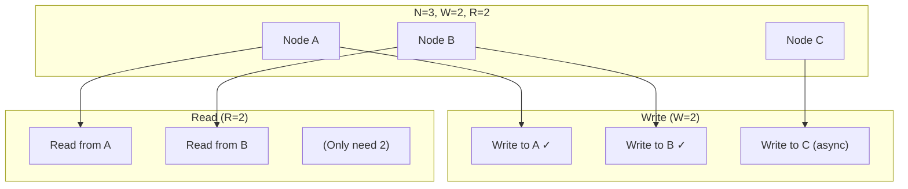

### Sloppy Quorum

**Key Innovation**: If a node in the preference list is unavailable, Dynamo writes to the next available node on the ring (not in the preference list).

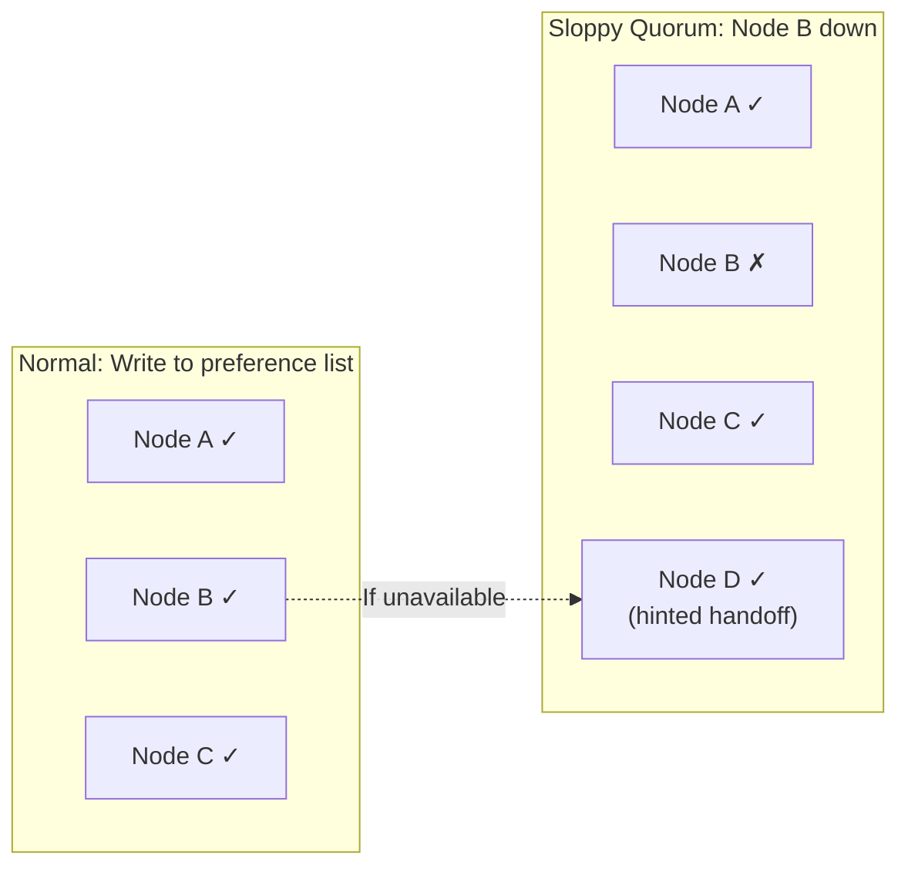

**Why "Sloppy"**: The quorum may include nodes outside the preference list, hence not strictly the N designated replicas.

### Consistency Configurations

| Config | R | W | Consistency | Availability |
|--------|---|---|-------------|--------------|
| Strong | N | N | Linearizable | Low (all nodes needed) |
| Quorum | N/2+1 | N/2+1 | Consistent reads | Medium |
| Eventual | 1 | 1 | May read stale | Highest |
| Read-heavy | N | 1 | Eventual (fast writes) | High writes |
| Write-heavy | 1 | N | Eventual (fast reads) | High reads |

**Dynamo Default**: N=3, R=2, W=2 — balanced consistency and availability.

---

## 6. Data Versioning

### The Problem

With sloppy quorums and "always writable" semantics, the same key can be updated concurrently on different nodes:

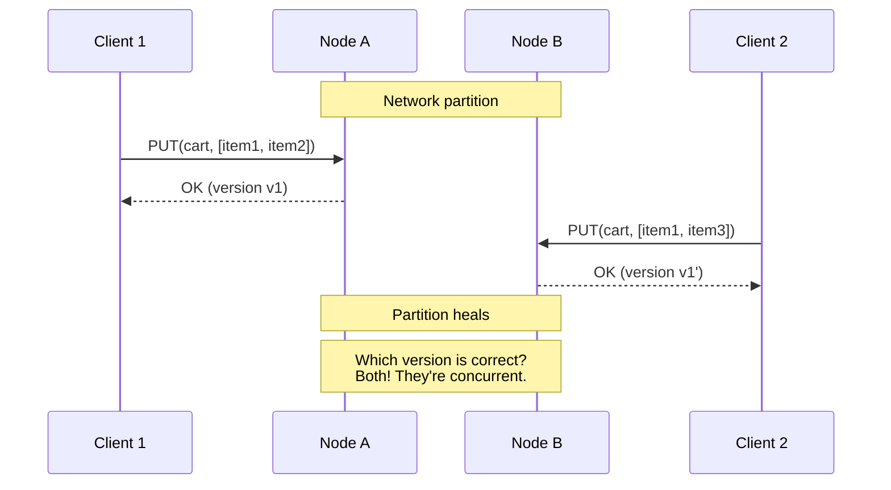

### Vector Clocks

Dynamo uses **vector clocks** to track causality and detect conflicts:

```python
class VectorClock:
    """
    Vector clock for causality tracking.

    Each entry: node_id -> (counter, timestamp)
    - counter: logical clock, incremented on each update by that node
    - timestamp: for distributed garbage collection
    """

    def __init__(self):
        self.clock: Dict[str, Tuple[int, int]] = {}

    def increment(self, node_id: str) -> 'VectorClock':
        """Increment counter for node (on write)."""
        new_clock = VectorClock()
        new_clock.clock = self.clock.copy()

        counter, _ = new_clock.clock.get(node_id, (0, 0))
        new_clock.clock[node_id] = (counter + 1, int(time.time()))

        return new_clock

    def merge(self, other: 'VectorClock') -> 'VectorClock':
        """Merge two clocks (take max of each entry)."""
        merged = VectorClock()

        all_nodes = set(self.clock.keys()) | set(other.clock.keys())
        for node in all_nodes:
            c1, t1 = self.clock.get(node, (0, 0))
            c2, t2 = other.clock.get(node, (0, 0))
            merged.clock[node] = (max(c1, c2), max(t1, t2))

        return merged

    def compare(self, other: 'VectorClock') -> str:
        """
        Compare two vector clocks.

        Returns:
        - 'BEFORE': self happened before other
        - 'AFTER': self happened after other
        - 'CONCURRENT': neither happened before the other (conflict!)
        - 'EQUAL': same clock
        """
        dominated_by_other = True
        dominates_other = True

        all_nodes = set(self.clock.keys()) | set(other.clock.keys())

        for node in all_nodes:
            c1, _ = self.clock.get(node, (0, 0))
            c2, _ = other.clock.get(node, (0, 0))

            if c1 > c2:
                dominated_by_other = False
            if c2 > c1:
                dominates_other = False

        if dominated_by_other and dominates_other:
            return 'EQUAL'
        elif dominated_by_other:
            return 'BEFORE'
        elif dominates_other:
            return 'AFTER'
        else:
            return 'CONCURRENT'
```

### Vector Clock Example

```
Initial: cart = [item1], clock = {A: 1}

Client 1 via Node A:
  cart = [item1, item2], clock = {A: 2}

Client 2 via Node B (concurrent, saw {A: 1}):
  cart = [item1, item3], clock = {A: 1, B: 1}

On read, both versions returned:
  v1: [item1, item2], {A: 2}
  v2: [item1, item3], {A: 1, B: 1}

Comparison: CONCURRENT (A:2 > A:1, but B:1 > B:0)

Client reconciles:
  cart = [item1, item2, item3], clock = {A: 2, B: 1, C: 1}
```

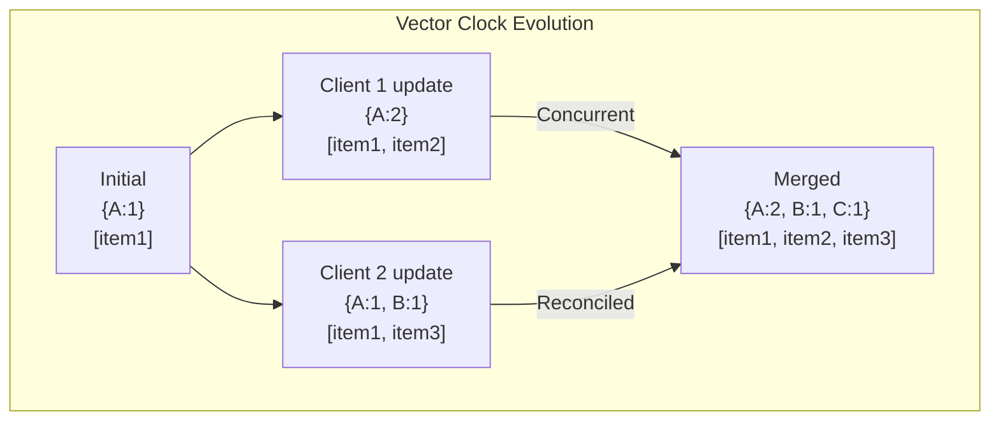

### Conflict Resolution

Dynamo returns **all conflicting versions** to the client for resolution:

| Strategy | How It Works | Use Case |
|----------|--------------|----------|
| **Client resolution** | Application merges (e.g., union of cart items) | Shopping cart |
| **Last-write-wins** | Use timestamp, discard older | Session data |
| **Application-specific** | Custom merge function | Domain-dependent |

```python
def get_with_conflicts(key: str) -> List[Tuple[bytes, VectorClock]]:
    """
    Read all versions of a key.

    Returns list of (value, clock) pairs.
    If len > 1, there are conflicts to resolve.
    """
    versions = []

    for node in get_preference_list(key, R):
        value, clock = node.get(key)
        versions.append((value, clock))

    # Remove dominated versions (keep only concurrent/newest)
    return reconcile_versions(versions)


def put_with_context(key: str, value: bytes, context: VectorClock):
    """
    Write with vector clock context.

    The context should be the merged clock from a previous read.
    This establishes causal ordering.
    """
    # Coordinator increments its entry in the clock
    new_clock = context.increment(self.node_id)

    # Write to W nodes
    for node in get_preference_list(key, W):
        node.put(key, value, new_clock)
```

### Vector Clock Truncation

Problem: Vector clocks can grow unboundedly as many nodes update a key.

Solution: Truncate entries older than a threshold (e.g., 24 hours):

```python
def truncate_clock(clock: VectorClock, threshold_secs: int = 86400):
    """Remove entries older than threshold."""
    now = int(time.time())
    truncated = VectorClock()

    for node, (counter, timestamp) in clock.clock.items():
        if now - timestamp < threshold_secs:
            truncated.clock[node] = (counter, timestamp)

    return truncated
```

**Tradeoff**: May lose causality information, leading to false conflicts. Acceptable because conflicts are rare and resolvable.

---

## 7. Handling Failures

### Temporary Failures: Hinted Handoff

When a node is temporarily unavailable, another node holds its writes:

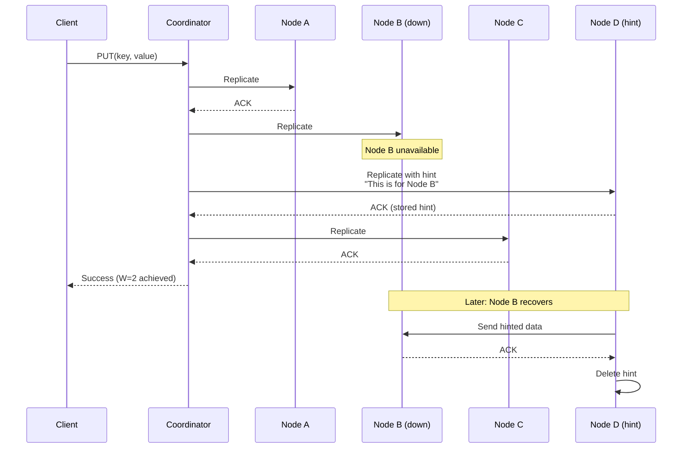

```python
class HintedHandoff:
    """
    Hinted handoff for temporary failure handling.
    """

    def __init__(self, node_id: str):
        self.hints: Dict[str, List[Tuple[str, bytes, VectorClock]]] = {}

    def store_hint(self, target_node: str, key: str, value: bytes, clock: VectorClock):
        """Store data intended for an unavailable node."""
        if target_node not in self.hints:
            self.hints[target_node] = []
        self.hints[target_node].append((key, value, clock))

    def send_hints(self, target_node: str, connection):
        """Send all hints when target node recovers."""
        if target_node not in self.hints:
            return

        for key, value, clock in self.hints[target_node]:
            connection.put(key, value, clock)

        del self.hints[target_node]  # Clean up after successful transfer
```

**Benefits**:
- Writes succeed even when preference list nodes are down
- Data eventually reaches correct node
- No data loss during temporary failures

### Permanent Failures: Anti-Entropy with Merkle Trees

For permanent failures or long outages, replicas may diverge. **Merkle trees** enable efficient synchronization:

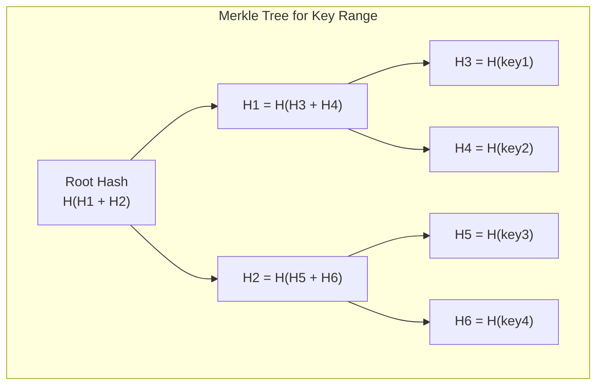

### Merkle Tree Synchronization

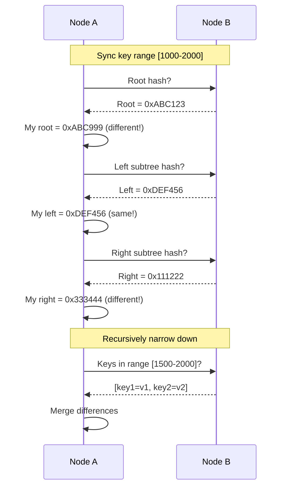

```python
class MerkleTree:
    """
    Merkle tree for efficient replica synchronization.

    Each leaf is hash of a key range.
    Internal nodes are hash of children.
    Compare roots to detect divergence.
    """

    def __init__(self, key_range: Tuple[int, int], depth: int = 10):
        self.range = key_range
        self.depth = depth
        self.root = self._build_tree(key_range, depth)

    def _build_tree(self, range: Tuple[int, int], depth: int) -> 'Node':
        if depth == 0:
            # Leaf: hash of all keys in range
            keys = self.storage.get_keys_in_range(range)
            return LeafNode(hash(keys))

        mid = (range[0] + range[1]) // 2
        left = self._build_tree((range[0], mid), depth - 1)
        right = self._build_tree((mid, range[1]), depth - 1)

        return InternalNode(hash(left.hash + right.hash), left, right)

    def find_differences(self, other_root_hash, peer) -> List[KeyRange]:
        """
        Find divergent key ranges by comparing Merkle trees.

        Returns list of ranges that need synchronization.
        """
        differences = []
        self._compare_node(self.root, self.range, other_root_hash, peer, differences)
        return differences

    def _compare_node(self, node, range, peer_hash, peer, differences):
        if node.hash == peer_hash:
            return  # Subtree matches, no sync needed

        if isinstance(node, LeafNode):
            differences.append(range)  # Found divergent range
            return

        # Recurse into children
        mid = (range[0] + range[1]) // 2
        left_hash = peer.get_hash(range[0], mid)
        right_hash = peer.get_hash(mid, range[1])

        self._compare_node(node.left, (range[0], mid), left_hash, peer, differences)
        self._compare_node(node.right, (mid, range[1]), right_hash, peer, differences)
```

**Efficiency**: Compare O(log N) hashes instead of O(N) keys to find divergent ranges.

---

## 8. Membership & Failure Detection

### Gossip Protocol

Nodes share membership information via **gossip**:

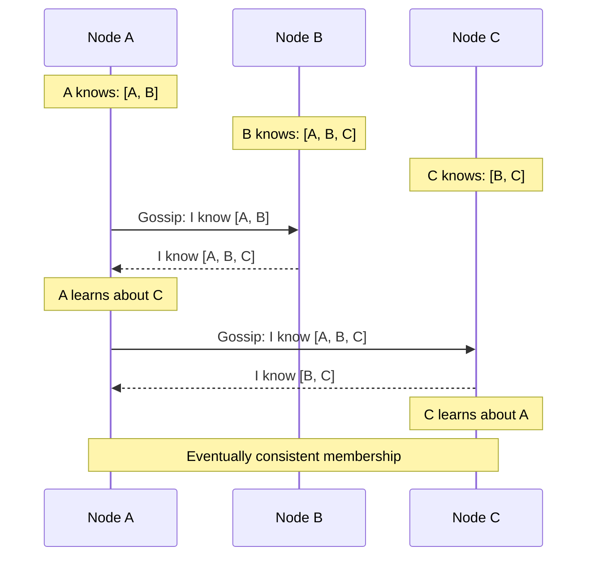

### Gossip Implementation

```python
class GossipProtocol:
    """
    Gossip-based membership protocol.

    Each node maintains:
    - Membership list with heartbeat counters
    - Suspicion list for failure detection
    """

    def __init__(self, node_id: str):
        self.node_id = node_id
        self.members: Dict[str, MemberInfo] = {}
        self.gossip_interval = 1.0  # seconds

    def gossip_round(self):
        """Periodic gossip to random peer."""
        # Increment own heartbeat
        self.members[self.node_id].heartbeat += 1
        self.members[self.node_id].timestamp = time.time()

        # Select random peer
        peer = random.choice(list(self.members.keys()))
        if peer == self.node_id:
            return

        # Exchange membership lists
        peer_members = self.send_gossip(peer, self.members)
        self.merge_membership(peer_members)

    def merge_membership(self, remote: Dict[str, MemberInfo]):
        """Merge remote membership info with local."""
        for node_id, info in remote.items():
            if node_id not in self.members:
                self.members[node_id] = info
            elif info.heartbeat > self.members[node_id].heartbeat:
                self.members[node_id] = info

    def detect_failures(self, timeout: float = 10.0):
        """Mark nodes as failed if no heartbeat update."""
        now = time.time()
        for node_id, info in self.members.items():
            if node_id != self.node_id:
                if now - info.timestamp > timeout:
                    info.status = 'SUSPECTED'
                if now - info.timestamp > timeout * 2:
                    info.status = 'FAILED'
```

### Failure Detection

Dynamo uses gossip-based failure detection with:

| Mechanism | Purpose |
|-----------|---------|
| **Heartbeat** | Detect unresponsive nodes |
| **Suspicion** | Grace period before declaring failure |
| **Permanent removal** | Admin-triggered, not automatic |

**Conservative approach**: Nodes are only temporarily marked unavailable. Permanent removal requires administrator action to prevent data loss from false positives.

---

## 9. Putting It All Together

### Read Path

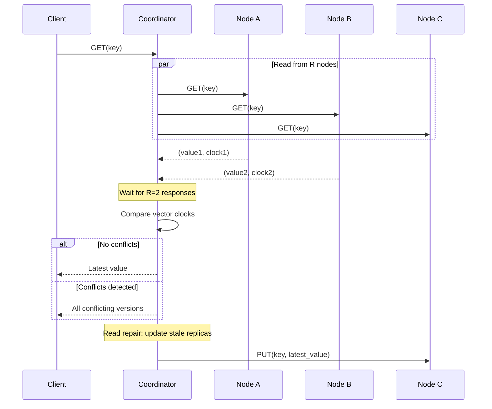

### Write Path

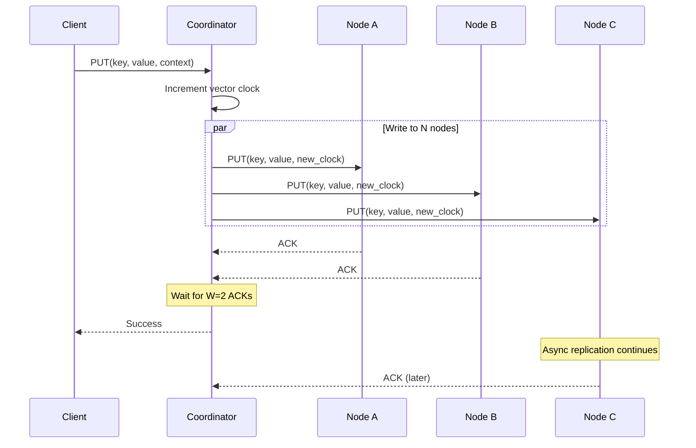

### Complete Request Flow

```python
class DynamoNode:
    """
    Complete Dynamo node implementation.
    """

    def get(self, key: str) -> List[Tuple[bytes, VectorClock]]:
        """
        Read operation with quorum.
        """
        # 1. Find preference list
        nodes = self.partitioner.get_preference_list(key, N)

        # 2. Read from R nodes
        responses = []
        for node in nodes:
            try:
                value, clock = self.send_get(node, key)
                responses.append((value, clock))
                if len(responses) >= R:
                    break
            except NodeUnavailable:
                continue

        if len(responses) < R:
            raise InsufficientReplicas()

        # 3. Reconcile versions
        reconciled = self.reconcile(responses)

        # 4. Read repair (async)
        self.async_read_repair(key, reconciled, nodes)

        return reconciled

    def put(self, key: str, value: bytes, context: VectorClock) -> VectorClock:
        """
        Write operation with quorum.
        """
        # 1. Increment vector clock
        new_clock = context.increment(self.node_id)

        # 2. Find preference list
        preference_list = self.partitioner.get_preference_list(key, N)

        # 3. Write to W nodes (with hinted handoff)
        acks = 0
        for i, node in enumerate(self.ring_walk(key)):
            try:
                self.send_put(node, key, value, new_clock)
                acks += 1
            except NodeUnavailable:
                # Hinted handoff to next available node
                hint_node = self.get_next_available(key, i)
                self.send_put_with_hint(hint_node, node, key, value, new_clock)
                acks += 1

            if acks >= W:
                break

        if acks < W:
            raise InsufficientReplicas()

        return new_clock
```

---

## 10. Dynamo's Descendants

### Systems Inspired by Dynamo

| System | Based On | Key Differences |
|--------|----------|-----------------|
| **Cassandra** | Dynamo + Bigtable | Wide-column model, CQL query language |
| **Riak** | Pure Dynamo | Stronger focus on vector clocks |
| **Voldemort** | Dynamo | LinkedIn's implementation |
| **DynamoDB** | Managed Dynamo | AWS service, auto-scaling |

### Cassandra vs Dynamo

| Aspect | Dynamo | Cassandra |
|--------|--------|-----------|
| Data model | Key-value | Wide-column |
| Conflict resolution | Vector clocks | Last-write-wins (default) |
| Query language | GET/PUT only | CQL (SQL-like) |
| Compaction | Not specified | Configurable |

### DynamoDB (AWS) vs Dynamo (Paper)

| Aspect | Dynamo Paper | DynamoDB Service |
|--------|--------------|------------------|
| Conflict resolution | Vector clocks | Last-write-wins |
| Transactions | None | Supported (since 2018) |
| Secondary indexes | None | Supported |
| Scaling | Manual | Auto-scaling |
| Operations | Self-managed | Fully managed |

---

## 11. Interview Articulation

### 30-Second Version

> "Dynamo is Amazon's highly available key-value store that prioritizes availability over consistency. It uses consistent hashing for partitioning, sloppy quorums with hinted handoff for replication, and vector clocks for conflict detection. The key insight is 'always writable'—during network partitions, writes succeed and conflicts are resolved later by the application. This design influenced Cassandra, Riak, and AWS DynamoDB. The tradeoffs are eventual consistency and application-level conflict resolution."

### 2-Minute Version

> "Dynamo was designed by Amazon to solve a specific problem: the shopping cart must always accept writes, even during failures. This led to an AP system that sacrifices consistency for availability.
>
> The architecture has several key components. **Partitioning** uses consistent hashing with virtual nodes for even distribution and incremental scalability. Each key maps to N replicas determined by walking clockwise on the ring.
>
> **Replication** uses configurable quorums—N total replicas, R reads, W writes. The default N=3, R=2, W=2 balances consistency and availability. Crucially, Dynamo uses **sloppy quorums**: if a preference list node is down, writes go to the next available node with a hint to forward later.
>
> **Versioning** uses vector clocks to track causality. When concurrent updates happen during partitions, both versions are kept. On read, if versions are concurrent (neither dominates), all versions are returned to the client for application-level merge—like taking the union of shopping cart items.
>
> **Failure handling** has two mechanisms: hinted handoff for temporary failures and Merkle tree anti-entropy for permanent failures. Merkle trees efficiently find divergent key ranges by comparing hashes hierarchically.
>
> **Membership** uses gossip protocol—nodes periodically exchange membership state with random peers, eventually converging on consistent cluster view.
>
> The main tradeoffs are that applications must handle conflicts, and there's no strong consistency. But for Amazon's use case—shopping carts that must never reject adds—this was the right choice. Cassandra and DynamoDB are direct descendants of this design."

### Common Follow-Up Questions

| Question | Key Points |
|----------|------------|
| "Why not use Paxos?" | Too slow for p99.9 SLA; synchronous consensus adds latency |
| "How do vector clocks work?" | Each node increments its counter on write; compare component-wise to detect concurrent updates |
| "What if conflicts are never resolved?" | Vector clock truncation may lose causality; conflicts eventually auto-resolve via LWW |
| "Why sloppy quorum?" | Prioritizes availability; ensures writes succeed even with failures |
| "Merkle tree vs full sync?" | O(log N) comparisons vs O(N); efficient for finding small divergences |
| "How is DynamoDB different?" | Managed service, last-write-wins, supports transactions, secondary indexes |

---

## 12. Quick Reference Card

### Core Parameters

| Parameter | Default | Meaning |
|-----------|---------|---------|
| N | 3 | Total replicas |
| R | 2 | Read quorum |
| W | 2 | Write quorum |
| Virtual nodes | 100-256 | Tokens per physical node |

### Component Summary

| Component | Technique | Purpose |
|-----------|-----------|---------|
| Partitioning | Consistent hashing | Distribute data, incremental scale |
| Replication | Sloppy quorum | High availability writes |
| Versioning | Vector clocks | Detect/track conflicts |
| Temporary failures | Hinted handoff | No data loss |
| Permanent failures | Merkle trees | Efficient sync |
| Membership | Gossip | Decentralized discovery |

### Consistency Levels

| R + W | Consistency | Notes |
|-------|-------------|-------|
| > N | Strong read-your-writes | Overlap guaranteed |
| = N | Quorum | Good balance |
| < N | Eventual | May read stale |

### Trade-offs

| Gain | Sacrifice |
|------|-----------|
| Always writable | Strong consistency |
| High availability | Simple programming model |
| Incremental scaling | Cross-partition transactions |
| Decentralized | Conflict resolution complexity |

### Failure Handling Summary

| Failure Type | Detection | Handling |
|--------------|-----------|----------|
| Node temporary | Timeout on RPC | Hinted handoff |
| Node permanent | Admin action | Data rebalancing |
| Network partition | Gossip divergence | Sloppy quorum |
| Data divergence | Merkle tree compare | Anti-entropy sync |

---

## References

### Academic Papers

- **DeCandia et al., 2007** — "Dynamo: Amazon's Highly Available Key-value Store" (SOSP) — The original Dynamo paper
- **Lamport, 1978** — "Time, Clocks, and the Ordering of Events" — Logical clocks foundation
- **Merkle, 1988** — "A Digital Signature Based on a Conventional Encryption Function" — Merkle trees

### Production Documentation

- **DynamoDB** — [How It Works](https://docs.aws.amazon.com/amazondynamodb/latest/developerguide/HowItWorks.html)
- **Cassandra** — [Architecture](https://cassandra.apache.org/doc/latest/cassandra/architecture/)
- **Riak** — [Concepts](https://docs.riak.com/riak/kv/latest/learn/concepts/)

### Further Reading

- Werner Vogels — "Eventually Consistent" (ACM Queue, 2008)
- Pat Helland — "Life Beyond Distributed Transactions" (CIDR, 2007)

---

## Revision History

| Date | Change |
|------|--------|
| 2025-01 | Initial deep-dive document with complete paper treatment: partitioning, replication, vector clocks, hinted handoff, Merkle trees, gossip protocol |

---

## Navigation

**Parent:** [Distributed Coordination](./07_DISTRIBUTED_COORDINATION.md)
**Related:** [Consistent Hashing](./DD_CONSISTENT_HASHING.md), [Sharding & Partitioning](./DD_SHARDING_PARTITIONING.md)
**Previous:** [Storage Engines](./DD_STORAGE_ENGINES.md)
**Index:** [README](./README.md)
