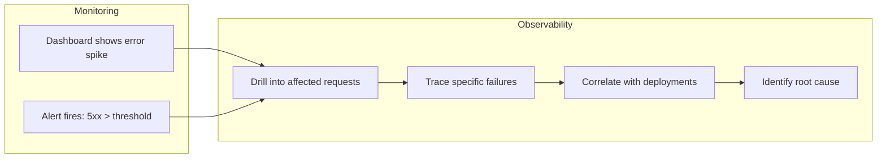
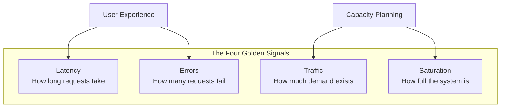
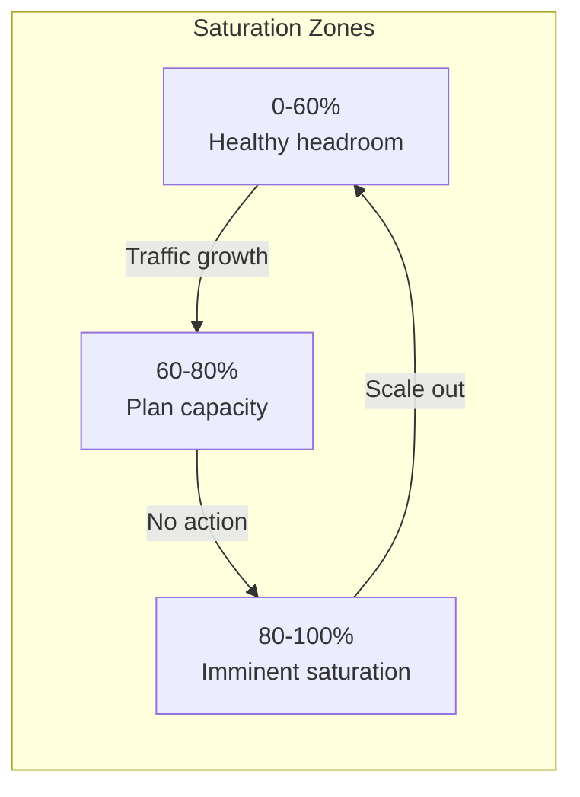
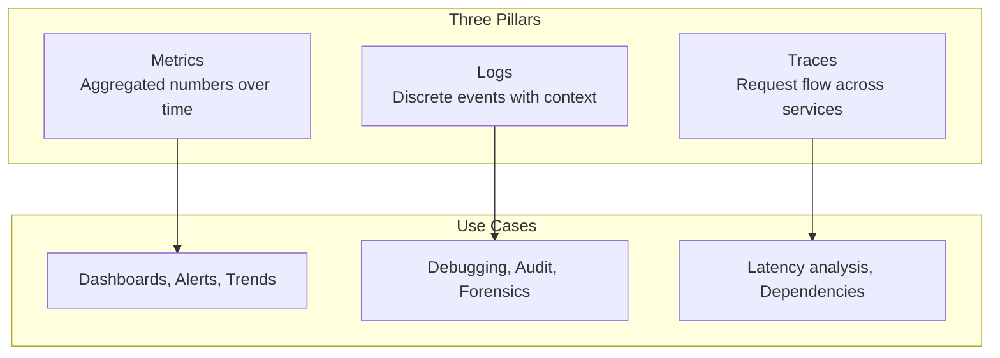
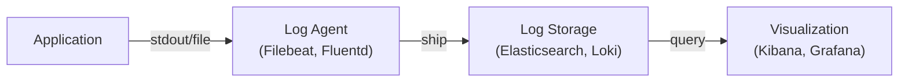
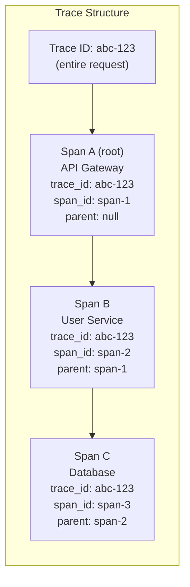
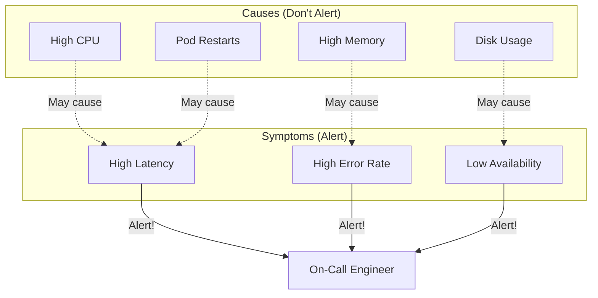
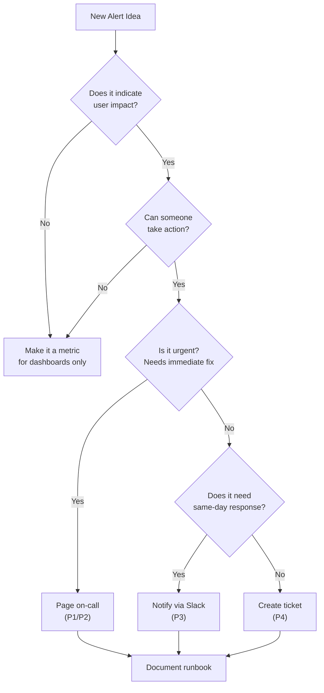
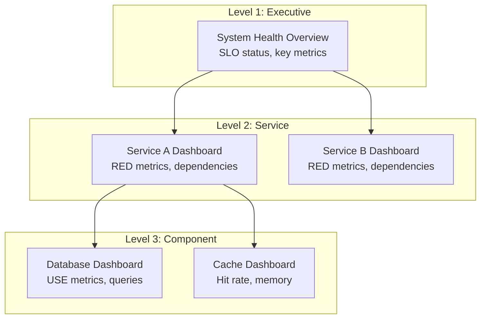

# Observability and Monitoring — Deep Dive

> You cannot improve what you cannot measure, and you cannot fix what you cannot see.

**Prerequisites:** [Foundational Concepts](./01_FOUNDATIONAL_CONCEPTS.md), [Resilience Patterns](./08_RESILIENCE_PATTERNS.md)
**Related:** [Service Level Objectives](./DD_SERVICE_LEVEL_OBJECTIVES.md), [Scaling & Infrastructure](./09_SCALING_AND_INFRASTRUCTURE.md)

---

## Table of Contents

1. [Context & Problem Statement](#1-context--problem-statement)
2. [The Four Golden Signals](#2-the-four-golden-signals)
3. [Three Pillars of Observability](#3-three-pillars-of-observability)
4. [Alerting Strategies](#4-alerting-strategies)
5. [Dashboard Design Principles](#5-dashboard-design-principles)
6. [Production Patterns](#6-production-patterns)
7. [Interview Articulation](#7-interview-articulation)
8. [Quick Reference Card](#8-quick-reference-card)
9. [References](#references)

---

## 1. Context & Problem Statement

### Why Observability Matters at Scale

In a monolithic application, debugging is relatively straightforward: attach a debugger, examine logs, trace the stack. In distributed systems, a single user request might traverse dozens of services, each running hundreds of instances across multiple data centers. When something goes wrong, finding the root cause becomes exponentially harder.

Observability is not just about collecting data—it is about being able to ask arbitrary questions about your system's behavior without having to predict those questions in advance. As systems grow in complexity, traditional monitoring approaches that focus on known failure modes become insufficient. You need the ability to explore unknown-unknowns.

### Monitoring vs Observability

These terms are often conflated but represent different paradigms:

| Aspect | Monitoring | Observability |
|--------|------------|---------------|
| **Focus** | Known failure modes | Unknown-unknowns |
| **Approach** | Predefined dashboards and alerts | Ad-hoc exploration and debugging |
| **Questions** | "Is the system healthy?" | "Why is the system unhealthy?" |
| **Data** | Aggregated metrics | High-cardinality, rich context |
| **When useful** | Detecting problems | Diagnosing problems |

**Monitoring** tells you *when* something is wrong. **Observability** helps you understand *why* it is wrong.



### The Challenge of Distributed Systems

Distributed systems introduce unique challenges for understanding behavior:

- **Partial failures**: One service may be degraded while others appear healthy
- **Cascading effects**: A slow database causes timeouts, which cause retries, which cause overload
- **Non-determinism**: Race conditions, network delays, and clock skew make reproduction difficult
- **Scale**: Millions of requests per second generate terabytes of telemetry data
- **Blame attribution**: When multiple teams own different services, determining responsibility is complex

Effective observability bridges the gap between high-level system health and low-level debugging, enabling engineers to quickly narrow down from "something is wrong" to "this specific change caused this specific failure."

---

## 2. The Four Golden Signals

Google's Site Reliability Engineering team identified four critical metrics that, if measured well, provide sufficient coverage for most user-facing systems. These "Golden Signals" form the foundation of service-level monitoring.



### Latency

Latency measures the time it takes to service a request. It is perhaps the most important signal because it directly impacts user experience.

**Why averages lie:**

Average latency hides critical information. Consider two services:
- Service A: 99% of requests at 50ms, 1% at 5000ms. Average: ~100ms
- Service B: All requests at 100ms. Average: 100ms

Both have the same average, but Service A has a terrible experience for 1% of users. At scale (1 million requests), that is 10,000 users experiencing 5-second delays.

**Percentiles are essential:**

| Percentile | Meaning | Typical Use |
|------------|---------|-------------|
| **p50 (median)** | Half of requests faster | Typical user experience |
| **p95** | 95% of requests faster | Most users' worst case |
| **p99** | 99% of requests faster | Detect tail latency issues |
| **p999** | 99.9% of requests faster | Extreme outliers, often infrastructure |

```python
# Example: Calculating percentiles
import numpy as np

def analyze_latency(response_times_ms):
    """
    Analyze latency distribution.

    Key insight: Always report percentiles, not just average.
    """
    return {
        'p50': np.percentile(response_times_ms, 50),
        'p95': np.percentile(response_times_ms, 95),
        'p99': np.percentile(response_times_ms, 99),
        'p999': np.percentile(response_times_ms, 99.9),
        'average': np.mean(response_times_ms),  # Less useful!
    }
```

**Distinguish success vs failure latency:**

A fast error (immediate 500 response) should not lower your "average latency." Track successful and failed request latency separately:

```
http_request_duration_seconds{status="2xx"} → Success latency
http_request_duration_seconds{status="5xx"} → Error latency
```

### Traffic

Traffic measures the demand on your system—how much work it is being asked to do.

**Common traffic metrics:**

| System Type | Traffic Metric |
|-------------|----------------|
| Web service | Requests per second (RPS/QPS) |
| Database | Queries per second, transactions per second |
| Streaming | Messages per second, bytes per second |
| Storage | I/O operations per second (IOPS) |
| CDN | Bandwidth (Gbps), cache hit ratio |

**Segment traffic for insight:**

Raw request count is useful, but segmented traffic reveals more:

```
http_requests_total{endpoint="/api/users", method="GET"}
http_requests_total{endpoint="/api/orders", method="POST"}
http_requests_total{customer_tier="premium"}
http_requests_total{region="us-east"}
```

This segmentation helps identify:
- Which endpoints are hotspots
- Traffic patterns by user segment
- Regional demand variations
- Unexpected traffic sources

### Errors

Errors measure the rate of failed requests. Simple in concept, but nuanced in practice.

**Types of errors:**

| Error Type | Example | Detection |
|------------|---------|-----------|
| **Explicit** | HTTP 500, exception thrown | Status codes, error logs |
| **Implicit** | Slow response (timeout = error) | Latency thresholds |
| **Semantic** | Wrong data returned | Application-level validation |
| **Partial** | Degraded response (missing recommendations) | Content validation |

**Error rate calculation:**

```
Error Rate = (Errors / Total Requests) × 100%

# Example Prometheus query
sum(rate(http_requests_total{status=~"5.."}[5m]))
/
sum(rate(http_requests_total[5m]))
```

**Error classification:**

Not all errors are equal. Classify and track separately:

```python
class ErrorCategory:
    CLIENT_ERROR = "4xx"      # User's fault (bad request)
    SERVER_ERROR = "5xx"      # Our fault (bug, overload)
    TIMEOUT = "timeout"       # Slow dependency
    CIRCUIT_OPEN = "circuit"  # Intentional rejection
    RATE_LIMITED = "ratelimit"  # Capacity protection
```

### Saturation

Saturation measures how "full" your system is—how close resources are to capacity.

**Key resources to monitor:**

| Resource | Metric | Saturation Signal |
|----------|--------|-------------------|
| CPU | Utilization % | >70% sustained |
| Memory | Used / Total | >85% |
| Disk | Used / Total, IOPS | >80% capacity |
| Network | Bandwidth utilization | >70% |
| Connections | Active / Max pool | >80% |
| Queue | Depth / Max size | Growing backlog |

**Headroom is critical:**

Saturation monitoring is about predicting problems before they occur:



**Queue depth as leading indicator:**

Rising queue depths often signal saturation before CPU or memory metrics spike:

```
# If queue depth is growing, system cannot keep up
queue_depth > 0 AND increasing → Saturation warning
queue_depth = max_size → Requests being dropped
```

### Four Golden Signals Summary

| Signal | Question Answered | Key Metrics | Alert Threshold |
|--------|-------------------|-------------|-----------------|
| **Latency** | How fast? | p50, p95, p99 | p99 > SLO |
| **Traffic** | How much? | RPS, bandwidth | Unusual deviation |
| **Errors** | How often failing? | Error rate % | > Error budget |
| **Saturation** | How full? | CPU, memory, queue | > 80% sustained |

---

## 3. Three Pillars of Observability

While the Golden Signals tell you *what* to measure, the Three Pillars describe *how* to collect and represent that data.



### Metrics

Metrics are aggregated numerical measurements collected over time intervals.

**Metric types:**

| Type | Description | Example | Use Case |
|------|-------------|---------|----------|
| **Counter** | Monotonically increasing | `requests_total` | Request count, errors |
| **Gauge** | Point-in-time value | `temperature_celsius` | Current connections, queue depth |
| **Histogram** | Distribution of values | `request_duration_seconds` | Latency percentiles |
| **Summary** | Pre-calculated percentiles | `request_duration_quantiles` | When percentiles known |

**Prometheus data model:**

```
# Metric name + labels = time series
http_requests_total{method="GET", endpoint="/api/users", status="200"} 1234567

# Structure
<metric_name>{<label1>=<value1>, <label2>=<value2>} <value> [<timestamp>]
```

**Cardinality concerns:**

High-cardinality labels can explode storage and query costs:

```
# BAD: User ID as label (millions of unique values)
http_requests_total{user_id="12345"}

# GOOD: Aggregate to bounded cardinality
http_requests_total{user_tier="premium"}
http_requests_total{region="us-east"}
```

Rule of thumb: Total time series = product of all label cardinalities. Keep it under 10 million per service.

### Logs

Logs are discrete, timestamped events that capture what happened at a specific moment.

**Structured logging (JSON):**

```json
{
  "timestamp": "2025-01-15T10:30:45.123Z",
  "level": "ERROR",
  "service": "payment-service",
  "trace_id": "abc123",
  "span_id": "def456",
  "user_id": "user_789",
  "message": "Payment processing failed",
  "error_code": "INSUFFICIENT_FUNDS",
  "amount": 99.99,
  "currency": "USD",
  "duration_ms": 245
}
```

**Log levels:**

| Level | When to Use | Example |
|-------|-------------|---------|
| **ERROR** | Failure requiring attention | Payment failed, DB connection lost |
| **WARN** | Unexpected but handled | Retry succeeded, fallback used |
| **INFO** | Significant business events | Order placed, user logged in |
| **DEBUG** | Detailed troubleshooting | Function entry/exit, variable values |
| **TRACE** | Very verbose diagnostics | Every line of execution |

**Log aggregation stack:**



Common stacks:
- **ELK**: Elasticsearch, Logstash, Kibana
- **Loki + Grafana**: Cost-effective, label-based
- **Splunk**: Enterprise, full-featured

### Traces

Traces track a single request as it flows through multiple services, showing the complete journey and timing.

**Core concepts:**



| Concept | Description |
|---------|-------------|
| **Trace** | Complete request journey, identified by trace_id |
| **Span** | Single operation within a trace |
| **Span ID** | Unique identifier for the span |
| **Parent Span** | The span that called this one |
| **Tags/Attributes** | Metadata (user_id, http.status, etc.) |

**OpenTelemetry standard:**

OpenTelemetry (OTel) is the emerging standard for instrumentation:

```python
from opentelemetry import trace

tracer = trace.get_tracer(__name__)

def process_order(order_id):
    with tracer.start_as_current_span("process_order") as span:
        span.set_attribute("order.id", order_id)

        # Child span automatically linked
        with tracer.start_as_current_span("validate_payment"):
            validate_payment(order_id)

        with tracer.start_as_current_span("reserve_inventory"):
            reserve_inventory(order_id)
```

**Sampling strategies:**

At scale, tracing every request is prohibitively expensive. Common strategies:

| Strategy | Description | Use Case |
|----------|-------------|----------|
| **Head-based** | Decide at request start | Simple, consistent |
| **Tail-based** | Decide after completion | Keep errors, slow requests |
| **Rate limiting** | Fixed traces per second | Cost control |
| **Probabilistic** | Random percentage | Statistical accuracy |

---

## 4. Alerting Strategies

Alerts bridge the gap between observability data and human action. Poor alerting leads to alert fatigue; good alerting enables rapid incident response.

### Symptoms vs Causes

**Alert on symptoms, not causes:**

| Type | Example | Why Problematic |
|------|---------|-----------------|
| **Cause** | CPU > 90% | High CPU might be fine if latency is good |
| **Symptom** | p99 latency > 500ms | Directly impacts users |



### Alert Fatigue and How to Avoid It

Alert fatigue occurs when too many alerts desensitize responders, causing real issues to be ignored.

**Symptoms of alert fatigue:**
- Alerts routinely ignored or snoozed
- Long time-to-acknowledge
- Alert channels muted
- "Alert bankruptcy" (disabling alerts)

**Prevention strategies:**

| Strategy | Implementation |
|----------|----------------|
| **Actionable only** | Every alert must have a clear action |
| **De-duplication** | Group related alerts together |
| **Proper thresholds** | Tune to avoid noise (use burn rates) |
| **Regular review** | Audit alerts monthly, remove stale ones |
| **Escalation tiers** | Not everything needs immediate page |

### Alert Severity Levels

| Severity | Response Time | Example | Channel |
|----------|---------------|---------|---------|
| **P1 - Critical** | Immediate | Site down, data loss | Page on-call |
| **P2 - High** | < 1 hour | Feature broken, degraded | Page during hours |
| **P3 - Medium** | < 24 hours | Performance degraded | Slack/email |
| **P4 - Low** | Best effort | Warning, anomaly | Dashboard only |

### Alerting Decision Flowchart



### Runbooks and Alert Documentation

Every alert should have an associated runbook:

```markdown
## Alert: High API Error Rate

**Severity**: P2
**SLO**: Error rate < 0.1%

### What this means
The API is returning more than 0.1% errors over a 5-minute window.

### Immediate actions
1. Check deployment history: `kubectl rollout history deployment/api`
2. Check error logs: `kubectl logs -l app=api --tail=100`
3. Check dependencies: [Dependency Dashboard Link]

### Common causes
- Recent deployment (rollback: `kubectl rollout undo deployment/api`)
- Database overload (check DB dashboard)
- Upstream service failure (check status page)

### Escalation
If not resolved in 30 minutes, escalate to team lead.
```

### On-Call Considerations

- **Rotation fairness**: Equal distribution of pages
- **Handoff documentation**: Clear notes between shifts
- **Compensation**: On-call should be recognized (time off or pay)
- **Post-incident review**: Learn from every page
- **Alert tuning**: Regular review to reduce noise

---

## 5. Dashboard Design Principles

Dashboards translate raw telemetry into actionable visualizations. Well-designed dashboards accelerate incident response; poorly designed ones waste time.

### USE Method (for Resources)

The USE method (Utilization, Saturation, Errors) is ideal for infrastructure resources:

| Component | Utilization | Saturation | Errors |
|-----------|-------------|------------|--------|
| **CPU** | % busy | Run queue length | Machine check exceptions |
| **Memory** | Used / Total | Swapping, OOM kills | ECC errors |
| **Disk** | % capacity | I/O queue depth | Read/write errors |
| **Network** | Bandwidth used | Dropped packets | Interface errors |

### RED Method (for Services)

The RED method (Rate, Errors, Duration) is ideal for request-driven services:

| Metric | Description | Example Query |
|--------|-------------|---------------|
| **Rate** | Requests per second | `rate(http_requests_total[5m])` |
| **Errors** | Failed requests per second | `rate(http_requests_total{status=~"5.."}[5m])` |
| **Duration** | Latency distribution | `histogram_quantile(0.99, rate(http_request_duration_seconds_bucket[5m]))` |

### Dashboard Hierarchy



| Level | Audience | Content | Refresh |
|-------|----------|---------|---------|
| **Overview** | Everyone, status pages | SLO status, error budgets | 1 min |
| **Service** | Team on-call | RED metrics, dependencies | 30 sec |
| **Component** | Deep debugging | USE metrics, detailed | 10 sec |

### Avoiding Dashboard Sprawl

Common anti-patterns and solutions:

| Anti-Pattern | Problem | Solution |
|--------------|---------|----------|
| Too many dashboards | Cannot find the right one | Standardized templates |
| Too many panels | Information overload | Progressive disclosure |
| No context | Numbers without meaning | Add SLO lines, annotations |
| Stale dashboards | Outdated, misleading | Regular review cycle |

**Best practices:**
- Start with a standard template per service type
- Use consistent color coding (green = good, red = bad)
- Add deployment annotations to correlate changes
- Include links to runbooks and related dashboards

---

## 6. Production Patterns

### Health Check Endpoints

Every service should expose health endpoints for orchestration and load balancing:

```python
from flask import Flask, jsonify

app = Flask(__name__)

@app.route('/health')
def health():
    """
    Liveness probe: Is the process alive?
    Used by: Kubernetes liveness probe
    Should: Always return 200 if process is running
    Should NOT: Check dependencies (that's readiness)
    """
    return jsonify({"status": "healthy"}), 200

@app.route('/ready')
def ready():
    """
    Readiness probe: Can the service handle traffic?
    Used by: Load balancer, Kubernetes readiness probe
    Should: Verify critical dependencies
    """
    checks = {
        "database": check_database_connection(),
        "cache": check_cache_connection(),
        "config": check_config_loaded(),
    }

    all_healthy = all(checks.values())
    status_code = 200 if all_healthy else 503

    return jsonify({
        "status": "ready" if all_healthy else "not_ready",
        "checks": checks
    }), status_code
```

| Endpoint | Purpose | Checks | Failure Action |
|----------|---------|--------|----------------|
| `/health` | Liveness | Process alive | Restart container |
| `/ready` | Readiness | Dependencies OK | Remove from LB |
| `/startup` | Startup | Initial boot complete | Wait for ready |

### Structured Logging Best Practices

```python
import structlog
import uuid

# Configure structured logging
structlog.configure(
    processors=[
        structlog.stdlib.add_log_level,
        structlog.processors.TimeStamper(fmt="iso"),
        structlog.processors.JSONRenderer()
    ]
)

logger = structlog.get_logger()

def process_request(request):
    # Bind context that applies to all logs in this request
    log = logger.bind(
        trace_id=request.headers.get("X-Trace-ID", str(uuid.uuid4())),
        user_id=request.user_id,
        endpoint=request.path,
    )

    log.info("request_started", method=request.method)

    try:
        result = handle_request(request)
        log.info("request_completed",
                 status=200,
                 duration_ms=result.duration)
        return result
    except Exception as e:
        log.error("request_failed",
                  error_type=type(e).__name__,
                  error_message=str(e))
        raise
```

### Metric Naming Conventions

Follow a consistent naming scheme:

```
# Format: <namespace>_<subsystem>_<name>_<unit>

# Good examples
http_requests_total                    # Counter: total HTTP requests
http_request_duration_seconds          # Histogram: request latency
http_requests_in_flight               # Gauge: current active requests
database_connections_pool_size        # Gauge: connection pool size
cache_hits_total                      # Counter: cache hit count

# Bad examples
requestCount                           # Not snake_case
httpRequestLatency                     # Missing unit
num_requests                          # Ambiguous
```

### Trace Context Propagation

Ensure trace context flows across service boundaries:

```python
import requests
from opentelemetry import trace
from opentelemetry.propagate import inject

def call_downstream_service(data):
    """Propagate trace context to downstream services."""
    headers = {}

    # Inject current trace context into headers
    inject(headers)

    # Headers now contain:
    # traceparent: 00-<trace_id>-<span_id>-01
    # tracestate: <vendor-specific data>

    response = requests.post(
        "http://downstream-service/api",
        json=data,
        headers=headers
    )
    return response
```

### Correlation IDs

Use correlation IDs to link related events across systems:

```python
# Middleware to ensure every request has a correlation ID
def correlation_middleware(request, call_next):
    correlation_id = request.headers.get(
        "X-Correlation-ID",
        str(uuid.uuid4())
    )

    # Add to request context
    request.state.correlation_id = correlation_id

    # Execute request
    response = call_next(request)

    # Include in response for debugging
    response.headers["X-Correlation-ID"] = correlation_id

    return response
```

---

## 7. Interview Articulation

### 30-Second Version

> "Observability is about understanding system behavior through telemetry data. I focus on the Four Golden Signals—latency, traffic, errors, and saturation—which tell me if users are impacted. I instrument services with the three pillars: metrics for dashboards and alerts, logs for debugging, and traces for understanding request flow across services. For alerting, I always alert on symptoms not causes, ensuring every alert is actionable. The goal is turning 'something is wrong' into 'here is exactly why' as quickly as possible."

### 2-Minute Version

> "Monitoring distributed systems requires a structured approach. I start with the Four Golden Signals from Google SRE: latency, traffic, errors, and saturation.
>
> For latency, I always use percentiles, not averages—p50 shows typical experience, p99 catches tail latency issues that affect many users at scale. Traffic tells me demand and helps identify hotspots when segmented by endpoint or customer tier. Error rate should distinguish between our faults (5xx) and client issues (4xx), and include implicit errors like timeouts. Saturation predicts problems—I watch CPU, memory, and especially queue depths which are leading indicators.
>
> For implementation, I use the three pillars of observability. Metrics through Prometheus for aggregated time-series data, being careful about cardinality. Structured JSON logs shipped to a central store for debugging. And distributed tracing with OpenTelemetry to follow requests across services—essential for understanding latency breakdown.
>
> For alerting, I follow 'alert on symptoms, not causes.' High CPU does not matter if latency is fine. Every alert must be actionable with a runbook. I avoid alert fatigue by tuning thresholds carefully and regularly reviewing whether alerts lead to action.
>
> For dashboards, I use the RED method for services—Rate, Errors, Duration—and USE method for infrastructure—Utilization, Saturation, Errors. This creates a clear hierarchy from overview to deep-dive.
>
> In production, every service exposes /health and /ready endpoints, uses structured logging with correlation IDs, and propagates trace context across service boundaries."

### Common Follow-Up Questions

| Question | Key Points |
|----------|------------|
| "How do you handle high cardinality?" | Bound labels, sample traces, aggregate where possible |
| "What's your alerting philosophy?" | Symptoms not causes, actionable, with runbooks |
| "Metrics vs logs vs traces?" | Metrics for alerting/trends, logs for debugging, traces for latency analysis |
| "How do you debug a slow request?" | Trace to find slow span, logs for context, metrics for patterns |
| "What's your experience with [tool]?" | Explain concepts, show tool-agnostic understanding |
| "How do you avoid alert fatigue?" | Tune thresholds, alert on symptoms, regular review, proper severity |

---

## 8. Quick Reference Card

### Four Golden Signals Summary

| Signal | Measures | Key Metrics | Alert On |
|--------|----------|-------------|----------|
| **Latency** | Speed | p50, p95, p99 | p99 > SLO |
| **Traffic** | Demand | RPS by endpoint | Unusual deviation |
| **Errors** | Failures | Error rate % | > Error budget |
| **Saturation** | Capacity | CPU, memory, queues | > 80% sustained |

### Three Pillars Comparison

| Pillar | Data Type | Query | Best For |
|--------|-----------|-------|----------|
| **Metrics** | Aggregated numbers | "What is p99 latency?" | Dashboards, alerts |
| **Logs** | Discrete events | "What happened at 10:30?" | Debugging, audit |
| **Traces** | Request paths | "Why was this request slow?" | Latency analysis |

### USE vs RED Methods

| Method | Applies To | Measures |
|--------|------------|----------|
| **USE** | Resources (CPU, disk, network) | Utilization, Saturation, Errors |
| **RED** | Services (APIs, microservices) | Rate, Errors, Duration |

### Common Metric Types

| Type | Behavior | Example | Operations |
|------|----------|---------|------------|
| **Counter** | Only increases | `requests_total` | rate(), increase() |
| **Gauge** | Up or down | `temperature` | current value |
| **Histogram** | Distribution buckets | `request_duration` | histogram_quantile() |
| **Summary** | Pre-computed quantiles | `request_quantiles` | direct read |

### Health Check Endpoints

| Endpoint | Kubernetes Probe | Purpose |
|----------|-----------------|---------|
| `/health` | Liveness | Is process alive? |
| `/ready` | Readiness | Can handle traffic? |
| `/startup` | Startup | Initial boot done? |

---

## References

### Books

- **Beyer, B. et al. (2016).** "Site Reliability Engineering." O'Reilly. Chapter 6: Monitoring Distributed Systems.
- **Sridharan, C. (2018).** "Distributed Systems Observability." O'Reilly.
- **Majors, C. et al. (2022).** "Observability Engineering." O'Reilly.

### Documentation

- **Google Cloud SRE** — [Monitoring Distributed Systems](https://sre.google/sre-book/monitoring-distributed-systems/)
- **OpenTelemetry** — [Specification](https://opentelemetry.io/docs/specs/otel/)
- **Prometheus** — [Best Practices](https://prometheus.io/docs/practices/)
- **Grafana** — [Dashboard Best Practices](https://grafana.com/docs/grafana/latest/dashboards/build-dashboards/best-practices/)

### Articles

- **Cindy Sridharan** — "Monitoring and Observability" (Medium)
- **Google SRE Workbook** — Chapter on Alerting
- **Brendan Gregg** — "USE Method" (brendangregg.com)
- **Tom Wilkie** — "RED Method" (Grafana blog)

---

## Revision History

| Date | Change |
|------|--------|
| 2025-01 | Initial deep-dive document covering Four Golden Signals, Three Pillars, alerting strategies, dashboard design, production patterns |

---

## Navigation

**Parent:** [Foundational Concepts](./01_FOUNDATIONAL_CONCEPTS.md)
**Related:** [Resilience Patterns](./08_RESILIENCE_PATTERNS.md), [Service Level Objectives](./DD_SERVICE_LEVEL_OBJECTIVES.md)
**Previous:** [Storage Engines](./DD_STORAGE_ENGINES.md)
**Index:** [README](./README.md)
