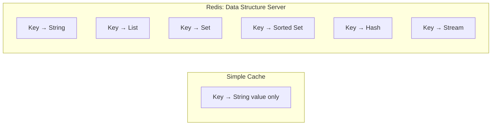
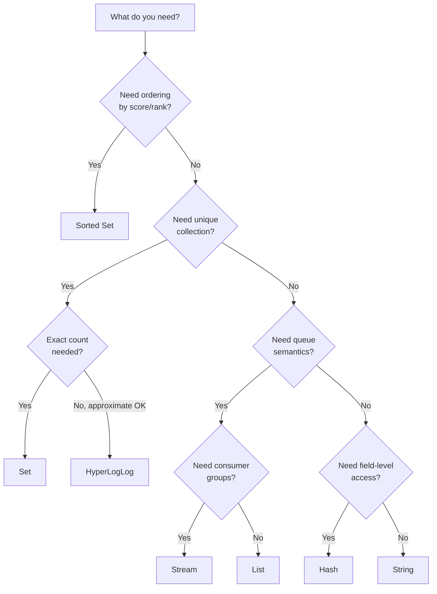
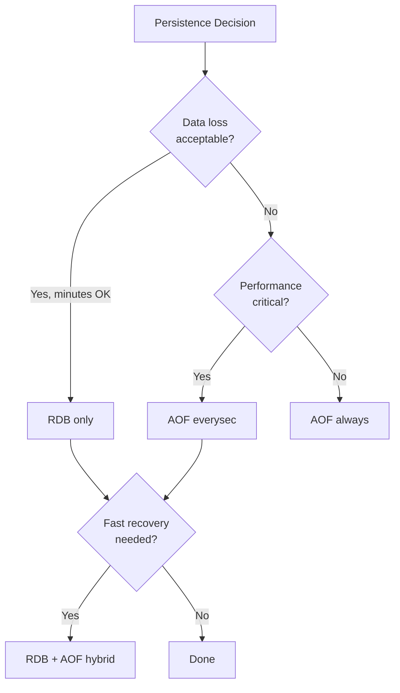
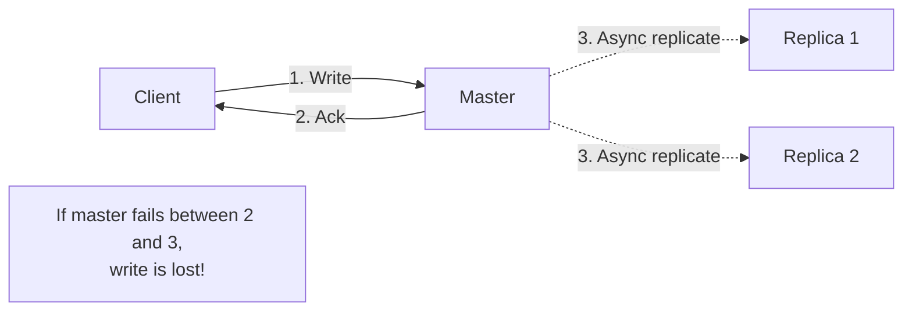
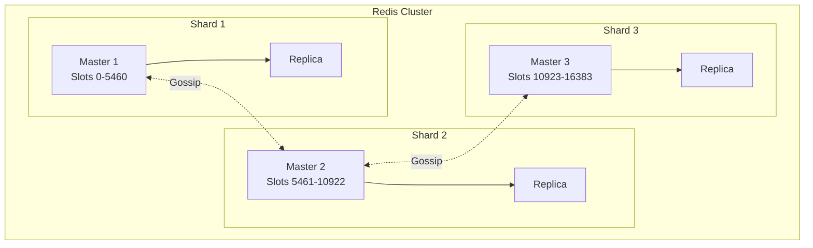
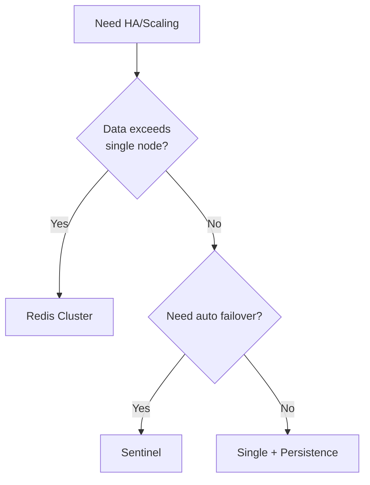

# Redis Architecture — Deep Dive

> Practical patterns for data structures, caching, persistence, and high availability.

**Prerequisites:** [Caching & Content Delivery](./05_CACHING_AND_CONTENT_DELIVERY.md), [Replication & Partitioning](./06_REPLICATION_AND_PARTITIONING.md)
**Related:** [Consistent Hashing](./DD_CONSISTENT_HASHING.md) (for clustering), [Consensus Protocols](./DD_CONSENSUS_PROTOCOLS.md) (for Sentinel)

---

## Document Navigation

| Section | Focus | Interview Relevance |
|---------|-------|---------------------|
| [Core Concepts](#1-core-concepts) | Single-threaded, in-memory, data structures | "How does Redis work?" |
| [Data Structure Patterns](#2-data-structure-patterns) | Which structure for which problem | "Design a leaderboard/cache/queue" |
| [Caching Patterns](#3-caching-patterns) | Cache-aside, read/write-through, TTL | "Implement caching for this system" |
| [Persistence Configuration](#4-persistence-configuration) | RDB, AOF, hybrid decisions | "How to prevent data loss?" |
| [High Availability](#5-high-availability) | Sentinel vs Cluster, failover | "Make Redis highly available" |
| [Distributed Locking](#6-distributed-locking) | Single-instance, Redlock, fencing | "Implement a distributed lock" |
| [Performance Patterns](#7-performance-patterns) | Pipelining, pooling, SCAN | "Optimize Redis performance" |
| [Lua Scripting](#8-lua-scripting) | Atomic operations, rate limiting | "Implement atomic operations" |
| [Common Pitfalls](#9-common-pitfalls) | Anti-patterns and solutions | Avoid interview red flags |
| [Interview Articulation](#10-interview-articulation) | 30-second and 2-minute versions | Concise explanations |
| [Quick Reference Card](#11-quick-reference-card) | Commands and configuration | Quick lookup |

---

## 1. Core Concepts

### What Redis Is

Redis is an **in-memory data structure server**—not just a cache. The key insight: instead of simple key-value pairs, Redis provides rich data structures (lists, sets, sorted sets, hashes) with server-side operations that eliminate round-trips.



### Single-Threaded Architecture

Redis processes commands in a single thread. This is a deliberate design choice, not a limitation.

| Benefit | Why It Matters |
|---------|----------------|
| **No locks needed** | Operations are atomic by design |
| **Predictable latency** | No context switching |
| **Simpler debugging** | Easier to reason about |
| **Memory-bound** | CPU isn't the bottleneck for in-memory ops |

**Trade-off**: Cannot use multiple cores for command processing. Redis 6.0+ added I/O threading for network operations, but command execution remains single-threaded.

### Key Terminology

| Term | Meaning |
|------|---------|
| **Key** | Unique identifier for any data structure |
| **TTL** | Time-to-live; automatic expiration |
| **Eviction** | Removing keys when memory limit reached |
| **Persistence** | Saving data to disk (RDB/AOF) |
| **Replication** | Copying data to replica nodes |
| **Sentinel** | HA system for automatic failover |
| **Cluster** | Horizontal sharding across nodes |

---

## 2. Data Structure Patterns

### Pattern 1: Strings — Caching & Counters

```python
# Caching serialized objects
redis.set("user:123", json.dumps(user_data), ex=3600)
user = json.loads(redis.get("user:123"))

# Atomic counters
redis.incr("page_views:home")
redis.incrby("user:123:balance", 100)

# Rate limiting token
redis.set("rate:user:123", 1, ex=60, nx=True)  # NX = only if not exists
```

| Operation | Complexity | Use Case |
|-----------|------------|----------|
| `GET/SET` | O(1) | Caching, sessions |
| `INCR/DECR` | O(1) | Counters, rate limiting |
| `SETNX` | O(1) | Locking, deduplication |
| `SETEX` | O(1) | Cache with TTL |

### Pattern 2: Hashes — Object Storage

```python
# Store object with field-level access
redis.hset("user:123", mapping={
    "name": "Alice",
    "email": "alice@example.com",
    "login_count": 0
})

# Update single field (no need to read/write entire object)
redis.hincrby("user:123", "login_count", 1)

# Get specific fields
name, email = redis.hmget("user:123", "name", "email")
```

| Operation | Complexity | Use Case |
|-----------|------------|----------|
| `HGET/HSET` | O(1) | Field access |
| `HMGET/HMSET` | O(n) | Multiple fields |
| `HINCRBY` | O(1) | Field counters |
| `HGETALL` | O(n) | Full object retrieval |

**When to use Hash vs String**: Use Hash when you need field-level access. Use String for opaque cached values.

### Pattern 3: Lists — Queues & Recent Items

```python
# Message queue (producer)
redis.lpush("queue:emails", json.dumps(email_job))

# Message queue (consumer)
job = redis.brpop("queue:emails", timeout=30)  # Blocking pop

# Recent items (capped list)
redis.lpush("user:123:recent_views", product_id)
redis.ltrim("user:123:recent_views", 0, 99)  # Keep only 100 items
```

| Operation | Complexity | Use Case |
|-----------|------------|----------|
| `LPUSH/RPUSH` | O(1) | Add to queue |
| `LPOP/RPOP` | O(1) | Consume from queue |
| `BRPOP/BLPOP` | O(1) | Blocking consume |
| `LRANGE` | O(S+N) | Get range of items |
| `LTRIM` | O(N) | Cap list size |

### Pattern 4: Sets — Unique Collections & Relationships

```python
# Track unique visitors
redis.sadd("visitors:2024-01-15", user_id)
unique_count = redis.scard("visitors:2024-01-15")

# Social graph
redis.sadd("user:123:following", "456", "789")
redis.sadd("user:456:followers", "123")

# Find mutual friends
mutual = redis.sinter("user:123:following", "user:456:following")
```

| Operation | Complexity | Use Case |
|-----------|------------|----------|
| `SADD` | O(1) | Add member |
| `SISMEMBER` | O(1) | Check membership |
| `SCARD` | O(1) | Count members |
| `SINTER` | O(N*M) | Intersection |
| `SUNION` | O(N) | Union |

### Pattern 5: Sorted Sets — Leaderboards & Scheduling

```python
# Leaderboard
redis.zadd("leaderboard:game1", {"alice": 1500, "bob": 1200, "carol": 1800})

# Get top 10 players (highest scores)
top_10 = redis.zrevrange("leaderboard:game1", 0, 9, withscores=True)

# Get player rank (0-indexed)
rank = redis.zrevrank("leaderboard:game1", "alice")

# Delayed job queue (score = timestamp)
redis.zadd("delayed_jobs", {job_id: execute_at_timestamp})
due_jobs = redis.zrangebyscore("delayed_jobs", 0, current_timestamp)
```

| Operation | Complexity | Use Case |
|-----------|------------|----------|
| `ZADD` | O(log n) | Add with score |
| `ZRANK/ZREVRANK` | O(log n) | Get position |
| `ZSCORE` | O(1) | Get score |
| `ZRANGE/ZREVRANGE` | O(log n + m) | Get by rank |
| `ZRANGEBYSCORE` | O(log n + m) | Get by score range |

### Pattern 6: HyperLogLog — Cardinality Estimation

```python
# Count unique visitors (probabilistic, 0.81% error)
redis.pfadd("unique:visitors:2024-01", user_id)
approx_count = redis.pfcount("unique:visitors:2024-01")

# Merge multiple periods
redis.pfmerge("unique:visitors:q1",
              "unique:visitors:2024-01",
              "unique:visitors:2024-02",
              "unique:visitors:2024-03")
```

**Key property**: Only 12KB memory regardless of cardinality. Use when approximate count is acceptable.

### Pattern 7: Streams — Event Log with Consumer Groups

```python
# Produce event
redis.xadd("events:orders", {"order_id": "123", "status": "created"})

# Consume with consumer group (like Kafka)
redis.xgroup_create("events:orders", "order-processors", id="0", mkstream=True)

# Read as consumer in group
messages = redis.xreadgroup(
    "order-processors", "consumer-1",
    {"events:orders": ">"},  # ">" means undelivered messages
    count=10, block=5000
)

# Acknowledge processing
redis.xack("events:orders", "order-processors", message_id)
```

**Use case**: When you need Kafka-like semantics (consumer groups, acknowledgment) but don't want a separate system.

### Data Structure Decision Flowchart



---

## 3. Caching Patterns

### Pattern 1: Cache-Aside (Lazy Loading)

```python
def get_user(user_id):
    # Try cache first
    cached = redis.get(f"user:{user_id}")
    if cached:
        return json.loads(cached)

    # Cache miss: load from database
    user = db.query("SELECT * FROM users WHERE id = ?", user_id)

    # Populate cache
    redis.set(f"user:{user_id}", json.dumps(user), ex=3600)
    return user

def update_user(user_id, data):
    # Update database
    db.execute("UPDATE users SET ... WHERE id = ?", user_id)

    # Invalidate cache (don't update - avoid race conditions)
    redis.delete(f"user:{user_id}")
```

| Pros | Cons |
|------|------|
| Only caches what's needed | Cache miss penalty |
| Resilient to cache failure | Potential stale data |
| Simple implementation | N+1 query problem possible |

### Pattern 2: Write-Through

```python
def update_user(user_id, data):
    # Update database
    db.execute("UPDATE users SET ... WHERE id = ?", user_id)

    # Update cache (atomic with DB in ideal case)
    redis.set(f"user:{user_id}", json.dumps(data), ex=3600)
```

| Pros | Cons |
|------|------|
| Cache always fresh | Write latency higher |
| Simpler read path | Wasted cache space for unused data |

### Pattern 3: Write-Behind (Write-Back)

```python
def update_user(user_id, data):
    # Update cache immediately
    redis.set(f"user:{user_id}", json.dumps(data), ex=3600)

    # Queue database write for async processing
    redis.lpush("db_write_queue", json.dumps({
        "table": "users",
        "id": user_id,
        "data": data
    }))

# Background worker
def process_writes():
    while True:
        item = redis.brpop("db_write_queue")
        db.execute(...)  # Batch and write to DB
```

| Pros | Cons |
|------|------|
| Fastest writes | Data loss risk if cache fails |
| Batching possible | Complex failure handling |

### Cache Invalidation Strategies

| Strategy | Implementation | Use Case |
|----------|----------------|----------|
| **TTL-based** | `SET key value EX 3600` | Most common, simple |
| **Event-based** | Delete on write | Strong consistency needed |
| **Version-based** | `user:123:v5` | Cache busting |
| **Tag-based** | Track related keys | Bulk invalidation |

### Preventing Cache Stampede

```python
# Problem: Cache expires, 1000 requests hit DB simultaneously

# Solution 1: Mutex/Lock
def get_with_lock(key):
    value = redis.get(key)
    if value:
        return value

    # Try to acquire lock
    if redis.set(f"lock:{key}", 1, nx=True, ex=10):
        try:
            value = db.query(...)
            redis.set(key, value, ex=3600)
        finally:
            redis.delete(f"lock:{key}")
        return value
    else:
        # Wait and retry
        time.sleep(0.1)
        return get_with_lock(key)

# Solution 2: Probabilistic early expiration
def get_with_early_refresh(key, ttl=3600, beta=1):
    value, expiry = redis.get_with_ttl(key)
    remaining = expiry - time.time()

    # Probabilistically refresh before expiry
    if remaining < ttl * beta * random.random():
        # Refresh in background
        refresh_async(key)

    return value
```

---

## 4. Persistence Configuration

### RDB (Snapshotting)

Point-in-time snapshots using fork + copy-on-write.

```redis
# Configuration
save 900 1      # Snapshot if 1+ keys changed in 900 seconds
save 300 10     # Snapshot if 10+ keys changed in 300 seconds
save 60 10000   # Snapshot if 10000+ keys changed in 60 seconds

rdbcompression yes
dbfilename dump.rdb
```

| Pros | Cons |
|------|------|
| Compact single file | Data loss since last snapshot |
| Fast restarts | Fork can cause latency spike |
| Good for backups | Memory overhead during fork |

### AOF (Append-Only File)

Logs every write operation.

```redis
# Configuration
appendonly yes
appendfilename "appendonly.aof"
appendfsync everysec    # Options: always, everysec, no

# Auto-rewrite to compact
auto-aof-rewrite-percentage 100
auto-aof-rewrite-min-size 64mb
```

| fsync Mode | Durability | Performance |
|------------|------------|-------------|
| `always` | No data loss | Slowest |
| `everysec` | Up to 1 second loss | Good balance |
| `no` | OS-dependent | Fastest |

### Hybrid (RDB + AOF)

Combines fast RDB loading with AOF durability.

```redis
aof-use-rdb-preamble yes
```

**How it works**: AOF rewrite creates RDB snapshot as preamble, then appends subsequent commands.

### Persistence Decision Matrix

| Requirement | Configuration |
|-------------|---------------|
| Pure cache, no persistence | `save ""` (disable RDB), no AOF |
| Can lose minutes of data | RDB only with `save 60 10000` |
| Max 1 second data loss | AOF with `appendfsync everysec` |
| No data loss acceptable | AOF with `appendfsync always` |
| Fast recovery + durability | RDB + AOF hybrid |



---

## 5. High Availability

### Replication Basics

Redis uses asynchronous leader-follower replication.

```redis
# On replica
replicaof 192.168.1.100 6379
replica-read-only yes
```

**Critical understanding**: Replication is NOT consensus. Acknowledged writes can be lost if master fails before replicating.



### Sentinel: Automatic Failover

Sentinel monitors masters and performs automatic failover.

```redis
# sentinel.conf
sentinel monitor mymaster 192.168.1.100 6379 2
sentinel down-after-milliseconds mymaster 30000
sentinel failover-timeout mymaster 180000
```

| Parameter | Meaning | Recommendation |
|-----------|---------|----------------|
| `quorum` | Sentinels needed to agree on failure | (N/2)+1 |
| `down-after-milliseconds` | Time before SDOWN | 5000-30000ms |
| `failover-timeout` | Max failover duration | 180000ms |

**Minimum setup**: 3 Sentinels + 1 Master + 1 Replica

### Redis Cluster: Horizontal Scaling

Cluster shards data across multiple masters using 16,384 hash slots.

```
HASH_SLOT = CRC16(key) mod 16384
```



**Minimum setup**: 6 nodes (3 masters + 3 replicas)

### Hash Tags for Multi-Key Operations

```redis
# Force related keys to same slot
SET {user:123}:profile "..."
SET {user:123}:settings "..."

# Now multi-key operations work
MGET {user:123}:profile {user:123}:settings
```

### Sentinel vs Cluster Decision

| Factor | Sentinel | Cluster |
|--------|----------|---------|
| **Data size** | Fits in single node | Exceeds single node |
| **Scaling** | Vertical only | Horizontal |
| **Complexity** | Lower | Higher |
| **Multi-key ops** | Always work | Need hash tags |
| **Minimum nodes** | 3 Sentinels + 2 Redis | 6 Redis nodes |



---

## 6. Distributed Locking

### Pattern 1: Single-Instance Lock

```python
import uuid

def acquire_lock(redis, lock_name, ttl_seconds=10):
    """Acquire lock with unique token."""
    token = str(uuid.uuid4())
    acquired = redis.set(lock_name, token, nx=True, ex=ttl_seconds)
    return token if acquired else None

def release_lock(redis, lock_name, token):
    """Release only if we own the lock (Lua for atomicity)."""
    lua = """
    if redis.call("GET", KEYS[1]) == ARGV[1] then
        return redis.call("DEL", KEYS[1])
    else
        return 0
    end
    """
    return redis.eval(lua, 1, lock_name, token)

# Usage
token = acquire_lock(redis, "lock:resource")
if token:
    try:
        do_critical_work()
    finally:
        release_lock(redis, "lock:resource", token)
```

### Pattern 2: Lock with Renewal

```python
def acquire_with_renewal(redis, lock_name, ttl=10):
    token = acquire_lock(redis, lock_name, ttl)
    if not token:
        return None, None

    # Start renewal thread
    stop_event = threading.Event()

    def renew():
        while not stop_event.is_set():
            time.sleep(ttl / 3)
            if not stop_event.is_set():
                # Extend TTL if we still own it
                lua = """
                if redis.call("GET", KEYS[1]) == ARGV[1] then
                    return redis.call("EXPIRE", KEYS[1], ARGV[2])
                end
                """
                redis.eval(lua, 1, lock_name, token, ttl)

    thread = threading.Thread(target=renew)
    thread.start()
    return token, stop_event

# Usage
token, stop_event = acquire_with_renewal(redis, "lock:resource")
try:
    do_long_running_work()
finally:
    stop_event.set()
    release_lock(redis, "lock:resource", token)
```

### When NOT to Use Redis for Locking

| Scenario | Problem | Alternative |
|----------|---------|-------------|
| **Correctness-critical** | Redis lock can fail (GC pause, network) | Zookeeper, etcd |
| **Cross-datacenter** | Network partitions cause issues | Consensus systems |
| **Long-held locks** | TTL management complex | Database locks |

### Fencing Tokens: The Proper Safety Mechanism

Even with perfect locking, you need fencing tokens for true safety:

```python
# Lock service returns monotonically increasing token
token = lock_service.acquire("resource")  # Returns: 34

# Resource validates token
resource.write(data, fencing_token=34)

# Resource rejects stale tokens
class Resource:
    def write(self, data, fencing_token):
        if fencing_token <= self.last_token:
            raise StaleTokenError()
        self.last_token = fencing_token
        self._do_write(data)
```

**Key insight**: The protected resource must validate tokens, not just the lock.

---

## 7. Performance Patterns

### Pipelining: Batch Commands

```python
# Bad: 1000 round-trips
for i in range(1000):
    redis.set(f"key:{i}", f"value:{i}")

# Good: 1 round-trip
pipe = redis.pipeline()
for i in range(1000):
    pipe.set(f"key:{i}", f"value:{i}")
pipe.execute()
```

**Performance gain**: 5-10x throughput improvement.

### Connection Pooling

```python
# Bad: New connection per request
def handle_request():
    r = Redis(host='localhost')
    r.get("key")
    r.close()

# Good: Reuse connections
pool = ConnectionPool(host='localhost', max_connections=50)
redis = Redis(connection_pool=pool)

def handle_request():
    redis.get("key")  # Uses pooled connection
```

### SCAN Instead of KEYS

```python
# NEVER in production (blocks server)
keys = redis.keys("user:*")

# Safe: Iterate incrementally
cursor = 0
while True:
    cursor, keys = redis.scan(cursor, match="user:*", count=100)
    for key in keys:
        process(key)
    if cursor == 0:
        break
```

### Memory Optimization

```python
# Bad: Many small keys (high overhead per key)
redis.set("user:1:name", "Alice")
redis.set("user:1:email", "alice@example.com")

# Good: Hash for related fields
redis.hset("user:1", mapping={"name": "Alice", "email": "alice@example.com"})
```

| Optimization | Technique |
|--------------|-----------|
| Reduce key count | Use Hashes for objects |
| Short key names | `u:123` vs `user:123` in high-volume |
| Compress values | gzip for large strings |
| Set TTLs | Prevent unbounded growth |
| Monitor memory | `INFO memory`, `MEMORY DOCTOR` |

---

## 8. Lua Scripting

### Why Lua Scripts

Lua scripts execute atomically—no other commands run during script execution. This enables complex atomic operations without WATCH/MULTI/EXEC complexity.

### Pattern: Rate Limiting

```lua
-- rate_limit.lua
-- KEYS[1] = rate limit key
-- ARGV[1] = limit
-- ARGV[2] = window in seconds

local current = tonumber(redis.call('GET', KEYS[1]) or 0)

if current >= tonumber(ARGV[1]) then
    return 0  -- Rate limited
end

local new_count = redis.call('INCR', KEYS[1])
if new_count == 1 then
    redis.call('EXPIRE', KEYS[1], ARGV[2])
end

return 1  -- Allowed
```

```python
# Usage
sha = redis.script_load(lua_script)
allowed = redis.evalsha(sha, 1, f"rate:{user_id}", 100, 60)
```

### Pattern: Sliding Window Rate Limit

```lua
-- sliding_window.lua
-- KEYS[1] = sorted set key
-- ARGV[1] = now (ms)
-- ARGV[2] = window size (ms)
-- ARGV[3] = max requests

local key = KEYS[1]
local now = tonumber(ARGV[1])
local window = tonumber(ARGV[2])
local limit = tonumber(ARGV[3])

-- Remove old entries
redis.call('ZREMRANGEBYSCORE', key, 0, now - window)

-- Count current window
local count = redis.call('ZCARD', key)

if count >= limit then
    return 0
end

-- Add new entry
redis.call('ZADD', key, now, now .. ':' .. math.random())
redis.call('EXPIRE', key, math.ceil(window / 1000))

return 1
```

### Pattern: Compare-and-Swap

```lua
-- cas.lua
-- KEYS[1] = key
-- ARGV[1] = expected value
-- ARGV[2] = new value

if redis.call('GET', KEYS[1]) == ARGV[1] then
    redis.call('SET', KEYS[1], ARGV[2])
    return 1
else
    return 0
end
```

### Script Guidelines

| Rule | Why |
|------|-----|
| Keep scripts short (<100ms) | Scripts block server |
| Avoid O(n) on large collections | Performance impact |
| Use EVALSHA, not EVAL | Avoids resending script text |
| Scripts are atomic | No need for transactions |

---

## 9. Common Pitfalls

### Anti-Pattern 1: Using KEYS in Production

```python
# Bad: Blocks server, scans all keys
keys = redis.keys("user:*")

# Good: Use SCAN for iteration
for key in redis.scan_iter("user:*", count=100):
    process(key)
```

**Symptom**: Server freezes during KEYS command.
**Fix**: Always use SCAN for pattern matching.

### Anti-Pattern 2: Big Keys

```python
# Bad: Storing huge values
redis.set("reports:daily", massive_json_string)  # 50MB value

# Good: Split into chunks or use external storage
for i, chunk in enumerate(chunks(data, 1024*1024)):
    redis.set(f"reports:daily:chunk:{i}", chunk)
```

**Symptom**: Latency spikes, replication lag, cluster migration stuck.
**Fix**: Keep values under 1MB. Use `redis-cli --bigkeys` to detect.

### Anti-Pattern 3: Hot Keys

```python
# Problem: One key receives all traffic
redis.get("config:global")  # Every request hits this

# Solution 1: Local caching
local_cache = TTLCache(ttl=5)
def get_config():
    if "config" not in local_cache:
        local_cache["config"] = redis.get("config:global")
    return local_cache["config"]

# Solution 2: Key replication
# Store copies: config:global:1, config:global:2, ...
# Randomly select which to read
```

**Symptom**: Single shard overloaded, high latency for that key.
**Fix**: Local caching, key sharding, or read from replicas.

### Anti-Pattern 4: No TTL on Cache Keys

```python
# Bad: Keys live forever
redis.set("cache:user:123", data)

# Good: Always set TTL for cache
redis.set("cache:user:123", data, ex=3600)
```

**Symptom**: Memory grows unboundedly.
**Fix**: Set TTLs, configure eviction policy.

### Anti-Pattern 5: Not Using Pipelining

```python
# Bad: 1000 round-trips
for item in items:
    redis.set(f"key:{item.id}", item.value)

# Good: 1 round-trip
pipe = redis.pipeline()
for item in items:
    pipe.set(f"key:{item.id}", item.value)
pipe.execute()
```

**Symptom**: High latency for batch operations.
**Fix**: Use pipelining for multiple commands.

### Anti-Pattern 6: Ignoring Eviction Policy

```python
# Problem: Using volatile-lru but keys have no TTL
# Result: OOM errors because nothing can be evicted

# Fix: Match policy to key patterns
# allkeys-lru: All keys can be evicted
# volatile-lru: Only keys with TTL evicted
```

**Symptom**: OOM errors with `volatile-*` policy but no TTLs.
**Fix**: Use `allkeys-*` or ensure cache keys have TTLs.

---

## 10. Interview Articulation

### 30-Second Version

> "Redis is an in-memory data structure server—not just a cache. Its single-threaded event loop processes commands atomically, achieving 100K+ ops/sec with sub-millisecond latency. It provides rich data types: strings, hashes, lists, sets, sorted sets with O(log n) operations, and streams. For persistence, it offers RDB snapshots and AOF logging. Sentinel provides automatic failover, while Cluster enables horizontal sharding across 16,384 hash slots. The key trade-off: replication is asynchronous, so acknowledged writes can be lost on master failure—it's not consensus-based."

### Common Interview Questions

| Question | Key Points |
|----------|------------|
| "Redis vs Memcached?" | Redis: data structures, persistence, replication, Lua. Memcached: simpler, multi-threaded, pure caching. |
| "Is Redis single-threaded?" | Command execution: yes. I/O: threaded in 6.0+. Single thread = atomic operations, no locks. |
| "How to implement rate limiting?" | Sorted set with timestamp scores for sliding window, or simple counter with TTL for fixed window. Lua for atomicity. |
| "How to implement distributed lock?" | SET NX EX for single instance. Redlock for fault tolerance. Fencing tokens for true safety. Use Zookeeper/etcd for correctness-critical. |
| "Redis memory full?" | Depends on maxmemory-policy: noeviction errors, LRU/LFU evict keys, volatile-* only evict TTL keys. |
| "Design a leaderboard?" | Sorted set. ZADD for scores, ZREVRANGE for top N, ZRANK for position. O(log n) operations. |

---

## 11. Quick Reference Card

### Data Structure Selection

| Need | Use | Complexity |
|------|-----|------------|
| Cache/counter | String | O(1) |
| Object with fields | Hash | O(1) per field |
| Queue | List | O(1) push/pop |
| Unique collection | Set | O(1) membership |
| Ranked/sorted data | Sorted Set | O(log n) |
| Approximate count | HyperLogLog | O(1), 12KB |
| Event log | Stream | O(1) append |

### Essential Commands

```redis
# Strings
SET key value EX 3600 NX    # Set with TTL, only if not exists
GET key
INCR key

# Hashes
HSET key field value
HGET key field
HINCRBY key field 1

# Lists
LPUSH key value             # Add to head
RPOP key                    # Remove from tail
BRPOP key timeout           # Blocking pop

# Sets
SADD key member
SISMEMBER key member
SINTER key1 key2

# Sorted Sets
ZADD key score member
ZRANK key member
ZREVRANGE key 0 9 WITHSCORES

# Keys
SCAN cursor MATCH pattern COUNT 100
EXPIRE key seconds
TTL key
```

### Configuration Essentials

```redis
# Memory
maxmemory 4gb
maxmemory-policy allkeys-lfu

# Persistence
save 300 10                 # RDB
appendonly yes              # AOF
appendfsync everysec

# Replication safety
min-replicas-to-write 1
min-replicas-max-lag 10
```

### Complexity Cheat Sheet

| Structure | Insert | Lookup | Delete | Range |
|-----------|--------|--------|--------|-------|
| String | O(1) | O(1) | O(1) | O(n) |
| Hash | O(1) | O(1) | O(1) | O(n) |
| List | O(1)* | O(n) | O(1)* | O(S+N) |
| Set | O(1) | O(1) | O(1) | O(n) |
| Sorted Set | O(log n) | O(1)/O(log n) | O(log n) | O(log n+m) |

*Head/tail only

---

## References

### Official Documentation

- [Redis Documentation](https://redis.io/docs/)
- [Redis Commands](https://redis.io/commands/)
- [Redis Cluster Specification](https://redis.io/docs/reference/cluster-spec/)

### Critical Analysis

- Kleppmann, M. (2016). "How to do distributed locking." — Analysis of Redlock limitations
- Jepsen Redis analyses — https://jepsen.io/analyses

### Books

- Carlson, J. — *Redis in Action* (Manning)
- Kleppmann, M. — *Designing Data-Intensive Applications*, Chapter 8 (O'Reilly)

---

## Revision History

| Date | Change |
|------|--------|
| 2025-01 | Refactored for practical focus: patterns, configurations, common pitfalls |

---

## Navigation

**Prerequisites:** [Caching & Content Delivery](./05_CACHING_AND_CONTENT_DELIVERY.md)
**Related:** [Consistent Hashing](./DD_CONSISTENT_HASHING.md), [Consensus Protocols](./DD_CONSENSUS_PROTOCOLS.md)
**Index:** [README](./README.md)
