# Storage Engines — Deep Dive

> How databases physically store, retrieve, and maintain data on disk.

**Prerequisites:** [Data Management Overview](./DATA_MANAGEMENT.md), [Data Storage & Access](./03_DATA_STORAGE_AND_ACCESS.md)
**Related:** [Sharding & Partitioning](./DD_SHARDING_PARTITIONING.md), [Scaling & Infrastructure](./09_SCALING_AND_INFRASTRUCTURE.md)
**Estimated study time:** 3-4 hours

---

## Table of Contents

1. [Context & Problem Statement](#1-context--problem-statement)
2. [Storage Fundamentals](#2-storage-fundamentals)
3. [B-Tree Family](#3-b-tree-family)
4. [LSM-Tree Family](#4-lsm-tree-family)
5. [Write-Ahead Log (WAL)](#5-write-ahead-log-wal)
6. [Bloom Filters](#6-bloom-filters)
7. [Amplification Factors](#7-amplification-factors)
8. [Production Tuning](#8-production-tuning)
9. [Hybrid Approaches](#9-hybrid-approaches)
10. [Interview Articulation](#10-interview-articulation)
11. [Decision Framework](#11-decision-framework)
12. [Quick Reference Card](#12-quick-reference-card)
13. [References](#references)

---

## 1. Context & Problem Statement

### The Fundamental Challenge

Databases must balance two conflicting access patterns:

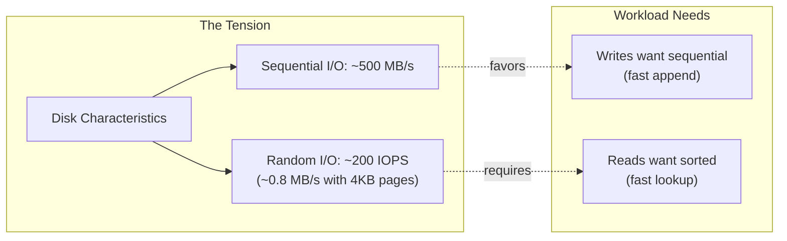

**The core trade-off**: Optimizing for writes (sequential appends) makes reads expensive (scan everything). Optimizing for reads (sorted structure) makes writes expensive (maintain order).

### Why Storage Engines Matter

| Decision | Impact |
|----------|--------|
| Wrong engine for workload | 10-100x performance difference |
| Misconfigured buffer pool | Constant disk thrashing |
| Ignoring write amplification | Premature SSD wear, high latency |
| No understanding of compaction | Unexpected latency spikes |

### The Two Dominant Paradigms

| Paradigm | Optimizes For | Examples |
|----------|---------------|----------|
| **B-Tree** | Reads, point lookups | PostgreSQL, MySQL InnoDB, Oracle |
| **LSM-Tree** | Writes, sequential workloads | Cassandra, RocksDB, LevelDB, HBase |

---

## 2. Storage Fundamentals

### Disk I/O Characteristics

Understanding storage media is essential for engine design:

| Medium | Sequential Read | Random Read (4KB) | Latency |
|--------|-----------------|-------------------|---------|
| HDD | 150-200 MB/s | 100-200 IOPS | 5-10 ms |
| SATA SSD | 500-600 MB/s | 50K-100K IOPS | 0.1 ms |
| NVMe SSD | 3-7 GB/s | 500K-1M IOPS | 0.02 ms |
| Memory | 50+ GB/s | N/A | 0.0001 ms |

**Key Insight**: Even with SSDs, sequential access is significantly faster than random. Storage engines that convert random writes to sequential writes gain substantial performance.

### Page-Based Storage

Databases read and write data in fixed-size **pages** (typically 4KB-16KB):

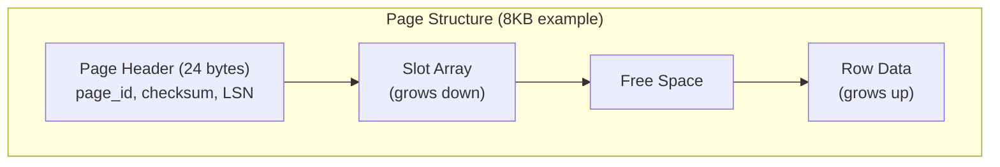

**Why pages?**
- Matches OS and disk block sizes
- Enables efficient caching
- Allows atomic writes (with checksums)
- Simplifies buffer management

### The Buffer Pool

All databases use an in-memory cache called the **buffer pool**:

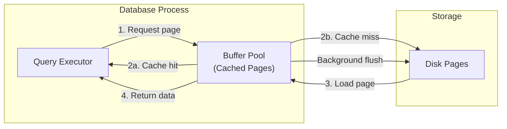

**Buffer Pool Management**:
- **LRU/Clock**: Evict least recently used pages
- **Dirty page tracking**: Know which pages need writing
- **Pin counting**: Prevent eviction of in-use pages
- **Prefetching**: Read ahead for sequential scans

---

## 3. B-Tree Family

### B-Tree vs B+Tree

Most databases use **B+Trees**, not plain B-Trees:

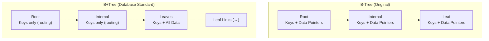

| Aspect | B-Tree | B+Tree |
|--------|--------|--------|
| Data location | All nodes | Leaves only |
| Internal nodes | Keys + data | Keys only (more keys per node) |
| Leaf linking | No | Yes (enables range scans) |
| Range queries | Tree traversal | Sequential leaf scan |
| Cache efficiency | Lower | Higher (internal nodes smaller) |

### B+Tree Structure Deep Dive

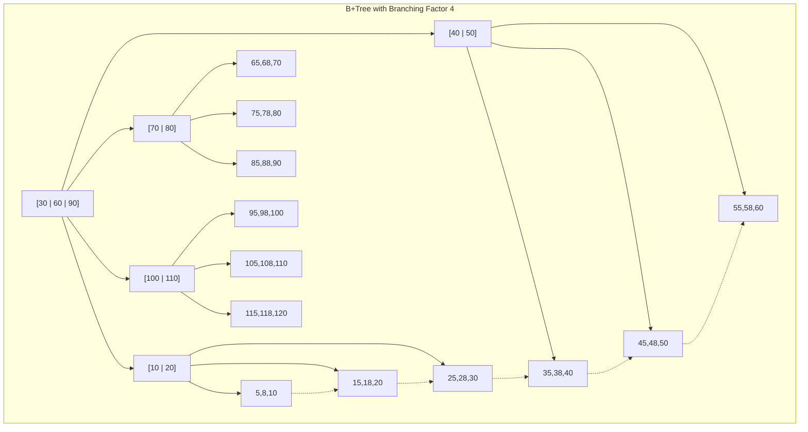

**Key Properties**:
- **Branching factor (B)**: Number of children per node (typically 100-500)
- **Height**: O(log_B N) — very shallow even for billions of rows
- **Balanced**: All leaves at same depth
- **Sorted**: Keys in order within and across nodes

**Height Analysis**:

| Rows | B=100 | B=500 |
|------|-------|-------|
| 10K | 2 | 2 |
| 1M | 3 | 2 |
| 100M | 4 | 3 |
| 10B | 5 | 4 |

With B=500 and 10 billion rows, only 4 page reads needed for any lookup!

### Page Splits and Merges

**Page Split** (on insert when page is full):

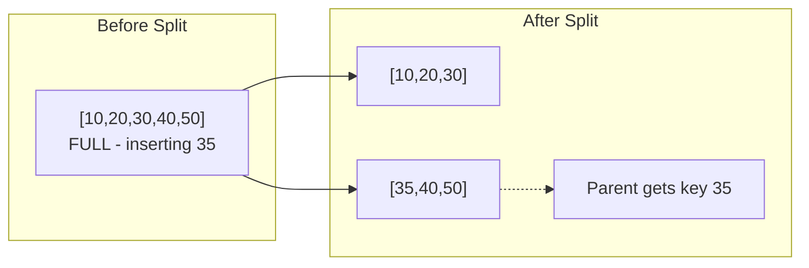

```python
def split_page(page, new_key, new_value):
    """
    Split a full B+Tree leaf page.

    1. Create new page
    2. Move half the entries to new page
    3. Insert new key in appropriate page
    4. Add pointer to new page in parent
    5. If parent full, recursively split
    """
    mid = len(page.entries) // 2
    new_page = Page()

    # Move upper half to new page
    new_page.entries = page.entries[mid:]
    page.entries = page.entries[:mid]

    # Insert new entry in correct page
    if new_key < new_page.entries[0].key:
        page.insert(new_key, new_value)
    else:
        new_page.insert(new_key, new_value)

    # Promote middle key to parent
    separator_key = new_page.entries[0].key
    parent.insert_child(separator_key, new_page)

    return page, new_page
```

**Page Merge** (on delete when page too empty):

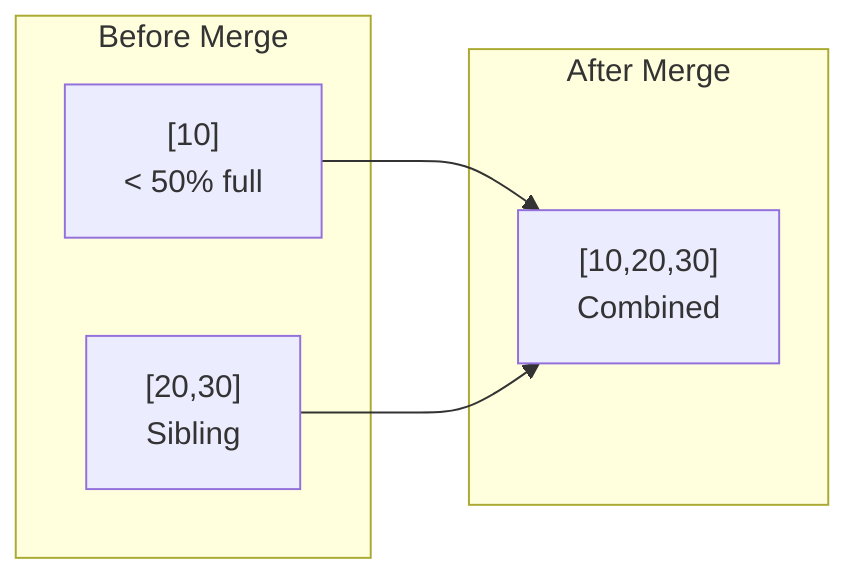

### B+Tree Write Path

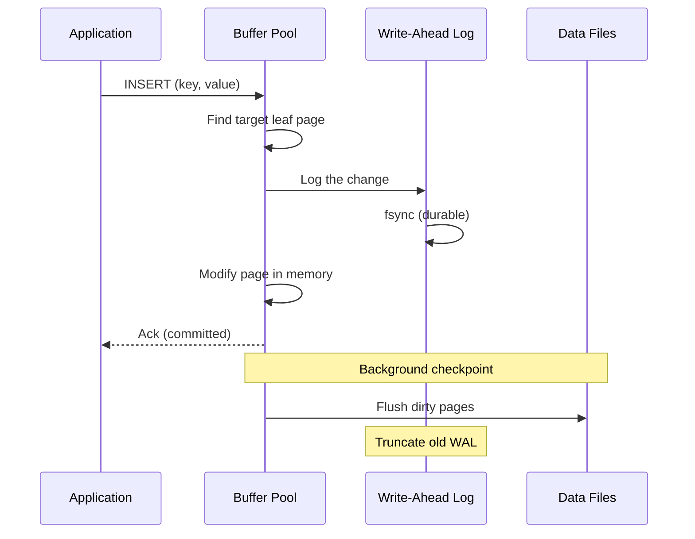

**Write Amplification**: A single logical write may cause:
1. WAL write (sequential)
2. Page modification
3. Page split → parent modification → cascading splits
4. Background flush of dirty pages

Typical: 2-10x amplification

### B+Tree Read Path

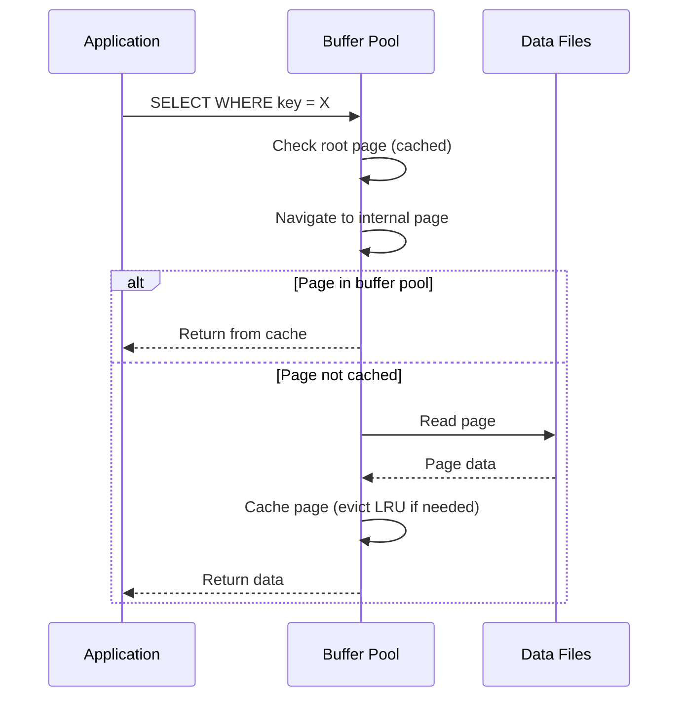

### Complexity Analysis

| Operation | Time | I/O (worst) | Notes |
|-----------|------|-------------|-------|
| Point lookup | O(log_B N) | O(log_B N) | Tree traversal |
| Range scan | O(log_B N + K) | O(log_B N + K/F) | Find start + scan K rows, F rows per page |
| Insert | O(log_B N) | O(log_B N) | May cause splits |
| Update | O(log_B N) | O(log_B N) | Find + modify in place |
| Delete | O(log_B N) | O(log_B N) | May cause merges |

*B = branching factor, N = total rows, K = result size, F = fill factor*

---

## 4. LSM-Tree Family

### Core Concept

Log-Structured Merge Tree converts random writes to sequential writes by:
1. Buffering writes in memory (MemTable)
2. Flushing to immutable sorted files (SSTables)
3. Background merging (compaction) to maintain read performance

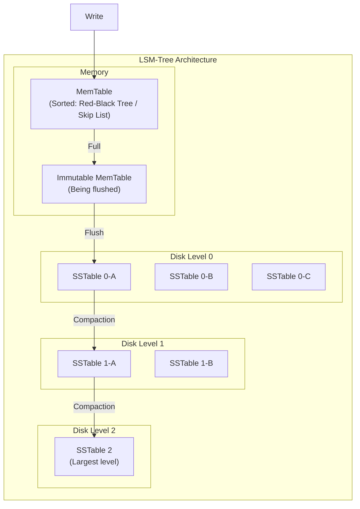

### MemTable

In-memory sorted structure for recent writes:

```python
class MemTable:
    """
    In-memory write buffer using a skip list or red-black tree.

    Properties:
    - Sorted by key for efficient range scans
    - O(log N) insert, lookup, delete
    - Typically sized 64MB - 256MB
    - Flushed to SSTable when full
    """

    def __init__(self, max_size_bytes=64 * 1024 * 1024):
        self.data = SortedDict()  # Or skip list
        self.size_bytes = 0
        self.max_size = max_size_bytes

    def put(self, key: bytes, value: bytes) -> bool:
        """Insert or update key-value pair."""
        old_size = self._entry_size(key, self.data.get(key))
        new_size = self._entry_size(key, value)

        self.data[key] = value
        self.size_bytes += (new_size - old_size)

        return self.size_bytes >= self.max_size  # Returns True if flush needed

    def get(self, key: bytes) -> Optional[bytes]:
        """Lookup key. Returns None if not found."""
        return self.data.get(key)

    def delete(self, key: bytes):
        """Delete by inserting tombstone marker."""
        self.put(key, TOMBSTONE)

    def flush_to_sstable(self, path: str) -> SSTable:
        """Write sorted contents to immutable SSTable file."""
        with SSTableWriter(path) as writer:
            for key, value in self.data.items():
                writer.write(key, value)
            writer.finish()  # Write index, bloom filter, metadata
        return SSTable(path)
```

### SSTable (Sorted String Table)

Immutable, sorted file format:

```
┌─────────────────────────────────────────────────────────────────┐
│                        SSTable File Format                       │
├─────────────────────────────────────────────────────────────────┤
│  Data Blocks                                                     │
│  ┌─────────────┬─────────────┬─────────────┬─────────────┐      │
│  │ Block 0     │ Block 1     │ Block 2     │ ...         │      │
│  │ (sorted KVs)│ (sorted KVs)│ (sorted KVs)│             │      │
│  └─────────────┴─────────────┴─────────────┴─────────────┘      │
├─────────────────────────────────────────────────────────────────┤
│  Index Block                                                     │
│  ┌─────────────────────────────────────────────────────────┐    │
│  │ [first_key_block0 → offset0]                            │    │
│  │ [first_key_block1 → offset1]                            │    │
│  │ [first_key_block2 → offset2]                            │    │
│  └─────────────────────────────────────────────────────────┘    │
├─────────────────────────────────────────────────────────────────┤
│  Bloom Filter (for fast negative lookups)                        │
├─────────────────────────────────────────────────────────────────┤
│  Footer (index offset, bloom offset, checksum, version)          │
└─────────────────────────────────────────────────────────────────┘
```

### LSM-Tree Write Path

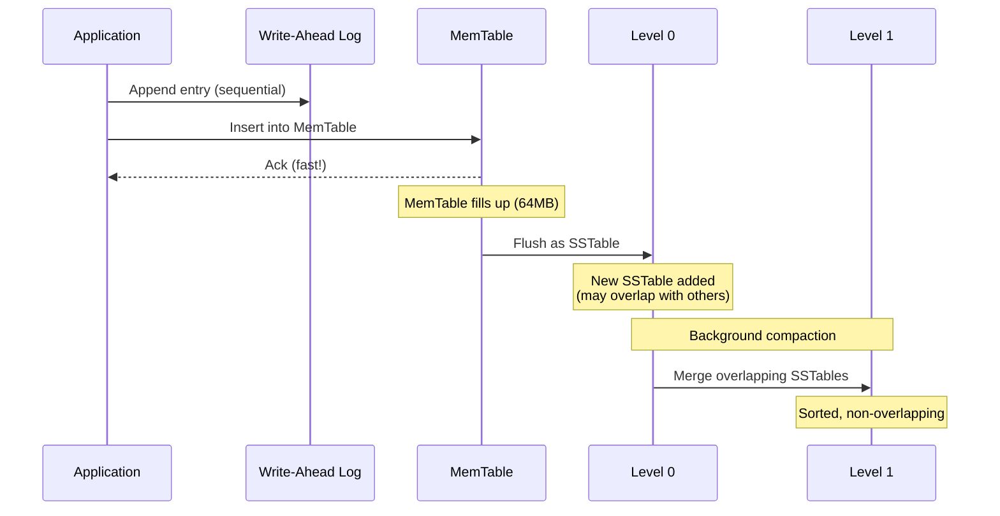

**Key Insight**: Writes only touch memory and sequential WAL. No random I/O!

### LSM-Tree Read Path

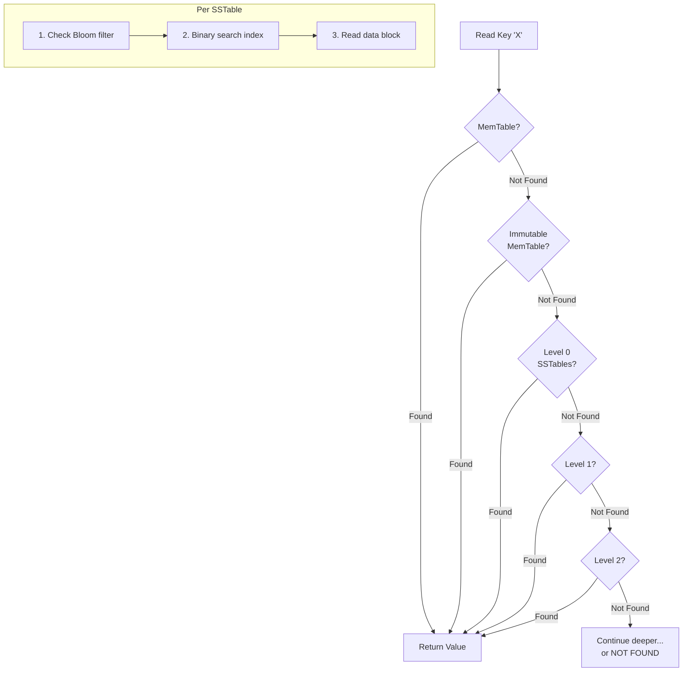

**Read Amplification**: Must check multiple levels. Bloom filters help skip SSTables that definitely don't contain the key.

### Compaction Strategies

#### Size-Tiered Compaction (STCS)

Merge SSTables of similar size:

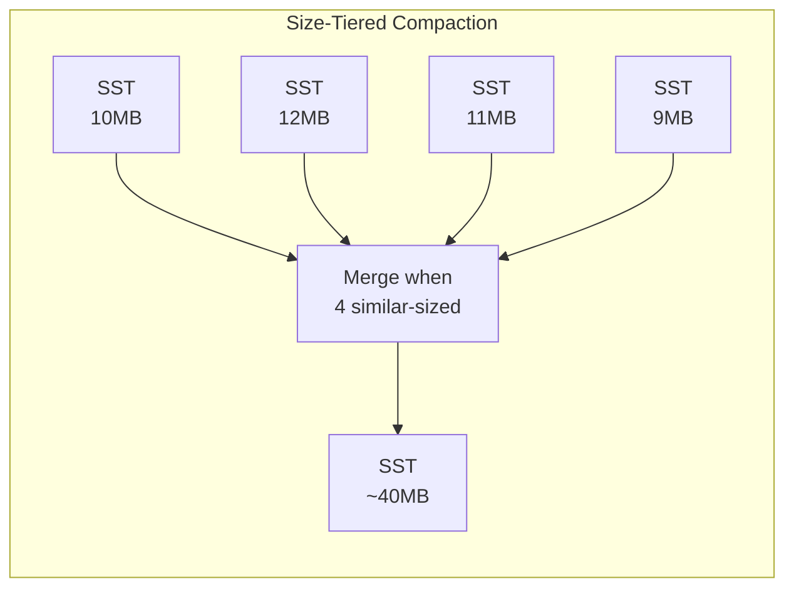

| Aspect | Size-Tiered |
|--------|-------------|
| Write amplification | Lower (~4-10x) |
| Space amplification | Higher (up to 2x) |
| Read amplification | Higher (many overlapping files) |
| Compaction I/O | Bursty |
| Best for | Write-heavy workloads |

#### Leveled Compaction (LCS)

Fixed-size levels with strict sorting:

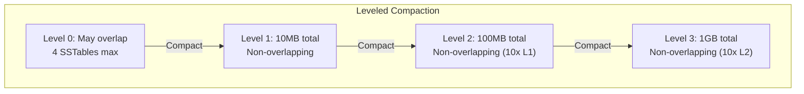

| Aspect | Leveled |
|--------|---------|
| Write amplification | Higher (~10-30x) |
| Space amplification | Lower (~10-20%) |
| Read amplification | Lower (1 file per level) |
| Compaction I/O | Steady |
| Best for | Read-heavy, space-constrained |

#### Comparison

| Factor | Size-Tiered | Leveled |
|--------|-------------|---------|
| Write amp | 4-10x | 10-30x |
| Read amp | High | Low |
| Space amp | ~2x | ~1.1x |
| Compaction pattern | Bursty | Continuous |
| Latency variance | Higher | Lower |

### Complexity Analysis

| Operation | Time | I/O (typical) | Notes |
|-----------|------|---------------|-------|
| Write | O(log N) | O(1) amortized | MemTable + sequential WAL |
| Point lookup | O(L × log N) | O(L) | Check L levels |
| Range scan | O(L × log N + K) | O(L + K/F) | Merge L iterators |
| Compaction | O(N log N) | O(N) | Background, amortized |

*L = number of levels, N = total entries, K = result size, F = entries per block*

---

## 5. Write-Ahead Log (WAL)

### Purpose

The WAL ensures durability: committed transactions survive crashes.

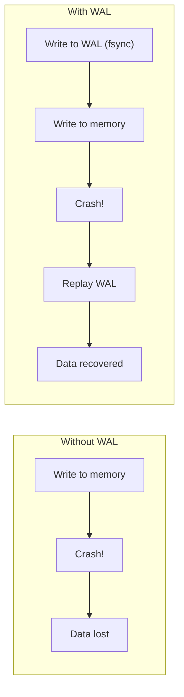

### WAL Structure

```
┌─────────────────────────────────────────────────────────────────┐
│                        WAL File Format                           │
├─────────────────────────────────────────────────────────────────┤
│  Record 1: [LSN=1] [Type=INSERT] [Table=users] [Data=...]       │
│  Record 2: [LSN=2] [Type=UPDATE] [Table=orders] [Data=...]      │
│  Record 3: [LSN=3] [Type=COMMIT] [TxnID=42]                     │
│  Record 4: [LSN=4] [Type=INSERT] [Table=items] [Data=...]       │
│  ...                                                             │
└─────────────────────────────────────────────────────────────────┘

LSN = Log Sequence Number (monotonically increasing)
```

### WAL Write Protocol

```python
def write_with_wal(key, value, wal, memtable):
    """
    Durable write using WAL.

    Protocol:
    1. Append to WAL
    2. fsync WAL (ensures durability)
    3. Apply to in-memory structure
    4. Acknowledge to client

    On crash recovery:
    - Replay WAL from last checkpoint
    - Rebuild in-memory state
    """
    # Step 1: Write to WAL
    lsn = wal.append(WriteRecord(key, value))

    # Step 2: Ensure durability
    wal.fsync()  # Critical! Data is now durable

    # Step 3: Apply to memory
    memtable.put(key, value)

    # Step 4: Return success
    return lsn
```

### Checkpoint Strategy

Periodically flush dirty pages to reduce recovery time:

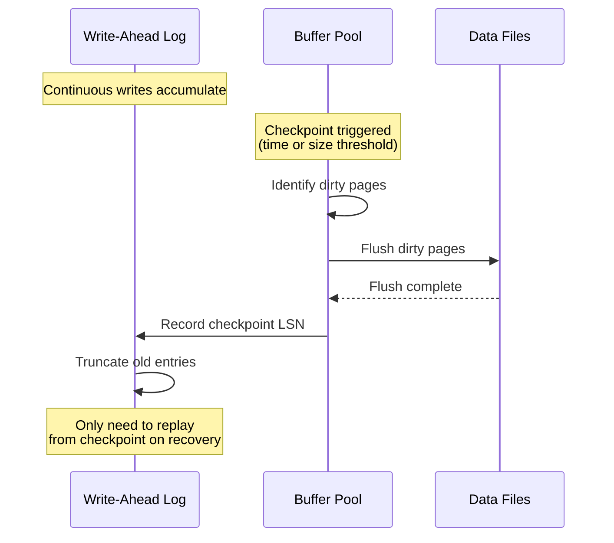

**Checkpoint Tradeoffs**:
- More frequent: Faster recovery, more I/O overhead
- Less frequent: Slower recovery, less I/O overhead

---

## 6. Bloom Filters

### Purpose

Bloom filters provide fast negative lookups: "Definitely not present" vs "Maybe present."

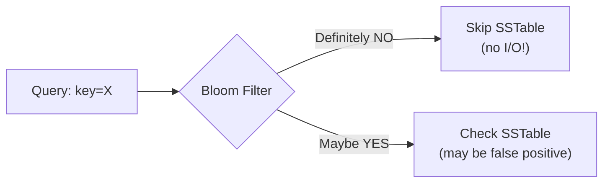

### How It Works

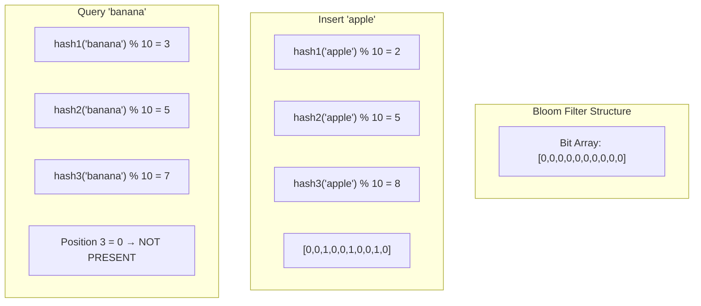

### Implementation

```python
import mmh3  # MurmurHash

class BloomFilter:
    """
    Space-efficient probabilistic data structure.

    Properties:
    - No false negatives: if filter says "no", definitely not present
    - False positives possible: if filter says "yes", might not be present
    - Cannot delete entries (without counting variant)
    """

    def __init__(self, expected_items: int, fp_rate: float = 0.01):
        """
        Initialize bloom filter.

        Args:
            expected_items: Expected number of items
            fp_rate: Desired false positive rate (default 1%)
        """
        # Optimal size: m = -n * ln(p) / (ln(2)^2)
        self.size = int(-expected_items * math.log(fp_rate) / (math.log(2) ** 2))
        # Optimal hash count: k = (m/n) * ln(2)
        self.num_hashes = int((self.size / expected_items) * math.log(2))
        self.bit_array = [False] * self.size

    def add(self, item: str) -> None:
        """Add item to filter."""
        for seed in range(self.num_hashes):
            index = mmh3.hash(item, seed) % self.size
            self.bit_array[index] = True

    def might_contain(self, item: str) -> bool:
        """
        Check if item might be in set.

        Returns:
            False: Definitely not present
            True: Possibly present (check actual data)
        """
        for seed in range(self.num_hashes):
            index = mmh3.hash(item, seed) % self.size
            if not self.bit_array[index]:
                return False  # Definitely not present
        return True  # Maybe present
```

### Sizing Guidelines

| Items | FP Rate | Bits per Item | Total Size |
|-------|---------|---------------|------------|
| 1M | 1% | 9.6 | 1.2 MB |
| 1M | 0.1% | 14.4 | 1.8 MB |
| 10M | 1% | 9.6 | 12 MB |
| 100M | 1% | 9.6 | 120 MB |

**Formula**: Bits = -n × ln(p) / (ln(2))² ≈ 10 bits per item for 1% FP

### Impact on LSM Reads

Without Bloom filters:
- Check every SSTable: O(L × log N) I/O

With Bloom filters:
- Check filter first: O(L) memory operations
- Only read SSTables that might contain key
- Typical: 99% of unnecessary reads avoided

---

## 7. Amplification Factors

Three types of amplification measure storage engine efficiency:

### Write Amplification

Ratio of bytes written to storage vs bytes written by application.

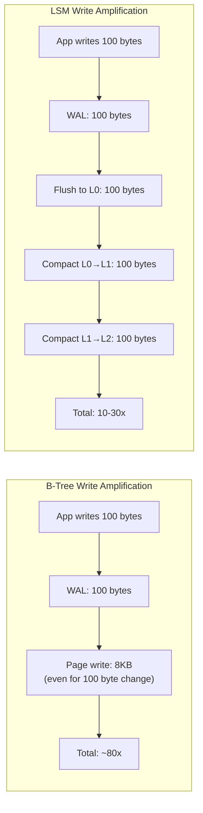

| Engine | Write Amplification | Notes |
|--------|---------------------|-------|
| B-Tree | 2-10x | WAL + page rewrites |
| LSM (Size-Tiered) | 4-10x | Each level rewrite |
| LSM (Leveled) | 10-30x | More compaction |

**Why it matters**: High write amplification → faster SSD wear, higher latency

### Read Amplification

Number of reads required to satisfy one application read.

| Engine | Read Amplification | Notes |
|--------|---------------------|-------|
| B-Tree | 1-4 | Tree depth |
| LSM | 1-10+ | Check multiple levels |

### Space Amplification

Ratio of storage used vs logical data size.

| Engine | Space Amplification | Notes |
|--------|---------------------|-------|
| B-Tree | 1.5-2x | Page fragmentation, fill factor |
| LSM (Size-Tiered) | 2x | Old versions during compaction |
| LSM (Leveled) | 1.1-1.2x | Better space efficiency |

### The RUM Conjecture

**R**ead, **U**pdate (write), **M**emory (space) — optimize two, sacrifice one.

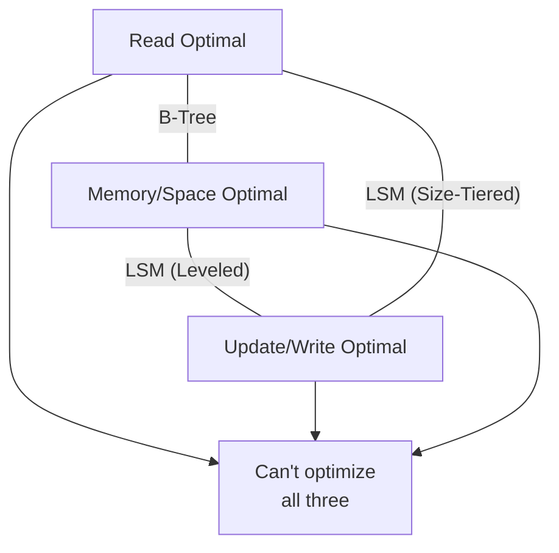

---

## 8. Production Tuning

### PostgreSQL (B-Tree)

```sql
-- Key configuration parameters
-- postgresql.conf

# Buffer pool (typically 25% of RAM)
shared_buffers = 4GB

# WAL settings
wal_level = replica
wal_buffers = 64MB
checkpoint_completion_target = 0.9
checkpoint_timeout = 10min

# Background writer
bgwriter_delay = 200ms
bgwriter_lru_maxpages = 100
```

**Tuning Guidelines**:
- `shared_buffers`: Start at 25% RAM, increase for read-heavy
- `effective_cache_size`: Set to 75% RAM (query planner hint)
- `checkpoint_completion_target`: 0.9 spreads checkpoint I/O

### RocksDB (LSM)

```cpp
// Key configuration options
Options options;

// MemTable size (triggers flush)
options.write_buffer_size = 64 * 1024 * 1024;  // 64MB

// Number of MemTables before stalling
options.max_write_buffer_number = 3;

// Level 0 triggers
options.level0_file_num_compaction_trigger = 4;
options.level0_slowdown_writes_trigger = 20;
options.level0_stop_writes_trigger = 36;

// Compaction style
options.compaction_style = kCompactionStyleLevel;  // or kCompactionStyleUniversal

// Bloom filter
BlockBasedTableOptions table_options;
table_options.filter_policy.reset(NewBloomFilterPolicy(10));  // 10 bits per key

// Compression
options.compression = kSnappyCompression;
```

**Tuning Guidelines**:
- `write_buffer_size`: Larger = fewer flushes, more memory
- `level0_file_num_compaction_trigger`: Balance write stalls vs read amplification
- Bloom filter bits: 10 = 1% FP, 14 = 0.1% FP

### Cassandra (LSM)

```yaml
# cassandra.yaml

# MemTable settings
memtable_heap_space_in_mb: 2048
memtable_offheap_space_in_mb: 2048
memtable_flush_writers: 4

# Compaction
compaction_throughput_mb_per_sec: 64
concurrent_compactors: 4

# Bloom filter (per table)
# ALTER TABLE users WITH bloom_filter_fp_chance = 0.01;
```

---

## 9. Hybrid Approaches

### WiscKey: Separating Keys from Values

Store keys in LSM, values in separate log:

```mermaid
flowchart LR
    subgraph "Traditional LSM"
        TRAD["Key + Value together<br/>in LSM levels"]
    end

    subgraph "WiscKey"
        LSM["LSM: Keys + Value Pointers"]
        VLOG["Value Log: Actual values"]

        LSM --> VLOG
    end
```

**Benefits**: Smaller LSM → less compaction, lower write amplification
**Tradeoff**: Range scans require random value reads

### TiKV: Raft + RocksDB

```mermaid
flowchart TB
    subgraph "TiKV Architecture"
        RAFT["Raft Consensus"]
        ROCKS["RocksDB Storage"]

        RAFT -->|"Replicated writes"| ROCKS
    end
```

### CockroachDB: Pebble Engine

Custom LSM implementation with:
- Optimized for Raft log replay
- Range deletion tombstones
- Parallel compaction

---

## 10. Interview Articulation

### 30-Second Version

> "Storage engines are the core of how databases physically store data. B-Trees, used by PostgreSQL and MySQL, optimize for reads—they maintain sorted data with O(log N) lookups and support efficient range scans, but writes cause random I/O. LSM-Trees, used by Cassandra and RocksDB, optimize for writes—they buffer in memory and flush to sorted files, converting random writes to sequential. The tradeoff is write amplification from compaction and potentially slower reads that must check multiple levels. Choose B-Tree for read-heavy OLTP, LSM for write-heavy or time-series workloads."

### 2-Minute Version

> "Storage engines determine how databases physically organize data on disk. The two dominant approaches are B-Trees and LSM-Trees, each optimized for different access patterns.
>
> B-Trees maintain data in a sorted, balanced tree structure. They're read-optimized—a lookup requires traversing just 3-4 levels even for billions of rows, making point queries very fast. Range scans are efficient because leaves are linked. The downside is writes: updating data requires finding the correct leaf page and modifying it in place, which is random I/O. Page splits add overhead. PostgreSQL, MySQL InnoDB, and Oracle all use B-Trees.
>
> LSM-Trees take the opposite approach. All writes go to an in-memory buffer called the MemTable. When it fills up, it's flushed as an immutable sorted file called an SSTable. Background compaction merges these files to maintain read performance. The key insight is that writes are always sequential—either to the MemTable or appending SSTables. This makes LSM-Trees much faster for write-heavy workloads. Cassandra, RocksDB, and LevelDB use LSM-Trees.
>
> The tradeoffs involve three amplification factors. Write amplification: LSM has higher because data is rewritten during compaction (10-30x for leveled compaction). Read amplification: LSM has higher because reads may check multiple levels. Space amplification: depends on compaction strategy.
>
> Both use Write-Ahead Logs for durability—write to WAL, fsync, then apply to memory. Both use Bloom filters to optimize lookups—LSM-Trees especially benefit since they avoid checking SSTables that definitely don't contain the key.
>
> For tuning, key parameters are buffer pool size for B-Trees and MemTable size plus compaction settings for LSM-Trees."

### Common Follow-Up Questions

| Question | Key Points |
|----------|------------|
| "Why not just use LSM for everything?" | Read amplification, compaction pauses, complexity |
| "How does compaction affect latency?" | Can cause spikes; leveled is smoother than size-tiered |
| "What's write amplification?" | Ratio of physical writes to logical writes; affects SSD lifetime |
| "How do Bloom filters help?" | Avoid reading SSTables that don't contain the key |
| "What's the buffer pool?" | In-memory cache of disk pages; critical for B-Tree performance |
| "B-Tree vs B+Tree?" | B+Tree stores data only in leaves; better for range scans and cache efficiency |

---

## 11. Decision Framework

```mermaid
flowchart TD
    START[Choose Storage Engine] --> Q1{Workload Type?}

    Q1 -->|"Read-heavy<br/>(>10:1 read:write)"| BTREE[B-Tree<br/>PostgreSQL, MySQL]
    Q1 -->|"Write-heavy<br/>(>1:10 read:write)"| LSM[LSM-Tree<br/>Cassandra, RocksDB]
    Q1 -->|"Balanced"| Q2{Latency variance<br/>tolerance?}

    Q2 -->|"Low tolerance"| BTREE
    Q2 -->|"Can tolerate spikes"| LSM

    LSM --> Q3{Space or write<br/>efficiency priority?}

    Q3 -->|"Space efficiency"| LEVELED[Leveled Compaction]
    Q3 -->|"Write efficiency"| SIZETIERED[Size-Tiered Compaction]

    BTREE --> TUNE_BT["Tune: buffer pool,<br/>checkpoint interval"]
    LEVELED --> TUNE_LSM["Tune: L0 triggers,<br/>compaction throughput"]
    SIZETIERED --> TUNE_LSM
```

---

## 12. Quick Reference Card

### Engine Comparison

| Aspect | B-Tree | LSM-Tree |
|--------|--------|----------|
| Read performance | Excellent | Good (with Bloom filters) |
| Write performance | Good | Excellent |
| Write amplification | 2-10x | 10-30x (leveled) |
| Read amplification | 1-4x | 1-10x |
| Space amplification | 1.5-2x | 1.1-2x |
| Latency variance | Low | Higher (compaction) |
| Best for | OLTP, random reads | Write-heavy, time-series |

### Key Parameters

| Engine | Parameter | Typical Value | Impact |
|--------|-----------|---------------|--------|
| B-Tree | Buffer pool | 25% RAM | More = better read cache |
| B-Tree | Checkpoint interval | 5-15 min | More = faster crash, more I/O |
| LSM | MemTable size | 64-256 MB | Larger = fewer flushes |
| LSM | L0 compaction trigger | 4-8 files | Lower = more compaction, better reads |
| LSM | Bloom filter bits | 10 | 10 = 1% FP rate |

### Complexity Summary

| Operation | B-Tree | LSM-Tree |
|-----------|--------|----------|
| Point read | O(log N) | O(L log N) |
| Range scan | O(log N + K) | O(L log N + K) |
| Write | O(log N) | O(1) amortized |
| Space | O(N) | O(N) |

*N = entries, K = result size, L = levels*

### Common Pitfalls

| Pitfall | Symptom | Solution |
|---------|---------|----------|
| Undersized buffer pool | High disk I/O, slow reads | Increase to 25%+ RAM |
| No Bloom filters | Slow LSM reads | Enable with 10 bits/key |
| Wrong compaction strategy | Write stalls or space bloat | Match to workload |
| Ignoring write amp | SSD wear, high latency | Monitor, tune compaction |

---

## References

### Academic Papers

- **Bayer & McCreight, 1970** — "Organization and Maintenance of Large Ordered Indices" — Original B-tree paper
- **O'Neil et al., 1996** — "The Log-Structured Merge-Tree (LSM-Tree)" — Original LSM-tree paper
- **Bloom, 1970** — "Space/Time Trade-offs in Hash Coding with Allowable Errors" — Bloom filter
- **Lu et al., 2016** — "WiscKey: Separating Keys from Values in SSD-conscious Storage" — Key-value separation
- **Athanassoulis et al., 2016** — "Designing Access Methods: The RUM Conjecture" — Amplification tradeoffs

### Production Documentation

- **PostgreSQL** — [Database Physical Storage](https://www.postgresql.org/docs/current/storage.html)
- **RocksDB** — [Tuning Guide](https://github.com/facebook/rocksdb/wiki/RocksDB-Tuning-Guide)
- **Cassandra** — [Compaction](https://cassandra.apache.org/doc/latest/cassandra/operating/compaction/)
- **LevelDB** — [Implementation Notes](https://github.com/google/leveldb/blob/main/doc/impl.md)

---

## Revision History

| Date | Change |
|------|--------|
| 2025-01 | Initial deep-dive document with B-Tree, LSM-Tree mechanics, WAL durability, Bloom filters, amplification analysis |

---

## Navigation

**Parent:** [Data Management Overview](./DATA_MANAGEMENT.md)
**Related:** [Data Storage & Access](./03_DATA_STORAGE_AND_ACCESS.md), [Sharding & Partitioning](./DD_SHARDING_PARTITIONING.md)
**Previous:** [Consistent Hashing](./DD_CONSISTENT_HASHING.md)
**Index:** [README](./README.md)
