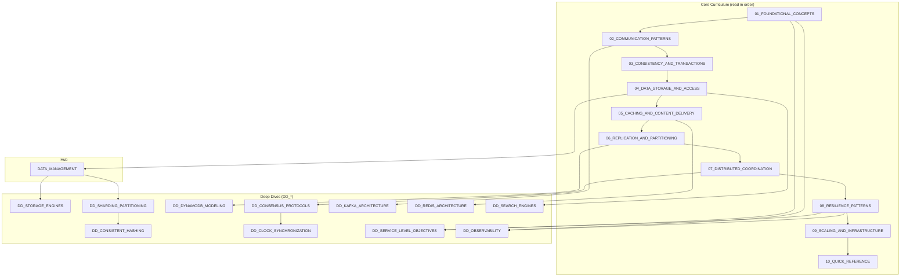

# System Design Interview Handbook

> Senior-level preparation for system design interviews. Trade-off focused, interview-ready.

---

## Core Principle

```
In system design, there are no perfect solutions—only trade-offs aligned with requirements.
```

---

## Quick Start

| Goal | Start Here |
|------|------------|
| **First time** | [01_FOUNDATIONAL_CONCEPTS](./01_FOUNDATIONAL_CONCEPTS.md) |
| **Interview tomorrow** | [10_QUICK_REFERENCE](./10_QUICK_REFERENCE.md) |
| **Deep-dive on topic** | See Document Map below |

---

## Document Map



---

## Document Index

### Core Curriculum

| # | Document | Topic | Key Question |
|---|----------|-------|--------------|
| 01 | [FOUNDATIONAL_CONCEPTS](./01_FOUNDATIONAL_CONCEPTS.md) | Scalability, CAP, Latency, Queuing Theory | "What properties am I optimizing for?" |
| 02 | [COMMUNICATION_PATTERNS](./02_COMMUNICATION_PATTERNS.md) | REST, gRPC, Kafka, WebSockets | "How do components communicate?" |
| 03 | [CONSISTENCY_AND_TRANSACTIONS](./03_CONSISTENCY_AND_TRANSACTIONS.md) | ACID, Isolation, Linearizability, 2PC | "How consistent must my data be?" |
| 04 | [DATA_STORAGE_AND_ACCESS](./04_DATA_STORAGE_AND_ACCESS.md) | SQL vs NoSQL, Indexing, NewSQL | "How do I store and query data?" |
| 05 | [CACHING_AND_CONTENT_DELIVERY](./05_CACHING_AND_CONTENT_DELIVERY.md) | Cache Strategies, CDN, Bloom Filters | "Where and how should I cache?" |
| 06 | [REPLICATION_AND_PARTITIONING](./06_REPLICATION_AND_PARTITIONING.md) | Replication, Event Sourcing, CQRS, CDC | "How do I replicate and partition data?" |
| 07 | [DISTRIBUTED_COORDINATION](./07_DISTRIBUTED_COORDINATION.md) | Distributed Locking, Sagas, 2PC | "How do I coordinate distributed state?" |
| 08 | [RESILIENCE_PATTERNS](./08_RESILIENCE_PATTERNS.md) | Circuit Breaker, Rate Limiting, Backpressure | "How do I handle failures gracefully?" |
| 09 | [SCALING_AND_INFRASTRUCTURE](./09_SCALING_AND_INFRASTRUCTURE.md) | Load Balancing, Auto-Scaling, HA | "How do I scale and protect the system?" |
| 10 | [QUICK_REFERENCE](./10_QUICK_REFERENCE.md) | Latency Numbers, Formulas, Checklists | "What do I need to know for interviews?" |

### Deep Dives (DD_*)

| Document | Topic | When to Read |
|----------|-------|--------------|
| [DATA_MANAGEMENT](./DATA_MANAGEMENT.md) | Hub: Storage decisions framework | After 04, before deep dives |
| [DD_STORAGE_ENGINES](./DD_STORAGE_ENGINES.md) | B-Tree vs LSM, WAL, Compaction | Need to discuss storage internals |
| [DD_SHARDING_PARTITIONING](./DD_SHARDING_PARTITIONING.md) | Range, Hash, Consistent, Directory | Designing for horizontal scale |
| [DD_CONSISTENT_HASHING](./DD_CONSISTENT_HASHING.md) | Ring, Jump, Maglev, Bounded Load | Load balancers, distributed caches |
| [DD_DYNAMODB_MODELING](./DD_DYNAMODB_MODELING.md) | Partition Keys, Sort Keys, GSIs, Access Patterns | DynamoDB data modeling |
| [DD_CONSENSUS_PROTOCOLS](./DD_CONSENSUS_PROTOCOLS.md) | Paxos, Raft, Zab | CP systems, leader election |
| [DD_CLOCK_SYNCHRONIZATION](./DD_CLOCK_SYNCHRONIZATION.md) | Lamport, Vector, HLC, TrueTime | Ordering, causality, timestamps |
| [DD_SERVICE_LEVEL_OBJECTIVES](./DD_SERVICE_LEVEL_OBJECTIVES.md) | SLOs, SLIs, SLAs, Error Budgets | Availability targets, production readiness |
| [DD_OBSERVABILITY](./DD_OBSERVABILITY.md) | Four Golden Signals, Monitoring, Tracing | System health, debugging at scale |
| [DD_KAFKA_ARCHITECTURE](./DD_KAFKA_ARCHITECTURE.md) | Partitions, Consumer Groups, Exactly-Once | Event streaming, async messaging |
| [DD_REDIS_ARCHITECTURE](./DD_REDIS_ARCHITECTURE.md) | Data Structures, Clustering, Persistence | Caching, session storage, rate limiting |
| [DD_SEARCH_ENGINES](./DD_SEARCH_ENGINES.md) | Inverted Index, BM25, Elasticsearch | Full-text search, log analytics |

---

## Key Trade-Offs

| If You Need... | Choose... | Accept... |
|----------------|-----------|-----------|
| Strong consistency | Sync replication, single leader | Higher latency, lower availability |
| High availability | Eventual consistency, multi-leader | Staleness, conflict resolution |
| Low latency | Caching, CDN, read replicas | Staleness, invalidation complexity |
| High throughput | Async processing, sharding | Complexity, eventual consistency |
| Simplicity | Monolith, SQL, sync calls | Scaling limits |
| Flexibility | Microservices, NoSQL, events | Operational complexity |

---

## Interview Navigation

| When Asked About... | Start Here | Then Read |
|---------------------|------------|-----------|
| Scale to millions of users | 01 (scaling) | 09 → DD_SHARDING |
| Database selection | 04 | DATA_MANAGEMENT |
| Data consistency | 03 | DD_CONSENSUS |
| Real-time features | 02 | 06 (patterns) |
| Caching strategy | 05 | 04 (storage) |
| Handling failures | 08 | DD_DYNAMO |
| Rate limiting | 08 | 09 (scaling) |
| SLOs and availability | 01 (availability) | DD_SERVICE_LEVEL_OBJECTIVES |
| Monitoring at scale | 01 (observability) | DD_OBSERVABILITY |
| Message queues / Kafka | 02 (async) | DD_KAFKA_ARCHITECTURE |
| Caching / Redis | 05 (caching) | DD_REDIS_ARCHITECTURE |
| Search / Elasticsearch | 04 (storage) | DD_SEARCH_ENGINES |

---

## Version History

| Version | Date | Changes |
|---------|------|---------|
| 3.2 | 2025-01 | High-frequency deep-dives: DD_KAFKA_ARCHITECTURE, DD_REDIS_ARCHITECTURE, DD_SEARCH_ENGINES (~174K content) |
| 3.1 | 2025-01 | SRE enhancement: Added DD_SERVICE_LEVEL_OBJECTIVES, DD_OBSERVABILITY; SRE references throughout |
| 3.0 | 2025-01 | Major restructure: 10 core documents, content reorganized for progressive learning |
| 2.2 | 2025-01 | Deep dives renamed with DD_ prefix; README streamlined |
| 2.0 | 2025-01 | 7 deep-dive documents added (~150K content) |
| 1.0 | 2025-01 | Initial handbook with 9 core documents |
