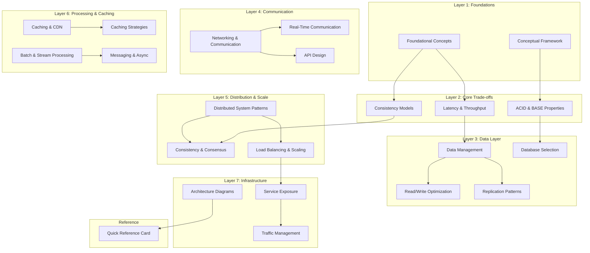
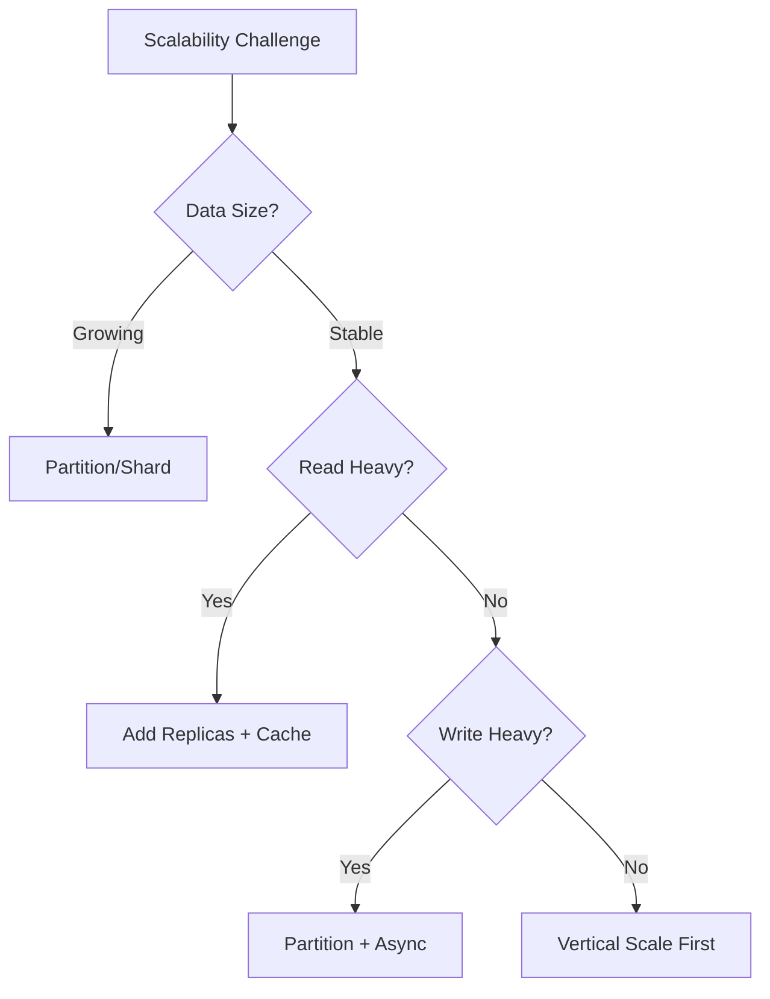
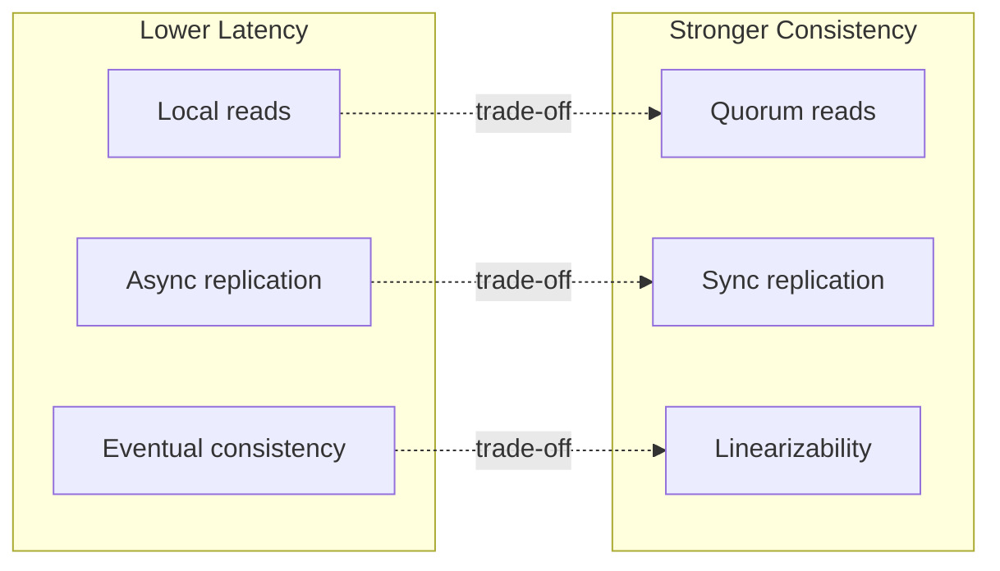

# System Design Interview Handbook

> A comprehensive, interview-ready reference for Senior-level System Design preparation.

## Purpose and Philosophy

This handbook distills distributed systems knowledge into a reviewable, progressively structured format designed for:

- **Systematic study** — concepts build upon each other with explicit cross-references
- **Interview rehearsal** — each topic includes trade-off analysis and articulation prompts
- **Quick reference** — diagrams encode invariants; tables summarize decision criteria

> **CORE PRINCIPLE**
> 
> Every design decision is a trade-off. This handbook does not prescribe "correct" architectures—it equips you to reason about constraints, articulate trade-offs, and defend decisions under pressure.

---

## Non-Goals

This handbook intentionally does **not**:

- Provide "model answers" or memorizable architectures—reasoning matters more than recall
- Replace live practice, mock interviews, or whiteboard sessions
- Catalog tools, vendors, or technology choices—trade-off axes outlast product names
- Teach distributed systems from first principles—assumes working engineering experience
- Offer step-by-step walkthroughs for specific systems (design a URL shortener, etc.)
- Substitute for hands-on implementation experience

---

## How to Use This Handbook

### Before Deep Study
Start with [Foundational Concepts](./FOUNDATIONAL_CONCEPTS.md) to establish the vocabulary and mental models that recur throughout distributed systems.

### During Preparation
Work through modules thematically. Each document is self-contained but references related concepts. Pay attention to:
- **Trade-off Tables** — memorize the axes of comparison
- **Mermaid Diagrams** — reconstruct them from memory as practice
- **Interview Prompts** — practice articulating decisions aloud

### Before an Interview
Review the [Quick Reference Card](./QUICK_REFERENCE_CARD.md) and practice back-of-envelope calculations.

---

## Document Map



---

## Module Overview

| Module | Core Topics | Key Trade-offs |
|--------|-------------|----------------|
| [Foundational Concepts](./FOUNDATIONAL_CONCEPTS.md) | Scalability, Availability, Reliability, Efficiency, CAP/PACELC | Consistency vs Availability, Latency vs Throughput |
| [Conceptual Framework](./CONCEPTUAL_FRAMEWORK.md) | Mental models, abstraction layers, system boundaries | Simplicity vs Flexibility |
| [Latency & Throughput](./LATENCY_AND_THROUGHPUT.md) | P99 latency, bandwidth, bottleneck analysis | Latency vs Throughput optimization |
| [Consistency Models](./CONSISTENCY_MODELS.md) | Linearizability, Sequential, Causal, Eventual | Correctness vs Performance |
| [ACID & BASE Properties](./ACID_AND_BASE_PROPERTIES.md) | Transaction guarantees, isolation levels | Strong guarantees vs Scalability |
| [Data Management](./DATA_MANAGEMENT.md) | SQL vs NoSQL, Indexing, Partitioning/Sharding | Normalization vs Denormalization |
| [Database Selection](./DATABASE_SELECTION.md) | Relational, Document, Key-Value, Graph, Time-Series | Query patterns vs Scale requirements |
| [Read/Write Optimization](./READ_WRITE_OPTIMIZATION.md) | CQRS, Read replicas, Write-ahead logging | Read vs Write optimization |
| [Replication Patterns](./REPLICATION_PATTERNS.md) | Single-leader, Multi-leader, Leaderless | Consistency vs Availability vs Latency |
| [Networking & Communication](./NETWORKING_AND_COMMUNICATION.md) | HTTP/HTTPS, DNS, Proxies, TCP/UDP | Reliability vs Performance |
| [Real-Time Communication](./REAL_TIME_COMMUNICATION.md) | WebSockets, SSE, Long-Polling, gRPC streaming | Real-time vs Polling overhead |
| [API Design](./API_DESIGN.md) | REST, GraphQL, gRPC, versioning, pagination | Flexibility vs Simplicity |
| [Distributed System Patterns](./DISTRIBUTED_SYSTEM_PATTERNS.md) | Leader Election, Quorum, Heartbeat, Consistent Hashing | Coordination overhead vs Fault tolerance |
| [Consistency & Consensus](./CONSISTENCY_AND_CONCENSUS.md) | Paxos, Raft, Vector clocks, Conflict resolution | Safety vs Liveness |
| [Load Balancing & Scaling](./LOAD_BALANCING_AND_SCALING.md) | LB algorithms, Horizontal/Vertical scaling | Stateful vs Stateless |
| [Caching & CDN](./CACHING_AND_CDN.md) | Cache tiers, CDN architecture, Edge computing | Freshness vs Performance |
| [Caching Strategies](./CACHING_STRATEGIES.md) | Cache-aside, Write-through, Write-back, TTL policies | Consistency vs Hit rate |
| [Batch & Stream Processing](./BATCH_AND_STREAM_PROCESSING.md) | Lambda/Kappa architecture, windowing, exactly-once | Latency vs Completeness |
| [Messaging & Async](./MESSAGING_AND_SYNCHRONOUS_PROCESSING.md) | Message Queues, Pub/Sub, backpressure | Delivery guarantees vs Throughput |
| [Service Exposure](./SERVICE_EXPOSURE.md) | API Gateway, Service Mesh, BFF pattern | Abstraction vs Complexity |
| [Traffic Management](./TRAFFIC_MANAGEMENT.md) | Rate limiting, Circuit breakers, Bulkheads | Protection vs Availability |
| [Architecture Diagrams](./ARCHITECTURE_DIAGRAMS.md) | End-to-end examples, reference architectures | — |
| [Quick Reference](./QUICK_REFERENCE_CARD.md) | Estimation formulas, Latency numbers, Decision trees | — |

---

## The Five-Question Trade-Off Lens

Every design decision in this handbook can be interrogated through five questions. This framework—the **Five-Question Trade-Off Lens**—provides a consistent structure for evaluating alternatives during interviews:

| Question | What It Reveals |
|----------|-----------------|
| **1. What are we optimizing for?** | Primary constraint (latency, throughput, cost, correctness) |
| **2. What are we willing to sacrifice?** | Explicit trade-off acknowledgment |
| **3. Under what conditions does this break?** | Failure modes and edge cases |
| **4. What would we change at 10× scale?** | Scalability limits and evolution path |
| **5. How do we know it's working?** | Observability, metrics, operational concerns |

Use the Five-Question Trade-Off Lens when defending any architectural choice. Interviewers expect you to volunteer trade-offs, not wait to be challenged.

---

## Conceptual Threads

Conceptual threads are **navigation tools for live interviews**. When an interviewer probes deeper or pivots to a related topic, threads show you how concepts connect—enabling you to deepen your current answer or bridge to adjacent domains without losing coherence.

These concepts appear across multiple modules. Understanding them deeply is essential:

### The Consistency Spectrum
```
Strong ←————————————————————————————→ Eventual
Consistency                          Consistency

- Single leader sync             - Multi-leader async
- Linearizable reads             - Read-your-writes
- Higher latency                 - Lower latency
- Lower availability             - Higher availability
```

**Thread connections:** [Consistency Models](./CONSISTENCY_MODELS.md) → [Replication Patterns](./REPLICATION_PATTERNS.md) → [Consistency & Consensus](./CONSISTENCY_AND_CONCENSUS.md)

### The Scalability Decision Tree


**Thread connections:** [Data Management](./DATA_MANAGEMENT.md) → [Load Balancing & Scaling](./LOAD_BALANCING_AND_SCALING.md) → [Caching Strategies](./CACHING_STRATEGIES.md)

### The Latency-Consistency Trade-off


**Thread connections:** [Latency & Throughput](./LATENCY_AND_THROUGHPUT.md) → [Consistency Models](./CONSISTENCY_MODELS.md) → [Distributed System Patterns](./DISTRIBUTED_SYSTEM_PATTERNS.md)

### Trade-off Vocabulary

When articulating design decisions, use these frames:

| Frame | Example |
|-------|---------|
| "We trade X for Y" | "We trade consistency for availability by using eventual consistency" |
| "This optimizes for X at the cost of Y" | "This optimizes for read latency at the cost of write complexity" |
| "The constraint here is X, so we choose Y" | "The constraint is sub-100ms latency, so we choose in-memory caching" |

---

## Interview Navigation Guide

### By Problem Type

| Problem Type | Start With | Then Explore | Key Modules |
|--------------|------------|--------------|-------------|
| High-throughput ingestion | Partitioning strategy | Async processing, backpressure | Data Management, Messaging & Async |
| Low-latency reads | Caching layers | Replication, denormalization | Caching Strategies, Read/Write Optimization |
| Strong consistency needs | Consensus requirements | Leader election, quorum | Consistency & Consensus, Distributed Patterns |
| Global distribution | Replication topology | Conflict resolution, latency trade-offs | Replication Patterns, Consistency Models |
| Real-time features | Push vs pull | Connection management, fan-out | Real-Time Communication, Messaging & Async |

### By Component Under Discussion

| Component | Key Trade-offs | Relevant Modules |
|-----------|---------------|------------------|
| Database | SQL vs NoSQL, Partitioning strategy | Database Selection, Data Management |
| Cache | Invalidation strategy, Consistency | Caching Strategies, Caching & CDN |
| Message Queue | Delivery guarantees, Ordering | Messaging & Async, Batch & Stream |
| Load Balancer | L4 vs L7, Session affinity | Load Balancing & Scaling, Traffic Management |
| API Layer | REST vs gRPC, Versioning | API Design, Service Exposure |

---

## The 45-Minute Interview Model

Most system design interviews follow this structure. Use it to pace yourself and ensure coverage:

| Phase | Duration | Focus | Handbook Support |
|-------|----------|-------|------------------|
| **Requirements & Constraints** | 5–7 min | Functional requirements, scale estimates, non-functional priorities | Quick Reference (estimation), Foundational Concepts |
| **High-Level Design** | 10–15 min | Core components, data flow, API surface | Architecture Diagrams, API Design, Conceptual Framework |
| **Deep Dives** | 15–20 min | 2–3 components in detail, interviewer-guided | Module-specific (Database, Caching, Messaging, etc.) |
| **Trade-offs & Alternatives** | 5–10 min | Bottlenecks, failure modes, evolution path | Five-Question Trade-Off Lens, Conceptual Threads |

**Calibration:** If you're past 10 minutes without a high-level diagram, you've spent too long on requirements. If you're defending your first decision at 30 minutes, you won't have time for meaningful trade-off discussion.

---

## Study Methodology

### Phase 1: Foundation (Week 1–2)
- Complete [Foundational Concepts](./FOUNDATIONAL_CONCEPTS.md) and [Conceptual Framework](./CONCEPTUAL_FRAMEWORK.md)
- Internalize the Five-Question Trade-Off Lens
- Practice explaining CAP/PACELC without notes

### Phase 2: Building Blocks (Week 3–4)
- Work through Layer 3 (Data) and Layer 4 (Communication) modules
- For each module: reconstruct one diagram from memory, articulate two trade-offs aloud
- Cross-reference Conceptual Threads to see connections

### Phase 3: Distribution Patterns (Week 5–6)
- Focus on Layer 5 (Distribution & Scale) and Layer 6 (Processing & Caching)
- Practice the Interview Navigation Guide lookups under time pressure
- Identify your weak areas; revisit relevant modules

### Phase 4: Integration (Week 7–8)
- Review [Architecture Diagrams](./ARCHITECTURE_DIAGRAMS.md) for end-to-end examples
- Run timed mock interviews using the 45-Minute Interview Model
- Use Quick Reference Card for rapid estimation practice

### Phase 5: Pre-Interview (Final Days)
- Quick Reference Card review
- Trade-off vocabulary rehearsal
- Five-Question Trade-Off Lens dry runs on unfamiliar problems

---

## Interview Articulation Patterns

### Opening a Design Discussion
1. **Clarify requirements** — functional and non-functional
2. **Establish constraints** — scale, latency, consistency needs
3. **State assumptions** — user behavior, traffic patterns
4. **Propose high-level approach** — name the architectural style

### Defending a Decision
```
"I chose [COMPONENT] because:
 1. Our requirement for [PROPERTY] rules out [ALTERNATIVE]
 2. The trade-off of [COST] is acceptable given [CONSTRAINT]
 3. This aligns with how [REAL SYSTEM] solves similar problems"
```

### Acknowledging Limitations
```
"The weakness of this approach is [LIMITATION].
 To mitigate this, we could [MITIGATION].
 Alternatively, if [CONDITION] changes, we'd revisit [DECISION]."
```

---

## Concrete Examples

For end-to-end reference architectures and worked examples that apply these concepts, see [Architecture Diagrams](./ARCHITECTURE_DIAGRAMS.md).

---

## Revision History

| Date | Change |
|------|--------|
| 2025-01 | Initial handbook creation |
| 2025-01 | Added Non-Goals, named Five-Question Trade-Off Lens, explicit interview time model |

---

*Navigate to individual modules using the links above, or start with [Foundational Concepts](./FOUNDATIONAL_CONCEPTS.md).*
