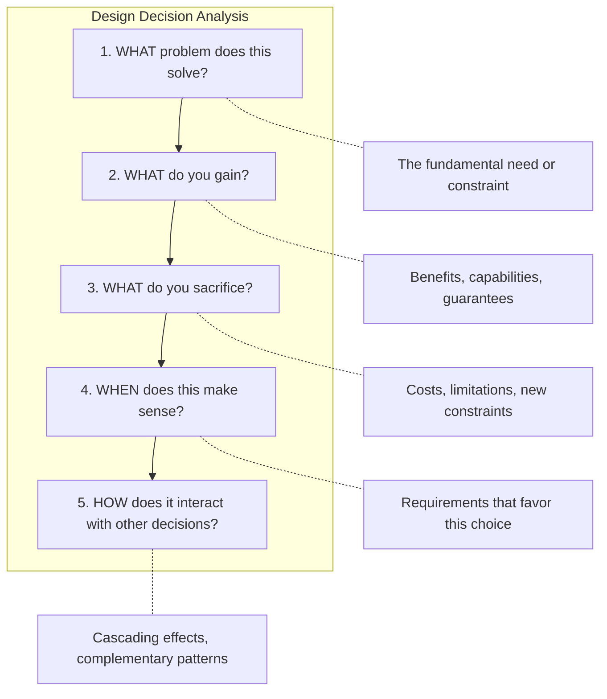
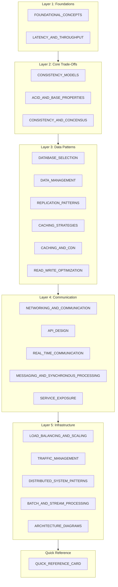
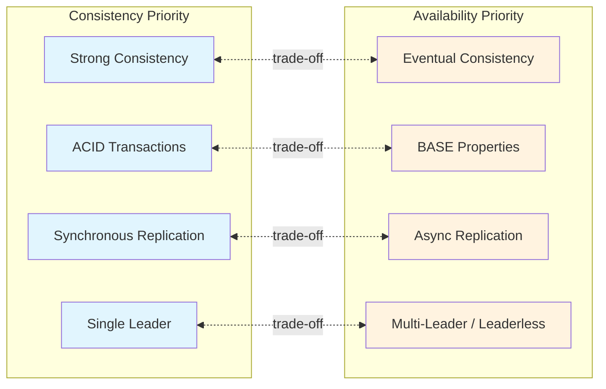
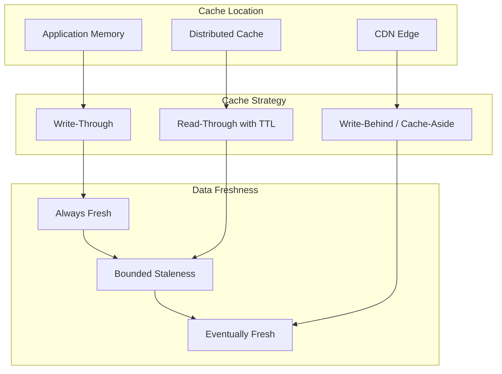
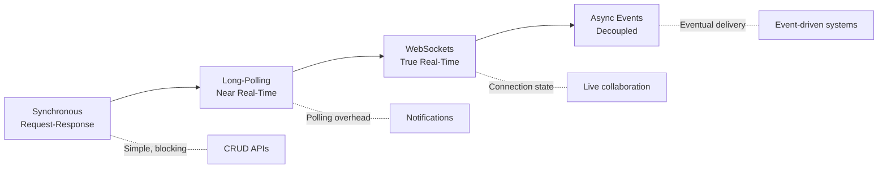
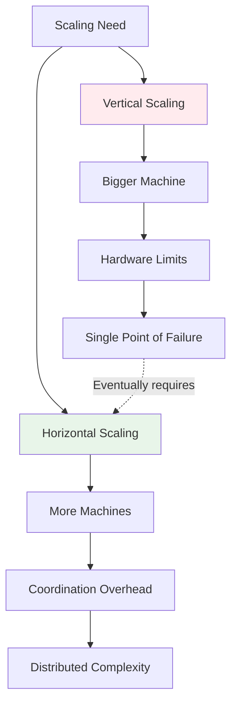
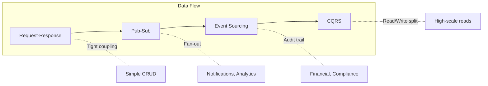

# 00 — System Design Interview Handbook: Index & Framework

> The master navigation document and conceptual framework for Senior-level System Design preparation.

---

## Purpose and Philosophy

This handbook is a structured, interview-ready reference designed for repeated study over time. Every concept connects to others through explicit trade-offs, and each document follows consistent patterns that support both deep understanding and rapid review.

```
┌─────────────────────────────────────────────────────────────────────────┐
│                         CORE PRINCIPLE                                   │
│                                                                          │
│   In system design, there are no perfect solutions—only trade-offs       │
│   aligned with requirements. The goal is not to memorize answers,        │
│   but to develop a systematic framework for reasoning about design       │
│   decisions under constraints.                                           │
│                                                                          │
└─────────────────────────────────────────────────────────────────────────┘
```

---

## The Design Decision Framework

Every design decision in this handbook is analyzed through a consistent five-question lens:



Use this framework when:
- Evaluating any design pattern or technology
- Defending your decisions in interviews
- Comparing alternative approaches

---

## Document Architecture

### Consistent Section Structure

Each document in this handbook follows a consistent structure for reviewability:

| Section | Purpose | Study Approach |
|---------|---------|----------------|
| **Concept Overview** | What it is, why it matters | Read first for context |
| **Mental Model** | Intuitive understanding, analogies | Memorize the core metaphor |
| **Technical Deep-Dive** | How it works mechanically | Understand mechanisms |
| **Trade-Off Analysis** | Gains vs. sacrifices, decision criteria | **Memorize these tables** |
| **Mermaid Diagrams** | Visual system invariants | Reconstruct from memory |
| **Interview Patterns** | How to discuss, common follow-ups | Practice articulating aloud |
| **Connections** | Links to related concepts | Build your mental graph |

### Visual Encoding Conventions

Diagrams in this handbook encode specific design decisions—they are not decorative:

| Diagram Type | Encodes | Example Use |
|--------------|---------|-------------|
| **Flowchart** | Decision trees, process flows | Choosing database type |
| **Sequence** | Temporal interactions, protocols | Request lifecycle |
| **Graph** | Relationships, dependencies | Component interactions |
| **State Machine** | System states, transitions | Connection lifecycle |

---

## Complete Document Map



---

## Complete Document Index

### Layer 1: Foundations
*The vocabulary and mental models that recur throughout distributed systems*

| Document | Core Topic | Key Trade-Off | Primary Question |
|----------|-----------|---------------|------------------|
| [FOUNDATIONAL_CONCEPTS](./01_FOUNDATIONAL_CONCEPTS.md) | Scalability, Availability, Reliability, Efficiency | Simplicity vs. Scale | "What properties am I optimizing for?" |
| [LATENCY_AND_THROUGHPUT](./01_FOUNDATIONAL_CONCEPTS.md) | Performance metrics, optimization strategies | Speed vs. Volume | "Do I optimize for individual requests or total capacity?" |

### Layer 2: Core Trade-Offs
*The fundamental tensions that shape all distributed system design*

| Document | Core Topic | Key Trade-Off | Primary Question |
|----------|-----------|---------------|------------------|
| [CONSISTENCY_MODELS](./02_CONSISTENCY_AND_TRANSACTIONS.md) | Strong vs. Eventual consistency | Correctness vs. Availability | "Can my users see stale data?" |
| [ACID_AND_BASE_PROPERTIES](./02_CONSISTENCY_AND_TRANSACTIONS.md) | Transaction guarantees | Integrity vs. Scale | "How critical is transactional correctness?" |
| [CONSISTENCY_AND_CONCENSUS](./02_CONSISTENCY_AND_TRANSACTIONS.md) | CAP, PACELC, consensus algorithms | Consistency vs. Partition tolerance | "What happens during network failures?" |

### Layer 3: Data Patterns
*How data is stored, cached, replicated, and accessed*

| Document | Core Topic | Key Trade-Off | Primary Question |
|----------|-----------|---------------|------------------|
| [DATABASE_SELECTION](./03_DATA_STORAGE_AND_ACCESS.md) | SQL vs. NoSQL decision framework | Structure vs. Flexibility | "Do I know my data schema upfront?" |
| [DATA_MANAGEMENT](./03_DATA_STORAGE_AND_ACCESS.md) | Indexing, normalization, sharding | Storage vs. Query speed | "How do I organize data for my access patterns?" |
| [REPLICATION_PATTERNS](./06_DISTRIBUTED_SYSTEM_PATTERNS.md) | Leader-follower, multi-leader, leaderless | Consistency vs. Availability | "How should data flow between nodes?" |
| [CACHING_STRATEGIES](./04_CACHING_AND_CONTENT_DELIVERY.md) | Cache-aside, write-through, write-behind | Freshness vs. Speed | "How stale can my cached data be?" |
| [CACHING_AND_CDN](./04_CACHING_AND_CONTENT_DELIVERY.md) | CDN architecture, edge caching | Latency vs. Consistency | "Where should I cache content?" |
| [READ_WRITE_OPTIMIZATION](./08_WORKLOAD_OPTIMIZATION.md) | CQRS, event sourcing, read replicas | Read speed vs. Write speed | "Is my system read-heavy or write-heavy?" |

### Layer 4: Communication Patterns
*How components and services communicate*

| Document | Core Topic | Key Trade-Off | Primary Question |
|----------|-----------|---------------|------------------|
| [NETWORKING_AND_COMMUNICATION](./05_COMMUNICATION_PATTERNS.md) | HTTP, DNS, proxies, protocols | Simplicity vs. Control | "What networking primitives do I need?" |
| [API_DESIGN](./05_COMMUNICATION_PATTERNS.md) | REST, GraphQL, gRPC, webhooks | Simplicity vs. Flexibility | "How should clients interact with my system?" |
| [REAL_TIME_COMMUNICATION](./05_COMMUNICATION_PATTERNS.md) | WebSockets, SSE, long-polling | Immediacy vs. Resources | "How instant do updates need to be?" |
| [MESSAGING_AND_SYNCHRONOUS_PROCESSING](./05_COMMUNICATION_PATTERNS.md) | Message queues, pub/sub, event-driven | Coupling vs. Latency | "Should communication be sync or async?" |
| [SERVICE_EXPOSURE](./07_SCALING_AND_INFRASTRUCTURE.md) | API Gateway, service mesh, direct | Abstraction vs. Latency | "How do I expose services externally?" |

### Layer 5: Infrastructure Patterns
*Deployment, scaling, and traffic management*

| Document | Core Topic | Key Trade-Off | Primary Question |
|----------|-----------|---------------|------------------|
| [LOAD_BALANCING_AND_SCALING](./07_SCALING_AND_INFRASTRUCTURE.md) | LB algorithms, horizontal/vertical scaling | Complexity vs. Capacity | "How do I distribute load?" |
| [TRAFFIC_MANAGEMENT](./07_SCALING_AND_INFRASTRUCTURE.md) | Rate limiting, circuit breakers, backpressure | Fairness vs. Throughput | "How do I protect my system from overload?" |
| [DISTRIBUTED_SYSTEM_PATTERNS](./06_DISTRIBUTED_SYSTEM_PATTERNS.md) | Consistent hashing, leader election, quorums | Various | "What patterns solve distributed coordination?" |
| [BATCH_AND_STREAM_PROCESSING](./08_WORKLOAD_OPTIMIZATION.md) | MapReduce, Kafka, Flink, Lambda architecture | Latency vs. Efficiency | "Do I need real-time or can I batch?" |
| ARCHITECTURE_DIAGRAMS | Reference architectures, system blueprints | — | "What do complete systems look like?" |

### Quick Reference

| Document | Purpose |
|----------|---------|
| [QUICK_REFERENCE_CARD](./09_QUICK_REFERENCE.md) | Estimation formulas, latency numbers, decision trees for rapid review |

---

## Conceptual Threads

These major themes weave through multiple documents. Understanding them creates the connective tissue for interview discussions.

### Thread 1: The Consistency-Availability Spectrum



**Documents**: CONSISTENCY_MODELS → ACID_AND_BASE_PROPERTIES → CONSISTENCY_AND_CONCENSUS → REPLICATION_PATTERNS

**Key Insight**: Choosing strong consistency implicitly means accepting potential unavailability during partitions and higher latency. Choosing availability means designing for temporary inconsistency.

---

### Thread 2: The Caching Continuum



**Documents**: CACHING_STRATEGIES → CACHING_AND_CDN → READ_WRITE_OPTIMIZATION

**Key Insight**: Every caching decision is a bet on access patterns and staleness tolerance. The farther from the origin, the staler but faster.

---

### Thread 3: The Synchronicity Spectrum



**Documents**: API_DESIGN → REAL_TIME_COMMUNICATION → MESSAGING_AND_SYNCHRONOUS_PROCESSING

**Key Insight**: Moving toward async adds complexity but enables better resource utilization, fault tolerance, and scalability.

---

### Thread 4: The Scaling Axes



**Documents**: FOUNDATIONAL_CONCEPTS → LOAD_BALANCING_AND_SCALING → DATA_MANAGEMENT (sharding) → DISTRIBUTED_SYSTEM_PATTERNS

**Key Insight**: Vertical scaling is simpler but has ceilings. Horizontal scaling enables true scale but requires solving distributed systems challenges.

---

### Thread 5: Data Flow Patterns



**Documents**: API_DESIGN → MESSAGING_AND_SYNCHRONOUS_PROCESSING → READ_WRITE_OPTIMIZATION → BATCH_AND_STREAM_PROCESSING

**Key Insight**: As systems grow, separating read and write paths and embracing event-driven patterns often becomes necessary.

---

## Interview Navigation Guide

### Common Interview Questions → Document Path

| When Asked About... | Start Here | Then Connect To |
|---------------------|------------|-----------------|
| "How would you handle millions of users?" | FOUNDATIONAL_CONCEPTS (scaling) | LOAD_BALANCING_AND_SCALING → DATA_MANAGEMENT (sharding) → CACHING_AND_CDN |
| "What database would you use?" | DATABASE_SELECTION | CONSISTENCY_MODELS → DATA_MANAGEMENT |
| "How do you ensure data consistency?" | CONSISTENCY_MODELS | ACID_AND_BASE_PROPERTIES → REPLICATION_PATTERNS |
| "How would you make this real-time?" | REAL_TIME_COMMUNICATION | MESSAGING_AND_SYNCHRONOUS_PROCESSING → API_DESIGN |
| "What about caching?" | CACHING_STRATEGIES | CACHING_AND_CDN → CONSISTENCY_MODELS |
| "How do you handle failures?" | DISTRIBUTED_SYSTEM_PATTERNS | REPLICATION_PATTERNS → TRAFFIC_MANAGEMENT |
| "Design a rate limiter" | TRAFFIC_MANAGEMENT | DISTRIBUTED_SYSTEM_PATTERNS → CACHING_STRATEGIES |
| "How do services communicate?" | API_DESIGN | SERVICE_EXPOSURE → MESSAGING_AND_SYNCHRONOUS_PROCESSING |
| "How do you process large data sets?" | BATCH_AND_STREAM_PROCESSING | READ_WRITE_OPTIMIZATION → DATA_MANAGEMENT |

### The Five Questions to Always Clarify

Before diving into any design problem, establish:

```
┌─────────────────────────────────────────────────────────────────────────┐
│                    REQUIREMENTS CLARIFICATION                            │
│                                                                          │
│  1. SCALE: How many users? Requests/second? Data volume?                │
│  2. CONSISTENCY: Can users see stale data? For how long?                │
│  3. LATENCY: What's the acceptable response time? (p50, p99)            │
│  4. AVAILABILITY: What's the uptime requirement? (nines)                │
│  5. ACCESS PATTERN: Read-heavy? Write-heavy? Both? Bursty?              │
│                                                                          │
└─────────────────────────────────────────────────────────────────────────┘
```

---

## Study Methodology

### Phase 1: Foundation Building (Week 1-2)

**Goal**: Establish vocabulary and core mental models

1. Read **FOUNDATIONAL_CONCEPTS** thoroughly
2. Master the CAP theorem via **CONSISTENCY_AND_CONCENSUS**
3. Understand **LATENCY_AND_THROUGHPUT** metrics
4. Practice back-of-envelope calculations from **QUICK_REFERENCE_CARD**

**Checkpoint**: Can you explain CAP, availability nines, and calculate QPS from scratch?

### Phase 2: Pattern Mastery (Week 3-4)

**Goal**: Internalize design patterns and their trade-offs

1. Work through data layer: DATABASE_SELECTION → DATA_MANAGEMENT → CACHING_STRATEGIES
2. Study communication: API_DESIGN → REAL_TIME_COMMUNICATION
3. Learn scaling: LOAD_BALANCING_AND_SCALING → DISTRIBUTED_SYSTEM_PATTERNS

**Practice Method**:
- Read each document's trade-off tables
- Close the document
- Redraw the mermaid diagrams from memory
- Articulate trade-offs aloud in 30 seconds

**Checkpoint**: For each pattern, can you explain when to use it and what you sacrifice?

### Phase 3: System Synthesis (Week 5-6)

**Goal**: Connect patterns into complete system designs

1. Study **ARCHITECTURE_DIAGRAMS** reference architectures
2. Practice end-to-end designs using the Interview Navigation Guide
3. Walk through real systems (Twitter, Uber, Netflix) using handbook concepts

**Practice Method**:
- Pick a system design problem
- Set a 35-minute timer
- Design using handbook patterns
- Review against documented trade-offs

**Checkpoint**: Can you design a complete system in 35 minutes while articulating trade-offs?

### Phase 4: Interview Simulation (Week 7+)

**Goal**: Build fluency under interview conditions

1. Practice with a partner or record yourself
2. Time-box to 45 minutes
3. Focus on:
   - Requirements clarification (5 min)
   - High-level design (10 min)
   - Deep dive on 2-3 components (20 min)
   - Trade-offs and alternatives (10 min)

**Review Approach**:
- Before each mock: Scan relevant documents for 10 minutes
- After each mock: Identify gaps, revisit those documents
- Track patterns you struggle to articulate

---

## Quick Reference: Trade-Off Pairs

| If You Need... | Consider... | But Accept... |
|----------------|-------------|---------------|
| Strong consistency | Synchronous replication, single leader | Higher latency, lower availability |
| High availability | Eventual consistency, multi-leader | Temporary staleness, conflict resolution |
| Low latency | Caching, CDN, read replicas | Staleness, cache invalidation complexity |
| High throughput | Async processing, batching, sharding | Higher per-request latency, complexity |
| Simplicity | Monolith, SQL, polling | Scaling limitations, coupling |
| Flexibility | Microservices, NoSQL, events | Operational complexity |
| Data integrity | ACID, strong consistency, transactions | Performance overhead |
| Global scale | BASE, eventual consistency, geo-replication | Application-level conflict handling |

---

## Interview Articulation Patterns

### Opening a Design Discussion

```
"Before diving in, let me clarify a few requirements:
 - What scale are we targeting? [users, QPS, data]
 - What are the latency requirements? [p50, p99]
 - How important is consistency vs. availability?
 - What's the read/write ratio?"
```

### Defending a Decision

```
"I chose [COMPONENT/PATTERN] because:
 1. Our requirement for [PROPERTY] rules out [ALTERNATIVE]
 2. The trade-off of [COST] is acceptable given [CONSTRAINT]
 3. This aligns with how [REAL_SYSTEM] solves similar problems"
```

### Acknowledging Limitations

```
"The weakness of this approach is [LIMITATION].
 To mitigate this, we could [MITIGATION].
 Alternatively, if [CONDITION] changes, we'd revisit [DECISION]."
```

### Discussing Trade-Offs

```
"Here we're trading [X] for [Y].
 - We gain: [BENEFITS]
 - We sacrifice: [COSTS]
 - This makes sense because: [REQUIREMENT ALIGNMENT]"
```

---

## Document Dependencies

For targeted study, this table shows which documents build on others:

| Document | Prerequisites | Builds Toward |
|----------|--------------|---------------|
| FOUNDATIONAL_CONCEPTS | None | All other documents |
| CONSISTENCY_MODELS | FOUNDATIONAL_CONCEPTS | ACID_AND_BASE, REPLICATION_PATTERNS |
| DATABASE_SELECTION | CONSISTENCY_MODELS | DATA_MANAGEMENT |
| CACHING_STRATEGIES | FOUNDATIONAL_CONCEPTS | CACHING_AND_CDN |
| API_DESIGN | FOUNDATIONAL_CONCEPTS | REAL_TIME_COMMUNICATION, SERVICE_EXPOSURE |
| DISTRIBUTED_SYSTEM_PATTERNS | CONSISTENCY_AND_CONCENSUS | ARCHITECTURE_DIAGRAMS |
| BATCH_AND_STREAM_PROCESSING | DATA_MANAGEMENT | ARCHITECTURE_DIAGRAMS |

---

## Maintenance Notes

| Version | Date | Changes |
|---------|------|---------|
| 1.0 | 2025-01 | Initial handbook creation with 21 documents |

---

## Navigation

**Start Here**: [FOUNDATIONAL_CONCEPTS](./01_FOUNDATIONAL_CONCEPTS.md)
**Quick Review**: [QUICK_REFERENCE_CARD](./09_QUICK_REFERENCE.md)
**End-to-End Examples**: [README](./README.md)
