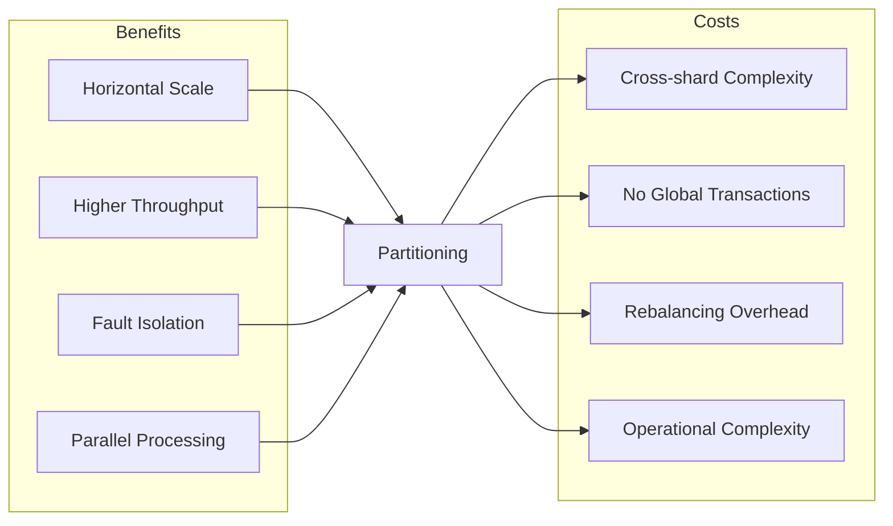
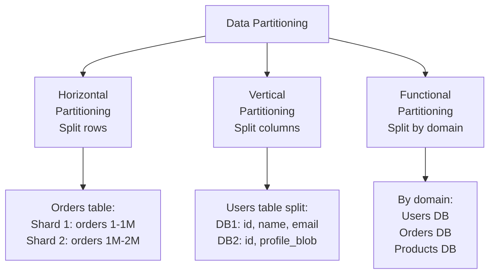
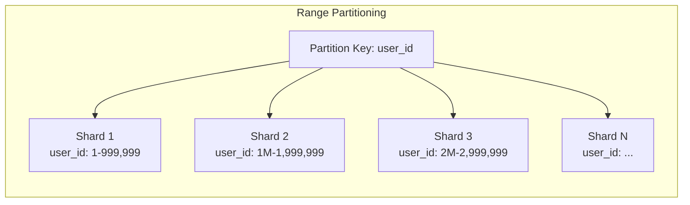
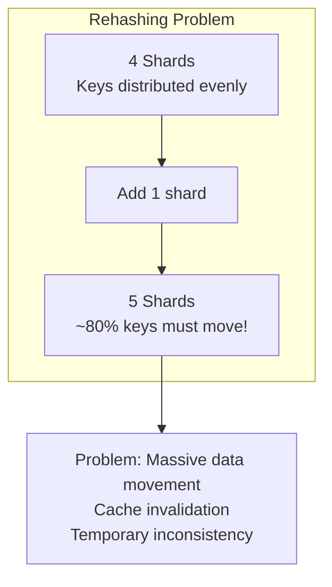
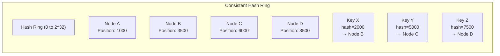
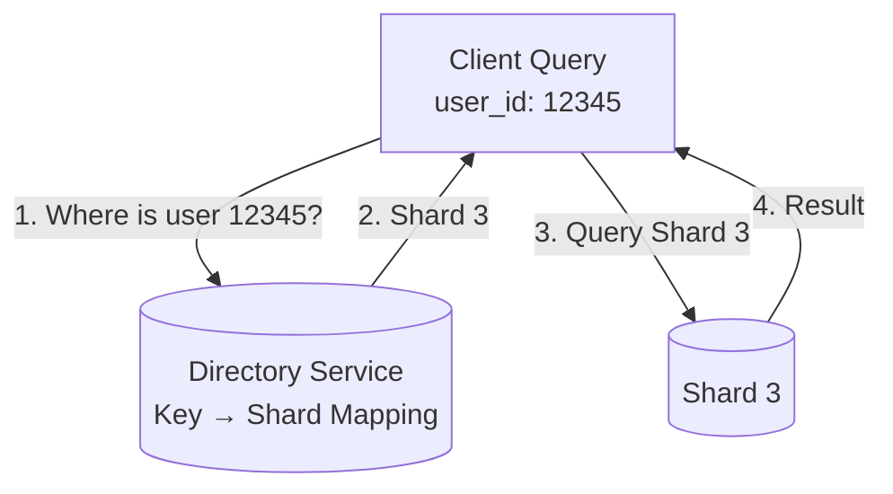
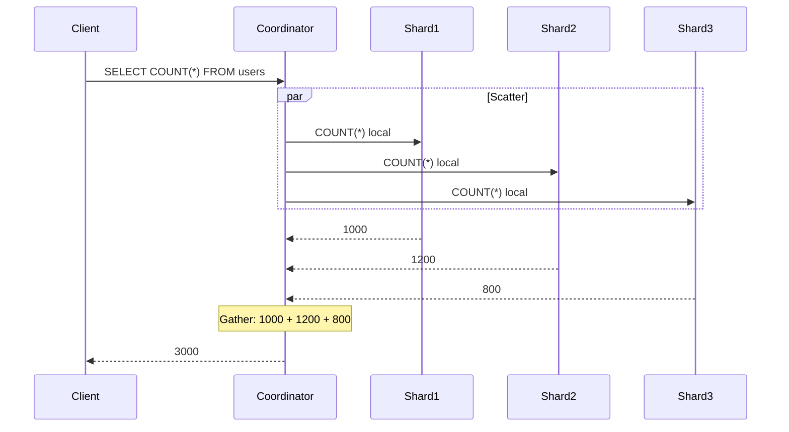
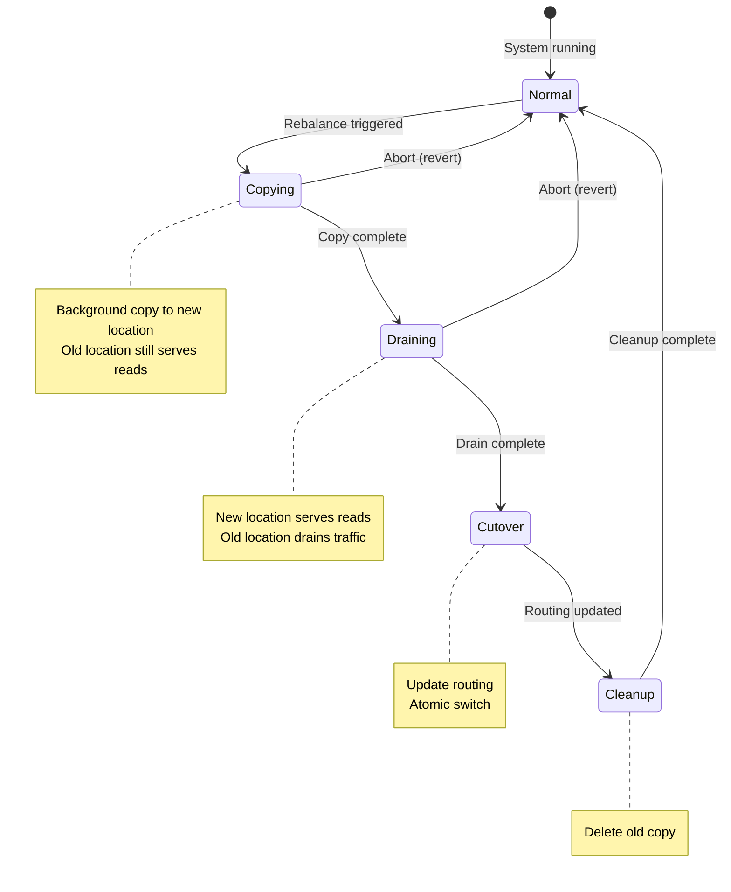
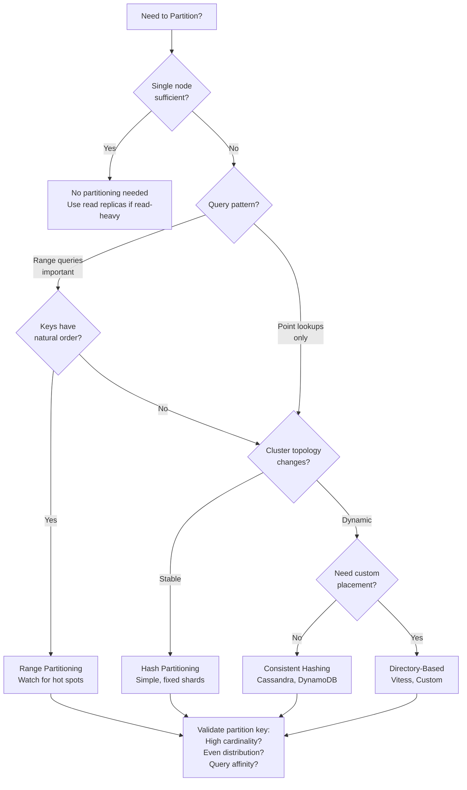

# Sharding & Partitioning — Deep Dive

> Comprehensive guide to distributing data across multiple nodes for scale and performance.

**Prerequisites:** [Data Management Overview](./DATA_MANAGEMENT.md), [Foundational Concepts](./01_FOUNDATIONAL_CONCEPTS.md)
**Related:** [Consistent Hashing](./CONSISTENT_HASHING_DEEP_DIVE.md), [Replication Patterns](./REPLICATION_PATTERNS.md) *(planned)*
**Estimated study time:** 3-4 hours

---

## Table of Contents

1. [Context & Problem Statement](#1-context--problem-statement)
2. [Partitioning Taxonomy](#2-partitioning-taxonomy)
3. [Horizontal Partitioning Strategies](#3-horizontal-partitioning-strategies)
4. [Partition Key Selection](#4-partition-key-selection)
5. [Cross-Shard Operations](#5-cross-shard-operations)
6. [Rebalancing Strategies](#6-rebalancing-strategies)
7. [Production Case Studies](#7-production-case-studies)
8. [Interview Articulation](#8-interview-articulation)
9. [Decision Framework Summary](#9-decision-framework-summary)
10. [Quick Reference Card](#10-quick-reference-card)
11. [References](#references)

---

## 1. Context & Problem Statement

### What Problem Does Partitioning Solve?

Every database hits fundamental limits:

| Limit | Typical Threshold | Symptom |
|-------|-------------------|---------|
| **Storage capacity** | 1-10 TB per node | Disk full, can't ingest |
| **Query throughput** | 10K-100K QPS | Latency spikes, timeouts |
| **Write throughput** | 10K-50K writes/sec | Write queue backlog |
| **Memory** | Available RAM | Index/buffer pool eviction |
| **CPU** | Core count | Query processing bottleneck |

**Partitioning** (also called **sharding**) distributes data across multiple nodes, allowing:
- **Horizontal storage scaling**: Each shard holds a subset of data
- **Parallel processing**: Queries can execute across shards simultaneously
- **Throughput scaling**: Write/read capacity multiplies with shard count

### When Partitioning Becomes Necessary

| Signal | Threshold | Indicates |
|--------|-----------|-----------|
| Storage approaching node limit | >70% disk usage | Need more storage capacity |
| Read latency increasing | p99 > SLA | Need more read capacity |
| Write throughput saturated | CPU/disk I/O maxed | Need more write capacity |
| Replication lag growing | Minutes behind | Single leader can't keep up |
| Backup/restore time excessive | Hours for full backup | Data too large for single node |

### The Fundamental Trade-off



### Managed Services Consideration

Before implementing custom sharding:

| Approach | When to Consider | Examples |
|----------|------------------|----------|
| **Vertical scaling** | Data < 10TB, simple workload | Larger instance size |
| **Read replicas** | Read-heavy, writes manageable | PostgreSQL replicas |
| **Managed sharding** | Want scale without complexity | DynamoDB, CockroachDB, Spanner |
| **Custom sharding** | Specific requirements, cost optimization | Vitess, custom solution |

> **Rule of thumb**: Don't shard until you must. Complexity cost is real. Managed solutions often suffice.

---

## 2. Partitioning Taxonomy

### Types of Partitioning



### Comparison Matrix

| Type | Splits By | Best For | Limitation |
|------|-----------|----------|------------|
| **Horizontal** | Rows (partition key) | Large tables, uniform access | Cross-partition queries expensive |
| **Vertical** | Columns | Mixed access patterns, large columns | JOINs across partitions |
| **Functional** | Domain/feature | Clear boundaries, team ownership | Cross-domain transactions |

### Decision Matrix for Partition Type

| Scenario | Recommended Type | Rationale |
|----------|------------------|-----------|
| Single large table, uniform access | Horizontal | Distribute rows evenly |
| Large BLOB columns rarely accessed | Vertical | Separate hot/cold columns |
| Distinct bounded contexts | Functional | Natural domain boundaries |
| Multi-tenant SaaS | Horizontal by tenant_id | Tenant isolation |
| Mixed: large table + domains | Horizontal + Functional | Combine approaches |

---

## 3. Horizontal Partitioning Strategies

Horizontal partitioning distributes rows across shards based on a partition key. Four primary strategies exist, each with distinct trade-offs.

---

### 3.1 Range-Based Partitioning

Assigns contiguous key ranges to each partition.

#### Mechanism



#### Algorithm

```python
def get_shard_range(key, range_boundaries):
    """
    Find shard for key using binary search on range boundaries.

    range_boundaries: [(start, end, shard_id), ...]
    Example: [(0, 1000000, 'shard1'), (1000000, 2000000, 'shard2'), ...]
    """
    # Binary search for O(log S) where S = number of shards
    low, high = 0, len(range_boundaries) - 1

    while low <= high:
        mid = (low + high) // 2
        start, end, shard_id = range_boundaries[mid]

        if start <= key < end:
            return shard_id
        elif key < start:
            high = mid - 1
        else:
            low = mid + 1

    raise KeyError(f"No shard found for key {key}")
```

#### Complexity Analysis

| Operation | Time | Space | Messages |
|-----------|------|-------|----------|
| Route single key | O(log S) | O(S) | 1 |
| Range query (same shard) | O(log S) + query | O(S) | 1 |
| Range query (cross-shard) | O(log S) + query | O(S) | K (spanning shards) |
| Add/remove shard | O(N/S) data movement | O(N/S) | O(N/S) |

*S = number of shards, N = total records, K = shards in range*

#### Trade-offs

| Advantage | Disadvantage |
|-----------|--------------|
| Efficient range queries | Hot spots if keys skewed |
| Data locality for ranges | Uneven distribution over time |
| Simple to understand | Manual range management |
| Good for time-series | Rebalancing moves large ranges |

#### Production Examples

- **HBase**: Row keys sorted; regions split at boundaries
- **Bigtable**: Tablets hold contiguous row ranges
- **PostgreSQL table partitioning**: `PARTITION BY RANGE`

```sql
-- PostgreSQL range partitioning example
CREATE TABLE orders (
    id BIGSERIAL,
    created_at TIMESTAMP,
    user_id INT,
    total DECIMAL
) PARTITION BY RANGE (created_at);

CREATE TABLE orders_2024_q1 PARTITION OF orders
    FOR VALUES FROM ('2024-01-01') TO ('2024-04-01');

CREATE TABLE orders_2024_q2 PARTITION OF orders
    FOR VALUES FROM ('2024-04-01') TO ('2024-07-01');
```

#### When to Choose

- Sequential or time-ordered keys
- Range queries are common (date ranges, alphabetical ranges)
- Keys have natural ordering that matches access patterns
- Willing to manage hot spot mitigation

---

### 3.2 Hash-Based Partitioning

Applies a hash function to the key to determine shard assignment.

#### Mechanism

```mermaid
flowchart LR
    subgraph "Hash Partitioning"
        KEY[user_id: 12345]
        HASH[hash(12345) = 7829371]
        MOD["7829371 % 4 = 3"]
        SHARD[Shard 3]

        KEY --> HASH --> MOD --> SHARD
    end
```

#### Algorithm

```python
def get_shard_hash(key, num_shards):
    """
    Determine shard using modulo hash.

    CRITICAL FLAW: Changing num_shards rehashes almost all keys!
    """
    hash_value = hash(key)  # Or murmur3, xxhash, etc.
    return hash_value % num_shards
```

#### The Rehashing Problem

When adding/removing shards, almost all keys change location:

```
Before (4 shards):
  hash(key1) % 4 = 0 → Shard 0
  hash(key2) % 4 = 1 → Shard 1
  hash(key3) % 4 = 2 → Shard 2

After (5 shards):
  hash(key1) % 5 = 3 → Shard 3  (MOVED!)
  hash(key2) % 5 = 1 → Shard 1  (same)
  hash(key3) % 5 = 0 → Shard 0  (MOVED!)

Result: ~80% of keys need to move when going from 4→5 shards
```



#### Complexity Analysis

| Operation | Time | Space | Messages |
|-----------|------|-------|----------|
| Route single key | O(1) | O(1) | 1 |
| Range query | O(S) scatter-gather | O(S) | S (all shards) |
| Add/remove shard | O(N) data movement | O(N) temp | O(N) |

*S = number of shards, N = total records*

#### Trade-offs

| Advantage | Disadvantage |
|-----------|--------------|
| Even distribution | Range queries require scatter-gather |
| Simple implementation | Rehashing problem on topology change |
| Predictable load | No data locality |
| Good for point lookups | Changing shard count is expensive |

#### Production Examples

- **Redis Cluster**: Uses hash slots (16384 slots, modulo assignment)
- **PostgreSQL hash partitioning**: `PARTITION BY HASH`

```sql
-- PostgreSQL hash partitioning
CREATE TABLE users (
    id SERIAL PRIMARY KEY,
    name TEXT,
    email TEXT
) PARTITION BY HASH (id);

CREATE TABLE users_0 PARTITION OF users
    FOR VALUES WITH (MODULUS 4, REMAINDER 0);
CREATE TABLE users_1 PARTITION OF users
    FOR VALUES WITH (MODULUS 4, REMAINDER 1);
-- ... etc
```

#### When to Choose

- Fixed shard count (no planned changes)
- Point lookups dominate (no range queries)
- Uniform distribution more important than locality
- Simple implementation preferred

---

### 3.3 Consistent Hashing

Maps both keys and nodes onto a hash ring, assigning keys to the next node clockwise. Minimizes data movement on topology changes.

#### Mechanism



```
Ring visualization (positions 0-10000):

     0 ─────── 1000(A) ─────── 2000(X) ─────── 3500(B) ───────
                                  ↑                │
                                  │                │
                             Key X goes ──────────┘
                             to next node (B)

     ─────── 5000(Y) ─────── 6000(C) ─────── 7500(Z) ─────── 8500(D) ─────── 10000/0
                 ↑               │                 ↑               │
                 │               │                 │               │
            Key Y goes ─────────┘            Key Z goes ──────────┘
            to next node (C)                 to next node (D)
```

#### Algorithm

```python
import bisect
import hashlib

class ConsistentHashRing:
    def __init__(self, vnodes_per_node=150):
        self.ring = {}  # position -> node
        self.sorted_positions = []
        self.vnodes = vnodes_per_node

    def _hash(self, key):
        """Hash key to ring position (0 to 2^32)"""
        return int(hashlib.md5(str(key).encode()).hexdigest(), 16) % (2**32)

    def add_node(self, node):
        """Add node with virtual nodes for better distribution"""
        for i in range(self.vnodes):
            vnode_key = f"{node}:vnode{i}"
            position = self._hash(vnode_key)
            self.ring[position] = node
            bisect.insort(self.sorted_positions, position)

    def remove_node(self, node):
        """Remove node and all its virtual nodes"""
        for i in range(self.vnodes):
            vnode_key = f"{node}:vnode{i}"
            position = self._hash(vnode_key)
            del self.ring[position]
            self.sorted_positions.remove(position)

    def get_node(self, key):
        """Find the node responsible for this key"""
        if not self.ring:
            return None

        position = self._hash(key)

        # Find first position >= key's position (binary search)
        idx = bisect.bisect_left(self.sorted_positions, position)

        # Wrap around if needed
        if idx == len(self.sorted_positions):
            idx = 0

        return self.ring[self.sorted_positions[idx]]
```

#### Key Movement Analysis

When adding a node, only keys in the new node's range move:

```
Before adding Node E at position 2500:
  Keys 1001-3500 → Node B

After adding Node E:
  Keys 1001-2500 → Node E (MOVED)
  Keys 2501-3500 → Node B (unchanged)

Only ~K/N keys move on average (K = total keys, N = nodes)
```

**Mathematical Intuition:**
- Each node owns `1/N` of the ring on average
- New node takes `1/(N+1)` of the ring
- Only keys in that `1/(N+1)` section move
- Expected movement: `K/(N+1)` keys ≈ `K/N` for large N

#### Virtual Nodes

Physical nodes are assigned multiple positions (virtual nodes) on the ring for:
- Better load distribution (averaging out randomness)
- Handling heterogeneous hardware (more vnodes for bigger nodes)

| Virtual Nodes | Load Variance | Memory per Node |
|---------------|---------------|-----------------|
| 1 | ~100% (very uneven) | O(N) |
| 50 | ~15% | O(50N) |
| 150 | ~5% | O(150N) |
| 500 | ~2% | O(500N) |

```python
# Heterogeneous capacity handling
ring.add_node("large-server", vnodes=300)   # 2x capacity
ring.add_node("small-server", vnodes=150)   # 1x capacity
ring.add_node("tiny-server", vnodes=75)     # 0.5x capacity
```

#### Complexity Analysis

| Operation | Time | Space | Messages |
|-----------|------|-------|----------|
| Route single key | O(log(N×V)) | O(N×V) | 1 |
| Add node | O(V log(N×V)) | O(V) | K/N data transfer |
| Remove node | O(V log(N×V)) | O(V) | K/N data transfer |
| Range query | O(S) scatter-gather | O(S) | S (all shards) |

*N = physical nodes, V = virtual nodes per node, K = total keys, S = shards*

#### Trade-offs

| Advantage | Disadvantage |
|-----------|--------------|
| Minimal data movement (K/N) | More complex than hash mod |
| Handles dynamic topology | Range queries still expensive |
| Virtual nodes balance load | Memory overhead for ring |
| Industry proven | Requires careful vnode tuning |

#### Production Examples

- **Cassandra**: Murmur3Partitioner, configurable vnodes (default 256)
- **DynamoDB**: Consistent hashing with managed partitions
- **Memcached**: Client-side consistent hashing (libketama)
- **Riak**: Modified consistent hashing with preference lists

#### When to Choose

- Dynamic cluster topology (nodes added/removed)
- Want minimal data movement during scaling
- High availability requirements
- Willing to accept range query overhead

> **Deep-Dive Link:** [Consistent Hashing Deep Dive](./CONSISTENT_HASHING_DEEP_DIVE.md) covers mathematical proofs, jump hashing, and bounded load extensions.

---

### 3.4 Directory-Based Partitioning

Uses a lookup service to map keys to shards. Maximum flexibility at the cost of an additional component.

#### Mechanism



#### Algorithm

```python
class DirectoryRouter:
    def __init__(self, directory_client):
        self.directory = directory_client  # e.g., ZooKeeper, etcd
        self.cache = {}  # Local cache to reduce directory lookups

    def get_shard(self, key):
        """Look up shard from directory, with caching"""
        if key in self.cache:
            return self.cache[key]

        # Query directory service
        shard = self.directory.get(f"/routing/{key}")

        if shard is None:
            # Key doesn't exist yet; assign to shard
            shard = self._assign_shard(key)

        self.cache[key] = shard
        return shard

    def _assign_shard(self, key):
        """Assign new key to least-loaded shard"""
        shard_loads = self.directory.get_children("/shards/load")
        least_loaded = min(shard_loads, key=lambda s: s['count'])

        # Atomic assignment
        self.directory.create(f"/routing/{key}", least_loaded['id'])
        return least_loaded['id']

    def move_key(self, key, from_shard, to_shard):
        """Explicitly move key between shards"""
        # 1. Lock key
        # 2. Copy data
        # 3. Update directory
        # 4. Delete from old shard
        # 5. Unlock
        pass
```

#### Complexity Analysis

| Operation | Time | Space | Messages |
|-----------|------|-------|----------|
| Route single key | O(1) + directory lookup | O(K) in directory | 2 (directory + shard) |
| Route (cached) | O(1) | O(cache size) | 1 |
| Add shard | O(1) | O(1) | 1 |
| Move keys | O(M) | O(M) | 2M |
| Range query | Depends on mapping | O(K) | Variable |

*K = total keys, M = keys being moved*

#### Trade-offs

| Advantage | Disadvantage |
|-----------|--------------|
| Maximum flexibility | Directory is SPOF |
| Custom placement logic | Extra hop for lookups |
| Easy key movement | Directory must scale with keys |
| Support for any strategy | Operational complexity |

#### Production Examples

- **HDFS**: NameNode tracks block locations
- **MongoDB (pre-4.4)**: Config servers store chunk metadata
- **Vitess**: VTGate routes queries using VSchema
- **Citus**: Coordinator node maintains shard metadata

```sql
-- Vitess VSchema example (directory-based routing)
{
  "sharded": true,
  "vindexes": {
    "user_id_hash": {
      "type": "hash"
    }
  },
  "tables": {
    "users": {
      "column_vindexes": [
        {
          "column": "user_id",
          "name": "user_id_hash"
        }
      ]
    }
  }
}
```

#### When to Choose

- Need custom placement logic (geo-aware, tenant-aware)
- Keys need explicit movement control
- Regulatory requirements for data placement
- Can tolerate directory dependency

---

## 4. Partition Key Selection

The partition key determines data distribution and query efficiency. A poor choice leads to hot spots and expensive queries.

### Selection Criteria

| Criterion | Good | Bad | Why |
|-----------|------|-----|-----|
| **Cardinality** | user_id (millions) | country (< 200) | Low cardinality = few partitions |
| **Distribution** | UUID, hashed ID | created_date | Temporal keys create hot spots |
| **Query affinity** | tenant_id (multi-tenant) | random_id | Most queries should target single partition |
| **Stability** | user_id (immutable) | status (changes) | Changing keys require data movement |

### Hot Spot Patterns and Solutions

| Pattern | Cause | Solution |
|---------|-------|----------|
| **Celebrity problem** | Single key gets all traffic | Shard the hot key; append random suffix |
| **Temporal hot spot** | All writes to current time partition | Hash time + entity; use write buffers |
| **Sequential IDs** | Monotonic keys hit same range shard | Use UUIDs or hash the ID |
| **Skewed distribution** | Natural data skew | Monitor and split hot partitions |

```python
# Celebrity problem solution: Shard hot keys
def write_with_hot_key_handling(key, value, hot_keys):
    if key in hot_keys:
        # Append random suffix to distribute
        sharded_key = f"{key}:{random.randint(0, 99)}"
        return write(sharded_key, value)
    return write(key, value)

def read_hot_key(key, hot_keys):
    if key in hot_keys:
        # Read from all sub-shards and merge
        results = []
        for i in range(100):
            results.append(read(f"{key}:{i}"))
        return merge(results)
    return read(key)
```

### Composite Partition Keys

Combine multiple columns for better distribution and query flexibility:

```sql
-- Cassandra composite key example
CREATE TABLE user_activity (
    user_id UUID,
    activity_date DATE,
    activity_time TIMESTAMP,
    activity_type TEXT,
    details TEXT,
    PRIMARY KEY ((user_id, activity_date), activity_time)
);

-- Partition key: (user_id, activity_date) - distributes and allows date filtering
-- Clustering key: activity_time - orders within partition

-- Efficient: Single partition
SELECT * FROM user_activity
WHERE user_id = ? AND activity_date = '2024-01-15';

-- Inefficient: Requires scatter-gather
SELECT * FROM user_activity WHERE user_id = ?;
```

---

## 5. Cross-Shard Operations

Partitioning breaks operations that span multiple shards. Understanding these limitations is critical for system design.

### Hard Problems

| Operation | Challenge | Impact |
|-----------|-----------|--------|
| **JOINs** | Data on different shards | Expensive; scatter-gather required |
| **Aggregations** | COUNT, SUM, AVG across shards | Must query all shards, merge results |
| **Transactions** | ACID across shards | Requires 2PC or Saga; complex, slow |
| **Unique constraints** | Global uniqueness | Need distributed coordination |
| **Foreign keys** | References across shards | Cannot enforce; application responsibility |

### Scatter-Gather Pattern

When a query can't be routed to a single shard:



**Cost:** Latency = slowest shard + merge time. Scales poorly as shards increase.

### Denormalization Strategy

Pre-compute cross-shard data to avoid scatter-gather:

```sql
-- Instead of JOIN across shards:
SELECT o.*, u.name FROM orders o JOIN users u ON o.user_id = u.id;

-- Denormalize user_name into orders (same shard):
CREATE TABLE orders (
    id BIGINT,
    user_id BIGINT,
    user_name TEXT,  -- Denormalized from users table
    total DECIMAL,
    PRIMARY KEY (user_id, id)  -- Co-located by user_id
);

-- Now single-shard query:
SELECT * FROM orders WHERE user_id = 123;
```

**Trade-off:** Denormalization trades storage and update complexity for query performance.

---

## 6. Rebalancing Strategies

As data grows or access patterns change, shards need rebalancing to maintain even distribution.

### Triggers for Rebalancing

| Trigger | Signal | Response |
|---------|--------|----------|
| **Storage imbalance** | Shard > 80% capacity | Split or move data |
| **Hot shard** | One shard has 3x+ traffic | Split hot partition |
| **Node addition** | New capacity available | Redistribute data |
| **Node failure** | Shard unavailable | Promote replica, rebalance |

### Rebalancing Approaches

| Approach | How It Works | Pros | Cons |
|----------|--------------|------|------|
| **Fixed partitions** | Pre-create many partitions; assign to nodes | Simple reassignment | Must predict partition count |
| **Dynamic splitting** | Split partitions when too large | Adapts to data | Split coordination complex |
| **Proportional** | Partitions proportional to node capacity | Handles heterogeneous | Rebalancing overhead |

### Online Rebalancing State Machine



### Rebalancing Best Practices

1. **Throttle data movement**: Limit bandwidth to avoid impacting production traffic
2. **Copy-then-switch**: Never move in place; copy first, then atomically switch
3. **Verify before delete**: Confirm new location serves correctly before removing old
4. **Monitor progress**: Track completion percentage and ETA
5. **Abort capability**: Always have rollback path

---

## 7. Production Case Studies

### Cassandra: Consistent Hashing with Virtual Nodes

**Configuration:**
- Partitioner: `Murmur3Partitioner` (default)
- Virtual nodes: 256 per node (default, configurable)
- Replication: `SimpleStrategy` or `NetworkTopologyStrategy`

**How It Works:**
```
1. Key is hashed using Murmur3 to 64-bit token
2. Token maps to position on ring (2^64 positions)
3. Each node owns multiple token ranges (vnodes)
4. Data replicated to N nodes clockwise from token position
```

**Lessons Learned:**
- More vnodes (256+) improves distribution but increases streaming time
- Token ranges should be pre-assigned for predictable cluster growth
- Use `nodetool` to monitor partition sizes and detect hot spots

### DynamoDB: Managed Consistent Hashing

**Configuration:**
- Partition key: User-specified
- Partitions: Automatically managed by AWS
- Capacity: On-demand or provisioned throughput

**How It Works:**
```
1. Table starts with partitions based on provisioned capacity
2. Each partition supports: 3000 RCU, 1000 WCU, 10GB storage
3. DynamoDB automatically splits partitions as needed
4. Consistent hashing distributes partition key values
```

**Lessons Learned:**
- Choose partition key with high cardinality to avoid hot partitions
- Adaptive capacity handles temporary spikes
- `partition_key + sort_key` enables efficient range queries within partition

### Vitess: Directory-Based for MySQL

**Configuration:**
- VTGate: Query router (stateless, horizontally scalable)
- VTTablet: MySQL wrapper with health checking
- VSchema: Sharding configuration (directory)

**How It Works:**
```
1. VSchema defines sharding keys and strategies per table
2. VTGate parses queries, extracts sharding key
3. Lookup in VSchema to determine shard(s)
4. Query routed to appropriate VTTablet(s)
5. Results aggregated if scatter-gather needed
```

**Lessons Learned:**
- Sequence tables provide auto-increment across shards
- Vindexes enable lookup-based routing for non-sharding-key queries
- Resharding is online with MoveTables workflow

---

## 8. Interview Articulation

### 30-Second Version

> "Sharding distributes data across multiple nodes when a single node can't handle the load. The key decisions are: what strategy—range for sequential access, hash for even distribution, consistent hash for dynamic scaling, or directory for maximum flexibility—and what partition key—something with high cardinality that matches your query patterns. The main trade-offs are cross-shard operations become expensive or impossible, and rebalancing has overhead. In practice, I'd start with a managed solution like DynamoDB or CockroachDB unless I have specific requirements that demand custom sharding."

### 2-Minute Version

> "Sharding solves the fundamental problem of single-node limits: storage capacity, query throughput, and write throughput. When you hit these limits, you need to distribute data horizontally.
>
> There are four main strategies. **Range partitioning** assigns contiguous key ranges to shards—great for range queries but creates hot spots with time-series data. **Hash partitioning** distributes evenly but loses range query efficiency and has the rehashing problem when changing shard count. **Consistent hashing** solves the rehashing problem—only K/N keys move when nodes change—which is why Cassandra and DynamoDB use it. **Directory-based** routing gives maximum flexibility but adds a dependency.
>
> The partition key choice is critical. You want high cardinality for even distribution, stability so keys don't change, and query affinity so most queries hit a single shard.
>
> The main pain points are cross-shard operations. JOINs, aggregations, and transactions become expensive scatter-gather operations or require patterns like Saga. This is why denormalization is common in sharded systems.
>
> For most cases, I'd recommend starting with managed solutions like DynamoDB, CockroachDB, or Spanner. They handle the operational complexity. Custom sharding with Vitess or similar makes sense when you have specific requirements or cost constraints."

### Common Follow-Up Questions

| Question | Key Points |
|----------|------------|
| "How do you handle hot partitions?" | Monitor with metrics; solutions include key salting, partition splitting, or caching |
| "How do you do cross-shard transactions?" | 2PC (slow, blocks) or Saga pattern (eventual consistency); prefer single-shard transactions |
| "What happens when a shard fails?" | Depends on replication: failover to replica or data loss. Always replicate sharded data |
| "How do you decide shard count?" | Start with more shards than you think; easier to merge than split. Consider future growth |
| "Range vs hash partitioning?" | Range for range queries and sequential access; hash for uniform distribution with point lookups |
| "Why consistent hashing over hash mod?" | Dynamic scaling without massive data movement; K/N keys move vs ~100% with hash mod |

---

## 9. Decision Framework Summary



---

## 10. Quick Reference Card

### Strategy Selection

| If You Need... | Use... | Example Systems |
|----------------|--------|-----------------|
| Range queries efficient | Range partitioning | PostgreSQL, HBase |
| Even distribution, fixed topology | Hash partitioning | Redis Cluster |
| Dynamic scaling, minimal movement | Consistent hashing | Cassandra, DynamoDB |
| Custom placement rules | Directory-based | Vitess, HDFS |

### Partition Key Checklist

- [ ] High cardinality (millions of distinct values)
- [ ] Even distribution (no hot keys expected)
- [ ] Query affinity (most queries target single partition)
- [ ] Immutable (won't need to change partition assignment)

### Complexity Comparison

| Strategy | Route Key | Add Node | Range Query |
|----------|-----------|----------|-------------|
| Range | O(log S) | O(N/S) move | O(log S) if single shard |
| Hash | O(1) | O(N) rehash | O(S) scatter-gather |
| Consistent | O(log N×V) | O(K/N) move | O(S) scatter-gather |
| Directory | O(1) + lookup | O(1) | Depends on mapping |

### Common Pitfalls

| Pitfall | Symptom | Fix |
|---------|---------|-----|
| Low cardinality key | Few partitions, uneven load | Choose higher cardinality key |
| Timestamp partition key | All writes hit one shard | Composite key: tenant + time |
| Cross-shard JOINs | Slow queries | Denormalize or co-locate |
| No replication | Shard failure = data loss | Always replicate sharded data |

---

## References

### Academic Papers

- **Karger et al., 1997** — "Consistent Hashing and Random Trees" (STOC) — Original consistent hashing paper
- **DeCandia et al., 2007** — "Dynamo: Amazon's Highly Available Key-value Store" (SOSP) — Consistent hashing in production
- **Corbett et al., 2012** — "Spanner: Google's Globally Distributed Database" (OSDI) — Directory-based with TrueTime
- **Chang et al., 2006** — "Bigtable: A Distributed Storage System" (OSDI) — Range partitioning at scale

### Production Documentation

- **Cassandra** — [Architecture Documentation](https://cassandra.apache.org/doc/latest/cassandra/architecture/)
- **DynamoDB** — [Partition Key Design](https://docs.aws.amazon.com/amazondynamodb/latest/developerguide/bp-partition-key-design.html)
- **Vitess** — [Sharding Documentation](https://vitess.io/docs/concepts/shard/)
- **CockroachDB** — [Partitioning Guide](https://www.cockroachlabs.com/docs/stable/partitioning.html)

---

## Revision History

| Date | Change |
|------|--------|
| 2025-01 | Initial deep-dive document with 4 partitioning strategies, complexity analysis, production case studies |

---

## Navigation

**Parent:** [Data Management Overview](./DATA_MANAGEMENT.md)
**Related:** [Consistent Hashing](./CONSISTENT_HASHING_DEEP_DIVE.md), [Replication Patterns](./REPLICATION_PATTERNS.md) *(planned)*
**Previous:** [Data Management Overview](./DATA_MANAGEMENT.md)
**Index:** [README](./README.md)
